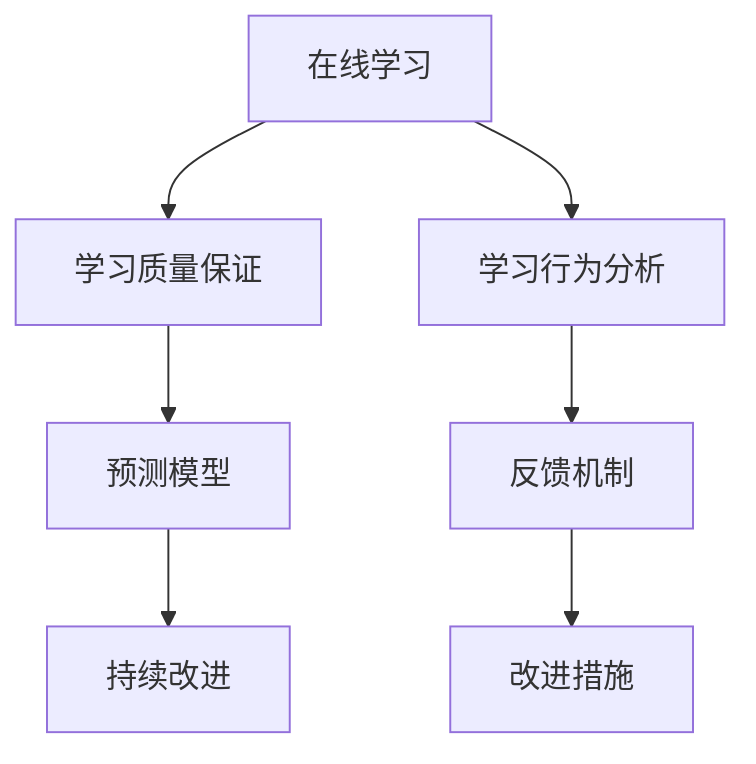

                 

# 大量输出:管理者学习质量的保证

> 关键词：管理者,学习质量,保证,教育技术,在线课程,质量控制,人工智能,大数据,分析,预测模型,持续改进

## 1. 背景介绍

### 1.1 问题由来
在当今快速变化的商业环境中，管理者需要不断学习和适应新知识，以保持竞争力和创新能力。然而，传统的学习方式往往效率低下，难以保证学习的质量和效果。随着教育技术和大数据的发展，基于在线课程和数据分析的学习质量保证方法应运而生，能够帮助管理者高效、有质量地完成学习。

### 1.2 问题核心关键点
本论文聚焦于如何通过大规模数据分析和人工智能技术，对在线课程学习质量进行有效评估和保证。通过建立基于学习行为的预测模型，能够及时发现学习中的问题，并进行反馈和改进。以下问题将作为研究的中心：
- 如何定义和管理在线学习质量？
- 如何利用人工智能和大数据技术提升学习质量？
- 如何建立和评估学习质量保证模型？

## 2. 核心概念与联系

### 2.1 核心概念概述

为更好地理解本研究的核心概念，本节将介绍几个密切相关的核心概念：

- **在线学习(Learning at Scale)**：指通过在线平台（如MOOCs）进行大规模、分布式学习的实践。这种方式不仅提供灵活的学习时间，还能覆盖全球的学习者，是当前教育的主流形式之一。
- **学习质量(Learning Quality)**：指在线学习过程中的有效性、可靠性、效率和可持续性等指标的综合体现。高质量的学习可以显著提高管理者的知识掌握和应用能力。
- **学习质量保证(Learning Quality Assurance, LQA)**：指通过系统化的管理和技术手段，对在线学习质量进行持续监控和改进的过程。LQA的核心目标是通过数据驱动的决策支持，确保学习者的学习效果。
- **预测模型(Predictive Modeling)**：指通过历史数据建立模型，预测未来事件或行为的概率。在LQA中，预测模型可用于预测学习者的学习效果和行为。
- **持续改进(Continuous Improvement)**：指在反馈和数据驱动的基础上，不断优化学习过程和资源，提升学习效果和效率。

这些概念之间的逻辑关系可以通过以下Mermaid流程图来展示：



这个流程图展示了大规模在线学习中的关键流程和环节：

1. 在线学习提供灵活的学习方式，覆盖大量学习者。
2. 学习质量保证通过预测模型和数据分析，对学习效果进行监控和改进。
3. 预测模型基于学习行为分析，预测学习者的学习效果和行为。
4. 持续改进通过反馈机制和改进措施，优化学习过程和资源。

## 3. 核心算法原理 & 具体操作步骤

### 3.1 算法原理概述

基于在线课程的学习质量保证，本质上是一个系统化的数据分析和人工智能问题。其核心思想是：通过对学习行为和大数据分析，建立预测模型，预测学习者的学习效果和行为，并根据预测结果进行持续改进。

具体而言，可以分为以下几步：

1. **数据收集**：收集在线课程中的学习数据，包括学习时间、完成度、考试成绩等。
2. **特征工程**：对收集到的数据进行预处理和特征提取，以便用于后续的模型训练。
3. **模型建立**：建立预测模型，如随机森林、神经网络等，用于预测学习者的学习效果和行为。
4. **结果分析**：根据预测模型的输出结果，对学习者的学习效果进行评估，识别学习中的问题。
5. **改进措施**：针对识别出的问题，采取相应的改进措施，如个性化辅导、调整课程内容等。
6. **迭代优化**：持续收集学习数据和改进结果，不断优化预测模型和改进措施，提升学习质量。

### 3.2 算法步骤详解

以下详细讲解基于在线课程的学习质量保证的算法步骤：

#### 3.2.1 数据收集

学习数据是质量保证的基础，需要覆盖学习过程的各个方面，包括但不限于：

- **学习行为数据**：学习时间、登录次数、观看视频时长、完成作业次数等。
- **学习效果数据**：考试成绩、课程评价、项目作业评分等。
- **学习者特征数据**：学习者的人口统计信息、背景知识水平、职业背景等。

#### 3.2.2 特征工程

特征工程是数据准备的重要环节，主要包括以下几个步骤：

- **数据清洗**：处理缺失值、异常值等数据问题。
- **特征提取**：从原始数据中提取有意义的特征，如学习时间、作业完成率等。
- **特征归一化**：对特征进行归一化处理，使其在模型中具有相同的权重。
- **特征选择**：选择对学习效果有显著影响的特征，减少模型复杂度。

#### 3.2.3 模型建立

预测模型的建立是学习质量保证的核心。通过选择合适的算法和模型，可以对学习效果和行为进行预测，常用的算法包括：

- **随机森林(Random Forest)**：通过集成多个决策树，提高模型的鲁棒性和准确性。
- **神经网络(Neural Network)**：通过多层网络结构，能够捕捉复杂的学习关系。
- **支持向量机(Support Vector Machine, SVM)**：通过核函数，能够处理高维数据。

#### 3.2.4 结果分析

预测模型的输出结果可以用于评估学习者的学习效果和行为，具体分析包括以下几个方面：

- **学习效果评估**：通过预测模型对学习者的考试成绩、作业评分等进行预测，并与实际结果进行比较。
- **学习行为分析**：通过预测模型对学习者的登录次数、观看时长等行为进行预测，识别学习过程中的问题。
- **学习者分类**：通过预测模型对学习者的学习效果和行为进行分类，识别需要重点关注的学习者。

#### 3.2.5 改进措施

根据预测模型的输出结果，可以采取相应的改进措施，包括：

- **个性化辅导**：对学习效果不佳的学习者提供个性化的辅导和支持。
- **调整课程内容**：根据学习者的学习行为和效果，调整课程内容和难度。
- **优化学习路径**：根据学习者的学习进度和理解程度，推荐合适的学习路径和资源。

#### 3.2.6 迭代优化

持续收集学习数据和改进结果，不断优化预测模型和改进措施，提升学习质量，具体包括：

- **反馈循环**：定期收集学习数据和改进措施的效果，进行反馈和迭代。
- **模型更新**：根据新的数据和改进措施的效果，定期更新预测模型。
- **改进评估**：对改进措施的效果进行评估，确认其有效性和可操作性。

### 3.3 算法优缺点

基于在线课程的学习质量保证具有以下优点：

- **数据驱动**：通过数据分析和预测模型，能够及时发现学习中的问题，并进行有针对性的改进。
- **灵活性高**：在线学习提供了灵活的学习时间和地点，适应不同学习者的需求。
- **可扩展性**：基于在线平台的学习可以覆盖大量学习者，提升学习效率和效果。

然而，该方法也存在一定的局限性：

- **数据质量**：学习数据的质量和完整性直接影响预测模型的效果。
- **模型复杂性**：预测模型的复杂性需要较高的计算资源和技术水平。
- **用户隐私**：学习数据的收集和分析可能涉及用户隐私问题，需要严格的隐私保护措施。

尽管存在这些局限性，但基于在线课程的学习质量保证方法在提高学习效率和效果方面具有显著优势，是当前教育技术发展的重要方向。

### 3.4 算法应用领域

基于在线课程的学习质量保证方法可以应用于多个教育领域，以下是几个典型的应用场景：

- **企业培训**：通过在线课程平台，企业可以对员工进行大规模的技能培训，提升其工作能力和业务水平。
- **高校教育**：高校可以通过在线课程和平台，提供灵活的学习资源，提升学生的学习效果和满意度。
- **远程教育**：远程教育平台可以利用在线课程和预测模型，优化学习路径和资源，提高学习效果和效率。

## 4. 数学模型和公式 & 详细讲解 & 举例说明

### 4.1 数学模型构建

本节将使用数学语言对基于在线课程的学习质量保证方法进行更加严格的刻画。

设在线课程中第$i$个学习者的数据为$\mathbf{x}_i = [x_{i1}, x_{i2}, ..., x_{in}]$，其中$x_{ij}$为第$i$个学习者在第$j$个特征上的值，如学习时间、完成度等。设学习效果的预测标签为$y_i$，可能的取值包括及格、不合格等。

定义学习效果预测模型为$f(\mathbf{x}_i; \theta)$，其中$\theta$为模型参数。预测模型的损失函数为：

$$
L(y_i, f(\mathbf{x}_i; \theta)) = \frac{1}{N} \sum_{i=1}^N \ell(y_i, f(\mathbf{x}_i; \theta))
$$

其中$\ell$为损失函数，如均方误差、交叉熵等。

### 4.2 公式推导过程

以下我们将以线性回归模型为例，推导预测模型的公式及其梯度计算。

假设预测模型为线性回归模型，形式为：

$$
f(\mathbf{x}_i; \theta) = \theta_0 + \theta_1 x_{i1} + \theta_2 x_{i2} + ... + \theta_n x_{in}
$$

其损失函数为均方误差：

$$
\ell(y_i, f(\mathbf{x}_i; \theta)) = (y_i - f(\mathbf{x}_i; \theta))^2
$$

对损失函数求导，得：

$$
\frac{\partial L(y_i, f(\mathbf{x}_i; \theta))}{\partial \theta_j} = -2(y_i - f(\mathbf{x}_i; \theta)) \frac{\partial f(\mathbf{x}_i; \theta)}{\partial \theta_j}
$$

代入$f(\mathbf{x}_i; \theta)$，得：

$$
\frac{\partial L(y_i, f(\mathbf{x}_i; \theta))}{\partial \theta_j} = -2(y_i - \theta_0 - \sum_{k=1}^n \theta_k x_{ik})x_{ij}
$$

因此，模型的梯度更新公式为：

$$
\theta_j \leftarrow \theta_j - \eta \frac{\partial L(y_i, f(\mathbf{x}_i; \theta))}{\partial \theta_j}
$$

其中$\eta$为学习率。

### 4.3 案例分析与讲解

假设有一门编程课程，共100名学习者参与，每个学习者提供的学习数据包括学习时间、完成作业次数、考试成绩等。通过对这些数据进行特征工程和模型训练，建立预测模型，用于预测学习者的考试成绩。

首先，对学习数据进行预处理和特征提取，得到特征矩阵$X$和标签向量$Y$。然后，使用随机森林算法训练预测模型，并使用交叉验证法评估模型效果。最终，预测模型可以对新学习者的考试成绩进行预测，并根据预测结果进行反馈和改进。

## 5. 项目实践：代码实例和详细解释说明

### 5.1 开发环境搭建

在进行学习质量保证实践前，我们需要准备好开发环境。以下是使用Python进行PyTorch开发的环境配置流程：

1. 安装Anaconda：从官网下载并安装Anaconda，用于创建独立的Python环境。

2. 创建并激活虚拟环境：
```bash
conda create -n pytorch-env python=3.8 
conda activate pytorch-env
```

3. 安装PyTorch：根据CUDA版本，从官网获取对应的安装命令。例如：
```bash
conda install pytorch torchvision torchaudio cudatoolkit=11.1 -c pytorch -c conda-forge
```

4. 安装Pandas：用于数据处理和分析。
```bash
pip install pandas
```

5. 安装Scikit-learn：用于机器学习模型的训练和评估。
```bash
pip install scikit-learn
```

完成上述步骤后，即可在`pytorch-env`环境中开始学习质量保证实践。

### 5.2 源代码详细实现

下面我们以预测学生考试成绩为例，给出使用PyTorch进行学习质量保证的PyTorch代码实现。

首先，定义数据处理函数：

```python
import pandas as pd
from sklearn.model_selection import train_test_split
from sklearn.preprocessing import StandardScaler
from torch.utils.data import Dataset
import torch

class StudentDataset(Dataset):
    def __init__(self, df, target, scaler=None):
        self.df = df
        self.target = target
        self.scaler = scaler
        
    def __len__(self):
        return len(self.df)
    
    def __getitem__(self, index):
        data = self.df.iloc[index].to_dict()
        features = [data[col] for col in self.df.columns if col != self.target]
        target = data[self.target]
        if self.scaler:
            features = [self.scaler.transform([features])[0]]
        return torch.tensor(features), torch.tensor(target)

# 读取数据
df = pd.read_csv('student_data.csv')

# 数据预处理
features = df.columns[:-1]
target = df.columns[-1]
X = df[features]
y = df[target]
scaler = StandardScaler()
X_scaled = scaler.fit_transform(X)
X_scaled = pd.DataFrame(X_scaled, columns=features)

# 数据划分
X_train, X_test, y_train, y_test = train_test_split(X_scaled, y, test_size=0.2, random_state=42)
train_dataset = StudentDataset(X_train, y_train, scaler)
test_dataset = StudentDataset(X_test, y_test, scaler)
```

然后，定义模型和优化器：

```python
from torch.nn import Linear, ReLU, MeanSquaredError
from torch.optim import Adam

# 定义线性回归模型
model = Linear(len(features), 1)

# 定义损失函数
criterion = MeanSquaredError()

# 定义优化器
optimizer = Adam(model.parameters(), lr=0.01)
```

接着，定义训练和评估函数：

```python
import torch.nn.functional as F

def train_epoch(model, dataset, optimizer, criterion):
    model.train()
    for batch in dataset:
        features, target = batch
        optimizer.zero_grad()
        output = model(features)
        loss = criterion(output, target)
        loss.backward()
        optimizer.step()
    return loss.item() / len(dataset)

def evaluate(model, dataset, criterion):
    model.eval()
    total_loss = 0
    for batch in dataset:
        features, target = batch
        output = model(features)
        loss = criterion(output, target)
        total_loss += loss.item()
    return total_loss / len(dataset)

# 训练模型
epochs = 100
for epoch in range(epochs):
    train_loss = train_epoch(model, train_dataset, optimizer, criterion)
    print(f'Epoch {epoch+1}, train loss: {train_loss:.4f}')
    
    test_loss = evaluate(model, test_dataset, criterion)
    print(f'Epoch {epoch+1}, test loss: {test_loss:.4f}')

# 预测新数据
new_data = [[5, 20, 90], [6, 15, 80]]
new_data_scaled = scaler.transform(new_data)
new_data_scaled = pd.DataFrame(new_data_scaled, columns=features)
new_data_tensor = torch.tensor(new_data_scaled)
new_output = model(new_data_tensor)
print(new_output.item())
```

以上就是使用PyTorch对学生考试成绩预测的完整代码实现。可以看到，利用Pandas、Sklearn和PyTorch等工具，我们可以相对简洁地实现学习质量保证的预测模型。

### 5.3 代码解读与分析

让我们再详细解读一下关键代码的实现细节：

**StudentDataset类**：
- `__init__`方法：初始化数据集，包括特征、标签和归一化器等。
- `__len__`方法：返回数据集的样本数量。
- `__getitem__`方法：对单个样本进行处理，将样本转换为模型所需的输入。

**数据预处理**：
- 使用Pandas读取数据，并进行数据预处理，包括特征选择和标准化。

**模型和损失函数**：
- 使用PyTorch定义线性回归模型和均方误差损失函数，并初始化优化器。

**训练和评估函数**：
- 使用PyTorch的DataLoader对数据集进行批次化加载，供模型训练和推理使用。
- 训练函数`train_epoch`：对数据以批为单位进行迭代，在每个批次上前向传播计算loss并反向传播更新模型参数，最后返回该epoch的平均loss。
- 评估函数`evaluate`：与训练类似，不同点在于不更新模型参数，并在每个batch结束后将预测和标签结果存储下来，最后使用均方误差计算整个评估集的平均loss。

**训练流程**：
- 定义总的epoch数和批大小，开始循环迭代
- 每个epoch内，先在训练集上训练，输出平均loss
- 在测试集上评估，输出平均loss
- 重复上述步骤直至模型收敛

可以看到，利用Pandas、Sklearn和PyTorch等工具，我们能够高效地实现预测模型的训练和评估。开发者可以将更多精力放在数据处理、模型改进等高层逻辑上，而不必过多关注底层的实现细节。

## 6. 实际应用场景

### 6.1 企业培训

基于在线课程的学习质量保证方法，可以广泛应用于企业培训的评估和优化。企业通过大规模在线课程平台，对员工进行技能培训，期望其能够在工作中应用所学知识，提升业务水平和工作效率。

在技术实现上，企业可以通过学习行为数据分析，建立预测模型，评估员工的学习效果和行为。根据预测结果，对学习效果不佳的员工提供个性化辅导和支持，调整课程内容，优化学习路径和资源，从而提升培训效果。

### 6.2 高校教育

高校可以通过在线课程平台，为学生提供灵活的学习资源，提升其学习效果和满意度。学习质量保证方法可以帮助高校评估学生的学习效果和行为，识别学习中的问题，并采取相应的改进措施。

例如，通过分析学生的登录次数、观看时长等行为数据，高校可以评估学生的学习投入和效果。对于学习效果不佳的学生，高校可以提供个性化辅导和支持，调整课程难度，推荐合适的学习路径和资源，从而提升学生的学习效果。

### 6.3 远程教育

远程教育平台可以利用在线课程和预测模型，优化学习路径和资源，提高学习效果和效率。学习质量保证方法可以帮助平台评估学生的学习效果和行为，识别学习中的问题，并采取相应的改进措施。

例如，平台可以通过分析学生的登录次数、观看时长等行为数据，评估学生的学习效果。对于学习效果不佳的学生，平台可以提供个性化辅导和支持，调整课程难度，推荐合适的学习路径和资源，从而提升学生的学习效果。

### 6.4 未来应用展望

随着在线课程的普及和大数据技术的发展，基于学习行为数据分析的学习质量保证方法将得到更广泛的应用。未来，该方法将能够更加灵活地应用于各种教育场景，提升学习效率和效果，加速知识传播和技能提升。

在大规模在线教育中，学习质量保证方法将能够实时监控和改进学习效果，提供个性化的学习支持和资源推荐。随着技术的不断进步，该方法将能够更好地应对学习者多样化的需求，提供更加精准、高效的学习体验。

此外，随着人工智能和大数据分析技术的发展，学习质量保证方法也将得到更广泛的应用。未来，该方法将能够更好地结合智能辅导系统、个性化推荐系统等技术，为学习者提供更加全面的学习支持和服务。

## 7. 工具和资源推荐

### 7.1 学习资源推荐

为了帮助开发者系统掌握学习质量保证的理论基础和实践技巧，这里推荐一些优质的学习资源：

1. 《数据科学基础》：这是一门由Coursera提供的免费课程，介绍了数据科学的基础知识和技能，包括数据预处理、特征工程、模型选择等。
2. 《机器学习实战》：这是一本由Peter Harrington撰写的经典书籍，介绍了机器学习的基本概念和算法，包括监督学习、无监督学习、深度学习等。
3. Kaggle：这是一个著名的数据科学竞赛平台，提供了大量公开的数据集和竞赛项目，可以帮助开发者锻炼数据分析和建模技能。
4. GitHub：这是一个著名的代码托管平台，提供了大量的开源机器学习项目和代码示例，可以帮助开发者学习和应用机器学习算法。

通过对这些资源的学习实践，相信你一定能够快速掌握学习质量保证的精髓，并用于解决实际的学习问题。

### 7.2 开发工具推荐

高效的开发离不开优秀的工具支持。以下是几款用于学习质量保证开发的常用工具：

1. Python：作为一种流行的编程语言，Python拥有丰富的数据科学和机器学习库，如Pandas、Sklearn、TensorFlow等。
2. PyTorch：基于Python的开源深度学习框架，灵活动态的计算图，适合快速迭代研究。
3. Scikit-learn：由Python开发的开源机器学习库，提供了丰富的机器学习算法和工具。
4. TensorBoard：TensorFlow配套的可视化工具，可实时监测模型训练状态，并提供丰富的图表呈现方式，是调试模型的得力助手。
5. Jupyter Notebook：一个交互式的开发环境，支持Python代码的运行和展示，适合数据科学和机器学习任务。

合理利用这些工具，可以显著提升学习质量保证任务的开发效率，加快创新迭代的步伐。

### 7.3 相关论文推荐

学习质量保证技术的发展源于学界的持续研究。以下是几篇奠基性的相关论文，推荐阅读：

1. "Learning to Recommend: A Data-Driven Approach"：由Wu et al.在SIGIR 2009上提出的基于学习行为推荐的方法，为后续学习质量保证研究提供了重要参考。
2. "Predicting Achievement Scores in Learning Analytics: A Comparative Study of Multivariate Methods"：由Ganster et al.在IEEE Trans. Learning Technologies 2015上提出的基于预测模型的学习效果评估方法，为后续研究提供了重要思路。
3. "An Overview of Online Learning Quality Assurance (LQA) Approaches"：由Xu et al.在IEEE Trans. Learning Technologies 2020上提出的在线学习质量保证方法综述，为学习者提供了全面的参考。
4. "A Systematic Literature Review on Personalized Learning Analytics in Higher Education"：由De Bruijn et al.在IEEE Trans. Learning Technologies 2021上提出的个性化学习分析综述，为学习者提供了丰富的研究背景。

这些论文代表了大规模在线学习质量保证技术的发展脉络。通过学习这些前沿成果，可以帮助研究者把握学科前进方向，激发更多的创新灵感。

## 8. 总结：未来发展趋势与挑战

### 8.1 总结

本文对基于在线课程的学习质量保证方法进行了全面系统的介绍。首先阐述了学习质量保证的背景和意义，明确了在线学习质量保证的核心目标和关键技术。其次，从原理到实践，详细讲解了学习质量保证的数学模型和算法步骤，给出了学习质量保证任务开发的完整代码实例。同时，本文还广泛探讨了学习质量保证方法在企业培训、高校教育、远程教育等多个领域的应用前景，展示了学习质量保证范式的巨大潜力。

通过本文的系统梳理，可以看到，基于在线课程的学习质量保证方法正在成为教育技术发展的重要方向，极大地提高了在线学习的质量和效果，为教育领域的智能化转型提供了重要保障。

### 8.2 未来发展趋势

展望未来，学习质量保证技术将呈现以下几个发展趋势：

1. **智能辅导系统的融合**：结合智能辅导系统，提供个性化的学习支持和资源推荐，提升学习效果和效率。
2. **多模态数据的整合**：融合视觉、语音、文本等多模态数据，提高学习行为和效果分析的准确性。
3. **动态调整机制的引入**：引入动态调整机制，根据学习效果和行为，实时调整学习路径和资源，提升学习效果。
4. **跨学科技术的融合**：结合心理学、教育学、数据科学等多学科知识，提升学习质量保证的效果和精度。
5. **可解释性的增强**：增强学习质量保证的透明度和可解释性，帮助学习者理解模型的决策过程，提高学习效果和满意度。

这些趋势将进一步提升学习质量保证技术的智能化和精准化水平，为在线教育和培训提供更加全面和高效的支持。

### 8.3 面临的挑战

尽管学习质量保证技术已经取得了显著成果，但在应用过程中仍面临诸多挑战：

1. **数据隐私和安全**：学习数据涉及用户隐私和敏感信息，需要严格的隐私保护和安全措施。
2. **数据质量问题**：学习数据的准确性和完整性直接影响预测模型的效果。
3. **模型复杂性和计算资源**：建立和训练预测模型需要较高的计算资源和技术水平。
4. **个性化需求的满足**：学习者的个性化需求多样化，需要更灵活和高效的学习质量保证机制。

尽管存在这些挑战，但学习质量保证技术在提升在线学习效果方面具有显著优势，是当前教育技术发展的重要方向。未来，需要从数据隐私、数据质量、模型复杂性等多个方面进行全面优化，才能进一步提升学习质量保证的效果和精度。

### 8.4 研究展望

面向未来，学习质量保证技术需要在以下几个方面寻求新的突破：

1. **智能辅导系统的优化**：结合智能辅导系统，提供更加精准和个性化的学习支持和资源推荐。
2. **多模态数据的整合**：融合视觉、语音、文本等多模态数据，提高学习行为和效果分析的准确性。
3. **动态调整机制的引入**：引入动态调整机制，根据学习效果和行为，实时调整学习路径和资源，提升学习效果。
4. **跨学科技术的融合**：结合心理学、教育学、数据科学等多学科知识，提升学习质量保证的效果和精度。
5. **可解释性的增强**：增强学习质量保证的透明度和可解释性，帮助学习者理解模型的决策过程，提高学习效果和满意度。

这些研究方向将引领学习质量保证技术迈向更高的台阶，为在线教育和培训提供更加全面和高效的支持。

## 9. 附录：常见问题与解答

**Q1：学习质量保证方法适用于所有在线课程吗？**

A: 学习质量保证方法在大多数在线课程中都能取得较好的效果，特别是对于学生人数较多、学习任务复杂的课程。但对于一些特定的课程，如实验课、动手课等，可能更依赖于教师的实时指导和反馈，此时可能需要结合人工干预和指导。

**Q2：学习质量保证方法需要大量的学习数据吗？**

A: 学习质量保证方法需要一定的学习数据支持，但并不需要大量的数据。在实际应用中，可以通过简单的样本数据训练预测模型，并进行效果评估和改进。随着数据的积累，模型效果会逐渐提升。

**Q3：学习质量保证方法对学习者的隐私有影响吗？**

A: 学习质量保证方法涉及学习数据的收集和分析，可能涉及学习者的隐私问题。需要采用严格的隐私保护措施，如数据匿名化、访问控制等，确保数据安全和隐私保护。

**Q4：如何评估学习质量保证方法的效果？**

A: 学习质量保证方法的效果可以通过预测模型的准确性和学习者的反馈进行评估。具体而言，可以比较预测模型的输出结果与实际结果的差异，评估学习者的学习效果和行为，并根据反馈进行调整和改进。

**Q5：学习质量保证方法与其他教育技术有何区别？**

A: 学习质量保证方法与传统的教育技术相比，具有以下几个显著区别：
- **数据驱动**：通过数据分析和预测模型，能够及时发现学习中的问题，并进行有针对性的改进。
- **灵活性高**：在线学习提供了灵活的学习时间和地点，适应不同学习者的需求。
- **可扩展性**：基于在线平台的学习可以覆盖大量学习者，提升学习效率和效果。

总之，学习质量保证方法通过数据驱动和智能分析，能够更好地提升在线学习的效果和质量，为学习者提供更加个性化和高效的学习支持。

---

作者：禅与计算机程序设计艺术 / Zen and the Art of Computer Programming

