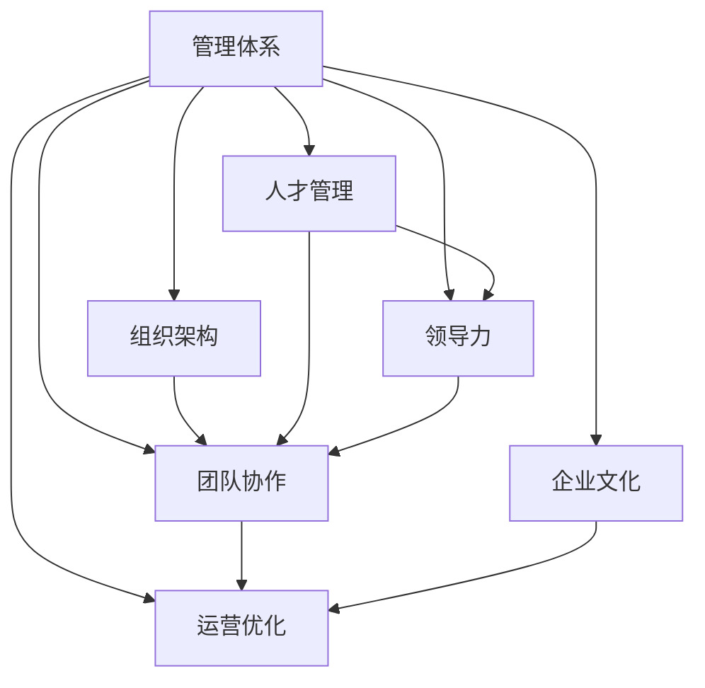

                 

# 好的管理者和普通管理者的差距：体系的重要性

> 关键词：管理体系,组织架构,人才管理,领导力,团队协作,企业文化,运营优化

## 1. 背景介绍

### 1.1 问题由来

在当前快速变化的企业环境中，管理者如何带领团队实现高效运作和持续增长，成为了一项至关重要的任务。然而，不少管理者往往陷入繁琐的日常事务中，难以抽身构建和完善管理体系，导致团队运作效率低下，士气低落。如何从普通管理者蜕变为卓越管理者，成为困扰很多领导者的难题。本文将详细探讨卓越管理者与普通管理者在管理体系构建上的差距，揭示其背后的原因，并提供实用的建议和案例分析。

### 1.2 问题核心关键点

本文聚焦于以下核心关键点，通过对其深入剖析，帮助管理者更好地理解和构建高效管理体系：

- 管理体系的定义与作用
- 组织架构的设计与优化
- 人才管理的策略与方法
- 领导力的培养与提升
- 团队协作的机制与实践
- 企业文化建设的重要性
- 运营优化的手段与工具

通过理解这些关键点，管理者可以系统地构建管理体系，提升团队的整体效能和竞争力，实现企业的长远发展。

## 2. 核心概念与联系

### 2.1 核心概念概述

为更好地理解管理体系的构建，本节将介绍几个密切相关的核心概念：

- **管理体系**：指企业为实现战略目标和运营效率，所制定的全面的、系统化的管理方案和执行流程，包括组织架构、人才管理、领导力、团队协作、企业文化等多个方面。

- **组织架构**：指企业的层级结构、部门设置和职责分工，是管理体系的基础。良好的组织架构能够确保信息流畅、决策迅速。

- **人才管理**：指对企业中的人才进行招募、培养、激励和保留的过程，是管理体系的核心。优秀的人才管理能够最大化人力资源的价值。

- **领导力**：指管理者运用影响力引导和激励团队成员，以实现共同目标的能力。领导力是管理体系的灵魂。

- **团队协作**：指团队成员间相互合作，共同完成任务的过程。良好的团队协作能够提升工作效率，增强团队凝聚力。

- **企业文化**：指企业内部共享的价值观、信念和行为准则，是管理体系的精神支柱。健康的企业文化能够塑造积极的工作氛围。

- **运营优化**：指通过改进流程、提高效率、降低成本等手段，实现企业运营的精益化管理。

这些核心概念之间的逻辑关系可以通过以下Mermaid流程图来展示：



这个流程图展示了大语言模型的核心概念及其之间的关系：

1. 管理体系通过组织架构、人才管理、领导力、团队协作、企业文化和运营优化等多个方面构建，以实现企业的战略目标。
2. 组织架构、人才管理、领导力和团队协作共同支撑管理体系的运转，确保信息的流畅和决策的迅速。
3. 企业文化和运营优化对管理体系的效率和稳定性起到促进和提升的作用。

## 3. 核心算法原理 & 具体操作步骤
### 3.1 算法原理概述

管理体系的构建，本质上是一个系统的、动态的管理过程，涉及到组织结构、流程设计、人员配置、绩效评估等多个维度。其核心原理包括：

- **系统化管理**：通过科学的规划和设计，构建全面的管理体系，确保各环节协同运作。
- **动态调整**：根据企业内外环境的变化，不断优化和调整管理体系，保持其活力和适应性。
- **持续改进**：通过持续的反馈和迭代，不断提升管理体系的效率和效果。

### 3.2 算法步骤详解

管理体系的构建过程可以分为以下几个关键步骤：

**Step 1: 明确企业战略和目标**
- 分析企业的内外部环境，明确企业的战略目标和核心价值。
- 制定具体的业务目标和运营指标，为管理体系的设计提供依据。

**Step 2: 设计组织架构**
- 根据业务需求和目标，设计合理的层级结构、部门设置和职责分工。
- 确保组织架构的扁平化、职能化和模块化，提升信息流通和决策效率。

**Step 3: 构建人才管理体系**
- 制定人才招募、培训、激励和保留策略，吸引和留住优秀人才。
- 实施绩效评估和职业发展规划，促进人才的持续成长。

**Step 4: 培养和提升领导力**
- 建立系统的领导力培训和评估机制，培养高素质的领导者。
- 通过领导力的实践和应用，提升管理者的影响力。

**Step 5: 推动团队协作**
- 制定团队协作机制，确保跨部门、跨职能的协作顺利进行。
- 实施团队建设和团队活动，增强团队的凝聚力和执行力。

**Step 6: 塑造企业文化**
- 明确企业的核心价值观和行为准则，塑造积极向上的企业文化。
- 通过培训和宣传，确保企业文化在企业内部得到广泛认同和践行。

**Step 7: 实现运营优化**
- 分析企业的运营流程，识别瓶颈和改进点。
- 应用先进的管理工具和方法，实现流程优化和成本控制。

### 3.3 算法优缺点

管理体系的构建方法具有以下优点：

- **系统性**：通过科学的设计和规划，能够全面提升企业的管理水平。
- **灵活性**：能够根据企业的实际情况和环境变化进行动态调整，保持体系的活力。
- **可持续性**：通过持续的反馈和改进，确保管理体系的长期有效。

同时，该方法也存在一些局限性：

- **实施难度**：设计和实施管理体系需要投入大量资源和时间。
- **复杂度**：管理体系的设计和调整较为复杂，需要专业知识和管理经验。
- **成本较高**：需要投入一定的资金和人力进行管理体系的构建和优化。

尽管存在这些局限性，但就目前而言，构建和优化管理体系仍是大中型企业提升管理效能的重要手段。管理者需综合考虑，平衡成本和效益，选择合适的方法进行实践。

### 3.4 算法应用领域

管理体系的构建和优化方法，广泛应用于以下多个领域：

- **企业运营管理**：通过优化流程和提高效率，实现企业的精益化管理。
- **人力资源管理**：通过科学的招聘、培训、绩效评估和职业发展，最大化人力资源的效能。
- **战略管理**：通过制定和实施企业战略，确保企业发展方向和目标的一致性。
- **市场营销**：通过建立市场调研和品牌管理机制，提升企业的市场竞争力。
- **产品管理**：通过优化产品设计和流程，提升产品的市场适应性和用户满意度。
- **服务管理**：通过提高服务质量和管理水平，增强企业的市场竞争力。

除了上述这些领域外，管理体系的构建和优化方法，还可以应用于各类中小型企业、创业公司等不同规模的组织中，帮助其提升管理效能，实现持续增长。

## 4. 数学模型和公式 & 详细讲解 & 举例说明
### 4.1 数学模型构建

管理体系的设计和优化，涉及多个维度的量化和评估。这里我们以绩效评估为例，构建数学模型。

假设企业有N个部门，每个部门的绩效指标为Xi，其中i=1,...,N。设定每个部门的目标绩效为Ti，则绩效评估的数学模型为：

$$
\text{总绩效} = \sum_{i=1}^{N} f_i(X_i, T_i)
$$

其中，$f_i$为第i个部门的绩效评估函数。例如，部门绩效可以基于销售额、利润率、市场份额等指标进行评估。

### 4.2 公式推导过程

以部门绩效的线性回归模型为例，推导其公式。假设部门绩效Xi与目标绩效Ti之间存在线性关系，可以表示为：

$$
X_i = a_i + b_i T_i + \epsilon_i
$$

其中，$b_i$为部门i的回归系数，$\epsilon_i$为随机误差项。求解$b_i$可以使用最小二乘法，即：

$$
\hat{b}_i = \frac{\sum_{i=1}^{N} (X_i - \bar{X}) (T_i - \bar{T})}{\sum_{i=1}^{N} (T_i - \bar{T})^2}
$$

其中，$\bar{X}$和$\bar{T}$分别为部门绩效和目标绩效的平均值。

### 4.3 案例分析与讲解

假设某企业有销售和生产两个部门，其目标绩效分别为500万元和300万元。根据历史数据，分别求得两个部门的回归系数$b_s=0.6$和$b_p=0.4$。

则销售部门的实际绩效为：

$$
X_s = 0.6T_s + \epsilon_s = 0.6 \times 500 + \epsilon_s
$$

生产部门的实际绩效为：

$$
X_p = 0.4T_p + \epsilon_p = 0.4 \times 300 + \epsilon_p
$$

根据上式，可以计算出两个部门的实际绩效和误差，进而评估其绩效表现。

## 5. 项目实践：代码实例和详细解释说明
### 5.1 开发环境搭建

在进行绩效评估系统开发前，我们需要准备好开发环境。以下是使用Python进行数据分析和可视化的环境配置流程：

1. 安装Anaconda：从官网下载并安装Anaconda，用于创建独立的Python环境。

2. 创建并激活虚拟环境：
```bash
conda create -n py-env python=3.8 
conda activate py-env
```

3. 安装所需的Python库：
```bash
conda install pandas numpy matplotlib scikit-learn seaborn jupyter notebook ipython
```

完成上述步骤后，即可在`py-env`环境中开始开发实践。

### 5.2 源代码详细实现

下面我们以销售和生产部门绩效评估为例，给出使用Python进行回归分析的代码实现。

首先，准备数据集：

```python
import pandas as pd
from sklearn.linear_model import LinearRegression

# 读取数据集
data = pd.read_csv('sales_and_production.csv')

# 数据清洗和处理
sales = data[data['Department'] == 'Sales']
production = data[data['Department'] == 'Production']

# 转换数据格式
sales['X'] = sales['Sales'].apply(lambda x: x - 500)
sales['T'] = sales['Sales'].apply(lambda x: x - 500)
production['X'] = production['Profit'].apply(lambda x: x - 300)
production['T'] = production['Profit'].apply(lambda x: x - 300)

# 创建模型并拟合数据
sales_model = LinearRegression().fit(sales[['T']], sales[['X']])
production_model = LinearRegression().fit(production[['T']], production[['X']])
```

然后，计算和可视化结果：

```python
# 预测实际绩效
sales_pred = sales_model.predict(sales[['T']])
production_pred = production_model.predict(production[['T']])

# 可视化结果
import matplotlib.pyplot as plt
plt.figure(figsize=(12, 6))
plt.subplot(1, 2, 1)
plt.scatter(sales['T'], sales['X'])
plt.plot(sales['T'], sales_pred, color='r', label='Sales Prediction')
plt.legend()
plt.subplot(1, 2, 2)
plt.scatter(production['T'], production['X'])
plt.plot(production['T'], production_pred, color='b', label='Production Prediction')
plt.legend()
plt.show()
```

最后，运行结果展示：

```python
# 显示预测结果
sales_pred.mean(), production_pred.mean()
```

以上就是使用Python进行销售和生产部门绩效评估的完整代码实现。可以看到，通过简单的线性回归模型，我们可以快速评估各部门的目标绩效完成情况，帮助企业优化管理。

### 5.3 代码解读与分析

让我们再详细解读一下关键代码的实现细节：

**数据预处理**：
- 使用Pandas库读取数据集，并进行数据清洗和转换，确保数据的正确性和一致性。

**模型拟合**：
- 使用sklearn库中的LinearRegression模型，对数据进行线性回归分析，得到回归系数$b$。
- 通过预测实际绩效，评估模型的拟合效果。

**可视化展示**：
- 使用Matplotlib库进行数据可视化，展示模型预测结果与实际数据的拟合情况。
- 通过散点图和拟合直线，直观展示模型的预测精度和误差。

**结果展示**：
- 输出销售和生产部门预测绩效的平均值，评估其绩效表现的总体水平。

可以看到，通过线性回归模型，我们可以快速高效地评估企业的绩效表现，找出管理中的问题和改进方向。这为管理者提供了科学、量化的管理依据，有助于优化决策和提升管理效能。

## 6. 实际应用场景
### 6.1 人力资源管理

人力资源管理是企业管理体系中的重要组成部分。通过对员工绩效的科学评估，企业可以优化人才配置，提升人力资源的利用效率。

具体而言，可以建立员工绩效评估体系，通过定期的绩效考核和反馈，识别高绩效员工和潜力人才，为培训和晋升提供依据。同时，还可以根据绩效评估结果，进行薪酬激励、职业发展规划和人员调整，最大化人力资源的价值。

### 6.2 战略管理

战略管理是企业管理体系中的核心环节。通过对企业的战略目标和运营绩效的科学评估，企业可以制定合理的战略规划和业务调整策略，确保企业的长期稳定发展。

具体而言，可以通过企业财务报表、市场调研报告等数据，进行战略评估和预测。根据评估结果，制定具体的业务目标和运营计划，优化资源配置和市场布局，提升企业的市场竞争力。

### 6.3 运营管理

运营管理是企业管理体系中的基础环节。通过对生产流程、物流管理等运营绩效的科学评估，企业可以实现精益化管理，提升运营效率和成本控制能力。

具体而言，可以建立运营绩效评估体系，通过数据分析和可视化，识别运营中的瓶颈和改进点。根据评估结果，优化生产流程、提高供应链效率、降低成本，提升企业的运营效能。

### 6.4 未来应用展望

随着企业管理体系的发展，未来的应用场景将会更加多样和复杂。以下是几个可能的发展方向：

1. **数字化管理**：利用大数据和人工智能技术，实现企业管理数据的全生命周期管理和智能分析，提升管理的精准度和效率。
2. **个性化管理**：根据员工的需求和行为，提供个性化的培训、激励和职业发展规划，提升员工的满意度和忠诚度。
3. **全球化管理**：实现跨国企业的管理体系统一和优化，提升国际业务的管理水平和竞争力。
4. **可持续发展管理**：通过环境、社会和治理(ESG)的评估和改进，提升企业的社会责任感和可持续发展能力。
5. **知识管理**：通过建立知识共享和应用机制，促进企业内部知识的积累和传播，提升企业的创新能力。

以上发展方向将进一步拓展企业管理体系的应用边界，为企业提供更加全面、科学、高效的管理方案。

## 7. 工具和资源推荐
### 7.1 学习资源推荐

为了帮助管理者系统掌握管理体系的构建方法，这里推荐一些优质的学习资源：

1. 《管理的常识》书籍：由管理学大师彼得·德鲁克所著，系统讲解了企业管理的基本概念和实践方法。
2. 《企业再造》课程：由哈佛商学院教授迈克尔·波特主讲，深入探讨了企业再造和企业战略管理的理论和方法。
3. 《领导力》课程：由谷歌前CEO埃里克·施密特主讲，讲解了领导力在企业管理中的重要性和培养方法。
4. 《数字化管理》书籍：由知名咨询公司麦肯锡撰写，介绍了数字化管理的方法和工具，帮助企业提升管理效能。
5. 《人工智能与企业管理》课程：由斯坦福大学主讲，介绍了人工智能技术在企业管理中的应用和实践。

通过对这些资源的学习实践，相信管理者一定能够系统地掌握管理体系的构建方法，提升企业管理的科学性和效率。

### 7.2 开发工具推荐

高效的开发离不开优秀的工具支持。以下是几款用于管理体系开发的常用工具：

1. Jupyter Notebook：基于Python的交互式编程环境，支持代码编写、数据可视化和文档编辑，方便进行科学分析和决策。
2. Tableau：商业智能可视化工具，能够对企业数据进行多维分析和可视化展示，帮助管理者做出科学决策。
3. Microsoft Power BI：强大的数据分析和报告工具，能够对企业数据进行实时监控和动态分析，提升管理效率。
4. SAP SuccessFactors：人力资源管理软件，提供全面的员工绩效管理、薪酬激励和职业发展规划功能，助力企业优化人才配置。
5. Salesforce：客户关系管理系统，提供全面的客户管理、销售和市场营销功能，帮助企业提升市场竞争力和客户满意度。
6. SharePoint：企业协作平台，提供文档共享、团队协作和知识管理功能，提升企业的内部沟通和效率。

合理利用这些工具，可以显著提升管理体系开发的效率和效果，助力企业管理者实现高效运作。

### 7.3 相关论文推荐

管理体系的构建和优化方法，源于学界的持续研究。以下是几篇奠基性的相关论文，推荐阅读：

1. 《战略管理：现代方法》书籍：由多位管理学大师联合撰写，系统介绍了战略管理的理论、方法和实践。
2. 《人力资源管理》课程：由哈佛商学院主讲，深入讲解了人力资源管理的基本概念和实践方法。
3. 《领导力与组织行为学》课程：由斯坦福大学主讲，讲解了领导力的理论、实践和应用。
4. 《绩效评估与激励机制》论文：研究了绩效评估的理论和实践方法，提出了基于数据驱动的绩效管理新思路。
5. 《管理科学与工程》期刊：涵盖管理科学与工程领域的最新研究成果，提供前沿的理论和方法。

这些论文代表了大管理体系的构建方法的发展脉络。通过学习这些前沿成果，可以帮助管理者把握学科前进方向，激发更多的创新灵感。

## 8. 总结：未来发展趋势与挑战
### 8.1 总结

本文对管理体系的构建方法和实践经验进行了全面系统的介绍。首先阐述了管理体系的定义与作用，明确了其对企业运营和战略管理的重要性。其次，从管理体系的设计、人才管理、领导力、团队协作、企业文化和运营优化等多个维度，详细讲解了管理体系的构建步骤和方法。同时，本文还探讨了管理体系在实际应用中的多个场景，展示了其广泛的应用价值。最后，本文提供了相关的学习资源和开发工具，帮助管理者提升管理体系构建和管理效能。

通过本文的系统梳理，可以看到，管理体系的构建和优化，对于企业的长期稳定发展和竞争力提升具有重要意义。管理者需系统地学习和实践管理体系的构建方法，结合企业的实际情况，科学设计和管理，才能真正实现企业的战略目标和运营效能。

### 8.2 未来发展趋势

展望未来，管理体系的构建和优化技术将呈现以下几个发展趋势：

1. **数字化转型**：利用大数据、人工智能等新兴技术，实现企业管理的数据化和智能化。
2. **个性化管理**：根据员工的个性化需求和行为，提供定制化的培训、激励和职业发展规划，提升员工满意度和忠诚度。
3. **全球化管理**：实现跨国企业的管理体系统一和优化，提升国际业务的管理水平和竞争力。
4. **可持续发展管理**：通过环境、社会和治理(ESG)的评估和改进，提升企业的社会责任感和可持续发展能力。
5. **知识管理**：通过建立知识共享和应用机制，促进企业内部知识的积累和传播，提升企业的创新能力。

这些发展趋势凸显了管理体系在数字化、个性化和全球化时代的重要性和紧迫性。未来的管理体系将更加注重科学性、灵活性和智能性，成为企业创新发展的重要支撑。

### 8.3 面临的挑战

尽管管理体系的构建和优化方法已经取得了一定的成就，但在迈向更加智能化、普适化应用的过程中，仍面临诸多挑战：

1. **实施难度**：管理体系的设计和调整较为复杂，需要专业知识和管理经验。
2. **成本较高**：需要投入一定的资金和人力进行管理体系的构建和优化。
3. **数据质量**：管理体系的构建需要大量高质量的数据支持，数据质量不足会影响评估结果。
4. **技术壁垒**：利用新兴技术进行管理体系优化，需要高水平的技术支持和资源投入。
5. **文化差异**：不同文化背景下的企业，管理体系的设计和实施需要考虑差异性。

尽管存在这些挑战，但通过持续的技术创新和管理实践，这些问题将逐步得到解决，管理体系将更加科学、高效、智能，为企业的持续发展提供坚实的基础。

### 8.4 研究展望

未来在管理体系的研究方向上，需要进一步加强以下几个方面的探索：

1. **数字化管理体系**：研究如何利用大数据、人工智能等新兴技术，实现企业管理的数据化和智能化。
2. **个性化管理体系**：研究如何根据员工的个性化需求和行为，提供定制化的培训、激励和职业发展规划，提升员工满意度和忠诚度。
3. **全球化管理体系**：研究如何实现跨国企业的管理体系统一和优化，提升国际业务的管理水平和竞争力。
4. **可持续发展管理体系**：研究如何通过环境、社会和治理(ESG)的评估和改进，提升企业的社会责任感和可持续发展能力。
5. **知识管理体系**：研究如何建立知识共享和应用机制，促进企业内部知识的积累和传播，提升企业的创新能力。

这些研究方向将引领管理体系的发展方向，为企业的长期稳定发展和竞争力提升提供新的动力。

## 9. 附录：常见问题与解答

**Q1：管理体系的构建和优化需要多少时间？**

A: 管理体系的构建和优化是一个持续的过程，需要根据企业的实际情况和需求不断调整和优化。一般而言，需要1-3个月的时间进行初步设计和实施，并根据反馈持续改进。

**Q2：如何选择合适的管理体系构建方法？**

A: 选择合适的管理体系构建方法需要考虑企业的实际情况和需求。可以参考同行业的最佳实践，结合企业的业务特点和管理经验，制定最适合的方案。

**Q3：管理体系的构建需要哪些资源？**

A: 管理体系的构建需要投入一定的人力、物力和财力资源。需要专业的人才、先进的技术和良好的外部支持，才能确保管理体系的科学性和高效性。

**Q4：管理体系的优化和调整需要注意哪些问题？**

A: 管理体系的优化和调整需要综合考虑企业的战略目标、运营情况和员工需求，确保优化方案的可行性和有效性。需要持续关注实施过程中的问题，及时进行调整和优化。

**Q5：如何衡量管理体系的构建和优化效果？**

A: 管理体系的构建和优化效果可以通过多个维度进行评估，如员工满意度、生产效率、成本控制、市场竞争力等。需要建立科学的评估指标体系，进行定量和定性的分析。

通过这些问题的解答，可以更好地理解管理体系的构建和优化过程，避免常见问题，提升管理效能。

