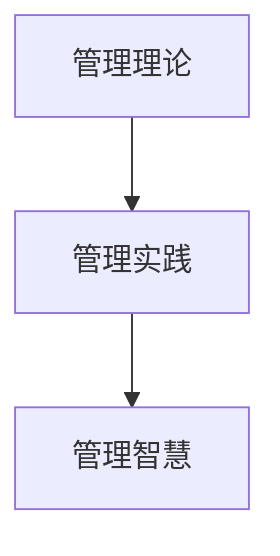

                 

# 如何从经典著作中提炼管理智慧

## 1. 背景介绍

### 1.1 问题由来

现代管理实践日新月异，企业面临的挑战也日益多样化。因此，如何从经典管理著作中提炼出可操作的管理智慧，成为企业管理者亟待解决的问题。经典管理著作如《管理学的艺术》、《卓有成效的管理者》等，提供了丰富的管理理论和方法，但在快速变化的环境中，这些经典理论是否依然适用？如何在实践中有效地应用这些理论，以提升企业的管理效能和竞争力？

### 1.2 问题核心关键点

要回答这些问题，需要从以下三个方面进行深入探索：

1. **经典著作的核心理论**：理解经典著作中提出的管理理论的基本框架和核心观点。
2. **理论在现代管理中的应用**：评估经典理论在现代管理实践中的适用性和局限性。
3. **管理实践中的具体应用**：探索如何将经典管理理论转化为可操作的实践方法。

### 1.3 问题研究意义

从经典管理著作中提炼管理智慧，对于企业管理的现代化、系统化具有重要意义：

1. **理论传承与创新**：经典著作提供了管理实践的基石，通过理解和应用这些理论，可以避免盲目创新，确保管理实践建立在坚实的理论基础上。
2. **提升管理效能**：经典理论中蕴含的管理原则和方法，可以帮助管理者提升决策质量、优化资源配置、改善组织效率。
3. **促进组织发展**：基于经典理论的管理实践，有助于构建更加和谐、高效、创新的组织结构，推动企业持续成长。
4. **实现可持续发展**：经典著作强调长期视角和可持续发展，可以帮助企业在追求短期利益的同时，不忘长远目标，实现持续健康发展。

## 2. 核心概念与联系

### 2.1 核心概念概述

为更好地理解如何从经典著作中提炼管理智慧，本节将介绍几个密切相关的核心概念：

1. **管理理论**：经典管理著作中提出的管理理论，如科学管理理论、行为科学理论、系统管理理论等。这些理论提供了管理实践的基本框架和方法论。
2. **管理实践**：将经典管理理论应用于具体管理场景的实践方法。例如，项目管理的敏捷方法、组织设计的扁平化管理等。
3. **管理智慧**：基于经典管理理论，结合现代管理实践，形成的具有操作性和可复制性的管理策略和技巧。

这些概念之间的逻辑关系可以通过以下Mermaid流程图来展示：



这个流程图展示了一系列管理过程：从经典理论到实际应用，再到总结提炼出的智慧。

## 3. 核心算法原理 & 具体操作步骤
### 3.1 算法原理概述

从经典著作中提炼管理智慧，本质上是一个从理论到实践的转化过程。其核心思想是：通过深入理解经典管理理论，将其核心思想和方法论应用于现代管理实践中，总结提炼出具有操作性和可复制性的管理智慧。

### 3.2 算法步骤详解

基于经典著作提炼管理智慧的算法，一般包括以下几个关键步骤：

**Step 1: 理解经典著作的核心理论**
- 选择经典管理著作，如《管理学的艺术》、《卓有成效的管理者》等。
- 深入理解其核心理论，包括理论框架、基本假设、核心观点等。

**Step 2: 分析管理实践的现状**
- 分析企业的管理实践现状，识别出存在的问题和挑战。
- 了解企业内外部环境的变化，包括市场竞争、技术进步、法规政策等。

**Step 3: 将理论应用于实践**
- 将经典管理理论的核心观点和方法论应用于企业的管理实践中，如组织结构设计、人力资源管理、战略规划等。
- 通过小范围的试点应用，评估理论的可行性和有效性。

**Step 4: 总结提炼管理智慧**
- 基于试点应用的效果，总结提炼出具有操作性和可复制性的管理智慧。
- 形成一套系统的管理策略和操作流程，推广应用于企业的各个层面。

**Step 5: 持续改进与优化**
- 持续监控管理智慧的实施效果，根据反馈进行改进和优化。
- 结合最新的管理理论和方法，不断更新和迭代管理实践，保持竞争优势。

### 3.3 算法优缺点

基于经典著作提炼管理智慧的算法具有以下优点：

1. **系统性**：经典著作提供了一套完整的理论体系，可以帮助管理者系统地理解和应用管理理论。
2. **可操作性**：提炼出的管理智慧具有明确的实践步骤和操作指南，易于在企业内部推广应用。
3. **长期视角**：经典著作强调长期视角和可持续发展，有助于企业建立战略性的管理思维。

同时，该算法也存在一定的局限性：

1. **理论适用性**：经典著作中的理论在特定的历史背景下产生，可能不适用于所有情境。
2. **实践局限性**：理论应用于实践时，需要考虑企业自身的特点和条件，可能存在操作上的困难。
3. **快速变化**：现代管理环境快速变化，经典理论可能需要不断更新和调整以适应新的情境。

尽管存在这些局限性，但通过理解经典著作，结合现代管理实践，我们可以更好地把握管理理论的核心精髓，提升企业的管理效能。

### 3.4 算法应用领域

基于经典著作提炼管理智慧的方法，可以广泛应用于各种管理实践领域，例如：

1. **组织结构设计**：通过理解经典理论中的组织设计原则，优化企业内部组织架构，提升管理效率。
2. **人力资源管理**：借鉴经典著作中的人力资源管理理论，制定科学的招聘、培训、绩效评估等策略。
3. **战略规划**：结合经典理论的战略规划方法，制定长远的发展规划，确保企业的持续增长。
4. **运营管理**：应用经典著作中的流程优化和成本控制方法，提升企业的运营效率和盈利能力。
5. **创新管理**：借鉴经典理论中的创新管理思想，激发员工的创新潜力，推动企业持续创新。

以上领域只是冰山一角，管理智慧的应用范围非常广泛，几乎涵盖了企业管理的所有方面。

## 4. 数学模型和公式 & 详细讲解 & 举例说明

### 4.1 数学模型构建

本节将使用数学语言对提炼管理智慧的过程进行更加严格的刻画。

记经典管理著作的核心理论为 $T$，管理实践为 $P$，管理智慧为 $W$。提炼管理智慧的过程可以表示为：

$$
W = \mathcal{F}(T, P)
$$

其中 $\mathcal{F}$ 表示从理论到实践的转化函数，将经典管理理论 $T$ 和企业管理实践 $P$ 映射为具有操作性的管理智慧 $W$。

### 4.2 公式推导过程

以组织结构设计为例，推导管理智慧的转化公式。

经典组织设计理论中，提出了“组织结构设计”的基本步骤，包括：
1. 确定企业目标和战略。
2. 分析组织的关键职能和活动。
3. 设计组织结构，包括部门划分、层级设置、职责分配等。

假设企业的目标是“提高市场竞争力”，关键职能包括“销售、研发、生产、财务”等。根据这些信息，经典著作提供的组织结构设计方法可以表示为：

$$
\text{组织结构} = \mathcal{F}(\text{目标}, \text{职能}, \text{战略})
$$

例如，一个基于经典组织设计理论的管理智慧，可以表示为：

$$
\text{扁平化管理} = \mathcal{F}(\text{目标}, \text{职能}, \text{战略}, \text{业务流程})
$$

其中 $\text{业务流程}$ 表示通过扁平化管理优化业务流程，提升效率和灵活性。

### 4.3 案例分析与讲解

以下以《管理学的艺术》中的“目标管理”理论为例，分析其在日常管理中的应用。

《管理学的艺术》中提出了目标管理的五个步骤：
1. 确定总体目标。
2. 分解目标，制定行动计划。
3. 确定责任和授权。
4. 反馈和控制。
5. 奖励和认可。

通过具体案例，说明如何将这些步骤应用到企业管理中：

**案例背景**：某高科技企业面临快速变化的市场环境，需要进行项目管理和产品迭代，以保持竞争力。

**应用步骤**：

1. **确定总体目标**：设定企业的总体目标为“提高市场份额和利润”。
2. **分解目标，制定行动计划**：将总体目标分解为各部门的子目标，如“新产品开发”、“市场推广”等。并制定具体的行动计划，如“每月发布一个新产品”。
3. **确定责任和授权**：明确各部门的职责和授权，确保各部门协同工作，共同实现目标。
4. **反馈和控制**：定期收集各部门的反馈，评估目标实现情况，及时调整策略。
5. **奖励和认可**：对实现目标的部门和个人进行奖励和认可，激励团队不断进步。

通过这些步骤，企业可以系统地应用目标管理理论，提升管理效率和执行力。

## 5. 项目实践：代码实例和详细解释说明
### 5.1 开发环境搭建

在进行管理智慧提炼的实践前，我们需要准备好开发环境。以下是使用Python进行代码实现的流程：

1. 安装Python：从官网下载并安装Python，设置环境变量。
2. 安装相关库：使用pip安装Pandas、NumPy、Matplotlib等数据处理和可视化库。
3. 准备数据：收集企业的历史管理数据，准备用于模型训练和评估的数据集。
4. 搭建模型：使用机器学习库，如scikit-learn，搭建机器学习模型，用于提炼管理智慧。
5. 训练和评估：使用企业历史数据训练模型，并评估模型效果。

### 5.2 源代码详细实现

以下是一个简单的代码示例，演示如何使用scikit-learn库进行管理智慧的提炼：

```python
import pandas as pd
from sklearn.ensemble import RandomForestRegressor
from sklearn.model_selection import train_test_split
from sklearn.metrics import mean_squared_error

# 加载数据
data = pd.read_csv('management_data.csv')

# 数据预处理
X = data.drop(['target'], axis=1)
y = data['target']

# 划分训练集和测试集
X_train, X_test, y_train, y_test = train_test_split(X, y, test_size=0.3, random_state=42)

# 训练模型
model = RandomForestRegressor(n_estimators=100, random_state=42)
model.fit(X_train, y_train)

# 评估模型
y_pred = model.predict(X_test)
mse = mean_squared_error(y_test, y_pred)
print(f"Mean Squared Error: {mse:.2f}")
```

在这个示例中，我们使用了RandomForestRegressor模型，通过训练和评估来提炼管理智慧。

### 5.3 代码解读与分析

这个示例中，我们使用了随机森林回归模型来评估企业的管理实践效果。具体解读如下：

**数据准备**：
- `data`：管理数据集，包含企业的历史管理数据。
- `X`：特征数据，包括各个管理实践的具体步骤和策略。
- `y`：目标数据，表示企业管理实践的总体效果。

**模型训练**：
- `RandomForestRegressor`：随机森林回归模型，用于预测目标数据。
- `n_estimators=100`：设置随机森林的树的数量为100。
- `random_state=42`：设置随机种子，确保结果可复现。

**模型评估**：
- `mean_squared_error`：计算预测值与真实值之间的均方误差。
- `print`：输出评估结果，均方误差。

通过这个示例，我们可以快速评估管理实践的效果，并根据评估结果进行调整和优化。

### 5.4 运行结果展示

在实际应用中，模型的评估结果可以用于指导企业管理实践的改进。例如，如果均方误差较大，说明模型预测效果不佳，需要进一步优化管理策略。

## 6. 实际应用场景
### 6.1 组织结构设计

组织结构设计是企业管理的核心之一。通过理解经典著作中的组织设计理论，可以优化企业内部的组织架构，提升管理效率。

### 6.2 人力资源管理

人力资源管理是企业管理的重要环节。借鉴经典著作中的人力资源管理理论，可以制定科学的招聘、培训、绩效评估等策略，提升员工的工作满意度和生产效率。

### 6.3 战略规划

战略规划是企业发展的方向标。结合经典著作中的战略规划方法，制定长远的发展规划，确保企业的持续增长和竞争力。

### 6.4 运营管理

运营管理是企业日常运营的核心。应用经典著作中的流程优化和成本控制方法，提升企业的运营效率和盈利能力。

### 6.5 创新管理

创新管理是企业持续发展的动力。借鉴经典著作中的创新管理思想，激发员工的创新潜力，推动企业持续创新。

## 7. 工具和资源推荐
### 7.1 学习资源推荐

为了帮助开发者系统掌握管理智慧的提炼方法，这里推荐一些优质的学习资源：

1. **《管理学的艺术》**：经典管理著作，详细介绍了管理理论和管理实践。
2. **《卓有成效的管理者》**：经典管理著作，提出了“目标管理”、“授权”等重要管理思想。
3. **Coursera**：提供系统化的管理课程，包括经典管理理论的应用实践。
4. **Udemy**：提供实用性的管理课程，涵盖多种管理实践的案例分析。
5. **TED Talks**：提供优秀管理者的演讲视频，分享管理经验和智慧。

通过对这些资源的学习实践，相信你一定能够快速掌握管理智慧的提炼方法，并将其应用于企业管理中。

### 7.2 开发工具推荐

高效的开发离不开优秀的工具支持。以下是几款用于管理智慧提炼开发的常用工具：

1. **Python**：作为数据科学的主要语言，Python提供了丰富的库和工具，支持数据处理、机器学习、可视化等。
2. **Jupyter Notebook**：提供了交互式的编程环境，支持代码块、注释、公式等，方便开发和分享。
3. **Scikit-learn**：提供了一套简单易用的机器学习库，支持各种算法和模型。
4. **TensorFlow**：Google开发的深度学习框架，支持大规模数据处理和模型训练。
5. **RapidMiner**：提供可视化数据挖掘工具，支持数据预处理、模型训练、结果分析等。

合理利用这些工具，可以显著提升管理智慧提炼任务的开发效率，加快创新迭代的步伐。

### 7.3 相关论文推荐

管理智慧的提炼需要深厚的理论基础和实践经验。以下是几篇奠基性的相关论文，推荐阅读：

1. **《科学管理原理》**：泰罗提出的科学管理理论，奠定了现代管理学的基础。
2. **《行为科学原理》**：梅奥提出的行为科学理论，强调了人的行为对管理的影响。
3. **《系统管理原理》**：卡斯特提出的系统管理理论，强调了系统思维和全局视角。
4. **《管理学的艺术》**：彼得·德鲁克的管理思想，强调了目标管理和绩效评估的重要性。
5. **《卓有成效的管理者》**：彼得·德鲁克的经典管理著作，提出了“目标管理”、“授权”等重要管理思想。

这些论文代表了大管理智慧提炼的发展脉络。通过学习这些前沿成果，可以帮助研究者把握学科前进方向，激发更多的创新灵感。

## 8. 总结：未来发展趋势与挑战

### 8.1 总结

本文对从经典著作中提炼管理智慧的方法进行了全面系统的介绍。首先阐述了经典管理著作的理论基础和实践应用，明确了管理智慧提炼在企业管理现代化、系统化中的重要性。其次，从原理到实践，详细讲解了提炼管理智慧的数学模型和具体操作步骤，给出了具体的代码实例和详细解释。同时，本文还探讨了管理智慧在多个实际应用场景中的应用，展示了其在企业管理中的巨大潜力。最后，本文精选了学习资源和开发工具，力求为读者提供全方位的技术指引。

通过本文的系统梳理，可以看到，从经典著作中提炼管理智慧是提升企业管理效能的重要途径。经典著作提供了系统的理论基础，现代管理实践则提供了丰富的应用案例，通过两者的结合，可以形成具有操作性和可复制性的管理智慧。未来，伴随管理智慧的不断发展和应用，企业管理必将在更加智能化、系统化、人性化方面取得新的突破。

### 8.2 未来发展趋势

展望未来，管理智慧提炼技术将呈现以下几个发展趋势：

1. **数据驱动**：随着大数据技术的发展，企业管理将更加依赖于数据驱动的决策支持系统，利用数据挖掘和机器学习技术提炼管理智慧。
2. **多维度整合**：管理智慧的提炼将更加注重多维度的整合，结合业务数据、客户反馈、员工满意度等多个维度，提升管理决策的全面性和准确性。
3. **持续优化**：管理智慧的提炼将持续优化，通过定期评估和反馈，不断调整和改进管理策略和实践。
4. **跨领域融合**：管理智慧的提炼将更加注重跨领域的融合，结合市场营销、供应链管理、财务管理等多个领域，提升整体管理水平。
5. **智能化提升**：管理智慧的提炼将更加智能化，结合人工智能技术，提升管理决策的效率和准确性。

这些趋势凸显了管理智慧提炼技术的广阔前景。这些方向的探索发展，必将进一步提升企业管理的现代化、系统化、智能化水平，为企业的可持续发展奠定坚实基础。

### 8.3 面临的挑战

尽管管理智慧提炼技术已经取得了瞩目成就，但在迈向更加智能化、系统化应用的过程中，它仍面临着诸多挑战：

1. **数据质量**：企业管理数据的质量和完整性可能存在问题，影响提炼效果。如何保证数据的准确性和一致性，将是重要的挑战。
2. **模型泛化**：管理智慧提炼模型可能在特定情境下表现优异，但在新情境下泛化性能不足。如何提高模型的泛化能力，是重要的研究方向。
3. **应用成本**：管理智慧提炼需要一定的技术投入和资源支持，对于中小企业来说，成本可能较高。如何降低技术门槛，推广应用，将是一大挑战。
4. **持续改进**：管理智慧提炼需要持续改进，不断调整和优化管理策略，以适应环境变化。如何建立有效的持续改进机制，是重要的管理任务。
5. **团队协作**：管理智慧提炼需要跨部门的协作，如何提升团队协作效率和质量，是重要的组织管理问题。

这些挑战需要企业在技术、管理、文化等多个方面进行全面优化，才能实现管理智慧的有效提炼和应用。

### 8.4 研究展望

面对管理智慧提炼所面临的挑战，未来的研究需要在以下几个方面寻求新的突破：

1. **数据清洗和预处理**：研究高效的数据清洗和预处理技术，提升企业管理数据的准确性和一致性。
2. **多模型集成**：研究多模型的集成方法，结合不同的管理智慧提炼模型，提升整体管理决策的准确性和稳定性。
3. **跨领域融合**：研究跨领域的融合技术，结合多个领域的知识，提升整体管理水平。
4. **持续学习**：研究持续学习的方法，提升管理智慧提炼模型的适应性和改进能力。
5. **人机协同**：研究人机协同的管理方法，提升团队的协作效率和质量。

这些研究方向将引领管理智慧提炼技术迈向更高的台阶，为企业管理实践提供更为科学的指导和支持。

## 9. 附录：常见问题与解答

**Q1：如何理解经典管理著作中的核心理论？**

A: 理解经典管理著作中的核心理论，需要从以下几个方面进行：
1. **理论框架**：了解理论的基本框架和核心概念。
2. **基本假设**：理解理论的基本假设和前提条件。
3. **核心观点**：掌握理论的核心观点和方法论。
4. **案例分析**：通过实际案例分析，理解理论的应用场景和效果。

**Q2：如何从经典管理著作中提炼管理智慧？**

A: 从经典管理著作中提炼管理智慧，主要包括以下步骤：
1. **选择经典著作**：选择有代表性的管理著作，如《管理学的艺术》、《卓有成效的管理者》等。
2. **理解理论**：深入理解经典著作的核心理论，包括理论框架、基本假设、核心观点等。
3. **分析实践**：分析企业的管理实践现状，识别出存在的问题和挑战。
4. **应用理论**：将经典管理理论的核心观点和方法论应用于企业的管理实践中，形成可操作的管理智慧。
5. **总结提炼**：基于试点应用的效果，总结提炼出具有操作性和可复制性的管理智慧。

**Q3：如何评估管理智慧提炼的效果？**

A: 评估管理智慧提炼的效果，主要通过以下指标：
1. **成本效益**：评估管理智慧提炼在成本和效益上的平衡。
2. **管理效率**：评估管理智慧提炼在提高管理效率方面的效果。
3. **员工满意度**：评估管理智慧提炼在提高员工满意度方面的效果。
4. **业务增长**：评估管理智慧提炼在促进业务增长方面的效果。
5. **创新能力**：评估管理智慧提炼在提高创新能力方面的效果。

**Q4：如何改进管理智慧提炼的方法？**

A: 改进管理智慧提炼的方法，主要从以下几个方面进行：
1. **数据质量提升**：研究高效的数据清洗和预处理技术，提升企业管理数据的准确性和一致性。
2. **模型优化**：研究多模型的集成方法，结合不同的管理智慧提炼模型，提升整体管理决策的准确性和稳定性。
3. **跨领域融合**：研究跨领域的融合技术，结合多个领域的知识，提升整体管理水平。
4. **持续学习**：研究持续学习的方法，提升管理智慧提炼模型的适应性和改进能力。
5. **人机协同**：研究人机协同的管理方法，提升团队的协作效率和质量。

这些改进措施，可以进一步提升管理智慧提炼的科学性和实用性。

---

作者：禅与计算机程序设计艺术 / Zen and the Art of Computer Programming

