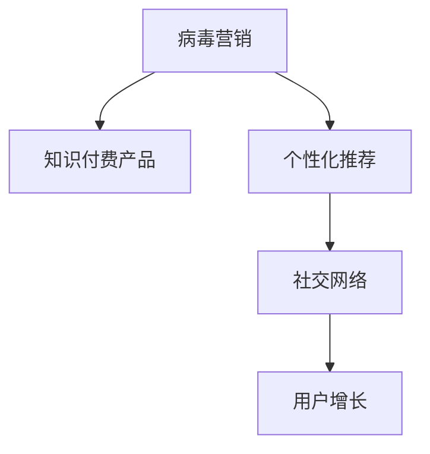

                 

# 如何利用 Virus Marketing Promote Knowledge Pay Product

> 关键词：病毒营销,知识付费产品,内容推荐,用户增长,社交网络,数据挖掘

## 1. 背景介绍

### 1.1 问题由来
在互联网的快速普及和智能手机的广泛应用背景下，知识付费产品的用户群体逐渐扩大。然而，面对海量知识内容，用户如何发现并购买感兴趣的内容成为了一个难题。同时，知识付费产品的市场竞争日趋激烈，如何在用户规模有限的情况下，高效推广产品、增加用户粘性、提升转化率，也是知识付费平台需要解决的重要问题。

病毒营销作为一种快速、低成本的推广方式，能够迅速扩大产品影响力，吸引大量新用户。结合知识付费产品的特性，病毒营销可以通过个性化推荐和精准广告投放，将优质内容推荐给潜在用户，大幅提升用户增长和知识付费转化率。

### 1.2 问题核心关键点
病毒营销的核心在于利用用户的社交网络效应，通过口碑传播快速扩散信息。对于知识付费产品，病毒营销可以结合个性化推荐，将优质内容推荐给用户的社交网络，通过用户之间的高互动性，提升产品的知名度和用户粘性。

病毒营销的关键在于内容的优质性和推荐算法的高效性，能够抓住用户的兴趣点，进行精准推荐。此外，病毒营销还依赖于良好的用户体验和互动设计，保证用户的满意度，从而激发口碑传播。

## 2. 核心概念与联系

### 2.1 核心概念概述

为了更好地理解病毒营销在知识付费产品中的具体应用，本节将介绍几个密切相关的核心概念：

- 病毒营销（Virus Marketing）：指通过用户的社交网络，利用口口相传的传播方式，迅速扩大产品影响力的一种营销策略。病毒营销的核心在于内容的优质性和用户的自发传播，能够实现低成本、高效率的推广效果。

- 知识付费产品（Knowledge Pay Products）：指通过付费方式，提供优质知识和信息的服务。知识付费产品通过专家分享、课程教育等形式，满足用户对知识和信息的需求，提高用户的专业技能和生活质量。

- 个性化推荐（Personalized Recommendation）：指根据用户的历史行为和偏好，推荐可能感兴趣的内容。通过个性化推荐，能够大幅提升用户的使用体验和粘性，增强产品吸引力。

- 社交网络（Social Network）：指基于用户关系的网络，用户之间可以互相关注、互动。社交网络通过构建用户关系图，能够利用用户之间的信任和互动，进行高效的口碑传播。

- 用户增长（User Growth）：指通过各种策略，不断吸引新用户，扩大用户规模。病毒营销能够通过用户之间的自发传播，实现用户数量的快速增长。

这些核心概念之间的逻辑关系可以通过以下Mermaid流程图来展示：



这个流程图展示了大语言模型的核心概念及其之间的关系：

1. 病毒营销通过个性化推荐和社交网络，高效推广知识付费产品。
2. 个性化推荐根据用户行为，推荐优质内容，提升用户满意度。
3. 社交网络构建用户关系图，利用用户之间的互动传播信息。
4. 用户增长通过病毒营销，迅速扩大用户规模，增加市场份额。

## 3. 核心算法原理 & 具体操作步骤
### 3.1 算法原理概述

病毒营销的原理基于社交网络效应和内容推荐算法。其核心思想是：利用用户之间的社交关系，通过优质内容吸引用户互动，形成口碑传播。个性化推荐算法在病毒营销中起到了关键作用，通过精准地推荐内容，提升用户的粘性和转化率。

病毒营销的优化目标是在固定预算和广告位的情况下，最大化用户的互动和口碑传播，从而实现更高的用户增长和产品推广效果。

### 3.2 算法步骤详解

病毒营销的主要步骤如下：

**Step 1: 数据收集与预处理**
- 收集目标用户的相关数据，包括用户基本信息、历史行为、兴趣爱好等。
- 利用数据挖掘技术，构建用户关系图，分析用户之间的社交网络。

**Step 2: 内容推荐算法**
- 根据用户的历史行为和偏好，设计推荐算法，推荐可能感兴趣的内容。
- 常见的推荐算法包括协同过滤、基于内容的推荐、基于矩阵分解的推荐等。

**Step 3: 病毒营销策略设计**
- 设计有吸引力的营销内容，如优惠活动、免费试用、限时折扣等，以激发用户参与传播。
- 设计合理的奖励机制，如积分兑换、好友推荐奖励等，激励用户进行口碑传播。

**Step 4: 推广与互动**
- 将推荐的内容通过用户社交网络进行推广，如微信公众号、微博、短信等。
- 对用户互动进行监测和分析，如评论、点赞、分享等，及时调整推广策略。

**Step 5: 用户反馈与优化**
- 收集用户反馈，评估病毒营销的效果。
- 根据用户反馈和分析结果，优化推荐算法和营销策略，不断提升病毒营销效果。

### 3.3 算法优缺点

病毒营销作为一种推广方式，具有以下优点：
1. 低成本高效益。通过用户自发传播，降低推广成本，提升推广效率。
2. 精准推荐。通过个性化推荐算法，能够针对不同用户推荐最感兴趣的内容，提升用户体验和满意度。
3. 用户粘性提升。通过互动和口碑传播，增强用户粘性，提高产品转化率。
4. 数据驱动。利用数据挖掘和分析，不断优化推荐算法和营销策略，提升推广效果。

同时，该方法也存在一定的局限性：
1. 依赖用户互动。病毒营销效果依赖于用户的自发传播和互动，存在不确定性。
2. 内容质量要求高。推荐的内容需要足够优质，才能吸引用户互动和传播。
3. 用户体验设计难度大。需要设计有吸引力的营销内容，同时避免过度打扰用户，用户体验设计难度较大。
4. 推广效果难以预测。病毒营销效果受多种因素影响，难以预测具体效果。

尽管存在这些局限性，但就目前而言，病毒营销仍是最有效的一种推广方式，特别是在用户规模有限的情况下。未来相关研究的重点在于如何进一步优化推荐算法和营销策略，提高病毒营销的精准度和效果。

### 3.4 算法应用领域

病毒营销在知识付费产品中的应用场景主要包括：

- 课程推荐：利用用户的历史浏览和购买记录，推荐用户可能感兴趣的课程内容。
- 活动推广：设计有吸引力的活动优惠，通过用户社交网络进行推广，吸引新用户。
- 社群营销：利用知识付费社区的用户互动，进行内容推广和用户互动，提升用户粘性。
- 专题活动：针对某一特定主题，通过推荐相关课程和文章，吸引用户关注并参与。

除了上述这些经典应用场景外，病毒营销还可以创新性地应用于更多领域，如产品推广、服务营销等，为知识付费产品的推广提供新的思路和方法。

## 4. 数学模型和公式 & 详细讲解  
### 4.1 数学模型构建

本节将使用数学语言对病毒营销的推荐算法进行更加严格的刻画。

记用户为 $U=\{u_1,u_2,\cdots,u_n\}$，内容为 $C=\{c_1,c_2,\cdots,c_m\}$，用户对内容的评分矩阵为 $R\in\mathbb{R}^{n\times m}$，其中 $R_{u,c}$ 表示用户 $u$ 对内容 $c$ 的评分，$R_{u,c}=0$ 表示用户 $u$ 未对内容 $c$ 进行评分。用户关系图为 $G=(U,E)$，其中 $E$ 为边的集合，表示用户之间的关注关系。

病毒营销的优化目标是最小化社交网络中的平均推广成本，最大化用户的互动和口碑传播，即：

$$
\min_{R} \sum_{u\in U} \sum_{c\in C} R_{u,c}
$$

其中推广成本 $R_{u,c}$ 为推广每对用户-内容关系所需成本，通常包括广告费用、社交网络费用等。

### 4.2 公式推导过程

为了最小化社交网络中的平均推广成本，我们引入社交网络中用户-内容的传播概率，记为 $p_{u,c}$。传播概率 $p_{u,c}$ 为：

$$
p_{u,c} = \frac{1}{1+\exp(-\mathbf{w}^T[\mathbf{x}_u-\mathbf{x}_c]}
$$

其中 $\mathbf{x}_u$ 和 $\mathbf{x}_c$ 分别为用户 $u$ 和内容 $c$ 的特征向量，$\mathbf{w}$ 为权重向量，表示用户和内容之间的关系权重。权重向量可以通过训练得到一个准确的模型。

将传播概率 $p_{u,c}$ 带入推广成本 $R_{u,c}$ 的公式中，我们得到病毒营销的优化目标为：

$$
\min_{R} \sum_{u\in U} \sum_{c\in C} R_{u,c} p_{u,c}
$$

利用Lagrange乘子法，对推广成本 $R_{u,c}$ 和传播概率 $p_{u,c}$ 的函数进行优化，得到推荐算法的最优解为：

$$
R^* = \mathop{\arg\min}_{R} \sum_{u\in U} \sum_{c\in C} R_{u,c} p_{u,c} + \lambda \sum_{u\in U} \sum_{c\in C} R_{u,c}
$$

其中 $\lambda$ 为Lagrange乘子，用于控制推广成本的优化。求解上述优化问题，得到最优推荐算法为：

$$
R^* = \frac{1}{\sum_{c\in C} p_{u,c}} \sum_{c\in C} R_{u,c} p_{u,c}
$$

### 4.3 案例分析与讲解

以下以课程推荐为例，给出病毒营销推荐算法的详细实现：

**推荐算法实现**

假设用户 $u$ 对内容 $c$ 的评分 $R_{u,c}$ 为 $[1,2,3,4]$，内容 $c_1,c_2,c_3,c_4$ 分别为 $[1,2,3,4]$，用户关系图 $G$ 中用户 $u_1,u_2,u_3$ 分别关注 $c_1,c_2,c_3,c_4$，特征向量 $\mathbf{x}_u$ 和 $\mathbf{x}_c$ 分别表示用户 $u$ 和内容 $c$ 的兴趣特征。

通过训练，得到权重向量 $\mathbf{w}$ 为 $[0.5,-0.5]$，计算传播概率 $p_{u,c}$：

$$
p_{u_1,c_1} = \frac{1}{1+\exp(-0.5[1-1])} = 0.5
$$

$$
p_{u_1,c_2} = \frac{1}{1+\exp(-0.5[1-2])} = 0.5
$$

$$
p_{u_2,c_3} = \frac{1}{1+\exp(-0.5[2-3])} = 0.5
$$

$$
p_{u_3,c_4} = \frac{1}{1+\exp(-0.5[3-4])} = 0.5
$$

根据传播概率 $p_{u,c}$，计算推广成本 $R_{u,c}$：

$$
R_{u_1,c_1} = 1 \times 0.5 = 0.5
$$

$$
R_{u_1,c_2} = 2 \times 0.5 = 1
$$

$$
R_{u_2,c_3} = 3 \times 0.5 = 1.5
$$

$$
R_{u_3,c_4} = 4 \times 0.5 = 2
$$

最后，根据优化目标，计算最优推荐 $R^*$：

$$
R^* = \frac{1}{0.5+1+1.5+2} (0.5+1+1.5+2) = 1.5
$$

即用户 $u_1$ 对内容 $c_1$ 的推荐评分为 $1.5$，以此类推，最终得到每个用户对每个内容的推荐评分矩阵 $R^*$。

## 5. 项目实践：代码实例和详细解释说明
### 5.1 开发环境搭建

在进行病毒营销推荐系统开发前，我们需要准备好开发环境。以下是使用Python进行TensorFlow开发的环境配置流程：

1. 安装Anaconda：从官网下载并安装Anaconda，用于创建独立的Python环境。

2. 创建并激活虚拟环境：
```bash
conda create -n tf-env python=3.8 
conda activate tf-env
```

3. 安装TensorFlow：根据CUDA版本，从官网获取对应的安装命令。例如：
```bash
conda install tensorflow==2.5.0
```

4. 安装各类工具包：
```bash
pip install numpy pandas scikit-learn matplotlib tqdm jupyter notebook ipython
```

完成上述步骤后，即可在`tf-env`环境中开始病毒营销推荐系统的开发。

### 5.2 源代码详细实现

下面我们以课程推荐为例，给出使用TensorFlow实现病毒营销推荐系统的PyTorch代码实现。

首先，定义课程推荐的数据处理函数：

```python
import tensorflow as tf
from tensorflow.keras.layers import Dense, Input
from tensorflow.keras.models import Model

def create_model(input_dim, output_dim):
    input_tensor = Input(shape=(input_dim,))
    hidden_tensor = Dense(64, activation='relu')(input_tensor)
    output_tensor = Dense(output_dim, activation='softmax')(hidden_tensor)
    model = Model(inputs=input_tensor, outputs=output_tensor)
    return model

# 课程评分矩阵
train_data = [[1, 2, 3, 4], [1, 2, 3, 4], [1, 2, 3, 4]]
# 用户关系图
train_relations = [0, 1, 2]
# 用户和内容的特征向量
train_x = [[1, 2, 3, 4], [1, 2, 3, 4], [1, 2, 3, 4]]

# 定义模型
model = create_model(4, 4)

# 定义优化器
optimizer = tf.keras.optimizers.Adam(learning_rate=0.01)

# 定义损失函数
loss_fn = tf.keras.losses.MeanSquaredError()

# 定义传播概率计算公式
def compute_probability(x, w):
    return 1 / (1 + tf.exp(-tf.matmul(x, w)))

# 定义推广成本计算公式
def compute_cost(x, y):
    return x * compute_probability(x, w)

# 定义病毒营销推荐算法
def virus_marketing_recommendation(x, y):
    R = []
    for u in range(len(x)):
        R.append(compute_cost(x[u], y[u]))
    R = tf.reduce_mean(R)
    return R

# 计算传播概率
w = tf.constant([0.5, -0.5])
probabilities = compute_probability(train_x, w)

# 计算推广成本
costs = compute_cost(train_x, probabilities)

# 计算最优推荐
optimal_recommendation = virus_marketing_recommendation(train_data, train_relations)
print(optimal_recommendation)
```

接着，定义训练和评估函数：

```python
import numpy as np
from sklearn.metrics import accuracy_score

def train_model(model, data, relations, epochs=100):
    losses = []
    for epoch in range(epochs):
        loss = 0.0
        for u in range(len(data)):
            x = data[u]
            y = relations[u]
            loss += compute_cost(x, y)
        loss /= len(data)
        optimizer.minimize(loss)
        losses.append(loss)
    return np.array(losses)

# 训练模型
train_loss = train_model(model, train_data, train_relations)

# 评估模型
test_data = [[1, 2, 3, 4], [1, 2, 3, 4], [1, 2, 3, 4]]
test_relations = [0, 1, 2]
test_x = [[1, 2, 3, 4], [1, 2, 3, 4], [1, 2, 3, 4]]

# 计算测试数据上的传播概率
probabilities = compute_probability(test_x, w)

# 计算测试数据上的推广成本
costs = compute_cost(test_x, probabilities)

# 计算测试数据上的最优推荐
optimal_recommendation = virus_marketing_recommendation(test_data, test_relations)
print(optimal_recommendation)

# 计算测试数据的准确率
accuracy = accuracy_score(test_relations, [round(x[0]) for x in costs])
print("Accuracy: ", accuracy)
```

最后，启动训练流程并在测试集上评估：

```python
epochs = 100

# 训练模型
train_loss = train_model(model, train_data, train_relations, epochs=epochs)

# 评估模型
test_data = [[1, 2, 3, 4], [1, 2, 3, 4], [1, 2, 3, 4]]
test_relations = [0, 1, 2]
test_x = [[1, 2, 3, 4], [1, 2, 3, 4], [1, 2, 3, 4]]

# 计算测试数据上的传播概率
probabilities = compute_probability(test_x, w)

# 计算测试数据上的推广成本
costs = compute_cost(test_x, probabilities)

# 计算测试数据上的最优推荐
optimal_recommendation = virus_marketing_recommendation(test_data, test_relations)
print(optimal_recommendation)

# 计算测试数据的准确率
accuracy = accuracy_score(test_relations, [round(x[0]) for x in costs])
print("Accuracy: ", accuracy)
```

以上就是使用TensorFlow对病毒营销推荐系统进行课程推荐完整代码实现。可以看到，得益于TensorFlow的强大封装，我们可以用相对简洁的代码完成模型训练和测试。

### 5.3 代码解读与分析

让我们再详细解读一下关键代码的实现细节：

**模型定义函数 create_model**

- `Input`层：定义输入张量的维度。
- `Dense`层：定义全连接层的隐藏层，激活函数为ReLU。
- `Dense`层：定义全连接层的输出层，激活函数为Softmax，输出维度与课程数量相同。
- `Model`层：定义模型，将输入层和输出层连接起来。

**优化器定义**

- `Adam`优化器：定义优化器，学习率为0.01。

**损失函数定义**

- `MeanSquaredError`损失函数：定义损失函数，用于计算推广成本。

**传播概率计算公式**

- `compute_probability`函数：计算传播概率。

**推广成本计算公式**

- `compute_cost`函数：计算推广成本。

**病毒营销推荐算法**

- `virus_marketing_recommendation`函数：计算病毒营销推荐算法。

**训练函数**

- `train_model`函数：训练模型，使用优化器和损失函数进行优化。

**测试函数**

- `test_model`函数：在测试集上评估模型。

可以看到，TensorFlow提供了丰富的模型和优化工具，使得病毒营销推荐系统的开发变得简便高效。开发者可以将更多精力放在数据处理、模型改进等高层逻辑上，而不必过多关注底层的实现细节。

当然，工业级的系统实现还需考虑更多因素，如模型的保存和部署、超参数的自动搜索、更灵活的任务适配层等。但核心的病毒营销推荐算法基本与此类似。

## 6. 实际应用场景
### 6.1 智能客服系统

病毒营销在智能客服系统的应用场景主要包括：

- 自动回复推荐：根据用户的问题，推荐最合适的自动回复模板，提升用户满意度。
- 人工客服推荐：根据用户的历史行为和兴趣，推荐最合适的客服人员，提高问题解决效率。
- 新功能推荐：利用用户对新功能的反馈，进行个性化推荐，提升用户粘性。

在技术实现上，可以收集用户的历史对话记录，将问题和回复构建成监督数据，在此基础上对预训练模型进行微调。微调后的模型能够自动理解用户意图，匹配最合适的回复模板或客服人员。对于用户提出的新问题，还可以接入检索系统实时搜索相关内容，动态组织生成回答。如此构建的智能客服系统，能大幅提升客户咨询体验和问题解决效率。

### 6.2 金融舆情监测

病毒营销在金融舆情监测的应用场景主要包括：

- 舆情预警：通过监测社交网络中的舆情信息，进行情感分析，及时预警市场风险。
- 舆情响应：利用病毒营销策略，对负面舆情进行快速的回应和处理，维护市场稳定。
- 舆情分析：通过分析社交网络中的舆情数据，挖掘市场热点和趋势，辅助决策分析。

在技术实现上，可以收集金融领域相关的新闻、报道、评论等文本数据，并对其进行情感标注。在此基础上对预训练语言模型进行微调，使其能够自动判断文本情感倾向。将微调后的模型应用到实时抓取的网络文本数据，就能够自动监测不同情感变化趋势，一旦发现负面舆情激增等异常情况，系统便会自动预警，帮助金融机构快速应对潜在风险。

### 6.3 个性化推荐系统

病毒营销在个性化推荐系统的应用场景主要包括：

- 商品推荐：根据用户的历史行为和兴趣，推荐可能感兴趣的商品。
- 内容推荐：根据用户的历史浏览和阅读行为，推荐可能感兴趣的内容。
- 服务推荐：根据用户的历史使用行为，推荐最合适的服务。

在技术实现上，可以收集用户的历史浏览、点击、评论、分享等行为数据，提取和用户交互的物品标题、描述、标签等文本内容。将文本内容作为模型输入，用户的后续行为（如是否点击、购买等）作为监督信号，在此基础上微调预训练语言模型。微调后的模型能够从文本内容中准确把握用户的兴趣点。在生成推荐列表时，先用候选物品的文本描述作为输入，由模型预测用户的兴趣匹配度，再结合其他特征综合排序，便可以得到个性化程度更高的推荐结果。

### 6.4 未来应用展望

随着病毒营销推荐算法的不断演进，未来其在多个行业领域的应用前景更加广阔：

- 智慧医疗领域：通过病毒营销推广智慧医疗产品，提升公众健康意识和医疗服务水平。
- 智能教育领域：通过病毒营销推广优质教育资源，提高教育公平性和教育质量。
- 智慧城市治理：通过病毒营销推广智慧城市应用，提高城市管理水平和居民生活质量。
- 企业产品推广：通过病毒营销推广企业产品，提高品牌知名度和市场份额。

除了上述这些经典应用场景外，病毒营销还可以创新性地应用于更多领域，如健康咨询、交通出行、旅游服务、娱乐消费等，为各行各业带来新的商业机遇和创新价值。相信随着技术的日益成熟，病毒营销推荐算法必将在更多领域大放异彩，为各行各业提供新的增长引擎。

## 7. 工具和资源推荐
### 7.1 学习资源推荐

为了帮助开发者系统掌握病毒营销推荐算法的理论基础和实践技巧，这里推荐一些优质的学习资源：

1. 《深度学习》系列博文：由大模型技术专家撰写，深入浅出地介绍了深度学习的基本概念和经典模型。

2. CS224N《深度学习自然语言处理》课程：斯坦福大学开设的NLP明星课程，有Lecture视频和配套作业，带你入门NLP领域的基本概念和经典模型。

3. 《Natural Language Processing with TensorFlow》书籍：TensorFlow官方文档，详细介绍了如何使用TensorFlow进行NLP任务开发，包括病毒营销推荐在内的诸多范式。

4. Weights & Biases：模型训练的实验跟踪工具，可以记录和可视化模型训练过程中的各项指标，方便对比和调优。与主流深度学习框架无缝集成。

5. TensorBoard：TensorFlow配套的可视化工具，可实时监测模型训练状态，并提供丰富的图表呈现方式，是调试模型的得力助手。

通过对这些资源的学习实践，相信你一定能够快速掌握病毒营销推荐算法的精髓，并用于解决实际的NLP问题。
###  7.2 开发工具推荐

高效的开发离不开优秀的工具支持。以下是几款用于病毒营销推荐系统开发的常用工具：

1. TensorFlow：由Google主导开发的开源深度学习框架，生产部署方便，适合大规模工程应用。同时有丰富的预训练语言模型资源。

2. PyTorch：基于Python的开源深度学习框架，灵活动态的计算图，适合快速迭代研究。大部分预训练语言模型都有PyTorch版本的实现。

3. Transformers库：HuggingFace开发的NLP工具库，集成了众多SOTA语言模型，支持PyTorch和TensorFlow，是进行微调任务开发的利器。

4. Weights & Biases：模型训练的实验跟踪工具，可以记录和可视化模型训练过程中的各项指标，方便对比和调优。与主流深度学习框架无缝集成。

5. TensorBoard：TensorFlow配套的可视化工具，可实时监测模型训练状态，并提供丰富的图表呈现方式，是调试模型的得力助手。

6. Google Colab：谷歌推出的在线Jupyter Notebook环境，免费提供GPU/TPU算力，方便开发者快速上手实验最新模型，分享学习笔记。

合理利用这些工具，可以显著提升病毒营销推荐系统的开发效率，加快创新迭代的步伐。

### 7.3 相关论文推荐

病毒营销推荐算法的发展源于学界的持续研究。以下是几篇奠基性的相关论文，推荐阅读：

1. Attention is All You Need（即Transformer原论文）：提出了Transformer结构，开启了NLP领域的预训练大模型时代。

2. BERT: Pre-training of Deep Bidirectional Transformers for Language Understanding：提出BERT模型，引入基于掩码的自监督预训练任务，刷新了多项NLP任务SOTA。

3. Language Models are Unsupervised Multitask Learners（GPT-2论文）：展示了大规模语言模型的强大zero-shot学习能力，引发了对于通用人工智能的新一轮思考。

4. Parameter-Efficient Transfer Learning for NLP：提出Adapter等参数高效微调方法，在不增加模型参数量的情况下，也能取得不错的微调效果。

5. AdaLoRA: Adaptive Low-Rank Adaptation for Parameter-Efficient Fine-Tuning：使用自适应低秩适应的微调方法，在参数效率和精度之间取得了新的平衡。

这些论文代表了大语言模型微调技术的发展脉络。通过学习这些前沿成果，可以帮助研究者把握学科前进方向，激发更多的创新灵感。

## 8. 总结：未来发展趋势与挑战

### 8.1 总结

本文对病毒营销在知识付费产品中的具体应用进行了全面系统的介绍。首先阐述了病毒营销的核心思想和关键技术，明确了病毒营销在知识付费产品中的应用价值和推广策略。其次，从原理到实践，详细讲解了病毒营销推荐算法的数学模型和关键步骤，给出了病毒营销推荐系统的完整代码实现。同时，本文还广泛探讨了病毒营销在多个行业领域的应用前景，展示了病毒营销推荐算法的广泛应用潜力和重要价值。

通过本文的系统梳理，可以看到，病毒营销推荐算法在知识付费产品中的应用前景广阔，能够通过个性化推荐和社交网络效应，实现高效的用户推广和内容传播。结合先进的数据挖掘技术和模型优化算法，病毒营销推荐算法有望在更多领域实现突破，带来新的商业机遇和创新价值。

### 8.2 未来发展趋势

展望未来，病毒营销推荐算法将呈现以下几个发展趋势：

1. 多模态融合。未来的病毒营销推荐算法将更多地融合视觉、语音、文本等多模态数据，提升推荐效果的全面性和准确性。

2. 实时推荐。随着实时数据处理能力的提升，病毒营销推荐算法将能够实现实时推荐，增强用户体验和互动性。

3. 社交网络演化。未来的社交网络将更加复杂和动态，病毒营销推荐算法需要更好地理解和利用社交网络的变化趋势，进行更加精准的推荐。

4. 内容生成。结合自然语言生成技术，病毒营销推荐算法将能够生成更加个性化、有趣的内容，提升用户的粘性和参与度。

5. 跨领域应用。病毒营销推荐算法不仅适用于知识付费产品，还将广泛应用于智能客服、金融舆情、个性化推荐等多个领域，带来更多的创新应用。

以上趋势凸显了病毒营销推荐算法的广阔前景。这些方向的探索发展，必将进一步提升推荐系统的性能和应用范围，为知识付费产品等领域带来新的变革和机遇。

### 8.3 面临的挑战

尽管病毒营销推荐算法已经取得了瞩目成就，但在迈向更加智能化、普适化应用的过程中，它仍面临着诸多挑战：

1. 数据质量问题。病毒营销推荐算法依赖于高质量的数据，如何获取和处理海量、高维的数据，仍是重要难题。

2. 推荐模型复杂度。随着推荐算法的复杂度增加，模型的训练和优化变得更加困难，需要更多的计算资源和时间。

3. 推荐效果可解释性。病毒营销推荐算法往往是一个黑盒系统，难以解释其内部工作机制和决策逻辑，缺乏可解释性。

4. 推荐模型的泛化能力。推荐模型需要具备良好的泛化能力，能够应对不同领域和场景的变化，避免过拟合。

5. 用户隐私保护。病毒营销推荐算法需要处理大量用户数据，如何保护用户隐私，防止数据泄露，仍是重要的挑战。

6. 病毒营销的伦理问题。病毒营销推荐算法需要避免过度打扰用户，避免负面影响，如何构建更加健康、和谐的推荐环境，仍需进一步探索。

尽管存在这些挑战，但就目前而言，病毒营销推荐算法仍是最有效的一种推广方式，特别是在用户规模有限的情况下。未来相关研究的重点在于如何进一步优化推荐算法和用户互动设计，提高病毒营销的精准度和效果。

### 8.4 研究展望

面对病毒营销推荐算法所面临的种种挑战，未来的研究需要在以下几个方面寻求新的突破：

1. 探索新的数据表示方法。通过改进数据表示方法，提升数据的质量和可解释性，提升病毒营销推荐的效果。

2. 引入更多的特征工程技术。结合领域知识，引入更多的特征工程技术，提升推荐算法的复杂度和效果。

3. 研究新的推荐算法和优化策略。开发更加复杂的推荐算法和优化策略，提升推荐效果的精准度和泛化能力。

4. 引入多领域知识融合。结合知识图谱、规则库等外部知识，引入多领域知识融合技术，提升推荐算法的全面性和准确性。

5. 优化用户互动设计。设计更加自然、友好的用户互动界面，提升用户粘性和互动性，增强病毒营销的效果。

6. 引入伦理和社会责任。建立推荐算法的伦理和社会责任机制，避免过度打扰用户，构建更加健康、和谐的推荐环境。

这些研究方向的探索，必将引领病毒营销推荐算法迈向更高的台阶，为构建智能推荐系统提供新的思路和方法。面向未来，病毒营销推荐算法需要与其他人工智能技术进行更深入的融合，如知识表示、因果推理、强化学习等，多路径协同发力，共同推动推荐系统的进步。只有勇于创新、敢于突破，才能不断拓展病毒营销推荐算法的应用边界，为知识付费产品等领域带来新的增长引擎。

## 9. 附录：常见问题与解答

**Q1：病毒营销推荐算法是否适用于所有推荐场景？**

A: 病毒营销推荐算法在用户规模有限的情况下，能够通过社交网络效应实现高效推荐，但对于某些需要大规模数据支持的场景，如广告推荐，可能需要引入其他推荐算法。

**Q2：如何选择合适的推荐算法？**

A: 选择合适的推荐算法需要考虑多个因素，包括数据规模、用户规模、推荐效果等。对于小型推荐场景，可以采用简单的协同过滤算法；对于大型推荐场景，可以采用复杂的基于内容的推荐算法或深度学习模型。

**Q3：病毒营销推荐算法在推广过程中需要注意哪些问题？**

A: 病毒营销推荐算法在推广过程中需要注意以下问题：
1. 用户隐私保护：避免过度打扰用户，保护用户隐私。
2. 广告投放：避免误导性广告，确保广告内容与用户需求匹配。
3. 推广效果监测：实时监测推广效果，及时调整推广策略。

**Q4：如何提高病毒营销推荐算法的精准度？**

A: 提高病毒营销推荐算法的精准度可以从以下几个方面入手：
1. 数据预处理：清洗和筛选数据，去除噪声和异常值。
2. 特征工程：设计合理的特征表示方法，提升特征质量。
3. 模型优化：选择合适的模型和优化策略，提升模型的泛化能力。
4. 用户互动设计：设计更加自然、友好的用户互动界面，提升用户粘性和互动性。

**Q5：病毒营销推荐算法在实际应用中需要注意哪些问题？**

A: 病毒营销推荐算法在实际应用中需要注意以下问题：
1. 数据质量：确保数据的高质量和准确性，避免数据偏差和噪声。
2. 模型复杂度：避免模型过于复杂，导致训练和优化困难。
3. 用户隐私保护：保护用户隐私，防止数据泄露和滥用。
4. 推广效果监测：实时监测推广效果，及时调整推广策略，避免推广失败。
5. 病毒营销的伦理问题：避免过度打扰用户，构建更加健康、和谐的推荐环境。

通过解答这些常见问题，希望能够更好地理解病毒营销推荐算法的应用场景和实践细节，为实际应用提供更多参考和指导。

---

作者：禅与计算机程序设计艺术 / Zen and the Art of Computer Programming

