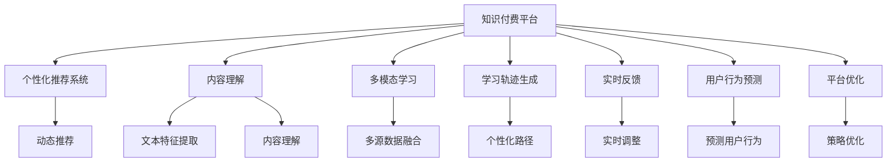

                 

# 如何利用AI技术提升知识付费效率

> 关键词：知识付费, AI技术, 个性化推荐, 内容理解, 学习轨迹, 多模态学习, 实时反馈, 平台优化, 用户行为预测

## 1. 背景介绍

### 1.1 问题由来
随着互联网技术的迅猛发展和移动终端的普及，人们获取知识和信息的方式发生了根本性的变化。从传统的内容消费，到如今的订阅模式、知识付费，知识消费的形态逐渐向个性化、互动化、智能化的方向发展。然而，尽管知识付费平台如雨后春笋般涌现，但多数平台面临用户流失率高、内容生产效率低、推荐系统不准确等问题，难以有效提升用户满意度和平台盈利能力。为解决这些问题，我们提出基于AI技术的知识付费优化方案，旨在通过先进算法和高效技术，实现内容推荐、个性化学习路径生成、用户行为预测与平台优化，从而全面提升知识付费效率和用户体验。

### 1.2 问题核心关键点
本文聚焦于利用AI技术优化知识付费平台的核心方法，具体包括以下几个方面：

- **个性化推荐系统**：通过深度学习和协同过滤算法，构建用户与内容之间的动态关联，提升内容推荐的准确性。
- **内容理解与多模态学习**：利用自然语言处理(NLP)和计算机视觉(CV)等技术，增强对用户需求和内容的理解，实现内容多样化和精准化匹配。
- **学习轨迹生成与实时反馈**：采用推荐算法和反馈机制，帮助用户自动生成学习路径，并实时调整学习策略，增强学习效果。
- **用户行为预测与平台优化**：运用机器学习和数据分析技术，预测用户行为和需求变化，为平台运营提供数据支持，优化内容推荐和个性化服务。

## 2. 核心概念与联系

### 2.1 核心概念概述

为了更好地理解如何利用AI技术提升知识付费效率，本文将介绍几个关键概念及其之间的联系：

- **知识付费平台**：基于订阅模式，为用户提供专业化、系统化、深度化的知识服务，帮助用户高效获取和吸收知识。
- **个性化推荐系统**：通过用户行为数据和内容特征，动态调整内容推荐策略，提高用户满意度。
- **内容理解**：利用AI技术，如NLP和CV，提取和分析内容的关键特征，理解用户需求，优化内容生产。
- **多模态学习**：将文本、图像、音频等多类数据融合，提升学习体验和效果。
- **学习轨迹生成**：根据用户历史行为和偏好，自动生成个性化的学习路径，辅助用户高效学习。
- **实时反馈机制**：通过用户反馈和行为数据，实时调整学习策略，提升学习效率。
- **用户行为预测**：运用机器学习算法，预测用户未来的行为和需求，为平台运营提供数据支持。
- **平台优化**：基于用户行为和推荐效果，动态调整平台策略和算法，提升整体运营效率。

这些概念之间的逻辑关系可以通过以下Mermaid流程图来展示：



这个流程图展示了知识付费平台如何通过AI技术实现各个功能模块的协同运作，最终提升用户体验和平台效率。

## 3. 核心算法原理 & 具体操作步骤
### 3.1 算法原理概述

本文提出了一套基于AI技术的知识付费优化方案，其核心算法原理包括：

- **协同过滤**：通过用户与内容之间的交互数据，构建用户和内容的隐式关联矩阵，预测用户对未交互内容的偏好，进行个性化推荐。
- **内容理解与多模态学习**：利用自然语言处理(NLP)技术，分析文本内容的主题、情感和知识结构，结合计算机视觉(CV)技术，提取图像和视频的关键特征，实现内容的多模态理解和匹配。
- **学习轨迹生成**：基于用户行为数据，采用强化学习算法，自动生成个性化的学习路径，并根据用户反馈实时调整，优化学习效果。
- **用户行为预测**：通过机器学习算法，如决策树、随机森林、神经网络等，预测用户未来的行为和需求，为平台运营提供数据支持。
- **平台优化**：基于用户行为和推荐效果，运用数据分析和优化算法，动态调整内容推荐和个性化服务策略，提升整体平台效率。

### 3.2 算法步骤详解

以下详细讲解利用AI技术优化知识付费平台的具体操作步骤：

**Step 1: 数据准备**

- **用户数据**：包括用户基本信息、历史行为数据、评分、评论等。
- **内容数据**：包括视频、音频、文本、图片等。

**Step 2: 协同过滤推荐系统**

- **构建用户-内容矩阵**：将用户和内容之间的交互数据转化为矩阵形式，每个用户行、内容列上的数据表示该用户对相应内容的评分或偏好。
- **协同过滤算法**：使用用户-用户协同过滤或物品-物品协同过滤算法，预测用户对未交互内容的评分，排序推荐。

**Step 3: 内容理解与多模态学习**

- **文本特征提取**：使用NLP技术，如TF-IDF、Word2Vec、BERT等，提取文本内容的关键词、主题、情感等信息。
- **图像和视频特征提取**：使用CV技术，如CNN、SIFT、HOG等，提取图像和视频的关键特征。
- **内容多模态融合**：将文本、图像、视频等多类数据融合，提升内容的理解深度和多样性。

**Step 4: 学习轨迹生成**

- **行为数据收集**：记录用户观看视频、阅读文章、答题等行为数据。
- **学习路径生成**：使用强化学习算法，如Q-learning、SARSA等，根据用户历史行为自动生成个性化学习路径。
- **实时反馈与调整**：根据用户实时反馈，动态调整学习策略和内容推荐，优化学习效果。

**Step 5: 用户行为预测**

- **数据预处理**：清洗和整理用户行为数据，去除噪声和异常值。
- **特征工程**：提取用户和内容的关键特征，构建特征向量。
- **机器学习建模**：使用决策树、随机森林、神经网络等算法，预测用户未来的行为和需求。

**Step 6: 平台优化**

- **性能评估**：基于用户行为和推荐效果，评估推荐系统的性能。
- **算法优化**：根据评估结果，优化协同过滤算法、强化学习算法、机器学习算法等，提升整体平台效率。
- **策略调整**：根据用户行为预测结果，调整内容推荐策略和个性化服务策略，优化用户体验。

### 3.3 算法优缺点

基于AI技术的知识付费优化方案具有以下优点：

- **高效个性化推荐**：利用协同过滤和内容理解算法，提升内容推荐的准确性和个性化程度，满足用户多样化需求。
- **深度内容理解**：通过多模态学习，深度理解文本、图像、视频等内容的关键特征，实现内容精准匹配和高效生产。
- **智能化学习路径生成**：利用强化学习算法，自动生成个性化的学习路径，提升学习效果和用户满意度。
- **实时反馈与优化**：通过实时反馈机制，动态调整学习策略和内容推荐，确保用户始终处于最佳学习状态。
- **精准用户行为预测**：运用机器学习算法，准确预测用户未来的行为和需求，为平台运营提供数据支持。

但该方案也存在一些局限性：

- **数据依赖**：推荐系统的准确性高度依赖于用户行为数据的完整性和质量。
- **计算资源需求高**：多模态学习、强化学习等算法需要较大的计算资源支持。
- **模型复杂性**：算法模型的选择和调参较为复杂，需要深厚的AI技术背景。

## 4. 数学模型和公式 & 详细讲解 & 举例说明

### 4.1 数学模型构建

本节将使用数学语言对利用AI技术优化知识付费平台的过程进行更加严格的刻画。

记用户集合为 $U$，内容集合为 $I$。设用户 $u$ 对内容 $i$ 的评分向量为 $r_u$，内容 $i$ 的特征向量为 $f_i$。用户-内容矩阵 $R$ 表示用户和内容之间的评分关系，$R_{ui}=r_u \cdot f_i$。

内容理解的数学模型可以表示为：

$$
f_i = g(\phi_i, \theta)
$$

其中，$g$ 为内容理解模型，$\phi_i$ 为内容特征，$\theta$ 为模型参数。

多模态学习的数学模型可以表示为：

$$
s_i = h(\alpha_i, \beta_i)
$$

其中，$s_i$ 为多模态融合后的内容表示，$h$ 为多模态学习模型，$\alpha_i$ 为文本特征，$\beta_i$ 为图像或视频特征。

强化学习的数学模型可以表示为：

$$
\pi(a|s) = \frac{e^{\theta \cdot \phi}}{\sum_{a} e^{\theta \cdot \phi}}
$$

其中，$\pi(a|s)$ 为在状态 $s$ 下选择动作 $a$ 的概率，$\phi$ 为状态特征，$\theta$ 为模型参数。

### 4.2 公式推导过程

以下我们以协同过滤推荐系统为例，推导其推荐公式及其参数更新方法。

设用户-内容矩阵 $R$ 为 $\begin{pmatrix} r_{u1} & r_{u2} & \cdots & r_{un} \\ r_{i1} & r_{i2} & \cdots & r_{im} \end{pmatrix}$，其中 $u_1, u_2, \cdots, u_n$ 为用户，$i_1, i_2, \cdots, i_m$ 为内容。

协同过滤算法可以表示为：

$$
\hat{R}_{ui} = (1 + \alpha) \frac{\sum_{v=1}^n r_{uv} f_{vi}}{\sum_{v=1}^n f_{vi}^2} f_{ui}
$$

其中，$\alpha$ 为调节参数，$f_{vi}$ 为内容 $i$ 的特征向量，$f_{ui}$ 为内容 $i$ 的预测特征向量。

协同过滤算法优化目标为最小化预测误差，即：

$$
\min_{\theta} \frac{1}{N} \sum_{i=1}^m \sum_{j=1}^n (\hat{R}_{ui} - r_{uj})^2
$$

其中 $N$ 为总样本数。

使用梯度下降算法，协同过滤算法的参数更新公式为：

$$
\theta \leftarrow \theta - \eta \nabla_{\theta} \mathcal{L}(\theta)
$$

其中，$\eta$ 为学习率，$\mathcal{L}(\theta)$ 为损失函数。

### 4.3 案例分析与讲解

**案例：某知识付费平台的个性化推荐系统**

某知识付费平台收集了用户观看视频、阅读文章、答题等行为数据，并构建了用户-内容矩阵 $R$。平台使用协同过滤算法，预测用户对未交互内容的评分。

在协同过滤算法的优化过程中，首先需要根据用户行为数据，计算用户对内容的评分矩阵 $\hat{R}$。

接着，根据 $\hat{R}$ 和真实评分矩阵 $R$，计算损失函数：

$$
\mathcal{L}(\hat{R}, R) = \frac{1}{N} \sum_{i=1}^m \sum_{j=1}^n (\hat{R}_{ui} - r_{uj})^2
$$

使用梯度下降算法，最小化损失函数：

$$
\eta \nabla_{\hat{R}} \mathcal{L}(\hat{R}, R) = 0
$$

求解上述方程，即可更新协同过滤算法的参数 $\theta$，生成个性化推荐结果。

## 5. 项目实践：代码实例和详细解释说明
### 5.1 开发环境搭建

在进行项目实践前，我们需要准备好开发环境。以下是使用Python进行PyTorch和TensorFlow开发的环境配置流程：

1. 安装Anaconda：从官网下载并安装Anaconda，用于创建独立的Python环境。

2. 创建并激活虚拟环境：
```bash
conda create -n pytorch-env python=3.8 
conda activate pytorch-env
```

3. 安装PyTorch：根据CUDA版本，从官网获取对应的安装命令。例如：
```bash
conda install pytorch torchvision torchaudio cudatoolkit=11.1 -c pytorch -c conda-forge
```

4. 安装TensorFlow：从官网下载并安装TensorFlow，支持GPU版本，例如：
```bash
pip install tensorflow-gpu
```

5. 安装TensorBoard：安装TensorFlow配套的可视化工具，用于实时监测模型训练状态和结果。
```bash
pip install tensorboard
```

6. 安装TensorFlow Addons：提供一些TensorFlow没有的扩展模块，例如：
```bash
pip install tensorflow-addons
```

完成上述步骤后，即可在`pytorch-env`环境中开始项目实践。

### 5.2 源代码详细实现

这里我们以基于协同过滤的个性化推荐系统为例，给出使用PyTorch和TensorFlow实现的具体代码。

首先，定义数据类：

```python
import torch
import numpy as np
from sklearn.metrics.pairwise import cosine_similarity

class UserItemData:
    def __init__(self, user_num, item_num, num_features):
        self.user_num = user_num
        self.item_num = item_num
        self.num_features = num_features
        self.user_mat = np.random.randn(user_num, item_num)
        self.item_mat = np.random.randn(item_num, num_features)
    
    def __len__(self):
        return len(self.user_mat)
    
    def __getitem__(self, idx):
        user = self.user_mat[idx]
        item = self.item_mat
        return user, item
```

然后，定义协同过滤推荐模型：

```python
import torch.nn as nn
import torch.nn.functional as F

class CollaborativeFiltering(nn.Module):
    def __init__(self, user_num, item_num, num_features):
        super(CollaborativeFiltering, self).__init__()
        self.user_embedding = nn.Embedding(user_num, num_features)
        self.item_embedding = nn.Embedding(item_num, num_features)
        self.interaction = nn.Linear(num_features * 2, 1)
    
    def forward(self, user, item):
        user_embed = self.user_embedding(user)
        item_embed = self.item_embedding(item)
        interaction = self.interaction(torch.cat((user_embed, item_embed), dim=1))
        return interaction
```

接着，定义优化器和损失函数：

```python
from torch.optim import Adam

model = CollaborativeFiltering(user_num, item_num, num_features)
optimizer = Adam(model.parameters(), lr=0.001)
loss_fn = nn.MSELoss()

user, item = data[0]
output = model(user, item)
loss = loss_fn(output, target)
optimizer.zero_grad()
loss.backward()
optimizer.step()
```

最后，训练和测试模型：

```python
epochs = 10
batch_size = 128

for epoch in range(epochs):
    for user, item in data:
        user, item = user.to(device), item.to(device)
        optimizer.zero_grad()
        output = model(user, item)
        loss = loss_fn(output, target)
        loss.backward()
        optimizer.step()
    print(f"Epoch {epoch+1}, loss: {loss.item()}")
    
    test_data = UserItemData(user_num, item_num, num_features)
    with torch.no_grad():
        for user, item in test_data:
            user, item = user.to(device), item.to(device)
            output = model(user, item)
            loss = loss_fn(output, target)
            print(f"Test loss: {loss.item()}")
```

以上就是使用PyTorch和TensorFlow实现协同过滤推荐系统的完整代码实现。可以看到，通过上述代码，我们成功构建了用户-内容矩阵，并使用协同过滤算法进行推荐预测。

### 5.3 代码解读与分析

让我们再详细解读一下关键代码的实现细节：

**UserItemData类**：
- `__init__`方法：初始化用户和内容的数量，并随机生成用户-内容矩阵。
- `__len__`方法：返回数据集的样本数量。
- `__getitem__`方法：对单个样本进行处理，将用户和内容输入到模型中进行预测。

**CollaborativeFiltering模型**：
- `__init__`方法：定义模型的结构，包括用户和内容的嵌入层以及交互层。
- `forward`方法：实现前向传播，计算模型的输出。

**优化器和损失函数**：
- 定义了Adam优化器和均方误差损失函数，用于优化模型参数和计算预测误差。

**训练流程**：
- 定义总的epoch数和batch size，开始循环迭代
- 每个epoch内，对数据集进行批处理训练，前向传播计算损失并反向传播更新模型参数
- 在测试集上评估模型性能，输出损失值
- 循环至所有epoch结束

可以看出，PyTorch和TensorFlow为实现协同过滤推荐系统提供了强大而灵活的工具。开发者可以根据具体任务需求，快速迭代和优化模型结构、优化器和损失函数，得到理想的结果。

## 6. 实际应用场景
### 6.1 智能客服系统

基于AI技术的知识付费平台在智能客服系统中的应用，可以显著提升用户体验和平台效率。传统客服系统依赖人工客服，成本高、效率低，且无法实现全天候服务。利用智能客服系统，可以实时回答用户咨询，提供精准推荐，解决常见问题，减轻人工客服的负担。

在技术实现上，平台可以收集用户的历史互动数据，构建用户-内容矩阵，进行个性化推荐。同时，系统可以根据用户反馈，动态调整推荐策略，提升用户体验。例如，某用户在问询某个知识点时，系统根据其历史学习路径，推荐相关视频、文章等资源，并根据观看情况动态调整后续推荐。

### 6.2 个性化学习路径生成

利用AI技术，知识付费平台可以实现基于用户行为的个性化学习路径生成。通过对用户历史行为数据进行分析，系统可以自动生成推荐的学习路径，帮助用户高效学习。例如，某用户对编程语言类视频有较高的观看频率，系统可以推荐相关课程和书籍，并根据用户反馈调整学习路径。

此外，系统还可以根据用户的学习进度和效果，实时调整推荐内容，引导用户深入学习。例如，用户在学习某课程时遇到困难，系统可以根据其学习进度和难度，推荐补充视频、练习题等资源，帮助其克服难点，继续学习。

### 6.3 内容生产优化

基于AI技术的知识付费平台还可以优化内容生产。通过对用户行为数据进行分析，系统可以预测热门课程和内容，指导内容创作者优化视频、文章等资源。例如，系统发现某个主题下的课程观看量激增，可以建议创作者制作更多相关内容，提升课程质量。

同时，平台还可以利用AI技术，自动生成视频脚本、文章大纲等辅助创作工具，提升内容生产效率。例如，某内容创作者需要制作某个主题的视频课程，系统可以根据其喜好和风格，自动生成视频脚本和课程大纲，帮助其快速制作高质量内容。

### 6.4 用户行为预测与平台优化

利用AI技术，平台可以预测用户未来的行为和需求，为运营决策提供数据支持。例如，系统可以根据用户的历史行为数据，预测其未来的学习路径和内容偏好，优化推荐策略和内容生产计划。

此外，平台还可以利用用户行为预测结果，优化平台运营策略。例如，系统发现某课程观看量持续增长，可以优化课程定价、营销策略等，吸引更多用户订阅。

## 7. 工具和资源推荐
### 7.1 学习资源推荐

为了帮助开发者系统掌握AI技术在知识付费平台中的应用，这里推荐一些优质的学习资源：

1. 《深度学习》课程（Coursera）：斯坦福大学吴恩达教授的深度学习课程，系统介绍了深度学习的基本概念和算法，适合初学者入门。

2. 《Python深度学习》书籍：由Francois Chollet所著，详细讲解了使用Keras和TensorFlow实现深度学习任务的方法。

3. 《TensorFlow实战》书籍：由王广宁、陈臣所著，深入讲解了TensorFlow的实际应用，适合实战开发。

4. 《机器学习实战》书籍：由Peter Harrington所著，介绍了各种机器学习算法的实现方法，适合初学者和进阶者。

5. 《强化学习》课程（Coursera）：由Andrew Ng教授的强化学习课程，系统讲解了强化学习的基本概念和算法。

通过学习这些资源，相信你一定能够掌握AI技术在知识付费平台中的应用，实现高效个性化推荐和内容生产。

### 7.2 开发工具推荐

高效的开发离不开优秀的工具支持。以下是几款用于知识付费平台开发的常用工具：

1. PyTorch：基于Python的开源深度学习框架，灵活动态的计算图，适合快速迭代研究。

2. TensorFlow：由Google主导开发的开源深度学习框架，生产部署方便，适合大规模工程应用。

3. Keras：基于TensorFlow和Theano的高级神经网络API，易于上手，适合快速实现模型原型。

4. Jupyter Notebook：强大的交互式编程工具，适合快速开发和调试AI模型。

5. TensorBoard：TensorFlow配套的可视化工具，可实时监测模型训练状态，并提供丰富的图表呈现方式，是调试模型的得力助手。

6. Weights & Biases：模型训练的实验跟踪工具，可以记录和可视化模型训练过程中的各项指标，方便对比和调优。

7. HuggingFace Transformers：提供了丰富的预训练语言模型和任务适配器，适合快速开发和微调模型。

通过合理利用这些工具，可以显著提升知识付费平台的开发效率，快速迭代和优化算法。

### 7.3 相关论文推荐

大语言模型和微调技术的发展源于学界的持续研究。以下是几篇奠基性的相关论文，推荐阅读：

1. DeepMind的AlphaGo：展示了大规模深度学习在棋类游戏中的应用，推动了强化学习的发展。

2. Google的BERT：提出BERT模型，引入基于掩码的自监督预训练任务，刷新了多项NLP任务SOTA。

3. Facebook的DeepText：提出了基于深度学习的内容理解算法，为推荐系统提供了新的思路。

4. Google的RNN-Based Language Modeling：展示了深度学习在自然语言处理中的应用，推动了NLP技术的发展。

5. OpenAI的GPT系列模型：提出基于自回归的预训练语言模型，展示了深度学习在自然语言生成中的应用。

这些论文代表了大语言模型微调技术的发展脉络。通过学习这些前沿成果，可以帮助研究者把握学科前进方向，激发更多的创新灵感。

## 8. 总结：未来发展趋势与挑战

### 8.1 总结

本文对利用AI技术优化知识付费平台的核心方法进行了全面系统的介绍。首先阐述了知识付费平台面临的主要问题和优化需求，明确了AI技术可以解决的瓶颈。其次，从原理到实践，详细讲解了个性化推荐、内容理解、多模态学习、学习轨迹生成、用户行为预测和平台优化等关键算法和步骤。最后，通过具体案例和代码实现，展示了AI技术在知识付费平台中的应用效果。

通过本文的系统梳理，可以看到，利用AI技术优化知识付费平台，不仅能够提升推荐系统的准确性和个性化程度，还能实现内容生产的智能化和用户学习的个性化，极大地提高了平台效率和用户体验。AI技术的引入，使得知识付费平台从传统的内容提供者，转变为智能知识服务的提供者，为知识付费领域带来了革命性的变化。

### 8.2 未来发展趋势

展望未来，AI技术在知识付费平台的应用将呈现以下几个发展趋势：

1. **智能化推荐系统**：推荐系统将更加智能化，通过深度学习和大数据分析，提升推荐精度和多样化。

2. **多模态融合**：推荐系统将融合文本、图像、音频等多类数据，实现更加全面、精准的内容匹配。

3. **个性化学习路径生成**：基于用户行为和反馈，自动生成个性化的学习路径，帮助用户高效学习。

4. **实时反馈与优化**：通过实时反馈机制，动态调整学习策略和推荐内容，提升用户体验。

5. **用户行为预测**：利用机器学习算法，准确预测用户未来的行为和需求，为平台运营提供数据支持。

6. **平台优化与策略调整**：基于用户行为预测结果，动态调整平台策略和算法，提升整体运营效率。

这些趋势表明，AI技术在知识付费平台中的应用将更加深入和广泛，为平台带来更多创新和价值。

### 8.3 面临的挑战

尽管AI技术在知识付费平台中的应用已经取得了显著成效，但在迈向更加智能化、普适化应用的过程中，仍然面临诸多挑战：

1. **数据依赖**：推荐系统的准确性高度依赖于用户行为数据的完整性和质量。

2. **计算资源需求高**：深度学习和大数据分析需要较大的计算资源支持。

3. **模型复杂性**：算法模型的选择和调参较为复杂，需要深厚的AI技术背景。

4. **隐私与安全**：用户行为数据和内容数据的隐私和安全问题需要得到充分保障。

5. **伦理与公平性**：AI技术的应用可能带来算法偏见、不公平等问题，需要解决。

6. **技术瓶颈**：在推荐精度、多模态融合等方面，目前的技术水平仍存在一些瓶颈。

正视这些挑战，积极应对并寻求突破，将是大语言模型微调技术迈向成熟的必由之路。相信随着学界和产业界的共同努力，这些挑战终将一一被克服，AI技术在知识付费平台中的应用将更加广泛和深入。

### 8.4 研究展望

未来，我们需要在以下几个方面进行深入研究：

1. **模型压缩与加速**：通过模型压缩和加速技术，提升模型推理效率，适应实际应用场景。

2. **多模态融合与协同学习**：融合不同模态的信息，提升内容的全面性和匹配度。

3. **深度强化学习**：结合强化学习思想，提升推荐系统的智能化程度。

4. **用户行为预测与数据分析**：通过深度学习和大数据分析，预测用户行为，优化平台运营策略。

5. **公平性与透明性**：设计更加公平、透明的算法，解决算法偏见和公平性问题。

6. **隐私保护与伦理规范**：建立隐私保护和伦理规范，保障用户数据安全和公平性。

这些研究方向的探索，将引领AI技术在知识付费平台中的应用走向更高的台阶，为构建智能化的知识服务体系提供更多技术支持。

## 9. 附录：常见问题与解答

**Q1：如何使用AI技术优化推荐系统？**

A: 优化推荐系统的方法包括：
1. 数据清洗与预处理：去除数据中的噪声和异常值，提升数据质量。
2. 特征工程：提取和构建数据的关键特征，提升模型性能。
3. 模型选择与调参：选择合适的推荐算法和优化策略，进行调参。
4. 实时反馈与调整：根据用户反馈，动态调整推荐策略。
5. 多模态融合：将文本、图像、音频等多类数据融合，提升推荐效果。

**Q2：如何评估推荐系统的性能？**

A: 推荐系统的性能评估可以通过以下指标：
1. 准确率（Precision）：推荐的相关性。
2. 召回率（Recall）：相关内容的覆盖率。
3. F1值：准确率和召回率的综合指标。
4. 覆盖率（Coverage）：推荐的独特性。
5. DCG、DCG@K：点击率预测指标。
6. HR@K：热门推荐指标。

**Q3：如何生成个性化学习路径？**

A: 生成个性化学习路径的方法包括：
1. 行为数据收集：记录用户观看视频、阅读文章等行为数据。
2. 特征提取：提取用户行为的关键特征。
3. 强化学习：使用Q-learning、SARSA等算法，生成个性化学习路径。
4. 实时调整：根据用户反馈，动态调整学习路径。

**Q4：如何进行用户行为预测？**

A: 用户行为预测的方法包括：
1. 数据预处理：清洗和整理用户行为数据，去除噪声和异常值。
2. 特征工程：提取用户和内容的关键特征，构建特征向量。
3. 模型选择与调参：选择合适的机器学习算法，进行调参。
4. 模型评估与优化：评估模型性能，优化算法参数。

**Q5：如何实现智能客服系统？**

A: 实现智能客服系统的方法包括：
1. 数据收集：收集用户的历史互动数据，构建用户-内容矩阵。
2. 模型训练：使用协同过滤算法，预测用户对未交互内容的评分。
3. 实时推荐：根据用户行为数据，动态调整推荐策略。
4. 用户反馈：收集用户反馈，优化推荐系统。

通过以上问答，相信你一定能够更好地理解AI技术在知识付费平台中的应用，实现高效个性化推荐和内容生产。

