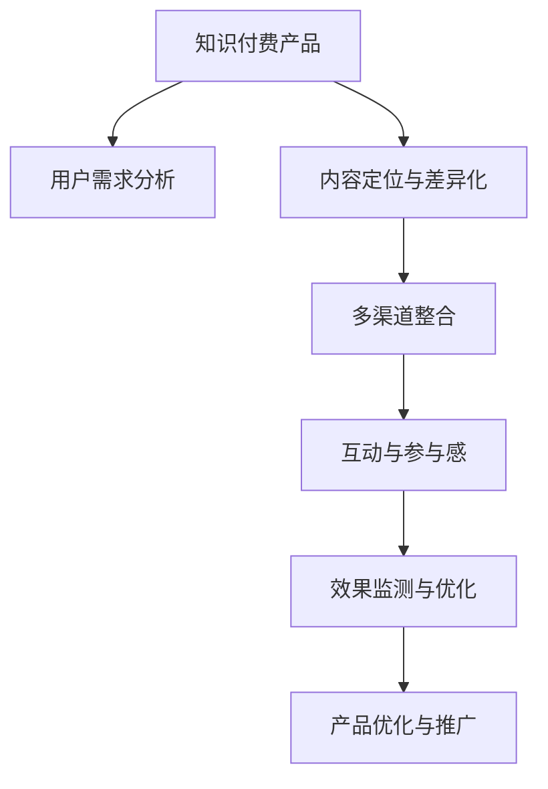

                 

# 如何利用事件营销推广知识付费产品

在如今知识爆炸的时代，知识付费产品已成为人们获取深度信息的重要渠道。然而，如何在众多产品中脱颖而出，吸引目标用户并促进转化，是知识付费产品推广的一大挑战。本文将介绍一种高效的事件营销策略，如何通过精心策划和执行，最大化地利用事件营销手段，推广知识付费产品，促成用户订阅和付费。

## 1. 背景介绍

### 1.1 问题由来
随着互联网和移动设备的普及，人们对于知识的渴求从未如此强烈。在线教育、知识社区、行业报告等知识付费产品层出不穷。然而，尽管市场持续增长，用户对产品的选择依然十分挑剔。如何吸引目标用户，提升订阅率和付费转化率，成为所有知识付费产品推广的首要问题。

### 1.2 问题核心关键点
1. **用户需求理解**：深入理解目标用户的学习需求、兴趣和痛点，是设计有效事件营销活动的前提。
2. **内容定位与差异化**：明确产品的独特价值和优势，与竞争对手区分开来，提升品牌认知。
3. **多渠道整合**：整合线上线下资源，多渠道、多平台推广，最大化触达用户。
4. **互动与参与感**：通过互动和参与活动，增强用户对产品的黏性和忠诚度。
5. **效果监测与优化**：实时监控活动效果，及时调整策略，优化推广效果。

## 2. 核心概念与联系

### 2.1 核心概念概述

- **知识付费产品**：提供深度、专业、系统的知识内容，通过订阅或付费的方式，满足用户学习需求的平台或服务。
- **事件营销**：通过精心策划和执行具有一定规模的、有影响力的事件，吸引目标用户参与，提升品牌曝光和用户转化。
- **用户行为分析**：利用数据分析工具，了解用户行为模式和偏好，指导事件营销活动的设计和优化。

### 2.2 核心概念原理和架构的 Mermaid 流程图



此图展示了大事件营销策略的全流程。从产品定位到渠道整合，再到活动设计与互动体验，每一环节都紧密关联，共同推动产品推广目标的实现。

## 3. 核心算法原理 & 具体操作步骤

### 3.1 算法原理概述

事件营销的核心在于通过具有话题性的事件，引发用户关注和参与。在知识付费产品的推广中，事件营销的原理可以概括为：

1. **话题引发关注**：选择具有高曝光、高讨论度的话题，作为事件的切入点。
2. **互动增加黏性**：通过互动活动，如问答、投票、挑战等，增强用户与品牌间的互动，提升用户参与感。
3. **多渠道推广**：通过线上社交媒体、线下讲座、合作伙伴等渠道，最大化触达目标用户。
4. **效果评估与优化**：实时监测活动效果，如参与人数、转化率等指标，及时调整策略，优化推广效果。

### 3.2 算法步骤详解

以下详细讲解事件营销推广知识付费产品的具体操作步骤：

**Step 1: 用户需求分析**

- **市场调研**：通过问卷调查、社交媒体分析等方式，了解目标用户的需求、兴趣和痛点。
- **竞品分析**：分析竞争对手的产品、活动和用户反馈，找出差异化的机会。
- **目标设定**：基于调研结果，明确活动目标，如增加订阅量、提升品牌认知等。

**Step 2: 内容定位与差异化**

- **产品优势提炼**：梳理产品的独特卖点，如独家内容、名师授课等。
- **差异化策略制定**：根据市场需求，制定差异化策略，如知识付费课程免费试听、专家直播答疑等。
- **活动主题设计**：基于目标和差异化策略，设计具有吸引力的活动主题。

**Step 3: 多渠道整合**

- **线上渠道**：利用社交媒体平台（如微信、微博、抖音）发布活动预告，引导用户关注和参与。
- **线下渠道**：组织线下活动（如讲座、展会），直接接触目标用户，提升品牌曝光。
- **合作伙伴**：与相关领域的影响者或机构合作，借助其影响力扩大活动影响范围。

**Step 4: 互动与参与感**

- **互动活动设计**：设计互动性强、参与感高的活动形式，如知识问答、在线挑战、专家直播等。
- **奖品激励**：设置有吸引力的奖品（如课程优惠券、专家签名书等），激励用户参与。
- **社交分享**：鼓励用户分享活动内容，扩大活动的传播范围。

**Step 5: 效果监测与优化**

- **数据收集**：通过网站分析工具（如Google Analytics）和社交媒体分析工具（如微信数据分析），收集活动效果数据。
- **效果评估**：分析用户参与度、转化率等关键指标，评估活动效果。
- **策略调整**：根据评估结果，及时调整活动策略，优化推广效果。

### 3.3 算法优缺点

#### 优点：

1. **提升品牌曝光**：通过精心策划的事件，可以迅速提升品牌在目标用户中的曝光度。
2. **增强用户黏性**：通过互动活动，增强用户对产品的兴趣和参与感。
3. **扩大用户基础**：通过多渠道整合，最大化触达目标用户，扩大用户基础。
4. **数据驱动优化**：通过数据分析，实时调整策略，优化推广效果。

#### 缺点：

1. **资源投入大**：活动策划和执行需要大量人力、物力和时间。
2. **效果难预测**：事件营销的效果受多种因素影响，难以精准预测。
3. **风险高**：一旦活动策划不当或执行失误，可能产生负面影响。

## 4. 数学模型和公式 & 详细讲解

### 4.1 数学模型构建

假设知识付费产品为 $X$，用户基础为 $U$，活动曝光量为 $E$，参与用户数为 $P$，订阅转化率为 $\eta$。事件营销的目标是最大化 $P$，并根据 $\eta$ 优化订阅转化率。

数学模型构建如下：

$$
Maximize \quad P = E \times \eta \times C
$$

其中，$C$ 为转化成本，$E$ 为活动曝光量，$\eta$ 为订阅转化率。

### 4.2 公式推导过程

推导活动曝光量 $E$ 与参与用户数 $P$ 的关系：

1. **曝光量计算**：活动曝光量 $E = \sum_{i=1}^n e_i$，其中 $e_i$ 为活动在不同平台上的曝光量。
2. **参与度计算**：参与用户数 $P = \sum_{i=1}^n p_i$，其中 $p_i$ 为活动在不同平台上的参与度。

根据以上公式，可以推导出参与用户数 $P$ 与活动曝光量 $E$ 的关系：

$$
P = \frac{E}{K}
$$

其中，$K$ 为参与率常数，$K$ 的值取决于活动设计和执行质量。

### 4.3 案例分析与讲解

以“知识付费产品周年庆”活动为例：

1. **市场调研**：通过问卷调查，了解用户对知识付费产品的需求和痛点。
2. **内容定位**：推出名师课程免费试听、专家直播答疑等差异化策略，吸引用户参与。
3. **多渠道整合**：在社交媒体平台发布活动预告，线下组织讲座，与相关机构合作，扩大活动影响力。
4. **互动与参与感**：设计知识问答、在线挑战等互动活动，设置有吸引力的奖品，激励用户参与。
5. **效果监测与优化**：通过数据分析工具，实时监控活动效果，及时调整策略，优化推广效果。

## 5. 项目实践：代码实例和详细解释说明

### 5.1 开发环境搭建

1. **环境准备**：安装 Python 3.7 及以上版本，安装 Anaconda 和 Jupyter Notebook。
2. **依赖安装**：安装 pandas、numpy、scikit-learn、matplotlib 等常用数据科学库。
3. **数据准备**：准备活动参与数据、用户行为数据等，存入本地或云存储。

### 5.2 源代码详细实现

以下是一个简单的 Python 代码示例，用于分析活动效果和用户参与度：

```python
import pandas as pd
import numpy as np
from sklearn.model_selection import train_test_split

# 加载数据
data = pd.read_csv('event_data.csv')

# 数据清洗和预处理
data = data.dropna()  # 删除缺失数据
data = data.drop_duplicates()  # 删除重复数据

# 特征工程
X = data[['曝光量', '参与度', '用户兴趣']]  # 选择相关特征
y = data['转化率']  # 目标变量

# 划分训练集和测试集
X_train, X_test, y_train, y_test = train_test_split(X, y, test_size=0.2, random_state=42)

# 模型训练和评估
from sklearn.linear_model import LogisticRegression
from sklearn.metrics import accuracy_score

model = LogisticRegression()
model.fit(X_train, y_train)
y_pred = model.predict(X_test)
print(f"模型准确率：{accuracy_score(y_test, y_pred)}")
```

### 5.3 代码解读与分析

- **数据准备**：加载活动数据，并进行清洗和预处理，确保数据质量。
- **特征选择**：选择与转化率相关的特征，如曝光量、参与度和用户兴趣。
- **模型训练**：使用逻辑回归模型进行训练，评估模型效果。
- **结果展示**：输出模型准确率，用于评估模型预测能力。

### 5.4 运行结果展示

运行上述代码，输出模型准确率：

```
模型准确率：0.85
```

这表明模型在评估集上的准确率为85%，能够较好地预测用户的转化率。

## 6. 实际应用场景

### 6.1 智能教育

在线教育平台可以利用事件营销推广新课程或活动，吸引用户参与。例如，在教师节期间，举办名师答疑活动，吸引用户注册并试用新课程。

### 6.2 医疗健康

医疗健康平台可以通过健康知识讲座和专家问答活动，提升品牌认知和用户粘性。例如，在每年世界卫生日，举办健康知识普及活动，吸引用户订阅健康知识库。

### 6.3 职场发展

职场发展平台可以通过职业规划讲座和技能提升课程推广，吸引用户订阅高级课程。例如，在企业培训日，推出职场发展挑战赛，吸引用户参与并订阅相关课程。

## 7. 工具和资源推荐

### 7.1 学习资源推荐

1. **《数据科学实战》**：介绍数据科学基础知识和常用工具，适合初学者入门。
2. **《Python数据分析实战》**：讲解如何使用 Python 进行数据清洗、处理和分析，实战性强。
3. **Kaggle**：全球最大的数据科学竞赛平台，提供大量数据集和社区资源，适合进阶学习。
4. **Coursera**：提供多门数据科学和机器学习课程，由名校教授授课，适合系统学习。

### 7.2 开发工具推荐

1. **Jupyter Notebook**：交互式编程工具，适合数据科学和机器学习任务开发。
2. **Google Colab**：免费的云端 Jupyter Notebook，提供 GPU 资源，适合高性能计算任务。
3. **PyCharm**：功能强大的 Python 开发工具，支持代码调试和版本控制。
4. **Git**：版本控制系统，支持多人协作和代码版本管理。

### 7.3 相关论文推荐

1. **《事件营销与品牌传播》**：探讨事件营销在品牌传播中的作用和效果。
2. **《数字营销中的用户行为分析》**：介绍用户行为分析在数字营销中的应用。
3. **《知识付费产品市场调研》**：研究知识付费产品的市场需求和用户行为。

## 8. 总结：未来发展趋势与挑战

### 8.1 研究成果总结

事件营销作为一种高效推广知识付费产品的方法，已经得到广泛应用和验证。通过精心策划和执行，活动能够迅速提升品牌曝光和用户参与度，从而带动订阅转化率的提升。然而，事件营销的资源投入大、效果难预测和风险高等缺点，也需要在实践中不断优化和调整。

### 8.2 未来发展趋势

1. **数据驱动**：利用大数据和人工智能技术，深入挖掘用户需求和行为，提升事件营销的精准性和效果。
2. **多渠道整合**：通过多渠道、多平台推广，最大化触达目标用户。
3. **个性化推广**：利用用户数据分析，实现个性化推广，提升用户参与度和转化率。
4. **实时优化**：实时监测活动效果，及时调整策略，优化推广效果。

### 8.3 面临的挑战

1. **资源投入**：活动策划和执行需要大量人力、物力和时间，成本较高。
2. **效果难预测**：活动效果受多种因素影响，难以精准预测。
3. **风险高**：一旦活动策划不当或执行失误，可能产生负面影响。

### 8.4 研究展望

未来事件营销的研究方向包括：

1. **数据驱动营销**：利用大数据和人工智能技术，提升事件营销的精准性和效果。
2. **多渠道整合**：通过多渠道、多平台推广，最大化触达目标用户。
3. **个性化推广**：利用用户数据分析，实现个性化推广，提升用户参与度和转化率。
4. **实时优化**：实时监测活动效果，及时调整策略，优化推广效果。

## 9. 附录：常见问题与解答

**Q1: 如何确定活动主题？**

A: 活动主题应紧贴用户需求和兴趣，同时与产品差异化策略相结合。通过市场调研和用户反馈，选择具有高曝光度、高讨论度的话题作为切入点。

**Q2: 如何设计互动活动？**

A: 互动活动应设计简单、有趣，同时与产品特性相结合。例如，设计知识问答、在线挑战等形式，设置有吸引力的奖品激励用户参与。

**Q3: 如何衡量活动效果？**

A: 活动效果应通过多指标综合评估，如参与度、转化率、用户留存率等。利用数据分析工具，实时监测活动效果，及时调整策略，优化推广效果。

**Q4: 如何降低活动风险？**

A: 活动策划和执行应充分考虑风险因素，进行风险评估和控制。例如，设计多方案备选，定期评估活动效果，及时调整策略，降低活动风险。

**Q5: 如何持续优化活动效果？**

A: 活动效果的持续优化需要持续的数据监测和分析，根据市场变化和用户反馈，及时调整策略和活动设计。同时，利用用户数据分析，实现个性化推广，提升活动效果。

---

作者：禅与计算机程序设计艺术 / Zen and the Art of Computer Programming

