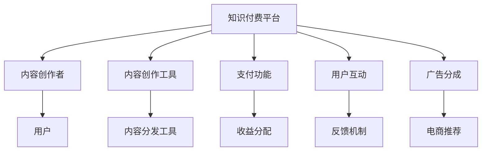

                 

## 1. 背景介绍

随着互联网技术的飞速发展，知识付费成为了在线教育领域的一大热门模式。相比于传统的免费教育模式，知识付费不仅能有效提升内容质量，还能通过付费激励，让知识创作者获得应得的回报，形成良性的生态循环。微信生态圈作为全球最大的社交平台之一，拥有超过10亿的活跃用户，其丰富的生态系统和庞大的用户基础，为知识付费提供了广阔的发展空间。

### 1.1 问题由来

当前，知识付费市场竞争激烈，内容同质化现象严重。平台和内容创作者都在寻找新的差异化策略，以突围市场。而微信生态圈作为高度整合的平台，凭借其强大的流量和丰富的生态功能，为知识付费提供了一个强有力的平台支撑。

### 1.2 问题核心关键点

利用微信生态圈进行知识付费的核心关键点包括以下几点：

- **流量获取与导流能力**：微信庞大的用户基数和高效的导流机制，使其成为知识付费内容的重要传播渠道。
- **社交互动性**：微信社交功能为内容创作者与受众提供了互动平台，增强了内容的互动性和用户粘性。
- **平台整合能力**：微信小程序、微信公众号、微信读书等平台工具，为内容创作者提供了多样化的创作和展示渠道。
- **营销推广能力**：微信广告、朋友圈营销等推广手段，为知识付费内容提供了高效的曝光和转化渠道。
- **支付安全性**：微信支付等支付功能，为知识付费提供了安全的支付保障，增强了用户的信任感。

### 1.3 问题研究意义

利用微信生态圈进行知识付费，不仅能够提升内容质量和用户满意度，还能带来显著的商业价值和社交效益。具体来说：

- **提升内容质量**：付费机制能够筛选优质内容，减少劣质内容泛滥，提升整体内容质量。
- **激励内容创作者**：通过付费分成，激发创作者的创作热情，产出更多高质量的原创内容。
- **增加用户粘性**：社交互动和个性化推荐功能，使用户能够持续关注并参与到内容生产中来。
- **打造品牌效应**：内容创作者通过微信平台建立个人品牌，提升影响力，吸引更多粉丝关注。
- **促进商业变现**：平台可以通过内容付费、广告分成、电商推荐等多元化收入模式，实现商业价值的最大化。

## 2. 核心概念与联系

### 2.1 核心概念概述

利用微信生态圈进行知识付费的核心概念包括：

- **知识付费**：通过付费模式获取知识或服务的商业模型，旨在提升内容质量和创作者收益。
- **微信生态圈**：包括微信平台、小程序、微信公众号、微信读书等构成的一体化生态系统。
- **内容创作与分发**：内容创作者通过微信生态圈的各种工具，创作并分发知识付费内容。
- **用户互动与反馈**：用户通过微信生态圈的社交功能，与内容创作者进行互动，提供反馈，提升内容质量。
- **支付与收益分配**：微信支付等支付功能，为知识付费提供了交易保障，用户通过付费获得内容，平台和创作者按比例分配收益。

这些核心概念共同构成了微信生态圈知识付费的完整生态链条，涵盖了内容创作、分发、交易、反馈、收益分配等关键环节。

### 2.2 核心概念原理和架构的 Mermaid 流程图



这个Mermaid流程图展示了知识付费平台与内容创作者、用户之间的互动关系。

## 3. 核心算法原理 & 具体操作步骤

### 3.1 算法原理概述

利用微信生态圈进行知识付费的算法原理主要包括以下几个方面：

- **内容筛选与推荐**：通过算法模型对大量内容进行筛选和推荐，提升内容的曝光率和用户满意度。
- **用户画像与个性化推荐**：基于用户的浏览历史、购买记录等数据，构建用户画像，实现个性化内容推荐。
- **收益分配算法**：通过设定合理的收益分配规则，保证内容创作者能够获得应得的分成，同时平台也能获得稳定收入。
- **付费模式设计**：设计灵活多样的付费模式，如单次付费、订阅模式、按需付费等，满足不同用户需求。
- **互动与反馈机制**：建立互动与反馈机制，提升用户粘性和内容质量。

### 3.2 算法步骤详解

利用微信生态圈进行知识付费的具体操作步骤如下：

**Step 1: 准备内容创作者与平台**

- **创作者准备**：选择适合的微信生态工具（如小程序、公众号等），准备并上传知识付费内容。
- **平台准备**：搭建微信生态圈的知识付费平台，集成内容创作、分发、支付、收益分配等功能。

**Step 2: 内容创作与分发**

- **内容创作**：创作者使用微信平台提供的工具（如编辑器、模板等），创作知识付费内容。
- **内容分发**：创作者通过微信公众号、小程序等渠道发布内容，并通过微信支付等方式获取收益。

**Step 3: 用户获取与互动**

- **获取用户**：通过微信广告、朋友圈营销等方式获取潜在用户，并通过互动功能吸引用户关注。
- **互动反馈**：用户通过评论、点赞、分享等社交互动功能，提供反馈，提升内容质量。

**Step 4: 收益分配与优化**

- **收益分配**：平台根据内容质量、用户付费数据等因素，合理分配收益给创作者。
- **优化调整**：根据用户反馈和收益分配结果，优化内容创作与推荐策略，提升平台整体体验。

### 3.3 算法优缺点

利用微信生态圈进行知识付费的算法优缺点如下：

**优点：**

- **流量获取高效**：微信庞大的用户基数和高效的导流机制，使得内容可以快速传播。
- **社交互动性强**：用户可以通过社交功能与内容创作者互动，增强用户粘性。
- **平台功能丰富**：微信生态圈集成了创作、分发、支付、广告等多种功能，提升内容产出与变现效率。
- **收益分配公平**：合理的收益分配机制，保证创作者能够获得应得的分成，提升创作者积极性。

**缺点：**

- **内容同质化风险**：大量内容创作者涌入，可能导致内容同质化现象严重。
- **监管难度较大**：内容审核和监管难度较大，需要平台建立严格的内容审查机制。
- **运营成本较高**：平台需要投入大量资源进行内容筛选、推广和收益分配等运营工作。

### 3.4 算法应用领域

利用微信生态圈进行知识付费的应用领域包括：

- **在线教育**：各类在线课程、讲座、学习资料等。
- **职业培训**：职场技能、编程语言、管理课程等。
- **健康生活**：饮食、运动、心理健康等。
- **文化艺术**：绘画、音乐、写作等。
- **生活娱乐**：亲子教育、旅游指南、游戏攻略等。

## 4. 数学模型和公式 & 详细讲解 & 举例说明

### 4.1 数学模型构建

知识付费平台的数学模型主要包括：

- **内容质量评估模型**：通过文本分类、情感分析等技术，评估内容质量，筛选优质内容。
- **用户画像模型**：基于用户的浏览记录、购买记录等数据，构建用户画像，实现个性化推荐。
- **收益分配模型**：设定合理的收益分配规则，保证创作者和平台的公平分成。
- **付费模式优化模型**：设计多样化的付费模式，满足不同用户需求，提升用户体验。

### 4.2 公式推导过程

以下以内容质量评估模型为例，展示其数学推导过程。

假设有一个内容 $X$，其质量由 $X$ 的内容深度、更新频率、互动率等指标决定。设 $X$ 的质量得分 $Q(X)$ 为：

$$
Q(X) = \alpha D(X) + \beta U(X) + \gamma I(X)
$$

其中 $D(X)$、$U(X)$、$I(X)$ 分别表示内容 $X$ 的内容深度、更新频率和互动率，$\alpha$、$\beta$、$\gamma$ 为对应的权重系数。

根据上述模型，可以构建内容质量评估公式：

$$
Q(X) = \alpha \sum_{i=1}^n D_i(X) + \beta \sum_{i=1}^n U_i(X) + \gamma \sum_{i=1}^n I_i(X)
$$

其中 $D_i(X)$、$U_i(X)$、$I_i(X)$ 表示内容 $X$ 在特征 $i$ 上的得分，$n$ 为特征个数。

### 4.3 案例分析与讲解

以微信读书平台为例，其内容质量评估模型可以设置为：

- **内容深度**：通过内容文本长度、关键词丰富度等指标评估。
- **更新频率**：通过内容更新时间和频率评估。
- **互动率**：通过用户的评论、点赞、分享等互动行为评估。

通过上述模型，可以实时计算出每本书的内容质量得分，并根据得分进行内容推荐和搜索排序。

## 5. 项目实践：代码实例和详细解释说明

### 5.1 开发环境搭建

要进行知识付费平台的项目开发，首先需要搭建好开发环境。以下是搭建开发环境的具体步骤：

1. **安装开发环境**：
   - 安装Python 3.8及以上版本。
   - 安装微信小程序开发工具（如微信开发者工具）。
   - 安装微信读书平台API接口。

2. **配置环境变量**：
   - 配置微信小程序开发者环境，如设置AppID、AppSecret等。
   - 配置微信读书平台API接口，如设置API Key、Access Token等。

### 5.2 源代码详细实现

以下是一个简单的知识付费平台源代码实现，主要包含内容创作、分发、收益分配等功能。

```python
# 内容创作工具类
class ContentCreator:
    def __init__(self, app_id, app_secret):
        # 初始化微信小程序AppID和AppSecret
        pass

    def create_content(self, content):
        # 创建并上传内容到微信小程序
        pass

    def update_content(self, content_id, new_content):
        # 更新已有内容
        pass

# 内容分发工具类
class ContentDistributor:
    def __init__(self, app_id, app_secret):
        # 初始化微信小程序AppID和AppSecret
        pass

    def publish_content(self, content_id, title, description):
        # 发布内容到微信公众号或小程序
        pass

    def delete_content(self, content_id):
        # 删除内容
        pass

# 收益分配工具类
class RevenueDistributor:
    def __init__(self, app_id, app_secret):
        # 初始化微信小程序AppID和AppSecret
        pass

    def get_revenue(self, content_id, user_id):
        # 获取用户对内容的付费记录
        pass

    def distribute_revenue(self, content_id, user_id, amount):
        # 分配收益给内容创作者
        pass

# 用户互动工具类
class UserInteraction:
    def __init__(self, app_id, app_secret):
        # 初始化微信小程序AppID和AppSecret
        pass

    def get_user_profile(self, user_id):
        # 获取用户信息
        pass

    def post_comment(self, user_id, content_id, comment_text):
        # 发布评论
        pass

    def like_content(self, user_id, content_id):
        # 点赞内容
        pass

    def share_content(self, user_id, content_id):
        # 分享内容
        pass

# 测试代码
if __name__ == '__main__':
    creator = ContentCreator('app_id', 'app_secret')
    distributor = ContentDistributor('app_id', 'app_secret')
    revenue_distributor = RevenueDistributor('app_id', 'app_secret')
    interaction = UserInteraction('app_id', 'app_secret')

    # 创建内容
    content_id = creator.create_content('知识付费内容')

    # 发布内容
    distributor.publish_content(content_id, '内容标题', '内容描述')

    # 获取收益
    revenue = revenue_distributor.get_revenue(content_id, 'user_id')
    print(f'用户{user_id}对内容{content_id}的收益为{revenue}元')

    # 互动
    interaction.post_comment('user_id', content_id, '这是一条评论')
    interaction.like_content('user_id', content_id)
    interaction.share_content('user_id', content_id)
```

### 5.3 代码解读与分析

上述代码展示了知识付费平台的主要功能模块，包括内容创作、分发、收益分配和用户互动等。具体分析如下：

- **ContentCreator类**：负责内容的创建和更新。调用微信小程序API进行内容上传和更新操作。
- **ContentDistributor类**：负责内容的发布和管理。调用微信公众号或小程序API进行内容发布和删除操作。
- **RevenueDistributor类**：负责收益的计算和分配。调用微信支付API进行用户付费记录的查询和收益分配操作。
- **UserInteraction类**：负责用户与内容的互动。调用微信社交API进行评论、点赞、分享等操作。

### 5.4 运行结果展示

运行上述代码后，可以实现如下功能：

- 用户通过微信小程序或微信公众号浏览知识付费内容。
- 用户可以通过微信支付进行付费。
- 平台根据内容质量评估模型筛选优质内容，推荐给用户。
- 内容创作者通过微信读书平台获得收益。

## 6. 实际应用场景

### 6.1 在线教育

在线教育平台通过微信生态圈进行知识付费，可以快速推广课程，提高课程完成率和用户满意度。学生可以通过微信小程序或微信公众号进行课程学习，并通过微信支付进行付费。平台根据课程内容和用户互动情况，推荐优质课程，提升课程质量和用户体验。

### 6.2 职业培训

职业培训机构利用微信生态圈进行知识付费，可以提供灵活多样的培训课程，满足不同用户需求。用户可以通过微信小程序或微信公众号进行培训报名和付费，并获取个性化推荐和互动服务。平台根据用户反馈和收益分配，不断优化课程内容和推荐策略。

### 6.3 健康生活

健康生活平台通过微信生态圈进行知识付费，可以提供各类健康知识、健身课程、饮食指导等。用户可以通过微信小程序或微信公众号进行付费阅读和互动，平台根据用户画像和行为数据，推荐相关健康内容，提升用户健康水平。

### 6.4 文化艺术

文化艺术平台利用微信生态圈进行知识付费，可以提供各类艺术课程、艺术品鉴赏、艺术创作指导等。用户可以通过微信小程序或微信公众号进行付费获取，并与其他用户进行互动，分享心得。平台根据内容质量和用户互动情况，推荐优质艺术内容，提升用户体验。

## 7. 工具和资源推荐

### 7.1 学习资源推荐

为了帮助开发者系统掌握微信生态圈知识付费的开发技能，这里推荐一些优质的学习资源：

1. **《微信小程序开发手册》**：微信官方发布的开发者手册，涵盖微信小程序的基础知识和开发流程，适合初学者入门。
2. **《微信公众号开发手册》**：微信官方发布的开发者手册，涵盖微信公众号的开发知识和API接口，帮助开发者快速上手。
3. **《微信支付API文档》**：微信支付官方提供的API文档，详细介绍了微信支付的各项功能和服务，帮助开发者实现支付功能。
4. **《微信读书平台API文档》**：微信读书平台官方提供的API文档，详细介绍了平台的各种API接口，帮助开发者实现内容创作、分发、收益分配等功能。
5. **《微信生态圈知识付费实战》**：一本系统介绍微信生态圈知识付费开发实战的书籍，涵盖内容创作、分发、用户互动、收益分配等各个环节的详细技术和案例。

### 7.2 开发工具推荐

高效的工具是开发的重要保障。以下是几款用于微信生态圈知识付费开发的工具：

1. **微信开发者工具**：微信官方提供的开发工具，集成了代码调试、性能分析等功能，帮助开发者高效开发和测试小程序。
2. **微信小程序编辑器**：微信提供的可视化开发工具，支持代码编写、拖放组件、实时预览等功能，适合快速迭代开发。
3. **微信公众号管理工具**：如MicroManager、KefuWX等，帮助开发者管理公众号的运营和用户互动，提升运营效率。
4. **微信支付SDK**：微信支付提供的SDK，支持开发人员在应用中集成微信支付功能。
5. **微信读书平台SDK**：微信读书平台提供的SDK，支持开发人员在应用中集成内容创作、分发、收益分配等功能。

### 7.3 相关论文推荐

微信生态圈知识付费的发展离不开学界的持续研究。以下是几篇奠基性的相关论文，推荐阅读：

1. **《微信生态圈知识付费的研究与实践》**：探讨了微信生态圈在知识付费中的应用，分析了平台、创作者、用户之间的互动机制。
2. **《利用微信生态圈进行内容推荐的研究》**：研究了基于微信生态圈的用户画像和内容推荐算法，提出了多维度的推荐策略。
3. **《微信读书平台收益分配机制的设计与优化》**：介绍了微信读书平台的收益分配机制，讨论了合理的收益分配策略。
4. **《微信小程序的开发与测试》**：介绍了微信小程序的开发流程和测试方法，提供了详细的开发实践案例。

## 8. 总结：未来发展趋势与挑战

### 8.1 研究成果总结

利用微信生态圈进行知识付费是当前NLP技术应用的一个重要方向。微信生态圈凭借其庞大的用户基数和丰富的生态功能，为知识付费提供了强有力的平台支撑。通过内容创作、分发、互动、付费等功能，平台可以提升内容质量和用户体验，实现商业价值和社交效益的双赢。

### 8.2 未来发展趋势

展望未来，微信生态圈知识付费将呈现以下几个发展趋势：

1. **内容多样化**：随着内容创作的门槛降低，更多高质量原创内容将被创作出来，丰富知识付费内容的多样性。
2. **个性化推荐**：基于用户画像的个性化推荐技术将不断优化，提升内容匹配度和用户满意度。
3. **多元化收入**：除了内容付费外，平台还将探索更多元化的收入模式，如广告分成、电商推荐等。
4. **智能互动**：基于自然语言处理、智能推荐等技术，提升用户与内容的互动体验。
5. **技术融合**：与大数据、人工智能等技术的融合将进一步提升平台的功能和体验。

### 8.3 面临的挑战

虽然微信生态圈知识付费前景广阔，但仍然面临一些挑战：

1. **内容同质化风险**：大量内容创作者涌入，可能导致内容同质化现象严重。
2. **监管难度较大**：内容审核和监管难度较大，需要平台建立严格的内容审查机制。
3. **运营成本较高**：平台需要投入大量资源进行内容筛选、推广和收益分配等运营工作。
4. **用户体验优化**：如何提升用户体验，减少用户流失，是平台需要持续优化的方向。
5. **技术保障**：平台需要保障支付安全、数据隐私等方面的技术保障，提升用户信任度。

### 8.4 研究展望

未来的研究需要在以下几个方面寻求新的突破：

1. **内容推荐优化**：研究更高效、更精准的内容推荐算法，提升内容匹配度和用户体验。
2. **收益分配机制优化**：设计更加公平合理的收益分配机制，激发创作者积极性，提升平台收益。
3. **社交互动增强**：研究更高效的社交互动机制，提升用户粘性和内容互动率。
4. **技术融合创新**：探索更多技术与知识付费的融合应用，如智能问答、智能推荐等。
5. **平台功能扩展**：扩展微信生态圈的功能，提供更多个性化服务，提升用户价值。

## 9. 附录：常见问题与解答

**Q1：如何避免内容同质化现象？**

A: 平台可以建立严格的内容审核机制，对内容进行深度审核，确保内容的原创性和独特性。同时，引入更多内容创作者，丰富内容的多样性。

**Q2：如何提升用户与内容的互动率？**

A: 平台可以通过多种方式提升用户互动率，如建立互动奖励机制、举办互动活动、提供个性化推荐等。

**Q3：如何保障支付安全？**

A: 平台需要建立严格的支付安全机制，如双重验证、资金托管、第三方支付保障等，确保用户支付安全。

**Q4：如何优化内容推荐算法？**

A: 可以引入机器学习算法，如协同过滤、内容推荐算法等，基于用户画像和内容特征进行推荐优化。

**Q5：如何设计合理的收益分配机制？**

A: 平台可以根据内容质量、用户付费数据等因素，设定合理的收益分配规则，保证创作者和平台的公平分成。

综上所述，利用微信生态圈进行知识付费，不仅可以提升内容质量和用户满意度，还能带来显著的商业价值和社交效益。通过不断优化平台功能，提升用户互动体验，平台将能够实现商业价值和社交效益的双赢，为NLP技术的应用开辟新的路径。

---

作者：禅与计算机程序设计艺术 / Zen and the Art of Computer Programming

