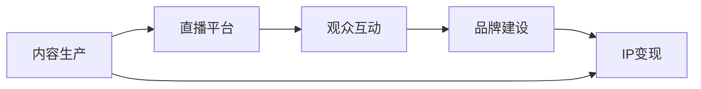

                 

# 如何利用直播平台建立个人IP

## 1. 背景介绍

随着移动互联网和直播技术的飞速发展，直播平台已经成为了信息传播、内容生产和社交互动的重要阵地。个人IP的建立，不再局限于传统的文字、图像等静态媒体形式，直播平台提供了一个全新、多样化的展现形式。本文旨在探讨如何通过直播平台，打造具有鲜明个性和影响力的个人IP，实现内容价值的最大化，提升个人品牌的知名度和影响力。

## 2. 核心概念与联系

### 2.1 核心概念概述

在直播领域，个人IP的建立涉及多个关键概念，包括但不限于：

- **直播平台**：提供实时视频、音频内容的社交媒体平台，如抖音、快手、YouTube、Facebook Live等。
- **内容生产**：通过直播或录播的方式，生产并分享有价值、有趣味的内容。
- **观众互动**：与观众进行实时交流、反馈，增强内容的互动性和参与感。
- **品牌建设**：在直播内容中融入个人特色、价值主张，树立独特的品牌形象。
- **IP变现**：通过商业合作、广告、商品推广等方式，将个人IP转化为商业价值。

这些概念通过直播技术的纽带，紧密联系在一起。通过精心设计的内容生产和互动策略，个人IP能够在直播平台上迅速积累粉丝，形成稳定的观众群体，进而实现品牌价值和商业变现。

### 2.2 核心概念原理和架构的 Mermaid 流程图



## 3. 核心算法原理 & 具体操作步骤

### 3.1 算法原理概述

利用直播平台建立个人IP，本质上是一个系统化的内容生产和品牌建设过程。其核心算法原理可以概括为：

- **内容优化算法**：通过数据分析，优化直播内容选题、时长、形式等，最大化观众观看时长和互动率。
- **互动策略算法**：设计合理的互动机制，如问答、投票、红包等，增强观众参与度和粘性。
- **品牌价值算法**：整合个人特色和价值主张，通过持续的品牌建设，塑造独特的个人形象和品牌影响力。
- **变现优化算法**：通过精准的市场定位和推广策略，最大化商业合作和商品推广的效果。

### 3.2 算法步骤详解

#### 3.2.1 内容策划与生产

1. **确定内容主题**：
   - 分析目标观众的兴趣和需求，确定直播内容的核心主题。
   - 可以通过市场调研、观众反馈等渠道获取信息。

2. **设计内容形式**：
   - 确定直播的呈现形式，如单人播报、多人访谈、小组讨论等。
   - 结合主题需求，设计合适的互动环节。

3. **制作素材准备**：
   - 收集相关资料、工具、设备，确保直播流畅、专业。
   - 提前录制好预热视频、开场白等，提升直播效率。

#### 3.2.2 直播平台选择与配置

1. **平台选择**：
   - 根据个人风格和目标受众，选择适合的直播平台。
   - 如技术主播选择YouTube、Bilibili，娱乐主播选择抖音、快手。

2. **平台配置**：
   - 设置直播参数，如清晰度、帧率、音频质量等。
   - 配置直播间背景、灯光、设备，确保直播效果最佳。

#### 3.2.3 观众互动与反馈

1. **实时互动**：
   - 通过聊天室、点赞、评论等形式，实时了解观众需求和反馈。
   - 及时调整内容方向和互动方式，增强观众体验。

2. **数据分析**：
   - 利用平台提供的数据分析工具，如观看时长、互动率等。
   - 定期评估直播效果，优化内容策略。

#### 3.2.4 品牌建设与推广

1. **个人特色融入**：
   - 在直播中突出个人特色，如独特的幽默风格、专业技能展示等。
   - 通过个性化的语言、形象、风格，形成独特的品牌标识。

2. **品牌故事讲述**：
   - 在直播中分享个人成长故事、专业见解、行业动态等。
   - 定期发布品牌视频、图文内容，增强观众对品牌记忆。

#### 3.2.5 IP变现与商业合作

1. **商业合作**：
   - 根据品牌定位，寻找适合的商业合作机会。
   - 参与品牌代言、广告宣传、产品推广等活动。

2. **商品推广**：
   - 利用直播平台，推广个人品牌商品或推荐产品。
   - 设置专场直播或整合商品推广到日常直播中。

### 3.3 算法优缺点

#### 3.3.1 优点

1. **即时互动性强**：
   - 直播形式能够即时响应观众反馈，增强互动性。
   - 观众可以在直播中提出问题，即时解答，提升互动率。

2. **内容形式多样**：
   - 结合文字、图像、音频、视频等多种形式，丰富内容表现。
   - 灵活调整内容形式，满足不同观众的需求。

3. **品牌建设高效**：
   - 通过持续的直播内容生产，快速积累观众基础，塑造品牌形象。
   - 品牌故事、个人特色的有效融入，增强观众认同感。

#### 3.3.2 缺点

1. **技术门槛较高**：
   - 直播需要稳定的网络环境和高质量的设备，对技术要求较高。
   - 主播需要具备一定的技术支持和设备维护能力。

2. **内容创意难度大**：
   - 持续生产高质量内容需要源源不断的创意，有一定难度。
   - 内容选题不当可能导致观众流失。

3. **商业变现复杂**：
   - 商业合作和商品推广需要精心的市场定位和推广策略。
   - 需要具备一定的市场洞察力和商业运营能力。

### 3.4 算法应用领域

直播平台的应用领域非常广泛，个人IP的建立可以通过直播技术与多个行业进行深度结合，具体包括：

- **教育培训**：
  - 通过直播平台进行在线教学、课程讲解，积累教育培训IP。
  - 互动式学习、答疑环节提升教学效果。

- **健康医疗**：
  - 通过直播平台分享健康知识、心理辅导，树立专业医疗IP。
  - 实时互动问答，解决观众健康问题。

- **时尚美妆**：
  - 通过直播平台展示穿搭、化妆技巧，建立时尚美妆IP。
  - 观众互动试妆、评论，提升观众参与度。

- **娱乐访谈**：
  - 通过直播平台进行名人访谈、脱口秀，积累娱乐IP。
  - 直播互动、粉丝投票，增加节目趣味性。

- **技术科普**：
  - 通过直播平台进行技术讲解、产品演示，建立技术科普IP。
  - 观众提问、代码演示，增强观众理解。

## 4. 数学模型和公式 & 详细讲解 & 举例说明

### 4.1 数学模型构建

在直播IP建立过程中，涉及多个维度的数据指标，如观看时长、互动率、粉丝增长率等。通过数学模型，可以系统地量化和优化这些指标。

设 $X_t$ 为第 $t$ 次直播的观看时长，$I_t$ 为互动率，$F_t$ 为粉丝增长率。根据历史数据和当前直播情况，构建如下数学模型：

$$
X_t = \alpha X_{t-1} + \beta I_t + \gamma
$$

$$
I_t = \delta X_t + \epsilon
$$

$$
F_t = \eta I_t + \zeta
$$

其中，$\alpha, \beta, \gamma, \delta, \epsilon, \eta, \zeta$ 为模型参数。

### 4.2 公式推导过程

通过上述数学模型，可以推导出各指标间的相互影响关系：

- 观看时长 $X_t$ 与互动率 $I_t$ 正相关，且与上次观看时长 $X_{t-1}$ 存在一定的连续性。
- 互动率 $I_t$ 受观看时长 $X_t$ 影响较大，同时也有自身的随机波动。
- 粉丝增长率 $F_t$ 与互动率 $I_t$ 正相关，且存在一定的基础增长率 $\zeta$。

### 4.3 案例分析与讲解

假设某直播平台主播小王，每次直播观看时长为 $X_1 = 1000$，互动率为 $I_1 = 0.5$，粉丝增长率为 $F_1 = 0.1$。利用上述数学模型进行推导，可以预测下一次直播的各指标：

- 观看时长 $X_2 = 1000 \times 0.9 + 0.2 \times 0.5 + 0.1 = 1050$
- 互动率 $I_2 = 0.5 \times 1050 + 0.1 = 525$
- 粉丝增长率 $F_2 = 0.1 \times 525 + 0.1 = 55$

通过分析这些预测结果，小王可以根据实际情况调整直播策略，如提升内容质量、增加互动环节等，进一步优化直播效果。

## 5. 项目实践：代码实例和详细解释说明

### 5.1 开发环境搭建

为实现直播IP的建立，首先需要搭建一个适合直播开发的环境。以下是Python环境下直播平台开发的典型步骤：

1. **安装直播平台API**：
   - 在Python环境中安装直播平台API，如YouTube API、抖音API、Bilibili API等。
   - 根据直播平台提供的SDK，进行环境配置。

2. **设置直播参数**：
   - 配置直播间的清晰度、帧率、音频质量等参数。
   - 确保网络连接稳定，满足直播要求。

3. **配置设备环境**：
   - 安装直播平台所需的软件和硬件设备，如摄像头、麦克风、直播推流器等。
   - 测试设备性能，确保直播流畅。

### 5.2 源代码详细实现

以下是Python代码实现直播IP建立的示例：

```python
import requests
from datetime import datetime

# 设置直播参数
live_params = {
    'url': 'https://example.com/live-api',
    'key': 'your_api_key',
    'room_id': 'your_room_id',
    'quality': '720p',
    'bitrate': '1500kbps',
    'audio_quality': 'high'
}

# 初始化直播
def initialize_live(stream_key):
    headers = {
        'Authorization': 'Bearer ' + stream_key
    }
    response = requests.get('https://example.com/room-api', headers=headers)
    room_id = response.json()['room_id']
    live_params['room_id'] = room_id

# 直播流程
def start_live():
    headers = {
        'Authorization': 'Bearer ' + live_params['key']
    }
    response = requests.get(live_params['url'], headers=headers)
    if response.status_code == 200:
        print('Live started successfully')
        # 进行直播内容生产和互动
        # ...
        # 结束直播
        response = requests.delete(live_params['url'], headers=headers)
        print('Live ended successfully')
    else:
        print('Failed to start live')

# 调用示例
initialize_live('your_api_key')
start_live()
```

### 5.3 代码解读与分析

上述代码展示了直播IP建立的基本流程，主要包括：

- **直播参数配置**：根据直播平台API要求，设置直播间的参数。
- **直播间初始化**：使用API获取直播间ID，进行参数更新。
- **直播流程控制**：通过API启动、停止直播，实现直播流程自动化。

在实际应用中，还可以根据直播内容需求，进一步开发直播内容生产和观众互动的代码逻辑，提升直播体验。

### 5.4 运行结果展示

运行上述代码，将输出直播启动和结束的日志信息，同时根据API返回的直播间状态，进行相应的后续处理。实际直播效果和观众反馈，需要通过实时互动和数据分析工具进行评估和优化。

## 6. 实际应用场景

### 6.1 教育培训

教育培训领域，直播平台已经成为重要的在线教学工具。通过直播平台，教师可以实时进行课程讲解、答疑，学生可以即时互动、提问，提升教学效果。教育培训机构和个人教师可以通过直播平台建立教育IP，积累大量粉丝，进行商业变现。

### 6.2 健康医疗

健康医疗领域，直播平台可以用于健康知识分享、心理辅导等，帮助用户解决健康问题。通过直播平台积累的医疗IP，可以提供定制化的健康咨询、在线诊疗服务，甚至开展健康管理APP等商业项目。

### 6.3 时尚美妆

时尚美妆领域，直播平台可以用于化妆教程、穿搭分享等，吸引大量女性观众。通过直播平台积累的美妆IP，可以进行商品推广、联名合作，甚至开展自己的时尚品牌。

### 6.4 娱乐访谈

娱乐访谈领域，直播平台可以用于名人访谈、脱口秀等，吸引大量粉丝。通过直播平台积累的娱乐IP，可以进行商业代言、广告宣传、商品推广等，实现商业变现。

## 7. 工具和资源推荐

### 7.1 学习资源推荐

为帮助读者深入理解直播平台IP建立的方法，推荐以下学习资源：

1. **《直播营销实战》**：详细介绍了直播平台的基本原理、运营策略和变现方式，适合初入直播行业的新手。
2. **《YouTube直播优化指南》**：针对YouTube平台，提供了详细的直播优化技巧和数据分析方法，适合YouTube直播用户。
3. **《直播电商运营秘籍》**：聚焦直播电商领域，介绍了直播商品推广、直播数据分析等实操技巧，适合电商从业者。
4. **《直播平台API开发手册》**：详细介绍了各大直播平台的API接口和开发环境配置，适合技术开发人员。
5. **《短视频内容生产手册》**：结合短视频平台，提供了内容策划、视频编辑等实用技巧，适合内容创作者。

### 7.2 开发工具推荐

为提升直播平台IP建立的效率，推荐以下开发工具：

1. **OBS Studio**：开源的直播工具，支持多种视频、音频来源，功能强大且免费。
2. **Adobe Media Encoder**：专业的视频处理工具，支持多种格式和流媒体协议，适合高质量直播内容制作。
3. **FFMPEG**：开源的视频处理工具，支持实时编码、转码等操作，适合复杂直播场景。
4. **Youtube Studio**：YouTube官方提供的直播管理工具，支持实时互动、数据分析等功能。
5. **Bilibili Live Studio**：Bilibili官方提供的直播管理工具，支持多种互动功能，适合B站直播用户。

### 7.3 相关论文推荐

为深入理解直播平台的算法和模型，推荐以下相关论文：

1. **《直播平台推荐系统研究》**：详细介绍了直播平台的推荐算法和用户体验优化方法，适合技术研究者。
2. **《直播平台的社交网络分析》**：通过社交网络分析方法，揭示了直播平台用户行为和社区特征，适合学术研究者。
3. **《直播平台的流量预测模型》**：介绍了基于机器学习的方法，对直播平台流量进行预测和优化，适合从业者。
4. **《直播平台的情感分析》**：利用自然语言处理技术，分析直播观众的情感倾向和互动行为，适合内容创作者。
5. **《直播平台的内容分发策略》**：探讨了直播平台的内容分发算法和优化策略，适合平台运营商。

## 8. 总结：未来发展趋势与挑战

### 8.1 研究成果总结

直播平台作为新兴的社交媒体形式，为个人IP的建立提供了丰富的机会。通过直播内容的生产、观众互动、品牌建设、IP变现等步骤，个人IP可以在直播平台上迅速积累粉丝，形成稳定的观众群体，进而实现品牌价值和商业变现。

### 8.2 未来发展趋势

直播平台和个人IP的发展将呈现以下几个趋势：

1. **内容形态多样化**：
   - 直播内容将从单一形式向多样化、互动性强的形式发展，如直播带货、直播答疑、直播连麦等。
   - 结合短视频、图文等形式，提升直播内容的多样性和吸引力。

2. **AI技术应用广泛**：
   - 利用AI技术，进行实时内容推荐、智能互动、观众情绪分析等，提升直播体验。
   - 通过AI驱动的内容生成，实现内容个性化推荐，增强观众粘性。

3. **跨平台融合发展**：
   - 直播平台将与社交媒体、电商平台、视频平台等进行深度融合，拓展直播内容的应用场景。
   - 通过跨平台的联动，提升直播内容的曝光率和变现能力。

### 8.3 面临的挑战

尽管直播平台和个人IP的建设前景广阔，但仍面临以下挑战：

1. **技术门槛较高**：
   - 直播平台技术复杂，需要具备一定的技术背景和开发能力。
   - 直播设备、网络环境等硬件要求较高，对主播和观众均有挑战。

2. **内容创意难度大**：
   - 持续生产高质量内容需要源源不断的创意，有一定难度。
   - 内容选题不当可能导致观众流失。

3. **商业变现复杂**：
   - 商业合作和商品推广需要精心的市场定位和推广策略。
   - 需要具备一定的市场洞察力和商业运营能力。

### 8.4 研究展望

未来，直播平台和个人IP的研究将更加深入和系统化，主要方向包括：

1. **内容智能生成**：
   - 利用AI技术，实现内容自动生成和推荐，提升直播内容的创作效率。
   - 结合自然语言处理、图像识别等技术，增强直播内容的互动性和趣味性。

2. **观众行为分析**：
   - 通过数据分析技术，深入了解观众行为和偏好，进行个性化内容推送。
   - 利用情感分析、用户画像等技术，提升直播平台的个性化推荐能力。

3. **互动机制优化**：
   - 设计更加多样化和互动性强的互动机制，提升观众参与度和粘性。
   - 利用AI技术，进行智能互动和观众情绪分析，增强直播体验。

总之，直播平台和个人IP的建设需要跨领域、跨学科的深度合作，通过技术创新和内容创新，共同推动直播平台和个人IP的发展。未来，直播平台必将在内容创作、观众互动、商业变现等方面发挥更大作用，成为个人品牌价值和商业变现的重要渠道。

## 9. 附录：常见问题与解答

**Q1: 如何选择合适的直播平台？**

A: 选择合适的直播平台需要考虑以下几个因素：
1. **目标受众**：根据目标受众的特征和需求，选择适合的直播平台。
2. **技术要求**：评估直播平台的技术要求和硬件要求，确保主播和观众的适应性。
3. **变现能力**：了解直播平台的商业变现模式和政策，评估商业合作的可能性。
4. **社区氛围**：了解直播平台的社区氛围和用户互动情况，选择与品牌形象相符的平台。

**Q2: 如何提升直播内容的互动性？**

A: 提升直播内容的互动性，可以从以下几个方面入手：
1. **实时互动**：通过聊天室、点赞、评论等形式，实时了解观众需求和反馈。
2. **观众投票**：设计观众投票环节，增加互动性和参与感。
3. **观众提问**：鼓励观众在直播中提出问题，及时解答，提升互动率。
4. **观众礼物**：通过虚拟礼物、红包等形式，增加观众的参与度和互动性。

**Q3: 直播内容如何优化？**

A: 直播内容优化主要包括以下几个方面：
1. **选题优化**：根据目标受众的需求和兴趣，精心选择直播内容主题。
2. **形式多样化**：结合文字、图像、音频、视频等多种形式，丰富内容表现。
3. **互动环节设计**：设计合适的互动环节，增强观众参与度和粘性。
4. **内容质量提升**：提升内容的创意和质量，吸引观众持续关注。

**Q4: 直播平台如何变现？**

A: 直播平台变现主要包括以下几个途径：
1. **广告投放**：通过平台广告位，引入品牌广告，获取广告收益。
2. **商品推广**：利用直播平台，进行商品推广和销售，获取佣金收益。
3. **粉丝打赏**：通过虚拟礼物、红包等形式，获取粉丝打赏收益。
4. **商业合作**：与品牌商、媒体合作，进行商业代言、活动推广等，获取商业收益。

**Q5: 直播平台如何保持观众粘性？**

A: 保持观众粘性需要从以下几个方面入手：
1. **定期直播**：定期进行直播，保持与观众的持续互动。
2. **内容更新**：持续更新直播内容，满足观众的兴趣和需求。
3. **观众反馈**：及时回应观众反馈，提升观众满意度。
4. **互动机制**：设计多样化和互动性强的互动机制，增强观众参与度和粘性。

总之，通过持续的内容生产、互动优化和品牌建设，个人IP可以在直播平台上迅速积累粉丝，形成稳定的观众群体，进而实现品牌价值和商业变现。未来，随着直播平台和个人IP的发展，直播内容形式和互动机制将更加多样化和智能，观众的粘性和参与度也将进一步提升。

