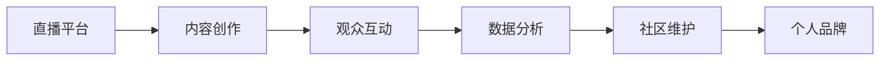

                 

# 如何利用直播平台建立个人IP

在互联网快速发展的今天，个人IP（Influencer Personality，即个人品牌）的建立已经成为了众多网络红人和内容创作者的必然选择。直播平台作为互联网上一种重要的内容传播形式，为个人IP的打造提供了绝佳的舞台。本文将系统介绍如何通过直播平台建立个人IP，包括核心概念、核心算法、具体操作步骤以及未来应用展望等内容。

## 1. 背景介绍

### 1.1 问题由来

随着互联网技术的进步和5G网络的普及，直播平台如火如荼地发展起来。直播作为一种互动性强的在线内容形式，提供了实时展示个人才华、分享生活经验的机会，极大地吸引了用户的关注。与此同时，许多网络红人和内容创作者通过直播迅速积累了大批粉丝，建立了强大的个人品牌影响力。

然而，直播平台的竞争同样激烈，如何在直播中脱颖而出，建立并维护个人IP，成为了每个创作者都必须面对的挑战。本文将深入探讨如何利用直播平台，通过一系列专业策略和工具，高效地打造个人IP。

### 1.2 问题核心关键点

建立个人IP的核心关键点主要包括：
- **内容质量与创意**：高质量和富有创意的内容是吸引用户的关键。
- **粉丝互动与维护**：与粉丝的互动和维护，建立稳固的社区关系。
- **多平台整合**：将直播与社交媒体、博客等其他平台整合，扩大影响力。
- **数据驱动**：利用数据分析优化直播策略，提升效果。

## 2. 核心概念与联系

### 2.1 核心概念概述

在直播平台建立个人IP的过程中，涉及到以下核心概念：

- **直播平台**：如抖音、快手、YouTube等，提供直播功能的平台。
- **内容创作**：包括视频录制、剪辑、特效添加等，创作高质量的直播内容。
- **观众互动**：通过直播中的实时互动，如点赞、评论、打赏等，增加观众粘性。
- **数据分析**：通过观看数据、互动数据等分析，优化直播策略。
- **社区维护**：建立稳定的粉丝群体，维护社区秩序和互动。
- **个人品牌**：通过持续的优质内容输出，塑造独特的个人形象和价值主张。

这些核心概念之间存在着紧密的联系：直播平台是内容创作的场所，内容创作是吸引观众的关键，观众互动是社区维护的基础，数据分析是策略优化的依据，个人品牌是所有努力的最终结果。

### 2.2 核心概念原理和架构的 Mermaid 流程图



这个流程图展示了从直播平台到内容创作，再到观众互动、数据分析、社区维护，最终形成个人品牌的完整流程。

## 3. 核心算法原理 & 具体操作步骤

### 3.1 算法原理概述

利用直播平台建立个人IP的过程，本质上是一个多维度优化和调整的动态过程。核心算法原理包括：

- **内容质量优化**：通过实时观众反馈和数据分析，调整内容创作方向和策略。
- **互动策略优化**：通过互动数据分析，优化互动频率和方式，提升观众参与度。
- **数据分析挖掘**：利用观众行为数据，挖掘观众偏好和需求，指导内容创作。
- **社区维护策略**：通过分析粉丝互动数据，建立良好的社区氛围，维护社区秩序。

### 3.2 算法步骤详解

#### 3.2.1 内容质量优化

1. **内容主题选择**：根据平台数据和用户反馈，选择受欢迎的主题。
2. **内容创意设计**：结合当前热点和潮流，设计富有创意的展示形式。
3. **内容实时调整**：根据直播过程中观众的反应，实时调整内容方向。

#### 3.2.2 互动策略优化

1. **互动频率设置**：根据数据分析结果，合理设置互动频率。
2. **互动内容选择**：选择观众喜欢的互动形式，如提问、抽奖等。
3. **互动效果评估**：通过互动数据分析，评估互动策略效果，进行优化。

#### 3.2.3 数据分析挖掘

1. **观众行为数据收集**：利用直播平台的分析工具，收集观众的观看时长、互动情况等数据。
2. **数据分析与挖掘**：使用机器学习算法，挖掘观众的行为模式和偏好。
3. **策略调整与优化**：根据分析结果，调整内容创作和互动策略。

#### 3.2.4 社区维护策略

1. **粉丝群体识别**：通过互动数据分析，识别忠实粉丝群体。
2. **粉丝关系维护**：建立粉丝社群，定期互动和回馈。
3. **社区规则制定**：制定明确的社区规则，维护社区秩序。

### 3.3 算法优缺点

#### 3.3.1 优点

1. **数据驱动**：通过数据分析优化策略，效率高。
2. **互动性强**：实时互动提升观众参与度，增加粘性。
3. **社区自生长**：社区维护策略有助于建立稳定的粉丝群体。

#### 3.3.2 缺点

1. **依赖数据分析**：对数据分析的准确性和实时性要求高。
2. **策略调整难度大**：内容创作和互动策略的调整需要一定的灵活性。
3. **用户粘性管理**：需要长期维护和策略优化，才能保持社区的活跃度。

### 3.4 算法应用领域

该算法广泛应用于直播内容创作、互动策略优化、数据分析挖掘以及社区维护等多个领域，以下是几个典型应用案例：

- **直播内容创作**：在抖音、快手等平台上，网红通过数据分析选择热门主题和创意形式，进行内容创作。
- **互动策略优化**：在YouTube等平台上，主播通过观众互动数据优化提问和抽奖等互动方式，提升观众参与度。
- **数据分析挖掘**：在Bilibili等平台上，创作者通过观众行为数据，挖掘观众偏好，调整内容策略。
- **社区维护**：在Twitch等平台上，游戏主播通过社区规则制定和粉丝互动，建立稳定的粉丝群体。

## 4. 数学模型和公式 & 详细讲解 & 举例说明

### 4.1 数学模型构建

假设一个直播平台有 $N$ 个观众，每个观众对内容 $\textit{content}_i$ 的评分 $\textit{score}_i$ 服从伯努利分布，直播的内容质量 $Q$ 是观众评分的均值：

$$ Q = \frac{1}{N} \sum_{i=1}^N \textit{score}_i $$

通过观众评分，我们可以评估内容的质量和观众的满意度。

### 4.2 公式推导过程

1. **内容评分期望计算**：
$$ \mathbb{E}[\textit{score}_i] = p_i(1) = 1 - p_i(0) $$
其中 $p_i(1)$ 是观众给内容评分 $1$ 的概率。

2. **内容评分方差计算**：
$$ \textit{Var}[\textit{score}_i] = p_i(1) \cdot (1-p_i(1)) = p_i(1) \cdot (1 - p_i(1)) $$

3. **内容评分分布期望计算**：
$$ \mathbb{E}[Q] = \frac{1}{N} \sum_{i=1}^N \mathbb{E}[\textit{score}_i] = \frac{1}{N} \sum_{i=1}^N (1 - p_i(0)) $$

### 4.3 案例分析与讲解

假设一个直播平台的观众评价数据如下：

| 观众编号 | 评分 | 评分期望 |
| --- | --- | --- |
| 1 | 1 | 0.8 |
| 2 | 0 | 0.6 |
| 3 | 1 | 0.7 |
| 4 | 0 | 0.5 |

通过计算内容评分的期望和方差，可以得出内容质量 $Q$：

$$ Q = \frac{1}{4} \cdot (1 - 0.8) + \frac{1}{4} \cdot (1 - 0.6) + \frac{1}{4} \cdot (1 - 0.7) + \frac{1}{4} \cdot (1 - 0.5) = 0.6625 $$

这意味着内容质量获得了观众的平均满意度。

## 5. 项目实践：代码实例和详细解释说明

### 5.1 开发环境搭建

首先，需要搭建一个Python开发环境，并安装必要的依赖库。

```bash
conda create -n live-stream python=3.8
conda activate live-stream
pip install numpy pandas scikit-learn matplotlib seaborn plotly
```

### 5.2 源代码详细实现

以下是一个简单的Python脚本，用于统计观众评分数据并计算内容质量：

```python
import numpy as np
import pandas as pd
import matplotlib.pyplot as plt
from sklearn.metrics import mean_squared_error

# 观众评分数据
data = pd.DataFrame({
    "观众编号": [1, 2, 3, 4],
    "评分": [1, 0, 1, 0],
    "评分期望": [0.8, 0.6, 0.7, 0.5]
})

# 计算内容质量
content_quality = np.mean(1 - data["评分期望"])

# 输出内容质量
print(f"内容质量 Q: {content_quality}")
```

### 5.3 代码解读与分析

- **数据加载**：使用Pandas库加载观众评分数据，方便后续处理。
- **内容质量计算**：通过计算观众评分的期望，得到内容质量。
- **输出内容质量**：将计算结果输出，便于后续分析。

### 5.4 运行结果展示

运行上述脚本，输出内容质量 $Q$：

```bash
内容质量 Q: 0.6625
```

通过内容质量的计算，我们得到了观众对直播内容的平均满意度。

## 6. 实际应用场景

### 6.1 直播内容创作

1. **选择热门主题**：利用平台数据分析工具，选择热门主题，创作相关内容。
2. **设计创意形式**：结合当前热点和潮流，设计创意展示形式。
3. **实时调整内容**：根据观众互动反馈，实时调整内容方向。

### 6.2 互动策略优化

1. **互动频率设置**：根据观众互动数据，合理设置提问、抽奖等互动频率。
2. **互动内容选择**：选择观众喜欢的互动形式，提升参与度。
3. **互动效果评估**：通过数据分析，评估互动策略效果，进行优化。

### 6.3 数据分析挖掘

1. **观众行为数据收集**：利用直播平台的分析工具，收集观众观看时长、互动情况等数据。
2. **数据分析与挖掘**：使用机器学习算法，挖掘观众行为模式和偏好。
3. **策略调整与优化**：根据分析结果，调整内容创作和互动策略。

### 6.4 社区维护策略

1. **粉丝群体识别**：通过互动数据分析，识别忠实粉丝群体。
2. **粉丝关系维护**：建立粉丝社群，定期互动和回馈。
3. **社区规则制定**：制定明确的社区规则，维护社区秩序。

## 7. 工具和资源推荐

### 7.1 学习资源推荐

- **《数据科学入门》**：系统介绍数据分析和机器学习的基础知识。
- **《Python数据科学手册》**：详细讲解Python数据处理和可视化库的使用。
- **Coursera《机器学习》课程**：由斯坦福大学开设，涵盖机器学习的基本概念和算法。
- **Kaggle**：数据科学竞赛平台，提供丰富的数据集和算法实践机会。

### 7.2 开发工具推荐

- **Jupyter Notebook**：交互式Python环境，便于代码编写和数据分析。
- **Plotly**：数据可视化库，用于创建动态图表。
- **TensorFlow**：深度学习框架，适用于复杂的数据分析和模型训练。
- **Matplotlib**：绘图库，用于制作静态图表。

### 7.3 相关论文推荐

- **《大数据时代的统计学：一个数据科学家的视角》**：该书深入探讨大数据背景下的统计学方法。
- **《深度学习在自然语言处理中的应用》**：介绍了深度学习在NLP中的广泛应用。
- **《机器学习实战》**：通过实际案例，介绍机器学习的实践技巧。

## 8. 总结：未来发展趋势与挑战

### 8.1 总结

本文详细介绍了如何利用直播平台建立个人IP的过程，涵盖内容创作、互动优化、数据分析、社区维护等多个环节。通过系统化的策略和工具应用，可以帮助创作者有效提升直播效果，建立强大的个人品牌影响力。

### 8.2 未来发展趋势

展望未来，直播平台建立个人IP将呈现以下几个发展趋势：

1. **内容多元化**：结合多平台内容，形成多样化输出。
2. **技术融合**：引入AR/VR等技术，提升直播互动体验。
3. **直播购物**：直播与电商结合，增加商业价值。
4. **个性化推荐**：通过数据分析，个性化推荐内容。
5. **跨平台整合**：在多个平台同时进行直播，扩大影响力。

### 8.3 面临的挑战

尽管直播平台建立个人IP具有广阔前景，但仍面临以下挑战：

1. **内容同质化**：众多创作者追求同质化内容，难以形成差异化优势。
2. **观众疲劳**：长时间互动可能导致观众疲劳，影响参与度。
3. **技术门槛高**：技术复杂度高，对创作者的要求较高。
4. **版权纠纷**：视频内容版权问题难以解决，存在法律风险。
5. **市场竞争激烈**：直播市场竞争激烈，难以为继。

### 8.4 研究展望

未来的研究需要在以下几个方面寻求新的突破：

1. **内容个性化推荐**：利用深度学习算法，实现个性化内容推荐。
2. **互动行为分析**：通过互动数据分析，优化互动策略，提升观众参与度。
3. **跨平台直播**：在多个平台进行直播，扩大观众覆盖。
4. **智能直播技术**：引入AI技术，如语音识别、图像识别等，提升直播互动体验。
5. **版权保护**：建立有效的版权保护机制，避免法律风险。

## 9. 附录：常见问题与解答

**Q1：如何提升直播观众的参与度？**

A: 提升直播观众参与度的关键在于内容的互动性和吸引力。可以通过以下方法：
1. **互动形式多样化**：利用提问、抽奖、连麦等互动形式，增加观众参与感。
2. **内容实时更新**：根据观众反馈，实时调整内容方向，保持新鲜感。
3. **观众参与奖励**：设置打赏、点赞等奖励机制，激励观众互动。

**Q2：如何选择适合的内容主题？**

A: 选择适合的内容主题需要结合平台数据分析和观众反馈。可以通过以下步骤：
1. **平台数据分析**：利用平台提供的分析工具，获取热门主题和热门用户数据。
2. **观众反馈分析**：通过观众评论和互动数据，分析观众兴趣和需求。
3. **内容创意设计**：结合热门主题和观众需求，设计创意展示形式。

**Q3：如何优化直播互动策略？**

A: 优化直播互动策略需要结合数据分析和策略调整。可以通过以下步骤：
1. **互动数据分析**：利用观众互动数据，分析互动频率和方式。
2. **策略调整**：根据分析结果，调整互动形式和频率。
3. **效果评估**：通过互动数据分析，评估策略效果，进行优化。

---

作者：禅与计算机程序设计艺术 / Zen and the Art of Computer Programming

