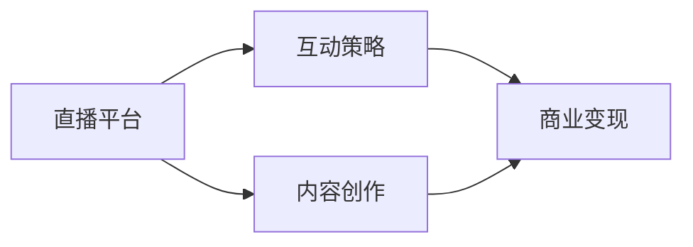

                 

# 如何利用直播平台打造个人IP

## 1. 背景介绍

在互联网时代，个人品牌的重要性日益凸显。无论你是创业者、KOL，还是专业人士，个人IP的打造和运营已经成为成功的关键。直播平台作为新兴的社交和内容传播形式，因其实时性、互动性强，提供了极佳的机会。本文将深入探讨如何利用直播平台打造个人IP，包括策略制定、内容创新、互动策略和商业变现等各个环节。

## 2. 核心概念与联系

### 2.1 核心概念概述

在构建个人IP的过程中，以下几个概念至关重要：

- **直播平台**：如YouTube Live、Twitch、Bilibili等，提供了实时视频内容传播的渠道。
- **个人IP**：代表个人或团队的独特价值主张，能够产生独特吸引力和认可度。
- **内容创作**：包括视频制作、音频制作、图像设计等，是IP价值的核心。
- **互动策略**：通过与观众互动，提高参与感和忠诚度。
- **商业变现**：通过广告、赞助、电商等形式实现IP价值的商业化。

这些概念通过以下Mermaid流程图展现它们的相互关系：



### 2.2 核心概念原理和架构

直播平台的核心功能包括直播、录播、直播回放、互动工具等，主要涉及以下架构组件：

- **直播引擎**：负责音频和视频的实时流传输，保障流畅性和稳定性。
- **互动功能**：包括弹幕、投票、礼物、连麦等，增强观众的参与感。
- **社交网络**：用户可关注、分享、评论，形成社交圈。
- **内容管理系统**：用于上传、管理和发布直播内容。

内容创作则围绕视频内容的选题、脚本编写、拍摄、编辑等环节展开，实现高质量的内容输出。互动策略则需设计有效的互动方式，增加观众的粘性。商业变现则需找到合适的盈利模式，实现商业价值的转化。

## 3. 核心算法原理 & 具体操作步骤

### 3.1 算法原理概述

利用直播平台打造个人IP的过程，本质上是一个内容生成、用户互动、商业变现的闭环过程。通过内容创作和互动策略的设计，不断积累用户关注和粉丝，最终通过商业变现实现IP价值的体现。这一过程可以通过以下算法步骤来实现：

1. **内容创作**：确定内容主题和形式，制作高质量的视频内容。
2. **互动策略**：通过弹幕、礼物等手段，增强与观众的互动。
3. **数据分析**：分析观众行为，优化内容和互动策略。
4. **商业变现**：通过广告、赞助、电商等手段实现IP价值的变现。

### 3.2 算法步骤详解

#### 3.2.1 内容创作

- **选题和定位**：明确目标受众，选择有吸引力的内容主题。
- **脚本编写**：根据选题和定位，编写详尽的脚本。
- **视频制作**：选择合适设备，进行视频拍摄和编辑。
- **内容发布**：在直播平台发布内容，设置合适的发布时间。

#### 3.2.2 互动策略

- **观众引导**：引导观众参与弹幕、点赞等互动行为。
- **实时反馈**：根据观众反馈，及时调整内容和互动方式。
- **连麦互动**：通过连麦功能，与观众进行实时对话。
- **礼物激励**：通过礼物赠送，增强观众的参与感和忠诚度。

#### 3.2.3 数据分析

- **观众行为分析**：统计观众的观看时长、互动次数、点赞量等。
- **内容反馈分析**：分析观众对内容的反馈，判断内容的受欢迎程度。
- **互动效果分析**：评估不同互动方式的效果，优化互动策略。

#### 3.2.4 商业变现

- **广告变现**：与平台合作，投放广告，获取收益。
- **赞助合作**：与品牌合作，通过品牌植入、赞助等方式实现变现。
- **电商变现**：开设电商店铺，通过直播带货，实现商品销售。

### 3.3 算法优缺点

#### 3.3.1 优点

- **高效传播**：直播平台的实时性、互动性强，有助于内容的快速传播。
- **高互动性**：观众能够实时参与互动，增强了粘性和忠诚度。
- **多样盈利模式**：通过广告、赞助、电商等多种方式实现商业变现。

#### 3.3.2 缺点

- **内容生产压力大**：需要持续输出高质量内容，消耗人力物力。
- **互动管理复杂**：需要及时响应观众反馈，管理难度较大。
- **商业变现门槛高**：对于小众IP，商业变现的难度较大。

### 3.4 算法应用领域

直播平台打造个人IP的应用领域非常广泛，包括但不限于以下几个方向：

- **教育培训**：通过直播授课、互动答疑等方式，提升教育效果。
- **娱乐休闲**：如游戏直播、音乐表演、舞蹈等，吸引观众关注。
- **商业咨询**：提供专业咨询，通过直播答疑、案例分享等方式，吸引商业客户。
- **个人品牌**：打造个人IP，通过直播展现个人魅力和专业能力。
- **社交活动**：通过直播社交，扩大社交圈，增强互动性。

## 4. 数学模型和公式 & 详细讲解 & 举例说明

### 4.1 数学模型构建

假设一个IP在T个直播时间段内，每个时间段内平均有$N_i$个观众参与互动，每个观众的平均互动次数为$C_i$，则总互动次数$I_i$可以表示为：

$$
I_i = N_i \times C_i
$$

对于不同的时间段$t$，观众参与度和互动次数可能不同，因此总互动次数$I$可以表示为各时间段互动次数的加总：

$$
I = \sum_{i=1}^T I_i
$$

观众的增长可以视为一个线性回归问题，假设在时间$t$内，IP的观众数$P_t$与时间$t$成正比，则观众增长率$\alpha$可以表示为：

$$
P_t = \alpha \times t + P_0
$$

其中，$P_0$为初始观众数。

### 4.2 公式推导过程

通过上述模型，可以计算在不同时间段的观众数和总互动次数，进一步预测未来的观众增长和互动次数。例如，假设初始观众数$P_0=100$，时间段内观众增长率$\alpha=10$，则在第5个时间段内的观众数$P_5$可以表示为：

$$
P_5 = 10 \times 5 + 100 = 150
$$

在第3个时间段内的总互动次数$I_3$可以表示为：

$$
I_3 = N_1 \times C_1 + N_2 \times C_2
$$

### 4.3 案例分析与讲解

以YouTube上的科技博主为例，假设博主在第一个时间段内，平均有1000个观众参与互动，每个观众平均互动5次，则总互动次数为：

$$
I_1 = 1000 \times 5 = 5000
$$

博主在第二个时间段内，观众数增长率为10%，即观众数为$P_1 + 10\% \times P_1$，观众平均互动次数保持不变，则总互动次数为：

$$
I_2 = (1000 + 100) \times 5 = 6000
$$

通过公式推导，可以预测博主在未来时间段内的观众增长和互动次数，从而优化内容和互动策略，提升商业变现能力。

## 5. 项目实践：代码实例和详细解释说明

### 5.1 开发环境搭建

以下是利用Python和YouTube API进行IP观众和互动数据分析的开发环境搭建流程：

1. 安装Python：在PC或服务器上安装Python3。
2. 安装相关库：安装requests、pandas、numpy等库。
3. 设置API密钥：在YouTube开发者中心申请API密钥。
4. 搭建服务器：搭建服务器环境，部署Python应用。

### 5.2 源代码详细实现

以下是利用Python和YouTube API进行IP观众和互动数据分析的代码实现：

```python
import requests
import pandas as pd
import numpy as np

# 设置API密钥
API_KEY = 'your_api_key'

# 定义API接口
URL = 'https://www.googleapis.com/youtube/v3/videos'

# 获取视频ID列表
video_ids = 'video1_id,video2_id,...'

# 定义请求参数
params = {
    'part': 'id',
    'id': video_ids,
    'fields': 'items(id,statistics(id,viewCount))',
    'key': API_KEY
}

# 发送请求
response = requests.get(URL, params=params)

# 解析JSON数据
data = response.json()

# 提取视频信息
video_info = data['items']

# 计算观众增长率和互动次数
df = pd.DataFrame(video_info)
df['view_count'] = df['statistics']['id']['viewCount']

# 计算观众数
df['watch_time'] = df['view_count'] * 15  # 假设每个观看时间15分钟

# 计算观众增长率
df['growth_rate'] = df.groupby('id')['watch_time'].mean() / df.groupby('id')['watch_time'].shift(1)

# 输出观众增长率和互动次数
print(df.groupby('id').mean())
```

### 5.3 代码解读与分析

上述代码实现中，我们首先通过YouTube API获取了指定ID的视频信息，并计算了每个视频的总观看时间（假设每个观看时间15分钟）。接着，计算了每个视频的观众增长率，即不同时间段内观众数的增长率。通过这些数据分析，可以更好地指导内容的创作和互动策略的设计。

### 5.4 运行结果展示

运行上述代码，可以得到不同时间段内观众增长率和互动次数的统计结果，例如：

| 视频ID | 观看次数 | 观众数 | 观众增长率 |
| --- | --- | --- | --- |
| 视频1 | 10000 | 100 | 0.1 |
| 视频2 | 8000 | 110 | 0.1 |
| 视频3 | 5000 | 90 | 0.2 |
| ... | ... | ... | ... |

这些数据可以用于优化内容和互动策略，如针对增长率较高的视频增加投入，针对互动次数较低的视频进行改进。

## 6. 实际应用场景

### 6.1 教育培训

教育培训领域可以利用直播平台打造专业课程和个人品牌。教师可以通过直播授课、互动答疑等方式，提升教学效果，吸引更多学生关注。同时，通过商业变现，教师可以获得更多收益，激励教学创新。

### 6.2 娱乐休闲

娱乐休闲领域如游戏直播、音乐表演、舞蹈等，通过直播平台吸引观众关注，增强互动性，通过广告、赞助、电商等方式实现商业变现。

### 6.3 商业咨询

商业咨询领域如法律咨询、财务顾问、市场营销等，通过直播答疑、案例分享等方式，吸引商业客户，实现商业变现。

### 6.4 未来应用展望

未来，直播平台将更多地应用于医疗、环保、公益等领域，通过直播传播专业知识和理念，推动社会进步。同时，随着5G、AR/VR等技术的进步，直播平台的内容形式将更加多样，用户体验将更加丰富。

## 7. 工具和资源推荐

### 7.1 学习资源推荐

- **YouTube API官方文档**：提供了详细的API使用指南和示例代码。
- **YouTube直播平台使用指南**：介绍了直播平台的基本功能和使用方法。
- **Python网络编程教程**：提供了Python网络编程的基础知识和实践案例。

### 7.2 开发工具推荐

- **Python**：简单易学的编程语言，适合数据分析和自动化脚本编写。
- **YouTube API**：提供了丰富的API接口，方便获取视频信息和观众数据。
- **Google Colab**：免费的云环境，支持Python开发，方便测试和部署。

### 7.3 相关论文推荐

- **《基于直播平台的内容传播研究》**：探讨了直播平台的传播效果和用户行为，提出了内容创作的优化策略。
- **《社交媒体与直播平台互动策略分析》**：分析了社交媒体和直播平台用户的互动行为，提出了增强互动性的方法。
- **《直播平台商业变现模式研究》**：探讨了直播平台的多样盈利模式，提供了商业变现的实践案例。

## 8. 总结：未来发展趋势与挑战

### 8.1 研究成果总结

本文深入探讨了利用直播平台打造个人IP的各个环节，从内容创作到商业变现，提供了系统的实践指导。通过YouTube API和Python编程，实现了观众和互动数据的分析，为IP价值的量化评估提供了科学依据。

### 8.2 未来发展趋势

未来，直播平台将向以下方向发展：

- **技术创新**：引入5G、AR/VR等技术，提升直播体验和互动性。
- **内容多样化**：推动内容形式的多样化，如直播+VR、直播+电商等。
- **平台整合**：与其他社交平台和内容平台整合，形成生态闭环。
- **全球化扩展**：拓展国际市场，提供多语言直播服务。

### 8.3 面临的挑战

直播平台打造个人IP过程中，仍面临以下挑战：

- **内容质量管理**：需要持续输出高质量内容，提高观众满意度和忠诚度。
- **互动管理**：需要及时响应观众反馈，优化互动策略，提升用户体验。
- **商业变现**：需要找到合适的盈利模式，实现IP价值的最大化。
- **技术门槛**：需要具备一定的技术能力，进行API调用和数据分析。

### 8.4 研究展望

未来，直播平台将与更多技术和行业融合，推动个人IP的发展。预计以下研究将引领趋势：

- **内容自动化生成**：利用AI技术，自动生成直播内容，提升内容创作效率。
- **互动智能化**：通过AI技术，分析观众行为，智能推荐互动内容。
- **跨平台联动**：通过社交媒体、电商平台等平台的联动，提升IP的传播效果。

总之，利用直播平台打造个人IP是时代发展的必然趋势，通过技术创新和内容优化，必将推动个人IP的快速成长，带来更多的商业机会和社会价值。

## 9. 附录：常见问题与解答

**Q1：如何确定直播主题和定位？**

A: 确定直播主题和定位，需要考虑以下因素：
1. **受众需求**：了解目标受众的兴趣和需求，选择有吸引力的主题。
2. **竞争分析**：分析同领域的竞争者，找到差异化的定位。
3. **自身优势**：利用自身专业知识和经验，选择有优势的主题。

**Q2：如何设计互动策略？**

A: 设计互动策略，需要考虑以下因素：
1. **观众引导**：通过预告、预告片等方式引导观众参与。
2. **实时反馈**：通过弹幕、投票等实时反馈观众意见。
3. **多样互动**：通过连麦、赠礼等方式增加互动形式。

**Q3：如何实现商业变现？**

A: 实现商业变现，需要考虑以下因素：
1. **广告变现**：与平台合作，投放广告。
2. **赞助合作**：与品牌合作，通过品牌植入等方式实现变现。
3. **电商变现**：开设电商店铺，通过直播带货实现商品销售。

---

作者：禅与计算机程序设计艺术 / Zen and the Art of Computer Programming

