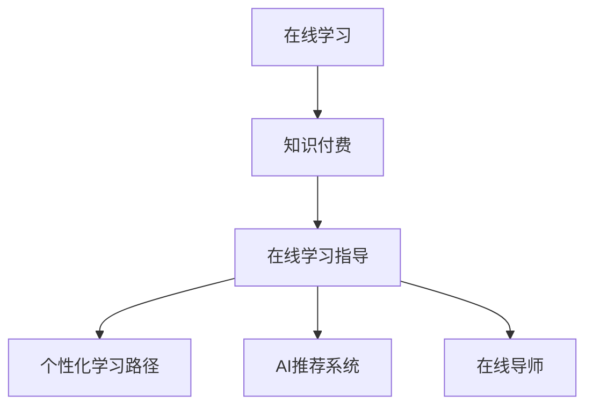

                 

## 1. 背景介绍

在信息爆炸的今天，学习资源日益丰富，学习方式也在不断变革。从传统的教室讲授到如今的在线学习，教育行业的数字化转型已是大势所趋。而在线学习，无论是学生还是成人，都为提高自身的竞争力提供了更多可能。然而，如何高效、有针对性地学习，提升学习效果，成为在线学习中面临的一个重要问题。本文将探讨如何利用知识付费平台，实现在线学习与在线学习指导，通过高效的学习方法和资源整合，帮助用户实现高效学习。

## 2. 核心概念与联系

### 2.1 核心概念概述

在线学习（Online Learning）是指学习者通过互联网技术，利用各类在线资源进行自主学习的过程。这种学习方式打破了时间和空间的限制，为学习者提供了极大的灵活性。然而，在线学习中存在诸多问题，如学习目标不明确、学习动机不足、学习资源质量参差不齐等，这些问题都可能影响学习效果。

知识付费（Knowledge Paywall）是一种新兴的在线学习模式，通过提供高质量的课程和专业知识，帮助用户通过付费获取优质学习资源。相比免费资源，知识付费资源更具针对性和专业性，能够满足用户个性化的学习需求。

在线学习指导（Online Learning Guidance）是指在在线学习过程中，通过技术手段和人工干预，为用户提供个性化的学习建议和指导，以帮助其高效学习。指导形式包括AI推荐系统、在线导师、学习路径规划等。

### 2.2 核心概念原理和架构的 Mermaid 流程图



这个流程图展示了在线学习、知识付费和在线学习指导三者之间的联系：

1. **在线学习**：用户通过网络平台获取学习资源，进行自主学习。
2. **知识付费**：用户通过付费获取高质量的课程和学习资料，提升学习效果。
3. **在线学习指导**：通过AI推荐系统和在线导师，为用户提供个性化的学习建议和指导。

## 3. 核心算法原理 & 具体操作步骤

### 3.1 算法原理概述

在线学习指导的核心算法包括：

- **个性化学习路径生成算法**：通过分析用户的学习行为和兴趣偏好，生成个性化的学习路径，帮助用户高效学习。
- **AI推荐算法**：根据用户的学习历史和行为，推荐符合其兴趣和需求的学习资源。
- **在线导师辅助系统**：通过AI或人工导师，提供学习建议和问题解答，辅助用户学习。

### 3.2 算法步骤详解

#### 个性化学习路径生成算法

1. **数据收集**：收集用户的学习行为数据，包括课程选择、学习时间、答题情况等。
2. **兴趣建模**：通过聚类和分类算法，对用户兴趣进行建模，生成兴趣特征向量。
3. **路径生成**：结合用户的学习进度和兴趣特征，生成个性化学习路径，包含推荐课程、学习时间安排等。

#### AI推荐算法

1. **数据预处理**：对用户的历史学习数据进行预处理，包括特征提取和数据清洗。
2. **模型训练**：训练推荐模型，如协同过滤、基于内容的推荐等。
3. **推荐生成**：根据用户的行为特征和兴趣，生成个性化推荐列表。

#### 在线导师辅助系统

1. **用户画像构建**：通过学习行为数据和用户画像构建，了解用户的学习能力和偏好。
2. **问题解答**：在用户遇到学习问题时，通过AI或人工导师，提供解答和指导。
3. **学习路径调整**：根据用户的学习效果和反馈，动态调整学习路径和内容。

### 3.3 算法优缺点

#### 个性化学习路径生成算法的优缺点

**优点**：

- 通过个性化路径，提升学习效率和效果。
- 针对用户兴趣和需求进行推荐，提升用户满意度。

**缺点**：

- 需要大量用户数据，隐私保护和安全问题难以解决。
- 数据偏见可能导致路径生成不合理。

#### AI推荐算法的优缺点

**优点**：

- 通过算法推荐，提升资源匹配度。
- 实时性高，能够根据用户行为动态调整推荐内容。

**缺点**：

- 对数据质量要求高，需要大量用户行为数据。
- 难以避免冷启动问题和长尾资源推荐问题。

#### 在线导师辅助系统的优缺点

**优点**：

- 提供即时学习指导，解决用户疑问。
- 提升学习体验和效果。

**缺点**：

- 人工导师资源有限，难以覆盖所有用户。
- 成本较高，难以大规模应用。

### 3.4 算法应用领域

在线学习指导和知识付费技术，已经在教育、职业技能培训、在线课程等多个领域得到了广泛应用。

- **教育领域**：K-12教育、大学选修课、职业技能培训等，通过在线学习指导和知识付费，提升教学效果和学生学习效率。
- **职业技能培训**：IT技能、金融分析、市场营销等，通过在线学习指导和知识付费，提升职业竞争力。
- **在线课程**：在线教育平台如Coursera、Udemy等，通过知识付费模式，提供高质量课程和专业指导，满足用户个性化学习需求。

## 4. 数学模型和公式 & 详细讲解 & 举例说明

### 4.1 数学模型构建

个性化学习路径生成算法和AI推荐算法，都可以通过构建数学模型来优化实现。以协同过滤算法为例：

1. **用户-物品评分矩阵**：构建用户和课程的评分矩阵，每个用户对每个课程评分。
2. **用户兴趣向量**：通过奇异值分解(SVD)等算法，对用户评分矩阵进行降维，得到用户兴趣向量。
3. **个性化推荐**：根据用户兴趣向量和课程特征向量，计算推荐分数，生成推荐列表。

### 4.2 公式推导过程

#### 协同过滤算法

1. **用户-物品评分矩阵**：设$U$为用户集合，$I$为课程集合，$R_{ui} = r_{ui} \in [0,1]$表示用户$u$对课程$i$的评分。
2. **用户兴趣向量**：对评分矩阵进行奇异值分解，设$U'$为左奇异向量，$V'$为右奇异向量，则$U'$和$V'$分别为用户和课程的兴趣向量。
3. **推荐生成**：用户$u$对课程$i$的预测评分$r'_{ui}$，可通过$U'$和$V'$计算：
   $$
   r'_{ui} = \sum_{j=1}^k (u'_{uj}v'_{ij})
   $$
   其中$k$为奇异值分解的维度。

### 4.3 案例分析与讲解

以Coursera平台的在线学习指导为例：

1. **用户行为数据收集**：通过平台记录用户的学习路径、课程评分、课程完成时间等行为数据。
2. **兴趣建模**：利用协同过滤算法，生成用户和课程的兴趣向量。
3. **路径生成**：根据兴趣向量，生成个性化学习路径，推荐用户未完成的课程。

## 5. 项目实践：代码实例和详细解释说明

### 5.1 开发环境搭建

开发环境搭建主要包括以下步骤：

1. **环境安装**：安装Python、Pandas、Scikit-learn、TensorFlow等常用库。
2. **数据准备**：收集和处理用户行为数据，生成用户和课程的评分矩阵。
3. **模型训练**：训练协同过滤推荐模型，生成用户兴趣向量。
4. **路径生成**：根据用户兴趣向量，生成个性化学习路径。

### 5.2 源代码详细实现

以下是一个简单的协同过滤算法实现代码示例：

```python
import pandas as pd
import numpy as np
from scipy.sparse import csr_matrix
from scipy.linalg import svds

# 读取用户评分数据
data = pd.read_csv('user_ratings.csv', index_col='user_id')

# 构建用户-物品评分矩阵
R = data.pivot_table(values='rating', index='user_id', columns='course_id').fillna(0)

# 构建评分矩阵的稀疏表示
R_sparse = csr_matrix(R)

# 奇异值分解，生成用户和课程的兴趣向量
U, s, V = svds(R_sparse, k=10)

# 生成个性化学习路径
recommendations = np.dot(U, V.T)  # 兴趣向量计算推荐分数
```

### 5.3 代码解读与分析

**数据准备**：
- 使用Pandas库读取用户行为数据，构建用户-物品评分矩阵。
- 使用SciPy库构建稀疏矩阵表示，方便计算。

**模型训练**：
- 使用SciPy库的奇异值分解算法，生成用户和课程的兴趣向量。

**路径生成**：
- 通过兴趣向量计算推荐分数，生成个性化学习路径。

### 5.4 运行结果展示

通过上述代码，可以生成用户和课程的兴趣向量，并计算推荐分数。运行结果展示了用户和课程之间的相似度，帮助用户发现潜在的兴趣课程。

## 6. 实际应用场景

### 6.1 在线学习指导

在线学习指导在多个领域得到了广泛应用：

- **K-12教育**：通过在线学习指导和知识付费，提供个性化学习路径和课程推荐，帮助学生高效学习。
- **高等教育**：通过在线学习指导和知识付费，提供高质量的选修课程和学习资源，提升教学效果。
- **职业培训**：通过在线学习指导和知识付费，提供职业技能培训和个性化指导，提升职业竞争力。

### 6.2 未来应用展望

随着技术的发展，在线学习指导和知识付费将进一步普及，带来更多可能：

1. **虚拟教室**：通过AI导师和虚拟现实技术，构建沉浸式学习环境。
2. **自适应学习**：根据用户学习效果和反馈，动态调整学习路径和内容。
3. **跨领域学习**：通过多领域知识的融合，提升学习深度和广度。
4. **个性化定制**：根据用户需求和偏好，提供个性化学习资源和指导。

## 7. 工具和资源推荐

### 7.1 学习资源推荐

1. **Coursera**：提供大量高质量在线课程，涵盖多个领域，支持个性化学习路径生成和在线导师辅助。
2. **Kaggle**：数据科学和机器学习竞赛平台，提供丰富的学习资源和实践机会。
3. **edX**：提供在线课程和认证，支持个性化学习路径生成和在线导师辅助。

### 7.2 开发工具推荐

1. **Jupyter Notebook**：轻量级开发环境，支持Python和多种数据处理库，方便数据探索和模型调试。
2. **TensorBoard**：可视化工具，实时监测模型训练状态，提供丰富的图表呈现方式。
3. **Weights & Biases**：实验跟踪工具，记录和可视化模型训练过程中的各项指标。

### 7.3 相关论文推荐

1. **“Personalized Learning Paths with Collaborative Filtering”**：论文研究个性化学习路径生成算法，提出基于协同过滤的推荐方法。
2. **“A Survey on Recommendation Systems Based on Implicit Feedback”**：综述文章，涵盖协同过滤、基于内容的推荐等主流推荐算法。
3. **“AI Teaching Assistant in E-Learning Platforms”**：论文探讨在线导师辅助系统的实现，利用AI技术提供学习建议和问题解答。

## 8. 总结：未来发展趋势与挑战

### 8.1 研究成果总结

本文介绍了如何利用在线学习指导和知识付费平台，实现在线学习，通过个性化路径生成、AI推荐和在线导师辅助，提升学习效果。通过实践案例，展示了在线学习指导的实际应用。

### 8.2 未来发展趋势

未来在线学习指导和知识付费将呈现以下趋势：

1. **个性化学习**：通过AI和机器学习，提供个性化学习路径和资源推荐。
2. **自适应学习**：动态调整学习内容和路径，根据用户反馈不断优化学习效果。
3. **跨领域学习**：结合多领域知识，提升学习深度和广度。
4. **虚拟现实**：通过虚拟现实技术，提供沉浸式学习体验。

### 8.3 面临的挑战

尽管在线学习指导和知识付费带来了诸多便利，但仍面临诸多挑战：

1. **隐私保护**：大量用户数据的收集和使用，存在隐私泄露风险。
2. **数据质量**：数据偏差和质量问题，可能导致推荐不准确。
3. **成本问题**：高质量课程和导师资源有限，成本较高。
4. **技术难度**：个性化路径生成和推荐算法需要复杂的数学模型和算法实现。

### 8.4 研究展望

未来在线学习指导和知识付费需要在隐私保护、数据质量、成本和技术难度等方面进行持续优化：

1. **隐私保护技术**：开发隐私保护算法，确保用户数据安全。
2. **数据增强**：通过多源数据融合，提升数据质量和推荐准确性。
3. **降低成本**：探索开源和共享资源，降低高质量课程和导师成本。
4. **简化技术**：研究更简单、易用、高效的推荐算法。

## 9. 附录：常见问题与解答

**Q1：如何保证在线学习指导的个性化和高效性？**

A: 通过数据收集和分析，建立用户画像，结合AI推荐和在线导师辅助，生成个性化学习路径。同时，通过动态调整学习内容和路径，提升学习效果。

**Q2：在线学习指导和知识付费的实施难点是什么？**

A: 实施难点主要包括隐私保护、数据质量和成本问题。需要开发隐私保护算法，提升数据质量，同时降低高质量资源成本。

**Q3：在线学习指导和知识付费的收益如何衡量？**

A: 收益主要体现在提升学习效果和用户满意度上。可以通过学习效果评价指标，如成绩提升、学习时长等，衡量收益。

**Q4：在线学习指导和知识付费的未来方向是什么？**

A: 未来方向包括个性化学习、自适应学习、跨领域学习等，通过技术创新，提升学习效果和用户体验。

---

作者：禅与计算机程序设计艺术 / Zen and the Art of Computer Programming

