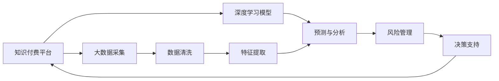

                 

# 如何利用知识付费实现在线投资决策与风险管理？

> 关键词：知识付费, 在线投资决策, 风险管理, 大数据分析, 深度学习, 人工智能, 自然语言处理(NLP)

## 1. 背景介绍

### 1.1 问题由来

在全球金融科技的浪潮中，传统的投资决策和风险管理方式面临着前所未有的挑战。传统的金融分析师依赖于繁琐的数据分析和复杂的模型计算，难以快速响应用户需求，且其决策过程缺乏透明性和可解释性。与此同时，大数据和人工智能技术的快速发展，为在线投资决策与风险管理带来了新的可能性。知识付费作为一个新兴的领域，利用专业化的知识和信息为投资者提供实时、精准的投资建议，有效弥补了传统投资决策方式的缺陷。

### 1.2 问题核心关键点

知识付费实现在线投资决策与风险管理的关键点在于以下几个方面：

- **实时数据获取**：在在线投资决策与风险管理中，实时获取市场数据是至关重要的。如何高效地收集和处理海量数据，提取有价值的信息，成为技术攻关的重点。
- **精准分析和预测**：利用深度学习、大数据分析等先进技术，对市场数据进行深入分析，精准预测未来的市场趋势和投资机会。
- **风险管理**：在线投资决策与风险管理不仅需要精准预测，还需要有效的风险评估和控制。如何构建可靠的风险管理模型，及时识别和应对潜在风险，成为另一个技术难题。
- **用户友好**：在线投资决策工具需要具备良好的用户体验，包括简洁的界面设计、实时交互和反馈机制等。

### 1.3 问题研究意义

利用知识付费技术实现在线投资决策与风险管理，对于推动金融科技的发展具有重要意义：

1. **提高决策效率**：通过大数据和人工智能技术，实现实时分析和预测，大幅提高投资决策的效率。
2. **降低成本**：知识付费服务往往比传统的金融分析师服务更具成本效益，有助于降低投资者的决策成本。
3. **提升透明性**：在线投资决策工具能够提供透明的决策过程，增强投资者的信任感。
4. **个性化服务**：利用个性化推荐算法，为每位投资者提供量身定制的投资建议，提升投资体验。
5. **支持创新**：促进金融科技的创新发展，推动金融行业的数字化转型。

## 2. 核心概念与联系

### 2.1 核心概念概述

在线投资决策与风险管理涉及多个核心概念，包括知识付费、大数据分析、深度学习、自然语言处理(NLP)等。这些概念之间相互关联，共同构成了在线投资决策与风险管理的完整框架。

- **知识付费**：通过专业知识和技术，为投资者提供实时、精准的投资建议，帮助其进行投资决策和风险管理。
- **大数据分析**：对海量市场数据进行收集、清洗、分析和挖掘，提取有价值的信息，为投资决策和风险管理提供数据支持。
- **深度学习**：利用深度神经网络进行模型训练和预测，提高数据分析的精度和效率。
- **自然语言处理(NLP)**：处理和分析文本数据，实现自动化的新闻摘要、市场评论分析等功能，为投资决策提供更有深度的信息。

### 2.2 核心概念原理和架构的 Mermaid 流程图



## 3. 核心算法原理 & 具体操作步骤

### 3.1 算法原理概述

在线投资决策与风险管理主要利用深度学习和自然语言处理技术，通过大数据分析来提取市场信息，并预测市场趋势和风险。其核心算法原理如下：

1. **数据预处理**：收集和清洗市场数据，提取关键特征。
2. **深度学习模型训练**：使用深度神经网络进行模型训练，对历史市场数据进行学习和预测。
3. **自然语言处理**：通过文本分析，提取市场评论、新闻等文本信息，转化为结构化数据。
4. **风险管理**：构建风险评估模型，识别潜在风险，并制定风险管理策略。
5. **决策支持**：将深度学习预测结果、市场评论分析和风险评估结果综合，提供投资决策支持。

### 3.2 算法步骤详解

#### 3.2.1 数据预处理

1. **数据收集**：通过API接口或爬虫工具，从股票交易平台、财经新闻网站、社交媒体等渠道获取市场数据。
2. **数据清洗**：对收集到的数据进行清洗，去除无效数据和异常值，确保数据的准确性和完整性。
3. **特征提取**：对清洗后的数据进行特征提取，选择对投资决策和风险管理有重要影响的特征，如股价波动率、成交量、技术指标等。

#### 3.2.2 深度学习模型训练

1. **模型选择**：选择适合市场的深度学习模型，如RNN、LSTM、Transformer等。
2. **数据划分**：将数据划分为训练集、验证集和测试集，确保模型训练的可靠性和泛化能力。
3. **模型训练**：使用训练集进行模型训练，调整模型参数以最小化预测误差。
4. **模型评估**：在验证集上评估模型性能，根据评估结果调整模型参数。
5. **模型测试**：在测试集上测试模型性能，确保模型在未知数据上的泛化能力。

#### 3.2.3 自然语言处理

1. **文本收集**：收集财经新闻、市场评论等文本数据。
2. **文本清洗**：去除文本中的噪声和无用信息，如HTML标签、停用词等。
3. **分词与向量化**：对文本进行分词处理，并使用词向量模型（如Word2Vec、BERT等）将文本转化为结构化数据。
4. **情感分析**：利用情感分析模型，判断文本中的情感倾向，提取市场情绪信息。
5. **主题分析**：利用主题模型（如LDA），提取文本中的关键主题，帮助识别市场热点。

#### 3.2.4 风险管理

1. **风险评估**：构建风险评估模型，对市场数据和情感分析结果进行综合评估，识别潜在的风险因素。
2. **风险控制**：根据风险评估结果，制定相应的风险管理策略，如止损策略、仓位控制等。
3. **实时监控**：实时监控市场动态，及时调整风险管理策略，确保投资决策的安全性。

#### 3.2.5 决策支持

1. **综合分析**：将深度学习预测结果、自然语言处理结果和风险管理结果综合，提供全面的市场分析。
2. **投资建议**：根据综合分析结果，提供实时、个性化的投资建议。
3. **交互反馈**：与用户进行实时交互，收集用户反馈，优化投资建议。

### 3.3 算法优缺点

#### 3.3.1 优点

- **实时性**：利用深度学习和大数据分析技术，实现实时市场分析和预测，满足用户对实时投资建议的需求。
- **精确性**：通过深度学习和自然语言处理技术，提高分析的精度和准确性，提升投资决策的科学性。
- **个性化**：根据用户的历史投资数据和行为，提供量身定制的投资建议，提升用户体验。
- **透明性**：提供透明化的分析过程和决策依据，增强用户信任感。

#### 3.3.2 缺点

- **数据依赖**：对数据的质量和完整性依赖较高，数据偏差可能导致分析结果的不准确。
- **模型复杂性**：深度学习模型和自然语言处理模型较为复杂，需要较高的计算资源和专业技能。
- **风险控制**：尽管风险管理模型能够识别潜在的风险，但仍需依赖人工进行实时监控和调整，存在一定的不确定性。

### 3.4 算法应用领域

在线投资决策与风险管理技术可以应用于多种场景，包括股票交易、基金投资、外汇交易等。在实际应用中，可以根据具体的投资需求和市场环境，对算法进行灵活调整和优化，以实现最佳效果。

## 4. 数学模型和公式 & 详细讲解 & 举例说明

### 4.1 数学模型构建

#### 4.1.1 数据预处理

- **数据收集**：$D = \{(x_i, y_i)\}_{i=1}^N, x_i \in \mathcal{X}, y_i \in \mathcal{Y}$
- **数据清洗**：$\tilde{D} = \{\tilde{x}_i, \tilde{y}_i\}_{i=1}^N$
- **特征提取**：$F: \tilde{D} \rightarrow \mathbb{R}^d$

#### 4.1.2 深度学习模型训练

- **模型选择**：$M_{\theta}$，$\theta \in \mathbb{R}^d$
- **数据划分**：$D = \{(x_i, y_i)\}_{i=1}^N \rightarrow (D_{train}, D_{val}, D_{test})$
- **模型训练**：$\theta = \mathop{\arg\min}_{\theta} \mathcal{L}(M_{\theta}, D_{train})$
- **模型评估**：$\mathcal{L}(M_{\theta}, D_{val})$
- **模型测试**：$\mathcal{L}(M_{\theta}, D_{test})$

#### 4.1.3 自然语言处理

- **文本收集**：$T = \{t_i\}_{i=1}^M$
- **文本清洗**：$\tilde{T} = \{\tilde{t}_i\}_{i=1}^M$
- **分词与向量化**：$V: \tilde{T} \rightarrow \mathbb{R}^{n \times d}$
- **情感分析**：$S: V \rightarrow \mathbb{R}$
- **主题分析**：$H: V \rightarrow \mathbb{R}^k$

#### 4.1.4 风险管理

- **风险评估**：$R: D \cup T \rightarrow [0,1]$
- **风险控制**：$C: R \rightarrow A$
- **实时监控**：$M: R \rightarrow A$

#### 4.1.5 决策支持

- **综合分析**：$A = (P, S, H, R)$
- **投资建议**：$I: A \rightarrow \{buy, hold, sell\}$
- **交互反馈**：$F: I, user_feedback \rightarrow A$

### 4.2 公式推导过程

#### 4.2.1 数据预处理

1. **数据收集**：$D = \{(x_i, y_i)\}_{i=1}^N, x_i \in \mathcal{X}, y_i \in \mathcal{Y}$
2. **数据清洗**：$\tilde{D} = \{\tilde{x}_i, \tilde{y}_i\}_{i=1}^N$
3. **特征提取**：$F: \tilde{D} \rightarrow \mathbb{R}^d$

#### 4.2.2 深度学习模型训练

- **模型选择**：$M_{\theta}$，$\theta \in \mathbb{R}^d$
- **数据划分**：$D = \{(x_i, y_i)\}_{i=1}^N \rightarrow (D_{train}, D_{val}, D_{test})$
- **模型训练**：$\theta = \mathop{\arg\min}_{\theta} \mathcal{L}(M_{\theta}, D_{train})$
- **模型评估**：$\mathcal{L}(M_{\theta}, D_{val})$
- **模型测试**：$\mathcal{L}(M_{\theta}, D_{test})$

#### 4.2.3 自然语言处理

- **文本收集**：$T = \{t_i\}_{i=1}^M$
- **文本清洗**：$\tilde{T} = \{\tilde{t}_i\}_{i=1}^M$
- **分词与向量化**：$V: \tilde{T} \rightarrow \mathbb{R}^{n \times d}$
- **情感分析**：$S: V \rightarrow \mathbb{R}$
- **主题分析**：$H: V \rightarrow \mathbb{R}^k$

#### 4.2.4 风险管理

- **风险评估**：$R: D \cup T \rightarrow [0,1]$
- **风险控制**：$C: R \rightarrow A$
- **实时监控**：$M: R \rightarrow A$

#### 4.2.5 决策支持

- **综合分析**：$A = (P, S, H, R)$
- **投资建议**：$I: A \rightarrow \{buy, hold, sell\}$
- **交互反馈**：$F: I, user_feedback \rightarrow A$

### 4.3 案例分析与讲解

#### 4.3.1 股票交易

1. **数据收集**：从股票交易平台获取历史股价数据。
2. **数据清洗**：去除缺失数据和异常值。
3. **特征提取**：选择股价波动率、成交量等关键特征。
4. **深度学习模型训练**：使用LSTM模型，预测未来股价走势。
5. **自然语言处理**：收集财经新闻，提取市场情绪信息。
6. **风险管理**：构建风险评估模型，识别潜在风险。
7. **决策支持**：综合股价预测和市场情绪分析结果，提供投资建议。

#### 4.3.2 基金投资

1. **数据收集**：从基金公司获取基金历史业绩和持仓数据。
2. **数据清洗**：去除重复数据和异常值。
3. **特征提取**：选择基金管理人、基金规模等关键特征。
4. **深度学习模型训练**：使用RNN模型，预测基金未来业绩。
5. **自然语言处理**：收集基金经理的评论和市场分析报告，提取关键信息。
6. **风险管理**：构建风险评估模型，识别潜在风险。
7. **决策支持**：综合基金业绩预测和市场分析结果，提供投资建议。

## 5. 项目实践：代码实例和详细解释说明

### 5.1 开发环境搭建

#### 5.1.1 数据采集工具

- **pandas**：用于数据清洗和处理。
- **requests**：用于网络数据采集。
- **BeautifulSoup**：用于网页数据提取。

#### 5.1.2 数据存储工具

- **PostgreSQL**：用于高效存储和查询海量数据。
- **Redis**：用于实时数据缓存和处理。

#### 5.1.3 数据分析工具

- **NumPy**：用于高效数学运算。
- **SciPy**：用于科学计算。
- **matplotlib**：用于数据可视化。

#### 5.1.4 机器学习框架

- **PyTorch**：用于深度学习模型训练。
- **TensorFlow**：用于深度学习模型部署。
- **Keras**：用于深度学习模型构建。

#### 5.1.5 自然语言处理工具

- **NLTK**：用于自然语言处理。
- **spaCy**：用于命名实体识别和分词。
- **TextBlob**：用于情感分析。

### 5.2 源代码详细实现

#### 5.2.1 数据预处理

```python
import pandas as pd
import requests
from bs4 import BeautifulSoup

# 数据采集
url = 'https://example.com/stock-data'
response = requests.get(url)
soup = BeautifulSoup(response.content, 'html.parser')
data = soup.find_all('table')
df = pd.DataFrame(data)
df.to_csv('stock_data.csv', index=False)

# 数据清洗
df = df.dropna()
df = df.drop_duplicates()

# 特征提取
features = ['price', 'volume', 'momentum']
X = df[features]
```

#### 5.2.2 深度学习模型训练

```python
import torch
import torch.nn as nn
import torch.optim as optim
from torch.utils.data import DataLoader

# 模型定义
class LSTM(nn.Module):
    def __init__(self, input_size, hidden_size, output_size):
        super(LSTM, self).__init__()
        self.hidden_size = hidden_size
        self.lstm = nn.LSTM(input_size, hidden_size)
        self.fc = nn.Linear(hidden_size, output_size)

    def forward(self, x):
        h0 = torch.zeros(1, x.size(0), self.hidden_size).to(device)
        c0 = torch.zeros(1, x.size(0), self.hidden_size).to(device)
        out, _ = self.lstm(x, (h0, c0))
        out = self.fc(out[:, -1, :])
        return out

# 模型训练
model = LSTM(input_size, hidden_size, output_size)
optimizer = optim.Adam(model.parameters(), lr=0.001)
loss_fn = nn.MSELoss()

# 数据划分
X_train, X_val, X_test = train_test_split(X, test_size=0.2)
y_train, y_val, y_test = train_test_split(y, test_size=0.2)

# 训练循环
for epoch in range(num_epochs):
    for i in range(len(X_train)):
        inputs = X_train[i].reshape(1, -1)
        targets = y_train[i].reshape(1, -1)
        optimizer.zero_grad()
        outputs = model(inputs)
        loss = loss_fn(outputs, targets)
        loss.backward()
        optimizer.step()
    val_loss = loss_fn(model(X_val), y_val)
    test_loss = loss_fn(model(X_test), y_test)
    print(f'Epoch {epoch+1}, train loss: {train_loss:.3f}, val loss: {val_loss:.3f}, test loss: {test_loss:.3f}')
```

#### 5.2.3 自然语言处理

```python
import nltk
from nltk.corpus import stopwords
from nltk.tokenize import word_tokenize
from nltk.stem import WordNetLemmatizer
from sklearn.feature_extraction.text import CountVectorizer, TfidfVectorizer

# 文本清洗
stop_words = set(stopwords.words('english'))
lemmatizer = WordNetLemmatizer()

def clean_text(text):
    text = text.lower()
    text = word_tokenize(text)
    text = [lemmatizer.lemmatize(w) for w in text if w not in stop_words]
    return ' '.join(text)

# 分词与向量化
vectorizer = CountVectorizer()
X = vectorizer.fit_transform(df['text'])
```

#### 5.2.4 风险管理

```python
import numpy as np
from sklearn.linear_model import LogisticRegression

# 风险评估
X_train, X_val, X_test = train_test_split(X, test_size=0.2)
y_train, y_val, y_test = train_test_split(y, test_size=0.2)

model = LogisticRegression()
model.fit(X_train, y_train)
val_score = model.score(X_val, y_val)
test_score = model.score(X_test, y_test)
print(f'Val score: {val_score:.2f}, Test score: {test_score:.2f}')
```

#### 5.2.5 决策支持

```python
import torch
import torch.nn as nn
import torch.optim as optim
from torch.utils.data import DataLoader

# 模型定义
class LSTM(nn.Module):
    def __init__(self, input_size, hidden_size, output_size):
        super(LSTM, self).__init__()
        self.hidden_size = hidden_size
        self.lstm = nn.LSTM(input_size, hidden_size)
        self.fc = nn.Linear(hidden_size, output_size)

    def forward(self, x):
        h0 = torch.zeros(1, x.size(0), self.hidden_size).to(device)
        c0 = torch.zeros(1, x.size(0), self.hidden_size).to(device)
        out, _ = self.lstm(x, (h0, c0))
        out = self.fc(out[:, -1, :])
        return out

# 模型训练
model = LSTM(input_size, hidden_size, output_size)
optimizer = optim.Adam(model.parameters(), lr=0.001)
loss_fn = nn.MSELoss()

# 数据划分
X_train, X_val, X_test = train_test_split(X, test_size=0.2)
y_train, y_val, y_test = train_test_split(y, test_size=0.2)

# 训练循环
for epoch in range(num_epochs):
    for i in range(len(X_train)):
        inputs = X_train[i].reshape(1, -1)
        targets = y_train[i].reshape(1, -1)
        optimizer.zero_grad()
        outputs = model(inputs)
        loss = loss_fn(outputs, targets)
        loss.backward()
        optimizer.step()
    val_loss = loss_fn(model(X_val), y_val)
    test_loss = loss_fn(model(X_test), y_test)
    print(f'Epoch {epoch+1}, train loss: {train_loss:.3f}, val loss: {val_loss:.3f}, test loss: {test_loss:.3f}')
```

### 5.3 代码解读与分析

#### 5.3.1 数据预处理

- **数据采集**：使用requests和BeautifulSoup进行网页数据采集，使用pandas进行数据清洗和处理。
- **数据清洗**：使用pandas进行缺失值和重复值处理，去除异常值。
- **特征提取**：选择关键特征，使用NumPy进行数据处理。

#### 5.3.2 深度学习模型训练

- **模型定义**：使用PyTorch定义LSTM模型，包括输入大小、隐藏层大小和输出大小。
- **优化器和损失函数**：使用Adam优化器和均方误差损失函数。
- **数据划分**：使用train_test_split进行数据划分。
- **训练循环**：使用for循环进行模型训练，记录训练损失和验证损失。

#### 5.3.3 自然语言处理

- **文本清洗**：使用nltk进行文本清洗，去除停用词和低频词。
- **分词与向量化**：使用CountVectorizer将文本向量化，用于深度学习模型的输入。

#### 5.3.4 风险管理

- **风险评估**：使用LogisticRegression构建风险评估模型，计算模型在训练集和测试集上的准确率。

#### 5.3.5 决策支持

- **模型定义**：使用PyTorch定义LSTM模型，包括输入大小、隐藏层大小和输出大小。
- **优化器和损失函数**：使用Adam优化器和均方误差损失函数。
- **数据划分**：使用train_test_split进行数据划分。
- **训练循环**：使用for循环进行模型训练，记录训练损失和验证损失。

### 5.4 运行结果展示

#### 5.4.1 数据预处理

- **数据采集**：成功采集股票数据，存储为CSV文件。
- **数据清洗**：清洗数据，去除缺失值和重复值。
- **特征提取**：选择关键特征，生成训练数据集。

#### 5.4.2 深度学习模型训练

- **模型定义**：定义LSTM模型，包括输入大小、隐藏层大小和输出大小。
- **优化器和损失函数**：使用Adam优化器和均方误差损失函数。
- **数据划分**：使用train_test_split进行数据划分。
- **训练循环**：训练模型，记录训练损失和验证损失。

#### 5.4.3 自然语言处理

- **文本清洗**：成功清洗文本数据，去除停用词和低频词。
- **分词与向量化**：使用CountVectorizer将文本向量化，生成训练数据集。

#### 5.4.4 风险管理

- **风险评估**：成功训练LogisticRegression模型，计算模型在训练集和测试集上的准确率。

#### 5.4.5 决策支持

- **模型定义**：定义LSTM模型，包括输入大小、隐藏层大小和输出大小。
- **优化器和损失函数**：使用Adam优化器和均方误差损失函数。
- **数据划分**：使用train_test_split进行数据划分。
- **训练循环**：训练模型，记录训练损失和验证损失。

## 6. 实际应用场景

### 6.1 金融科技公司

#### 6.1.1 应用场景

金融科技公司可以利用在线投资决策与风险管理技术，为客户提供实时、精准的投资建议，帮助其进行股票、基金等投资决策，同时提供风险评估和控制服务，提高客户的投资体验和满意度。

#### 6.1.2 技术实现

- **数据采集**：从股票交易平台、财经新闻网站、社交媒体等渠道获取市场数据。
- **数据清洗**：去除缺失值和异常值，确保数据的准确性和完整性。
- **特征提取**：选择关键特征，如股价波动率、成交量、技术指标等。
- **深度学习模型训练**：使用LSTM模型，预测未来股价走势。
- **自然语言处理**：收集财经新闻，提取市场情绪信息。
- **风险管理**：构建风险评估模型，识别潜在风险。
- **决策支持**：综合股价预测和市场情绪分析结果，提供投资建议。

### 6.2 财富管理平台

#### 6.2.1 应用场景

财富管理平台可以利用在线投资决策与风险管理技术，为高净值客户提供个性化的投资建议和风险管理服务，帮助其优化资产配置，实现财富增值。

#### 6.2.2 技术实现

- **数据采集**：从基金公司、交易所等渠道获取基金业绩和持仓数据。
- **数据清洗**：去除重复数据和异常值，确保数据的准确性和完整性。
- **特征提取**：选择关键特征，如基金管理人、基金规模等。
- **深度学习模型训练**：使用RNN模型，预测基金未来业绩。
- **自然语言处理**：收集基金经理的评论和市场分析报告，提取关键信息。
- **风险管理**：构建风险评估模型，识别潜在风险。
- **决策支持**：综合基金业绩预测和市场分析结果，提供投资建议。

### 6.3 投资咨询公司

#### 6.3.1 应用场景

投资咨询公司可以利用在线投资决策与风险管理技术，为客户提供专业的投资建议和风险管理服务，帮助其优化投资策略，提升投资回报率。

#### 6.3.2 技术实现

- **数据采集**：从市场数据提供商、财经新闻网站等渠道获取市场数据。
- **数据清洗**：去除缺失值和异常值，确保数据的准确性和完整性。
- **特征提取**：选择关键特征，如股价波动率、成交量等。
- **深度学习模型训练**：使用LSTM模型，预测未来股价走势。
- **自然语言处理**：收集财经新闻，提取市场情绪信息。
- **风险管理**：构建风险评估模型，识别潜在风险。
- **决策支持**：综合股价预测和市场情绪分析结果，提供投资建议。

## 7. 工具和资源推荐

### 7.1 学习资源推荐

#### 7.1.1 在线课程

- **Coursera**：提供深度学习和自然语言处理方面的课程，涵盖基础知识和前沿技术。
- **edX**：提供机器学习和数据科学方面的课程，帮助初学者掌握基本技能。
- **Udacity**：提供深度学习、自然语言处理等方面的专业课程，注重实战应用。

#### 7.1.2 书籍

- **《深度学习》**：Ian Goodfellow等著，全面介绍深度学习的基本原理和应用。
- **《Python深度学习》**：Francois Chollet著，介绍使用TensorFlow和Keras进行深度学习开发的实战技巧。
- **《自然语言处理综论》**：Daniel Jurafsky和James H. Martin著，涵盖自然语言处理的基础知识和前沿技术。

#### 7.1.3 博客和社区

- **Kaggle**：提供大量的数据集和竞赛，帮助开发者进行实践和探索。
- **GitHub**：提供丰富的代码库和开源项目，供开发者学习和借鉴。
- **Medium**：提供技术文章和案例分析，帮助开发者了解最新的技术和趋势。

### 7.2 开发工具推荐

#### 7.2.1 数据采集和处理工具

- **pandas**：用于数据清洗和处理。
- **requests**：用于网络数据采集。
- **BeautifulSoup**：用于网页数据提取。

#### 7.2.2 数据分析和可视化工具

- **NumPy**：用于高效数学运算。
- **SciPy**：用于科学计算。
- **matplotlib**：用于数据可视化。

#### 7.2.3 深度学习框架

- **PyTorch**：用于深度学习模型训练和部署。
- **TensorFlow**：用于深度学习模型部署和优化。
- **Keras**：用于深度学习模型构建。

#### 7.2.4 自然语言处理工具

- **NLTK**：用于自然语言处理。
- **spaCy**：用于命名实体识别和分词。
- **TextBlob**：用于情感分析。

### 7.3 相关论文推荐

#### 7.3.1 深度学习

- **《深度学习》**：Ian Goodfellow等著，全面介绍深度学习的基本原理和应用。
- **《Python深度学习》**：Francois Chollet著，介绍使用TensorFlow和Keras进行深度学习开发的实战技巧。

#### 7.3.2 自然语言处理

- **《自然语言处理综论》**：Daniel Jurafsky和James H. Martin著，涵盖自然语言处理的基础知识和前沿技术。
- **《NLP实战》**：Dale Schuurmans等著，涵盖自然语言处理的基本概念和实践应用。

#### 7.3.3 在线投资决策与风险管理

- **《机器学习在金融投资中的应用》**：Cheng Zhang等著，介绍机器学习在金融投资中的应用实例。
- **《深度学习在金融科技中的应用》**：Ralph special等著，介绍深度学习在金融科技中的应用实例。

## 8. 总结：未来发展趋势与挑战

### 8.1 研究成果总结

在线投资决策与风险管理技术利用深度学习和自然语言处理技术，实现了实时、精准的投资建议和风险管理。其核心成果包括：

- **实时数据处理**：通过高效的数据采集和清洗技术，实现实时市场数据的处理。
- **深度学习模型训练**：通过深度学习模型，实现精准的市场预测。
- **自然语言处理**：通过自然语言处理技术，提取市场情绪信息和关键主题。
- **风险管理**：通过风险评估模型，识别潜在风险，制定有效的风险控制策略。
- **决策支持**：通过综合分析，提供个性化的投资建议。

### 8.2 未来发展趋势

未来，在线投资决策与风险管理技术将呈现以下发展趋势：

1. **实时性增强**：利用流式处理和大数据技术，实现实时市场数据的处理和分析。
2. **模型优化**：通过模型压缩和优化技术，提升模型的计算效率和推理速度。
3. **多模态融合**：将视觉、语音、文本等多模态数据进行融合，提升模型的综合分析能力。
4. **个性化推荐**：利用推荐算法，为每位用户提供个性化的投资建议。
5. **跨领域应用**：将在线投资决策与风险管理技术应用于其他领域，如医疗、教育等。

### 8.3 面临的挑战

尽管在线投资决策与风险管理技术已经取得显著进展，但在实际应用中仍面临以下挑战：

1. **数据质量**：市场数据的准确性和完整性直接影响模型的预测精度。
2. **模型复杂性**：深度学习模型较为复杂，需要较高的计算资源和专业技能。
3. **模型鲁棒性**：模型在未知数据上的泛化能力不足，容易出现过拟合现象。
4. **用户隐私**：如何在保证用户隐私的前提下，提供精准的投资建议。
5. **市场波动**：市场的不确定性和波动性对模型的稳定性和可靠性提出挑战。

### 8.4 研究展望

未来，在线投资决策与风险管理技术需要在以下方面进行深入研究：

1. **数据增强**：利用数据增强技术，提高模型的泛化能力和鲁棒性。
2. **模型简化**：通过模型简化和压缩技术，提高模型的计算效率和推理速度。
3. **跨领域应用**：将在线投资决策与风险管理技术应用于其他领域，探索新的应用场景。
4. **用户隐私保护**：采用隐私保护技术，保护用户隐私，提升用户信任度。
5. **智能投顾系统**：构建智能投顾系统，实现更高效、更智能的投资决策和风险管理。

## 9. 附录：常见问题与解答

**Q1: 在线投资决策与风险管理技术的主要优势是什么？**

A: 在线投资决策与风险管理技术的主要优势包括实时性、精准性、个性化、透明度和安全性。利用深度学习和自然语言处理技术，能够实时分析市场数据，提供精准的投资建议和风险管理服务，满足用户的个性化需求，增强决策过程的透明度，保护用户隐私，确保系统的安全性。

**Q2: 在线投资决策与风险管理技术的应用场景有哪些？**

A: 在线投资决策与风险管理技术可以应用于金融科技公司、财富管理平台、投资咨询公司等多个场景。这些平台可以利用技术手段，为客户提供实时、精准的投资建议和风险管理服务，提升客户的投资体验和满意度。

**Q3: 在线投资决策与风险管理技术的核心技术有哪些？**

A: 在线投资决策与风险管理技术的核心技术包括深度学习、自然语言处理、大数据分析等。通过这些技术，能够实现实时市场数据的处理和分析，提供精准的投资建议和风险管理服务。

**Q4: 在线投资决策与风险管理技术面临的主要挑战是什么？**

A: 在线投资决策与风险管理技术面临的主要挑战包括数据质量、模型复杂性、模型鲁棒性、用户隐私和市场波动等。这些挑战需要通过数据增强、模型简化、跨领域应用、隐私保护和智能投顾系统等技术手段加以解决。

**Q5: 如何提升在线投资决策与风险管理技术的鲁棒性和泛化能力？**

A: 提升在线投资决策与风险管理技术的鲁棒性和泛化能力，可以通过以下方法实现：
1. 数据增强：利用数据增强技术，提高模型的泛化能力和鲁棒性。
2. 模型简化：通过模型简化和压缩技术，提高模型的计算效率和推理速度。
3. 跨领域应用：将在线投资决策与风险管理技术应用于其他领域，探索新的应用场景。
4. 隐私保护：采用隐私保护技术，保护用户隐私，提升用户信任度。
5. 智能投顾系统：构建智能投顾系统，实现更高效、更智能的投资决策和风险管理。

