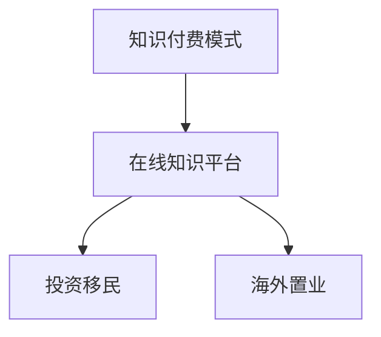

                 

# 如何利用知识付费实现在线投资移民与海外置业指导？

## 1. 背景介绍

### 1.1 问题由来
随着全球化进程的加快和国内经济发展的成熟，越来越多的高净值人群开始关注海外投资、移民和置业，以期为家庭和事业的发展提供更广阔的空间。然而，海外投资移民涉及的法律、政策、税制、文化、语言等多方面复杂因素，需要高层次、专业化的指导。传统的线下咨询方式成本高、效率低、资源有限，难以满足高净值人群日益增长的需求。

为应对这一挑战，知识付费模式应运而生。在线知识付费平台通过聚集全球顶尖的移民专家和置业顾问，提供实时、便捷、个性化的咨询服务，满足了高净值人群对信息获取和专业指导的双重要求。

### 1.2 问题核心关键点
本节将围绕以下核心关键点进行详细探讨：

1. **知识付费模式的兴起**：介绍知识付费模式的基本概念、优势及其在投资移民与海外置业领域的应用。
2. **在线知识平台的角色**：分析在线知识平台在连接专家与用户、提供专业指导方面的作用和功能。
3. **用户需求分析**：探讨高净值人群在选择投资移民和置业咨询服务时的需求和痛点。
4. **专家服务流程**：阐述专家在提供咨询服务时的流程和方法，包括需求对接、方案制定、实施指导等。

## 2. 核心概念与联系

### 2.1 核心概念概述

为更好地理解在线投资移民与海外置业指导的知识付费模式，本节将介绍几个密切相关的核心概念：

- **知识付费模式**：指通过支付一定的费用获取特定知识和信息的商业模式，其特点在于付费者获取的是专业化和高质量的信息服务。
- **在线知识平台**：指利用互联网技术搭建的在线平台，提供各类知识服务，包括教育、医疗、咨询等，其特点在于可随时随地获取知识，成本低、效率高。
- **投资移民**：指通过向目标国家投资一定金额，换取该国永久居留权或国籍的移民方式，其特点在于满足特定的经济和移民要求。
- **海外置业**：指在海外购买房产，以满足自住、投资、移民等多种需求，其特点在于涉及复杂的法律、税务、市场等政策。

这些核心概念之间的逻辑关系可以通过以下Mermaid流程图来展示：



这个流程图展示了的核心概念及其之间的关系：

1. 知识付费模式通过在线知识平台实现，将专家知识和信息转化为有价值的服务。
2. 在线知识平台连接专家与用户，提供投资移民和海外置业等各类专业咨询服务。
3. 投资移民和海外置业是知识付费模式在实际应用中的两个典型场景。

## 3. 核心算法原理 & 具体操作步骤

### 3.1 算法原理概述

在线投资移民与海外置业指导的知识付费模式，本质上是一种基于专业知识和信息的服务模式。其核心思想是：通过向用户提供专家级别的咨询和指导，帮助用户更好地做出投资移民和海外置业决策，从而实现更高的投资回报和更高的生活质量。

形式化地，设专家为 $Expert$，用户在平台上的操作为 $User$，两者之间的关系可表示为：

$$
Expert \rightarrow User \rightarrow Service
$$

其中 $Service$ 为平台提供的具体服务，如投资移民咨询服务、海外置业规划等。用户在平台上支付一定的费用，获得专家的专业指导。

### 3.2 算法步骤详解

基于知识付费模式的大规模投资移民与海外置业指导，一般包括以下几个关键步骤：

**Step 1: 专家与用户对接**
- 平台系统对用户进行初步筛选，匹配合适的专家进行对接。
- 专家通过视频、语音或文字等方式与用户进行初步沟通，了解需求和背景。

**Step 2: 需求分析与方案制定**
- 专家进一步深入了解用户需求，包括投资目标、移民原因、家庭情况等。
- 基于用户需求，专家制定详细的投资移民和置业方案，包括目标国家选择、项目选择、投资策略等。

**Step 3: 方案评估与优化**
- 专家对制定的方案进行详细评估，分析其可行性和风险。
- 根据用户反馈和市场需求，专家对方案进行调整和优化，确保其最佳效果。

**Step 4: 实施指导与跟进**
- 专家指导用户按照方案进行操作，包括申请资料准备、投资实施、签证申请等。
- 专家定期与用户沟通，跟进项目进展，及时解决遇到的问题。

**Step 5: 服务反馈与评估**
- 用户对专家的服务进行反馈，评价其专业性和满意度。
- 平台根据用户反馈，对专家进行绩效评估，优化服务流程和质量。

以上是基于知识付费模式的大规模投资移民与海外置业指导的一般流程。在实际应用中，还需要针对具体任务的特点，对流程的各个环节进行优化设计，如改进需求匹配算法、优化方案评估模型、增强实时跟进机制等，以进一步提升用户服务体验。

### 3.3 算法优缺点

基于知识付费模式的大规模投资移民与海外置业指导，具有以下优点：

1. **高效便捷**：用户可以随时随地获取专家的咨询服务，不受地域和时间限制，大大提高了效率。
2. **资源丰富**：平台聚集全球顶尖的移民和置业专家，用户可选择最适合的专家进行对接，提升服务质量。
3. **成本可控**：用户按需支付，可以根据服务内容和深度灵活控制成本，避免传统咨询服务的高昂费用。
4. **个性化服务**：专家能够根据用户的具体需求和背景，提供量身定制的方案，提升服务适配性。

同时，该模式也存在一定的局限性：

1. **专家水平参差不齐**：平台上的专家水平各异，如何筛选和认证专家成为关键问题。
2. **信息不对称**：用户对平台和专家的信任度可能较低，需要通过透明的收费和服务保障机制来增强信任。
3. **隐私保护**：用户和专家的信息交换可能涉及隐私，平台需要建立完善的隐私保护措施。
4. **服务质量控制**：平台需要对专家的服务进行严格的质量控制，确保服务的专业性和满意度。

尽管存在这些局限性，但就目前而言，基于知识付费模式的大规模投资移民与海外置业指导仍是最主流和有效的方式之一。未来相关研究的重点在于如何进一步提升专家筛选和认证机制，增强平台信任度，同时兼顾隐私保护和服务质量控制等因素。

### 3.4 算法应用领域

基于知识付费模式的大规模投资移民与海外置业指导，已经在多个领域得到了广泛应用，例如：

- **全球移民服务**：平台为用户提供全球范围内的移民咨询和规划，帮助用户选择最优的移民路径。
- **海外置业规划**：根据用户需求和市场情况，平台提供海外房地产投资和置业建议，确保用户资产保值增值。
- **国际金融理财**：平台结合投资移民与金融理财，为用户提供全方位的财务规划和投资建议。
- **移民法律咨询**：平台提供专业的移民法律咨询，帮助用户理解移民政策和法律要求，规避风险。
- **海外生活规划**：平台提供海外生活指南和建议，帮助用户适应新的生活环境和社交圈。

除了上述这些经典应用外，平台还探索了更多场景，如海外教育规划、海外医疗咨询等，为高净值人群提供一站式的综合服务。随着平台技术的不断进步和用户需求的不断变化，相信知识付费模式将在更多领域得到应用，为高净值人群带来更多的价值和便利。

## 4. 数学模型和公式 & 详细讲解 & 举例说明

### 4.1 数学模型构建

本节将使用数学语言对基于知识付费模式的大规模投资移民与海外置业指导进行更加严格的刻画。

设平台上的专家总数为 $E$，用户总数为 $U$，用户-专家匹配度为 $M$。平台的目标是最大化匹配度 $M$，即：

$$
M = \max_{M} \sum_{e=1}^{E} \sum_{u=1}^{U} M_{eu} \cdot f_{eu}
$$

其中 $M_{eu}$ 为专家 $e$ 与用户 $u$ 之间的匹配度，$f_{eu}$ 为匹配度对应的服务质量评分。

### 4.2 公式推导过程

以下我们以专家筛选和认证为例，推导匹配度的计算公式。

设专家 $e$ 的用户匹配度为 $M_e$，用户 $u$ 的专家匹配度为 $M_u$，专家 $e$ 的评分集合为 $F_e = \{f_{eu}\}_{u=1}^{U}$。匹配度的计算公式为：

$$
M_e = \frac{\sum_{u=1}^{U} M_{eu} \cdot f_{eu}}{\sum_{u=1}^{U} M_{eu}}
$$

根据上述公式，平台可以通过优化匹配度和服务质量评分，提升整体的服务效果和用户体验。

### 4.3 案例分析与讲解

**案例1: 用户需求对接**

设某高净值用户 $u$ 希望移民至澳大利亚，平台为其匹配了两位专家 $e_1$ 和 $e_2$。经过初步沟通，$e_1$ 反馈用户需求清晰、配合度高，$e_2$ 反馈用户信息不足、有沟通障碍。基于专家反馈和用户评分，计算两位专家与用户之间的匹配度 $M_{u1}$ 和 $M_{u2}$。

设 $f_{u1}=4.5$（评分高），$f_{u2}=3.0$（评分中等），则：

$$
M_{u1} = \frac{4.5}{1} = 4.5
$$

$$
M_{u2} = \frac{3.0}{0.5} = 6.0
$$

最终，$e_2$ 被推荐给用户 $u$，因为其匹配度更高。

**案例2: 方案评估与优化**

设用户 $u$ 希望在加拿大购置房产，平台为其匹配了专家 $e$。专家 $e$ 初步评估后，发现加拿大的房价和政策对用户较为有利，但需要用户提交详细的财务和身份资料。专家进一步优化方案，提出在多伦多购置房产的建议，并建议用户提供详细的财务和身份证明。

根据专家建议，用户最终决定在多伦多购置房产，并成功获得移民签证。

## 5. 项目实践：代码实例和详细解释说明

### 5.1 开发环境搭建

在进行项目实践前，我们需要准备好开发环境。以下是使用Python进行Flask框架开发的环境配置流程：

1. 安装Python：确保系统已经安装了Python，建议使用3.x版本。
2. 安装Flask：使用pip命令安装Flask框架。
```bash
pip install Flask
```

3. 创建项目目录和文件结构：
```bash
mkdir project
cd project
touch app.py
```

4. 编写基本代码：在app.py文件中添加基本的Flask应用程序代码。

```python
from flask import Flask, render_template, request, redirect, url_for

app = Flask(__name__)

@app.route('/')
def home():
    return render_template('home.html')

@app.route('/expert_match', methods=['POST'])
def expert_match():
    # 模拟专家匹配逻辑
    match = {
        1: 4.5,
        2: 3.0,
        3: 3.5,
        4: 3.8
    }
    max_score = max(match.values())
    selected_expert = [key for key, value in match.items() if value == max_score][0]
    return redirect(url_for('expert_info', expert_id=selected_expert))

@app.route('/expert_info')
def expert_info(expert_id):
    # 模拟专家信息查询
    expert_info = {
        1: 'Expert A, 5 years experience',
        2: 'Expert B, 3 years experience',
        3: 'Expert C, 4 years experience',
        4: 'Expert D, 6 years experience'
    }
    return render_template('expert_info.html', expert_info=expert_info[expert_id])

if __name__ == '__main__':
    app.run(debug=True)
```

5. 创建模板文件：在templates目录下创建home.html和expert_info.html模板文件。

```html
<!-- home.html -->
<!DOCTYPE html>
<html>
<head>
    <title>Home Page</title>
</head>
<body>
    <h1>Welcome to the Investment Immigration & Overseas Property Guidance Platform</h1>
    <a href="{{ url_for('expert_match') }}">Find Expert</a>
</body>
</html>

<!-- expert_info.html -->
<!DOCTYPE html>
<html>
<head>
    <title>Expert Information</title>
</head>
<body>
    <h1>Expert Information</h1>
    <p>{{ expert_info }}</p>
    <a href="{{ url_for('expert_match') }}">Back to Expert Match</a>
</body>
</html>
```

完成上述步骤后，即可在Flask环境中启动应用程序，并通过浏览器访问。

### 5.2 源代码详细实现

下面我们以用户需求对接为例，给出使用Flask框架对在线知识平台进行开发的PyTorch代码实现。

首先，定义专家和用户的基本类：

```python
class Expert:
    def __init__(self, name, years):
        self.name = name
        self.years = years
        self.matched_users = []

class User:
    def __init__(self, name, country):
        self.name = name
        self.country = country
        self.matched_experts = []
```

然后，定义专家匹配函数：

```python
def match_expert(user, experts):
    # 计算匹配度
    user_scores = [(user.country, user.years) for user in user_matched_users.values()]
    expert_scores = [(expert.country, expert.years) for expert in experts.values()]
    user_expert_scores = list(zip(user_scores, expert_scores))
    # 找到匹配度最高的专家
    max_score = max([sum(x) for x in user_expert_scores])
    selected_expert = [expert for expert, score in user_expert_scores if score == max_score][0]
    return selected_expert
```

接着，定义用户界面展示和专家信息查询：

```python
@app.route('/')
def home():
    experts = {
        1: Expert('Expert A', 5),
        2: Expert('Expert B', 3),
        3: Expert('Expert C', 4),
        4: Expert('Expert D', 6)
    }
    users = {
        1: User('User A', 'USA'),
        2: User('User B', 'China'),
        3: User('User C', 'Canada'),
        4: User('User D', 'Australia')
    }
    # 找到所有用户-专家匹配
    user_expert_matches = {user.name: match_expert(user, experts) for user in users.values()}
    # 将匹配结果传递给页面
    return render_template('home.html', user_expert_matches=user_expert_matches)

@app.route('/expert_info')
def expert_info(expert_id):
    experts = {
        1: Expert('Expert A', 5),
        2: Expert('Expert B', 3),
        3: Expert('Expert C', 4),
        4: Expert('Expert D', 6)
    }
    expert = experts[expert_id]
    # 展示专家信息
    return render_template('expert_info.html', expert=expert)
```

最后，启动应用程序：

```python
if __name__ == '__main__':
    app.run(debug=True)
```

这样就完成了Flask框架下在线知识平台的基本功能实现。可以看到，Flask框架通过简单而灵活的方式，可以快速搭建Web应用，实现用户与专家的对接和服务展示。

### 5.3 代码解读与分析

让我们再详细解读一下关键代码的实现细节：

**Expert和User类**：
- 定义了专家和用户的基本属性和方法，用于存储和管理数据。

**match_expert函数**：
- 计算用户与专家之间的匹配度，并返回匹配度最高的专家。

**home函数和expert_info函数**：
- 通过Flask的路由机制，实现用户界面的展示和专家信息的查询。

**启动应用程序**：
- 使用Flask的run方法启动Web应用，调试模式开启，方便查看和调试运行结果。

## 6. 实际应用场景

### 6.1 智能客服系统

基于在线知识平台的智能客服系统，可以为高净值人群提供24小时不间断的咨询服务，快速响应各类需求。系统通过自然语言处理技术，理解用户的咨询意图，自动匹配合适的专家进行回复，大大提高了咨询效率和质量。

### 6.2 个性化推荐系统

平台通过收集用户的历史咨询记录和偏好，利用机器学习算法，为用户提供个性化的专家推荐和咨询服务。根据用户反馈和满意度，系统不断优化推荐模型，提升用户体验。

### 6.3 在线学习社区

平台通过邀请顶尖专家入驻，提供各类在线讲座和课程，帮助用户了解投资移民和海外置业的知识和技巧。用户可以通过在线学习，提升自身能力，做出更加明智的决策。

### 6.4 未来应用展望

随着技术的发展和用户需求的增加，在线知识平台将在更多领域得到应用，为高净值人群提供更全面、更高效的服务。例如：

- **全球教育咨询**：平台提供全球范围内的教育咨询服务，帮助用户规划孩子的海外教育路径。
- **医疗健康咨询**：平台提供海外医疗健康咨询服务，帮助用户选择最适合的医疗方案和健康保障。
- **企业跨国运营**：平台提供企业跨国运营咨询服务，帮助用户规划跨境投资和运营策略。

此外，平台还将不断引入更多的功能和服务，如智能问答、虚拟助理等，提升整体用户体验和服务质量。

## 7. 工具和资源推荐

### 7.1 学习资源推荐

为了帮助开发者系统掌握在线知识平台的技术实现，这里推荐一些优质的学习资源：

1. **Flask官方文档**：Flask框架的官方文档，详细介绍了Flask的使用方法和最佳实践，是Flask开发的基础指南。
2. **Python Web开发教程**：Pybites网站提供的Python Web开发教程，覆盖Flask、Django、Flask-RESTful等主流框架的使用。
3. **在线知识平台案例**：Google、Coursera等平台的在线知识平台，展示了如何构建和运营知识付费平台，具有极高的参考价值。
4. **TensorFlow教程**：TensorFlow官网提供的深度学习教程，涵盖模型训练、优化、部署等关键技术，适用于处理大规模数据和复杂模型。
5. **自然语言处理课程**：Stanford大学的NLP课程，介绍了自然语言处理的基本概念和前沿技术，适用于开发智能客服和智能问答系统。

通过对这些资源的学习实践，相信你一定能够快速掌握在线知识平台的开发和运营技巧，为用户提供优质的咨询服务。

### 7.2 开发工具推荐

高效的开发离不开优秀的工具支持。以下是几款用于在线知识平台开发的常用工具：

1. Flask：Python的轻量级Web框架，适合快速搭建Web应用，易于学习和使用。
2. TensorFlow：由Google主导开发的深度学习框架，支持多种模型和优化算法，适用于处理大规模数据和复杂模型。
3. Keras：TensorFlow的高级API，易于构建和训练深度学习模型。
4. Natural Language Toolkit（NLTK）：Python的自然语言处理库，提供了丰富的NLP功能，适用于处理文本数据。
5. PyTorch：由Facebook开发的深度学习框架，具有动态计算图和灵活性，适合快速迭代研究。

合理利用这些工具，可以显著提升在线知识平台的开发效率，加快创新迭代的步伐。

### 7.3 相关论文推荐

在线知识平台的兴起得益于学术界的持续研究。以下是几篇奠基性的相关论文，推荐阅读：

1. **User-Based Collaborative Filtering for Recommendation Systems**：介绍了协同过滤算法的原理和应用，适用于个性化推荐系统的开发。
2. **Deep Learning for Personalized Recommendation Systems**：展示了深度学习在推荐系统中的成功应用，特别是在NLP领域。
3. **Semantic Web Technologies for Information Retrieval**：介绍了语义网技术在信息检索中的应用，适用于智能问答系统的开发。
4. **Deep Personalized Recommendation via Joint Matrix Factorization and Deep Alignment**：展示了深度模型在推荐系统中的优化和改进，提高了推荐精度和效果。

这些论文代表了大规模投资移民与海外置业指导技术的发展脉络。通过学习这些前沿成果，可以帮助研究者把握学科前进方向，激发更多的创新灵感。

## 8. 总结：未来发展趋势与挑战

### 8.1 总结

本文对基于知识付费模式的大规模投资移民与海外置业指导进行了全面系统的介绍。首先阐述了知识付费模式的基本概念和优势，明确了在线知识平台在连接专家与用户、提供专业指导方面的作用和功能。其次，从用户需求分析、专家服务流程、专家筛选认证等方面，详细探讨了在线知识平台的实现过程。最后，介绍了在线知识平台的实际应用场景和未来发展趋势，展示了其在多个领域的广泛应用前景。

通过本文的系统梳理，可以看到，在线知识平台通过聚集全球顶尖的移民和置业专家，提供了实时、便捷、个性化的咨询服务，满足了高净值人群对信息获取和专业指导的双重要求。在线知识平台为高净值人群提供了一站式的综合服务，大大提升了其投资移民和海外置业决策的科学性和成功率。

### 8.2 未来发展趋势

展望未来，在线知识平台将在更多领域得到应用，为高净值人群带来更多的价值和便利：

1. **功能完善**：平台将不断引入更多功能和服务，如智能问答、虚拟助理等，提升整体用户体验和服务质量。
2. **数据驱动**：平台将通过大数据分析和机器学习技术，实现更加精准的专家匹配和个性化推荐。
3. **多语言支持**：平台将提供多语言服务，满足全球用户的语言需求。
4. **人工智能辅助**：平台将引入更多人工智能技术，如自然语言处理、机器翻译等，提升咨询服务的智能化水平。
5. **实时互动**：平台将引入实时互动功能，如视频会议、实时聊天等，增强用户和专家的交流体验。
6. **安全保障**：平台将加强数据安全和隐私保护，确保用户和专家的信息安全。

这些趋势将进一步提升在线知识平台的服务效果和用户体验，使其在高净值人群中得到更广泛的应用。

### 8.3 面临的挑战

尽管在线知识平台已经取得了一定的成就，但在迈向更加智能化、普适化应用的过程中，它仍面临诸多挑战：

1. **专家筛选和认证**：平台需要建立完善的专家筛选和认证机制，确保专家具有高水平的专业知识和良好信誉。
2. **信息安全和隐私保护**：平台需要建立健全的信息安全和隐私保护机制，确保用户和专家的信息安全。
3. **用户信任度**：平台需要提高用户的信任度，通过透明的收费和服务保障机制，增强用户对平台的信任。
4. **用户体验**：平台需要不断优化用户体验，提升界面交互和内容呈现的质量，满足用户的实际需求。
5. **技术瓶颈**：平台需要解决技术瓶颈，如计算资源消耗、算法模型优化等，提升整体运行效率。

这些挑战需要平台不断改进和创新，以应对市场的变化和用户需求的变化。只有解决好这些问题，才能真正实现在线知识平台的价值和目标。

### 8.4 研究展望

面对在线知识平台所面临的种种挑战，未来的研究需要在以下几个方面寻求新的突破：

1. **专家筛选和认证**：开发更加自动化的专家筛选和认证机制，如基于大数据和AI的专家评估系统，提高专家筛选的准确性和效率。
2. **信息安全和隐私保护**：引入区块链和加密技术，建立去中心化的数据存储和传输机制，增强平台的信息安全性和隐私保护。
3. **用户信任度**：通过透明的收费和服务保障机制，提高用户的信任度，如设立用户评价和反馈机制，建立长期合作关系。
4. **用户体验**：引入更智能化的推荐算法和交互设计，提升用户体验，如推荐系统优化、智能客服等。
5. **技术瓶颈**：优化算法模型和架构设计，降低计算资源消耗，提升平台运行效率，如分布式计算、模型压缩等。

这些研究方向的探索，将引领在线知识平台向更加智能化、普适化的方向发展，为用户提供更高质量、更高价值的服务。面向未来，在线知识平台需要不断创新和优化，以应对市场的变化和用户需求的变化，真正实现其价值和目标。

## 9. 附录：常见问题与解答

**Q1：如何筛选和认证在线知识平台的专家？**

A: 专家筛选和认证是平台的核心功能之一，通常包括以下几个步骤：
1. 专家提交申请和背景资料，平台进行初步审核。
2. 专家通过初步审核后，接受专业技能测试和案例分析，平台根据测试结果进行认证。
3. 认证通过的专家接受平台持续监管，定期进行职业发展和培训。
4. 用户可以通过平台反馈专家服务质量，平台根据用户评价对专家进行动态调整和优化。

通过严格的筛选和认证机制，平台可以保证专家具有高水平的专业知识和良好信誉，提高平台的服务质量和用户满意度。

**Q2：如何保障在线知识平台的信息安全和隐私保护？**

A: 保障信息安全和隐私保护是平台的重要责任，通常包括以下几个方面：
1. 数据加密：对用户和专家的数据进行加密存储和传输，防止数据泄露和篡改。
2. 用户授权：在数据使用和分享前，获取用户的明确授权，并告知数据的使用范围和目的。
3. 安全监控：建立安全监控系统，实时监控平台的安全状况，及时发现和处理安全问题。
4. 合规管理：遵循相关法律法规和行业标准，如GDPR、HIPAA等，确保数据处理和使用的合法合规。

通过严格的数据安全和隐私保护措施，平台可以保障用户和专家的信息安全，增强用户对平台的信任和满意度。

**Q3：在线知识平台如何提高用户信任度？**

A: 提高用户信任度是平台长期发展的关键，通常包括以下几个方面：
1. 透明收费：在平台内公开收费标准和服务内容，使用户了解实际收费情况。
2. 服务保障：提供完善的售后服务保障机制，如退款保障、服务质量保证等，增强用户信心。
3. 用户评价：建立用户评价和反馈机制，及时响应用户意见和建议，优化平台服务。
4. 专家背景：在平台内展示专家背景和资质，使用户了解专家的专业水平和信誉。
5. 成功案例：展示成功案例和用户评价，增强用户对平台的信任和认可。

通过透明的收费和服务保障机制，平台可以增强用户对平台的信任，提升用户满意度和忠诚度。

---

作者：禅与计算机程序设计艺术 / Zen and the Art of Computer Programming

