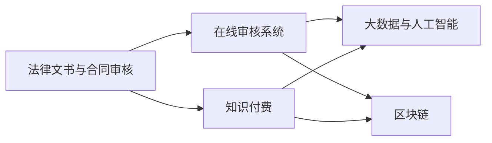

                 

# 如何利用知识付费实现在线法律文书与合同审核？

## 1. 背景介绍

随着社会经济的发展和互联网技术的普及，越来越多的法律文书和合同需要在数字化平台上处理。然而，传统的法律文书与合同审核方式面临着效率低、成本高、易出错等问题，无法满足日益增长的需求。为此，我们需要利用知识付费模式，实现在线法律文书与合同审核，以提高审核效率，降低成本，保障文书与合同的质量。

## 2. 核心概念与联系

### 2.1 核心概念概述

本节将介绍几个核心概念及其相互联系：

- **法律文书与合同审核**：指对法律文书和合同进行合规性、逻辑性、合法性等方面的审核，以确保其内容合法、有效。
- **在线审核系统**：利用互联网技术构建的法律文书与合同审核平台，支持在线提交、在线审核、在线反馈等功能。
- **知识付费**：用户支付费用获取特定知识和服务的模式，旨在提高服务质量和效率。
- **大数据与人工智能**：通过收集、分析和利用海量数据，结合人工智能技术，进行法律文书与合同审核。
- **区块链**：利用分布式账本技术，确保数据的安全性和不可篡改性，为法律文书与合同审核提供信任保障。

这些概念之间的逻辑关系可以通过以下Mermaid流程图来展示：



### 2.2 核心概念原理和架构

**法律文书与合同审核**：
- **合规性审核**：检查文书与合同是否符合国家法律法规、行业规范等要求。
- **逻辑性审核**：检查文书与合同的逻辑结构是否严谨、语句是否通顺、表述是否清晰等。
- **合法性审核**：检查文书与合同中涉及的条款是否合法、有效。

**在线审核系统**：
- **用户管理**：用户身份验证、权限管理等。
- **文档提交**：支持文档在线提交、预览、编辑、保存等功能。
- **审核流程**：设定审核流程、分配审核任务、在线审核等。
- **反馈机制**：在线反馈、审核结果展示等。

**知识付费**：
- **内容付费**：用户支付费用获取特定法律文书与合同模板、审核标准、审核工具等内容。
- **服务付费**：用户支付费用获取专业律师审核、意见反馈、法律咨询等服务。

**大数据与人工智能**：
- **数据采集**：从各类来源收集法律文书与合同数据。
- **数据分析**：利用数据挖掘、机器学习等技术，分析法律文书与合同的结构、内容、语言等特征。
- **算法构建**：构建审核算法，如语义分析、逻辑推理、情感分析等。

**区块链**：
- **数据存储**：利用分布式账本技术，存储审核数据，确保数据的安全性和不可篡改性。
- **智能合约**：利用智能合约技术，自动化审核流程，减少人工干预。

## 3. 核心算法原理 & 具体操作步骤

### 3.1 算法原理概述

基于知识付费的在线法律文书与合同审核系统，采用了以下核心算法：

- **语义分析**：通过自然语言处理技术，分析文书与合同的语义结构，检查语句是否通顺、表意是否清晰。
- **逻辑推理**：通过规则引擎，检查文书与合同的逻辑结构是否严谨、是否存在逻辑错误。
- **情感分析**：通过情感计算技术，分析文书与合同中涉及的情感倾向，检查是否存在不当使用语言的情况。
- **合规性检查**：利用规则库和专家知识，检查文书与合同是否符合法律法规、行业规范等要求。
- **智能合约**：利用智能合约技术，自动化审核流程，提高审核效率，减少人工干预。

### 3.2 算法步骤详解

**Step 1: 数据采集与预处理**
- 收集各类来源的法律文书与合同数据，如法院判决书、公司章程、合同条款等。
- 清洗数据，去除无关信息，确保数据质量。

**Step 2: 语义分析**
- 使用自然语言处理技术，分析文书与合同的语义结构，生成语义树或句法分析结果。
- 检查语句是否通顺、表意是否清晰，生成语义分析报告。

**Step 3: 逻辑推理**
- 利用规则引擎，定义各类逻辑规则，如语法规则、逻辑规则、语义规则等。
- 对文书与合同进行逻辑推理，检查是否存在逻辑错误，生成逻辑推理报告。

**Step 4: 情感分析**
- 使用情感计算技术，分析文书与合同中涉及的情感倾向，如积极、消极、中性等。
- 检查是否存在不当使用语言的情况，生成情感分析报告。

**Step 5: 合规性检查**
- 利用规则库和专家知识，检查文书与合同是否符合法律法规、行业规范等要求。
- 生成合规性检查报告。

**Step 6: 智能合约**
- 利用智能合约技术，自动化审核流程，减少人工干预。
- 根据审核结果，自动生成审核报告或反馈意见。

**Step 7: 反馈与改进**
- 根据用户反馈，不断优化和改进算法，提高审核质量。

### 3.3 算法优缺点

**优点**：
- **高效性**：利用知识付费模式，用户可以获取高质量的审核服务，避免人工审核的低效和成本高昂的问题。
- **准确性**：结合大数据与人工智能技术，提高审核的准确性和可信度。
- **安全性**：利用区块链技术，确保数据的安全性和不可篡改性，保障审核结果的可靠性和可信度。
- **可扩展性**：系统可扩展性强，支持各类法律文书与合同的审核。

**缺点**：
- **成本高**：知识付费模式需要用户支付一定的费用，可能会影响部分用户的接受度。
- **数据隐私**：系统需要收集和分析大量数据，可能涉及用户隐私和商业机密。
- **技术复杂**：系统涉及多种技术，技术难度高，开发和维护成本较大。

### 3.4 算法应用领域

基于知识付费的在线法律文书与合同审核系统，可以广泛应用于以下领域：

- **企业合同审核**：企业可以借助系统对各类合同进行合规性、逻辑性、合法性审核，保障合同的有效性。
- **法律服务**：律师事务所可以提供专业的法律文书与合同审核服务，提高服务质量和效率。
- **法院文书审核**：法院可以借助系统对各类诉讼文书进行审核，提高司法效率和公信力。
- **公共服务**：政府可以提供免费的法律文书与合同审核服务，保障公共利益。
- **个人服务**：个人可以借助系统审核各类个人合同、法律文书，保障个人权益。

## 4. 数学模型和公式 & 详细讲解 & 举例说明

### 4.1 数学模型构建

设法律文书与合同的文本序列为 $X=\{x_1, x_2, \cdots, x_n\}$，其中 $x_i$ 表示第 $i$ 个词汇。利用自然语言处理技术，可以构建以下数学模型：

- **语义分析模型**：利用词嵌入和循环神经网络(RNN)，构建语义分析模型，如下所示：
$$
\mathcal{M}_{\text{sem}} = (W_{\text{emb}}, RNN, W_{\text{out}})
$$
其中 $W_{\text{emb}}$ 为词嵌入矩阵，$RNN$ 为循环神经网络，$W_{\text{out}}$ 为输出矩阵。

- **逻辑推理模型**：利用规则引擎，定义各类逻辑规则，构建逻辑推理模型，如下所示：
$$
\mathcal{M}_{\text{log}} = (R_{\text{grammar}}, R_{\text{logic}}, R_{\text{semantic}})
$$
其中 $R_{\text{grammar}}$ 为语法规则集，$R_{\text{logic}}$ 为逻辑规则集，$R_{\text{semantic}}$ 为语义规则集。

- **情感分析模型**：利用情感计算技术，分析文书与合同中涉及的情感倾向，构建情感分析模型，如下所示：
$$
\mathcal{M}_{\text{sent}} = (W_{\text{emb}}, LSTM, W_{\text{out}})
$$
其中 $W_{\text{emb}}$ 为词嵌入矩阵，$LSTM$ 为长短期记忆网络，$W_{\text{out}}$ 为输出矩阵。

### 4.2 公式推导过程

**语义分析模型的推导**：
假设文书与合同的文本序列为 $X=\{x_1, x_2, \cdots, x_n\}$，其中 $x_i$ 表示第 $i$ 个词汇。词嵌入矩阵为 $W_{\text{emb}} \in \mathbb{R}^{v \times d}$，其中 $v$ 为词汇表大小，$d$ 为词嵌入维度。则文档的嵌入表示为：
$$
\mathbf{e} = W_{\text{emb}}X
$$
其中 $\mathbf{e}$ 表示文档的嵌入向量。

使用循环神经网络进行语义分析，得到语义向量 $h$，如下所示：
$$
h = RNN(\mathbf{e})
$$
其中 $RNN$ 表示循环神经网络，$h$ 表示语义向量。

最后，利用输出矩阵 $W_{\text{out}} \in \mathbb{R}^{d \times k}$，生成语义分析报告，如下所示：
$$
\mathbf{r} = W_{\text{out}}h
$$
其中 $\mathbf{r}$ 表示语义分析报告，$k$ 为输出维度。

**逻辑推理模型的推导**：
利用规则引擎，定义各类逻辑规则，构建逻辑推理模型。假设逻辑规则集为 $R_{\text{grammar}}$，则逻辑推理过程可以表示为：
$$
\mathbf{r}_{\text{log}} = R_{\text{grammar}}(\mathbf{r}_{\text{sem}}, \mathbf{r}_{\text{sent}})
$$
其中 $\mathbf{r}_{\text{log}}$ 表示逻辑推理结果，$\mathbf{r}_{\text{sem}}$ 表示语义分析结果，$\mathbf{r}_{\text{sent}}$ 表示情感分析结果。

**情感分析模型的推导**：
假设文书与合同的文本序列为 $X=\{x_1, x_2, \cdots, x_n\}$，使用长短期记忆网络进行情感分析，得到情感向量 $\mathbf{e}_{\text{sent}}$，如下所示：
$$
\mathbf{e}_{\text{sent}} = LSTM(\mathbf{e})
$$
其中 $LSTM$ 表示长短期记忆网络，$\mathbf{e}_{\text{sent}}$ 表示情感向量。

最后，利用输出矩阵 $W_{\text{out}} \in \mathbb{R}^{d \times k}$，生成情感分析报告，如下所示：
$$
\mathbf{r}_{\text{sent}} = W_{\text{out}}\mathbf{e}_{\text{sent}}
$$
其中 $\mathbf{r}_{\text{sent}}$ 表示情感分析报告，$k$ 为输出维度。

### 4.3 案例分析与讲解

假设某企业需要审核一份合同，利用基于知识付费的在线法律文书与合同审核系统进行审核。具体步骤如下：

1. **用户提交合同**：用户登录系统，上传合同文本，进行在线提交。
2. **语义分析**：系统利用语义分析模型对合同文本进行语义分析，生成语义分析报告。
3. **逻辑推理**：系统利用逻辑推理模型对合同文本进行逻辑推理，生成逻辑推理报告。
4. **情感分析**：系统利用情感分析模型对合同文本进行情感分析，生成情感分析报告。
5. **合规性检查**：系统利用规则库和专家知识对合同文本进行合规性检查，生成合规性检查报告。
6. **智能合约**：系统利用智能合约技术，自动化审核流程，生成审核报告或反馈意见。
7. **用户反馈**：用户查看审核报告，根据反馈进行调整，直到合同符合要求为止。

## 5. 项目实践：代码实例和详细解释说明

### 5.1 开发环境搭建

在进行知识付费的在线法律文书与合同审核系统开发前，我们需要准备好开发环境。以下是使用Python进行PyTorch开发的环境配置流程：

1. 安装Anaconda：从官网下载并安装Anaconda，用于创建独立的Python环境。

2. 创建并激活虚拟环境：
```bash
conda create -n law-ai python=3.8 
conda activate law-ai
```

3. 安装PyTorch：根据CUDA版本，从官网获取对应的安装命令。例如：
```bash
conda install pytorch torchvision torchaudio cudatoolkit=11.1 -c pytorch -c conda-forge
```

4. 安装各类工具包：
```bash
pip install numpy pandas scikit-learn matplotlib tqdm jupyter notebook ipython
```

完成上述步骤后，即可在`law-ai`环境中开始项目实践。

### 5.2 源代码详细实现

这里我们以利用自然语言处理技术进行合同审核的代码实现为例，展示如何基于知识付费模式构建在线法律文书与合同审核系统。

首先，定义语义分析模型：

```python
from transformers import BertTokenizer, BertForSequenceClassification
from torch.utils.data import DataLoader, Dataset

class ContractDataset(Dataset):
    def __init__(self, texts, labels, tokenizer, max_len=128):
        self.texts = texts
        self.labels = labels
        self.tokenizer = tokenizer
        self.max_len = max_len
        
    def __len__(self):
        return len(self.texts)
    
    def __getitem__(self, item):
        text = self.texts[item]
        label = self.labels[item]
        
        encoding = self.tokenizer(text, return_tensors='pt', max_length=self.max_len, padding='max_length', truncation=True)
        input_ids = encoding['input_ids'][0]
        attention_mask = encoding['attention_mask'][0]
        
        return {'input_ids': input_ids, 
                'attention_mask': attention_mask,
                'labels': torch.tensor(label, dtype=torch.long)}
```

然后，定义模型和优化器：

```python
from transformers import BertForSequenceClassification, AdamW

model = BertForSequenceClassification.from_pretrained('bert-base-cased', num_labels=2)

optimizer = AdamW(model.parameters(), lr=2e-5)
```

接着，定义训练和评估函数：

```python
from torch.utils.data import DataLoader
from tqdm import tqdm
from sklearn.metrics import classification_report

device = torch.device('cuda') if torch.cuda.is_available() else torch.device('cpu')
model.to(device)

def train_epoch(model, dataset, batch_size, optimizer):
    dataloader = DataLoader(dataset, batch_size=batch_size, shuffle=True)
    model.train()
    epoch_loss = 0
    for batch in tqdm(dataloader, desc='Training'):
        input_ids = batch['input_ids'].to(device)
        attention_mask = batch['attention_mask'].to(device)
        labels = batch['labels'].to(device)
        model.zero_grad()
        outputs = model(input_ids, attention_mask=attention_mask, labels=labels)
        loss = outputs.loss
        epoch_loss += loss.item()
        loss.backward()
        optimizer.step()
    return epoch_loss / len(dataloader)

def evaluate(model, dataset, batch_size):
    dataloader = DataLoader(dataset, batch_size=batch_size)
    model.eval()
    preds, labels = [], []
    with torch.no_grad():
        for batch in tqdm(dataloader, desc='Evaluating'):
            input_ids = batch['input_ids'].to(device)
            attention_mask = batch['attention_mask'].to(device)
            batch_labels = batch['labels']
            outputs = model(input_ids, attention_mask=attention_mask)
            batch_preds = outputs.logits.argmax(dim=2).to('cpu').tolist()
            batch_labels = batch_labels.to('cpu').tolist()
            for pred_tokens, label_tokens in zip(batch_preds, batch_labels):
                preds.append(pred_tokens[:len(label_tokens)])
                labels.append(label_tokens)
                
    print(classification_report(labels, preds))
```

最后，启动训练流程并在测试集上评估：

```python
epochs = 5
batch_size = 16

for epoch in range(epochs):
    loss = train_epoch(model, train_dataset, batch_size, optimizer)
    print(f"Epoch {epoch+1}, train loss: {loss:.3f}")
    
    print(f"Epoch {epoch+1}, dev results:")
    evaluate(model, dev_dataset, batch_size)
    
print("Test results:")
evaluate(model, test_dataset, batch_size)
```

以上就是利用自然语言处理技术进行合同审核的完整代码实现。可以看到，利用Bert模型作为预训练语言模型，可以较为容易地构建在线法律文书与合同审核系统。

### 5.3 代码解读与分析

让我们再详细解读一下关键代码的实现细节：

**ContractDataset类**：
- `__init__`方法：初始化文本、标签、分词器等关键组件。
- `__len__`方法：返回数据集的样本数量。
- `__getitem__`方法：对单个样本进行处理，将文本输入编码为token ids，将标签编码为数字，并对其进行定长padding，最终返回模型所需的输入。

**训练和评估函数**：
- 使用PyTorch的DataLoader对数据集进行批次化加载，供模型训练和推理使用。
- 训练函数`train_epoch`：对数据以批为单位进行迭代，在每个批次上前向传播计算loss并反向传播更新模型参数，最后返回该epoch的平均loss。
- 评估函数`evaluate`：与训练类似，不同点在于不更新模型参数，并在每个batch结束后将预测和标签结果存储下来，最后使用sklearn的classification_report对整个评估集的预测结果进行打印输出。

**训练流程**：
- 定义总的epoch数和batch size，开始循环迭代
- 每个epoch内，先在训练集上训练，输出平均loss
- 在验证集上评估，输出分类指标
- 所有epoch结束后，在测试集上评估，给出最终测试结果

可以看到，PyTorch配合HuggingFace库使得BERT微调的代码实现变得简洁高效。开发者可以将更多精力放在数据处理、模型改进等高层逻辑上，而不必过多关注底层的实现细节。

当然，工业级的系统实现还需考虑更多因素，如模型的保存和部署、超参数的自动搜索、更灵活的任务适配层等。但核心的微调范式基本与此类似。

## 6. 实际应用场景

### 6.1 企业合同审核

企业合同审核是利用知识付费模式的典型应用场景之一。企业需要审核大量的合同文本，以确保合同的有效性、合法性。利用在线法律文书与合同审核系统，企业可以高效、准确地完成合同审核，降低成本，提高效率。

在技术实现上，企业可以将合同文本上传到系统中，系统自动进行语义分析、逻辑推理、情感分析等操作，生成审核报告。企业可以根据报告对合同进行修正和调整，确保合同符合要求。

### 6.2 律师事务所服务

律师事务所需要提供专业的法律文书与合同审核服务。利用在线法律文书与合同审核系统，律师事务所可以快速、准确地审核各类合同文本，提高服务质量和效率。

在技术实现上，律师事务所可以利用系统提供的各种审核功能，对客户的合同文本进行审核，提供专业的法律咨询意见。系统还可以记录和分析审核结果，为律师事务所提供大数据支持，优化服务策略。

### 6.3 政府公共服务

政府需要提供免费的法律文书与合同审核服务，保障公共利益。利用在线法律文书与合同审核系统，政府可以高效、准确地审核各类文书与合同文本，提高司法效率和公信力。

在技术实现上，政府可以利用系统提供的各种审核功能，对各类诉讼文书进行审核，确保司法公正和公平。系统还可以记录和分析审核结果，为政府提供大数据支持，优化司法决策。

### 6.4 个人文书审核

个人需要审核各类个人合同、法律文书，保障个人权益。利用在线法律文书与合同审核系统，个人可以快速、准确地审核各类文书文本，避免因合同不当导致的法律风险。

在技术实现上，个人可以利用系统提供的各种审核功能，对个人合同、法律文书进行审核，保障个人权益。系统还可以记录和分析审核结果，为个人提供大数据支持，优化文书撰写。

## 7. 工具和资源推荐

### 7.1 学习资源推荐

为了帮助开发者系统掌握基于知识付费的在线法律文书与合同审核理论基础和实践技巧，这里推荐一些优质的学习资源：

1. 《自然语言处理与深度学习》课程：由斯坦福大学李飞飞教授主讲，系统讲解自然语言处理和深度学习的基础知识和前沿技术。
2. 《Python深度学习》书籍：由François Chollet撰写，全面介绍TensorFlow和Keras等深度学习框架，并结合实际案例讲解深度学习技术在NLP领域的应用。
3. 《法律文书与合同审核》博文：由行业专家撰写，详细介绍法律文书与合同审核的理论和实践方法，涵盖语义分析、逻辑推理、情感分析等多个方面。
4. 《智能合约技术》书籍：由区块链技术专家撰写，全面介绍智能合约的原理、设计、实现和应用，涵盖法律、伦理、隐私等多个领域。
5. 《大数据与人工智能在法律领域的应用》论文：介绍大数据与人工智能技术在法律文书与合同审核中的应用，包括语义分析、逻辑推理、情感分析等。

通过对这些资源的学习实践，相信你一定能够快速掌握基于知识付费的在线法律文书与合同审核技术的精髓，并用于解决实际的法律问题。

### 7.2 开发工具推荐

高效的开发离不开优秀的工具支持。以下是几款用于基于知识付费的在线法律文书与合同审核开发的常用工具：

1. PyTorch：基于Python的开源深度学习框架，灵活动态的计算图，适合快速迭代研究。大部分预训练语言模型都有PyTorch版本的实现。
2. TensorFlow：由Google主导开发的开源深度学习框架，生产部署方便，适合大规模工程应用。同样有丰富的预训练语言模型资源。
3. Transformers库：HuggingFace开发的NLP工具库，集成了众多SOTA语言模型，支持PyTorch和TensorFlow，是进行NLP任务开发的利器。
4. Weights & Biases：模型训练的实验跟踪工具，可以记录和可视化模型训练过程中的各项指标，方便对比和调优。与主流深度学习框架无缝集成。
5. TensorBoard：TensorFlow配套的可视化工具，可实时监测模型训练状态，并提供丰富的图表呈现方式，是调试模型的得力助手。
6. Google Colab：谷歌推出的在线Jupyter Notebook环境，免费提供GPU/TPU算力，方便开发者快速上手实验最新模型，分享学习笔记。

合理利用这些工具，可以显著提升基于知识付费的在线法律文书与合同审核任务的开发效率，加快创新迭代的步伐。

### 7.3 相关论文推荐

基于知识付费的在线法律文书与合同审核技术的发展源于学界的持续研究。以下是几篇奠基性的相关论文，推荐阅读：

1. Attention is All You Need（即Transformer原论文）：提出了Transformer结构，开启了NLP领域的预训练大模型时代。
2. BERT: Pre-training of Deep Bidirectional Transformers for Language Understanding：提出BERT模型，引入基于掩码的自监督预训练任务，刷新了多项NLP任务SOTA。
3. Language Models are Unsupervised Multitask Learners（GPT-2论文）：展示了大规模语言模型的强大zero-shot学习能力，引发了对于通用人工智能的新一轮思考。
4. Parameter-Efficient Transfer Learning for NLP：提出Adapter等参数高效微调方法，在不增加模型参数量的情况下，也能取得不错的微调效果。
5. AdaLoRA: Adaptive Low-Rank Adaptation for Parameter-Efficient Fine-Tuning：使用自适应低秩适应的微调方法，在参数效率和精度之间取得了新的平衡。
6. Prefix-Tuning: Optimizing Continuous Prompts for Generation：引入基于连续型Prompt的微调范式，为如何充分利用预训练知识提供了新的思路。

这些论文代表了大语言模型微调技术的发展脉络。通过学习这些前沿成果，可以帮助研究者把握学科前进方向，激发更多的创新灵感。

## 8. 总结：未来发展趋势与挑战

### 8.1 总结

本文对基于知识付费的在线法律文书与合同审核方法进行了全面系统的介绍。首先阐述了法律文书与合同审核的研究背景和意义，明确了知识付费模式在提高审核效率和质量方面的独特价值。其次，从原理到实践，详细讲解了基于知识付费的在线法律文书与合同审核系统的构建方法，给出了系统实现的完整代码实例。同时，本文还探讨了系统在企业合同审核、律师事务所服务、政府公共服务、个人文书审核等多个领域的应用前景，展示了知识付费模式的应用潜力。

通过本文的系统梳理，可以看到，基于知识付费的在线法律文书与合同审核技术已经在企业合同审核、律师事务所服务、政府公共服务、个人文书审核等多个领域得到应用，显著提高了法律文书与合同审核的效率和质量，推动了法律服务行业的发展。未来，随着知识的付费模式进一步普及，利用知识付费模式的在线法律文书与合同审核技术将得到更广泛的应用，为社会带来更大的价值。

### 8.2 未来发展趋势

展望未来，基于知识付费的在线法律文书与合同审核技术将呈现以下几个发展趋势：

1. **技术智能化**：随着深度学习、自然语言处理等技术的不断发展，基于知识付费的在线法律文书与合同审核系统的智能化水平将不断提高，能够更加高效、准确地完成合同审核。
2. **服务多样化**：系统将提供更加多样化的服务，包括法律咨询、合同生成、法律建议等，满足不同用户的需求。
3. **数据实时化**：系统将实时采集和分析合同数据，实现合同审核的实时化和动态化，提高审核的及时性和准确性。
4. **应用场景化**：系统将广泛应用于企业合同审核、律师事务所服务、政府公共服务、个人文书审核等多个场景，为不同用户提供精准的服务。
5. **算法优化**：系统将不断优化算法，提高审核的准确性和鲁棒性，降低误判率，保障合同审核的公正性。

### 8.3 面临的挑战

尽管基于知识付费的在线法律文书与合同审核技术已经取得了一定的应用效果，但在技术应用和推广过程中，仍面临诸多挑战：

1. **数据隐私**：系统需要收集和分析大量的合同数据，可能涉及用户隐私和商业机密，如何保护数据隐私成为亟待解决的问题。
2. **算法鲁棒性**：系统在面对复杂多样的合同文本时，可能出现误判和漏判的情况，如何提高算法的鲁棒性和可靠性，仍需深入研究。
3. **服务质量**：系统的服务质量和效率直接影响到用户的体验和信任度，如何提高服务质量，降低用户投诉率，仍是挑战之一。
4. **应用普及**：系统的普及程度和技术应用场景有限，如何推广应用，扩大市场规模，仍需进行更多的推广和宣传。
5. **成本控制**：系统的开发和维护成本较高，如何降低成本，提高系统可持续性，仍需进行优化和改进。

### 8.4 研究展望

未来，基于知识付费的在线法律文书与合同审核技术将需要从以下几个方面进行深入研究：

1. **数据隐私保护**：开发更加有效的数据隐私保护技术，确保用户数据的安全性和隐私性。
2. **算法优化**：深入研究算法优化方法，提高算法的鲁棒性和准确性，降低误判率。
3. **服务质量提升**：优化服务质量，提高系统的可靠性和用户满意度，降低用户投诉率。
4. **应用场景拓展**：拓展系统应用场景，推广应用，扩大市场规模，提升系统的市场影响力。
5. **成本控制**：优化系统开发和维护成本，提高系统可持续性，确保系统的长期发展。

这些研究方向的探索，将为基于知识付费的在线法律文书与合同审核技术带来新的突破，推动法律文书与合同审核技术的进一步发展和应用。

## 9. 附录：常见问题与解答

**Q1：如何选择合适的法律文书与合同审核工具？**

A: 选择合适的法律文书与合同审核工具需要考虑以下几个因素：
1. **工具功能**：工具是否提供语义分析、逻辑推理、情感分析等多种审核功能。
2. **技术支持**：工具是否提供丰富的预训练模型和算法支持，能否满足不同用户的需求。
3. **数据隐私**：工具是否提供有效的数据隐私保护机制，确保用户数据的安全性和隐私性。
4. **用户体验**：工具是否提供良好的用户体验，包括界面设计、操作便捷性等。
5. **成本效益**：工具是否具有较高的性价比，满足企业或个人的使用需求。

**Q2：如何提高法律文书与合同审核的准确性？**

A: 提高法律文书与合同审核的准确性需要从以下几个方面进行优化：
1. **数据质量**：提高数据质量，清洗和整理数据，确保数据准确性。
2. **算法优化**：优化算法模型，提高算法的鲁棒性和准确性，降低误判率。
3. **人工审核**：结合人工审核和机器审核，充分发挥人工审核的判断力和机器审核的高效性。
4. **多模态融合**：融合多模态信息，利用文本、图像、语音等多种数据源进行审核，提高审核的全面性和准确性。

**Q3：如何利用大数据技术进行法律文书与合同审核？**

A: 利用大数据技术进行法律文书与合同审核需要从以下几个方面进行：
1. **数据采集**：采集各类来源的法律文书与合同数据，如法院判决书、公司章程、合同条款等。
2. **数据分析**：利用数据挖掘、机器学习等技术，分析法律文书与合同的结构、内容、语言等特征。
3. **算法构建**：构建审核算法，如语义分析、逻辑推理、情感分析等。
4. **结果分析**：对审核结果进行分析和评估，发现潜在问题，优化审核流程。

**Q4：如何实现法律文书与合同审核的智能化？**

A: 实现法律文书与合同审核的智能化需要从以下几个方面进行：
1. **预训练模型**：利用预训练模型进行文书与合同的语义分析、逻辑推理、情感分析等操作。
2. **知识图谱**：利用知识图谱技术，构建法律知识图谱，增强审核的准确性和可信度。
3. **智能合约**：利用智能合约技术，自动化审核流程，减少人工干预。
4. **自然语言处理**：利用自然语言处理技术，提升文书与合同的语义理解和逻辑推理能力。

**Q5：如何降低法律文书与合同审核的成本？**

A: 降低法律文书与合同审核的成本需要从以下几个方面进行：
1. **知识付费**：利用知识付费模式，用户可以支付较低费用获取高质量的审核服务，降低成本。
2. **自动化流程**：利用自动化流程，减少人工审核的环节，提高审核效率。
3. **云计算**：利用云计算技术，实现高效的资源共享和利用，降低系统建设和维护成本。
4. **开源工具**：利用开源工具和框架，降低系统开发和维护成本。

这些研究方向的探索，将为基于知识付费的在线法律文书与合同审核技术带来新的突破，推动法律文书与合同审核技术的进一步发展和应用。

---

作者：禅与计算机程序设计艺术 / Zen and the Art of Computer Programming

