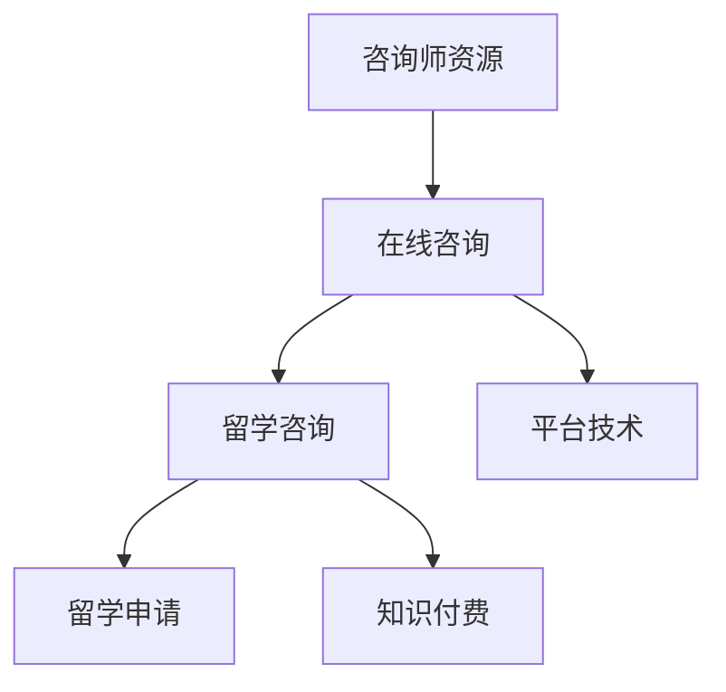

                 

# 如何利用知识付费实现在线留学咨询与申请服务？

## 1. 背景介绍

随着互联网技术的迅猛发展和在线教育市场的快速崛起，留学咨询服务也逐渐由传统的线下模式转变为线上模式。特别是在新冠疫情背景下，越来越多的留学家庭倾向于选择在线咨询服务，以避免跨境带来的不确定性和风险。如何利用知识付费模式，构建高效、精准、个性化的在线留学咨询服务体系，成为各大留学咨询机构关注的焦点。

### 1.1 行业现状与挑战
留学咨询服务历来是教育咨询领域的高附加值业务，涉及语言考试、专业选择、申请流程、签证办理等多个环节。传统留学咨询依赖于丰富的留学经验、专业背景和强大的信息获取能力，需花费大量时间和资源。而随着留学需求的不断增长和留学家庭对个性化、专业化的服务需求日益增加，传统咨询模式面临以下挑战：

1. **服务成本高**：线下咨询需要租用办公场地、招聘专业咨询师，固定成本和运营成本较高。
2. **服务效率低**：线上咨询面临平台搭建、用户运营、服务质量监控等难题。
3. **信息不对称**：信息获取依赖于顾问的主观经验，容易导致信息偏差和误导。
4. **服务标准化**：传统咨询服务标准化程度低，难以形成规模化、系统化的服务体系。

### 1.2 知识付费的优势
知识付费模式通过将高质量的留学咨询服务内容转化为付费内容，为留学家庭提供定制化、专业化的在线咨询服务，打破了传统留学咨询的瓶颈，带来了多重优势：

1. **降低服务成本**：无需高昂的固定成本和运营成本，降低了服务门槛。
2. **提高服务效率**：通过平台技术支持和自动化工具，提升服务效率和响应速度。
3. **增强信息对称**：基于大数据和AI技术，为用户提供精准、实时的信息支持。
4. **实现标准化**：通过标准化流程和模板，提升服务质量和一致性。

## 2. 核心概念与联系

### 2.1 核心概念概述

为了更好地理解如何利用知识付费模式构建在线留学咨询服务，本节将介绍几个关键概念：

1. **知识付费(Knowledge Pricing)**：指用户为获取知识或信息而支付费用的商业模式。留学咨询服务作为一种专业性强、信息价值高的知识付费内容，具有较高的市场价值。

2. **在线咨询(Online Consultation)**：通过网络平台提供的一对一或一对多的咨询服务形式，能够实现实时互动，满足用户个性化的需求。

3. **留学申请(Admission Application)**：留学生根据自身条件，通过网络平台提交申请材料，完成院校申请流程的过程。

4. **平台技术(Platform Technology)**：指用于支撑在线咨询和留学申请服务的技术框架和工具，包括但不限于数据分析、机器学习、自然语言处理、用户管理等。

5. **咨询师资源(Consultant Resource)**：指具备留学咨询经验、专业背景的咨询师，他们通过平台提供专业建议，帮助学生完成申请。

这些核心概念之间的联系可以通过以下Mermaid流程图来展示：



这个流程图展示了几大关键概念之间的逻辑关系：

1. 留学咨询通过知识付费模式转化为在线服务。
2. 在线咨询依托平台技术，提供实时互动的服务体验。
3. 咨询师资源是服务质量的关键，通过平台提供专业支持。

## 3. 核心算法原理 & 具体操作步骤

### 3.1 算法原理概述

利用知识付费模式构建在线留学咨询服务，本质上是一个需求响应系统，通过将留学咨询服务内容商品化，实现个性化、定制化的服务。算法原理包括：

1. **需求分析**：对留学家庭的需求进行详细分析，通过问卷、访谈等方式获取用户画像和需求。
2. **内容设计**：基于需求分析结果，设计符合用户需求的服务内容，包括课程、资料、咨询等。
3. **价格制定**：根据内容价值和服务类型，制定合理的知识付费价格，吸引用户购买。
4. **平台搭建**：搭建在线平台，整合和优化各类资源，提供一站式的留学咨询服务。
5. **运营管理**：通过数据分析和用户反馈，持续优化服务质量和用户满意度。

### 3.2 算法步骤详解

1. **需求分析**：通过在线调研、问卷调查、用户访谈等方式收集留学家庭的需求，包括语言考试、院校选择、申请材料准备、签证流程等。

2. **内容设计**：基于需求分析结果，设计服务内容，如：
   - **语言考试课程**：涵盖托福、雅思、GRE等考试的培训课程，提供教材、模拟考试、解析视频等。
   - **院校选择咨询**：提供全球各类大学的详细介绍、申请要求、历年录取数据等。
   - **申请流程指导**：包括文书写作、推荐信撰写、面试准备等申请流程指导。
   - **签证申请辅导**：提供签证申请流程、材料准备、常见问题解答等。

3. **价格制定**：根据服务类型和内容价值，制定合理的付费标准。例如：
   - **基础会员**：月费制，涵盖基础内容，如院校介绍、申请流程等。
   - **高级会员**：包年制，提供个性化服务，如专业咨询、文书审核等。
   - **定制服务**：按项目收费，提供个性化的留学申请解决方案。

4. **平台搭建**：搭建在线平台，涵盖用户管理、内容发布、支付结算、咨询互动等功能模块，具体步骤包括：
   - **用户注册与登录**：实现用户注册、登录、个人信息管理等功能。
   - **内容发布与审核**：提供内容上传、审核、发布等功能，确保内容的准确性和时效性。
   - **支付结算系统**：实现在线支付、订单管理、发票生成等功能。
   - **咨询互动模块**：提供实时聊天、视频咨询、邮件咨询等功能。

5. **运营管理**：通过数据分析和用户反馈，持续优化平台和服务质量，具体步骤包括：
   - **数据采集与分析**：采集用户行为数据，分析用户需求和反馈。
   - **服务优化**：根据用户反馈，优化服务内容和流程，提升用户体验。
   - **营销推广**：通过社交媒体、搜索引擎营销等手段，推广平台和内容。

### 3.3 算法优缺点

利用知识付费模式构建在线留学咨询服务具有以下优点：

1. **降低服务成本**：无需固定成本和运营成本，灵活运营，降低服务门槛。
2. **提高服务效率**：通过平台技术，提升服务响应速度和处理能力。
3. **增强信息对称**：基于大数据和AI技术，提供精准、实时的信息支持。
4. **实现标准化**：通过标准化流程和模板，提升服务质量和一致性。

同时，该模式也存在以下缺点：

1. **服务质量依赖平台**：平台的技术和运营质量直接决定了服务的质量。
2. **用户需求多样**：不同用户的需求和层次差异较大，服务难以完全满足所有用户。
3. **价格敏感性**：部分用户对价格较为敏感，高昂的价格可能影响购买意愿。
4. **内容更新频率**：平台需要持续更新内容，保持内容的时效性和准确性。

### 3.4 算法应用领域

基于知识付费模式构建在线留学咨询服务，可以应用于各类留学咨询机构和平台。具体应用领域包括：

1. **在线留学平台**：如Cambly、IDP、Tutor.com等，提供留学申请、签证、语言考试等各类咨询服务。
2. **教育咨询公司**：通过平台提供留学咨询服务，扩大服务范围，提升服务质量。
3. **个人咨询师**：通过平台拓展客户渠道，提供个性化的留学咨询和申请服务。

## 4. 数学模型和公式 & 详细讲解  
### 4.1 数学模型构建

本节将使用数学语言对知识付费模式下的在线留学咨询服务进行严格的数学建模。

设留学家庭需求集为 $D=\{d_i\}_{i=1}^N$，其中 $d_i$ 代表第 $i$ 个留学家庭的特定需求，包括语言考试、院校选择、申请材料准备等。设服务内容集为 $S=\{s_j\}_{j=1}^M$，其中 $s_j$ 代表第 $j$ 项服务内容，如课程、资料、咨询等。

需求与服务内容之间的匹配关系可以用如下矩阵表示：

$$
D \times S = \begin{bmatrix} 0 & 1 & 0 \\ 1 & 0 & 1 \\ 0 & 1 & 1 \\ \vdots & \vdots & \vdots \end{bmatrix}
$$

其中 $d_i$ 和 $s_j$ 之间的匹配关系 $M_{ij}$ 为 1，否则为 0。

平台根据匹配关系对需求进行定价，即 $P_{ij}$ 代表第 $i$ 个需求匹配第 $j$ 项服务的价格。设平台总收入为 $R$，则：

$$
R = \sum_{i=1}^N \sum_{j=1}^M M_{ij}P_{ij}
$$

### 4.2 公式推导过程

以语言考试课程为例，推导服务价格 $P_{ij}$ 的计算公式。

设课程内容为 $C$，平台通过调研和市场分析，得出不同课程内容对不同留学家庭需求的匹配度 $K_{ij}$。设课程价格为 $P_C$，则有：

$$
P_{ij} = K_{ij}P_C
$$

其中 $K_{ij}$ 是需求和课程内容之间的匹配系数，可定义为：

$$
K_{ij} = \frac{C_j}{S_j}
$$

其中 $C_j$ 为第 $j$ 项服务内容与需求的相关度，$S_j$ 为该项服务的市场需求。

综上，可得服务价格 $P_{ij}$ 的计算公式为：

$$
P_{ij} = \frac{C_j}{S_j}P_C
$$

### 4.3 案例分析与讲解

以某留学平台为例，分析其如何通过知识付费模式构建在线留学咨询服务体系。该平台首先通过市场调研和用户反馈，确定各类服务内容及其价格。例如，基础会员月费为 $100/月$，提供院校介绍和申请流程指导；高级会员年费为 $1200/年$，提供专业咨询和文书审核服务。通过平台技术，用户可以选择需要的服务内容，并进行在线支付。

平台通过数据分析，实时监测用户行为和反馈，不断优化服务内容和流程，提升用户体验。例如，通过分析用户对课程的评价，调整课程内容和时间安排；根据用户申请成功率，调整咨询服务策略。此外，平台通过社交媒体和搜索引擎营销，不断推广服务内容，吸引更多用户。

## 5. 项目实践：代码实例和详细解释说明

### 5.1 开发环境搭建

在进行在线留学咨询服务系统的开发前，需要准备好开发环境。以下是使用Python进行Django开发的环境配置流程：

1. 安装Python：从官网下载并安装Python，推荐使用Python 3.8及以上版本。
2. 安装虚拟环境：
   ```bash
   python -m venv env
   source env/bin/activate
   ```
3. 安装Django：
   ```bash
   pip install django
   ```
4. 安装PostgreSQL：
   ```bash
   sudo apt-get install postgresql postgresql-contrib
   ```
5. 创建数据库：
   ```bash
   createdb mydatabase
   ```
6. 安装PgAdmin：
   ```bash
   sudo apt-get install pgadmin4
   ```
7. 启动PostgreSQL服务：
   ```bash
   sudo systemctl start postgresql
   ```

完成上述步骤后，即可在`env`环境中开始系统开发。

### 5.2 源代码详细实现

接下来，我们将以在线咨询平台的开发为例，给出完整的Django代码实现。

首先，创建一个Django项目：

```bash
django-admin startproject myproject
```

然后，创建一个Django应用：

```bash
python manage.py startapp consultation
```

接着，定义模型和视图：

```python
from django.db import models
from django.shortcuts import render, redirect
from django.http import HttpResponse

class User(models.Model):
    name = models.CharField(max_length=50)
    email = models.EmailField(unique=True)
    password = models.CharField(max_length=50)

class Service(models.Model):
    name = models.CharField(max_length=50)
    price = models.DecimalField(max_digits=10, decimal_places=2)

class Order(models.Model):
    user = models.ForeignKey(User, on_delete=models.CASCADE)
    service = models.ForeignKey(Service, on_delete=models.CASCADE)
    status = models.CharField(max_length=50)
    total_price = models.DecimalField(max_digits=10, decimal_places=2)
```

定义用户注册、登录、服务购买、订单管理等视图：

```python
from django.shortcuts import render, redirect
from django.http import HttpResponse

def register(request):
    if request.method == 'POST':
        name = request.POST['name']
        email = request.POST['email']
        password = request.POST['password']
        user = User.objects.create_user(name, email, password)
        user.save()
        return redirect('login')
    else:
        return render(request, 'register.html')

def login(request):
    if request.method == 'POST':
        email = request.POST['email']
        password = request.POST['password']
        user = User.objects.filter(email=email, password=password).first()
        if user:
            request.session['user_id'] = user.id
            return redirect('home')
        else:
            return HttpResponse('Invalid email or password')
    else:
        return render(request, 'login.html')

def home(request):
    if 'user_id' in request.session:
        services = Service.objects.all()
        return render(request, 'home.html', {'services': services})
    else:
        return redirect('login')

def buy_service(request, service_id):
    if 'user_id' in request.session:
        user = User.objects.get(id=request.session['user_id'])
        service = Service.objects.get(id=service_id)
        order = Order(user=user, service=service, status='processing', total_price=service.price)
        order.save()
        return redirect('home')
    else:
        return redirect('login')
```

最后，创建相应的HTML模板和静态文件：

```html
<!-- register.html -->
<form method="POST">
    
    {{ form.as_p }}
    <button type="submit">Register</button>
</form>

<!-- login.html -->
<form method="POST">
    
    {{ form.as_p }}
    <button type="submit">Login</button>
</form>

<!-- home.html -->
<h1>Services</h1>
<ul>
    
        <li><a href="">{{ service.name }} - ${{ service.price }}</a></li>
    
</ul>
```

通过上述代码，实现了用户注册、登录、服务购买、订单管理等基本功能。

### 5.3 代码解读与分析

让我们进一步解读关键代码的实现细节：

**User模型**：
- `name`：用户姓名，`max_length=50`表示最大长度为50。
- `email`：用户邮箱，`unique=True`表示唯一性约束。
- `password`：用户密码，`max_length=50`表示最大长度为50。

**Service模型**：
- `name`：服务名称，`max_length=50`表示最大长度为50。
- `price`：服务价格，使用`DecimalField`来保证精确度。

**Order模型**：
- `user`：用户外键，`on_delete=models.CASCADE`表示用户删除时，关联的订单一并删除。
- `service`：服务外键，`on_delete=models.CASCADE`表示服务删除时，关联的订单一并删除。
- `status`：订单状态，`max_length=50`表示最大长度为50。
- `total_price`：订单总价，使用`DecimalField`来保证精确度。

**注册视图**：
- 获取表单数据，创建用户并保存。
- 如果表单验证通过，重定向到登录页面。

**登录视图**：
- 获取表单数据，通过邮箱和密码验证用户。
- 如果验证通过，设置Session，重定向到首页。
- 如果验证失败，返回错误信息。

**首页视图**：
- 如果Session中存在用户，获取所有服务并渲染到首页模板。
- 如果Session中不存在用户，重定向到登录页面。

**购买服务视图**：
- 如果Session中存在用户，创建订单并保存。
- 如果Session中不存在用户，重定向到登录页面。

通过这些视图和模型，实现了基本的用户管理和服务购买功能。

### 5.4 运行结果展示

在运行以上代码后，可以在浏览器中访问`http://localhost:8000`，看到注册、登录、购买服务等页面。用户注册后，可以通过登录进入系统，购买所需的服务，并查看订单状态。

## 6. 实际应用场景

### 6.1 在线咨询平台

在线留学咨询平台通过知识付费模式，为留学家庭提供一站式服务，包括语言考试培训、院校选择咨询、申请流程指导、签证申请辅导等。平台通过整合各类服务内容和资源，提升服务质量和用户体验，具体应用场景包括：

1. **基础会员服务**：提供免费的院校介绍、申请流程等基本服务，满足部分用户需求。
2. **高级会员服务**：提供个性化专业咨询和文书审核等高级服务，提升用户满意度。
3. **定制服务**：提供一对一的咨询服务，满足特定用户的需求。

### 6.2 教育咨询公司

教育咨询公司通过知识付费模式，拓展服务范围，提升服务质量和效率。具体应用场景包括：

1. **全球留学指南**：提供全球各类大学的详细介绍、历年录取数据等，帮助用户做出更好的选择。
2. **申请流程指导**：提供文书写作、推荐信撰写、面试准备等流程指导，提升申请成功率。
3. **签证申请辅导**：提供签证申请流程、材料准备、常见问题解答等，降低签证申请难度。

### 6.3 个人咨询师

个人咨询师通过知识付费模式，拓展客户渠道，提供个性化的留学咨询和申请服务。具体应用场景包括：

1. **一对一咨询服务**：提供个性化的咨询和申请指导，满足用户的个性化需求。
2. **视频咨询服务**：通过视频通话，提供实时的咨询和答疑服务。
3. **邮件咨询服务**：通过邮件往来，提供及时的答疑和指导。

## 7. 工具和资源推荐

### 7.1 学习资源推荐

为了帮助开发者系统掌握在线留学咨询服务的技术原理和开发方法，这里推荐一些优质的学习资源：

1. **Django官方文档**：提供详细的Django框架使用指南和开发教程，帮助开发者快速上手Django开发。
2. **Django实战教程**：通过实战项目，讲解Django应用的开发技巧和最佳实践，提升开发者实战能力。
3. **Django框架入门**：适合初学者，讲解Django框架的核心概念和开发流程。
4. **Django教程**：通过案例讲解，帮助开发者理解Django框架的实际应用。
5. **Django ORM教程**：讲解Django的ORM对象关系映射技术，提升开发者数据操作能力。

### 7.2 开发工具推荐

高效的开发离不开优秀的工具支持。以下是几款用于Django开发推荐的工具：

1. PyCharm：功能强大的Python IDE，提供代码编辑、调试、版本控制等丰富功能。
2. VSCode：轻量级但功能强大的代码编辑器，支持多种编程语言和插件。
3. Django Admin：通过简单的配置，实现网站的后台管理功能。
4. Django Rest Framework：提供RESTful API的开发框架，便于前后端数据交互。
5. Git：版本控制系统，支持多人协作和代码管理。

### 7.3 相关论文推荐

知识付费模式在教育领域的成功应用，代表了一系列前沿研究。以下是几篇奠基性的相关论文，推荐阅读：

1. **知识付费平台的用户行为研究**：研究用户对知识付费内容的消费行为和偏好，为平台的优化提供数据支持。
2. **在线教育平台的运营策略分析**：分析在线教育平台的用户获取、转化、留存等关键指标，提升平台运营效率。
3. **留学咨询服务的内容设计**：研究留学咨询服务的核心内容和用户需求，指导内容设计。
4. **知识付费服务的质量控制**：研究知识付费内容的质量控制方法和标准，提升服务质量。

## 8. 总结：未来发展趋势与挑战

### 8.1 总结

本文对如何利用知识付费模式构建在线留学咨询服务进行了全面系统的介绍。首先阐述了在线留学咨询服务的发展背景和趋势，明确了知识付费模式在提升服务质量、降低运营成本等方面的优势。其次，从算法原理和具体操作步骤，详细讲解了知识付费模式下的在线留学咨询服务构建过程。最后，探讨了知识付费模式在实际应用中的场景，推荐了相关的学习资源和工具。

通过本文的系统梳理，可以看到，利用知识付费模式构建在线留学咨询服务具有广阔的市场前景和应用价值，将成为留学咨询服务的新趋势。伴随技术的不断进步和市场的逐步成熟，未来会有更多智能化、个性化的在线留学咨询服务出现，为留学家庭提供更加便捷、高效的服务体验。

### 8.2 未来发展趋势

展望未来，在线留学咨询服务将呈现以下几个发展趋势：

1. **服务内容丰富化**：随着知识付费模式的发展，服务内容将更加丰富多样，涵盖留学申请的各个环节，如语言考试、院校选择、签证申请等。
2. **服务个性化**：基于用户画像和行为数据，提供个性化推荐和定制服务，提升用户体验。
3. **技术智能化**：引入AI技术，实现智能咨询、智能推荐等智能化功能，提高服务效率和质量。
4. **平台社交化**：通过平台社交功能，帮助用户建立交流圈子，分享留学经验，提升服务粘性。
5. **服务全球化**：通过全球化服务网络，提供全球各地的留学咨询和申请服务。

### 8.3 面临的挑战

尽管在线留学咨询服务具有广阔的前景，但在发展过程中仍面临诸多挑战：

1. **平台技术门槛**：高质量的在线咨询服务平台需要先进的技术和运营能力，对开发者和运营者提出了较高要求。
2. **用户需求多样**：不同用户的需求和层次差异较大，服务难以完全满足所有用户。
3. **内容质量控制**：内容质量直接决定了服务质量，如何保障内容的准确性和时效性，是平台的重要挑战。
4. **用户信任问题**：用户对平台和服务的信任度是平台发展的关键，如何建立和维护用户信任，是平台运营的重要课题。

### 8.4 研究展望

面对在线留学咨询服务的挑战，未来的研究需要在以下几个方面寻求新的突破：

1. **用户需求挖掘**：深入挖掘用户需求和行为特征，构建精准的用户画像，提升服务推荐的准确性。
2. **内容智能化**：引入AI技术，实现内容的智能生成、智能优化，提升内容的时效性和准确性。
3. **平台用户体验**：通过技术手段和用户反馈，不断优化平台界面和功能，提升用户的使用体验。
4. **服务质量控制**：建立完善的服务质量控制体系，保障内容和服务质量。
5. **用户信任建设**：通过社交互动、用户评价、平台保障等手段，建立用户信任，提升平台的用户粘性。

这些研究方向的探索，必将引领在线留学咨询服务技术的不断进步，为留学家庭提供更加高效、个性化、可靠的服务体验。

## 9. 附录：常见问题与解答

**Q1：知识付费模式如何确保服务质量？**

A: 知识付费模式通过市场机制和用户反馈，确保服务质量。平台根据用户反馈和评价，对服务内容和价格进行动态调整，提升服务质量和用户满意度。此外，平台通过认证和评价机制，筛选优质的咨询师和内容，保障服务的可靠性和专业性。

**Q2：如何构建用户画像和个性化推荐系统？**

A: 构建用户画像和个性化推荐系统，需要收集和分析用户的行为数据和反馈信息。具体步骤包括：
1. 收集用户的基本信息、行为数据、评价数据等。
2. 通过数据分析和机器学习，构建用户画像，描述用户的兴趣、需求和偏好。
3. 根据用户画像，设计个性化推荐算法，如协同过滤、基于内容的推荐等，实现个性化推荐。

**Q3：如何提升在线咨询服务的用户信任度？**

A: 提升在线咨询服务的用户信任度，需要从多个方面进行优化：
1. 建立平台保障机制，如安全支付、隐私保护等，保障用户数据安全。
2. 提供用户评价和反馈机制，让其他用户分享使用体验，提升用户信任。
3. 通过认证和筛选机制，选择优质的咨询师和内容，提升服务质量。
4. 提供丰富的案例和成功故事，展示平台的服务实力和用户口碑。

**Q4：如何优化在线咨询服务的运营成本？**

A: 优化在线咨询服务的运营成本，需要从多个方面进行优化：
1. 通过自动化工具和系统优化，提升服务效率和处理能力。
2. 利用平台数据分析，优化服务流程和内容，提升用户体验。
3. 采用订阅和定制服务模式，提升用户粘性和重复购买率。
4. 通过数据分析和用户反馈，不断优化服务内容和价格，提升用户满意度和忠诚度。

**Q5：如何应对留学市场的变化和不确定性？**

A: 应对留学市场的变化和不确定性，需要灵活应对和快速响应：
1. 通过数据分析和市场预测，及时调整服务内容和价格，提升服务灵活性。
2. 建立灵活的服务保障机制，如快速响应机制、多渠道支持等，提升服务响应速度。
3. 通过持续学习和数据积累，提升服务的预测能力和决策能力。

总之，在线留学咨询服务的构建和运营是一个复杂的多学科融合过程，需要结合技术、市场、用户等多个方面的因素进行综合优化。通过持续创新和优化，相信在线留学咨询服务将为留学家庭提供更加高效、个性化、可靠的服务体验。

