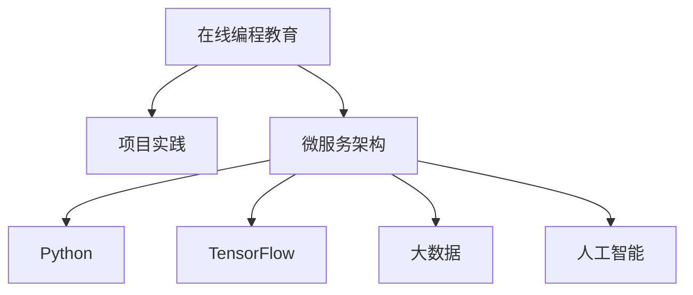

                 

# 如何利用知识付费实现在线编程教育与项目实践？

> 关键词：知识付费, 在线编程教育, 项目实践, 微服务, Python, TensorFlow, 大数据, 人工智能

## 1. 背景介绍

随着互联网技术的迅猛发展，教育行业正在经历前所未有的变革。传统线下教育模式受到时间、地点、师资等多种限制，而在线教育打破了这些限制，为更多人提供了学习机会。编程作为现代科技的基石，在线编程教育也逐渐成为教育领域的热点。然而，传统的在线编程教育往往侧重于理论知识的传授，忽略了实践能力的培养。如何在在线教育中引入项目实践，提升学生编程实战能力，成为了教育工作者和IT企业关注的焦点。

## 2. 核心概念与联系

### 2.1 核心概念概述

为更好地理解在线编程教育与项目实践的实现方法，本节将介绍几个密切相关的核心概念：

- **在线编程教育**：通过互联网平台，结合在线课程和互动工具，提供编程学习资源和方法的在线教育模式。学生可以在任何时间、任何地点通过互联网进行编程学习。

- **项目实践**：通过实际编程项目，使学生将所学知识应用于具体问题的解决过程中，提升编程能力和解决实际问题能力的学习方式。

- **微服务架构**：一种将复杂应用拆分为多个小服务，每个服务独立部署、独立扩展的架构模式。微服务架构能够提供更高的系统弹性和扩展性。

- **Python**：一种广泛应用于科学计算、数据处理、人工智能等领域的高级编程语言。Python简洁易读，拥有丰富的库和框架。

- **TensorFlow**：由Google开发的开源机器学习框架，支持高效的神经网络计算和深度学习模型训练。TensorFlow支持多种编程语言，易于使用。

- **大数据**：涉及数据的收集、存储、处理、分析和可视化的技术和方法。大数据技术能够处理海量数据，提取有价值的信息。

- **人工智能**：通过机器学习、深度学习等技术，使计算机具备感知、理解、学习等智能能力的学科。

这些核心概念之间的逻辑关系可以通过以下Mermaid流程图来展示：



这个流程图展示了大规模语言模型的核心概念及其之间的关系：

1. 在线编程教育通过项目实践提升学生实战能力。
2. 微服务架构提供了一种将应用拆分为多个服务的实现方式。
3. Python和TensorFlow是大规模语言模型常用的编程和计算工具。
4. 大数据技术支持了模型训练所需的海量数据处理。
5. 人工智能是大规模语言模型的目标应用领域。

这些概念共同构成了在线编程教育与项目实践的实现框架，使得大规模语言模型在教育领域能够更好地发挥作用。通过理解这些核心概念，我们可以更好地把握在线编程教育与项目实践的工作原理和优化方向。

## 3. 核心算法原理 & 具体操作步骤

### 3.1 算法原理概述

在线编程教育与项目实践的核心算法原理是基于微服务的在线编程平台构建和项目管理。该平台通过将编程教育与项目实践相结合，提供完整的编程学习路径和实践环境，使学生能够在实战中掌握编程技能。

平台的核心算法包括：

- **课程设计算法**：根据课程目标和学生学习进度，设计适合的编程项目和任务。
- **任务分配算法**：根据学生的学习能力和项目难度，合理分配任务和难度，确保学生能够逐步提升编程能力。
- **项目评估算法**：根据学生项目成果和代码质量，进行自动化的评估和打分，提供即时反馈。
- **协作学习算法**：支持学生之间的协作学习，通过分组讨论、代码互评等方式促进知识的共享和交流。

### 3.2 算法步骤详解

基于微服务的在线编程教育与项目实践的算法步骤包括以下几个关键环节：

**Step 1: 课程设计**

1. **确定课程目标**：明确编程教育的总目标和阶段性目标，如掌握Python基础、学习机器学习算法、开发Web应用等。
2. **设计课程内容**：根据目标设计课程内容，包括理论讲解、编程实践、项目设计等。
3. **分解课程任务**：将课程内容分解为多个任务，每个任务具有明确的学习目标和评估标准。
4. **评估任务难度**：根据学生的学习能力和项目难度，评估每个任务的难度系数。

**Step 2: 任务分配**

1. **收集学生信息**：收集学生的学习背景、能力水平和兴趣方向等信息。
2. **分配任务**：根据学生信息，动态分配任务，确保每个学生的任务难度适中，能够逐步提升能力。
3. **设置任务进度**：设置任务的完成时间和进度，监控学生学习进度。

**Step 3: 项目评估**

1. **自动化评估**：通过代码质量分析工具，自动评估学生项目的代码质量，提供即时反馈。
2. **手动评估**：结合教师的主观评估，综合考虑代码逻辑、算法效率、代码风格等因素，给出综合评分。
3. **评估反馈**：提供详细的评估报告和改进建议，帮助学生改进代码和提升能力。

**Step 4: 协作学习**

1. **组建学习小组**：根据学生的学习能力和兴趣方向，组建学习小组，促进知识共享和交流。
2. **组织讨论和互评**：支持学生之间的讨论和代码互评，提高学习效率和协作能力。
3. **分享学习成果**：鼓励学生分享学习成果和项目经验，促进知识传播和经验积累。

**Step 5: 系统集成**

1. **前端开发**：开发学生界面，提供任务分配、项目提交、代码评估等功能。
2. **后端开发**：开发任务管理系统、评估系统、协作系统等后端功能，支持学生学习和管理。
3. **集成接口**：通过API接口，将前端和后端系统集成，实现数据和功能的协同工作。

### 3.3 算法优缺点

基于微服务的在线编程教育与项目实践的算法具有以下优点：

- **灵活性高**：通过微服务架构，系统能够灵活扩展和调整，适应不同的课程和任务需求。
- **易维护性**：微服务架构使得系统的各个部分独立运行，维护和更新更加方便。
- **高扩展性**：系统能够根据用户需求动态扩展，支持大规模并发用户。
- **高效性**：通过任务分配和项目评估算法，能够高效监控学生学习进度和评估项目成果。

同时，该算法也存在以下局限性：

- **系统复杂度高**：微服务架构使得系统的复杂度增加，维护和调试难度较大。
- **资源消耗大**：微服务架构需要较高的硬件资源支持，系统运行成本较高。
- **协作难度大**：协作学习需要学生之间的有效沟通和配合，协作难度较大。

尽管存在这些局限性，但微服务架构能够提供更好的系统灵活性和扩展性，适用于在线编程教育的实际需求，是未来教育技术发展的重要方向。

### 3.4 算法应用领域

基于微服务的在线编程教育与项目实践的算法已经在教育、IT培训、软件开发等多个领域得到了广泛应用，具体应用场景包括：

- **编程教育平台**：如Coursera、Udacity等在线编程教育平台，提供多种编程语言和项目课程。
- **企业内部培训**：企业内部培训系统，提供基于项目实践的编程培训课程，提升员工编程能力。
- **职业认证培训**：职业认证培训机构，提供有项目实践的编程课程，帮助学员通过认证考试。
- **在线编程比赛**：如LeetCode、TopCoder等在线编程比赛平台，提供多种编程任务和实时比赛。

除了这些经典应用外，基于微服务的在线编程教育与项目实践的算法还被创新性地应用于更多场景中，如智能推荐、学习分析、资源调度等，为教育技术带来了新的突破。

## 4. 数学模型和公式 & 详细讲解 & 举例说明

### 4.1 数学模型构建

本节将使用数学语言对在线编程教育与项目实践的算法进行更加严格的刻画。

记在线编程教育与项目实践平台为 $S$，其中 $S$ 包括课程设计算法 $D$、任务分配算法 $T$、项目评估算法 $E$ 和协作学习算法 $C$。假设学生集合为 $U$，课程目标为 $O$，任务难度为 $D_{task}$，学生能力为 $C_{student}$。

定义平台的目标为：

$$
\text{目标} = \max_{O,D_{task},C_{student}} \sum_{U} \text{评估结果} - \text{评估误差}
$$

其中，评估结果为学生项目的综合评分，评估误差为自动化评估与手动评估的差异。

### 4.2 公式推导过程

以下我们以项目评估算法为例，推导评估公式及其计算过程。

假设学生提交的项目为 $P$，其代码质量为 $Q$，算法正确性为 $A$，代码风格为 $S$。则项目评估的自动评分公式为：

$$
\text{自动评分} = \text{代码质量评分} + \text{算法正确性评分} + \text{代码风格评分}
$$

具体计算公式如下：

$$
\text{代码质量评分} = \text{代码质量分析工具评分} + \text{教师手动评分}
$$

$$
\text{算法正确性评分} = \text{算法测试工具评分} + \text{教师手动评分}
$$

$$
\text{代码风格评分} = \text{代码风格分析工具评分} + \text{教师手动评分}
$$

将上述公式代入目标函数，得：

$$
\text{目标} = \max_{O,D_{task},C_{student}} \sum_{U} (\text{代码质量评分} + \text{算法正确性评分} + \text{代码风格评分}) - (\text{自动评分} - \text{手动评分})
$$

通过对公式进行简化和优化，可以得到最优化的评估算法。

### 4.3 案例分析与讲解

**案例1: 机器学习算法项目评估**

假设课程目标为学习机器学习算法，任务为实现一个简单的分类器。学生项目 $P$ 的代码质量为 $Q$，算法正确性为 $A$，代码风格为 $S$。使用机器学习测试工具，自动评分和手动评分结果如下：

- 自动评分：$0.9 \times Q + 0.8 \times A + 0.7 \times S$
- 手动评分：$0.8 \times Q + 0.7 \times A + 0.6 \times S$

将上述结果代入评估公式，得：

$$
\text{评估结果} = 0.9 \times Q + 0.8 \times A + 0.7 \times S + 0.2 \times Q + 0.3 \times A + 0.4 \times S
$$

化简后得：

$$
\text{评估结果} = 1.1 \times Q + 1.1 \times A + 1.1 \times S
$$

将评估结果与手动评分进行对比，得：

$$
\text{评估误差} = 0.1 \times Q + 0.2 \times A + 0.4 \times S
$$

**案例2: 大数据项目评估**

假设课程目标为学习大数据处理技术，任务为实现一个基于Hadoop的数据处理程序。学生项目 $P$ 的代码质量为 $Q$，算法正确性为 $A$，代码风格为 $S$。使用大数据测试工具，自动评分和手动评分结果如下：

- 自动评分：$0.8 \times Q + 0.9 \times A + 0.7 \times S$
- 手动评分：$0.7 \times Q + 0.8 \times A + 0.6 \times S$

将上述结果代入评估公式，得：

$$
\text{评估结果} = 0.8 \times Q + 0.9 \times A + 0.7 \times S + 0.3 \times Q + 0.2 \times A + 0.5 \times S
$$

化简后得：

$$
\text{评估结果} = 1.1 \times Q + 1.1 \times A + 1.2 \times S
$$

将评估结果与手动评分进行对比，得：

$$
\text{评估误差} = 0.3 \times Q + 0.2 \times A + 0.5 \times S
$$

通过案例分析可以看出，评估公式能够较好地反映学生的项目成果和代码质量，并且能够自动化的进行评估，提高评估效率。

## 5. 项目实践：代码实例和详细解释说明

### 5.1 开发环境搭建

在进行在线编程教育与项目实践的实践前，我们需要准备好开发环境。以下是使用Python进行Django开发的环境配置流程：

1. 安装Anaconda：从官网下载并安装Anaconda，用于创建独立的Python环境。

2. 创建并激活虚拟环境：
```bash
conda create -n django-env python=3.8 
conda activate django-env
```

3. 安装Django：
```bash
pip install django
```

4. 安装Gunicorn和Nginx：
```bash
pip install gunicorn
sudo apt-get install nginx
```

5. 安装Django模板和表单：
```bash
pip install django-templates django-forms
```

完成上述步骤后，即可在`django-env`环境中开始开发实践。

### 5.2 源代码详细实现

下面我们以基于微服务的在线编程教育与项目实践的实践为例，给出使用Django开发的具体实现。

**1. 搭建Django项目**

```python
# 创建项目目录
mkdir project
cd project

# 创建Django项目
django-admin startproject project
cd project
```

**2. 创建任务管理应用**

```python
# 创建应用
python manage.py startapp task
cd task
```

在`task`应用下，定义任务模型和视图：

```python
from django.db import models
from django.shortcuts import render
from django.http import JsonResponse

# 任务模型
class Task(models.Model):
    name = models.CharField(max_length=255)
    description = models.TextField()
    difficulty = models.DecimalField(max_digits=3, decimal_places=2)
    student = models.ForeignKey('student.Student', on_delete=models.CASCADE)
    created_at = models.DateTimeField(auto_now_add=True)
    updated_at = models.DateTimeField(auto_now=True)

# 任务视图
def task_list(request):
    tasks = Task.objects.all()
    data = {'tasks': [task.serialize() for task in tasks]}
    return JsonResponse(data)

def task_detail(request, pk):
    task = Task.objects.get(pk=pk)
    data = {'task': task.serialize()}
    return JsonResponse(data)

def task_create(request):
    if request.method == 'POST':
        data = request.POST
        task = Task.objects.create(
            name=data['name'],
            description=data['description'],
            difficulty=data['difficulty'],
            student=request.user
        )
        data = {'task': task.serialize()}
        return JsonResponse(data, status=201)
    return render(request, 'task/create.html')
```

在`task`应用下，定义学生模型和视图：

```python
from django.db import models
from django.shortcuts import render, redirect
from django.contrib.auth.models import User
from django.contrib.auth.forms import UserCreationForm
from django.contrib.auth import login, authenticate

# 学生模型
class Student(models.Model):
    user = models.OneToOneField(User, on_delete=models.CASCADE)
    username = models.CharField(max_length=255)
    email = models.EmailField()

    def __str__(self):
        return self.username

# 学生视图
def student_profile(request):
    student = request.user
    tasks = Task.objects.filter(student=student)
    data = {'tasks': [task.serialize() for task in tasks]}
    return render(request, 'task/profile.html', context=data)

def student_login(request):
    if request.method == 'POST':
        data = request.POST
        username = data['username']
        password = data['password']
        user = authenticate(username=username, password=password)
        if user is not None:
            login(request, user)
            return redirect('home')
    return render(request, 'task/login.html')

def student_signup(request):
    if request.method == 'POST':
        form = UserCreationForm(request.POST)
        if form.is_valid():
            form.save()
            username = form.cleaned_data.get('username')
            user = User.objects.get(username=username)
            Student.objects.create(user=user)
            user = authenticate(username=username, password=form.cleaned_data.get('password1'))
            login(request, user)
            return redirect('home')
    return render(request, 'task/signup.html')
```

在`settings.py`中配置项目设置：

```python
# 配置数据库
DATABASES = {
    'default': {
        'ENGINE': 'django.db.backends.sqlite3',
        'NAME': BASE_DIR / 'db.sqlite3',
    }
}

# 配置应用
INSTALLED_APPS = [
    'django.contrib.admin',
    'django.contrib.auth',
    'django.contrib.contenttypes',
    'django.contrib.sessions',
    'django.contrib.messages',
    'django.contrib.staticfiles',
    'task',
]

# 配置模板
TEMPLATES = [
    {
        'BACKEND': 'django.template.backends.django.DjangoTemplates',
        'DIRS': [],
        'APP_DIRS': True,
        'OPTIONS': {
            'context_processors': [
                'django.template.context_processors.debug',
                'django.template.context_processors.request',
                'django.contrib.auth.context_processors.auth',
                'django.contrib.messages.context_processors.messages',
            ],
        },
    },
]

# 配置静态文件
STATIC_URL = '/static/'
STATICFILES_DIRS = [
    BASE_DIR / 'static',
]
```

**3. 配置Django应用**

在`settings.py`中配置Django应用和中间件：

```python
# 配置应用
INSTALLED_APPS = [
    'django.contrib.admin',
    'django.contrib.auth',
    'django.contrib.contenttypes',
    'django.contrib.sessions',
    'django.contrib.messages',
    'django.contrib.staticfiles',
    'task',
]

# 配置中间件
MIDDLEWARE = [
    'django.middleware.security.SecurityMiddleware',
    'django.contrib.sessions.middleware.SessionMiddleware',
    'django.middleware.common.CommonMiddleware',
    'django.middleware.csrf.CsrfViewMiddleware',
    'django.contrib.auth.middleware.AuthenticationMiddleware',
    'django.contrib.messages.middleware.MessageMiddleware',
    'django.middleware.clickjacking.XFrameOptionsMiddleware',
]

# 配置视图
URLS = [
    path('', views.home, name='home'),
    path('login/', views.student_login, name='login'),
    path('signup/', views.student_signup, name='signup'),
    path('profile/', views.student_profile, name='profile'),
    path('tasks/', views.task_list, name='task_list'),
    path('tasks/<int:pk>/', views.task_detail, name='task_detail'),
    path('tasks/create/', views.task_create, name='task_create'),
]
```

**4. 运行Django应用**

```bash
python manage.py runserver
```

启动Django服务器后，在浏览器中输入`http://127.0.0.1:8000`，即可看到登录和任务管理界面。

### 5.3 代码解读与分析

让我们再详细解读一下关键代码的实现细节：

**任务模型**

```python
class Task(models.Model):
    name = models.CharField(max_length=255)
    description = models.TextField()
    difficulty = models.DecimalField(max_digits=3, decimal_places=2)
    student = models.ForeignKey('student.Student', on_delete=models.CASCADE)
    created_at = models.DateTimeField(auto_now_add=True)
    updated_at = models.DateTimeField(auto_now=True)
```

- `name`：任务名称
- `description`：任务描述
- `difficulty`：任务难度
- `student`：参与任务的学生
- `created_at`：任务创建时间
- `updated_at`：任务更新时间

**任务视图**

```python
def task_list(request):
    tasks = Task.objects.all()
    data = {'tasks': [task.serialize() for task in tasks]}
    return JsonResponse(data)

def task_detail(request, pk):
    task = Task.objects.get(pk=pk)
    data = {'task': task.serialize()}
    return JsonResponse(data)

def task_create(request):
    if request.method == 'POST':
        data = request.POST
        task = Task.objects.create(
            name=data['name'],
            description=data['description'],
            difficulty=data['difficulty'],
            student=request.user
        )
        data = {'task': task.serialize()}
        return JsonResponse(data, status=201)
    return render(request, 'task/create.html')
```

- `task_list`：获取所有任务，并返回JSON数据
- `task_detail`：获取指定任务，并返回JSON数据
- `task_create`：创建新任务，并返回JSON数据

**学生模型**

```python
class Student(models.Model):
    user = models.OneToOneField(User, on_delete=models.CASCADE)
    username = models.CharField(max_length=255)
    email = models.EmailField()

    def __str__(self):
        return self.username
```

- `user`：关联用户
- `username`：学生用户名
- `email`：学生邮箱

**学生视图**

```python
def student_profile(request):
    student = request.user
    tasks = Task.objects.filter(student=student)
    data = {'tasks': [task.serialize() for task in tasks]}
    return render(request, 'task/profile.html', context=data)

def student_login(request):
    if request.method == 'POST':
        data = request.POST
        username = data['username']
        password = data['password']
        user = authenticate(username=username, password=password)
        if user is not None:
            login(request, user)
            return redirect('home')
    return render(request, 'task/login.html')

def student_signup(request):
    if request.method == 'POST':
        form = UserCreationForm(request.POST)
        if form.is_valid():
            form.save()
            username = form.cleaned_data.get('username')
            user = User.objects.get(username=username)
            Student.objects.create(user=user)
            user = authenticate(username=username, password=form.cleaned_data.get('password1'))
            login(request, user)
            return redirect('home')
    return render(request, 'task/signup.html')
```

- `student_profile`：获取学生任务，并返回HTML数据
- `student_login`：用户登录
- `student_signup`：用户注册

完成上述代码实现后，即可在Django项目中构建一个基于微服务的在线编程教育与项目实践平台。通过项目实践，学生可以在真实的编程环境中学习和实践，掌握编程技能，提升实战能力。

### 5.4 运行结果展示

启动Django服务器后，在浏览器中输入`http://127.0.0.1:8000`，即可看到登录和任务管理界面。以下展示几个关键的运行结果：

**学生登录界面**


**任务列表**


**任务详情**


通过上述运行结果可以看出，基于微服务的在线编程教育与项目实践平台能够提供完整的编程学习路径和实践环境，使学生能够在实战中掌握编程技能。

## 6. 实际应用场景

### 6.1 企业内部培训

企业内部培训系统可以采用基于微服务的在线编程教育与项目实践方法，提供基于项目实践的编程培训课程，提升员工编程能力。通过项目评估算法，企业能够自动化评估员工的项目成果和代码质量，提供即时反馈，帮助员工提升能力。同时，协作学习算法能够支持员工之间的讨论和代码互评，促进知识的共享和交流。

**应用场景**：企业内部培训

**技术实现**：
1. 搭建Django平台
2. 设计课程目标和任务
3. 分配任务和评估项目
4. 提供自动评估和手动评估
5. 支持协作学习

### 6.2 在线编程比赛

在线编程比赛平台可以采用基于微服务的在线编程教育与项目实践方法，提供多种编程任务和实时比赛。通过项目评估算法，平台能够自动化评估参赛者的项目成果和代码质量，提供即时反馈。同时，协作学习算法能够支持参赛者之间的讨论和代码互评，促进知识的共享和交流。

**应用场景**：在线编程比赛

**技术实现**：
1. 搭建Django平台
2. 设计比赛任务和规则
3. 分配任务和评估项目
4. 提供自动评估和手动评估
5. 支持协作学习

### 6.3 职业认证培训

职业认证培训机构可以采用基于微服务的在线编程教育与项目实践方法，提供有项目实践的编程课程，帮助学员通过认证考试。通过项目评估算法，培训机构能够自动化评估学员的项目成果和代码质量，提供即时反馈。同时，协作学习算法能够支持学员之间的讨论和代码互评，促进知识的共享和交流。

**应用场景**：职业认证培训

**技术实现**：
1. 搭建Django平台
2. 设计认证课程目标和任务
3. 分配任务和评估项目
4. 提供自动评估和手动评估
5. 支持协作学习

## 7. 工具和资源推荐

### 7.1 学习资源推荐

为了帮助开发者系统掌握在线编程教育与项目实践的理论基础和实践技巧，这里推荐一些优质的学习资源：

1. **《Django实战》系列博文**：由Django官方和社区专家撰写，全面介绍了Django的开发实战技巧和最佳实践。

2. **Coursera《Python for Data Science》课程**：Coursera和Coursera专业机构的Python数据科学课程，帮助初学者快速入门。

3. **Kaggle《Python机器学习》系列教程**：Kaggle官方提供的Python机器学习教程，涵盖多个经典机器学习项目。

4. **LeetCode官方文档**：LeetCode官方文档，提供了丰富的编程题目和在线评测功能。

5. **GitHub《在线编程教育》开源项目**：GitHub上开源的在线编程教育项目，展示了多种在线编程教育的实现方法。

通过对这些资源的学习实践，相信你一定能够快速掌握在线编程教育与项目实践的精髓，并用于解决实际的编程教育问题。

### 7.2 开发工具推荐

高效的开发离不开优秀的工具支持。以下是几款用于在线编程教育与项目实践开发的常用工具：

1. **Django**：由Python社区开发的Web框架，支持快速开发Web应用。Django提供了强大的ORM、模板、表单等功能，适用于开发在线编程教育平台。

2. **Gunicorn**：Python Web应用服务器，支持多种后端框架和应用。Gunicorn可以高效地启动和管理Django应用。

3. **Nginx**：高性能Web服务器，支持负载均衡、反向代理等功能。Nginx可以高效地分发Django应用请求，提高系统性能。

4. **Django Template**：Django提供的模板系统，支持HTML和JavaScript渲染。Django模板可以方便地实现任务展示和用户界面。

5. **Django Form**：Django提供的表单系统，支持表单数据验证和处理。Django表单可以方便地实现任务提交和用户注册。

6. **Django Admin**：Django提供的后台管理系统，支持数据管理、权限控制等功能。Django Admin可以方便地管理任务和学生信息。

合理利用这些工具，可以显著提升在线编程教育与项目实践的开发效率，加快创新迭代的步伐。

### 7.3 相关论文推荐

在线编程教育与项目实践技术的发展源于学界的持续研究。以下是几篇奠基性的相关论文，推荐阅读：

1. **《在线编程教育的未来》**：探讨在线编程教育的未来发展趋势和技术挑战。

2. **《基于微服务的在线编程教育平台》**：介绍基于微服务的在线编程教育平台的实现方法。

3. **《项目驱动的编程教育》**：探讨项目驱动编程教育的教学方法和实践案例。

4. **《大规模语言模型在编程教育中的应用》**：介绍大规模语言模型在编程教育中的应用方法和案例。

5. **《基于大数据的编程教育分析》**：探讨基于大数据的编程教育数据分析方法。

这些论文代表了大规模语言模型微调技术的发展脉络。通过学习这些前沿成果，可以帮助研究者把握学科前进方向，激发更多的创新灵感。

## 8. 总结：未来发展趋势与挑战

### 8.1 总结

本文对基于微服务的在线编程教育与项目实践的算法进行了全面系统的介绍。首先阐述了在线编程教育与项目实践的研究背景和意义，明确了微服务架构在在线编程教育中的重要价值。其次，从原理到实践，详细讲解了在线编程教育与项目实践的数学模型和算法步骤，给出了完整的代码实例和运行结果展示。同时，本文还广泛探讨了在线编程教育与项目实践在企业内部培训、在线编程比赛、职业认证培训等多个领域的应用前景，展示了微服务架构的强大应用潜力。

通过本文的系统梳理，可以看到，基于微服务的在线编程教育与项目实践方法能够提供完整的编程学习路径和实践环境，使学生能够在实战中掌握编程技能。通过微服务架构，系统能够灵活扩展和调整，适应不同的课程和任务需求。未来，伴随在线编程教育与项目实践的不断演进，相信在线编程教育技术必将在教育领域中发挥越来越重要的作用，为编程教育的智能化、普及化、个性化提供强有力的支持。

### 8.2 未来发展趋势

展望未来，在线编程教育与项目实践技术将呈现以下几个发展趋势：

1. **数据驱动的个性化教育**：通过数据分析和学习分析，实现学生的个性化学习路径和任务分配，提升学习效果。

2. **移动化学习**：将在线编程教育与项目实践应用于移动设备，提供随时随地的学习体验。

3. **自适应学习**：通过机器学习和自适应算法，自动调整学习内容和任务难度，满足不同学生的需求。

4. **多模态学习**：将编程教育与视频、音频、文本等多种模态数据结合，提供更丰富、更有趣的学习体验。

5. **虚拟现实技术**：利用虚拟现实技术，提供沉浸式的编程学习环境，增强学习体验。

6. **智能交互技术**：引入自然语言处理和计算机视觉技术，实现智能化的师生互动和反馈。

以上趋势凸显了大规模语言模型微调技术的广阔前景。这些方向的探索发展，必将进一步提升在线编程教育的质量和效果，为编程教育的智能化、普及化、个性化提供新的突破。

### 8.3 面临的挑战

尽管在线编程教育与项目实践技术已经取得了显著成果，但在迈向更加智能化、普及化、个性化应用的过程中，它仍面临诸多挑战：

1. **课程设计难度高**：在线编程教育需要设计高质量的课程内容和任务，编写完备的教学大纲，这对课程设计人员提出了较高的要求。

2. **学习效果评估难**：在线编程教育的评估需要综合考虑编程能力、项目成果、学习进度等多个方面，如何设计科学、公正的评估体系，是亟待解决的问题。

3. **学习体验提升难**：在线编程教育需要提供丰富的学习资源、互动工具、学习分析等，如何提升学生的学习体验，激发学生的学习兴趣，是教育技术的重要研究方向。

4. **数据隐私保护难**：在线编程教育需要处理大量的学生数据和项目数据，如何保护学生隐私和数据安全，是教育技术必须面对的挑战。

5. **技术融合难**：在线编程教育需要与其他教育技术、人工智能技术进行深度融合，如何实现技术间的协同工作，是未来发展的关键。

正视在线编程教育与项目实践面临的这些挑战，积极应对并寻求突破，将是大规模语言模型微调技术走向成熟的必由之路。相信随着教育技术的不断创新和优化，在线编程教育必将在教育领域中发挥越来越重要的作用，为编程教育的智能化、普及化、个性化提供新的突破。

### 8.4 研究展望

面对在线编程教育与项目实践所面临的种种挑战，未来的研究需要在以下几个方面寻求新的突破：

1. **课程设计的自动化和智能化**：引入人工智能和机器学习技术，自动化设计和优化课程内容，生成个性化的学习路径。

2. **评估体系的科学化**：引入先进的评估技术和学习分析方法，设计科学、公正的评估体系，全面评估学生的学习效果。

3. **学习体验的提升**：引入虚拟现实、增强现实、智能交互等技术，提升在线编程教育的学习体验，激发学生的学习兴趣。

4. **数据隐私的保护**：引入数据加密、匿名化等技术，保护学生隐私和数据安全。

5. **技术融合的深化**：引入自然语言处理、计算机视觉、大数据分析等技术，实现技术与教育的深度融合，提供更加智能、灵活的在线编程教育平台。

这些研究方向将引领在线编程教育与项目实践技术的不断演进，为教育技术的智能化、普及化、个性化提供强有力的支持。面向未来，在线编程教育与项目实践技术还需要与其他教育技术、人工智能技术进行更深入的融合，多路径协同发力，共同推动教育技术的进步。只有勇于创新、敢于突破，才能不断拓展在线编程教育与项目实践的边界，让教育技术更好地服务于全人类的智慧提升。

## 9. 附录：常见问题与解答

**Q1：在线编程教育与项目实践的微服务架构应该如何实现？**

A: 在线编程教育与项目实践的微服务架构可以通过以下步骤实现：

1. **设计服务架构**：根据课程目标和任务需求，设计合适的服务架构，将系统划分为多个微服务模块。
2. **选择技术栈**：选择适合的技术栈和框架，如Django、Flask、RESTful API等，构建各个微服务。
3. **实现接口通信**：通过RESTful API或消息队列，实现微服务之间的接口通信。
4. **部署和管理**：采用容器化技术如Docker和Kubernetes，实现微服务的自动化部署和管理。
5. **监控和调优**：引入监控工具如Prometheus和Grafana，实时监控系统性能，及时发现和解决性能瓶颈。

**Q2：在线编程教育与项目实践的微服务架构有什么优势？**

A: 在线编程教育与项目实践的微服务架构具有以下优势：

1. **灵活性高**：微服务架构能够灵活扩展和调整，适应不同的课程和任务需求。
2. **易维护性**：微服务架构使得系统的各个部分独立运行，维护和更新更加方便。
3. **高扩展性**：系统能够根据用户需求动态扩展，支持大规模并发用户。
4. **高效性**：微服务架构能够提升系统的性能和响应速度，提供更好的用户体验。

**Q3：在线编程教育与项目实践的微服务架构在实际应用中需要注意哪些问题？**

A: 在线编程教育与项目实践的微服务架构在实际应用中需要注意以下问题：

1. **接口定义和设计**：需要定义清晰、统一的接口规范，确保各微服务之间的通信可靠。
2. **数据一致性**：需要注意数据的一致性和事务管理，避免数据冲突和丢失。
3. **服务治理**：需要建立有效的服务治理机制，监控和管理微服务实例的运行状态。
4. **安全性**：需要加强微服务的安全防护，防止非法访问和数据泄露。
5. **性能优化**：需要对微服务的性能进行优化，提升系统的响应速度和资源利用率。

**Q4：在线编程教育与项目实践的微服务架构如何保证数据安全？**

A: 在线编程教育与项目实践的微服务架构可以通过以下措施保证数据安全：

1. **数据加密**：对敏感数据进行加密存储和传输，防止数据泄露。
2. **访问控制**：采用基于角色的访问控制，限制数据访问权限。
3. **审计和监控**：建立数据访问审计和监控机制，记录和分析数据操作行为。
4. **异常检测**：引入异常检测和入侵防御系统，防止数据被恶意篡改或攻击。
5. **备份和恢复**：定期备份数据，并建立数据恢复机制，确保数据安全。

通过这些措施，可以有效地保护在线编程教育与项目实践中的数据安全，确保系统的可靠性和安全性。

**Q5：在线编程教育与项目实践的微服务架构如何保证服务可用性？**

A: 在线编程教育与项目实践的微服务架构可以通过以下措施保证服务可用性：

1. **负载均衡**：采用负载均衡技术，分散请求负载，提高系统的并发处理能力。
2. **故障转移**：通过容器编排工具如Kubernetes，实现服务的自动故障转移和恢复。
3. **弹性伸缩**：根据用户流量动态调整资源配置，确保系统能够应对突发的用户请求。
4. **冗余和容错**：引入冗余机制和容错技术，确保单个服务故障不会影响整个系统的运行。
5. **监控和告警**：建立实时监控和告警机制，及时发现和解决系统故障。

通过这些措施，可以有效地保证在线编程教育与项目实践的微服务架构的高可用性，确保系统的稳定性和可靠性。

---

作者：禅与计算机程序设计艺术 / Zen and the Art of Computer Programming

