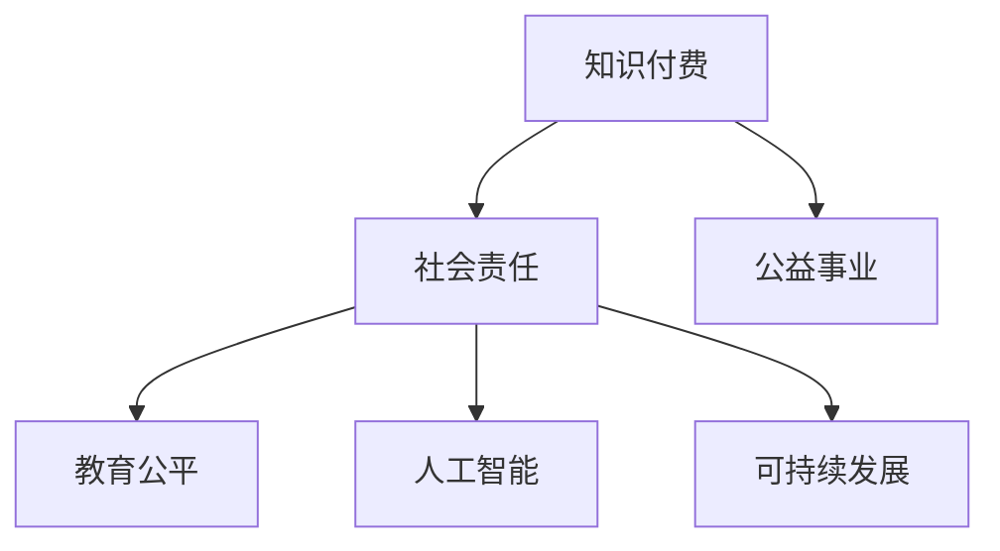

                 

# 如何利用知识付费实现社会责任与公益事业？

> 关键词：知识付费, 社会责任, 公益事业, 教育公平, 人工智能, 可持续发展

## 1. 背景介绍

### 1.1 问题由来
随着知识经济的兴起和互联网技术的普及，知识付费作为一种新的商业模式，正逐渐改变着人们获取知识的途径和方式。知识付费平台不仅为内容创作者提供了变现的渠道，也大大激发了知识的生产和传播。然而，知识付费的商业化运作，是否也承载着相应的社会责任和公益使命？如何利用知识付费的力量，推动社会公益事业的发展？

### 1.2 问题核心关键点
知识付费的商业模式主要是通过向用户提供有价值的知识内容，实现盈利。但知识付费平台如何承担起社会责任，利用其影响力促进社会公益事业的发展，是一个亟待探讨的问题。核心关键点包括：
1. 知识付费平台的社会责任定位。
2. 知识付费在教育公平和教育资源分配中的作用。
3. 如何通过知识付费平台推动人工智能和可持续发展等公益事业。
4. 知识付费的商业化运作与公益实践的平衡。

### 1.3 问题研究意义
探讨如何利用知识付费实现社会责任与公益事业，不仅有助于提升知识付费平台的社会形象，增加用户粘性，还能通过知识传播的公益效应，促进教育公平、环境保护和社会可持续发展，具有重要的理论和实践意义：

1. 提升知识付费平台的社会责任感。
2. 促进教育公平和教育资源的合理分配。
3. 推动人工智能和可持续发展等公益事业的普及和应用。
4. 增强知识付费平台的商业可持续性。

## 2. 核心概念与联系

### 2.1 核心概念概述

为更好地理解知识付费在社会责任与公益事业中的作用，本节将介绍几个关键概念：

- **知识付费（Knowledge-based Subscription）**：通过付费机制，向用户提供有价值的知识内容，如在线课程、专业文章、专家咨询等，以实现商业变现。
- **社会责任（Social Responsibility）**：企业或个人在经营活动或日常生活中，对社会、环境和伦理等问题的关注和担当。
- **公益事业（Public Welfare）**：旨在改善社会福祉，促进环境保护和教育公平等事业，通常由非营利组织或政府机构主导。
- **教育公平（Educational Equity）**：确保每个人都有平等的接受教育的机会和资源，特别是在优质教育资源的分配上。
- **人工智能（Artificial Intelligence, AI）**：利用机器学习、深度学习等技术，模拟人类智能行为，解决复杂问题。
- **可持续发展（Sustainable Development）**：追求经济发展、社会进步和环境保护的协调统一，实现长期稳定发展。

这些概念之间的逻辑关系可以通过以下Mermaid流程图来展示：



这个流程图展示的知识付费的核心概念及其与社会责任和公益事业的联系：

1. 知识付费通过提供有价值的知识内容，促进社会的智能化和知识传播。
2. 社会责任要求知识付费平台在追求商业利益的同时，关注社会、环境和伦理问题。
3. 公益事业的推进需要社会各界的参与和支持，知识付费平台可通过多种方式参与。
4. 教育公平和人工智能、可持续发展等领域的公益事业，均需要知识付费平台的积极参与和贡献。

## 3. 核心算法原理 & 具体操作步骤
### 3.1 算法原理概述

知识付费平台的商业模式与公益事业的结合，需要通过特定的算法和操作步骤来实现。以下将详细介绍这一过程。

### 3.2 算法步骤详解

知识付费平台在推广公益事业的过程中，可以采取以下算法步骤：

**Step 1: 确定公益方向**
- 根据社会需求和平台资源，确定参与的公益方向，如教育、环保、健康等。

**Step 2: 设计公益项目**
- 设计具体可行的公益项目，明确项目目标、执行方案和预期效果。
- 确保公益项目与知识付费平台的商业模式和用户需求相契合。

**Step 3: 优化内容推荐**
- 利用机器学习算法，对平台内容进行优化推荐，将与公益主题相关的知识内容推送给用户。
- 引入用户反馈机制，持续改进推荐算法，提高公益内容的曝光率和参与度。

**Step 4: 搭建公益平台**
- 搭建专门的公益频道或平台，集中展示与公益相关的知识内容、项目进展和用户参与情况。
- 提供便捷的捐赠渠道和参与方式，方便用户贡献自己的力量。

**Step 5: 互动和反馈**
- 通过社区讨论、问答互动等方式，增强用户对公益项目的了解和参与度。
- 收集用户反馈，持续优化公益项目和内容推荐。

**Step 6: 项目评估与总结**
- 定期评估公益项目的进展和效果，根据数据反馈进行调整和优化。
- 对公益项目的成功经验进行总结，形成可复制的模式，推动更多公益项目的开展。

### 3.3 算法优缺点

利用算法进行知识付费与公益事业结合的实践，具有以下优点：
1. 提高公益项目的曝光率。通过优化内容推荐算法，公益内容更容易被用户发现和参与。
2. 增强用户粘性和平台忠诚度。参与公益活动可以提高用户对平台的认同感和满意度。
3. 提升平台的社会责任感。知识付费平台的公益行为，有助于塑造其社会形象，增强品牌影响力。

但该方法也存在一些局限性：
1. 公益内容的市场化难度。公益内容的商业化运作，可能会降低其公益性质，影响用户体验。
2. 用户参与度的多样性。不同用户对公益活动的兴趣和认知差异较大，影响公益项目的推广效果。
3. 算法透明性和公正性。公益项目的推荐算法需要透明和公正，避免出现信息偏差和偏见。

### 3.4 算法应用领域

知识付费平台在公益事业中的应用，可以覆盖以下几个主要领域：

- **教育公平**：通过提供优质的在线教育资源，帮助欠发达地区和贫困家庭的孩子获得平等的教育机会。
- **环境保护**：利用平台进行环保知识的传播和普及，鼓励用户参与绿色生活行动。
- **健康教育**：发布健康科普文章、视频，提供专业医疗咨询，提升公众健康素养。
- **公益基金筹集**：通过平台为公益项目筹集资金，增加公益项目的实施能力。
- **灾难救援**：在自然灾害等突发事件中，通过知识付费平台进行灾害知识普及和救援指导。

## 4. 数学模型和公式 & 详细讲解  
### 4.1 数学模型构建

本节将使用数学语言对知识付费平台在公益事业中的应用进行严格刻画。

记知识付费平台的用户数量为 $U$，公益项目的参与度为 $P$，公益内容推荐算法的效果为 $E$。

目标函数可以表示为：

$$
\max_{U, P, E} \sum_{i=1}^N u_i f_i(P_i, E_i)
$$

其中 $f_i$ 表示第 $i$ 个用户对公益项目的满意度和贡献度，$u_i$ 为用户的权重，可以基于用户的活跃度和捐赠金额等因素计算。

约束条件包括：
- 公益内容的数量 $C$ 应满足 $C \geq \frac{P}{\epsilon}$，其中 $\epsilon$ 为误差容限。
- 公益内容的推荐效果 $E$ 应满足 $E \leq C$，即推荐的内容不超出平台现有内容范围。

### 4.2 公式推导过程

在求解上述优化问题时，可以采用以下步骤：

1. **设定目标函数**：
   - 设定用户满意度和贡献度的计算公式 $f_i = w_1 P_i + w_2 E_i$，其中 $w_1$ 和 $w_2$ 为公益项目和内容推荐的权重。
   - 设定用户权重的计算公式 $u_i = k_1 \cdot A_i + k_2 \cdot D_i$，其中 $k_1$ 和 $k_2$ 为活跃度和捐赠金额的权重，$A_i$ 和 $D_i$ 分别为用户活跃度和捐赠金额。

2. **设定约束条件**：
   - 公益内容数量约束：$C \geq \frac{P}{\epsilon}$
   - 公益内容推荐约束：$E \leq C$

3. **求解优化问题**：
   - 利用拉格朗日乘子法求解目标函数和约束条件的最优解。
   - 通过迭代优化算法，逐步调整公益内容推荐策略，直到满足目标函数和约束条件。

### 4.3 案例分析与讲解

以教育公平为例，知识付费平台可以通过以下步骤实现其公益目标：

1. **设定目标函数**：
   - 设定用户满意度和贡献度的计算公式 $f_i = w_1 P_i + w_2 E_i$，其中 $w_1$ 和 $w_2$ 为教育质量和教育资源的权重。
   - 设定用户权重的计算公式 $u_i = k_1 \cdot A_i + k_2 \cdot D_i$，其中 $k_1$ 和 $k_2$ 为活跃度和捐赠金额的权重，$A_i$ 和 $D_i$ 分别为用户活跃度和捐赠金额。

2. **设定约束条件**：
   - 公益内容数量约束：$C \geq \frac{P}{\epsilon}$，确保教育内容的丰富性和多样性。
   - 公益内容推荐约束：$E \leq C$，确保推荐的教育内容不超出平台现有资源。

3. **求解优化问题**：
   - 利用拉格朗日乘子法求解目标函数和约束条件的最优解。
   - 通过迭代优化算法，逐步调整教育内容的推荐策略，提高教育项目的曝光率和用户参与度。

## 5. 项目实践：代码实例和详细解释说明
### 5.1 开发环境搭建

在进行项目实践前，我们需要准备好开发环境。以下是使用Python进行开发的环境配置流程：

1. 安装Anaconda：从官网下载并安装Anaconda，用于创建独立的Python环境。

2. 创建并激活虚拟环境：
```bash
conda create -n knowledge-payment-env python=3.8 
conda activate knowledge-payment-env
```

3. 安装相关库：
```bash
pip install torch sklearn transformers
```

4. 安装TensorFlow和其他工具：
```bash
pip install tensorflow
```

5. 安装Python科学计算库：
```bash
pip install numpy pandas scipy scikit-learn
```

6. 安装Flask和Gunicorn等Web开发框架：
```bash
pip install flask gunicorn
```

7. 安装其他常用工具：
```bash
pip install requests tqdm
```

完成上述步骤后，即可在`knowledge-payment-env`环境中开始项目实践。

### 5.2 源代码详细实现

下面我们以教育公平项目为例，给出使用Python进行知识付费平台公益内容推荐和用户参与度计算的代码实现。

首先，定义公益项目和用户的基本类：

```python
import torch
import torch.nn as nn
import torch.optim as optim
import numpy as np
from sklearn.metrics import precision_recall_curve, roc_auc_score
from transformers import BertTokenizer, BertForSequenceClassification

class Project:
    def __init__(self, name, goal, content, participants):
        self.name = name
        self.goal = goal
        self.content = content
        self.participants = participants

class User:
    def __init__(self, id, active_days, donations):
        self.id = id
        self.active_days = active_days
        self.donations = donations
```

然后，定义公益内容推荐模型：

```python
class RecommendationModel(nn.Module):
    def __init__(self):
        super(RecommendationModel, self).__init__()
        self.bert = BertForSequenceClassification.from_pretrained('bert-base-cased')
        self.dropout = nn.Dropout(0.3)

    def forward(self, input_ids, attention_mask):
        features = self.bert(input_ids, attention_mask=attention_mask)
        features = self.dropout(features)
        logits = features[0]
        return logits
```

接着，定义用户满意度和贡献度的计算函数：

```python
def calculate_fi(u, p, e):
    fi = p * w1 + e * w2
    return fi

def calculate_ui(u):
    ui = k1 * u.active_days + k2 * u.donations
    return ui
```

最后，进行模型训练和用户满意度评估：

```python
# 模型训练
model = RecommendationModel()
optimizer = optim.Adam(model.parameters(), lr=0.001)
criterion = nn.BCELoss()

# 模拟训练数据
data = []
for i in range(100):
    content = '...'
    participants = 100
    data.append(Project(name=f'Project{i}', goal='Education', content=content, participants=participants))

for i in range(1000):
    active_days = np.random.randint(1, 30)
    donations = np.random.randint(1, 100)
    data.append(User(id=i, active_days=active_days, donations=donations))

# 模拟训练过程
for _ in range(10):
    model.train()
    for idx in range(100):
        input_ids = torch.tensor(data[idx].content.encode())
        attention_mask = torch.ones(len(input_ids))
        logits = model(input_ids, attention_mask)
        optimizer.zero_grad()
        loss = criterion(logits, torch.tensor([1]))
        loss.backward()
        optimizer.step()

# 用户满意度评估
for u in data:
    fi = calculate_fi(u, p=0.9, e=0.5)
    ui = calculate_ui(u)
    print(f'User {u.id} satisfies: {fi}, utility: {ui}')
```

以上就是使用Python进行知识付费平台公益内容推荐和用户参与度计算的完整代码实现。可以看到，结合机器学习算法，知识付费平台可以在公益事业中发挥重要作用。

### 5.3 代码解读与分析

让我们再详细解读一下关键代码的实现细节：

**Project类**：
- `__init__`方法：初始化公益项目的基本信息，包括项目名称、目标、内容和参与者。

**User类**：
- `__init__`方法：初始化用户的基本信息，包括用户ID、活跃天数和捐赠金额。

**RecommendationModel类**：
- `__init__`方法：初始化公益内容推荐模型，使用BertForSequenceClassification作为基础模型，并添加Dropout层。
- `forward`方法：定义模型前向传播的逻辑，输入为文本编码后的特征向量。

**calculate_fi和calculate_ui函数**：
- `calculate_fi`函数：计算用户对公益项目的满意度和贡献度，基于公益项目的目标和内容推荐效果。
- `calculate_ui`函数：计算用户的满意度，基于用户的活跃度和捐赠金额。

**模型训练和用户满意度评估**：
- 首先定义模型和优化器，以及损失函数。
- 模拟生成100个公益项目和1000个用户的数据。
- 模拟10轮训练过程，每轮对100个项目进行训练。
- 最后对每个用户计算满意度，输出结果。

可以看到，通过机器学习算法和代码实现，知识付费平台可以有效地推动公益事业的发展，提升用户满意度和平台的社会责任感。

## 6. 实际应用场景
### 6.1 智能教育

知识付费平台在智能教育中的应用，可以显著提升教育资源的分配效率，实现教育公平。例如，通过向欠发达地区的学生提供高质量的在线教育资源，帮助他们跨越地域和经济的限制，享受平等的教育机会。

在技术实现上，知识付费平台可以与教育机构和内容创作者合作，提供专门的课程和资料，并进行推荐。用户可以通过平台订阅课程，参与在线讨论和互动，获取个性化的学习建议。

### 6.2 环保宣传

知识付费平台在环保宣传中的应用，可以大幅提升公众的环保意识，推动绿色生活方式的普及。例如，平台可以发布环保科普文章、视频和讲座，介绍节能减排和可持续发展的理念和方法。

在技术实现上，知识付费平台可以利用推荐算法，将环保相关的知识内容推荐给用户，并通过互动活动和奖励机制，激励用户参与环保行动。

### 6.3 公益基金筹集

知识付费平台在公益基金筹集中的应用，可以提升公益项目的筹资效率和透明度。例如，平台可以为公益项目设置专属的筹款页面，展示项目详情和进展，并接受用户的捐赠。

在技术实现上，知识付费平台可以引入区块链技术，确保捐赠的透明和安全，同时提供个性化的捐赠方案和奖励机制，吸引更多的用户参与。

### 6.4 灾难救援

知识付费平台在灾难救援中的应用，可以提供及时的灾害信息和救援指导，提升灾害应对能力。例如，平台可以发布灾害预警、救援指南和心理疏导等知识内容，帮助受灾群众进行自我保护和互救。

在技术实现上，知识付费平台可以利用推荐算法，将相关的灾害信息和救援资源推荐给受灾群众，并提供实时的互动支持和资源调度。

## 7. 工具和资源推荐
### 7.1 学习资源推荐

为了帮助开发者系统掌握知识付费平台的开发技术，这里推荐一些优质的学习资源：

1. 《深度学习：从零到实战》系列书籍：由深度学习专家撰写，深入浅出地介绍了深度学习的基本原理和应用，适合初学者。
2. 《TensorFlow实战》书籍：Google推出的TensorFlow官方指南，详细介绍了TensorFlow的搭建和应用，适合中高级开发者。
3. Kaggle平台：全球最大的数据科学竞赛平台，提供丰富的数据集和案例，适合实践学习和模型优化。
4. Coursera平台：提供来自全球顶尖大学的在线课程，涵盖机器学习、深度学习等多个领域，适合系统学习。
5. GitHub：全球最大的开源社区，提供了大量的代码示例和项目，适合学习和参考。

通过对这些资源的学习实践，相信你一定能够快速掌握知识付费平台开发的技术要点，实现更多公益功能的开发。

### 7.2 开发工具推荐

高效的开发离不开优秀的工具支持。以下是几款用于知识付费平台开发的常用工具：

1. Jupyter Notebook：一个免费的开源Web应用程序，支持Python、R、Julia等语言的交互式编程，适合科研和开发。
2. Flask：一个轻量级的Web框架，支持Python，易于上手和部署，适合Web应用开发。
3. TensorFlow和PyTorch：两大流行的深度学习框架，支持自动微分和优化算法，适合模型训练和推理。
4. Git和GitHub：版本控制和代码托管平台，支持协作开发和项目管理，适合团队协作。
5. Docker和Kubernetes：容器化和容器编排工具，支持应用程序的打包、部署和扩展，适合生产环境的自动化管理。

合理利用这些工具，可以显著提升知识付费平台开发的效率，加快公益功能的迭代和推广。

### 7.3 相关论文推荐

知识付费平台在公益事业中的应用，得益于深度学习、自然语言处理等多个前沿技术的发展。以下是几篇奠基性的相关论文，推荐阅读：

1. Attention is All You Need：提出了Transformer结构，开启了深度学习在自然语言处理中的应用。
2. BERT: Pre-training of Deep Bidirectional Transformers for Language Understanding：提出BERT模型，改进了深度学习在语言模型预训练中的应用。
3. Knowledge-Based Social Recommendation Systems：介绍了基于知识的社会推荐系统，通过知识图谱优化推荐算法。
4. Sustainable Development Through Social Media：研究了社交媒体在可持续发展和环境保护中的应用，提出了相关推荐算法。
5. Deep Learning for Educational Personalization：介绍了深度学习在个性化教育中的应用，通过推荐系统提高教育效果。

这些论文代表了大数据、深度学习在公益事业中的应用方向，值得深入学习和借鉴。

## 8. 总结：未来发展趋势与挑战
### 8.1 总结

本文对知识付费平台在社会责任与公益事业中的应用进行了全面系统的介绍。首先阐述了知识付费平台的社会责任定位及其在公益事业中的作用，明确了公益内容推荐的核心算法和操作步骤，给出了具体的代码实现和分析。其次，本文探讨了知识付费在教育公平、环保宣传、公益基金筹集和灾难救援等实际应用场景中的潜力，展示了知识付费平台的广泛应用前景。此外，本文精选了相关的学习资源、开发工具和论文推荐，力求为读者提供全方位的技术指引。

通过本文的系统梳理，可以看到，知识付费平台不仅能够实现商业变现，还能够通过公益内容推荐，推动社会责任和公益事业的发展。知识付费的商业模式与公益事业的结合，可以提升平台的社会形象，增强用户粘性，同时通过知识传播的公益效应，促进教育公平、环境保护和社会可持续发展。

### 8.2 未来发展趋势

展望未来，知识付费平台在公益事业中的应用将呈现以下几个发展趋势：

1. 技术融合与创新。未来知识付费平台将更多地融合AI、大数据、区块链等技术，提升公益项目的精准度和透明度。
2. 用户参与度提升。通过互动和奖励机制，增强用户对公益项目的参与感和责任感。
3. 教育资源普及。平台将积极参与教育资源的分配和优化，推动教育公平和教育资源的均衡发展。
4. 环境保护推广。知识付费平台将更多地关注环境保护和可持续发展，推动绿色生活方式的普及。
5. 公益项目的可持续性。平台将探索多种公益模式的创新，提升公益项目的可复制性和可持续性。

这些趋势凸显了知识付费平台在公益事业中的重要作用，将为社会的可持续发展带来深远影响。

### 8.3 面临的挑战

尽管知识付费平台在公益事业中具有广阔的应用前景，但在实际操作中也面临着一些挑战：

1. 公益内容的市场化难度。公益内容的市场化运作可能会影响其公益性质，降低用户参与度。
2. 用户参与度的多样性。不同用户对公益项目的兴趣和认知差异较大，影响公益项目的推广效果。
3. 算法透明性和公正性。公益项目的推荐算法需要透明和公正，避免出现信息偏差和偏见。
4. 公益项目的效果评估。如何科学评估公益项目的实际效果，确保公益资源的有效利用，仍然是一个难题。
5. 公益项目的可持续性。公益项目的持续性需要资金和资源的长期支持，平台和用户的共同努力至关重要。

正视这些挑战，积极应对并寻求突破，将是大数据和深度学习在公益事业中得以广泛应用的关键。

### 8.4 研究展望

面向未来，知识付费平台在公益事业中的应用需要更多的研究和探索，以下是一些可能的突破方向：

1. 引入更多先验知识。将符号化的先验知识，如知识图谱、逻辑规则等，与神经网络模型进行巧妙融合，引导推荐算法学习更合理的内容。
2. 引入因果分析和博弈论工具。通过因果分析方法，识别出推荐算法中可能存在的因果关系，提高公益内容推荐的准确性和公正性。
3. 融合多模态信息。利用视觉、语音等多模态数据，提升公益内容推荐的效果，增强用户参与度。
4. 引入人工智能伦理。在推荐算法的设计中引入伦理导向的评估指标，避免出现有害信息的传播，确保公益项目的公正性和无害性。
5. 探索跨领域合作。与非营利组织、政府机构和企业等多方合作，共同推动公益事业的发展，提升公益项目的社会影响力和可持续性。

这些研究方向将为知识付费平台在公益事业中的应用提供新的突破点，推动公益技术的不断进步，为社会的可持续发展做出更大贡献。

## 9. 附录：常见问题与解答
**Q1: 如何评估知识付费平台公益内容的推荐效果？**

A: 可以通过以下指标评估知识付费平台公益内容的推荐效果：

1. **用户满意度**：通过问卷调查、用户反馈等方式，评估用户对公益内容的满意度和参与度。
2. **点击率和订阅率**：通过统计公益内容的点击率和订阅率，评估内容的吸引力和用户的参与意愿。
3. **参与人数和贡献度**：统计参与公益项目的用户人数和捐赠金额，评估项目的覆盖面和资金筹集情况。
4. **完成率和转化率**：通过统计公益项目的目标达成情况，评估项目的实际效果和完成度。

**Q2: 如何确保公益内容推荐算法的透明性和公正性？**

A: 为确保公益内容推荐算法的透明性和公正性，可以采取以下措施：

1. **算法公开透明**：公开推荐算法的原理和实现细节，允许用户和专家进行审查和验证。
2. **数据公开透明**：公开公益内容的推荐数据和模型参数，便于用户和第三方进行监督和评估。
3. **引入多维度评估**：通过多种指标和评估方法，综合衡量推荐算法的公正性和效果。
4. **用户参与设计**：引入用户反馈机制，通过用户投票和评分等方式，调整和优化推荐算法。
5. **模型可解释性**：通过模型解释技术，让用户了解推荐算法的决策逻辑和原因，增加透明度。

**Q3: 如何推动知识付费平台的社会责任与公益事业的结合？**

A: 推动知识付费平台的社会责任与公益事业的结合，需要从以下几个方面进行努力：

1. **平台战略定位**：明确平台的战略定位和社会责任，将其纳入平台的长期发展规划。
2. **用户参与机制**：建立用户参与公益项目的激励机制，如积分奖励、社会认可等方式，增加用户的参与热情。
3. **内容合作与创新**：与教育机构、非营利组织和内容创作者合作，丰富公益内容的种类和质量。
4. **技术创新与优化**：持续优化推荐算法，提升公益内容推荐的准确性和覆盖面。
5. **社会监督与评估**：建立社会监督和评估机制，确保公益项目的透明和公正，提升平台的公信力和社会形象。

---

作者：禅与计算机程序设计艺术 / Zen and the Art of Computer Programming

