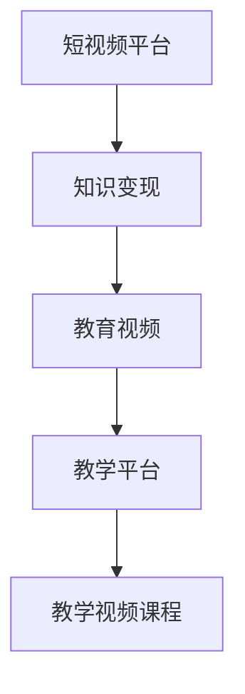

                 

## 1. 背景介绍

在互联网时代，知识付费成为了一个热门话题。随着智能手机和移动互联网的普及，人们获取信息的方式也在不断变化。短视频平台因其短小精悍、内容丰富的特点，迅速成为人们获取新知的重要渠道。程序员作为技术岗位中的重要角色，在获取新技能和新知识的过程中，自然也不应错过这股信息浪潮。而短视频平台作为一个热门平台，成为了程序员学习新技能、提升专业能力的理想场所。

短视频平台不仅提供了海量的教育内容，还拥有许多具有强大影响力的网红讲师，他们通过制作优质的教学视频，帮助人们学习新技能、理解新技术，极大地丰富了程序员的学习渠道。但是，短视频平台的内容质量参差不齐，有时候难以满足特定需求的程序员的学习需求。这时，自制的教育内容就显得尤为重要。

本文将详细探讨如何利用短视频平台卖课，帮助程序员通过教学视频实现知识变现，并分享在制作和销售过程中的一些经验和建议。

## 2. 核心概念与联系

### 2.1 核心概念概述

在本文中，我们将介绍以下几个核心概念：

- **短视频平台**：指的是如抖音、快手、B站等以视频为主要内容形式的平台，通过短视频或直播的方式向用户提供内容。
- **知识变现**：指的是将知识或技能通过产品或服务的形式进行商业化，实现价值转换。
- **教育视频**：指的是针对某一特定主题或技能，通过视频形式进行讲解、演示的教学视频。
- **教学平台**：指的是教育视频的制作、发布、运营平台，包括短视频平台、专业的教学平台等。
- **教学视频课程**：指的是针对某一主题或技能，制作的一系列教育视频，具有系统性和连贯性。

### 2.2 核心概念原理和架构的 Mermaid 流程图



这个流程图展示了知识变现与教育视频之间的关系，以及它们如何通过教学平台和短视频平台进行实施。

## 3. 核心算法原理 & 具体操作步骤

### 3.1 算法原理概述

在教育视频课程的开发和销售过程中，我们可以借鉴许多算法和原则来提高视频质量和用户体验，同时确保课程内容和质量的稳定性。以下是一些核心算法和操作步骤：

1. **内容质量评估算法**：用于评估教育视频内容的质量和用户满意度，通过对视频内容、用户反馈和行为数据进行分析，找出哪些视频效果更好，哪些需要改进。

2. **个性化推荐算法**：根据用户的兴趣和行为数据，为不同用户推荐不同的教育视频课程，提升用户体验，增加用户粘性。

3. **多模态学习算法**：结合文字、音频和视频等多种形式的媒体数据，提高用户对视频内容的理解和记忆，增强教育效果。

4. **智能剪辑算法**：通过自动化技术，对视频进行剪辑和优化，提高视频制作效率和用户观感。

5. **视频优化算法**：针对不同设备和网络环境，对视频进行优化，确保在各种条件下都能流畅播放。

### 3.2 算法步骤详解

1. **选题和规划**：
   - **选题**：选择热门技能或新技术，确保课程内容有市场。
   - **规划**：制定课程大纲，划分章节，确定每节课的核心内容和目标。

2. **内容制作**：
   - **剧本撰写**：根据课程大纲，撰写详细的剧本，确保课程内容系统性和连贯性。
   - **录制视频**：使用专业设备录制视频，确保视频质量。
   - **后期编辑**：使用剪辑软件对视频进行剪辑、优化和发布。

3. **内容发布**：
   - **平台选择**：选择适合的短视频平台，确保平台用户活跃度高。
   - **视频上传**：上传视频，并进行预热推广。
   - **互动互动**：与观众进行互动，解答问题，收集反馈，优化内容。

4. **课程销售**：
   - **课程定价**：根据课程难度、时长和内容质量，制定合理的课程价格。
   - **平台合作**：与平台进行合作，通过平台的用户推荐和奖励机制，提升课程曝光度。
   - **课程推广**：通过社交媒体、个人博客等渠道进行课程推广。

5. **课程评价与优化**：
   - **用户反馈**：收集用户的反馈，了解课程的优点和不足。
   - **课程优化**：根据用户反馈，优化课程内容和结构，提升课程质量。

### 3.3 算法优缺点

#### 优点：

- **门槛低**：相较于传统线下培训，视频课程制作门槛较低，技术门槛低，可以更快上手。
- **内容可反复观看**：视频课程可以反复观看，不受时间和地点限制，方便学习。
- **互动性强**：通过视频和直播等形式，可以与讲师进行互动，提升学习效果。
- **传播范围广**：短视频平台用户基数大，课程传播范围广，受众广泛。

#### 缺点：

- **难以深度交流**：相比于线下培训，视频课程缺乏面对面的交流互动，难以进行深度讨论。
- **视频制作成本高**：需要专业设备和软件，初期投入成本高。
- **效果依赖讲师**：课程效果依赖讲师的讲解水平和互动效果，对讲师的要求高。

### 3.4 算法应用领域

教育视频课程在以下领域有着广泛的应用：

- **编程语言**：如Python、Java、C++等编程语言的高级课程。
- **前端开发**：如React、Vue、Angular等前端框架的开发。
- **后端开发**：如Node.js、Django、Flask等后端框架的开发。
- **数据分析**：如SQL、Python数据分析等。
- **人工智能**：如机器学习、深度学习、自然语言处理等。

## 4. 数学模型和公式 & 详细讲解 & 举例说明

### 4.1 数学模型构建

假设课程总时长为 $T$，共分为 $n$ 节课，每节课时长为 $t_i$，课程价格为 $P$。课程的总观看次数为 $V$，每节课的观看次数为 $v_i$。

### 4.2 公式推导过程

**总观看次数的计算公式**：

$$
V = \sum_{i=1}^n v_i
$$

**平均每节课观看次数**：

$$
\bar{v} = \frac{V}{n}
$$

**每节课的收益**：

$$
\text{Revenue}_i = v_i \cdot P
$$

**总收益**：

$$
R = \sum_{i=1}^n \text{Revenue}_i = \sum_{i=1}^n v_i \cdot P
$$

### 4.3 案例分析与讲解

以一个简单的Python编程课程为例，课程共分为10节，每节课时长约为1小时，总时长为10小时，课程价格为999元。假设课程上线后，观看次数为1000次。

- **平均每节课观看次数**：

$$
\bar{v} = \frac{1000}{10} = 100
$$

- **每节课的收益**：

$$
\text{Revenue}_i = 100 \cdot 999 = 99900
$$

- **总收益**：

$$
R = 10 \cdot 99900 = 999000
$$

## 5. 项目实践：代码实例和详细解释说明

### 5.1 开发环境搭建

在进行教育视频课程的制作和销售时，我们需要搭建一个专业的开发环境。以下是具体的搭建流程：

1. **选择开发环境**：可以选择本地搭建，或者使用云平台如AWS、阿里云、腾讯云等。
2. **安装开发工具**：如Visual Studio Code、Sublime Text等，以及相应的插件和扩展。
3. **安装视频编辑软件**：如Adobe Premiere Pro、Final Cut Pro等，以及相应的模板和预设。
4. **安装视频录制设备**：如摄像头、麦克风、三脚架等，确保录制效果。
5. **配置网络连接**：确保网络连接稳定，支持大规模视频播放。

### 5.2 源代码详细实现

以下是一个简单的Python课程脚本示例，用于演示视频课程的制作过程。

```python
import videoio
import videoio_core
import videoio_processing
import videoio_discovery
import videoio_util

def main():
    # 创建视频流对象
    cap = videoio_util.VideoIO()

    # 打开视频流
    cap.open("path/to/video")

    # 设置视频参数
    cap.set(prop='width', value=1280)
    cap.set(prop='height', value=720)
    cap.set(prop='fps', value=30)

    # 读取视频帧
    while cap.isOpened():
        ret, frame = cap.read()

        # 如果读取成功，则显示视频帧
        if ret:
            videoio_processing.display(frame)
        else:
            break

    # 关闭视频流
    cap.release()

if __name__ == '__main__':
    main()
```

### 5.3 代码解读与分析

**视频流对象创建**：

```python
cap = videoio_util.VideoIO()
```

**视频流打开**：

```python
cap.open("path/to/video")
```

**视频流参数设置**：

```python
cap.set(prop='width', value=1280)
cap.set(prop='height', value=720)
cap.set(prop='fps', value=30)
```

**视频流读取和显示**：

```python
while cap.isOpened():
    ret, frame = cap.read()
    if ret:
        videoio_processing.display(frame)
    else:
        break
```

**视频流关闭**：

```python
cap.release()
```

### 5.4 运行结果展示

该示例代码运行后，会打开视频流，读取并显示视频帧，直到视频播放结束。

## 6. 实际应用场景

### 6.1 智能教育

在智能教育领域，教育视频课程有着广泛的应用。通过视频课程，学生可以随时随地学习，不受时间和地点限制。教师可以通过视频课程进行互动和讲解，提升学生的学习效果。

### 6.2 远程办公

在远程办公领域，教育视频课程可以用于培训新员工、提升工作效率。通过视频课程，员工可以学习新技术、新工具，提升专业能力，实现自我增值。

### 6.3 在线招聘

在在线招聘领域，教育视频课程可以用于应聘者技能评估和提升。通过视频课程，应聘者可以学习相关技能，提升自身竞争力，更好地准备面试。

### 6.4 未来应用展望

未来，教育视频课程将迎来更多的应用场景：

- **游戏开发**：通过视频课程学习游戏开发技能，提升游戏设计、开发和运营能力。
- **健康医疗**：通过视频课程学习健康知识，提升自身健康水平。
- **烹饪美食**：通过视频课程学习烹饪技能，提升烹饪水平。

## 7. 工具和资源推荐

### 7.1 学习资源推荐

- **Coursera**：提供各类在线课程，包括编程语言、数据分析、人工智能等。
- **Udacity**：提供编程、数据科学、人工智能等领域的纳米学位课程。
- **edX**：提供各类在线课程和证书，涵盖多个领域。
- **Khan Academy**：提供免费的教育视频和练习题，帮助学生学习新知识。

### 7.2 开发工具推荐

- **Adobe Premiere Pro**：专业的视频编辑软件，支持多平台操作。
- **Final Cut Pro**：苹果公司推出的视频编辑软件，适合Mac平台。
- **HandBrake**：免费的视频编辑和转换软件，支持多种格式。
- **VideoLAN**：免费的视频编辑软件，支持多种平台。

### 7.3 相关论文推荐

- **Learning from Video-lectures in Deep Learning for Natural Language Processing**：探讨视频课程对深度学习模型性能的影响。
- **A Survey on Video Lecture-Based Learning**：总结视频课程在教育中的作用和效果。
- **A Comparative Study of Video Lecture in Online Learning**：比较不同视频课程的效果和用户满意度。

## 8. 总结：未来发展趋势与挑战

### 8.1 研究成果总结

本文详细探讨了如何利用短视频平台卖课，帮助程序员通过教学视频实现知识变现。我们介绍了视频课程制作和销售的全流程，包括选题、内容制作、平台选择、销售推广、用户反馈与优化等环节，并分析了视频课程的优点和缺点。

### 8.2 未来发展趋势

未来，教育视频课程将呈现以下发展趋势：

- **交互性增强**：通过增强现实、虚拟现实等技术，提升用户与视频课程的互动性。
- **个性化推荐**：通过大数据和机器学习技术，为每个用户推荐个性化的课程内容。
- **视频内容优化**：通过智能剪辑和优化算法，提高视频内容的可理解性和吸引力。
- **多样化内容形式**：结合文本、图像、音频等多种形式，提升课程内容的丰富性和表现力。
- **全球化普及**：通过多语言字幕和翻译，让视频课程在全球范围内传播和普及。

### 8.3 面临的挑战

尽管教育视频课程有着广阔的应用前景，但在其实施过程中也面临着许多挑战：

- **内容制作成本高**：视频课程制作需要专业设备和软件，初期投入成本高。
- **课程质量不稳定**：讲师的讲解水平和互动效果对课程质量影响大。
- **用户互动效果差**：相比于线下培训，视频课程缺乏面对面的交流互动，难以进行深度讨论。
- **平台竞争激烈**：短视频平台和在线教育平台众多，竞争激烈，需要找到差异化的定位和竞争力。

### 8.4 研究展望

未来，教育视频课程的研究方向包括：

- **内容质量评估算法**：提高课程内容的评估和优化能力，提升课程质量。
- **个性化推荐算法**：提升个性化推荐能力，提高用户满意度和转化率。
- **多模态学习算法**：结合多种形式的内容形式，提升用户对视频内容的理解和记忆。
- **智能剪辑算法**：提高视频制作效率和用户观感，降低制作成本。
- **视频优化算法**：针对不同设备和网络环境，优化视频内容，提升用户体验。

## 9. 附录：常见问题与解答

**Q1：制作教育视频课程有哪些技术要求？**

A: 制作教育视频课程需要以下技术要求：

- **视频录制设备**：如高清摄像机、专业麦克风等，确保视频和音频质量。
- **视频编辑软件**：如Adobe Premiere Pro、Final Cut Pro等，进行视频剪辑、优化和发布。
- **视频流传输技术**：如视频编解码技术、网络传输协议等，确保视频在网络中流畅传输。
- **互动工具**：如直播平台、社交媒体等，增强与观众的互动效果。

**Q2：如何选择适合的短视频平台？**

A: 选择适合的短视频平台需要考虑以下因素：

- **平台用户规模**：选择用户活跃度高、流量大的平台。
- **平台特性**：选择适合视频课程类型的平台，如面向技术领域的B站、面向生活方式的抖音等。
- **平台合作政策**：了解平台的分成比例、推广机制等，确保利益最大化。

**Q3：如何进行用户互动和反馈收集？**

A: 进行用户互动和反馈收集需要以下步骤：

- **建立互动渠道**：通过直播平台、评论区等渠道，与观众进行互动。
- **设置反馈机制**：在视频下方设置反馈按钮，收集观众的评价和建议。
- **分析反馈数据**：对收集到的反馈数据进行统计分析，找出课程的优点和不足。
- **优化课程内容**：根据反馈数据，优化课程内容和结构，提升课程质量。

**Q4：如何进行课程推广？**

A: 进行课程推广需要以下步骤：

- **建立品牌形象**：通过视频、博客等形式，建立自己的品牌形象和知名度。
- **利用社交媒体**：通过微博、微信、知乎等社交媒体平台，进行课程推广。
- **参加行业活动**：参加技术会议、研讨会等活动，扩大课程影响力和曝光度。
- **合作推广**：与相关领域的影响力人物或机构合作，共同推广课程。

**Q5：如何提高课程观看率和用户转化率？**

A: 提高课程观看率和用户转化率需要以下策略：

- **优化课程内容**：确保课程内容系统性、连贯性，提升用户观看体验。
- **优化课程结构**：设计清晰的课程结构，帮助用户快速理解课程内容。
- **提供优质互动**：通过直播、问答等形式，增强与观众的互动效果。
- **提供奖励机制**：设置课程完成的奖励机制，鼓励用户完成课程。
- **提供售后服务**：提供课程答疑和售后支持，解决用户问题。

---

作者：禅与计算机程序设计艺术 / Zen and the Art of Computer Programming

