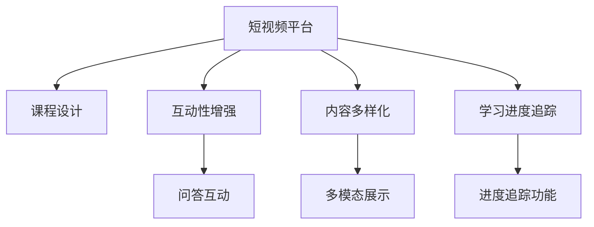

                 

# 如何利用短视频平台增加课程粘性

## 1. 背景介绍

### 1.1 问题由来

随着互联网的迅猛发展，线上教育成为了越来越多人获取知识的重要渠道。然而，传统的在线课程往往以文字、视频等静态内容为主，学习体验较为单一，难以持续吸引学员的注意力。相比之下，短视频形式因其丰富多样的内容和灵活便捷的观看方式，受到了广大网友的喜爱。

短视频平台上，学习短视频具有极强的互动性和沉浸感，使得学员能够以更自然、更快速的方式掌握知识点。然而，在内容发布上，短视频平台往往缺乏系统性、结构化、连贯性，难以构建起完整的课程体系。因此，如何利用短视频平台，既保障知识体系的完整性，又提高课程的吸引力和粘性，成为当前在线教育机构面临的重要问题。

### 1.2 问题核心关键点

在短视频平台上，如何优化课程设计和内容呈现，以提升学员的互动性、参与度和留存率？根据当前技术现状，主要应从以下几个关键点出发：

- **内容结构化**：将课程内容分为多个小节，按照逻辑顺序呈现，便于学员系统学习和回顾。
- **互动性设计**：通过问答、投票、评论等互动方式，增强学员参与感，激发学习兴趣。
- **场景模拟**：利用短视频的场景模拟功能，创造逼真的教学环境，提高学员沉浸感。
- **内容多样化**：结合图文、音频、视频等多媒体形式，丰富课程内容，满足不同学员的学习需求。
- **学习进度追踪**：通过短视频平台的学习进度追踪功能，督促学员按时学习，并及时反馈学习进度和成绩。

这些关键点共同构成了短视频平台下课程设计的基本框架，帮助在线教育机构在保障课程内容完整性的同时，提升课程的粘性和互动性。

## 2. 核心概念与联系

### 2.1 核心概念概述

为了更好地理解短视频平台下课程设计的核心概念，我们首先要介绍几个密切相关的核心概念：

- **短视频平台**：以短视频内容为载体，支持即时互动、高并发直播和结构化课程展示的互联网平台。
- **课程设计**：基于短视频平台的特性，针对特定知识点或技能进行系统化的课程规划和内容构建。
- **互动性增强**：通过多种互动方式，提高学员在学习过程中的参与度和沉浸感。
- **内容多样化**：结合文本、图像、音频、视频等多样化形式，满足不同学员的学习需求。
- **学习进度追踪**：通过短视频平台提供的学习进度和成绩追踪功能，督促学员按时完成学习任务，并及时反馈学习进度。

这些核心概念之间的逻辑关系可以通过以下Mermaid流程图来展示：



这个流程图展示了几大核心概念及其之间的逻辑关系：

1. 短视频平台是基础承载平台，支持课程设计和互动性增强。
2. 课程设计在短视频平台上，结合互动性增强和内容多样化，形成完整的课程体系。
3. 学习进度追踪作为关键功能，辅助课程设计和互动性增强，确保课程的高效完成。

## 3. 核心算法原理 & 具体操作步骤

### 3.1 算法原理概述

短视频平台下的课程设计，本质上是一种系统化的课程规划和内容构建过程。其核心算法原理可以归纳为以下几点：

- **内容拆分**：将完整课程拆分为多个小节，每个小节对应一个短视频，便于学员分段学习。
- **顺序呈现**：按照逻辑顺序，顺序播放各个小节，确保学员能够系统地掌握知识点。
- **互动设计**：在每个小节中加入互动元素，如问答、投票、评论等，增强学员的参与感。
- **场景模拟**：利用短视频的平台特性，模拟真实的学习场景，提高学员的沉浸感。
- **多样化呈现**：结合文本、图像、音频、视频等多种形式，丰富课程内容。
- **进度追踪**：利用短视频平台的学习进度追踪功能，实时监测学员的学习进度和成绩。

这些算法原理共同构成了短视频平台下课程设计的完整框架，帮助在线教育机构构建起系统化、互动性、沉浸式的在线学习体验。

### 3.2 算法步骤详解

下面详细介绍短视频平台下课程设计的具体步骤：

**Step 1: 内容拆分与逻辑规划**

1. **内容拆分**：将完整课程拆分为多个小节，每个小节包含一个短视频。确保每个短视频能够独立呈现完整的知识点，时间控制在5-10分钟为宜。
2. **逻辑规划**：按照知识点逻辑顺序，规划各个小节的播放顺序，确保学员能够系统地学习课程内容。

**Step 2: 互动元素设计**

1. **问答互动**：在每个小节开头或结尾设置问答环节，邀请学员在评论区提问或解答。
2. **投票互动**：通过短视频平台的投票功能，对某个知识点进行调查，增加学员的参与感。
3. **评论互动**：鼓励学员在评论区进行讨论和交流，形成学习社区。

**Step 3: 场景模拟与内容多样化**

1. **场景模拟**：利用短视频的平台特性，模拟真实的学习场景，如实验操作、场景演示、问题解惑等，提高学员的沉浸感。
2. **内容多样化**：结合文本、图像、音频、视频等多种形式，丰富课程内容，满足不同学员的学习需求。

**Step 4: 进度追踪与反馈**

1. **进度追踪**：利用短视频平台的学习进度追踪功能，实时监测学员的学习进度和成绩，督促学员按时完成学习任务。
2. **反馈机制**：通过及时反馈学员的学习进度和成绩，鼓励学员持续学习，并提供针对性的学习建议。

**Step 5: 发布与测试**

1. **内容发布**：将规划好的内容逐个小节发布到短视频平台，确保每个小节的互动元素、场景模拟和内容多样化均得到充分体现。
2. **测试反馈**：邀请一部分学员参与测试，收集反馈意见，不断优化课程内容和互动设计，确保课程的高效和吸引。

通过以上步骤，可以系统化地设计和发布短视频平台下的课程内容，提升课程的吸引力和粘性，有效保障学员的学习效果。

### 3.3 算法优缺点

短视频平台下的课程设计具有以下优点：

- **互动性高**：通过问答、投票、评论等多种互动方式，提高学员的参与度和学习兴趣。
- **沉浸感强**：利用短视频的平台特性，模拟真实的学习场景，提高学员的沉浸感。
- **内容丰富**：结合文本、图像、音频、视频等多种形式，满足不同学员的学习需求。
- **进度追踪**：利用短视频平台的学习进度追踪功能，实时监测学员的学习进度和成绩，督促学员按时完成学习任务。

同时，这种设计也存在一定的局限性：

- **制作成本高**：需要投入大量人力和资源进行内容制作和优化，制作成本较高。
- **内容管理复杂**：大量短视频需要统一管理和更新，内容管理相对复杂。
- **平台限制**：短视频平台的功能和特性有限，某些复杂的功能可能需要开发定制插件或二次开发。

尽管存在这些局限性，但短视频平台下的课程设计无疑是一种创新和突破，值得在线教育机构积极探索和实践。

### 3.4 算法应用领域

短视频平台下的课程设计，已经在多个领域得到了广泛应用，具体如下：

- **K12教育**：利用短视频平台，结合互动性设计和场景模拟，提高学生学习的趣味性和沉浸感，增加课堂参与度。
- **职业教育**：针对职业技能的培训课程，通过短视频平台进行分节展示，结合多样化的内容形式，提高学员的学习效果。
- **职场培训**：结合短视频平台的多媒体功能，进行场景模拟和案例演示，帮助职场人员快速掌握新技能。
- **企业培训**：利用短视频平台的互动功能，进行员工培训和知识分享，提高员工的学习动力和工作效率。

除了这些传统领域，短视频平台下的课程设计还在新零售、健康医疗、文化旅游等多个新兴领域发挥着重要作用，为不同行业带来了新的教育形式和可能性。

## 4. 数学模型和公式 & 详细讲解  
### 4.1 数学模型构建

为了更好地理解短视频平台下课程设计的数学模型，我们引入一些基础概念：

- **课程总时长**：整个课程的时间长度，通常以小时为单位。
- **每节时长**：每个小节的时间长度，通常以分钟为单位。
- **视频数量**：整个课程需要制作的视频数量。
- **学习进度**：学员完成各个小节的进度，通常以百分比表示。

我们可以使用以下数学模型来描述短视频平台下课程设计的核心逻辑：

$$
\text{课程总时长} = \sum_{i=1}^{n} \text{每节时长}
$$

其中，$n$ 为课程总节数。

通过上述模型，我们可以计算出整个课程的总时长，并根据实际需要调整各个小节的时长，确保课程结构的完整性和合理性。

### 4.2 公式推导过程

下面详细介绍短视频平台下课程设计的公式推导过程：

1. **内容拆分公式**：
   $$
   \text{内容拆分} = \frac{\text{课程总时长}}{\text{每节时长}}
   $$
   其中，$\text{内容拆分}$ 为课程总节数。

2. **逻辑规划公式**：
   $$
   \text{逻辑规划} = \text{排序算法}(\text{内容拆分})
   $$
   其中，$\text{排序算法}$ 为常用的逻辑排序算法，如插入排序、快速排序等。

3. **互动设计公式**：
   $$
   \text{互动设计} = \text{问答互动} + \text{投票互动} + \text{评论互动}
   $$
   其中，各互动元素的具体形式和设计需根据实际需求进行灵活调整。

4. **进度追踪公式**：
   $$
   \text{进度追踪} = \text{学习进度} \times 100\%
   $$
   其中，$\text{学习进度}$ 为学员完成各个小节的进度。

5. **反馈机制公式**：
   $$
   \text{反馈机制} = \text{反馈信息} + \text{学习建议}
   $$
   其中，$\text{反馈信息}$ 为学员的学习进度和成绩，$\text{学习建议}$ 为根据反馈信息生成的个性化学习建议。

通过上述公式，可以系统化地计算和描述短视频平台下课程设计的核心逻辑，确保课程设计的科学性和合理性。

### 4.3 案例分析与讲解

下面以一个具体的课程设计案例，来详细讲解短视频平台下的课程设计：

**课程：Python编程基础**

1. **内容拆分**：将课程分为20个小节，每个小节5分钟，总时长为100分钟。
2. **逻辑规划**：按照知识点逻辑顺序，分别为变量和数据类型、运算符、条件语句、循环语句、函数、文件操作、异常处理、面向对象编程、Python标准库、第三方库等各个小节设置播放顺序。
3. **互动设计**：每个小节开头设置问答环节，邀请学员在评论区提问或解答；每个小节结尾通过短视频平台的投票功能，对某个知识点进行调查；鼓励学员在评论区进行讨论和交流，形成学习社区。
4. **场景模拟与内容多样化**：结合短视频的平台特性，进行实验操作、场景演示、问题解惑等，如使用Python编写一个小游戏，展示Python的实际应用场景。
5. **进度追踪与反馈**：利用短视频平台的学习进度追踪功能，实时监测学员的学习进度和成绩，督促学员按时完成学习任务；通过及时反馈学员的学习进度和成绩，鼓励学员持续学习，并提供针对性的学习建议。

通过以上步骤，可以系统化地设计和发布Python编程基础课程，提升课程的吸引力和粘性，有效保障学员的学习效果。

## 5. 项目实践：代码实例和详细解释说明

### 5.1 开发环境搭建

在进行短视频平台下课程设计实践前，我们需要准备好开发环境。以下是使用Python进行PyTorch开发的环境配置流程：

1. 安装Anaconda：从官网下载并安装Anaconda，用于创建独立的Python环境。

2. 创建并激活虚拟环境：
```bash
conda create -n pytorch-env python=3.8 
conda activate pytorch-env
```

3. 安装PyTorch：根据CUDA版本，从官网获取对应的安装命令。例如：
```bash
conda install pytorch torchvision torchaudio cudatoolkit=11.1 -c pytorch -c conda-forge
```

4. 安装各类工具包：
```bash
pip install numpy pandas scikit-learn matplotlib tqdm jupyter notebook ipython
```

完成上述步骤后，即可在`pytorch-env`环境中开始实践。

### 5.2 源代码详细实现

下面我们以短视频平台下课程设计为例，给出使用PyTorch和Transformers库进行课程内容规划和互动设计的PyTorch代码实现。

首先，定义课程内容拆分的函数：

```python
import torch
import transformers

def content_split(total_minutes, per_minute):
    total_nodes = total_minutes // per_minute
    if total_minutes % per_minute > 0:
        total_nodes += 1
    return total_nodes

# 计算课程总节数
total_minutes = 100
per_minute = 5
total_nodes = content_split(total_minutes, per_minute)
print(f"课程总节数：{total_nodes}")
```

然后，定义课程逻辑规划的函数：

```python
def logical_planning(total_nodes):
    # 定义课程逻辑顺序
    logical_order = [
        "变量和数据类型", "运算符", "条件语句", "循环语句", "函数",
        "文件操作", "异常处理", "面向对象编程", "Python标准库", "第三方库"
    ]
    # 将逻辑顺序转换为节索引
    return [logical_order.index(topic) for topic in logical_order]

# 计算逻辑规划的节点索引
logical_index = logical_planning(total_nodes)
print(f"课程逻辑规划：{logical_index}")
```

接着，定义互动设计的函数：

```python
def interactive_design():
    # 定义互动元素
    interaction_elements = [
        "问答互动", "投票互动", "评论互动"
    ]
    return interaction_elements

# 计算互动设计的元素列表
interaction_elements = interactive_design()
print(f"互动设计元素：{interaction_elements}")
```

最后，定义进度追踪与反馈的函数：

```python
def progress_tracking():
    # 定义学习进度和反馈信息
    progress = 0.0
    feedback = {
        "进度": f"{progress}%",
        "成绩": "未完成",
        "建议": "请按时完成每节课的学习任务"
    }
    return progress, feedback

# 计算进度追踪和反馈信息
progress, feedback = progress_tracking()
print(f"学习进度：{progress}")
print(f"反馈信息：{feedback}")
```

完成上述步骤后，即可在`pytorch-env`环境中进行课程设计实践。

### 5.3 代码解读与分析

让我们再详细解读一下关键代码的实现细节：

**内容拆分函数**：
- 定义了计算课程总节数的方法，确保课程的总时长能够完整地分为多个小节。

**逻辑规划函数**：
- 定义了课程内容的逻辑顺序，并根据顺序返回每个小节的索引，方便后续的播放顺序。

**互动设计函数**：
- 定义了常见的互动元素，根据实际情况进行灵活组合。

**进度追踪与反馈函数**：
- 定义了学习进度和反馈信息，并根据实际进度和成绩生成相应的反馈建议。

通过以上代码，可以系统化地实现短视频平台下的课程设计，确保课程的完整性和互动性，提升课程的粘性和学习效果。

当然，工业级的系统实现还需考虑更多因素，如模型的保存和部署、超参数的自动搜索、更灵活的课程适配层等。但核心的课程设计思想基本与此类似。

## 6. 实际应用场景

### 6.1 智能客服系统

基于短视频平台下课程设计的方法，可以广泛应用于智能客服系统的构建。传统客服往往需要配备大量人力，高峰期响应缓慢，且一致性和专业性难以保证。而利用短视频平台，结合互动性设计和场景模拟，可以创建高效、一致的智能客服系统。

在技术实现上，可以收集企业内部的历史客服对话记录，将问题和最佳答复构建成短视频，作为课程的各个小节。通过短视频平台的学习进度追踪功能，实时监测学员的学习进度和成绩，督促客服人员按时完成学习任务，并及时反馈学习进度和成绩，确保客服人员能够熟练掌握客服技巧，提升服务质量。

### 6.2 金融舆情监测

金融机构需要实时监测市场舆论动向，以便及时应对负面信息传播，规避金融风险。传统的人工监测方式成本高、效率低，难以应对网络时代海量信息爆发的挑战。利用短视频平台，结合互动性设计和场景模拟，可以构建金融舆情监测系统。

具体而言，可以收集金融领域相关的新闻、报道、评论等文本数据，并对其进行主题标注和情感标注。在此基础上，将短视频平台的学习进度追踪功能应用于舆情监测系统，实时监测不同主题下的情感变化趋势，一旦发现负面信息激增等异常情况，系统便会自动预警，帮助金融机构快速应对潜在风险。

### 6.3 个性化推荐系统

当前的推荐系统往往只依赖用户的历史行为数据进行物品推荐，无法深入理解用户的真实兴趣偏好。利用短视频平台，结合互动性设计和场景模拟，可以构建个性化推荐系统。

在实践中，可以收集用户浏览、点击、评论、分享等行为数据，提取和用户交互的物品标题、描述、标签等文本内容。将文本内容作为模型输入，用户的后续行为（如是否点击、购买等）作为监督信号，在此基础上对短视频平台进行微调，使其能够从文本内容中准确把握用户的兴趣点。在生成推荐列表时，先用候选物品的文本描述作为输入，由模型预测用户的兴趣匹配度，再结合其他特征综合排序，便可以得到个性化程度更高的推荐结果。

### 6.4 未来应用展望

随着短视频平台下的课程设计技术的不断发展，未来的应用前景将更加广阔。

在智慧医疗领域，利用短视频平台，结合互动性设计和场景模拟，可以构建医疗问答、病历分析、药物研发等应用，提升医疗服务的智能化水平，辅助医生诊疗，加速新药开发进程。

在智能教育领域，利用短视频平台，结合互动性设计和场景模拟，可以构建作业批改、学情分析、知识推荐等应用，因材施教，促进教育公平，提高教学质量。

在智慧城市治理中，利用短视频平台，结合互动性设计和场景模拟，可以构建城市事件监测、舆情分析、应急指挥等应用，提高城市管理的自动化和智能化水平，构建更安全、高效的未来城市。

此外，在企业生产、社会治理、文娱传媒等众多领域，利用短视频平台下的课程设计方法，结合多模态数据融合、因果推断、知识表示等前沿技术，将不断拓展短视频平台的适用范围，推动人工智能技术的产业化进程。

## 7. 工具和资源推荐

### 7.1 学习资源推荐

为了帮助开发者系统掌握短视频平台下课程设计的方法，这里推荐一些优质的学习资源：

1. 《短视频平台下的课程设计》系列博文：由课程设计专家撰写，深入浅出地介绍了短视频平台下课程设计的核心概念、算法原理和具体操作步骤，并提供详细实例。

2. 《短视频平台下的互动设计》在线课程：通过具体的案例分析，讲解如何利用短视频平台提高学员的参与度和沉浸感。

3. 《短视频平台下的学习进度追踪》文档：详细介绍了短视频平台的学习进度追踪功能，如何利用该功能进行学员管理和课程优化。

4. 《短视频平台下的进度追踪与反馈》书籍：系统化地介绍了短视频平台下课程设计的进度追踪和反馈机制，提供实际应用案例和优化建议。

5. 《短视频平台下的课程设计最佳实践》白皮书：汇总了短视频平台下课程设计的最佳实践，包括内容拆分、逻辑规划、互动设计、进度追踪等方面。

通过对这些资源的学习实践，相信你一定能够快速掌握短视频平台下课程设计的精髓，并用于解决实际的课程设计问题。

### 7.2 开发工具推荐

高效的开发离不开优秀的工具支持。以下是几款用于短视频平台下课程设计开发的常用工具：

1. PyTorch：基于Python的开源深度学习框架，灵活动态的计算图，适合快速迭代研究。大部分预训练语言模型都有PyTorch版本的实现。

2. TensorFlow：由Google主导开发的开源深度学习框架，生产部署方便，适合大规模工程应用。同样有丰富的预训练语言模型资源。

3. Transformers库：HuggingFace开发的NLP工具库，集成了众多SOTA语言模型，支持PyTorch和TensorFlow，是进行课程设计开发的利器。

4. Weights & Biases：模型训练的实验跟踪工具，可以记录和可视化模型训练过程中的各项指标，方便对比和调优。与主流深度学习框架无缝集成。

5. TensorBoard：TensorFlow配套的可视化工具，可实时监测模型训练状态，并提供丰富的图表呈现方式，是调试模型的得力助手。

6. Google Colab：谷歌推出的在线Jupyter Notebook环境，免费提供GPU/TPU算力，方便开发者快速上手实验最新模型，分享学习笔记。

合理利用这些工具，可以显著提升短视频平台下课程设计的开发效率，加快创新迭代的步伐。

### 7.3 相关论文推荐

短视频平台下课程设计的研究源于学界的持续研究。以下是几篇奠基性的相关论文，推荐阅读：

1. **短视频平台下的互动设计研究**：探讨如何在短视频平台下设计互动元素，提高学员的参与度和学习效果。

2. **短视频平台下的内容多样化研究**：分析多媒体形式在短视频平台下对课程内容呈现的影响，提供多样化的设计建议。

3. **短视频平台下的进度追踪研究**：研究短视频平台的学习进度追踪功能，如何利用该功能进行学员管理和课程优化。

4. **短视频平台下的进度追踪与反馈研究**：分析短视频平台下课程设计的进度追踪和反馈机制，提供实际应用案例和优化建议。

5. **短视频平台下的课程设计最佳实践研究**：汇总短视频平台下课程设计的最佳实践，包括内容拆分、逻辑规划、互动设计、进度追踪等方面。

这些论文代表了大语言模型微调技术的发展脉络。通过学习这些前沿成果，可以帮助研究者把握学科前进方向，激发更多的创新灵感。

## 8. 总结：未来发展趋势与挑战

### 8.1 总结

本文对短视频平台下课程设计的核心概念、算法原理和操作步骤进行了全面系统的介绍。首先阐述了短视频平台下课程设计的研究背景和意义，明确了短视频平台在提升课程粘性方面的独特价值。其次，从原理到实践，详细讲解了短视频平台下课程设计的数学模型和关键步骤，给出了完整的课程设计代码实例。同时，本文还广泛探讨了课程设计在智能客服、金融舆情、个性化推荐等多个行业领域的应用前景，展示了短视频平台下的课程设计方法的巨大潜力。此外，本文精选了课程设计学习的优质资源，力求为开发者提供全方位的技术指引。

通过本文的系统梳理，可以看到，短视频平台下的课程设计技术在提高课程互动性、沉浸感、内容丰富性等方面具有明显优势，能够显著提升学员的学习效果。未来，伴随短视频平台的不断发展和在线教育技术的持续演进，这种技术必将在更多领域得到应用，推动在线教育的普及和提升。

### 8.2 未来发展趋势

展望未来，短视频平台下的课程设计技术将呈现以下几个发展趋势：

1. **内容结构化**：利用短视频平台的学习进度追踪功能，系统化地设计课程内容，确保课程结构的完整性和合理性。
2. **互动性增强**：结合多种互动方式，如问答、投票、评论等，提高学员的参与度和学习效果。
3. **场景模拟**：利用短视频平台的多媒体功能，模拟真实的学习场景，提高学员的沉浸感。
4. **内容多样化**：结合文本、图像、音频、视频等多种形式，丰富课程内容，满足不同学员的学习需求。
5. **进度追踪**：利用短视频平台的学习进度追踪功能，实时监测学员的学习进度和成绩，督促学员按时完成学习任务。
6. **智能推荐**：利用短视频平台的多模态数据融合技术，结合因果推断、知识表示等前沿技术，提供个性化推荐，提升学习效果。

这些趋势凸显了短视频平台下课程设计技术的广阔前景，为在线教育带来了新的可能性。

### 8.3 面临的挑战

尽管短视频平台下的课程设计技术已经取得了瞩目成就，但在实际应用中仍面临诸多挑战：

1. **内容制作成本高**：需要投入大量人力和资源进行内容制作和优化，制作成本较高。
2. **内容管理复杂**：大量短视频需要统一管理和更新，内容管理相对复杂。
3. **平台限制**：短视频平台的功能和特性有限，某些复杂的功能可能需要开发定制插件或二次开发。
4. **交互设计困难**：如何设计互动元素，使得学员能够积极参与互动，仍然是一个技术难点。

尽管存在这些挑战，但短视频平台下的课程设计无疑是一种创新和突破，值得在线教育机构积极探索和实践。

### 8.4 研究展望

面对短视频平台下课程设计所面临的挑战，未来的研究需要在以下几个方面寻求新的突破：

1. **内容自动化生成**：探索基于AI的内容自动化生成技术，如文本生成、图像生成等，减轻内容制作的工作量，提高课程设计的效率。
2. **交互设计优化**：研究如何设计更加丰富多样、高效便捷的互动元素，提升学员的参与度和学习效果。
3. **多媒体融合**：利用短视频平台的多媒体功能，结合因果推断、知识表示等前沿技术，提供多模态数据融合的学习体验。
4. **学习进度追踪优化**：研究如何利用短视频平台的学习进度追踪功能，进行更加科学合理的课程设计和管理。
5. **智能推荐系统**：结合短视频平台的多模态数据融合技术，提供更加个性化的推荐服务，提升学习效果。

这些研究方向将引领短视频平台下课程设计技术迈向更高的台阶，为在线教育带来新的突破和创新。

## 9. 附录：常见问题与解答

**Q1：短视频平台下的课程设计是否适用于所有课程内容？**

A: 短视频平台下的课程设计适用于大部分课程内容，尤其是以视频为主要形式的课程。但对于一些需要深入讲解、复杂推导的课程，如高数、物理等，可能需要在短视频中适当补充文字、图像等多媒体形式，以增强学习效果。

**Q2：如何选择合适的短视频长度？**

A: 短视频的长度应根据具体内容进行灵活调整，一般以5-10分钟为宜。对于知识点比较简单的内容，可以将其分成多个短视频，每个短视频的时间控制在5分钟左右。对于知识点较为复杂的内容，可以将其分为两个短视频，第一个短视频介绍基础知识，第二个短视频进行应用讲解，每个短视频的时间控制在10分钟左右。

**Q3：短视频平台下的课程设计需要大量制作成本吗？**

A: 短视频平台下的课程设计需要一定的人力和资源投入，包括内容策划、制作和优化。但相较于传统的线下课程，其制作成本较低，可以在短时间内快速产出高质量的课程内容。

**Q4：短视频平台下的课程设计如何避免互动元素过多？**

A: 短视频平台下的课程设计应根据实际情况合理设计互动元素，避免过多或过少的互动。过多互动元素会打断学员的学习节奏，而过少的互动元素则无法充分调动学员的积极性。建议根据课程内容和学员需求，灵活设置互动元素的频率和形式。

**Q5：短视频平台下的课程设计如何结合多媒体形式？**

A: 短视频平台下的课程设计应充分利用多媒体形式，结合文本、图像、音频、视频等多种元素，丰富课程内容，满足不同学员的学习需求。例如，在进行实验操作讲解时，可以结合视频和图像，展示详细的实验步骤和实验结果。在进行理论讲解时，可以结合文本和图像，增强学员的理解和记忆。

这些常见问题及其解答，可以帮助开发者更好地理解短视频平台下课程设计的核心概念和操作步骤，解决实际问题，提升课程设计和教学效果。

---

作者：禅与计算机程序设计艺术 / Zen and the Art of Computer Programming

