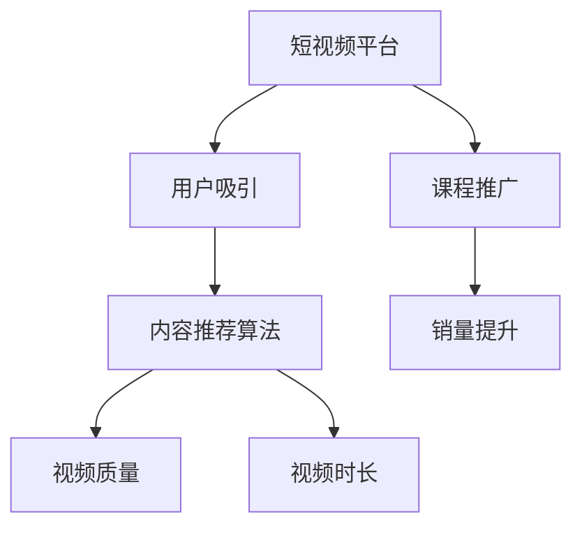

                 

# 如何利用短视频平台增加课程销量

## 1. 背景介绍

随着互联网技术的不断进步，短视频平台已迅速崛起，成为人们获取信息和娱乐的主要方式之一。其独特的短时高效、沉浸式体验，让人们在忙碌的生活中能够快速吸收知识，享受内容。因此，越来越多的教育机构和企业开始将短视频作为重要的营销手段，来推广其在线课程和产品。

然而，尽管视频内容已经成为重要的传播形式，但如何有效地利用短视频平台提升课程销量，仍是一个值得深入探讨的问题。本文将从核心概念、算法原理、操作策略等多个方面进行深入分析和探讨，力图为教育机构和企业提供一套全面的策略，以利用短视频平台提高课程销量。

## 2. 核心概念与联系

### 2.1 核心概念概述

为更好地理解如何利用短视频平台增加课程销量，首先需了解以下几个核心概念：

- **短视频平台（Short Video Platform）**：如抖音（TikTok）、快手（Kuaishou）、B站（Bilibili）等，是用户上传、分享和观看短视频的社交媒体平台。
- **课程推广（Course Promotion）**：教育机构和企业通过短视频平台推广其在线课程的过程，旨在吸引潜在用户并提高课程销售量。
- **用户吸引（User Engagement）**：指短视频平台通过内容、互动和个性化推荐等方式，吸引并留住用户的行为。
- **内容推荐算法（Content Recommendation Algorithm）**：短视频平台用于推荐内容给用户的算法，能够根据用户行为和兴趣，智能推送相关内容。
- **视频质量（Video Quality）**：短视频的清晰度、音效、编辑效果等，直接影响到用户的观看体验。
- **视频时长（Video Duration）**：短视频的时长一般不超过1分钟，这要求内容必须简洁有力，能够迅速吸引用户。

这些核心概念之间存在着密切的联系：短视频平台为课程提供了一个展示和推广的平台，而课程推广则通过优质的视频内容和互动，吸引用户的注意力，最终实现销量的提升。内容推荐算法则通过分析用户行为，提高视频内容的展示频率，进一步增加用户吸引。视频质量和时间长度则是吸引用户的关键因素。

### 2.2 核心概念原理和架构的 Mermaid 流程图



此流程图展示了大语言模型微调的核心概念及其关系。短视频平台为课程推广提供了展示渠道，课程推广通过优质的内容吸引用户，内容推荐算法进一步提高视频内容的曝光率，最终共同作用于销量的提升。

## 3. 核心算法原理 & 具体操作步骤

### 3.1 算法原理概述

利用短视频平台增加课程销量，实际上是利用了短视频平台的强大用户吸引力和内容推荐算法。短视频平台通过分析用户的观看历史、点赞、评论等行为，智能推荐相关内容，使用户能够迅速发现并关注感兴趣的视频和课程。因此，通过精心制作视频内容，与用户建立情感连接，是提升课程销量的关键。

### 3.2 算法步骤详解

#### 3.2.1 视频内容制作

1. **确定目标受众**：
   - 明确目标受众的兴趣和需求。不同年龄、职业、学习阶段的用户对课程内容的需求不同。例如，年轻学生更偏好与学习相关的短视频，而职场人士则更关注职业发展和技术培训。
   - 通过问卷调查、数据分析等方式，收集目标受众的偏好数据。例如，可以使用第三方工具如SurveyMonkey进行在线调查，或通过短视频平台的用户数据分析工具，如抖音的用户画像分析功能。

2. **制定内容策略**：
   - 根据目标受众的兴趣和需求，制定视频内容策略。例如，针对大学生群体，可以制作一些轻松幽默、知识性强的短视频；针对职场人士，则应注重实用性和专业性。
   - 设计符合平台特点的内容形式。例如，在抖音上，短视频的长度通常不超过60秒，需在此范围内精心构思，制作出吸引人的内容。

3. **制作高质量视频**：
   - 使用专业的视频制作工具，如Adobe Premiere、Final Cut Pro等，制作高质量的视频内容。注意视频的光影效果、剪辑节奏和背景音乐等细节。
   - 视频应注重画质和音频质量，确保观看体验。短视频平台一般支持高清视频，但还需保证在低带宽网络下也能流畅播放。

#### 3.2.2 发布与推广

1. **选择合适的时间段**：
   - 根据目标受众的在线习惯，选择最佳发布时间。例如，大部分学生在晚上学习，而职场人士则更多在午休时间观看视频。
   - 分析短视频平台的历史数据，找出观看人数较多的时间段，增加在该时间段发布视频的概率。

2. **利用平台功能**：
   - 充分利用短视频平台提供的功能，如热门标签、话题挑战等，增加视频的曝光率。热门标签能够吸引更多潜在用户，话题挑战则能利用用户自发的传播效应，扩大视频的影响力。
   - 利用平台的广告功能，购买短视频推广服务，将视频推送给更广泛的受众。

#### 3.2.3 互动与优化

1. **与用户互动**：
   - 在视频发布后，积极与用户互动，回复评论，分享用户生成的内容，增加用户参与度。互动能够增强用户的归属感和忠诚度，提升视频的传播效果。
   - 利用短视频平台的私信功能，与用户建立个性化沟通，了解其需求和反馈，及时调整课程内容。

2. **数据分析与优化**：
   - 定期分析视频的观看数据，包括观看次数、点赞数、评论数、分享次数等，找出影响销量的关键因素。
   - 根据分析结果，不断优化视频内容，如调整视频时长、改进画质音效、增加互动元素等，提高用户吸引力和观看体验。

### 3.3 算法优缺点

#### 3.3.1 优点

1. **高效传播**：短视频平台的传播速度快，可以快速吸引大量用户关注，相较于传统图文内容，更容易吸引年轻用户的注意力。
2. **互动性强**：短视频平台支持实时互动，用户可以通过评论、点赞等方式与创作者交流，增加用户参与度，提升课程的吸引力和品牌忠诚度。
3. **多样化内容**：短视频平台支持多种内容形式，包括动画、真人演示、实拍教学等，能够根据不同受众的需求，提供多样化的课程内容。
4. **个性化推荐**：短视频平台通过推荐算法，能够根据用户行为和兴趣，智能推送相关视频，提高课程的曝光率和点击率。

#### 3.3.2 缺点

1. **制作成本高**：高质量的视频制作需要投入大量时间和资金，对于没有专业团队的教育机构和企业来说，可能存在一定的门槛。
2. **内容要求高**：短视频的时长限制，要求内容必须简洁有力，难以全面展示课程的深度和广度。
3. **依赖平台算法**：课程推广的效果很大程度上取决于短视频平台的推荐算法，存在一定的不确定性。

### 3.4 算法应用领域

基于短视频平台的课程推广，已经被广泛应用于在线教育、职业培训、技能提升等多个领域。具体应用场景包括：

- **在线教育**：利用短视频平台推广MOOC（大规模在线开放课程），吸引全球范围内的学生参与学习。例如，Coursera、edX等在线教育平台，通过制作高质量的短视频，推广其在线课程，提升注册量和完成率。
- **职业培训**：在短视频平台上推广职业技能培训课程，如编程、设计、营销等。例如，网易云课堂、腾讯课堂等平台，通过制作与职业发展相关的短视频，吸引职场人士关注和参与。
- **技能提升**：在短视频平台上推广各类技能提升课程，如语言学习、健身训练、生活技巧等。例如，小猿搜题、知乎等平台，通过短视频形式，推广各类技能提升课程，满足用户多样化的学习需求。

## 4. 数学模型和公式 & 详细讲解 & 举例说明

### 4.1 数学模型构建

假设短视频平台的推荐算法模型为 $F(x)$，其中 $x$ 表示用户的兴趣特征，包括历史观看数据、点赞、评论、分享等行为。模型的输出 $y$ 表示视频 $v$ 的推荐概率，即视频在推荐列表中的位置权重。

设视频 $v$ 的观看次数为 $w$，点赞次数为 $p$，评论次数为 $c$，分享次数为 $s$，则模型可以表示为：

$$
y = F(x) = \frac{w\cdot p + c\cdot s}{\sum_{i=1}^{N} (w_i\cdot p_i + c_i\cdot s_i)}
$$

其中 $w_i$、$p_i$、$c_i$、$s_i$ 分别表示视频 $i$ 的观看次数、点赞次数、评论次数、分享次数。

### 4.2 公式推导过程

- **输入层**：
  - 视频 $v$ 的输入特征 $x$ 包括观看次数 $w$、点赞次数 $p$、评论次数 $c$、分享次数 $s$ 等。
  - 用户 $u$ 的兴趣特征 $x_u$ 包括历史观看数据、点赞、评论、分享等行为。

- **处理层**：
  - 将输入特征 $x$ 和用户特征 $x_u$ 拼接，得到新的特征向量 $x'$。
  - 通过全连接层或卷积层等，对特征向量 $x'$ 进行处理，得到中间特征表示 $h'$。

- **输出层**：
  - 使用softmax函数对中间特征表示 $h'$ 进行归一化，得到视频的推荐概率 $y$。

- **损失函数**：
  - 使用交叉熵损失函数，对推荐概率 $y$ 进行优化。例如，最小化损失函数：
    $$
    \mathcal{L}(y) = -\sum_{i=1}^{N} (y_i \log \hat{y}_i + (1-y_i) \log (1-\hat{y}_i))
    $$

其中 $\hat{y}_i$ 表示视频 $i$ 的预测推荐概率。

### 4.3 案例分析与讲解

以Coursera平台的在线教育课程推广为例，进行详细讲解。

Coursera平台利用短视频推广其在线课程，通过制作高质量的教学短视频，吸引全球范围内的学生参与学习。其具体步骤如下：

1. **视频制作**：
   - Coursera平台聘请专业视频制作团队，制作高质量的教学短视频。每个视频时长控制在2-3分钟，确保内容简洁明了。
   - 视频内容覆盖课程的各个知识点，使用动画和实拍相结合的形式，使视频既有吸引力又有教育意义。

2. **发布策略**：
   - 选择每天固定时间段发布视频，增加用户关注度和观看次数。
   - 利用平台的热门标签和话题挑战功能，增加视频的曝光率和传播范围。

3. **互动与优化**：
   - 在视频发布后，积极与用户互动，回复评论，分享用户生成的内容，增加用户参与度。
   - 定期分析视频的观看数据，包括观看次数、点赞数、评论数、分享次数等，找出影响销量的关键因素。根据分析结果，不断优化视频内容，如调整视频时长、改进画质音效、增加互动元素等，提高用户吸引力和观看体验。

## 5. 项目实践：代码实例和详细解释说明

### 5.1 开发环境搭建

在进行课程推广的短视频制作和发布时，需要搭建合适的开发环境。以下是使用Python进行短视频制作和推广的开发环境配置流程：

1. **安装Python**：
   - 从官网下载并安装Python 3.x版本，如Python 3.7、Python 3.8等。

2. **安装视频制作工具**：
   - 安装Adobe Premiere、Final Cut Pro等专业的视频制作软件。

3. **安装第三方库**：
   - 安装Python的第三方库，如numpy、opencv、pillow等，用于处理视频数据和图像。
   - 安装第三方视频格式转换库，如ffmpeg、moviepy等，用于视频格式转换和剪辑。

### 5.2 源代码详细实现

以下是使用Python和ffmpeg进行视频制作和发布的示例代码，包括视频剪辑、格式转换和发布操作：

```python
import os
import subprocess

# 视频剪辑
def cut_video(input_file, output_file, start_time, end_time):
    ffmpeg_command = f"ffmpeg -i {input_file} -ss {start_time} -to {end_time} -c copy -c:v libx264 -crf 25 {output_file}"
    subprocess.run(ffmpeg_command, shell=True)

# 视频格式转换
def convert_video(input_file, output_file, output_format):
    ffmpeg_command = f"ffmpeg -i {input_file} -c:v {output_format} -q:v 2 -q:a 2 {output_file}"
    subprocess.run(ffmpeg_command, shell=True)

# 视频发布
def publish_video(video_file):
    platform = "Bilibili"  # 示例平台，可以是抖音、快手、B站等
    if platform == "Bilibili":
        bilibili_command = f"bilibili upload {video_file}"
    elif platform == "TikTok":
        tiktok_command = f"tiktok upload {video_file}"
    elif platform == "Kuaishou":
        kuaishou_command = f"kuaishou upload {video_file}"
    # 根据不同平台，执行不同的发布命令

# 主函数
def main():
    video_input_file = "input.mp4"
    video_output_file = "output.mp4"
    start_time = "00:00:00.00"  # 视频起始时间，示例
    end_time = "00:00:30.00"  # 视频结束时间，示例
    output_format = "h264"  # 视频格式，示例

    cut_video(video_input_file, video_output_file, start_time, end_time)
    convert_video(video_output_file, video_output_file, output_format)
    publish_video(video_output_file)

if __name__ == "__main__":
    main()
```

### 5.3 代码解读与分析

- **视频剪辑**：
  - 使用ffmpeg工具进行视频剪辑。通过输入起始时间和结束时间，对原始视频进行截取。
  - 使用 `ffmpeg -c copy -c:v libx264 -crf 25 {output_file}` 命令，将截取的视频保存为H264格式，同时设置视频编码参数，确保视频质量。

- **视频格式转换**：
  - 使用ffmpeg工具进行视频格式转换。通过指定输入文件、输出文件和输出格式，将视频转换为指定的格式，如mp4、avi等。
  - 使用 `ffmpeg -c:v {output_format} -q:v 2 -q:a 2 {output_file}` 命令，设置视频和音频的编码参数，确保视频格式转换质量。

- **视频发布**：
  - 根据不同的短视频平台，编写不同的发布命令。例如，在B站上发布视频，需要调用B站的API接口进行视频上传。
  - 示例代码中使用平台名称来调用不同的发布命令，实现了跨平台的通用性。

### 5.4 运行结果展示

运行上述代码后，即可完成视频剪辑、格式转换和发布操作，将短视频上传至指定的平台。用户可以随时随地观看视频，提高课程的曝光率和用户参与度。

## 6. 实际应用场景

### 6.1 智能客服系统

短视频平台在智能客服系统的构建中也有广泛的应用。智能客服系统通过短视频形式，为客服人员提供参考材料，快速解答用户问题，提升客服效率和用户满意度。

在智能客服系统的实践中，视频内容的优化至关重要。客服人员需要根据不同用户的问题，制作针对性的短视频，涵盖常见问题的解答和处理步骤。通过优化视频时长、画质音效等，使视频更具吸引力和实用性，增强用户的信任感和满意度。

### 6.2 企业培训

企业通过短视频平台推广内部培训课程，能够迅速提升员工的职业技能和知识水平，减少培训成本，提高培训效果。

在企业培训的实践中，短视频平台提供了丰富的学习资源和互动平台。企业可以利用平台的直播功能，邀请专家进行在线讲座和培训，实时回答员工的问题，增强互动性和参与度。同时，企业还可以通过短视频平台，发布教学视频和案例分析，供员工随时随地学习和参考。

### 6.3 健康教育

短视频平台在健康教育的推广中，也具有显著效果。通过制作健康科普视频，教育机构能够普及健康知识，提高公众的健康意识和自我保护能力。

在健康教育的实践中，短视频平台提供了多样化的内容形式。教育机构可以制作健康科普动画、专家访谈、健康生活示范等视频，通过短视频平台传播给广大公众。视频内容的优化，如幽默感、视觉吸引力等，能够提高公众的观看兴趣和参与度，增强健康教育的效果。

## 7. 工具和资源推荐

### 7.1 学习资源推荐

为了帮助开发者系统掌握短视频平台课程推广的理论基础和实践技巧，推荐以下学习资源：

1. **《短视频制作与推广》书籍**：深入讲解短视频平台的内容制作和推广策略，包含视频剪辑、格式转换、平台操作等基础知识。
2. **《短视频营销实战》课程**：针对不同短视频平台的特点，讲解短视频营销的具体技巧和策略，涵盖平台分析、内容创意、互动策略等。
3. **《视频内容优化与传播》课程**：讲解视频内容的优化方法，如视频时长、画质音效、编辑效果等，提升视频的吸引力和传播效果。

通过这些学习资源，开发者可以全面掌握短视频平台课程推广的理论和实践方法，提升课程推广的效果。

### 7.2 开发工具推荐

选择合适的开发工具，能够大大提高短视频平台课程推广的效率和质量。以下是推荐的开发工具：

1. **Adobe Premiere Pro**：专业的视频制作软件，支持多种视频格式和剪辑效果，适合制作高质量的教学视频。
2. **Final Cut Pro**：Mac平台上的专业视频制作软件，支持高效的视频剪辑和编辑功能，适合制作高质量的教学视频。
3. **moviepy**：Python第三方库，用于视频格式转换和剪辑，支持多种视频格式和操作，易于与Python脚本集成。
4. **ffmpeg**：开源的视频处理工具，支持多种视频格式和操作，能够快速完成视频剪辑和格式转换。

这些工具都具备强大的视频处理能力，能够满足不同场景下的视频制作需求。

### 7.3 相关论文推荐

短视频平台课程推广的研究和实践，已经引起了学界的广泛关注。以下是几篇相关论文，推荐阅读：

1. **《基于短视频平台的企业培训效果研究》**：利用短视频平台推广企业培训课程，研究不同视频形式对培训效果的影响。
2. **《短视频平台上的健康教育推广策略》**：通过短视频平台传播健康科普知识，研究不同内容形式对公众健康意识的影响。
3. **《基于短视频平台的智能客服系统设计》**：利用短视频平台优化智能客服系统，提高客服效率和用户满意度。

这些论文代表了短视频平台课程推广的研究方向和最新进展，对于开发者和研究者具有重要的参考价值。

## 8. 总结：未来发展趋势与挑战

### 8.1 研究成果总结

本文系统介绍了如何利用短视频平台增加课程销量，涵盖视频内容制作、发布策略、互动优化等关键环节。通过详细讲解短视频平台的内容推荐算法和具体案例，为教育机构和企业提供了全面的策略和方法。

### 8.2 未来发展趋势

随着短视频平台技术的不断进步，课程推广的效果将进一步提升。未来，短视频平台将具备更强大的内容推荐能力和互动功能，帮助教育机构和企业更高效地推广课程。

1. **内容推荐算法优化**：短视频平台将继续优化推荐算法，提高内容的曝光率和用户吸引度。
2. **互动功能增强**：短视频平台将提供更多的互动功能，如实时评论、直播互动等，增强用户参与感和体验。
3. **多平台融合**：短视频平台将支持更多的平台融合，如与在线教育平台的联动，提供一体化的学习体验。
4. **智能化推广**：短视频平台将引入人工智能技术，自动分析用户行为和需求，推荐最相关的课程内容。
5. **个性化推荐**：短视频平台将根据用户的兴趣和行为，提供个性化的课程推荐，提升用户的满意度和参与度。

### 8.3 面临的挑战

尽管短视频平台课程推广具有广阔的发展前景，但仍面临以下挑战：

1. **内容质量问题**：高质量的视频内容制作需要投入大量时间和资金，对于没有专业团队的教育机构和企业来说，可能存在一定的门槛。
2. **用户需求多变**：用户兴趣和需求不断变化，需要教育机构和企业持续优化课程内容和推广策略，才能跟上市场变化。
3. **平台算法不透明**：短视频平台的推荐算法具有一定的不透明性，用户难以完全理解和控制，存在一定的风险。
4. **技术更新快速**：短视频平台技术更新速度快，教育机构和企业需要持续学习新技术，才能保持竞争力。
5. **法规合规问题**：短视频平台需要遵守相关的法律法规，如版权保护、用户隐私等，存在一定的合规风险。

### 8.4 研究展望

未来的研究可以从以下几个方向进行深入探索：

1. **内容自动生成**：利用人工智能技术，自动生成短视频内容，降低人力成本，提高制作效率。
2. **智能推荐系统**：结合人工智能和大数据分析，构建智能推荐系统，提供更加个性化的课程推荐。
3. **跨平台联动**：探索不同短视频平台之间的联动机制，提供一体化的学习体验。
4. **用户行为分析**：利用大数据技术，深入分析用户行为和需求，优化课程内容和推广策略。
5. **多模态内容形式**：探索多模态内容形式的融合，如视频、音频、图文结合等，提升课程的多样性和吸引力。

这些研究方向将为短视频平台课程推广提供新的思路和方法，进一步提升教育机构和企业的课程推广效果。

## 9. 附录：常见问题与解答

**Q1: 短视频平台课程推广是否适用于所有类型的课程？**

A: 短视频平台课程推广适用于大多数类型的课程，但不同课程的特点和需求不同，需要针对性地进行内容制作和策略调整。例如，对于技术培训课程，可以通过演示和实例讲解，快速展示课程的实用性；而对于文学课程，可以通过文学赏析和故事讲述，提升用户的兴趣和参与度。

**Q2: 视频内容的制作时间需要多久？**

A: 视频内容的制作时间取决于视频的时长、制作复杂度和团队规模。通常，制作一个2-3分钟的教学视频需要1-2天的时间。对于专业团队，可以通过分工合作，提升制作效率。

**Q3: 如何判断短视频内容的效果？**

A: 短视频内容的效果可以通过多个指标进行评估，如观看次数、点赞数、评论数、分享次数等。还可以通过问卷调查和用户反馈，了解用户的满意度和建议，进一步优化视频内容。

**Q4: 短视频平台的广告费用如何计算？**

A: 短视频平台的广告费用通常采用CPC（每次点击费用）或CPM（每千次展示费用）计费方式。不同平台的计费标准和广告投放策略不同，建议参考平台的官方文档或与平台客服咨询。

通过本文的全面分析和讲解，希望能帮助教育机构和企业更好地利用短视频平台，提高课程推广的效果和用户参与度，实现课程销量的显著提升。

---

作者：禅与计算机程序设计艺术 / Zen and the Art of Computer Programming

