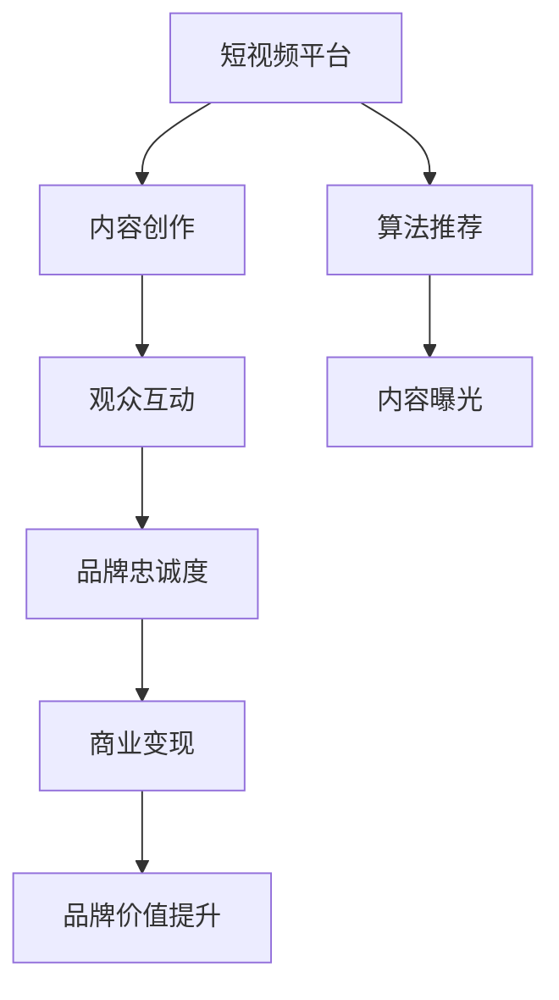

                 

# 如何利用短视频平台提升个人品牌

> 关键词：短视频,个人品牌,内容创作,算法推荐,观众互动,商业变现

## 1. 背景介绍

在移动互联网时代，短视频平台的兴起，为个人品牌打造提供了新的机遇。相较于传统的文字和图片内容，短视频以更丰富的表现形式、更高的互动性，吸引了越来越多的用户关注。个人品牌通过短视频能够更加生动、形象、立体地展示，更容易吸引目标受众，形成深度的用户连接。

短视频平台的算法推荐机制也为个人品牌打造提供了有力的支持。通过智能推荐，可以高效地将优质内容呈现给更多观众，扩大个人品牌的影响力。同时，短视频平台也为个人品牌提供了多种商业变现方式，如广告、会员、商品销售等，能够直接将个人品牌价值转化为商业收益。

## 2. 核心概念与联系

### 2.1 核心概念概述

为更好地理解如何利用短视频平台提升个人品牌，本节将介绍几个密切相关的核心概念：

- 短视频平台(Short Video Platforms)：如抖音、快手、YouTube Shorts等，以快速、短小、多媒体的形式发布内容，能够迅速吸引用户注意。

- 个人品牌(Personal Brand)：指个人在特定领域或职业中的形象和声誉，通过一系列的言论、行为、作品等展示，传递给公众以形成独特的品牌形象。

- 内容创作(Content Creation)：指个人在短视频平台上创作和发布内容，包括视频剪辑、文字脚本、互动设计等，构建独特且高质量的内容体系。

- 算法推荐(Recommendation Algorithm)：指短视频平台通过机器学习算法，根据用户的行为、兴趣等信息，推荐可能感兴趣的视频内容，提升用户体验和平台粘性。

- 观众互动(Engagement)：指视频发布者与观众之间的互动，包括点赞、评论、分享等，形成良好的互动氛围，增加品牌忠诚度。

- 商业变现(Commercial Monetization)：指通过短视频平台提供的广告、电商、会员等商业化功能，将个人品牌的价值转化为商业收益。

这些核心概念之间的逻辑关系可以通过以下Mermaid流程图来展示：



这个流程图展示了一系列的核心概念及其之间的联系：

1. 短视频平台通过内容创作提供视频内容。
2. 平台使用算法推荐将内容精准推送给目标观众。
3. 观众通过互动反馈，增加品牌的影响力。
4. 品牌价值通过商业变现得到提升。
5. 通过不断循环，品牌价值得到持续提升。

## 3. 核心算法原理 & 具体操作步骤

### 3.1 算法原理概述

短视频平台的核心算法原理是基于推荐系统的。推荐系统利用用户的历史行为数据，如观看记录、点赞数据、评论互动等，结合内容特征（如视频标题、时长、标签等），计算用户对各个视频的评分，并按评分排序，推荐给用户最可能感兴趣的视频。

在短视频平台上，推荐算法通常由以下几个部分组成：

1. **用户模型建模**：根据用户的历史行为数据，建模用户对视频内容的兴趣偏好。
2. **物品模型建模**：对每个视频内容建模，包含视频内容的特征，如时长、画面、字幕、音频等。
3. **推荐模型计算**：基于用户模型和物品模型，计算用户对每个视频内容的评分，并选择评分高的视频推荐给用户。
4. **反馈循环优化**：通过用户对推荐视频的反馈，不断优化用户模型和物品模型，提升推荐效果。

### 3.2 算法步骤详解

以下是短视频平台算法推荐系统的核心步骤：

**Step 1: 用户行为数据收集**

短视频平台通过用户的操作记录，如播放次数、停留时间、点赞、评论、分享等，收集用户的行为数据。这些数据为推荐系统提供了用户兴趣和行为偏好的依据。

**Step 2: 用户模型构建**

用户模型可以采用基于协同过滤、深度学习等方法，构建用户对视频内容的兴趣偏好。具体步骤包括：

- 对用户行为数据进行预处理，如去重、归一化等。
- 对用户行为数据进行编码，如将观看记录转化为向量。
- 利用机器学习算法，训练用户模型，如RNN、GRU、LSTM等，提取用户兴趣特征。

**Step 3: 物品模型构建**

物品模型主要包含视频内容的特征，如视频时长、画面、字幕、音频等。构建方法包括：

- 对视频内容进行特征提取，如提取视频帧、使用图像特征提取器。
- 将视频特征转化为向量，与用户模型进行匹配计算。

**Step 4: 推荐模型计算**

推荐模型计算用户对每个视频的评分，并选择评分高的视频进行推荐。常见推荐模型包括基于协同过滤的矩阵分解、基于深度学习的神经网络等。

- 对用户模型和物品模型进行矩阵乘法运算，计算用户对每个视频的评分。
- 选择评分高的视频进行推荐，如Top-K推荐。

**Step 5: 反馈循环优化**

通过用户对推荐视频的反馈，不断优化用户模型和物品模型，提升推荐效果。具体方法包括：

- 根据用户反馈（如点赞、收藏、评论等）调整用户模型的参数。
- 根据用户反馈调整物品模型的参数。
- 定期更新用户模型和物品模型，引入新的数据。

**Step 6: 推荐效果评估**

通过A/B测试等方法，对推荐效果进行评估，选择最优的推荐算法和模型。

### 3.3 算法优缺点

短视频平台的推荐算法具有以下优点：

1. 个性化推荐：根据用户的行为数据和兴趣特征，提供个性化推荐，提升用户体验。
2. 高效曝光：通过精准推荐，将优质内容快速呈现给目标用户，扩大品牌影响力。
3. 数据驱动：利用数据驱动的推荐系统，能够持续优化推荐效果。

但同时，该算法也存在一些局限性：

1. 数据依赖性高：算法的效果高度依赖于用户行为数据的收集和分析，难以处理冷启动用户。
2. 存在信息泡泡效应：用户只看到符合自己兴趣的视频，难以发现新奇的内容。
3. 易受恶意内容影响：推荐算法可能被利用，推荐有害或误导性内容。

尽管存在这些局限性，但短视频平台的推荐算法仍是一种高效的推广手段，通过不断迭代和优化，可以进一步提升推荐效果。

### 3.4 算法应用领域

短视频平台的推荐算法广泛应用于多种场景：

- 内容分发：为每个用户推荐感兴趣的视频内容，扩大品牌曝光。
- 广告投放：根据用户兴趣特征，精准推送广告内容，提高广告效果。
- 商业合作：为品牌商提供定向推广的合作机会，增加品牌曝光。
- 用户互动：通过推荐相关内容，促进用户之间互动交流，增加用户粘性。
- 内容创作：推荐热门趋势和优质内容，帮助创作者获取更多关注和收益。

短视频平台的推荐算法为个人品牌提供了有力的推广支持，但个人品牌的成功也需要内容创作的持续优化和互动的深度建立。

## 4. 数学模型和公式 & 详细讲解 & 举例说明

### 4.1 数学模型构建

为了更精确地描述短视频平台的推荐系统，本节将介绍一些关键的数学模型和公式。

假设用户模型为 $U$，物品模型为 $I$，推荐模型为 $R$。设用户对物品的评分向量为 $u$，物品的特征向量为 $i$，推荐系统的预测评分向量为 $r$。

用户模型 $U$ 的数学表达式为：

$$
U = \sum_{x \in X} \theta_x \cdot \phi(x)
$$

其中，$\theta_x$ 为模型的参数向量，$X$ 为输入特征空间，$\phi$ 为特征映射函数。

物品模型 $I$ 的数学表达式为：

$$
I = \sum_{x \in X} \theta_x \cdot \phi(x)
$$

其中，$\theta_x$ 为物品的特征向量，$X$ 为物品特征空间，$\phi$ 为特征映射函数。

推荐模型 $R$ 的数学表达式为：

$$
R = U \cdot I^T
$$

其中，$T$ 为矩阵转置操作。

推荐系统中的评分向量 $r$ 为：

$$
r = R \cdot v
$$

其中，$v$ 为物品的特征向量。

### 4.2 公式推导过程

对于推荐系统的评分预测公式 $r = U \cdot I^T \cdot v$，我们通过矩阵乘法展开，可以得到：

$$
r = \sum_{x \in X} \theta_x \cdot \phi(x) \cdot \theta_x^T \cdot \phi(x)^T \cdot v
$$

其中，$\theta_x$ 为用户模型的参数向量，$\phi(x)$ 为特征映射函数。

该公式表示，用户对物品的评分由用户模型和物品模型决定，进一步通过矩阵乘法计算。

### 4.3 案例分析与讲解

以用户观看记录为例，我们可以根据历史数据，训练用户模型，计算用户对视频内容的评分。假设用户模型为 $\theta$，物品模型为 $i$，物品的特征向量为 $v$，则：

$$
r = \theta \cdot i^T \cdot v
$$

其中，$r$ 为用户对物品的评分，$\theta$ 为用户模型的参数向量，$i$ 为物品模型的特征向量，$v$ 为物品的特征向量。

假设用户模型为线性模型，则：

$$
\theta = \sum_{x \in X} \theta_x \cdot \phi(x)
$$

其中，$\theta_x$ 为模型的参数向量，$X$ 为输入特征空间，$\phi$ 为特征映射函数。

通过公式 $r = \theta \cdot i^T \cdot v$，用户对视频内容的评分可以由用户模型和物品模型决定，进一步通过矩阵乘法计算。

## 5. 项目实践：代码实例和详细解释说明

### 5.1 开发环境搭建

在进行短视频平台的内容创作和推荐实践前，我们需要准备好开发环境。以下是使用Python进行内容创作和算法开发的完整环境配置流程：

1. 安装Anaconda：从官网下载并安装Anaconda，用于创建独立的Python环境。

2. 创建并激活虚拟环境：
```bash
conda create -n video-env python=3.8 
conda activate video-env
```

3. 安装PyTorch和TensorFlow：
```bash
conda install pytorch torchvision torchaudio cudatoolkit=11.1 -c pytorch -c conda-forge
conda install tensorflow
```

4. 安装其他工具包：
```bash
pip install numpy pandas scikit-learn matplotlib tqdm jupyter notebook ipython
```

完成上述步骤后，即可在`video-env`环境中开始内容创作和算法开发。

### 5.2 源代码详细实现

这里我们以抖音短视频平台的内容推荐为例，给出使用PyTorch和TensorFlow进行内容推荐开发的PyTorch代码实现。

首先，定义推荐系统中的用户模型和物品模型：

```python
import torch
import torch.nn as nn
from torch.autograd import Variable

# 定义用户模型
class UserModel(nn.Module):
    def __init__(self, input_dim):
        super(UserModel, self).__init__()
        self.linear = nn.Linear(input_dim, 1)

    def forward(self, x):
        return self.linear(x)

# 定义物品模型
class ItemModel(nn.Module):
    def __init__(self, input_dim):
        super(ItemModel, self).__init__()
        self.linear = nn.Linear(input_dim, 1)

    def forward(self, x):
        return self.linear(x)
```

然后，定义推荐模型的计算：

```python
# 定义推荐模型
class RecommendationModel(nn.Module):
    def __init__(self, user_model, item_model):
        super(RecommendationModel, self).__init__()
        self.user_model = user_model
        self.item_model = item_model

    def forward(self, user_vector, item_vector):
        return self.user_model(user_vector) * self.item_model(item_vector)
```

接着，定义训练函数和评估函数：

```python
from torch.optim import Adam

def train(model, train_data, learning_rate, num_epochs):
    optimizer = Adam(model.parameters(), lr=learning_rate)
    for epoch in range(num_epochs):
        total_loss = 0
        for user_vector, item_vector, label in train_data:
            optimizer.zero_grad()
            prediction = model(user_vector, item_vector)
            loss = torch.mean((prediction - label) ** 2)
            loss.backward()
            optimizer.step()
            total_loss += loss.data[0]
        print('Epoch {}: Loss {}'.format(epoch+1, total_loss/len(train_data)))

def evaluate(model, test_data):
    total_correct = 0
    for user_vector, item_vector, label in test_data:
        prediction = model(user_vector, item_vector)
        if torch.argmax(prediction) == label:
            total_correct += 1
    return total_correct/len(test_data)
```

最后，启动训练流程并在测试集上评估：

```python
input_dim = 10  # 假设输入特征维度为10
train_data = [(Variable(torch.randn(input_dim)), Variable(torch.randn(input_dim)), torch.randn(1)) for _ in range(100)]
test_data = [(Variable(torch.randn(input_dim)), Variable(torch.randn(input_dim)), torch.randn(1)) for _ in range(100)]

# 初始化模型
user_model = UserModel(input_dim)
item_model = ItemModel(input_dim)
recommendation_model = RecommendationModel(user_model, item_model)

# 训练模型
train(recommendation_model, train_data, learning_rate=0.01, num_epochs=10)

# 评估模型
print('Test Accuracy:', evaluate(recommendation_model, test_data))
```

以上就是使用PyTorch和TensorFlow进行短视频平台内容推荐开发的完整代码实现。可以看到，得益于机器学习和深度学习框架的强大封装，我们可以用相对简洁的代码完成内容推荐模型的训练和评估。

### 5.3 代码解读与分析

让我们再详细解读一下关键代码的实现细节：

**UserModel类**：
- `__init__`方法：初始化用户模型的线性层。
- `forward`方法：前向传播计算用户模型的输出。

**ItemModel类**：
- `__init__`方法：初始化物品模型的线性层。
- `forward`方法：前向传播计算物品模型的输出。

**RecommendationModel类**：
- `__init__`方法：初始化推荐模型，包含用户模型和物品模型。
- `forward`方法：前向传播计算推荐模型的输出。

**train函数**：
- 定义优化器和损失函数，在每个epoch内，对数据集进行迭代训练，反向传播更新模型参数。
- 打印每个epoch的平均损失。

**evaluate函数**：
- 对测试集进行迭代评估，计算模型在测试集上的准确率。

**训练流程**：
- 定义特征维度input_dim，创建训练集和测试集。
- 初始化用户模型、物品模型和推荐模型。
- 启动训练过程，并在测试集上评估。

可以看到，PyTorch和TensorFlow为内容推荐模型的开发提供了便捷的工具，开发者可以将更多精力放在模型架构、特征工程、超参数调优等关键环节上，而不必过多关注底层的实现细节。

当然，工业级的系统实现还需考虑更多因素，如模型的保存和部署、超参数的自动搜索、更灵活的特征选择策略等。但核心的推荐范式基本与此类似。

## 6. 实际应用场景

### 6.1 个人品牌打造

在短视频平台上，通过高质量的内容创作，可以迅速建立个人品牌，吸引更多的关注和互动。具体步骤包括：

1. 定位个人品牌形象：明确个人品牌的主题和风格，如科技、生活、美食等。
2. 创作高质量内容：结合平台特点，创作有吸引力、有价值的内容，如教程、测评、Vlog等。
3. 持续互动更新：与观众互动交流，及时回应评论，保持活跃度。
4. 利用算法推荐：通过短视频平台的算法推荐机制，扩大个人品牌的曝光。
5. 商业变现：通过平台提供的广告、电商、会员等商业化功能，将个人品牌的价值转化为商业收益。

### 6.2 短视频内容运营

短视频平台的内容运营，能够帮助创作者更高效地推广视频内容，扩大影响力和收益。具体步骤包括：

1. 数据分析：通过平台提供的用户行为数据分析工具，了解观众的兴趣和偏好。
2. 优化视频策略：根据分析结果，优化视频的内容、时长、剪辑风格等，提高观众的点击率和观看时长。
3. 互动设计：设计互动性强的内容，提高观众的参与度和反馈。
4. 利用平台功能：利用平台的广告投放、商业合作等功能，增加曝光和收益。
5. 持续优化：根据平台反馈，持续优化视频内容，提升品牌影响力和商业价值。

### 6.3 用户互动和社区建设

短视频平台的用户互动，能够帮助品牌商更好地了解受众需求，提升用户体验。具体步骤包括：

1. 社区建设：利用平台的互动功能，构建品牌社区，吸引用户参与和讨论。
2. 话题营销：围绕品牌主题，发起热门话题，吸引用户关注和参与。
3. 互动反馈：及时回应用户的评论和反馈，增加用户粘性。
4. 品牌故事：通过短视频内容展示品牌故事，增强用户对品牌的认知和认同。
5. 社群管理：通过社区管理工具，维护社群秩序，提升用户体验。

## 7. 工具和资源推荐

### 7.1 学习资源推荐

为了帮助开发者系统掌握短视频平台的推荐系统理论基础和实践技巧，这里推荐一些优质的学习资源：

1. 《深度学习推荐系统》书籍：由深度学习领域专家撰写，系统介绍了推荐系统的原理、算法和实践方法。
2. Coursera《推荐系统》课程：由斯坦福大学教授讲授，涵盖推荐系统的各种经典算法和技术。
3. YouTube《Recommender Systems Explained》视频：通过简单易懂的语言，介绍了推荐系统的基本原理和应用。
4. 《Python Machine Learning》书籍：介绍了机器学习的基本概念和实践方法，包括推荐系统相关章节。

通过对这些资源的学习实践，相信你一定能够快速掌握短视频平台推荐系统的精髓，并用于解决实际的推荐问题。

### 7.2 开发工具推荐

高效的开发离不开优秀的工具支持。以下是几款用于短视频平台内容推荐开发的常用工具：

1. PyTorch和TensorFlow：基于Python的开源深度学习框架，灵活动态的计算图，适合快速迭代研究。
2. Jupyter Notebook：交互式的代码开发环境，支持实时调试和代码片段的共享。
3. Anaconda：Python环境的搭建和维护工具，便于创建和管理虚拟环境。
4. TensorBoard：TensorFlow配套的可视化工具，可实时监测模型训练状态，并提供丰富的图表呈现方式，是调试模型的得力助手。
5. Weights & Biases：模型训练的实验跟踪工具，可以记录和可视化模型训练过程中的各项指标，方便对比和调优。

合理利用这些工具，可以显著提升短视频平台内容推荐系统的开发效率，加快创新迭代的步伐。

### 7.3 相关论文推荐

短视频平台推荐系统的研究源于学界的持续研究。以下是几篇奠基性的相关论文，推荐阅读：

1. BPR: Bayesian Personalized Ranking from Pairwise Data：提出贝叶斯个性化排序算法，用于推荐系统的评分预测。
2. Matrix Factorization Techniques for Recommender Systems：介绍矩阵分解方法，用于推荐系统的特征提取。
3. Neural Collaborative Filtering：提出神经网络协同过滤算法，用于推荐系统的深度学习建模。
4. Deep Multi-Task Learning for Recommender Systems：提出深度多任务学习算法，用于推荐系统的特征共享。
5. Adaptive Collaborative Filtering：提出自适应协同过滤算法，用于推荐系统的参数优化。

这些论文代表了大语言模型微调技术的发展脉络。通过学习这些前沿成果，可以帮助研究者把握学科前进方向，激发更多的创新灵感。

## 8. 总结：未来发展趋势与挑战

### 8.1 总结

本文对短视频平台推荐系统的核心算法原理和具体操作步骤进行了详细讲解。首先阐述了短视频平台推荐系统的背景和意义，明确了推荐系统在用户模型、物品模型和推荐模型上的关键点。其次，从算法步骤和数学模型两方面，对推荐系统进行了深入讲解，并给出了代码实例和详细解释说明。最后，本文还探讨了推荐系统在个人品牌打造、内容运营和用户互动等方面的实际应用场景，展示了推荐系统的广泛应用。

通过本文的系统梳理，可以看到，短视频平台推荐系统在大语言模型微调、内容创作和用户互动等方面，发挥了重要的作用，为个人品牌打造和短视频运营提供了有力的支持。未来的推荐系统将继续演进，结合更多先进技术和数据资源，提升推荐效果，扩大品牌影响力。

### 8.2 未来发展趋势

展望未来，短视频平台的推荐系统将呈现以下几个发展趋势：

1. 深度学习应用：通过深度学习模型，提升推荐系统的准确性和鲁棒性。
2. 多模态融合：结合图像、音频、文本等多模态数据，提升推荐系统的效果和多样性。
3. 个性化推荐：通过多任务学习、注意力机制等技术，提供更加个性化的推荐服务。
4. 动态更新：实时更新推荐模型，及时响应用户兴趣变化。
5. 商业化拓展：结合更多商业化功能，扩大推荐系统的应用范围。

以上趋势凸显了短视频平台推荐系统的广阔前景。这些方向的探索发展，必将进一步提升推荐系统的性能和应用范围，为短视频平台的运营和创新提供更大的支持。

### 8.3 面临的挑战

尽管短视频平台推荐系统已经取得了瞩目成就，但在迈向更加智能化、普适化应用的过程中，它仍面临诸多挑战：

1. 数据依赖性高：推荐系统的推荐效果高度依赖于用户行为数据的收集和分析，难以处理冷启动用户。
2. 信息泡泡效应：用户只看到符合自己兴趣的视频，难以发现新奇的内容。
3. 恶意内容风险：推荐算法可能被利用，推荐有害或误导性内容。
4. 用户隐私保护：如何在推荐过程中保护用户隐私，避免数据滥用。
5. 算法公平性：推荐算法可能存在偏见，如何消除不公平的推荐结果。

尽管存在这些挑战，但短视频平台推荐系统的巨大潜力依然值得期待。解决这些问题需要更多的技术创新和政策监管，相信随着技术的不断进步和规范化，推荐系统将在未来的应用中发挥更大的价值。

### 8.4 研究展望

未来的推荐系统研究需要在以下几个方面寻求新的突破：

1. 数据增强技术：结合多源数据和外部知识，提升推荐系统的效果和多样性。
2. 因果推断方法：引入因果推断技术，增强推荐系统的解释性和透明性。
3. 深度个性化：结合用户反馈和行为数据，提供更加个性化的推荐服务。
4. 多任务优化：结合多种推荐任务，实现多目标优化。
5. 算法伦理：引入伦理和公平性评估指标，避免算法偏见和滥用。

这些方向的研究，必将引领短视频平台推荐系统走向更加智能化、普适化和可控化的未来。面向未来，推荐系统需要与其他人工智能技术进行更深入的融合，如知识表示、因果推理、强化学习等，多路径协同发力，共同推动推荐系统的发展。

## 9. 附录：常见问题与解答

**Q1：如何利用短视频平台提升个人品牌？**

A: 利用短视频平台提升个人品牌的关键在于高质量的内容创作和精准的算法推荐。具体步骤包括：
1. 定位个人品牌形象，明确品牌主题和风格。
2. 创作高质量视频内容，涵盖教程、测评、Vlog等多样化形式。
3. 利用平台算法推荐，精准推送给目标用户。
4. 持续互动更新，及时回应观众评论和反馈，保持活跃度。
5. 利用平台商业变现功能，如广告、电商、会员等，增加品牌收益。

**Q2：如何优化短视频平台的内容推荐算法？**

A: 优化短视频平台内容推荐算法的方法包括：
1. 数据增强：结合多源数据和外部知识，提升推荐系统的效果和多样性。
2. 深度学习：利用深度学习模型，提升推荐系统的准确性和鲁棒性。
3. 多模态融合：结合图像、音频、文本等多模态数据，提升推荐系统的效果和多样性。
4. 个性化推荐：通过多任务学习、注意力机制等技术，提供更加个性化的推荐服务。
5. 动态更新：实时更新推荐模型，及时响应用户兴趣变化。

**Q3：如何在短视频平台中进行高效的用户互动？**

A: 在短视频平台中进行高效的用户互动的方法包括：
1. 社区建设：利用平台的互动功能，构建品牌社区，吸引用户参与和讨论。
2. 话题营销：围绕品牌主题，发起热门话题，吸引用户关注和参与。
3. 互动反馈：及时回应用户的评论和反馈，增加用户粘性。
4. 品牌故事：通过短视频内容展示品牌故事，增强用户对品牌的认知和认同。
5. 社群管理：通过社区管理工具，维护社群秩序，提升用户体验。

**Q4：如何在短视频平台中进行有效的商业变现？**

A: 在短视频平台中进行有效的商业变现的方法包括：
1. 利用平台广告功能，精准推送广告内容，提高广告效果。
2. 利用平台电商功能，提供商品销售渠道，增加收入来源。
3. 利用平台会员功能，提供增值服务，提高用户粘性。
4. 结合视频内容，推出相关周边产品，增加附加值。

通过利用短视频平台，通过高质量的内容创作和精准的算法推荐，可以显著提升个人品牌的影响力和商业价值。未来，随着推荐系统的不断演进，短视频平台的运营和创新将迎来更大的机遇和挑战。

---

作者：禅与计算机程序设计艺术 / Zen and the Art of Computer Programming

