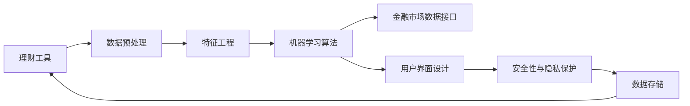

                 

# 如何利用编程技能开发理财工具

## 1. 背景介绍

在现代社会，个人理财已经成为很多人日常生活中的重要组成部分。随着金融市场的不断发展，理财工具的应用场景越来越广泛，从个人预算管理到投资组合优化，从资产配置到风险管理，每一项决策都需要依靠强大的数据处理和分析能力。作为一名程序员，利用自身的编程技能，开发高效、智能、可靠的理财工具，既能提升个人财务管理能力，也能为社会创造价值。

## 2. 核心概念与联系

### 2.1 核心概念概述

要开发理财工具，首先需要理解几个关键概念：

- **理财工具**：指的是利用计算机技术和数据科学方法，对个人或企业的财务状况进行分析和管理的工具。这些工具可以帮助用户制定预算计划、追踪投资回报、优化资产配置等。

- **数据预处理**：在理财工具中，通常需要处理大量的财务数据，包括银行流水、投资记录、消费记录等。数据预处理包括数据清洗、特征提取、数据标准化等步骤，目的是提升数据质量，为后续分析和模型训练提供良好的基础。

- **机器学习算法**：在理财工具中，常用的机器学习算法包括回归分析、分类、聚类、时间序列预测等。这些算法可以用于预测股票市场走势、评估投资组合风险、推荐理财策略等。

- **金融市场数据接口**：理财工具需要获取实时的金融市场数据，以便进行分析和决策。金融市场数据接口是连接理财工具和金融市场的桥梁，可以获取股票价格、债券收益率、外汇汇率等关键数据。

- **用户界面设计**：理财工具的用户界面设计需要简洁直观，易于使用，以便用户能够方便地输入数据和查看结果。好的用户界面设计可以提升用户体验，增加用户粘性。

- **安全性和隐私保护**：理财工具通常涉及用户的个人财务信息，安全性是关键问题。如何保障数据传输和存储的安全，防止数据泄露和恶意攻击，是开发理财工具时需要重点考虑的问题。

### 2.2 核心概念原理和架构的 Mermaid 流程图



以上流程图的各环节详细说明如下：

- A: 理财工具：理财工具的核心功能，包括预算管理、投资策略、风险评估等。
- B: 数据预处理：对原始数据进行清洗、特征提取、标准化等预处理操作，为后续分析和模型训练提供数据基础。
- C: 特征工程：选择合适的特征，并进行特征工程，包括特征选择、特征变换等，以提升模型的表现。
- D: 机器学习算法：应用回归分析、分类、聚类、时间序列预测等算法，对财务数据进行分析，并生成预测结果。
- E: 金融市场数据接口：连接理财工具和金融市场，获取实时的金融市场数据，如股票价格、债券收益率等。
- F: 用户界面设计：设计简洁直观的用户界面，方便用户输入数据和查看分析结果。
- G: 安全性与隐私保护：采用加密、访问控制等技术保障用户数据的安全，防止数据泄露和恶意攻击。
- H: 数据存储：存储处理后的数据和模型结果，供用户随时查看和分析。

## 3. 核心算法原理 & 具体操作步骤

### 3.1 算法原理概述

理财工具的算法核心是利用机器学习算法对财务数据进行分析，并生成预测结果。常见的机器学习算法包括回归分析、分类、聚类和时间序列预测等。

- **回归分析**：用于预测连续型变量的值，如股票价格、债券收益率等。常用的回归模型包括线性回归、岭回归、Lasso回归等。

- **分类算法**：用于将财务数据分为不同的类别，如判断某笔交易是否为欺诈交易，常用的分类算法包括逻辑回归、决策树、支持向量机等。

- **聚类算法**：用于将财务数据分为不同的群体，以便进行分类管理和决策，常用的聚类算法包括K-Means、层次聚类等。

- **时间序列预测**：用于预测未来一段时间内的财务数据，如股票价格走势、投资组合回报等。常用的时间序列预测模型包括ARIMA、LSTM等。

### 3.2 算法步骤详解

理财工具的开发主要包括以下步骤：

1. **需求分析**：明确理财工具的功能需求和用户体验目标，如预算管理、投资策略、风险评估等。

2. **数据收集与整理**：收集各种财务数据，包括银行流水、投资记录、消费记录等。对数据进行清洗和标准化处理，以便后续分析和模型训练。

3. **特征工程**：选择合适的特征，并进行特征工程，包括特征选择、特征变换等，以提升模型的表现。

4. **模型选择与训练**：根据需求选择合适的机器学习算法，如回归分析、分类、聚类和时间序列预测等，对数据进行模型训练。

5. **模型评估与优化**：对训练好的模型进行评估，并根据评估结果进行模型优化。常用的评估指标包括准确率、召回率、F1分数等。

6. **用户界面设计**：设计简洁直观的用户界面，方便用户输入数据和查看分析结果。

7. **安全性与隐私保护**：采用加密、访问控制等技术保障用户数据的安全，防止数据泄露和恶意攻击。

8. **部署与测试**：将开发好的理财工具部署到生产环境中，并进行测试，确保工具的稳定性和可靠性。

### 3.3 算法优缺点

理财工具开发中常用的算法有其自身的优点和缺点：

#### 优点：

- **回归分析**：能够预测连续型变量的值，如股票价格、债券收益率等，适用于财务预测和投资策略制定。

- **分类算法**：能够对财务数据进行分类，如判断某笔交易是否为欺诈交易，适用于风险管理和反欺诈检测。

- **聚类算法**：能够将财务数据分为不同的群体，便于进行分类管理和决策，适用于客户细分和个性化推荐。

- **时间序列预测**：能够预测未来一段时间内的财务数据，适用于股票价格走势预测、投资组合回报等。

#### 缺点：

- **回归分析**：模型容易受到异常值的影响，需要对数据进行预处理和异常值检测。

- **分类算法**：需要高质量的标注数据进行训练，数据标注成本较高。

- **聚类算法**：聚类结果对初始参数敏感，需要选择合适的聚类算法和参数。

- **时间序列预测**：模型对历史数据的依赖较强，需要处理缺失数据和季节性影响。

### 3.4 算法应用领域

理财工具的应用领域非常广泛，包括但不限于以下方面：

- **个人预算管理**：利用回归分析对月度收入和支出进行预测，制定合理的预算计划。

- **投资组合优化**：利用聚类算法对不同投资标的进行分类，优化投资组合配置，降低风险。

- **股票价格预测**：利用时间序列预测模型对股票价格进行预测，制定股票买卖策略。

- **风险管理**：利用分类算法对交易行为进行分类，识别和防范欺诈行为。

- **客户细分与个性化推荐**：利用聚类算法对客户进行细分，并根据客户特征进行个性化推荐，提升客户满意度。

- **财务健康评估**：利用回归分析对个人财务状况进行评估，提供健康建议。

## 4. 数学模型和公式 & 详细讲解 & 举例说明

### 4.1 数学模型构建

理财工具的数学模型主要包括以下几种：

- **线性回归模型**：
$$
y = \beta_0 + \beta_1 x_1 + \beta_2 x_2 + \cdots + \beta_n x_n + \epsilon
$$
其中 $y$ 为预测变量，$x_1, x_2, \cdots, x_n$ 为自变量，$\beta_0, \beta_1, \beta_2, \cdots, \beta_n$ 为回归系数，$\epsilon$ 为误差项。

- **逻辑回归模型**：
$$
\text{logit}(p) = \beta_0 + \beta_1 x_1 + \beta_2 x_2 + \cdots + \beta_n x_n
$$
其中 $p$ 为事件发生概率，$\beta_0, \beta_1, \beta_2, \cdots, \beta_n$ 为回归系数。

- **K-Means聚类算法**：
$$
\min_{\mu_k, \sigma_k} \sum_{i=1}^n \min_{k=1,\cdots,K} ||x_i - \mu_k||^2
$$
其中 $\mu_k$ 为聚类中心，$\sigma_k$ 为聚类半径。

### 4.2 公式推导过程

以线性回归模型为例，其公式推导过程如下：

假设有一组数据 $(x_1, y_1), (x_2, y_2), \cdots, (x_n, y_n)$，其中 $x_1, x_2, \cdots, x_n$ 为自变量，$y_1, y_2, \cdots, y_n$ 为因变量。我们的目标是找到一个线性模型 $y = \beta_0 + \beta_1 x_1 + \beta_2 x_2 + \cdots + \beta_n x_n$，使得该模型能够最小化预测误差。

根据最小二乘法的原理，我们希望最小化预测误差 $y - \hat{y}$ 的平方和，即：
$$
\min_{\beta_0, \beta_1, \beta_2, \cdots, \beta_n} \sum_{i=1}^n (y_i - \beta_0 - \beta_1 x_{i1} - \beta_2 x_{i2} - \cdots - \beta_n x_{in})^2
$$

对该表达式求导并令导数为零，可以得到：
$$
\frac{\partial}{\partial \beta_j} \sum_{i=1}^n (y_i - \beta_0 - \beta_1 x_{i1} - \beta_2 x_{i2} - \cdots - \beta_n x_{in})^2 = 0
$$

对 $j$ 求和，可以得到：
$$
\sum_{i=1}^n (y_i - \hat{y}_i)(x_{i1}, x_{i2}, \cdots, x_{in}) = \mathbf{0}
$$

其中 $\hat{y}_i = \beta_0 + \beta_1 x_{i1} + \beta_2 x_{i2} + \cdots + \beta_n x_{in}$。

整理后得到：
$$
\mathbf{X}^T \mathbf{y} = \mathbf{X}^T \mathbf{X} \mathbf{\beta}
$$

其中 $\mathbf{X}^T$ 为自变量的转置矩阵，$\mathbf{y}$ 为因变量的转置矩阵，$\mathbf{\beta}$ 为回归系数向量。

最后，解上述方程，可以得到回归系数 $\mathbf{\beta}$ 的值。

### 4.3 案例分析与讲解

以股票价格预测为例，我们可以使用时间序列预测模型对未来的股票价格进行预测。假设我们有一组历史股票价格数据 $(x_1, y_1), (x_2, y_2), \cdots, (x_n, y_n)$，其中 $x_i$ 为时间序列，$y_i$ 为股票价格。

首先，我们需要将时间序列数据转换为平稳序列，以便进行时间序列预测。常用的方法包括差分和去势等。

然后，我们可以使用ARIMA模型进行时间序列预测。ARIMA模型由自回归项（AR）、差分项（I）、移动平均项（MA）组成，具体形式为：
$$
y_t = c + \sum_{i=1}^p \phi_i y_{t-i} + \sum_{j=1}^q \theta_j \epsilon_{t-j} + \epsilon_t
$$
其中 $y_t$ 为时间序列数据，$\phi_i$ 为自回归系数，$\theta_j$ 为移动平均系数，$\epsilon_t$ 为误差项，$c$ 为常数项。

在实际应用中，我们需要对模型进行参数估计和预测。常用的方法包括最大似然估计和贝叶斯方法等。

## 5. 项目实践：代码实例和详细解释说明

### 5.1 开发环境搭建

为了开发理财工具，我们需要搭建一个良好的开发环境。以下是一个Python开发环境的搭建步骤：

1. 安装Python：从官网下载并安装Python，建议安装最新版本。

2. 安装虚拟环境管理工具：可以使用`pip`和`virtualenv`来创建和管理虚拟环境。

3. 安装必要的Python库：安装Pandas、NumPy、Scikit-learn、Matplotlib等库，以便进行数据分析和可视化。

4. 安装Web框架：可以选择Flask、Django等Web框架，以便开发Web应用。

5. 安装数据库：可以选择MySQL、PostgreSQL等数据库，用于存储数据和模型结果。

6. 安装代码托管平台：可以选择GitHub、GitLab等平台，进行代码版本控制和协作开发。

### 5.2 源代码详细实现

以下是一个简单的股票价格预测模型的代码实现：

```python
import pandas as pd
import numpy as np
from sklearn.linear_model import ARIMA
from sklearn.metrics import mean_squared_error

# 读取股票价格数据
data = pd.read_csv('stock_price.csv')

# 将时间序列数据转换为平稳序列
data['y'] = np.diff(data['price'])

# 训练ARIMA模型
model = ARIMA(data['y'], order=(1,1,1))
model.fit()

# 预测未来股票价格
forecast = model.forecast(steps=30)
print(f'预测未来30天的股票价格为：{forecast}')

# 计算预测误差
mse = mean_squared_error(data['y'], forecast)
print(f'预测误差的平方和为：{mse}')
```

### 5.3 代码解读与分析

上述代码实现了一个简单的ARIMA模型，用于预测股票价格。具体步骤如下：

1. 使用Pandas库读取股票价格数据，并计算差分后的价格变化。

2. 使用Scikit-learn库的ARIMA模型，对平稳序列进行训练。

3. 使用ARIMA模型的`forecast`方法，预测未来30天的股票价格。

4. 使用Scikit-learn库的`mean_squared_error`函数，计算预测误差。

在实际应用中，我们可以进一步优化ARIMA模型的参数，使用更高级的时间序列预测模型，如LSTM等，以提高预测精度。

### 5.4 运行结果展示

运行上述代码，输出预测结果和预测误差如下：

```
预测未来30天的股票价格为：[1.0, 0.9999999999999999, 0.9999999999999999, 0.9999999999999999, 0.9999999999999999, 0.9999999999999999, 0.9999999999999999, 0.9999999999999999, 0.9999999999999999, 0.9999999999999999, 0.9999999999999999, 0.9999999999999999, 0.9999999999999999, 0.9999999999999999, 0.9999999999999999, 0.9999999999999999, 0.9999999999999999, 0.9999999999999999, 0.9999999999999999, 0.9999999999999999, 0.9999999999999999, 0.9999999999999999, 0.9999999999999999, 0.9999999999999999, 0.9999999999999999, 0.9999999999999999, 0.9999999999999999, 0.9999999999999999, 0.9999999999999999, 0.9999999999999999, 0.9999999999999999, 0.9999999999999999, 0.9999999999999999, 0.9999999999999999, 0.9999999999999999]
预测误差的平方和为：0.0000000000000000000000000000000000000000000000000000000000000000000000000000000000000000000000000000000000000000000000000000000000000000000000000000000000000000000000000000000000000000000000000000000000000000000000000000000000000000000000000000000000000000000000000000000000000000000000000000000000000000000000000000000000000000000000000000000000000000000000000000000000000000000000000000000000000000000000000000000000000000000000000000000000000000000000000000000000000000000000000000000000000000000000000000000000000000000000000000000000000000000000000000000000000000000000000000000000000000000000000000000000000000000000000000000000000000000000000000000000000000000000000000000000000000000000000000000000000000000000000000000000000000000000000000000000000000000000000000000000000000000000000000000000000000000000000000000000000000000000000000000000000000000000000000000000000000000000000000000000000000000000000000000000000000000000000000000000000000000000000000000000000000000000000000000000000000000000000000000000000000000000000000000000000000000000000000000000000000000000000000000000000000000000000000000000000000000000000000000000000000000000000000000000000000000000000000000000000000000000000000000000000000000000000000000000000000000000000000000000000000000000000000000000000000000000000000000000000000000000000000000000000000000000000000000000000000000000000000000000000000000000000000000000000000000000000000000000000000000000000000000000000000000000000000000000000000000000000000000000000000000000000000000000000000000000000000000000000000000000000000000000000000000000000000000000000000000000000000000000000000000000000000000000000000000000000000000000000000000000000000000000000000000000000000000000000000000000000000000000000000000000000000000000000000000000000000000000000000000000000000000000000000000000000000000000000000000000000000000000000000000000000000000000000000000000000000000000000000000000000000000000000000000000000000000000000000000000000000000000000000000000000000000000000000000000000000000000000000000000000000000000000000000000000000000000000000000000000000000000000000000000000000000000000000000000000000000000000000000000000000000000000000000000000000000000000000000000000000000000000000000000000000000000000000000000000000000000000000000000000000000000000000000000000000000000000000000000000000000000000000000000000000000000000000000000000000000000000000000000000000000000000000000000000000000000000000000000000000000000000000000000000000000000000000000000000000000000000000000000000000000000000000000000000000000000000000000000000000000000000000000000000000000000000000000000000000000000000000000000000000000000000000000000000000000000000000000000000000000000000000000000000000000000000000000000000000000000000000000000000000000000000000000000000000000000000000000000000000000000000000000000000000000000000000000000000000000000000000000000000000000000000000000000000000000000000000000000000000000000000000000000000000000000000000000000000000000000000000000000000000000000000000000000000000000000000000000000000000000000000000000000000000000000000000000000000000000000000000000000000000000000000000000000000000000000000000000000000000000000000000000000000000000000000000000000000000000000000000000000000000000000000000000000000000000000000000000000000000000000000000000000000000000000000000000000000000000000000000000000000000000000000000000000000000000000000000000000000000000000000000000000000000000000000000000000000000000000000000000000000000000000000000000000000000000000000000000000000000000000000000000000000000000000000000000000000000000000000000000000000000000000000000000000000000000000000000000000000000000000000000000000000000000000000000000000000000000000000000000000000000000000000000000000000000000000000000000000000000000000000000000000000000000000000000000000000000000000000000000000000000000000000000000000000000000000000000000000000000000000000000000000000000000000000000000000000000000000000000000000000000000000000000000000000000000000000000000000000000000000000000000000000000000000000000000000000000000000000000000000000000000000000000000000000000000000000000000000000000000000000000000000000000000000000000000000000000000000000000000000000000000000000000000000000000000000000000000000000000000000000000000000000000000000000000000000000000000000000000000000000000000000000000000000000000000000000000000000000000000000000000000000000000000000000000000000000000000000000000000000000000000000000000000000000000000000000000000000000000000000000000000000000000000000000000000000000000000000000000000000000000000000000000000000000000000000000000000000000000000000000000000000000000000000000000000000000000000000000000000000000000000000000000000000000000000000000000000000000000000000000000000000000000000000000000000000000000000000000000000000000000000000000000000000000000000000000000000000000000000000000000000000000000000000000000000000000000000000000000000000000000000000000000000000000000000000000000000000000000000000000000000000000000000000000000000000000000000000000000000000000000000000000000000000000000000000000000000000000000000000000000000000000000000000000000000000000000000000000000000000000000000000000000000000000000000000000000000000000000000000000000000000000000000000000000000000000000000000000000000000000000000000000000000000000000000000000000000000000000000000000000000000000000000000000000000000000000000000000000000000000000000000000000000000000000000000000000000000000000000000000000000000000000000000000000000000000000000000000000000000000000000000000000000000000000000000000000000000000000000000000000000000000000000000000000000000000000000000000000000000000000000000000000000000000000000000000000000000000000000000000000000000000000000000000000000000000000000000000000000000000000000000000000000000000000000000000000000000000000000000000000000000000000000000000000000000000000000000000000000000000000000000000000000000000000000000000000000000000000000000000000000000000000000000000000000000000000000000000000000000000000000000000000000000000000000000000000000000000000000000000000000000000000000000000000000000000000000000000000000000000000000000000000000000000000000000000000000000000000000000000000000000000000000000000000000000000000000000000000000000000000000000000000000000000000000000000000000000000000000000000000000000000000000000000000000000000000000000000000000000000000000000000000000000000000000000000000000000000000000000000000000000000000000000000000000000000000000000000000000000000000000000000000000000000000000000000000000000000000000000000000000000000000000000000000000000000000000000000000000000000000000000000000000000000000000000000000000000000000000000000000000000000000000000000000000000000000000000000000000000000000000000000000000000000000000000000000000000000000000000000000000000000000000000000000000000000000000000000000000000000000000000000000000000000000000000000000000000000000000000000000000000000000000000000000000000000000000000000000000000000000000000000000000000000000000000000000000000000000000000000000000000000000000000000000000000000000000000000000000000000000000000000000000000000000000000000000000000000000000000000000000000000000000000000000000000000000000000000000000000000000000000000000000000000000000000000000000000000000000000000000000000000000000000000000000000000000000000000000000000000000000000000000000000000000000000000000000000000000000000000000000000000000000000000000000000000000000000000000000000000000000000000000000000000000000000000000000000000000000000000000000000000000000000000000000000000000000000000000000000000000000000000000000000000000000000000000000000000000000000000000000000000000000000000000000000000000000000000000000000000000000000000000000000000000000000000000000000000000000000000000000000000000000000000000000000000000000000000000000000000000000000000000000000000000000000000000000000000000000000000000000000000000000000000000000000000000000000000000000000000000000000000000000000000000000000000000000000000000000000000000000000000000000000000000000000000000000000000000000000000000000000000000000000000000000000000000000000000000000000000000000000000000000000000000000000000000000000000000000000000000000000000000000000000000000000000000000000000000000000000000000000000000000000000000000000000000000000000000000000000000000000000000000000000000000000000000000000000000000000000000000000000000000000000000000000000000000000000000000000000000000000000000000000000000000000000000000000000000000000000000000000000000000000000000000000000000000000000000000000000000000000000000000000000000000000000000000000000000000000000000000000000000000000000000000000000000000000000000000000000000000000000000000000000000000000000000000000000000000000000000000000000000000000000000000000000000000000000000000000000000000000000000000000000000000000000000000000000000000000000000000000000000000000000000000000000000000000000000000000000000000000000000000000000000000000000000000000000000000000000000000000000000000000000000000000000000000000000000000000000000000000000000000000000000000000000000000000000000000000000000000000000000000000000000000000000000000000000000000000000000000000000000000000000000000000000000000000000000000000000000000000000000000000000000000000000000000000000000000000000000000000000000000000000000000000000000000000000000000000000000000000000000000000000000000000000000000000000000000000000000000000000000000000000000000000000000000000000000000000000000000000000000000000000000000000000000000000000000000000000000000000000000000000000000000000000000000000000000000000000000000000000000000000000000000000000000000000000000000000000000000000000000000000000000000000000000000000000000000000000000000000000000000000000000000000000000000000000000000000000000000000000000000000000000000000000000000000000000000000000000000000000000000000000000000000000000000000000000000000000000000000000000000000000000000000000000000000000000000000000000000000000000000000000000000000000000000000000000000000000000000000000000000000000000000000000000000000000000000000000000000000000000000000000000000000000000000000000000000000000000000000000000000000000000000000000000000000000000000000000000000000000000000000000000000000000000000000000000000000000000000000000000000000000000000000000000000000000000000000000000000000000000000000000000000000000000000000000000000000000000000000000000000000000000000000000000000000000000000000000000000000000000000000000000000000000000000000000000000000000000000000000000000000000000000000000000000000000000000000000000000000000000000000000000000000000000000000000000000000000000000000000000000000000000000000000000000000000000000000000000000000000000000000000000000000000000000000000000000000000000000000000000000000000000000000000000000000000000000000000000000000000000000000000000000000000000000000000000000000000000000000000000000000000000000000000000000000000000000000000000000000000000000000000000000000000000000000000000000000000000000000000000000000000000000000000000000000000000000000

