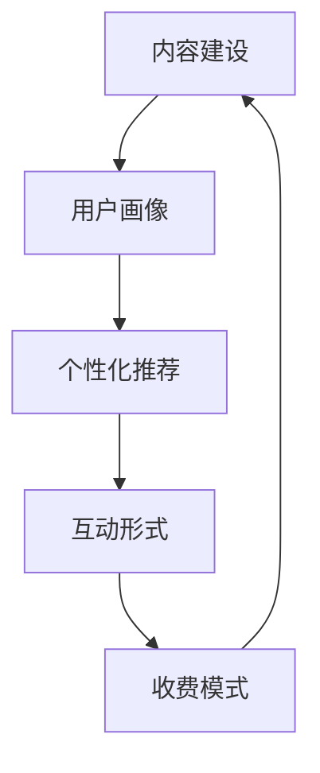

                 

# 如何在知识付费领域建立独特的竞争优势

## 1. 背景介绍

随着互联网的迅猛发展和数字化转型的深入，知识付费已成为内容产业的重要方向。在传统的出版、教育和培训等行业之外，知识付费产品通过数字化方式提供专业知识和服务，满足了市场对高效、定制化学习需求的增长。但随之而来的竞争激烈程度也日益加剧，如何在知识付费领域建立独特的竞争优势，成为众多从业者共同面临的挑战。

### 1.1 问题由来

近年来，随着数字内容的普及，知识付费市场呈现快速扩张趋势。在线课程、专业文章、音频视频等形式的知识产品，迅速崛起并抢占市场份额。然而，市场饱和、同质化竞争严重的问题也逐渐显现，竞争激烈且用户获取难度大。

### 1.2 问题核心关键点

在知识付费领域，竞争优势的核心在于内容质量和用户粘性。这不仅包括知识的深度和广度，还包括内容表达方式、互动形式、用户画像匹配度等维度。要在激烈的竞争中脱颖而出，需要构建差异化、个性化的内容体系，提升用户满意度和粘性，从而形成独特竞争优势。

### 1.3 问题研究意义

理解知识付费领域的核心竞争点，有助于从业者定位自身的市场位置，并根据用户需求设计出更具吸引力的产品。通过对产品设计和市场策略的优化，将有助于提升内容机构的行业地位，带动整个产业的健康发展。

## 2. 核心概念与联系

### 2.1 核心概念概述

在知识付费领域，建立独特竞争优势的关键在于对内容的深度理解和对用户需求的敏锐洞察。以下将从几个核心概念入手，分析其在知识付费产品中的作用：

- **内容建设**：通过高质量、高价值的内容吸引用户，构建品牌信任和影响力。
- **用户画像**：深入理解目标用户群体，提升内容的相关性和可接受度。
- **个性化推荐**：利用算法为用户推荐匹配度高的内容，提升用户体验。
- **互动形式**：通过多种互动形式增强用户参与度，促进内容的传播和反馈。
- **收费模式**：根据市场需求和用户付费意愿，设计灵活多样化的收费策略。

这些概念之间相辅相成，通过深入分析并合理应用，可以显著提升知识付费产品的市场竞争力和用户满意度。

### 2.2 核心概念原理和架构的 Mermaid 流程图



这个流程图展示了知识付费产品从内容建设到收费模式的整体流程。内容建设是基础，用户画像提供数据支撑，个性化推荐提升用户体验，互动形式增强参与感，最后通过多样化的收费模式实现商业变现。

## 3. 核心算法原理 & 具体操作步骤

### 3.1 算法原理概述

知识付费领域的内容推荐算法，旨在通过算法模型为用户推荐与其兴趣和需求高度匹配的内容，提升用户粘性和满意度。常见的算法框架包括协同过滤、基于内容的推荐、混合推荐等。

以协同过滤为例，其基本思想是分析用户的历史行为数据，找出相似用户群，并推荐这些用户喜欢的内容。算法流程大致如下：

1. 收集用户对内容的行为数据，如观看时长、评分等。
2. 构建用户-内容协同矩阵，记录用户对内容的评分和观看时长。
3. 使用算法（如基于用户的协同过滤、基于项目的协同过滤等），找出相似用户和内容。
4. 根据相似度，推荐用户未看过但相似用户喜欢的内容。

### 3.2 算法步骤详解

以下将具体描述基于协同过滤的推荐算法步骤：

**步骤1: 数据收集与预处理**

- 收集用户历史行为数据，包括对不同内容的观看时长、评分、收藏等行为数据。
- 对数据进行清洗和预处理，去除噪音数据和异常值，并填补缺失值。

**步骤2: 构建协同矩阵**

- 将用户和内容分别进行编码，形成用户向量（U）和内容向量（I）。
- 计算用户-内容矩阵$R_{ui}$，其中$R_{ui}$表示用户u对内容i的评分，若用户未对内容评分，则$R_{ui}=0$。
- 通过矩阵分解技术，得到用户特征矩阵$U$和内容特征矩阵$V$。

**步骤3: 计算相似度**

- 使用余弦相似度计算方法，计算用户向量间的相似度，得到相似度矩阵$P$。
- 根据相似度矩阵$P$，选择与目标用户u最相似的用户v。

**步骤4: 推荐内容**

- 计算用户u和内容v的相似度，并将相似度应用于内容矩阵$I$中，得到推荐内容的向量$W$。
- 根据内容向量$I$和推荐向量$W$，计算最终推荐内容集合。
- 排序推荐内容，选择评分较高和用户观看时长较长的内容优先推荐。

### 3.3 算法优缺点

**优点：**
- 简单易用，适合处理大规模数据集。
- 用户侧具有较高的个性化度，能够根据用户的历史行为推荐相关内容。

**缺点：**
- 冷启动问题严重，新用户难以有效推荐。
- 对内容稀疏性敏感，难以处理新内容。
- 存在数据偏差，推荐结果可能存在偏差。

### 3.4 算法应用领域

基于协同过滤的内容推荐算法，已经在多个知识付费平台得到应用，如Coursera、Udacity等。通过个性化推荐，这些平台能够吸引并留住用户，提升用户满意度和转化率。

## 4. 数学模型和公式 & 详细讲解

### 4.1 数学模型构建

协同过滤模型的核心数学框架基于矩阵分解。假设用户和内容分别有$m$和$n$条数据，用户对内容的评分矩阵为$R$，可以通过矩阵分解技术，将$R$分解为$U$和$V$的乘积，即：

$$
R \approx U \times V^T
$$

其中，$U$和$V$分别是用户特征矩阵和内容特征矩阵，$U \in R^{m \times k}, V \in R^{n \times k}$，$k$是特征向量的维度。

### 4.2 公式推导过程

以矩阵分解为基础，协同过滤的推荐算法推导如下：

**步骤1: 矩阵分解**

将用户评分矩阵$R$分解为：

$$
R_{ui} = \sum_{j=1}^k u_{uj}v_{ij}
$$

其中$u_{uj}$和$v_{ij}$分别是用户$u$和内容$i$在特征向量$j$上的值。

**步骤2: 相似度计算**

计算用户$u$和用户$v$的相似度，可通过余弦相似度公式：

$$
\cos(\theta_{uv}) = \frac{\sum_{j=1}^k u_{uj}v_{uj}}{\sqrt{\sum_{j=1}^k u_{uj}^2} \cdot \sqrt{\sum_{j=1}^k v_{uj}^2}}
$$

**步骤3: 推荐计算**

利用相似度矩阵$P$，得到与用户$u$最相似的用户$v$。根据相似度$P$和内容特征矩阵$V$，计算推荐内容向量$W$：

$$
W = P \cdot V
$$

其中$P$是相似度矩阵。

**步骤4: 最终推荐**

对推荐向量$W$进行排序，选择得分最高的内容推荐给用户$u$。

### 4.3 案例分析与讲解

以某知识付费平台的用户推荐系统为例，使用协同过滤算法进行内容推荐。

**数据集：**

- 用户行为数据：包含不同用户对内容的观看时长和评分数据。
- 内容信息：包括内容名称、作者、分类、时长等信息。

**模型构建：**

- 对用户行为数据进行预处理，去除噪音和异常值，并填补缺失值。
- 使用矩阵分解技术，对用户-内容评分矩阵进行分解，得到用户特征矩阵$U$和内容特征矩阵$V$。
- 通过余弦相似度计算用户相似度矩阵$P$。
- 根据相似度矩阵$P$和内容特征矩阵$V$，计算推荐内容向量$W$。
- 对推荐内容向量$W$进行排序，得到推荐内容集合，并推荐给用户。

通过该推荐系统，平台可以有效地提升用户粘性和满意度，增加用户留存率和消费转化率。

## 5. 项目实践：代码实例和详细解释说明

### 5.1 开发环境搭建

为了高效地进行知识付费平台的用户推荐系统开发，需要搭建一个适合深度学习和数据科学项目的环境。以下是具体的开发环境搭建步骤：

**步骤1: 安装Python**

- 从官网下载Python 3.x版本，并完成安装。

**步骤2: 安装相关库**

- 使用pip或conda安装PyTorch、TensorFlow、Scikit-learn等深度学习库。
- 安装NumPy、Pandas、Matplotlib等数据科学和可视化库。

**步骤3: 设置开发环境**

- 创建虚拟环境，并激活虚拟环境。
- 使用Jupyter Notebook或IDE搭建开发环境，支持Python和库的调用。

### 5.2 源代码详细实现

以下是一个基于协同过滤推荐算法的内容推荐系统的Python代码实现：

```python
import numpy as np
import pandas as pd
import torch
import torch.nn as nn
import torch.nn.functional as F
from sklearn.metrics.pairwise import cosine_similarity

# 数据集读取
data = pd.read_csv('user_behavior.csv')

# 数据预处理
# 填充缺失值，删除异常值，去除噪音数据等

# 构建用户和内容的特征矩阵
U = np.array(user_features)
V = np.array(content_features)

# 构建评分矩阵
R = np.dot(U, V.T)

# 计算相似度矩阵
P = cosine_similarity(U)

# 计算推荐内容向量
W = np.dot(P, V)

# 排序并输出推荐内容
sorted_indices = np.argsort(W)
top_recommendations = sorted_indices[::-1][:10]

# 输出推荐结果
for i in top_recommendations:
    print(content_names[i])
```

### 5.3 代码解读与分析

**数据预处理**

- 使用Pandas读取用户行为数据，并根据需求进行数据预处理。包括去除噪音、填补缺失值等操作。

**特征矩阵构建**

- 使用NumPy构建用户和内容的特征矩阵$U$和$V$。$U$和$V$分别表示用户和内容的特征向量。

**评分矩阵构建**

- 使用矩阵乘法计算评分矩阵$R$，$R$记录用户对内容的评分。

**相似度矩阵计算**

- 使用Scikit-learn的余弦相似度函数计算用户之间的相似度矩阵$P$。

**推荐内容向量计算**

- 通过矩阵乘法计算推荐内容向量$W$，$W$表示与用户最相似的内容。

**推荐内容排序**

- 对推荐内容向量$W$进行排序，选取得分最高的内容推荐给用户。

### 5.4 运行结果展示

运行上述代码后，输出推荐内容列表，供用户选择。推荐系统会根据用户历史行为数据，实时更新推荐内容，提升用户体验和满意度。

## 6. 实际应用场景

### 6.1 智慧教育

在智慧教育领域，知识付费平台可以为用户提供定制化的学习方案，提升学习效率和效果。通过推荐系统，平台能够根据学生的学习习惯和历史数据，推送匹配度高的学习内容。例如，某学生偏好数学、编程类课程，平台可以推荐相关的视频、课程和习题，满足学生个性化学习需求。

### 6.2 职业培训

在职业培训领域，平台可以提供针对性的职业技能培训内容，帮助用户提升专业技能。推荐系统可以根据用户的学习进度和反馈，动态调整推荐内容，确保培训效果。例如，某IT从业者希望提升数据分析能力，平台可以推荐相关的视频课程、案例分析等内容，提供系统化的学习路径。

### 6.3 企业内训

在企业内训领域，平台可以提供定制化的员工培训课程，提升团队的专业技能和职业素养。推荐系统可以根据员工的岗位需求和培训历史，推荐匹配度高的课程和学习资料。例如，某企业希望提升销售团队的客户管理能力，平台可以推荐销售技巧、客户分析、市场调研等方面的课程。

### 6.4 未来应用展望

未来，知识付费平台的用户推荐系统将更加智能化和个性化。随着机器学习、深度学习技术的进步，推荐系统将能够更好地理解用户需求，提供更精准的内容推荐。同时，结合自然语言处理、图像识别等多模态数据，推荐系统将提供更丰富的交互形式，提升用户体验。

## 7. 工具和资源推荐

### 7.1 学习资源推荐

**1. Coursera推荐系统课程**

Coursera提供了一门推荐系统的在线课程，由知名教授授课，涵盖协同过滤、基于内容的推荐、混合推荐等多个方面。课程中还包含实际项目案例，适合初学者和进阶开发者。

**2. 《推荐系统实战》书籍**

该书由亚马逊工程师撰写，详细介绍了推荐系统的理论基础和实际应用，涵盖协同过滤、内容推荐、特征工程等多个方面。书中提供了大量的案例和代码示例，适合动手实践。

### 7.2 开发工具推荐

**1. Jupyter Notebook**

Jupyter Notebook是Python数据科学和深度学习项目常用的开发环境，支持代码编写、数据可视化和交互式调试。

**2. PyTorch**

PyTorch是一个开源的深度学习框架，支持动态计算图和GPU加速，适用于快速迭代和原型开发。

### 7.3 相关论文推荐

**1. 《Item-based Collaborative Filtering Recommendation Systems》**

该论文详细介绍了协同过滤算法的基本原理和优化策略，是推荐系统领域的经典之作。

**2. 《A Framework of Recommendation System: Survey and Taxonomy》**

该论文综述了推荐系统的各个方面，包括协同过滤、基于内容的推荐、混合推荐等多个方向，适合系统性地学习推荐系统。

## 8. 总结：未来发展趋势与挑战

### 8.1 研究成果总结

知识付费领域的内容推荐系统，已经在多个领域得到了广泛应用，并取得了显著的效果。协同过滤算法作为其中的一种推荐方式，具有简单易用、个性化度高的优点，但同时也面临冷启动、数据稀疏性等问题。

### 8.2 未来发展趋势

未来，知识付费平台的内容推荐系统将向以下方向发展：

1. **智能推荐引擎**

通过深度学习和自然语言处理等技术，推荐系统将更加智能化，能够根据用户行为和上下文信息，提供更精准的推荐内容。

2. **多模态数据融合**

结合图像、视频等多模态数据，推荐系统将提供更加丰富的交互形式，提升用户体验。

3. **个性化推荐算法**

开发更加多样化的个性化推荐算法，如基于深度学习的推荐模型、联合推荐算法等，提升推荐精度。

### 8.3 面临的挑战

尽管推荐系统在知识付费领域已取得一定成就，但仍面临以下挑战：

1. **数据隐私与安全**

用户行为数据的隐私和安全问题需要重点关注，确保用户数据不被滥用。

2. **模型可解释性**

推荐系统的决策过程缺乏可解释性，难以理解模型的内部工作机制，需要提高算法的可解释性。

3. **冷启动问题**

新用户或新内容的推荐效果较差，需要探索更有效的冷启动策略。

4. **数据偏差**

推荐系统可能存在数据偏差，导致推荐结果不公平，需要提高算法的公平性。

### 8.4 研究展望

未来的推荐系统研究需要重点解决以上问题，同时探索新的推荐范式和技术，如因果推断、联邦学习等，以提升推荐系统的性能和用户体验。

## 9. 附录：常见问题与解答

**Q1: 推荐算法如何避免过拟合？**

A: 推荐算法中常见的过拟合问题，可以通过以下方法解决：

1. 数据增强：通过数据扩充、正则化等技术，增加训练数据的多样性，防止模型过拟合。

2. 特征选择：选择具有代表性和区分度的特征，避免特征冗余。

3. 模型集成：通过集成多个推荐模型，降低单一模型的过拟合风险。

4. 在线学习：使用在线学习算法，逐步更新模型，避免一次性大量数据过拟合。

**Q2: 推荐系统如何处理用户兴趣变化？**

A: 用户兴趣的变化是一个动态过程，推荐系统需要根据用户的新行为数据，实时调整推荐内容。以下是一些处理方法：

1. 动态特征更新：使用实时数据，更新用户和内容的特征向量，动态调整推荐内容。

2. 滑动窗口：使用滑动窗口技术，在一段时间内观察用户的行为变化，及时调整推荐策略。

3. 在线学习：使用在线学习算法，根据用户新行为数据，逐步调整推荐模型。

4. 推荐冷启动：对新用户和新内容，采用启发式推荐或推荐榜，逐步过渡到基于数据的推荐。

**Q3: 推荐系统如何提升推荐精度？**

A: 推荐系统可以通过以下方法提升推荐精度：

1. 数据预处理：对用户行为数据进行清洗、去噪和归一化处理，提升数据质量。

2. 特征工程：选择合适的特征，并进行特征组合和特征转换，提高模型的预测能力。

3. 模型优化：使用深度学习、协同过滤等算法，并结合多个模型的优势，提升推荐精度。

4. 用户反馈：引入用户反馈机制，如评分、点击率等，优化推荐算法。

5. 上下文感知：结合用户上下文信息，如时间、地点、心情等，提供更精准的推荐内容。

**Q4: 推荐系统如何提升用户满意度？**

A: 推荐系统可以通过以下方法提升用户满意度：

1. 个性化推荐：根据用户历史行为和兴趣，提供个性化推荐内容。

2. 多样性控制：控制推荐内容的多样性，避免用户陷入信息茧房。

3. 推荐时机：根据用户活跃时间，提供合适的推荐时机，提升用户互动率。

4. 推荐评价：引入推荐评价机制，根据用户反馈调整推荐策略。

5. 推荐榜和精选内容：通过推荐榜和精选内容，提升用户对平台的信任和满意度。

**Q5: 推荐系统如何平衡个性化和公平性？**

A: 推荐系统需要在个性化推荐和公平性之间找到平衡点，以下是一些处理方法：

1. 公平性约束：在推荐算法中加入公平性约束，确保不同用户间的推荐结果公平。

2. 多样性推荐：通过多样性控制算法，避免推荐结果过于集中。

3. 用户选择权：给予用户选择权，让用户自主选择推荐内容，提升用户体验。

4. 推荐榜：通过推荐榜，展示多样性和公平性兼顾的内容，提升用户满意度。

**Q6: 推荐系统如何处理长尾需求？**

A: 推荐系统可以通过以下方法处理长尾需求：

1. 长尾内容推荐：对长尾内容进行特征增强和排名优化，提升长尾内容的推荐效果。

2. 小众用户推荐：通过小众用户模型，识别并推荐有潜力的长尾用户。

3. 长尾数据分析：对长尾内容的用户行为数据进行深入分析，发现新的推荐机会。

4. 长尾推荐策略：根据长尾内容的特点，设计专门的推荐策略，提升推荐效果。

---

作者：禅与计算机程序设计艺术 / Zen and the Art of Computer Programming

