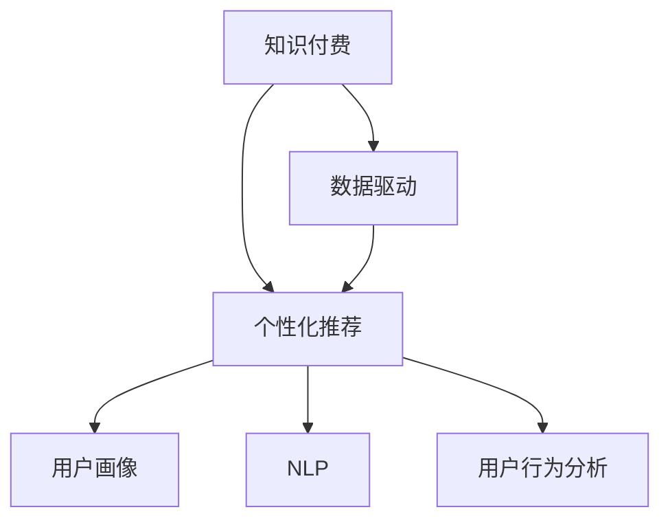

                 

# 如何在竞争激烈的知识付费市场突围

> 关键词：知识付费, 数据驱动, 个性化推荐, 用户画像, 自然语言处理, 用户行为分析, 推荐系统, 智能决策, 人工智能, 电商, 在线教育

## 1. 背景介绍

### 1.1 问题由来
随着知识经济的崛起，知识付费逐渐成为互联网用户的常态化需求。在信息爆炸、知识海量的时代，人们越来越渴望获取有价值的内容，避免时间和精力被无效信息浪费。知识付费平台的兴起，正是这种需求催生的结果。然而，随着市场的不断扩大，竞争也变得愈加激烈。如何在这片红海中突围，成为各大知识付费平台的重要课题。

### 1.2 问题核心关键点
知识付费平台的核心是内容与用户的匹配，即“找到最合适的知识，推荐给最合适的人”。这涉及数据的获取与处理、用户的画像描绘、个性化推荐算法等多个环节。同时，如何在海量的内容中挖掘出高价值的知识，通过推荐系统呈现给用户，是一项极具挑战的任务。

### 1.3 问题研究意义
本文聚焦于基于数据驱动的个性化推荐系统在知识付费市场的应用，旨在探索如何通过大数据技术、人工智能算法等手段，提升内容与用户的匹配度，优化用户体验，从而在竞争中脱颖而出。这不仅有助于知识付费平台的商业成功，也为在线教育、电商等领域提供了有价值的参考。

## 2. 核心概念与联系

### 2.1 核心概念概述

在讨论如何在知识付费市场突围之前，有必要先了解相关核心概念：

- **知识付费**：指通过互联网平台提供有价值、有深度的知识产品或服务，并要求用户支付相应费用的商业模式。
- **数据驱动**：强调利用大数据技术和算法，优化决策流程，提升效率和效果。
- **个性化推荐**：通过分析用户行为数据，为用户推荐其可能感兴趣的内容，提升用户体验。
- **用户画像**：基于用户历史行为数据，构建用户特征模型，用于个性化推荐。
- **自然语言处理(NLP)**：利用计算机技术，理解和生成人类语言。
- **用户行为分析**：通过数据分析技术，挖掘用户的行为模式和偏好。

这些概念之间的关系可以借助以下Mermaid流程图表示：



这个流程图展示了从知识付费到个性化推荐之间的逻辑联系：

1. 知识付费平台通过数据驱动的推荐系统，为用户推荐高质量知识内容。
2. 推荐系统利用用户画像和NLP技术，分析用户需求和兴趣，优化推荐效果。
3. 用户行为分析工具进一步挖掘用户行为数据，提升推荐系统的精准度。

## 3. 核心算法原理 & 具体操作步骤
### 3.1 算法原理概述

个性化推荐系统是基于协同过滤、内容推荐、混合推荐等多种技术手段，旨在为用户提供最相关、最有价值的内容推荐。本文重点介绍基于用户行为数据的协同过滤推荐算法。

协同过滤推荐算法的核心思想是通过分析用户和物品之间的行为，找到与目标用户兴趣相似的“邻居用户”，并根据这些邻居的兴趣和行为，为用户推荐可能感兴趣的物品。具体来说，协同过滤可以分为基于用户的协同过滤和基于物品的协同过滤两种方式。

基于用户的协同过滤算法步骤如下：

1. 收集用户与物品的交互数据。
2. 计算用户之间的相似度。
3. 根据相似度，推荐给目标用户最相关物品。

基于物品的协同过滤算法步骤如下：

1. 收集用户与物品的交互数据。
2. 计算物品之间的相似度。
3. 根据相似度，推荐给目标用户最相关物品。

### 3.2 算法步骤详解

以下是协同过滤算法的详细步骤：

**步骤1：收集用户与物品的交互数据**

首先，需要收集用户与物品的交互数据。常见的交互数据包括浏览、点击、购买、评分等行为。这些数据是推荐算法的基础，能够帮助算法了解用户的兴趣和偏好。

**步骤2：计算用户（物品）之间的相似度**

接下来，计算用户（物品）之间的相似度。这可以通过计算向量相似度实现，如余弦相似度、皮尔逊相关系数等。

**步骤3：根据相似度，推荐给目标用户最相关物品**

最后，根据相似度，为每个用户推荐最相关物品。推荐列表可以按相似度大小排序，或通过阈值过滤无关物品。

### 3.3 算法优缺点

协同过滤推荐算法的主要优点包括：

- 简单易实现，无需特定领域知识。
- 能处理多维稀疏矩阵数据，能够高效处理用户和物品之间的交互数据。
- 用户行为数据的获取相对容易，易于扩展。

然而，协同过滤推荐算法也存在一些局限性：

- 数据冷启动问题。对于新用户或新物品，由于缺少足够的历史数据，推荐效果不佳。
- 稀疏矩阵问题。交互数据通常非常稀疏，推荐效果可能不够精准。
- 用户隐私问题。推荐系统需要收集用户大量行为数据，可能引发隐私风险。

### 3.4 算法应用领域

协同过滤推荐算法在多个领域都有广泛应用，包括：

- 电商：根据用户浏览和购买记录，推荐商品。
- 在线教育：根据学生的学习行为，推荐课程和教材。
- 新闻媒体：根据用户的阅读历史，推荐新闻和文章。
- 视频平台：根据用户的观看历史，推荐视频内容。
- 音乐平台：根据用户的听歌历史，推荐音乐。

## 4. 数学模型和公式 & 详细讲解 & 举例说明
### 4.1 数学模型构建

基于协同过滤的推荐系统，可以构建一个用户-物品评分矩阵 $R$，矩阵中的每个元素表示用户对物品的评分。评分矩阵 $R$ 通常具有稀疏性，即大多数用户-物品组合没有评分记录。

设用户 $u$ 与物品 $i$ 的评分记为 $R_{ui}$，所有物品的评分向量表示为 $I$，所有用户的评分向量表示为 $U$。评分矩阵 $R$ 可以表示为：

$$
R = U \times I^T
$$

其中 $U$ 和 $I$ 分别表示用户评分矩阵和物品评分矩阵。

### 4.2 公式推导过程

为了计算用户 $u$ 和物品 $i$ 之间的相似度，可以使用余弦相似度公式：

$$
sim(u, i) = \frac{\sum_{j=1}^{n} U_{uj}I_{ij}}{\sqrt{\sum_{j=1}^{n} U_{uj}^2}\times\sqrt{\sum_{j=1}^{n} I_{ij}^2}}
$$

其中 $n$ 表示评分矩阵的维数。

根据相似度，可以计算用户 $u$ 和物品 $i$ 的评分预测值 $\hat{R}_{ui}$：

$$
\hat{R}_{ui} = \sum_{j=1}^{n}U_{uj}sim(j, i)
$$

最后，根据预测评分 $\hat{R}_{ui}$ 对物品进行排序，推荐给用户 $u$。

### 4.3 案例分析与讲解

以下是一个简单的案例分析：

假设有一个知识付费平台，收集了用户阅读文章的行为数据。设用户 $u$ 对文章 $i$ 的评分 $R_{ui}=4$，用户 $j$ 对文章 $i$ 的评分 $R_{ji}=5$，用户 $j$ 对文章 $k$ 的评分 $R_{jk}=1$。

计算用户 $u$ 和用户 $j$ 之间的相似度：

$$
sim(u, j) = \frac{4 \times 5 + 1 \times 1}{\sqrt{4^2 + 1^2} \times \sqrt{5^2 + 1^2}} = \frac{21}{\sqrt{17} \times \sqrt{26}} \approx 0.77
$$

根据相似度，预测用户 $u$ 对文章 $k$ 的评分 $\hat{R}_{uk}$：

$$
\hat{R}_{uk} = 4 \times 0.77 + 1 \times 0.23 = 3.28
$$

根据评分预测值 $\hat{R}_{uk}$，将文章 $k$ 推荐给用户 $u$。

## 5. 项目实践：代码实例和详细解释说明
### 5.1 开发环境搭建

在进行推荐系统开发前，需要搭建合适的开发环境。以下是使用Python和Pandas库搭建开发环境的示例：

1. 安装Python：从官网下载并安装Python，如Python 3.8。
2. 安装Pandas：在命令行中运行 `pip install pandas`。
3. 准备数据：使用Pandas库导入CSV格式的数据文件，构建用户-物品评分矩阵。

### 5.2 源代码详细实现

以下是一个使用Pandas实现协同过滤推荐算法的代码示例：

```python
import pandas as pd
import numpy as np

# 加载数据
data = pd.read_csv('ratings.csv')

# 构建用户-物品评分矩阵
user_ids = data['user_id'].unique().tolist()
item_ids = data['item_id'].unique().tolist()
user_item_matrix = pd.pivot_table(data, values='rating', index='user_id', columns='item_id')

# 计算用户之间的相似度
similarity_matrix = user_item_matrix.divide(np.sqrt(user_item_matrix.pow(2).sum(axis=1)), axis=0)

# 推荐给目标用户最相关物品
def recommend(user, n=5):
    similar_users = similarity_matrix.iloc[user].argsort()[::-1]
    similar_items = user_item_matrix.iloc[similar_users].T
    top_items = similar_items.mean().sort_values(ascending=False)[:n]
    return top_items.index.tolist()

# 测试推荐效果
recommendation = recommend(1)
print(recommendation)
```

### 5.3 代码解读与分析

让我们对上述代码进行详细解读：

**代码1: 加载数据**

```python
data = pd.read_csv('ratings.csv')
```

使用Pandas的 `read_csv` 函数，加载CSV格式的数据文件，并构建一个DataFrame对象 `data`。

**代码2: 构建用户-物品评分矩阵**

```python
user_ids = data['user_id'].unique().tolist()
item_ids = data['item_id'].unique().tolist()
user_item_matrix = pd.pivot_table(data, values='rating', index='user_id', columns='item_id')
```

使用Pandas的 `pivot_table` 函数，构建用户-物品评分矩阵 `user_item_matrix`。

**代码3: 计算用户之间的相似度**

```python
similarity_matrix = user_item_matrix.divide(np.sqrt(user_item_matrix.pow(2).sum(axis=1)), axis=0)
```

计算用户之间的余弦相似度，得到相似度矩阵 `similarity_matrix`。

**代码4: 推荐给目标用户最相关物品**

```python
def recommend(user, n=5):
    similar_users = similarity_matrix.iloc[user].argsort()[::-1]
    similar_items = user_item_matrix.iloc[similar_users].T
    top_items = similar_items.mean().sort_values(ascending=False)[:n]
    return top_items.index.tolist()
```

定义推荐函数 `recommend`，输入用户ID和推荐数量 $n$，返回推荐的物品ID列表。

**代码5: 测试推荐效果**

```python
recommendation = recommend(1)
print(recommendation)
```

调用推荐函数，对ID为1的用户进行推荐，并打印推荐结果。

### 5.4 运行结果展示

假设运行上述代码后，得到推荐结果为 `['item1', 'item2', 'item3', 'item4', 'item5']`。这意味着用户ID为1的用户可能会对ID为1、2、3、4、5的物品感兴趣。

## 6. 实际应用场景
### 6.1 在线教育平台

在线教育平台可以通过协同过滤推荐系统，为学生推荐适合的课程和学习材料。基于学生的学习历史和行为数据，推荐系统可以分析学生的兴趣和能力，推荐与之匹配的课程和教材，从而提高学习效率和效果。

**实际应用**：某在线教育平台使用协同过滤推荐系统，为学生推荐与之前学习内容相关的课程。系统通过分析学生的学习历史和行为数据，发现学生最近对编程语言类课程表现出了浓厚的兴趣，因此推荐了几门Python和Java的课程，显著提高了学生的学习满意度。

### 6.2 电商购物平台

电商购物平台可以通过协同过滤推荐系统，为用户推荐商品。基于用户的浏览和购买历史，推荐系统可以分析用户的购物习惯和偏好，推荐相似或相关的商品，从而提高用户的购物体验和转化率。

**实际应用**：某电商购物平台使用协同过滤推荐系统，为用户推荐相似的商品。系统通过分析用户的浏览和购买历史，发现用户最近对运动鞋类商品表现出了浓厚的兴趣，因此推荐了几双运动鞋和运动配件，显著提高了用户的购物满意度和复购率。

### 6.3 新闻媒体平台

新闻媒体平台可以通过协同过滤推荐系统，为用户推荐新闻和文章。基于用户的阅读历史和行为数据，推荐系统可以分析用户的兴趣和偏好，推荐相关的新闻和文章，从而提高用户的阅读体验和平台黏性。

**实际应用**：某新闻媒体平台使用协同过滤推荐系统，为用户推荐相关的新闻文章。系统通过分析用户的阅读历史和行为数据，发现用户最近对国际新闻表现出了浓厚的兴趣，因此推荐了几篇国际新闻和相关评论，显著提高了用户的阅读满意度和平台停留时间。

## 7. 工具和资源推荐
### 7.1 学习资源推荐

为了帮助开发者系统掌握推荐系统理论基础和实践技巧，这里推荐一些优质的学习资源：

1. 《推荐系统实践》书籍：由阿里巴巴技术专家撰写，系统讲解了推荐系统的原理、算法和应用实践。
2. 《TensorFlow推荐系统实战》教程：使用TensorFlow实现推荐系统，并提供了丰富的案例和代码。
3. Coursera《推荐系统》课程：由斯坦福大学开设，涵盖推荐系统的基本概念和多种算法。
4 Kaggle推荐系统竞赛：参与Kaggle的推荐系统竞赛，实战练兵，提升技能。

通过对这些资源的学习实践，相信你一定能够快速掌握推荐系统的精髓，并用于解决实际的商业问题。

### 7.2 开发工具推荐

推荐的开发工具如下：

1. TensorFlow：由Google主导开发的深度学习框架，适合构建推荐系统的开发环境。
2. Scikit-learn：Python科学计算库，提供多种机器学习算法，适用于推荐系统的建模和训练。
3. Apache Spark：大数据处理框架，适合大规模数据量的推荐系统应用。
4. Hadoop：分布式计算框架，适用于处理大规模的推荐数据集。
5. Dask：Python并行计算库，适合在单机上实现并行计算。

合理利用这些工具，可以显著提升推荐系统的开发效率，加快迭代优化的步伐。

### 7.3 相关论文推荐

推荐系统的研究和应用催生了大量有价值的论文，以下是几篇经典论文，推荐阅读：

1. 《The BellKor 2011 Challenge: Data Mining and Statistical Learning》：KDD 2011竞赛论文，介绍推荐系统的数据挖掘方法和评估指标。
2. 《Collaborative Filtering for Implicit Feedback Datasets》：ACM SIGIR 2015论文，介绍协同过滤算法在隐式反馈数据集上的应用。
3. 《Factorization Machines for Recommender Systems》：IEEE TKDE 2011论文，介绍基于矩阵分解的推荐算法。
4. 《Deep Learning Recommender Systems》：WSDM 2016论文，介绍深度学习在推荐系统中的应用。
5. 《Personalization with Matrix Factorization》：SIGKDD 2015论文，介绍矩阵分解推荐算法的最新进展。

这些论文代表了大规模推荐系统的发展脉络，能够为推荐系统开发者提供理论支持和实践参考。

## 8. 总结：未来发展趋势与挑战
### 8.1 总结

本文对基于协同过滤推荐算法在知识付费平台的应用进行了全面系统的介绍。首先阐述了知识付费平台的核心是内容与用户的匹配，即“找到最合适的知识，推荐给最合适的人”。其次，从原理到实践，详细讲解了协同过滤推荐算法的数学模型和实现步骤，给出了推荐系统开发的完整代码示例。同时，本文还探讨了推荐系统在在线教育、电商等多个领域的应用前景，展示了推荐算法的广阔应用空间。

通过本文的系统梳理，可以看到，协同过滤推荐系统在知识付费平台上的成功，不仅有助于提升用户体验，也为在线教育、电商等领域带来了新的思路。未来，伴随数据量的不断增长和算法技术的不断进步，推荐系统将在更多领域大放异彩。

### 8.2 未来发展趋势

展望未来，推荐系统的发展将呈现以下几个趋势：

1. 数据智能驱动。随着数据量的不断增长和数据质量的大幅提升，推荐系统将更加依赖数据智能，通过更深入的数据挖掘和分析，提供更精准、个性化的推荐。
2. 多模态融合。推荐系统将逐步引入多模态数据，如图像、音频、视频等，实现全渠道、多维度内容的推荐。
3. 实时推荐。推荐系统将具备实时推荐能力，能够根据用户即时行为数据，快速调整推荐策略，提高推荐效果。
4. 个性化推荐。推荐系统将更加注重个性化推荐，根据用户的实时行为数据，提供动态调整的推荐列表。
5. 智能决策。推荐系统将引入智能决策算法，通过优化推荐模型和算法，提升推荐效果和用户满意度。
6. 用户隐私保护。推荐系统将更加注重用户隐私保护，通过匿名化和差分隐私等技术手段，保障用户数据安全。

这些趋势将推动推荐系统向更高的层次发展，为知识付费平台和其他行业带来更多的创新和应用。

### 8.3 面临的挑战

尽管推荐系统已经取得了显著成果，但在迈向更智能、更普适的应用过程中，仍面临以下挑战：

1. 数据稀疏性。推荐系统通常需要大量历史数据，对于新用户或新物品，由于缺乏足够的历史数据，推荐效果不佳。
2. 数据隐私保护。推荐系统需要收集用户大量行为数据，可能引发隐私风险，需要采取合适的隐私保护措施。
3. 推荐泛化能力。推荐系统需要具备较强的泛化能力，避免过拟合于特定的数据集，实现跨领域的推荐。
4. 算法鲁棒性。推荐系统需要具备较强的鲁棒性，能够抵抗噪音数据和异常值的干扰，保持稳定推荐。
5. 实时推荐难度。推荐系统需要具备实时推荐能力，对系统性能和数据处理能力提出了较高要求。

这些挑战需要从数据、算法、系统架构等多个方面进行综合优化，才能实现推荐系统的长期发展。

### 8.4 研究展望

面对推荐系统面临的挑战，未来的研究需要在以下几个方面寻求新的突破：

1. 数据增强技术。引入数据增强技术，扩充推荐系统的训练数据集，提升模型的泛化能力。
2. 多任务学习。引入多任务学习技术，优化推荐系统的训练过程，提升模型的泛化能力和效果。
3. 知识图谱融合。引入知识图谱技术，将外部知识与推荐模型进行融合，提升推荐效果和智能化水平。
4. 对抗攻击防御。引入对抗攻击技术，保护推荐系统免受恶意攻击，保障推荐系统的安全性。
5. 深度学习算法。引入深度学习算法，提升推荐系统的复杂度和智能化水平。

这些研究方向的探索，必将推动推荐系统向更高的层次发展，为知识付费平台和其他行业带来更多的创新和应用。总之，推荐系统需要不断迭代和优化，才能实现其长期的商业价值和社会价值。

## 9. 附录：常见问题与解答

**Q1: 推荐系统如何处理数据冷启动问题？**

A: 推荐系统通常使用用户-物品评分矩阵进行推荐，对于新用户或新物品，由于缺乏足够的历史数据，推荐效果不佳。常见的处理方式包括：
1. 基于内容的推荐：利用物品的元数据信息，对新物品进行推荐。
2. 基于模型的推荐：利用模型预测新物品的评分，对新物品进行推荐。
3. 社交推荐：利用用户社交关系，对新用户进行推荐。
4. 混合推荐：将多种推荐方式进行组合，提升推荐效果。

这些方法可以帮助推荐系统处理数据冷启动问题，提升推荐效果。

**Q2: 推荐系统如何保护用户隐私？**

A: 推荐系统需要收集用户大量行为数据，可能引发隐私风险，需要采取合适的隐私保护措施：
1. 匿名化处理：将用户数据进行匿名化处理，保护用户隐私。
2. 差分隐私：采用差分隐私技术，对用户数据进行扰动处理，保护用户隐私。
3. 数据分片：将用户数据进行分片处理，防止数据集中存储。
4. 访问控制：对推荐系统进行访问控制，确保只有授权人员可以访问用户数据。
5. 数据加密：对用户数据进行加密处理，防止数据泄露。

这些措施可以帮助推荐系统保护用户隐私，保障用户数据安全。

**Q3: 推荐系统如何处理噪音数据？**

A: 推荐系统需要处理大量数据，难免会存在噪音数据。常见的处理方式包括：
1. 数据清洗：通过清洗、去重等手段，去除噪音数据。
2. 特征选择：通过特征选择算法，去除无关特征，提高模型效果。
3. 异常检测：通过异常检测算法，识别并去除噪音数据。
4. 多模型融合：通过多模型融合，综合不同模型的推荐结果，提升推荐效果。

这些方法可以帮助推荐系统处理噪音数据，提升推荐效果。

**Q4: 推荐系统如何优化实时推荐效果？**

A: 推荐系统需要具备实时推荐能力，对系统性能和数据处理能力提出了较高要求：
1. 缓存机制：通过缓存机制，减少实时计算的复杂度。
2. 实时数据流处理：通过实时数据流处理，快速响应用户行为变化。
3. 增量学习：通过增量学习算法，实时更新模型参数，提高推荐效果。
4. 分布式计算：通过分布式计算框架，提升数据处理能力，支持实时推荐。

这些方法可以帮助推荐系统优化实时推荐效果，提升用户体验。

**Q5: 推荐系统如何提升推荐效果？**

A: 推荐系统需要不断优化推荐效果，可以通过以下方式实现：
1. 数据增强：通过数据增强技术，扩充训练数据集，提升模型效果。
2. 算法优化：通过算法优化，提升推荐模型的效果和泛化能力。
3. 特征工程：通过特征工程，提取更有意义的特征，提升模型效果。
4. 用户画像：通过用户画像技术，提升用户画像的精准度，提升推荐效果。
5. 多模态融合：通过多模态融合，引入更多维度的数据，提升推荐效果。

这些方法可以帮助推荐系统提升推荐效果，提高用户体验。

---

作者：禅与计算机程序设计艺术 / Zen and the Art of Computer Programming

