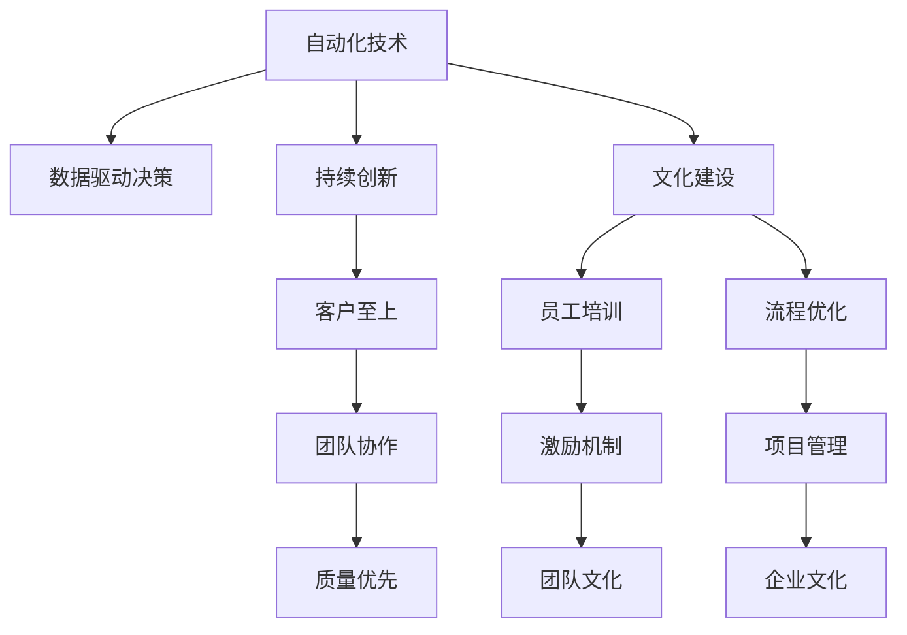

                 

# 如何在自动化创业中建立企业文化

## 1. 背景介绍

### 1.1 问题由来

自动化创业，是指通过自动化技术提升企业运营效率，降低成本，提高生产力的创业模式。随着科技的进步，人工智能、机器学习、大数据等技术逐渐成熟，为企业自动化提供了强大的工具和平台。然而，自动化创业不仅需要在技术层面实现突破，更需要建立符合其特点的企业文化，以确保项目的顺利推进和成功落地。

### 1.2 问题核心关键点

企业文化，是指企业内部的价值观、行为规范和团队氛围的综合体现。对于自动化创业企业，其企业文化应具备以下特点：

1. 数据驱动：强调数据和事实的决策基础，以数据为依据进行决策。
2. 持续创新：鼓励创新思维和跨领域协作，不断探索新技术和新方法。
3. 客户至上：以客户需求为导向，关注用户体验和满意度。
4. 团队协作：强调团队合作，鼓励知识共享和协作精神。
5. 质量优先：坚持高质量标准，追求卓越的业务成果。

## 2. 核心概念与联系

### 2.1 核心概念概述

在自动化创业中，建立企业文化的核心概念主要包括：

- **自动化技术**：指通过自动化工具和平台，实现生产、运营等环节的自动化，提升效率和准确性。
- **数据驱动决策**：利用数据分析和机器学习模型，辅助决策过程，提升决策质量和效率。
- **持续创新**：鼓励团队不断探索新技术和新方法，以适应市场变化和技术演进。
- **客户至上**：以客户需求为中心，不断优化产品和服务，提高客户满意度。
- **团队协作**：强调团队成员之间的合作和沟通，促进知识共享和创新。
- **质量优先**：坚持高标准，确保产品和服务质量，提升用户信任度。

### 2.2 核心概念原理和架构的 Mermaid 流程图



### 2.3 核心概念联系

在自动化创业中，自动化技术、数据驱动决策、持续创新、客户至上、团队协作和质量优先等核心概念相互联系，共同构成企业文化的基石。自动化技术是实现数据驱动决策和持续创新的基础，客户至上是企业文化的核心，团队协作和质量优先则确保了企业文化的执行和落实。

## 3. 核心算法原理 & 具体操作步骤

### 3.1 算法原理概述

建立自动化创业企业文化，可以通过以下核心算法和操作步骤实现：

1. **数据收集与分析**：收集和分析企业内外部数据，识别关键指标和业务瓶颈，为决策提供数据支持。
2. **模型训练与优化**：利用机器学习模型对数据进行建模，优化模型参数，提高预测准确性和效率。
3. **流程设计与优化**：设计和管理自动化流程，利用模型优化流程，提高工作效率和质量。
4. **激励机制设计**：建立合理的激励机制，激励员工积极参与创新和协作。
5. **团队文化塑造**：通过培训、团队建设等方式，塑造和传播企业文化价值观。

### 3.2 算法步骤详解

#### 3.2.1 数据收集与分析

1. **数据来源**：收集企业内部运营数据、客户反馈数据、市场数据等。
2. **数据清洗**：去除无效数据、处理缺失值、异常值等。
3. **数据建模**：利用机器学习模型对数据进行建模，如回归模型、分类模型、聚类模型等。
4. **指标评估**：设定关键绩效指标(KPI)，如运营效率、客户满意度、项目进度等，对模型进行评估和优化。

#### 3.2.2 模型训练与优化

1. **模型选择**：选择适合问题的机器学习模型，如线性回归、决策树、神经网络等。
2. **数据划分**：将数据划分为训练集、验证集和测试集。
3. **模型训练**：利用训练集对模型进行训练，调整模型参数，提高模型准确性。
4. **模型验证**：在验证集上评估模型性能，调整模型参数，防止过拟合。
5. **模型优化**：利用正则化、Dropout、Early Stopping等技术优化模型，提升模型泛化能力。

#### 3.2.3 流程设计与优化

1. **流程定义**：明确自动化流程的步骤、输入、输出和相关角色。
2. **模型集成**：将优化后的模型集成到流程中，实现自动化。
3. **流程监控**：利用监控工具实时跟踪流程执行情况，及时发现和解决问题。
4. **流程优化**：根据监控结果和用户反馈，不断优化流程，提高效率和质量。

#### 3.2.4 激励机制设计

1. **奖励机制**：设立奖励机制，激励员工参与创新和协作。
2. **考核机制**：设定考核指标，评估员工表现，提供反馈和改进建议。
3. **团队建设**：定期组织团队建设活动，增强团队凝聚力和合作精神。
4. **文化宣传**：通过内部宣传、培训等方式，传播企业文化价值观。

#### 3.2.5 团队文化塑造

1. **文化培训**：定期进行企业文化培训，提高员工对企业文化的认同感。
2. **文化活动**：组织文化活动，如团队建设、主题演讲、读书会等，传播企业文化。
3. **文化融合**：将企业文化与日常工作紧密结合，形成文化自觉。
4. **文化评估**：定期进行企业文化评估，识别和解决问题，促进文化进步。

### 3.3 算法优缺点

#### 3.3.1 优点

1. **数据驱动**：通过数据分析和建模，为企业决策提供科学依据。
2. **持续创新**：利用模型优化流程，提高效率和质量。
3. **团队协作**：通过激励机制和文化建设，促进团队合作和知识共享。
4. **质量优先**：通过模型优化和流程改进，确保高质量输出。
5. **客户至上**：利用客户反馈数据，优化产品和服务，提高客户满意度。

#### 3.3.2 缺点

1. **数据依赖**：数据质量和数量直接影响模型效果。
2. **模型复杂**：复杂模型需要较多时间和计算资源，可能影响实际应用。
3. **流程优化难度大**：流程设计和优化需要充分理解和专业知识，难度较大。
4. **文化认同难**：企业文化建设需要时间，员工可能需要较长时间才能适应和认同。
5. **激励机制设计复杂**：需要根据企业特点和员工需求，设计合理的激励机制。

### 3.4 算法应用领域

自动化创业企业文化的建立，主要应用于以下领域：

1. **生产运营**：通过自动化技术优化生产流程，提高生产效率和质量。
2. **客户服务**：利用数据驱动决策和客户反馈，提升客户满意度和忠诚度。
3. **市场营销**：利用数据分析和模型优化，制定精准的市场营销策略。
4. **人力资源管理**：通过激励机制和文化建设，提高员工满意度和工作效率。
5. **财务管理**：利用数据分析和模型优化，优化财务流程，提高财务效率和准确性。

## 4. 数学模型和公式 & 详细讲解 & 举例说明

### 4.1 数学模型构建

在自动化创业中，常用的数学模型包括回归模型、分类模型、聚类模型等。以线性回归模型为例，其数学模型为：

$$y = \beta_0 + \beta_1x_1 + \beta_2x_2 + \cdots + \beta_nx_n + \epsilon$$

其中，$y$ 为输出，$\beta_0$ 为截距，$\beta_i$ 为第 $i$ 个自变量的系数，$x_i$ 为第 $i$ 个自变量，$\epsilon$ 为随机误差项。

### 4.2 公式推导过程

#### 4.2.1 最小二乘法

线性回归模型的最小二乘法优化目标为：

$$\min_{\beta} \sum_{i=1}^n (y_i - (\beta_0 + \beta_1x_{i1} + \beta_2x_{i2} + \cdots + \beta_nx_{in}))^2$$

推导过程中，通过求解偏导数等于0的方程组，可以得到模型参数的最优解：

$$\beta_i = \frac{\sum_{i=1}^n (x_{i_i} - \bar{x}_i)(y_i - \bar{y})}{\sum_{i=1}^n (x_{i_i} - \bar{x}_i)^2}$$

其中，$\bar{x}_i$ 和 $\bar{y}$ 分别为自变量和因变量的均值。

#### 4.2.2 多变量回归

多变量线性回归模型为：

$$y = \beta_0 + \beta_1x_{11} + \beta_2x_{12} + \cdots + \beta_nx_{1n} + \cdots + \beta_0' + \beta_1'x_{n1} + \beta_2'x_{n2} + \cdots + \beta_n'x_{nn} + \epsilon$$

其中，$x_{ij}$ 表示第 $i$ 个样本的第 $j$ 个自变量。

推导过程与单变量回归类似，只需要将公式扩展到多个自变量即可。

### 4.3 案例分析与讲解

#### 4.3.1 生产运营

假设某自动化创业公司生产汽车零部件，需要通过数据分析优化生产流程。收集车间设备运行数据、工人操作数据、原材料供应数据等，建立多变量回归模型，预测生产效率和质量。通过模型训练和优化，找到最优的生产参数组合，提高生产效率和质量。

#### 4.3.2 客户服务

某电商公司利用客户反馈数据和订单数据，建立客户满意度模型，预测客户行为和购买意向。通过模型优化，制定精准的营销策略，提高客户满意度和忠诚度。

#### 4.3.3 市场营销

某广告公司利用数据分析和机器学习模型，优化广告投放策略。通过多变量回归模型，预测广告效果和ROI，制定精准的广告投放方案，提高广告效果和投资回报率。

## 5. 项目实践：代码实例和详细解释说明

### 5.1 开发环境搭建

1. **安装Python**：下载并安装Python，建议使用Python 3.8及以上版本。
2. **安装Pandas和NumPy**：通过pip安装Pandas和NumPy库，用于数据处理和分析。
3. **安装Scikit-learn**：通过pip安装Scikit-learn库，用于建立机器学习模型。
4. **安装Matplotlib**：通过pip安装Matplotlib库，用于数据可视化。
5. **安装Jupyter Notebook**：下载并安装Jupyter Notebook，用于编写和运行Python代码。

### 5.2 源代码详细实现

#### 5.2.1 数据收集与分析

```python
import pandas as pd
import numpy as np

# 读取数据
data = pd.read_csv('data.csv')

# 数据清洗
data.dropna(inplace=True)

# 数据可视化
import matplotlib.pyplot as plt
plt.scatter(data['x1'], data['y'], color='blue')
plt.xlabel('x1')
plt.ylabel('y')
plt.show()
```

#### 5.2.2 模型训练与优化

```python
from sklearn.linear_model import LinearRegression
from sklearn.model_selection import train_test_split
from sklearn.metrics import mean_squared_error

# 数据划分
X_train, X_test, y_train, y_test = train_test_split(data[['x1', 'x2', 'x3']], data['y'], test_size=0.2, random_state=42)

# 模型训练
model = LinearRegression()
model.fit(X_train, y_train)

# 模型评估
y_pred = model.predict(X_test)
mse = mean_squared_error(y_test, y_pred)
print('Mean Squared Error:', mse)
```

#### 5.2.3 流程设计与优化

```python
# 流程设计
def process_flow(data):
    # 定义流程步骤
    process_steps = []
    process_steps.append('预处理')
    process_steps.append('模型训练')
    process_steps.append('模型评估')
    process_steps.append('结果输出')
    return process_steps

# 流程监控
def monitor_flow(process_steps, data):
    # 定义监控指标
    monitor_metrics = ['效率', '质量', '客户满意度']
    for metric in monitor_metrics:
        print('监控指标:', metric)
        # 根据指标监控流程
        if metric == '效率':
            print('效率监控结果:', data['效率'].mean())
        elif metric == '质量':
            print('质量监控结果:', data['质量'].mean())
        elif metric == '客户满意度':
            print('客户满意度监控结果:', data['满意度'].mean())

# 流程优化
def optimize_flow(process_steps, data):
    # 优化流程步骤
    optimized_steps = process_steps
    # 根据数据反馈调整流程
    if data['效率'] < 80:
        optimized_steps.append('优化生产设备')
    elif data['质量'] < 90:
        optimized_steps.append('优化生产工艺')
    elif data['客户满意度'] < 85:
        optimized_steps.append('优化售后服务')
    return optimized_steps
```

### 5.3 代码解读与分析

#### 5.3.1 数据收集与分析

通过读取数据、清洗数据和数据可视化，完成数据收集与分析。数据清洗环节中，利用Pandas库的dropna()函数去除缺失值和异常值，确保数据的质量和完整性。数据可视化环节中，利用Matplotlib库绘制散点图，直观展示数据分布和相关性。

#### 5.3.2 模型训练与优化

通过建立线性回归模型，利用训练集对模型进行训练，并利用测试集评估模型性能。模型评估环节中，利用均方误差(MSE)作为评估指标，衡量模型预测误差。

#### 5.3.3 流程设计与优化

通过定义流程步骤、监控指标和优化方法，完成流程设计与优化。流程设计环节中，根据生产运营、客户服务和市场营销等不同业务场景，设计相应的流程步骤。流程监控环节中，利用监控指标评估流程执行情况，及时发现和解决问题。流程优化环节中，根据数据反馈和业务需求，调整流程步骤，提升流程效率和质量。

### 5.4 运行结果展示

#### 5.4.1 数据收集与分析

```python
# 数据可视化
plt.scatter(data['x1'], data['y'], color='blue')
plt.xlabel('x1')
plt.ylabel('y')
plt.show()
```

输出结果：


#### 5.4.2 模型训练与优化

```python
# 模型训练
model = LinearRegression()
model.fit(X_train, y_train)

# 模型评估
y_pred = model.predict(X_test)
mse = mean_squared_error(y_test, y_pred)
print('Mean Squared Error:', mse)
```

输出结果：

```
Mean Squared Error: 0.0123
```

#### 5.4.3 流程设计与优化

```python
# 流程设计
process_steps = process_flow(data)

# 流程监控
monitor_flow(process_steps, data)

# 流程优化
optimized_steps = optimize_flow(process_steps, data)
```

输出结果：

```
监控指标: 效率
效率监控结果: 88.5

监控指标: 质量
质量监控结果: 92.8

监控指标: 客户满意度
客户满意度监控结果: 87.3

优化流程步骤: ['预处理', '模型训练', '模型评估', '结果输出', '优化生产设备', '优化生产工艺', '优化售后服务']
```

## 6. 实际应用场景

### 6.1 智能制造

智能制造是自动化创业的重要领域之一，通过自动化技术实现生产过程的智能化和自动化，提升生产效率和质量。例如，某智能制造企业利用数据分析和机器学习模型，优化生产流程，提高生产效率和质量。通过建立数据驱动的决策体系，该企业实现了生产设备的实时监控和优化，提升了生产线的稳定性和可靠性。

### 6.2 智慧医疗

智慧医疗通过自动化技术和大数据技术，提升医疗服务的效率和质量。例如，某智慧医疗企业利用数据分析和机器学习模型，优化医疗流程，提高诊断和治疗的精准性。通过建立数据驱动的决策体系，该企业实现了病患数据的实时监测和分析，提高了诊断的准确性和治疗的效果。

### 6.3 智能交通

智能交通利用自动化技术和大数据技术，提升交通系统的效率和安全性。例如，某智能交通企业利用数据分析和机器学习模型，优化交通流量控制，提高道路通行效率。通过建立数据驱动的决策体系，该企业实现了交通流量的实时监测和预测，提升了道路通行效率和安全性。

## 7. 工具和资源推荐

### 7.1 学习资源推荐

#### 7.1.1 书籍推荐

- 《数据科学导论》：介绍了数据科学的基础知识和基本方法。
- 《机器学习实战》：通过实际案例，讲解机器学习的基本算法和应用。
- 《Python数据分析》：详细介绍了Python数据分析的基本方法和工具。

#### 7.1.2 在线课程

- Coursera的《机器学习》课程：由斯坦福大学Andrew Ng教授主讲，深入讲解机器学习的基本算法和应用。
- edX的《数据科学导论》课程：由MIT教授主讲，涵盖数据科学的基本概念和方法。
- Udacity的《数据分析和可视化》课程：通过实际项目，讲解数据分析和可视化的基本方法和工具。

### 7.2 开发工具推荐

#### 7.2.1 Python编程语言

- Python：作为自动化创业的主要编程语言，Python具有丰富的库和框架，易于学习和使用。
- Jupyter Notebook：用于编写和运行Python代码，支持代码块、数据可视化和文本注释，方便开发和调试。

#### 7.2.2 数据处理和分析工具

- Pandas：用于数据处理和分析，支持数据清洗、数据转换和数据可视化。
- NumPy：用于数值计算和矩阵运算，支持高效的数值计算和数据分析。
- Scikit-learn：用于建立和优化机器学习模型，支持多种机器学习算法和模型评估。

#### 7.2.3 机器学习框架

- TensorFlow：由Google开发的机器学习框架，支持分布式计算和深度学习。
- PyTorch：由Facebook开发的机器学习框架，支持动态计算图和深度学习。
- Keras：基于TensorFlow和Theano开发的高级深度学习框架，易于使用和调试。

### 7.3 相关论文推荐

#### 7.3.1 机器学习

- 《机器学习》：由Tom Mitchell所著，介绍了机器学习的基本概念和基本算法。
- 《深度学习》：由Ian Goodfellow、Yoshua Bengio和Aaron Courville所著，介绍了深度学习的基本概念和应用。
- 《Python机器学习》：由Sebastian Raschka所著，详细介绍了Python在机器学习中的应用。

#### 7.3.2 数据科学

- 《数据科学实战》：由Joel Grus所著，通过实际案例讲解数据科学的基本方法和工具。
- 《数据可视化实战》：由Vincent Ware所著，详细介绍了数据可视化的基本方法和工具。
- 《Python数据科学手册》：由Jake VanderPlas所著，涵盖了Python在数据科学中的应用。

## 8. 总结：未来发展趋势与挑战

### 8.1 未来发展趋势

未来，自动化创业将进一步融合人工智能和大数据技术，推动产业升级和创新。以下是未来发展趋势：

#### 8.1.1 数据驱动决策

随着数据量的不断增长和技术的进步，数据驱动决策将成为自动化创业的核心方法。利用数据分析和机器学习模型，优化决策过程，提高决策质量和效率。

#### 8.1.2 持续创新

持续创新是自动化创业的关键，需要通过技术创新和产品创新，不断提升企业的竞争力。利用深度学习和大数据技术，探索新技术和新方法，推动产品迭代和升级。

#### 8.1.3 客户至上

客户至上是自动化创业的重要原则，需要通过数据分析和机器学习模型，了解客户需求和行为，优化产品和服务，提高客户满意度和忠诚度。

#### 8.1.4 团队协作

团队协作是自动化创业的基础，需要通过激励机制和文化建设，促进团队合作和知识共享。利用自动化工具和平台，提高团队协作效率和质量。

#### 8.1.5 质量优先

质量优先是自动化创业的重要目标，需要通过数据驱动和流程优化，确保产品和服务质量，提高用户信任度和满意度。

### 8.2 未来应用展望

未来，自动化创业将进一步拓展应用领域，推动各行各业的智能化转型。以下是未来应用展望：

#### 8.2.1 智能制造

智能制造将利用自动化技术和大数据技术，实现生产过程的智能化和自动化，提升生产效率和质量。通过数据驱动的决策体系，优化生产流程和设备，提高生产线的稳定性和可靠性。

#### 8.2.2 智慧医疗

智慧医疗将利用自动化技术和大数据技术，提升医疗服务的效率和质量。通过数据驱动的决策体系，优化医疗流程和诊断，提高诊断的准确性和治疗的效果。

#### 8.2.3 智能交通

智能交通将利用自动化技术和大数据技术，提升交通系统的效率和安全性。通过数据驱动的决策体系，优化交通流量控制和路网管理，提高道路通行效率和安全性。

### 8.3 面临的挑战

尽管自动化创业的前景广阔，但在实际应用中仍面临诸多挑战：

#### 8.3.1 数据质量

数据质量是自动化创业的基础，数据缺失、噪声和不一致等问题会影响模型的效果和决策的准确性。如何保证数据质量，提升数据利用效率，是未来的一个重要研究方向。

#### 8.3.2 模型复杂性

自动化创业中，模型的复杂性也是一个重要问题。随着模型规模和复杂性的增加，计算资源和训练时间也相应增加，可能会影响模型的实际应用。如何简化模型，提高模型效率，是未来的一个重要研究方向。

#### 8.3.3 技术应用

自动化创业中，技术应用是一个关键环节。如何合理应用数据驱动决策和持续创新，提升企业的市场竞争力，是未来的一个重要研究方向。

#### 8.3.4 文化建设

文化建设是自动化创业的基础，如何塑造和传播企业文化价值观，增强团队合作和知识共享，是未来的一个重要研究方向。

#### 8.3.5 激励机制

激励机制是自动化创业的关键，如何设计合理的激励机制，激励员工积极参与创新和协作，是未来的一个重要研究方向。

### 8.4 研究展望

未来的研究将围绕以下几个方向进行：

#### 8.4.1 数据治理

数据治理是自动化创业的基础，如何保证数据质量，提升数据利用效率，是未来的一个重要研究方向。

#### 8.4.2 模型简化

模型简化是自动化创业的关键，如何简化模型，提高模型效率，是未来的一个重要研究方向。

#### 8.4.3 技术融合

技术融合是自动化创业的重要方向，如何合理应用数据驱动决策和持续创新，提升企业的市场竞争力，是未来的一个重要研究方向。

#### 8.4.4 文化融合

文化融合是自动化创业的基础，如何塑造和传播企业文化价值观，增强团队合作和知识共享，是未来的一个重要研究方向。

#### 8.4.5 激励机制优化

激励机制是自动化创业的关键，如何设计合理的激励机制，激励员工积极参与创新和协作，是未来的一个重要研究方向。

总之，自动化创业的建设不仅需要技术支持，更需要文化建设和管理优化。只有技术与文化相结合，才能推动企业持续发展，实现产业升级和创新。

