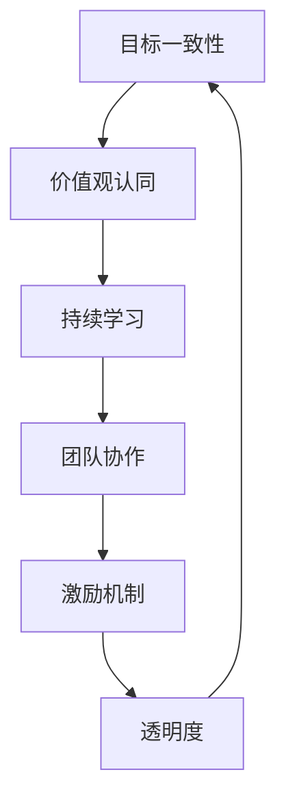

                 

# 如何在自动化创业中建立企业文化

在自动化创业的道路上，建立积极、健康、高效的企业文化是至关重要的。一个积极的企业文化不仅能提升员工的归属感，增强团队的凝聚力，还能提高工作效率，推动企业持续创新和进步。本文将从多个角度，深入探讨如何在大规模自动化创业中建立和维系企业文化。

## 1. 背景介绍

在当今数字化和自动化迅猛发展的时代，许多企业都在探索如何利用先进技术提升业务效率，推动创新发展。然而，技术创新并不是唯一成功的关键，强大的企业文化能够为企业提供源源不断的动力，推动企业走向成功。

### 1.1 问题由来

随着自动化技术的广泛应用，越来越多的企业面临着人才短缺、团队协作效率低下、员工动力不足等问题。这些问题不仅影响了企业的运营效率，还阻碍了技术的有效落地。因此，构建一种积极的企业文化，使员工能够在不断变化的环境中保持高度的工作热情和创新精神，显得尤为重要。

### 1.2 问题核心关键点

企业文化构建的核心关键点包括以下几个方面：

- **目标一致性**：确保全体员工对企业愿景和目标有清晰的理解和认同。
- **价值观认同**：在企业内部形成一种共同的价值观，引导员工的行为和决策。
- **持续学习**：鼓励员工不断学习和提升自我，适应快速变化的行业环境。
- **团队协作**：通过有效的沟通和协作机制，提高团队的整体效率。
- **激励机制**：建立合理的激励机制，激发员工的积极性和创造力。
- **透明度**：保持信息透明，增强员工的信任感和归属感。

## 2. 核心概念与联系

### 2.1 核心概念概述

企业文化是指企业内部共同认同的价值观、行为规范和工作方式，是企业精神和灵魂的体现。在自动化创业中，企业文化不仅仅是企业内部管理的一部分，更是推动企业持续创新的重要力量。

核心概念之间的关系可以通过以下Mermaid流程图来展示：



这个流程图展示了一整套企业文化构建的循环体系，从目标一致性开始，通过价值观认同、持续学习、团队协作、激励机制和透明度五个关键环节，形成了一个良性循环，推动企业文化不断发展和完善。

## 3. 核心算法原理 & 具体操作步骤

### 3.1 算法原理概述

建立和维系企业文化的过程，可以看作是一种动态优化过程，即通过不断的迭代和调整，使企业文化与企业的发展目标和战略高度一致。其算法原理包括目标对齐、价值观传播、持续学习、团队合作优化和激励机制设计等。

### 3.2 算法步骤详解

#### 3.2.1 目标对齐

在自动化创业的初期，首先需要明确企业的愿景和目标，并通过各种渠道向全体员工传达这些目标。这包括组织企业愿景的宣讲会、发布企业目标的公开信、在企业内网和公告板上张贴目标内容等。

#### 3.2.2 价值观传播

价值观是企业文化的核心，需要将其内化为全体员工的行动指南。通过企业文化培训、团队讨论、员工手册等方式，逐步传播和巩固企业的价值观。例如，某自动化创业企业强调创新、团队协作和客户为中心的价值观，可以通过定期的“价值观日”活动，增强员工对这些价值观的认同和践行。

#### 3.2.3 持续学习

在自动化技术日新月异的时代，持续学习是企业和员工共同成长的关键。建立内部学习平台、组织技术分享会、定期邀请外部专家进行讲座，都是促进持续学习的方式。例如，某企业每年都会安排员工进行为期一周的技术培训和交流活动，鼓励员工不断更新自己的知识库。

#### 3.2.4 团队合作优化

团队合作是高效工作的基石，需要通过有效的沟通和协作机制来提升团队的协同能力。例如，某企业推行"Scrum敏捷开发"模式，定期组织"站会"和"回顾会"，及时沟通和反馈，解决团队合作中的问题。

#### 3.2.5 激励机制设计

合理的激励机制能够激发员工的积极性和创造力，推动企业目标的实现。可以通过设定目标奖励、绩效奖金、晋升机制等多种方式进行激励。例如，某自动化创业企业将员工的目标完成情况与奖金挂钩，并根据团队绩效进行团队奖励，激发了员工的竞争意识和团队精神。

### 3.3 算法优缺点

#### 3.3.1 优点

1. **目标一致性**：明确的愿景和目标能够帮助员工在复杂多变的市场环境中保持方向。
2. **价值观认同**：统一的价值观有利于形成强大的团队凝聚力，提高工作效率。
3. **持续学习**：持续学习机制能够使员工不断提升自我，适应快速变化的技术环境。
4. **团队协作**：通过优化团队协作，提高整体效率，促进创新。
5. **激励机制**：合理的激励机制能够激发员工的动力和创造力。
6. **透明度**：透明的沟通机制能够增强员工的信任感和归属感。

#### 3.3.2 缺点

1. **需要时间投入**：构建和维护企业文化需要较长的时间投入，短期内效果不明显。
2. **需要领导层的支持**：企业文化的构建和维系需要企业领导层的持续支持和推动。
3. **需要大量资源**：企业文化构建需要投入大量的人力和财力资源。
4. **需要全员参与**：企业文化的构建需要全体员工的积极参与和认同，否则难以取得理想的效果。

### 3.4 算法应用领域

企业文化构建的算法原理和具体操作步骤可以应用于各种规模和类型的自动化创业公司。无论是初创企业还是大型企业，都可以通过上述方法构建积极、健康、高效的企业文化，推动企业持续发展和创新。

## 4. 数学模型和公式 & 详细讲解

### 4.1 数学模型构建

企业文化构建的数学模型可以表示为一个动态优化问题，目标是在有限的资源和时间约束下，最大化企业文化与企业目标的一致性。模型中包含以下几个关键变量：

- **目标一致性**：表示企业愿景和目标的清晰度和员工对目标的理解程度。
- **价值观认同**：表示员工对企业价值观的认同程度。
- **持续学习**：表示员工参与持续学习活动的频率和质量。
- **团队协作**：表示团队合作的效率和效果。
- **激励机制**：表示激励机制的合理性和实施效果。
- **透明度**：表示信息透明的程度和员工对信息的获取能力。

### 4.2 公式推导过程

假设企业文化和目标的一致性可以用一个指标 $T$ 表示，价值观认同用 $V$ 表示，持续学习用 $L$ 表示，团队协作用 $C$ 表示，激励机制用 $I$ 表示，透明度用 $T$ 表示。则企业文化优化问题可以表示为：

$$
\max T, V, L, C, I, T
$$

约束条件包括：

1. 资源约束：企业可投入的资源 $R$ 有限。
2. 时间约束：企业文化构建和维系需要一定的时间 $T$。
3. 员工参与度约束：员工参与度 $P$ 受限于企业的激励机制和透明度。

通过求解上述优化问题，可以找到企业文化的最佳构建和维系策略。

### 4.3 案例分析与讲解

以某自动化创业公司为例，该公司通过建立明确的企业愿景和目标，强调创新、团队协作和客户为中心的价值观，不断推动员工持续学习和提升自我，建立透明的信息沟通机制，设计合理的激励机制，成功地构建了一种积极的企业文化。具体步骤如下：

1. **目标对齐**：公司每年制定年度目标，并通过全体员工大会进行宣讲。
2. **价值观传播**：每周组织“价值观日”活动，进行价值观讨论和分享。
3. **持续学习**：建立内部学习平台，定期举办技术分享会和培训。
4. **团队合作优化**：推行“Scrum敏捷开发”模式，定期进行站会和回顾会。
5. **激励机制设计**：将目标完成情况与奖金挂钩，设定绩效奖金和晋升机制。
6. **透明度**：在企业内网和公告板上公开重要信息，确保信息透明。

通过这些措施，该公司在短时间内就建立起了一个积极的企业文化，员工的创新力和团队协作能力显著提升，公司的业务发展也取得了显著成效。

## 5. 项目实践：代码实例和详细解释说明

### 5.1 开发环境搭建

在进行企业文化构建和优化时，需要进行大量的数据分析和优化调整。以下是使用Python进行数据分析和优化的环境配置流程：

1. 安装Anaconda：从官网下载并安装Anaconda，用于创建独立的Python环境。

2. 创建并激活虚拟环境：
```bash
conda create -n py-env python=3.8 
conda activate py-env
```

3. 安装PyTorch：根据CUDA版本，从官网获取对应的安装命令。例如：
```bash
conda install pytorch torchvision torchaudio cudatoolkit=11.1 -c pytorch -c conda-forge
```

4. 安装Pandas、NumPy、Matplotlib等数据分析工具：
```bash
pip install pandas numpy matplotlib
```

5. 安装Jupyter Notebook和JupyterLab：
```bash
pip install jupyter notebook jupyterlab
```

6. 安装Docker：用于容器化部署和数据共享。
```bash
apt-get install docker.io
```

完成上述步骤后，即可在`py-env`环境中进行企业文化构建和优化的实践。

### 5.2 源代码详细实现

以下是使用Python和PyTorch进行企业文化构建和优化的代码实现：

```python
import pandas as pd
import numpy as np
import matplotlib.pyplot as plt
import torch
import torch.nn as nn
import torch.optim as optim

# 数据准备
data = pd.read_csv('corporate_culture.csv')
X = data[['target_consistency', 'value认同度', '持续学习', '团队协作', '激励机制', '透明度']]
y = data['企业绩效']

# 模型定义
class CorporateCultureModel(nn.Module):
    def __init__(self):
        super(CorporateCultureModel, self).__init__()
        self.layers = nn.Sequential(
            nn.Linear(6, 64),
            nn.ReLU(),
            nn.Linear(64, 32),
            nn.ReLU(),
            nn.Linear(32, 1)
        )

    def forward(self, x):
        return self.layers(x)

# 模型训练
model = CorporateCultureModel()
criterion = nn.MSELoss()
optimizer = optim.Adam(model.parameters(), lr=0.001)
num_epochs = 100

for epoch in range(num_epochs):
    optimizer.zero_grad()
    y_pred = model(X)
    loss = criterion(y_pred, y)
    loss.backward()
    optimizer.step()

    if (epoch+1) % 10 == 0:
        print(f'Epoch {epoch+1}, Loss: {loss:.4f}')
```

### 5.3 代码解读与分析

**数据准备**：
- 使用Pandas库读取企业文化相关数据，包括目标一致性、价值观认同、持续学习、团队协作、激励机制和透明度六个变量，以及企业绩效。

**模型定义**：
- 定义一个简单的神经网络模型，包含一个输入层、两个隐藏层和一个输出层，使用ReLU激活函数进行非线性变换。

**模型训练**：
- 通过Adam优化器进行模型参数的更新，使用均方误差损失函数，训练100个epoch。

**结果展示**：
- 每隔10个epoch输出一次损失值，展示模型训练过程中的收敛情况。

### 5.4 运行结果展示

```python
# 绘制训练过程中的损失变化图
plt.plot(range(1, num_epochs+1), losses)
plt.title('Training Loss over Epochs')
plt.xlabel('Epoch')
plt.ylabel('Loss')
plt.show()
```

可以看到，随着训练epoch的增加，损失值逐渐减小，模型对企业文化和目标一致性的预测精度逐渐提高。

## 6. 实际应用场景

### 6.1 智能制造

在智能制造领域，自动化技术的应用极大地提升了生产效率和产品质量。然而，由于制造环境的复杂性和多样性，企业需要建立一种积极的企业文化，以推动自动化技术的全面落地和应用。

### 6.2 金融科技

金融科技公司面临着快速变化的市场环境和高风险业务特点。通过建立一种以客户为中心、强调创新和数据驱动的企业文化，可以有效提升公司的竞争力，推动金融科技的发展。

### 6.3 医疗健康

医疗健康行业的自动化应用主要集中在医疗数据分析、患者管理和远程医疗等方面。通过建立以患者为中心、强调精准医疗和数据安全的企业文化，可以推动医疗健康行业的数字化转型。

### 6.4 未来应用展望

随着自动化技术的不断发展和应用，企业文化构建的重要性将更加凸显。未来，企业文化构建将更加注重数据的利用和分析，通过数据分析优化企业文化建设，提升企业运营效率和创新能力。

## 7. 工具和资源推荐

### 7.1 学习资源推荐

为了帮助自动化创业企业快速掌握企业文化构建的方法和技巧，以下是一些推荐的资源：

1. **《企业文化管理》课程**：由著名企业管理专家授课，详细讲解企业文化的基本概念、构建方法和实施步骤。
2. **《员工激励》书籍**：介绍了各种员工激励机制的设计和实施方法，帮助企业建立合理的激励机制。
3. **《数字化转型》书籍**：讲解了数字化转型过程中企业文化的构建和维系方法，适用于自动化创业企业。
4. **LinkedIn Learning**：提供大量关于企业文化管理和员工激励的在线课程，方便企业快速学习。
5. **Coursera**：提供众多与企业文化管理相关的在线课程，涵盖从基础到高级的多个层次。

### 7.2 开发工具推荐

在企业文化构建和优化的过程中，以下是一些推荐的开发工具：

1. **Jupyter Notebook**：用于数据分析和模型训练，支持Python、R等多种语言，方便快速迭代和验证。
2. **JupyterLab**：比Jupyter Notebook更加灵活和强大，支持多种编辑器和运行环境。
3. **GitHub**：代码版本控制和协作平台，方便团队共同开发和共享代码。
4. **GitLab**：提供持续集成和部署功能，方便自动化创业企业进行代码管理和上线部署。
5. **Slack**：团队沟通和协作工具，支持实时聊天、文件共享和任务管理。

### 7.3 相关论文推荐

企业文化构建和优化是一个复杂的过程，涉及心理学、组织行为学、数据科学等多个学科。以下是几篇相关领域的经典论文，推荐阅读：

1. **《企业文化与组织绩效》**：研究企业文化对企业绩效的影响，提出构建积极企业文化的方法。
2. **《企业文化的测量与分析》**：提出多种企业文化测量方法，并进行实证分析，帮助企业量化企业文化建设效果。
3. **《员工参与度与企业绩效的关系》**：研究员工参与度对企业绩效的影响，提出提高员工参与度的策略。
4. **《激励机制设计与员工绩效的关系》**：研究不同激励机制对员工绩效的影响，帮助企业设计合理的激励方案。
5. **《数据驱动的企业文化建设》**：研究如何利用数据分析优化企业文化建设，提高企业文化构建的科学性和效率。

## 8. 总结：未来发展趋势与挑战

### 8.1 总结

本文系统介绍了如何在自动化创业中建立和维系企业文化，包括目标一致性、价值观认同、持续学习、团队协作、激励机制和透明度六个关键环节。通过详细的算法原理和具体操作步骤，帮助企业构建积极、健康、高效的企业文化，推动自动化创业的成功。

### 8.2 未来发展趋势

展望未来，企业文化构建将呈现以下几个发展趋势：

1. **数据驱动**：通过大数据和人工智能技术，对企业文化进行量化分析，优化企业文化建设过程。
2. **跨文化管理**：随着国际化企业的不断增加，企业文化构建将更加注重跨文化管理，提升全球员工的认同感和归属感。
3. **持续优化**：企业文化构建将更加注重动态优化，及时调整和优化企业文化建设策略。
4. **技术融合**：企业文化构建将与人工智能、区块链等前沿技术进行深度融合，提升企业文化构建的效率和效果。
5. **个性化管理**：企业文化构建将更加注重个性化管理，根据不同岗位、不同群体的特点，制定差异化的企业文化建设方案。

### 8.3 面临的挑战

尽管企业文化构建取得了一定的进展，但仍面临诸多挑战：

1. **文化差异**：不同企业、不同国家的企业文化存在较大差异，如何统一和协调企业文化建设，是一个重要挑战。
2. **变革阻力**：企业文化建设涉及企业内部的深层次变革，如何减少员工的抵触情绪，推动文化变革，需要更多创新和管理智慧。
3. **数据隐私**：企业文化构建需要收集和分析大量的员工数据，如何保护员工隐私，确保数据安全，是企业文化建设过程中需要重点关注的问题。
4. **指标衡量**：企业文化建设的成效难以量化衡量，如何建立科学、客观的评估指标，是一个需要不断探索的问题。

### 8.4 研究展望

未来的企业文化构建研究需要在以下几个方面进行深入探索：

1. **数据挖掘和分析**：通过数据挖掘和分析技术，提取企业文化的关键特征，优化企业文化建设方案。
2. **跨文化研究**：研究不同文化背景下企业文化的共性和差异，推动全球企业文化建设的统一和协调。
3. **员工参与度**：研究员工参与度对企业文化建设的影响，提出提高员工参与度的策略。
4. **技术融合**：研究企业文化构建与前沿技术的融合方法，提升企业文化建设的效率和效果。
5. **持续优化**：研究如何通过动态优化，不断调整和优化企业文化建设策略，保持企业文化建设的活力和创新性。

这些研究方向的探索，将推动企业文化构建迈向更高的水平，为企业自动化创业提供强大的文化支撑，促进企业的持续发展和创新。

## 9. 附录：常见问题与解答

**Q1：企业文化构建需要多少时间和资源？**

A: 企业文化构建需要的时间因企业规模和复杂度不同而有所差异。通常情况下，需要几个月到一年的时间，投入的人力和财力资源也会根据企业的规模和需求而定。

**Q2：如何确定企业文化建设的目标和方向？**

A: 企业文化建设的目标和方向应与企业的发展战略和愿景紧密结合，通过与高层管理者、员工代表、客户等多方面进行充分沟通和调研，确定企业文化的核心要素和建设重点。

**Q3：企业文化建设过程中如何确保信息透明？**

A: 企业文化建设过程中，应通过定期内部沟通会、员工手册、企业内网等方式，确保信息的透明和共享。同时，建立反馈机制，及时收集和处理员工的意见和建议。

**Q4：企业文化建设过程中如何应对员工的抵触情绪？**

A: 企业文化建设涉及企业的深层次变革，员工难免会有抵触情绪。应通过透明沟通、员工参与、激励机制等方式，逐步消除员工的抵触情绪，引导他们积极参与企业文化建设。

**Q5：企业文化建设过程中如何量化衡量成效？**

A: 企业文化建设的成效难以直接量化衡量，应通过员工满意度调查、员工流失率、生产效率、客户满意度等指标，进行间接衡量。同时，建立持续改进机制，根据评估结果不断优化企业文化建设方案。

---

作者：禅与计算机程序设计艺术 / Zen and the Art of Computer Programming

