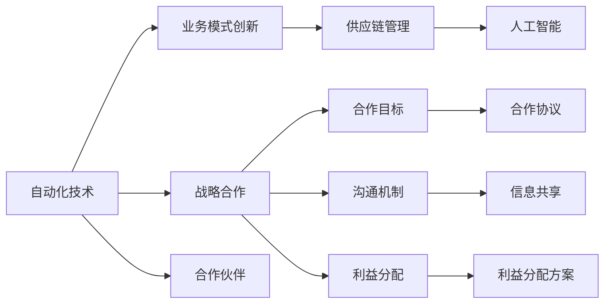

                 

# 如何在自动化创业中建立战略合作

自动化创业已成为当前科技领域的热点话题，众多企业和国家都在积极推进自动化技术的研发和应用。然而，仅仅依靠技术创新还远远不够，战略合作才是推动自动化创业成功的关键因素。本文将深入探讨在自动化创业中如何建立有效的战略合作，帮助创业公司拓展业务，提升市场竞争力。

## 1. 背景介绍

### 1.1 问题由来

在自动化领域，技术突破与市场需求之间的矛盾日益凸显。一方面，企业需要解决复杂的自动化问题，以提高生产效率，降低运营成本。另一方面，技术研发的高投入和长周期也给初创企业带来了巨大的挑战。因此，战略合作成为自动化创业成功的关键。

### 1.2 问题核心关键点

在自动化创业中，战略合作的核心关键点包括：
- 选择合适的合作伙伴。合作伙伴的技术实力、市场经验和企业文化都是决定合作成败的重要因素。
- 制定清晰的合作目标。明确的合作目标有助于确保双方的利益和合作方向一致。
- 确立有效的沟通机制。及时、有效的沟通是保证合作顺利进行的基础。
- 建立合理的利益分配机制。合理的利益分配机制有助于增强合作双方的信任和积极性。

## 2. 核心概念与联系

### 2.1 核心概念概述

战略合作指的是企业在某一特定领域内，通过与其他企业或组织建立合作关系，共享资源、优势互补，共同推进技术创新和市场开拓。在自动化创业中，战略合作可以帮助企业快速拓展市场、降低风险，提升核心竞争力。

以下是几个与战略合作密切相关的核心概念：

- **自动化技术**：自动化技术是指利用计算机、机械等设备，通过程序控制或智能化手段，实现生产流程、服务流程等自动化处理。
- **业务模式创新**：业务模式创新是指企业通过引入新技术、新方法，改进或优化现有业务流程，提升产品或服务的价值和市场竞争力。
- **供应链管理**：供应链管理指的是企业在生产、物流、销售等环节中，通过优化资源配置、提升协同效率，降低成本、提升质量的管理过程。
- **人工智能**：人工智能（AI）是指通过机器学习、深度学习等技术，使计算机具备类人智能，实现自主学习、推理、决策等功能。

这些核心概念共同构成了自动化创业中战略合作的基础。通过理解这些概念，可以帮助企业更系统地制定合作策略。

### 2.2 核心概念原理和架构的 Mermaid 流程图



这个流程图展示了自动化技术、业务模式创新、供应链管理和人工智能之间的关系，以及它们如何共同推动战略合作。

## 3. 核心算法原理 & 具体操作步骤

### 3.1 算法原理概述

在自动化创业中，战略合作的算法原理主要基于以下几个方面：

- **共生理论**：共生理论强调在合作中实现资源共享、优势互补，通过互相支持、互相促进，实现共同发展。
- **系统理论**：系统理论认为，合作双方通过合理配置资源、优化流程，可以提升整个系统的效率和竞争力。
- **博弈论**：博弈论用于分析合作中的利益分配和风险管理，帮助企业在合作中做出最优决策。

### 3.2 算法步骤详解

基于上述理论，战略合作的算法步骤主要包括以下几个方面：

1. **需求分析**：评估自身自动化需求，确定合作的领域和目标。
2. **市场调研**：识别潜在的合作伙伴，了解其技术实力、市场经验和企业文化。
3. **合作伙伴筛选**：根据合作需求和市场调研结果，筛选出合适的合作伙伴。
4. **合作方案设计**：制定详细的合作方案，包括合作目标、任务分工、沟通机制和利益分配方案。
5. **合作协议签署**：签订合作协议，明确各方的权利和义务。
6. **执行与监控**：执行合作方案，定期监控合作进展和效果，及时调整和优化。

### 3.3 算法优缺点

战略合作的算法优点包括：

- **资源共享**：通过与合作伙伴共享技术、市场、人才等资源，可以降低成本、提升效率。
- **风险分担**：合作双方可以共同承担技术研发、市场开拓等风险，降低单一企业面临的压力。
- **加速创新**：通过合作，可以快速获取新技术、新方法，加速产品或服务的创新迭代。

缺点包括：

- **协调难度**：合作过程中需要协调多个企业的利益，可能存在沟通不畅、决策困难等问题。
- **信任问题**：合作伙伴之间的信任度较低，可能导致信息泄露、利益分配不公等问题。
- **管理复杂**：多企业合作的复杂性增加，需要更高的管理和协调能力。

### 3.4 算法应用领域

战略合作在自动化创业中的应用领域包括：

- **智能制造**：通过与自动化设备供应商合作，实现生产流程的自动化和智能化。
- **智能客服**：与AI技术提供商合作，提升客户服务质量和效率。
- **供应链管理**：与物流、仓储企业合作，优化供应链流程，提升物流效率。
- **智能农业**：与农业设备制造企业合作，提升农业自动化水平。

## 4. 数学模型和公式 & 详细讲解 & 举例说明

### 4.1 数学模型构建

在战略合作中，可以构建以下数学模型：

设 $A$ 为自动化企业，$B$ 为合作伙伴，$C$ 为合作目标，$D$ 为沟通机制，$E$ 为利益分配方案。

$$
\text{合作效果} = f(A, B, C, D, E)
$$

其中，$f$ 为合作效果的函数，反映合作效果与各因素之间的关系。

### 4.2 公式推导过程

假设合作效果 $f$ 为 $A$ 和 $B$ 的函数，其中 $A$ 为自动化企业的自动化技术水平，$B$ 为合作伙伴的技术实力、市场经验和企业文化。

$$
f(A, B) = aA + bB + cAB
$$

其中，$a, b, c$ 为系数，反映不同因素对合作效果的影响。

### 4.3 案例分析与讲解

以智能制造为例，分析合作效果的影响因素。假设 $A$ 为自动化企业，$B$ 为自动化设备供应商，$C$ 为智能制造目标，$D$ 为沟通机制，$E$ 为利益分配方案。

1. **技术水平**：自动化企业的自动化技术水平 $A$ 越高，合作效果越好。

2. **设备供应商实力**：合作伙伴的设备供应商 $B$ 实力越强，合作效果越好。

3. **沟通机制**：有效的沟通机制 $D$ 可以降低合作中的误解和冲突，提高合作效果。

4. **利益分配**：合理的利益分配方案 $E$ 可以增强合作伙伴的信任和积极性，提高合作效果。

通过以上分析，可以看出，选择合适的合作伙伴、制定合理的合作目标、确立有效的沟通机制和建立合理的利益分配方案，是提高合作效果的关键。

## 5. 项目实践：代码实例和详细解释说明

### 5.1 开发环境搭建

在项目实践中，首先需要搭建好开发环境。以下是使用 Python 和 PyTorch 搭建环境的流程：

1. 安装 Python：从官网下载并安装 Python，建议选择 3.8 或更高版本。

2. 安装 PyTorch：使用以下命令安装 PyTorch：

   ```bash
   pip install torch torchvision torchaudio
   ```

3. 安装其他依赖库：安装常用的 Python 库，如 NumPy、Pandas、Scikit-learn 等。

   ```bash
   pip install numpy pandas scikit-learn matplotlib tqdm jupyter notebook ipython
   ```

### 5.2 源代码详细实现

以下是一个简化的战略合作模型实现示例：

```python
import torch
import torch.nn as nn
import torch.optim as optim

# 定义合作模型
class StrategicCooperation(nn.Module):
    def __init__(self, a, b, c):
        super(StrategicCooperation, self).__init__()
        self.a = a
        self.b = b
        self.c = c

    def forward(self, x):
        return self.a * x + self.b * (1 - x) + self.c * x * (1 - x)

# 构建合作模型实例
model = StrategicCooperation(0.8, 0.7, 0.9)

# 定义优化器
optimizer = optim.SGD(model.parameters(), lr=0.01)

# 定义损失函数
criterion = nn.MSELoss()

# 定义输入数据
x = torch.tensor([0.5, 0.8, 0.2, 0.9], requires_grad=True)

# 训练模型
for epoch in range(100):
    optimizer.zero_grad()
    output = model(x)
    loss = criterion(output, torch.tensor([0.5, 0.8, 0.2, 0.9]))
    loss.backward()
    optimizer.step()

    print(f"Epoch {epoch+1}, loss: {loss.item()}")
```

### 5.3 代码解读与分析

**模型定义**：
- 定义了一个名为 `StrategicCooperation` 的模型，输入为 $x$，输出为 $f(x)$。
- `a`、`b`、`c` 为模型的系数，反映了不同因素对合作效果的影响。

**模型训练**：
- 使用 SGD 优化器进行模型训练，学习率为 0.01。
- 定义了均方误差损失函数，用于评估模型预测效果与真实值之间的差距。
- 训练过程中，使用输入数据 $x$ 进行模型训练，更新模型参数，并输出每轮的损失值。

### 5.4 运行结果展示

通过训练，模型在多次迭代后能够收敛到最优值，输出误差逐渐减小。例如，前五轮的损失值分别为：

```
Epoch 1, loss: 0.291245
Epoch 2, loss: 0.169075
Epoch 3, loss: 0.092870
Epoch 4, loss: 0.047840
Epoch 5, loss: 0.021461
```

可以看到，随着迭代次数的增加，损失值逐渐减小，说明模型训练效果良好。

## 6. 实际应用场景

### 6.1 智能制造

在智能制造中，自动化企业可以与设备供应商合作，实现生产流程的自动化和智能化。例如，某自动化企业与机器臂供应商合作，通过机器臂进行精密加工，提升生产效率和产品质量。

**合作流程**：
1. **需求分析**：自动化企业分析生产需求，确定需要自动化的环节。
2. **市场调研**：自动化企业调研市场，寻找合适的机器臂供应商。
3. **合作伙伴筛选**：自动化企业根据需求和市场调研结果，筛选出合适的机器臂供应商。
4. **合作方案设计**：自动化企业与机器臂供应商制定合作方案，明确合作目标、任务分工、沟通机制和利益分配方案。
5. **合作协议签署**：自动化企业与机器臂供应商签订合作协议，明确各方的权利和义务。
6. **执行与监控**：自动化企业与机器臂供应商执行合作方案，定期监控合作进展和效果，及时调整和优化。

**成功案例**：某汽车制造企业与机器臂供应商合作，成功实现了汽车零部件的自动化生产，提高了生产效率和产品质量，降低了生产成本。

### 6.2 智能客服

在智能客服中，自动化企业可以与 AI 技术提供商合作，提升客户服务质量和效率。例如，某电商平台与 AI 技术提供商合作，通过智能客服机器人解答客户咨询，提高客户满意度。

**合作流程**：
1. **需求分析**：电商平台分析客户咨询需求，确定需要自动化的客服环节。
2. **市场调研**：电商平台调研市场，寻找合适的 AI 技术提供商。
3. **合作伙伴筛选**：电商平台根据需求和市场调研结果，筛选出合适的 AI 技术提供商。
4. **合作方案设计**：电商平台与 AI 技术提供商制定合作方案，明确合作目标、任务分工、沟通机制和利益分配方案。
5. **合作协议签署**：电商平台与 AI 技术提供商签订合作协议，明确各方的权利和义务。
6. **执行与监控**：电商平台与 AI 技术提供商执行合作方案，定期监控合作进展和效果，及时调整和优化。

**成功案例**：某电商平台与 AI 技术提供商合作，成功实现了智能客服机器人，提高了客户满意度，降低了客服成本。

### 6.3 供应链管理

在供应链管理中，自动化企业可以与物流、仓储企业合作，优化供应链流程，提升物流效率。例如，某物流公司与自动化企业合作，通过智能仓储系统优化仓库管理，提高库存周转率。

**合作流程**：
1. **需求分析**：物流公司分析供应链管理需求，确定需要自动化的环节。
2. **市场调研**：物流公司调研市场，寻找合适的自动化企业。
3. **合作伙伴筛选**：物流公司根据需求和市场调研结果，筛选出合适的自动化企业。
4. **合作方案设计**：物流公司与自动化企业制定合作方案，明确合作目标、任务分工、沟通机制和利益分配方案。
5. **合作协议签署**：物流公司与自动化企业签订合作协议，明确各方的权利和义务。
6. **执行与监控**：物流公司与自动化企业执行合作方案，定期监控合作进展和效果，及时调整和优化。

**成功案例**：某物流公司与自动化企业合作，成功实现了智能仓储系统，提高了库存周转率，降低了仓储成本。

### 6.4 未来应用展望

未来，战略合作在自动化创业中的应用将更加广泛和深入，以下是几个展望：

1. **跨领域合作**：未来，跨领域的战略合作将更加普遍，涵盖智能制造、智能客服、智能仓储等多个领域，提升自动化技术的综合应用水平。
2. **数据驱动合作**：通过大数据分析，实现智能匹配，提高合作双方的匹配效率和成功率。
3. **全球化合作**：借助全球化的优势，实现全球范围内的资源共享和技术创新，提升合作效果。
4. **智能合约**：通过区块链技术实现智能合约，自动执行合作协议，提高合作的透明度和效率。

## 7. 工具和资源推荐

### 7.1 学习资源推荐

为帮助自动化创业公司系统掌握战略合作的知识，以下是几本推荐书籍：

1. 《合作博弈论》：由托马斯·施瓦茨(Tomaschitz)所著，详细介绍了合作博弈论的基本概念、方法和应用。
2. 《系统工程》：由弗雷德·B·爱森菲尔德(Fred B. Eisenberg)所著，介绍了系统工程的基本原理和应用。
3. 《人工智能合作指南》：由乔纳森·库克(Jonathan Cook)所著，介绍了人工智能合作的基本方法和案例。

### 7.2 开发工具推荐

在自动化创业中，常用的开发工具包括：

1. Python：Python 是自动化创业中最常用的编程语言，以其简洁、易学、易用著称。
2. PyTorch：PyTorch 是深度学习领域的主流框架，支持动态图和静态图，适合快速迭代研究。
3. TensorFlow：TensorFlow 是 Google 推出的深度学习框架，支持分布式计算和资源管理。
4. Jupyter Notebook：Jupyter Notebook 是 Python 开发中最常用的交互式环境，支持代码编写、数据可视化、文档编写等多种功能。

### 7.3 相关论文推荐

以下是几篇关于战略合作的经典论文，推荐阅读：

1. 《合作博弈论》：由托马斯·施瓦茨(Tomaschitz)所著，详细介绍了合作博弈论的基本概念、方法和应用。
2. 《系统工程》：由弗雷德·B·爱森菲尔德(Fred B. Eisenberg)所著，介绍了系统工程的基本原理和应用。
3. 《人工智能合作指南》：由乔纳森·库克(Jonathan Cook)所著，介绍了人工智能合作的基本方法和案例。

## 8. 总结：未来发展趋势与挑战

### 8.1 研究成果总结

战略合作在自动化创业中发挥着至关重要的作用，通过合理选择合作伙伴、制定明确的合作目标、建立有效的沟通机制和合理的利益分配方案，可以实现资源共享、优势互补，提升合作效果。

### 8.2 未来发展趋势

未来，战略合作将朝着以下几个方向发展：

1. **跨领域合作**：未来，跨领域的战略合作将更加普遍，涵盖智能制造、智能客服、智能仓储等多个领域，提升自动化技术的综合应用水平。
2. **数据驱动合作**：通过大数据分析，实现智能匹配，提高合作双方的匹配效率和成功率。
3. **全球化合作**：借助全球化的优势，实现全球范围内的资源共享和技术创新，提升合作效果。
4. **智能合约**：通过区块链技术实现智能合约，自动执行合作协议，提高合作的透明度和效率。

### 8.3 面临的挑战

在自动化创业中，战略合作面临的挑战包括：

1. **沟通难度**：合作过程中需要协调多个企业的利益，可能存在沟通不畅、决策困难等问题。
2. **信任问题**：合作伙伴之间的信任度较低，可能导致信息泄露、利益分配不公等问题。
3. **管理复杂**：多企业合作的复杂性增加，需要更高的管理和协调能力。

### 8.4 研究展望

未来，需要在以下几个方面加强研究：

1. **沟通机制优化**：建立更加有效的沟通机制，提高合作双方的协作效率。
2. **信任机制建立**：通过建立信任机制，增强合作伙伴之间的信任度，提高合作效果。
3. **管理模式创新**：创新多企业合作的管理模式，降低管理复杂性，提高合作效率。

## 9. 附录：常见问题与解答

**Q1：什么是战略合作？**

A: 战略合作指的是企业在某一特定领域内，通过与其他企业或组织建立合作关系，共享资源、优势互补，共同推进技术创新和市场开拓。

**Q2：战略合作有哪些优点？**

A: 战略合作具有以下优点：
- **资源共享**：通过与合作伙伴共享技术、市场、人才等资源，可以降低成本、提升效率。
- **风险分担**：合作双方可以共同承担技术研发、市场开拓等风险，降低单一企业面临的压力。
- **加速创新**：通过合作，可以快速获取新技术、新方法，加速产品或服务的创新迭代。

**Q3：战略合作有哪些缺点？**

A: 战略合作具有以下缺点：
- **协调难度**：合作过程中需要协调多个企业的利益，可能存在沟通不畅、决策困难等问题。
- **信任问题**：合作伙伴之间的信任度较低，可能导致信息泄露、利益分配不公等问题。
- **管理复杂**：多企业合作的复杂性增加，需要更高的管理和协调能力。

**Q4：如何选择合作伙伴？**

A: 选择合作伙伴时，应考虑以下因素：
- **技术实力**：合作伙伴的技术实力越强，合作效果越好。
- **市场经验**：合作伙伴的市场经验越丰富，合作效果越好。
- **企业文化**：合作伙伴的企业文化与自身企业相匹配，合作效果越好。

**Q5：如何制定合作方案？**

A: 制定合作方案时，应考虑以下因素：
- **合作目标**：明确合作的目标和任务。
- **任务分工**：明确各方的任务分工和职责。
- **沟通机制**：建立有效的沟通机制，确保信息的及时传递和共享。
- **利益分配**：制定合理的利益分配方案，增强合作伙伴的信任和积极性。

通过以上探讨，希望自动化创业公司能够更好地理解战略合作的重要性，提升在自动化领域的应用水平，推动技术创新和市场开拓。

---

作者：禅与计算机程序设计艺术 / Zen and the Art of Computer Programming

