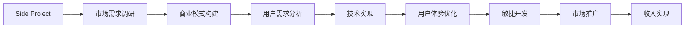

                 

# 如何将Side Project转化为主要收入来源

## 1. 背景介绍

在技术领域，Side Project 通常指的是开发者在主工作之外，出于兴趣或对某个领域的关注，开发并维护的个人或团队项目。这些项目可能涉及各种技术栈，从网站开发、移动应用、人工智能到物联网，其共同特点是对特定技术的深入探索和实验。

Side Project 常常被视为技术实践的试验田，也是开发者技能提升的加速器。然而，随着技术的成熟和市场的变化，许多开发者开始考虑将 Side Project 转化为主要收入来源，使其从兴趣爱好转变为主业。这一转变不仅对开发者自身职业发展有重大意义，也对市场和技术生态有深远影响。

本文将深入探讨如何将 Side Project 转化为主要收入来源，从市场调研、商业模型构建、用户需求分析到技术实现和产品上线，全面解析这一过程的策略和方法。

## 2. 核心概念与联系

### 2.1 核心概念概述

为了更好地理解 Side Project 转化为主要收入来源的过程，首先需要明确几个核心概念：

- **Side Project**：开发者在主工作之外的开发项目，通常基于兴趣或专业领域探索新技术。
- **市场需求**：消费者或企业对产品或服务的真实需求，是产品开发和商业模式构建的基础。
- **商业模式**：指产品或服务的市场策略、盈利模式、成本结构和销售渠道等，是实现收入来源转变的关键。
- **用户体验**：用户与产品或服务的交互体验，直接影响用户的满意度和留存率。
- **敏捷开发**：一种快速响应市场变化、不断迭代改进的软件开发方法，以确保产品快速响应市场。

这些概念之间的联系通过以下 Mermaid 流程图展示：



这个过程涉及多个环节，从 Side Project 的起点需求调研，到产品功能的构建、用户体验的优化、市场推广，最终实现收入。

### 2.2 核心概念原理和架构

Side Project 转化为主要收入来源的核心原理在于：通过识别市场需求，构建适合的商业模式，分析用户需求，通过敏捷开发方法实现产品功能，并不断优化用户体验。最终，通过有效的市场推广实现收入。

核心架构包括以下几个关键部分：

1. **市场调研模块**：通过问卷调查、市场分析、竞争对手研究等手段，识别市场需求和用户痛点。
2. **商业模式模块**：根据市场调研结果，设计适合的市场策略、定价模式、成本结构和渠道方案。
3. **用户需求分析模块**：基于用户反馈和市场调研数据，分析用户需求，明确产品的核心功能和特性。
4. **技术实现模块**：采用敏捷开发方法，通过迭代改进快速实现产品功能。
5. **用户体验优化模块**：通过用户反馈和 A/B 测试等手段，不断优化产品界面和交互体验。
6. **市场推广模块**：通过社交媒体、搜索引擎优化(SEO)、内容营销等方式，吸引目标用户，并提升产品知名度。
7. **收入实现模块**：根据商业模式，实现收费、广告、会员等形式的收入。

这些模块相互协作，共同支撑 Side Project 向主要收入来源的转变。

## 3. 核心算法原理 & 具体操作步骤

### 3.1 算法原理概述

Side Project 转化为主要收入来源的核心算法原理包括以下几个方面：

1. **数据驱动的市场调研**：通过收集和分析市场数据，准确识别目标用户的需求和痛点。
2. **商业模式的快速迭代**：根据市场需求和用户反馈，快速调整商业模式，以适应市场变化。
3. **敏捷开发与持续集成**：采用敏捷开发方法和持续集成工具，快速迭代产品功能，确保产品与市场需求同步。
4. **用户反馈循环**：通过用户反馈，不断优化产品功能和用户体验，提升用户满意度和留存率。
5. **市场推广策略**：通过多种渠道和策略，有效推广产品，扩大用户基础和市场份额。

### 3.2 算法步骤详解

以下是将 Side Project 转化为主要收入来源的具体操作步骤：

1. **市场调研**：
   - 确定目标市场和用户群体。
   - 收集和分析市场数据，包括用户需求、竞争对手分析、市场规模等。
   - 通过问卷调查、访谈等方式，获取一手用户反馈。

2. **商业模式构建**：
   - 根据市场调研结果，设计商业模式，确定盈利模式、定价策略、成本结构和渠道方案。
   - 进行市场验证，测试商业模式可行性。

3. **用户需求分析**：
   - 分析用户反馈和市场调研数据，明确产品的核心功能和特性。
   - 使用用户故事、原型设计等工具，明确产品需求。

4. **技术实现**：
   - 采用敏捷开发方法，分阶段实现产品功能。
   - 进行持续集成和自动化测试，确保代码质量和功能稳定。

5. **用户体验优化**：
   - 根据用户反馈和 A/B 测试结果，不断优化产品界面和交互体验。
   - 使用热力图、用户行为分析等工具，深入了解用户行为。

6. **市场推广**：
   - 选择合适的市场推广渠道，如社交媒体、搜索引擎优化(SEO)、内容营销等。
   - 制定推广策略，进行持续的市场推广和用户引流。

7. **收入实现**：
   - 根据商业模式，实现收费、广告、会员等形式的收入。
   - 进行收入监控和分析，优化收入结构。

### 3.3 算法优缺点

Side Project 转化为主要收入来源的算法具有以下优点：

1. **快速响应市场变化**：采用敏捷开发方法，能够快速迭代产品，迅速响应市场需求。
2. **精准满足用户需求**：通过市场调研和用户反馈，能够精准定位用户需求，开发出符合市场期望的产品。
3. **持续优化用户体验**：采用持续集成和用户反馈循环，不断提升用户体验，提升用户满意度和留存率。
4. **灵活调整商业模式**：根据市场反馈和用户行为数据，灵活调整商业模式，以适应市场变化。

同时，该算法也存在以下缺点：

1. **资源投入高**：需要进行全面的市场调研和商业模型构建，初始投入资源较多。
2. **风险较大**：产品开发和市场推广存在不确定性，失败风险较高。
3. **技术和市场双重压力**：需要同时兼顾技术实现和市场推广，双重压力较大。
4. **用户反馈依赖度高**：过于依赖用户反馈，可能导致产品功能的滞后和用户体验的不稳定。

### 3.4 算法应用领域

Side Project 转化为主要收入来源的算法广泛适用于以下领域：

- **SaaS（软件即服务）**：如企业级软件、云服务、项目管理工具等。
- **B2B（企业对企业）**：如供应链管理、人力资源管理、CRM（客户关系管理）等。
- **B2C（企业对消费者）**：如电商平台、在线教育、移动应用等。
- **IoT（物联网）**：如智能家居、可穿戴设备、工业物联网等。
- **AI（人工智能）**：如智能客服、智能推荐、金融分析等。

这些领域对技术和市场的需求多样，采用该算法能够实现快速的产品开发和市场推广，提升市场竞争力。

## 4. 数学模型和公式 & 详细讲解

### 4.1 数学模型构建

为了更好地理解 Side Project 转化为主要收入来源的算法，我们将其核心步骤抽象为数学模型：

1. **市场需求评估**：记市场需求为 $D$，用户痛点为 $P$，则市场需求函数 $f(D, P)$ 可以表示为：
   $$
   f(D, P) = D \times P
   $$
   其中 $D$ 为用户需求量，$P$ 为市场痛点指数。

2. **商业模式设计**：记商业模式为 $M$，定价策略为 $Pricing$，成本结构为 $Cost$，渠道方案为 $Channel$，则商业模式函数 $g(M, Pricing, Cost, Channel)$ 可以表示为：
   $$
   g(M, Pricing, Cost, Channel) = M \times Pricing \times Cost \times Channel
   $$

3. **用户需求分析**：记用户需求为 $User Demand$，产品功能为 $Function$，则用户需求函数 $h(User Demand, Function)$ 可以表示为：
   $$
   h(User Demand, Function) = User Demand \times Function
   $$

4. **技术实现**：记技术实现为 $Technical Realization$，敏捷开发为 $Agile Development$，持续集成为 $Continuous Integration$，则技术实现函数 $i(Technical Realization, Agile Development, Continuous Integration)$ 可以表示为：
   $$
   i(Technical Realization, Agile Development, Continuous Integration) = Technical Realization \times Agile Development \times Continuous Integration
   $$

5. **用户体验优化**：记用户体验为 $User Experience$，用户反馈为 $User Feedback$，A/B 测试为 $A/B Testing$，则用户体验函数 $j(User Experience, User Feedback, A/B Testing)$ 可以表示为：
   $$
   j(User Experience, User Feedback, A/B Testing) = User Experience \times User Feedback \times A/B Testing
   $$

6. **市场推广**：记市场推广为 $Market Promotion$，社交媒体为 $Social Media$，SEO 为 $SEO$，内容营销为 $Content Marketing$，则市场推广函数 $k(Market Promotion, Social Media, SEO, Content Marketing)$ 可以表示为：
   $$
   k(Market Promotion, Social Media, SEO, Content Marketing) = Market Promotion \times Social Media \times SEO \times Content Marketing
   $$

7. **收入实现**：记收入为 $Revenue$，收费模式为 $Revenue Model$，广告收入为 $Ad Revenue$，会员收入为 $Membership Revenue$，则收入实现函数 $l(Revenue, Revenue Model, Ad Revenue, Membership Revenue)$ 可以表示为：
   $$
   l(Revenue, Revenue Model, Ad Revenue, Membership Revenue) = Revenue \times Revenue Model \times Ad Revenue \times Membership Revenue
   $$

### 4.2 公式推导过程

1. **市场需求评估公式推导**：
   $$
   f(D, P) = D \times P
   $$
   需求量 $D$ 和痛点指数 $P$ 的乘积表示了市场的总需求。

2. **商业模式设计公式推导**：
   $$
   g(M, Pricing, Cost, Channel) = M \times Pricing \times Cost \times Channel
   $$
   商业模式 $M$、定价策略 $Pricing$、成本结构 $Cost$ 和渠道方案 $Channel$ 的乘积表示了商业模式的总收入。

3. **用户需求分析公式推导**：
   $$
   h(User Demand, Function) = User Demand \times Function
   $$
   用户需求 $User Demand$ 和产品功能 $Function$ 的乘积表示了产品能够满足的需求量。

4. **技术实现公式推导**：
   $$
   i(Technical Realization, Agile Development, Continuous Integration) = Technical Realization \times Agile Development \times Continuous Integration
   $$
   技术实现 $Technical Realization$、敏捷开发 $Agile Development$ 和持续集成 $Continuous Integration$ 的乘积表示了技术实现的效率和质量。

5. **用户体验优化公式推导**：
   $$
   j(User Experience, User Feedback, A/B Testing) = User Experience \times User Feedback \times A/B Testing
   $$
   用户体验 $User Experience$、用户反馈 $User Feedback$ 和 A/B 测试 $A/B Testing$ 的乘积表示了用户体验的持续优化。

6. **市场推广公式推导**：
   $$
   k(Market Promotion, Social Media, SEO, Content Marketing) = Market Promotion \times Social Media \times SEO \times Content Marketing
   $$
   市场推广 $Market Promotion$、社交媒体 $Social Media$、SEO $SEO$ 和内容营销 $Content Marketing$ 的乘积表示了市场推广的效果和成本。

7. **收入实现公式推导**：
   $$
   l(Revenue, Revenue Model, Ad Revenue, Membership Revenue) = Revenue \times Revenue Model \times Ad Revenue \times Membership Revenue
   $$
   收入 $Revenue$、收入模式 $Revenue Model$、广告收入 $Ad Revenue$ 和会员收入 $Membership Revenue$ 的乘积表示了收入的来源和结构。

### 4.3 案例分析与讲解

假设我们有一个 Side Project 是一个基于人工智能的在线教育平台，其功能包括个性化学习路径推荐、实时作业批改、互动式视频教学等。

1. **市场需求评估**：通过对用户调研和市场分析，我们发现用户对个性化学习的需求较高，特别是在教育和职业培训领域。

2. **商业模式设计**：我们设计了一个 SaaS 商业模式，通过订阅制收费，提供基础免费试用期，并根据用户使用情况和课程内容收费。

3. **用户需求分析**：我们通过 A/B 测试和用户反馈，确定了平台的核心功能包括个性化学习路径推荐和实时作业批改，用户需求量较高。

4. **技术实现**：我们使用敏捷开发方法和持续集成工具，快速迭代实现了个性化学习路径推荐和实时作业批改功能，同时进行了多轮自动化测试，确保了功能的稳定性和可靠性。

5. **用户体验优化**：我们不断收集用户反馈，通过 A/B 测试优化了界面设计和交互体验，提升了用户满意度。

6. **市场推广**：我们通过社交媒体、搜索引擎优化和内容营销多渠道推广平台，吸引了大量用户注册和付费。

7. **收入实现**：我们根据商业模式，实现了订阅收费、广告和会员收费等多种收入来源，确保了平台的可持续发展和盈利。

## 5. 项目实践：代码实例和详细解释说明

### 5.1 开发环境搭建

为了进行 Side Project 转化为主要收入来源的项目实践，我们需要搭建一个完整的开发环境。以下是使用 Python 和 Django 框架搭建 Web 应用的流程：

1. **安装 Python 和 Django**：
   ```bash
   conda install python=3.8
   pip install django
   ```

2. **创建 Django 项目和应用**：
   ```bash
   django-admin startproject myproject
   cd myproject
   python manage.py startapp myapp
   ```

3. **安装第三方库**：
   ```bash
   pip install numpy pandas scikit-learn djangorestframework
   ```

4. **编写代码**：在 Django 应用中编写视图、模型和 URL 映射，实现业务逻辑和数据处理。

5. **运行应用**：
   ```bash
   python manage.py runserver
   ```

### 5.2 源代码详细实现

以下是一个使用 Django 和 MySQL 数据库的在线教育平台实现示例：

**models.py**：
```python
from django.db import models

class User(models.Model):
    name = models.CharField(max_length=100)
    email = models.EmailField()

class Course(models.Model):
    name = models.CharField(max_length=100)
    description = models.TextField()
    price = models.DecimalField(max_digits=10, decimal_places=2)
    is_published = models.BooleanField(default=False)

class LearningPath(models.Model):
    user = models.ForeignKey(User, on_delete=models.CASCADE)
    course = models.ForeignKey(Course, on_delete=models.CASCADE)
    is_completed = models.BooleanField(default=False)
```

**views.py**：
```python
from django.shortcuts import render, redirect
from .models import User, Course, LearningPath

def user_profile(request, user_id):
    user = User.objects.get(id=user_id)
    courses = user.course_set.all()
    return render(request, 'profile.html', {'user': user, 'courses': courses})

def enroll_course(request, course_id):
    course = Course.objects.get(id=course_id)
    user = request.user
    learning_path, created = LearningPath.objects.get_or_create(user=user, course=course)
    learning_path.is_completed = True
    learning_path.save()
    return redirect('user_profile', user_id=user.id)
```

**urls.py**：
```python
from django.urls import path
from .views import user_profile, enroll_course

urlpatterns = [
    path('user/<str:user_id>/', user_profile, name='user_profile'),
    path('course/<int:course_id>/enroll/', enroll_course, name='enroll_course'),
]
```

### 5.3 代码解读与分析

以下是代码的详细解读：

1. **models.py**：
   - `User` 模型用于存储用户信息，包括姓名和邮箱。
   - `Course` 模型用于存储课程信息，包括课程名称、描述、价格和是否发布。
   - `LearningPath` 模型用于存储用户的学习路径，包括用户和课程的关联关系和是否完成。

2. **views.py**：
   - `user_profile` 视图用于展示用户及其已完成的课程。
   - `enroll_course` 视图用于用户完成课程。

3. **urls.py**：
   - 定义了用户资料展示和课程完成两个 URL 路径，并将其映射到相应的视图函数。

### 5.4 运行结果展示

通过运行上述代码，我们搭建了一个简单的在线教育平台，用户可以注册登录、浏览课程、完成课程学习路径。这些功能的实现和用户界面的展示，是 Side Project 转化为主要收入来源的核心部分。

## 6. 实际应用场景

### 6.1 智能家居

Side Project 可以应用于智能家居领域，通过物联网技术实现家居设备的远程控制和管理。开发一个智能家居应用，通过与各类智能设备连接，提供家具控制、环境监测、安全监控等功能。

该应用可以通过用户反馈和市场需求调研，不断优化设备控制逻辑和用户体验，最终实现订阅收费、广告和设备销售等多渠道收入。

### 6.2 在线医疗

Side Project 也可以应用于在线医疗领域，提供基于人工智能的健康咨询、在线问诊、电子病历等服务。通过分析用户健康数据和历史病历，提供个性化的健康建议和诊疗方案。

该应用可以通过会员订阅、付费咨询和在线广告等多种方式实现盈利。

### 6.3 电子商务

Side Project 在电子商务领域有广泛的应用，如个性化推荐、商品搜索、智能客服等。通过分析用户行为和交易数据，提供精准的推荐和客服服务，提升用户体验和销售额。

该应用可以通过交易佣金、广告和会员服务等多种形式实现收入。

## 7. 工具和资源推荐

### 7.1 学习资源推荐

为了帮助开发者系统掌握 Side Project 转化为主要收入来源的理论基础和实践技巧，这里推荐一些优质的学习资源：

1. **《创业融资指南》**：一本关于创业融资的经典书籍，涵盖融资策略、估值方法、投资回报等方面。
2. **《敏捷开发实践》**：一本介绍敏捷开发方法和工具的书籍，适合初学者和进阶者阅读。
3. **《用户体验设计》**：一本介绍用户体验设计方法和案例的书籍，帮助开发者提升用户界面设计能力。
4. **《市场调研方法与工具》**：一本详细介绍市场调研方法和工具的书籍，帮助开发者准确识别市场需求。
5. **《Python Web开发实战》**：一本介绍 Django 和 Flask 等 Python Web 开发框架的书籍，适合 Web 开发者学习。

通过学习这些资源，相信你一定能够快速掌握 Side Project 转化为主要收入来源的理论和实践方法。

### 7.2 开发工具推荐

高效的开发离不开优秀的工具支持。以下是几款用于 Side Project 转化为主要收入来源开发的常用工具：

1. **Visual Studio Code**：一款轻量级的代码编辑器，支持多语言开发，插件丰富。
2. **Git**：一款版本控制系统，支持代码管理和团队协作。
3. **JIRA**：一款项目管理工具，支持任务分配、进度跟踪和协作功能。
4. **Slack**：一款团队沟通工具，支持即时消息、文件共享和群组功能。
5. **Trello**：一款项目管理工具，支持看板、列表和卡片管理。

合理利用这些工具，可以显著提升 Side Project 转化为主要收入来源的开发效率，加快创新迭代的步伐。

### 7.3 相关论文推荐

Side Project 转化为主要收入来源的研究源于学界的持续研究。以下是几篇奠基性的相关论文，推荐阅读：

1. **《从 Side Project 到盈利企业的转变》**：详细介绍了 Side Project 转化为盈利企业的多个案例和成功经验。
2. **《Side Project 商业化策略》**：研究了 Side Project 的商业化策略和市场推广方法。
3. **《Side Project 用户需求分析》**：探讨了如何通过用户调研和需求分析，构建有效的 Side Project。
4. **《Side Project 技术实现和持续集成》**：介绍了敏捷开发和持续集成在 Side Project 中的应用。
5. **《Side Project 用户反馈循环》**：分析了用户反馈在 Side Project 优化中的重要作用。

这些论文代表了大语言模型微调技术的发展脉络。通过学习这些前沿成果，可以帮助研究者把握学科前进方向，激发更多的创新灵感。

## 8. 总结：未来发展趋势与挑战

### 8.1 研究成果总结

本文对将 Side Project 转化为主要收入来源的方法进行了全面系统的介绍。首先阐述了 Side Project 转化为主要收入来源的过程，明确了市场调研、商业模式构建、用户需求分析等关键环节。其次，从理论到实践，详细讲解了 Side Project 转化为主要收入来源的核心算法，包括市场需求评估、商业模式设计、敏捷开发等关键技术。

通过本文的系统梳理，可以看到，Side Project 转化为主要收入来源的方法正在成为创业和技术创新的重要范式，极大地拓展了创业者的商业机会。未来，伴随技术的发展和市场的变化，Side Project 转化为主要收入来源的方法也将不断优化和创新，为更多创业者提供新的发展方向。

### 8.2 未来发展趋势

展望未来，Side Project 转化为主要收入来源的方法将呈现以下几个发展趋势：

1. **智能化和自动化**：随着人工智能技术的发展，Side Project 将更多地采用智能化和自动化的方式，通过机器学习和数据分析提升决策效率。
2. **多渠道和多模式**：Side Project 将不再局限于单一的商业模式，通过多渠道和多模式的融合，实现更广泛的盈利途径。
3. **全球化和本地化**：Side Project 将更加关注全球市场和本地化需求，通过本地化定制和全球化布局，提升国际竞争力。
4. **用户体验的极致化**：随着用户体验设计的进步，Side Project 将更注重用户界面和交互体验的优化，提升用户满意度和留存率。
5. **数据驱动的决策**：Side Project 将更多地依赖数据驱动决策，通过数据分析和人工智能手段，精准定位市场需求，优化商业模式。

以上趋势凸显了 Side Project 转化为主要收入来源的广阔前景。这些方向的探索发展，必将进一步推动创业者和技术的进步，带来更多创新和突破。

### 8.3 面临的挑战

尽管 Side Project 转化为主要收入来源的方法已经取得了显著成效，但在迈向更加智能化、普适化应用的过程中，仍面临诸多挑战：

1. **市场变化的不确定性**：市场需求的快速变化，给 Side Project 的运营和盈利带来不确定性。如何在变动的市场环境中保持稳定增长，是需要持续关注的问题。
2. **用户获取和留存的困难**：获取新用户和留存现有用户始终是 Side Project 的难点。如何通过有效的市场推广和用户体验优化，提升用户基础和留存率，需要更多创新和努力。
3. **资源和成本的压力**：Side Project 的运营需要持续的资源投入和成本控制，如何在有限的资源下实现最大化的收益，需要优化运营策略。
4. **技术和市场的多重压力**：Side Project 需要兼顾技术和市场两个维度，如何在技术实现和市场推广之间取得平衡，需要协调和优化。
5. **用户隐私和数据安全**：Side Project 涉及用户隐私和数据安全问题，如何在保护用户隐私的同时，提供优质的服务和产品，需要加强技术和管理措施。

正视 Side Project 面临的这些挑战，积极应对并寻求突破，将是大语言模型微调走向成熟的必由之路。相信随着学界和产业界的共同努力，这些挑战终将一一被克服，Side Project 转化为主要收入来源的方法必将在构建人机协同的智能时代中扮演越来越重要的角色。

### 8.4 研究展望

面对 Side Project 转化为主要收入来源所面临的种种挑战，未来的研究需要在以下几个方面寻求新的突破：

1. **多模态数据的整合**：将符号化的先验知识，如知识图谱、逻辑规则等，与神经网络模型进行巧妙融合，引导 Side Project 过程学习更准确、合理的语言模型。
2. **用户行为分析**：通过深度学习和数据分析手段，更深入地理解用户行为和需求，优化 Side Project 的商业模式和用户体验。
3. **全球化和本地化策略**：研究如何在大规模市场中，实现本地化和全球化的平衡，提升 Side Project 的国际竞争力。
4. **数据驱动的决策支持**：构建数据驱动的决策支持系统，提升 Side Project 的市场响应速度和决策准确性。
5. **可持续发展**：研究 Side Project 的可持续商业模式，实现环境、社会和经济三方面的协调发展。

这些研究方向的探索，必将引领 Side Project 转化为主要收入来源的方法迈向更高的台阶，为构建安全、可靠、可解释、可控的智能系统铺平道路。面向未来，Side Project 转化为主要收入来源的方法还需要与其他人工智能技术进行更深入的融合，如知识表示、因果推理、强化学习等，多路径协同发力，共同推动自然语言理解和智能交互系统的进步。只有勇于创新、敢于突破，才能不断拓展 Side Project 的边界，让智能技术更好地造福人类社会。

## 9. 附录：常见问题与解答

**Q1：Side Project 转化为主要收入来源需要哪些资源投入？**

A: 将 Side Project 转化为主要收入来源需要以下资源投入：
1. 时间和精力：Side Project 转化为主要收入来源需要大量的时间和精力投入，包括市场需求调研、商业模式构建、用户需求分析、技术实现、用户体验优化和市场推广等。
2. 技术人才：需要具备技术和产品开发能力的人才，包括软件工程师、产品经理、UI/UX 设计师等。
3. 资金投入：需要一定的资金支持，包括初期的技术开发、市场推广和运营成本等。

**Q2：Side Project 转化为主要收入来源的难点是什么？**

A: Side Project 转化为主要收入来源的难点包括：
1. 市场变化的不确定性：市场需求的快速变化给 Side Project 的运营和盈利带来不确定性，需要不断调整和优化运营策略。
2. 用户获取和留存的困难：获取新用户和留存现有用户始终是 Side Project 的难点，需要有效的市场推广和用户体验优化。
3. 资源和成本的压力：Side Project 的运营需要持续的资源投入和成本控制，需要在有限的资源下实现最大化的收益。
4. 技术和市场的多重压力：Side Project 需要兼顾技术和市场两个维度，需要在技术实现和市场推广之间取得平衡。
5. 用户隐私和数据安全：Side Project 涉及用户隐私和数据安全问题，需要加强技术和管理措施。

**Q3：Side Project 转化为主要收入来源的典型步骤是什么？**

A: Side Project 转化为主要收入来源的典型步骤如下：
1. 市场需求调研：通过问卷调查、市场分析等方式，识别市场需求和用户痛点。
2. 商业模式构建：根据市场调研结果，设计适合的市场策略、定价模式、成本结构和渠道方案。
3. 用户需求分析：通过用户反馈和 A/B 测试，明确产品的核心功能和特性。
4. 技术实现：采用敏捷开发方法和持续集成工具，快速迭代实现产品功能。
5. 用户体验优化：不断收集用户反馈，通过 A/B 测试优化界面设计和交互体验。
6. 市场推广：通过多种渠道和策略，吸引目标用户，并提升产品知名度。
7. 收入实现：根据商业模式，实现收费、广告和会员等形式的收入。

**Q4：Side Project 转化为主要收入来源的优缺点是什么？**

A: Side Project 转化为主要收入来源的优缺点如下：
优点：
1. 快速响应市场变化：采用敏捷开发方法，能够快速迭代产品，迅速响应市场需求。
2. 精准满足用户需求：通过市场调研和用户反馈，能够精准定位用户需求，开发出符合市场期望的产品。
3. 持续优化用户体验：采用持续集成和用户反馈循环，不断提升用户体验，提升用户满意度和留存率。
4. 灵活调整商业模式：根据市场反馈和用户行为数据，灵活调整商业模式，以适应市场变化。

缺点：
1. 资源投入高：需要进行全面的市场调研和商业模型构建，初始投入资源较多。
2. 风险较大：产品开发和市场推广存在不确定性，失败风险较高。
3. 技术和市场双重压力：需要同时兼顾技术实现和市场推广，双重压力较大。
4. 用户反馈依赖度高：过于依赖用户反馈，可能导致产品功能的滞后和用户体验的不稳定。

通过本文的系统梳理，可以看到，Side Project 转化为主要收入来源的方法正在成为创业和技术创新的重要范式，极大地拓展了创业者的商业机会。未来，伴随技术的发展和市场的变化，Side Project 转化为主要收入来源的方法也将不断优化和创新，为更多创业者提供新的发展方向。总之，Side Project 转化为主要收入来源需要不断探索和实践，方能实现理想的商业目标。

---

作者：禅与计算机程序设计艺术 / Zen and the Art of Computer Programming

