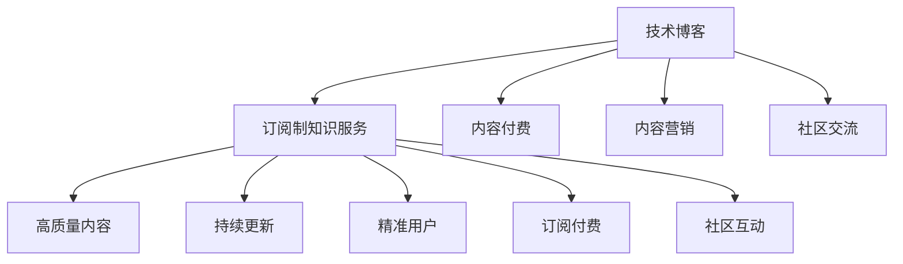

                 

# 如何将技术博客转化为订阅制知识服务

> 关键词：订阅制知识服务,内容付费,技术博客,内容营销,人工智能,技术社区,内容平台

## 1. 背景介绍

### 1.1 问题由来

在互联网高速发展的今天，技术博客已成为信息传播的重要载体。然而，技术博客的运营模式单一，主要以广告和展示为主，难以满足用户对高质量技术内容的深度需求。同时，很多高质量技术内容无法实现变现，导致优质内容生产动力不足。因此，如何将技术博客转化为订阅制知识服务，提升内容变现能力，成为了当下技术博客领域亟待解决的问题。

### 1.2 问题核心关键点

订阅制知识服务是一种通过收取订阅费用，为订阅用户提供持续更新、高质量技术内容的商业模式。其核心在于：

- 高质量内容：订阅制服务依赖于高质量的内容，通过技术博客筛选优质内容，提升用户满意度。
- 持续更新：定期发布新内容，满足用户深度学习需求。
- 精准用户：精准定位用户需求，提升用户粘性。
- 订阅付费：通过订阅费用实现盈利，形成良性循环。
- 社区互动：建立社区交流平台，提升用户参与度和反馈质量。

这些关键点互为因果，形成一个闭环，共同驱动订阅制知识服务的成功。

## 2. 核心概念与联系

### 2.1 核心概念概述

为了更好地理解如何将技术博客转化为订阅制知识服务，本节将介绍几个密切相关的核心概念：

- 技术博客：以技术内容为主，覆盖人工智能、软件工程、数据科学、安全等多个领域的信息平台。通常包含文章、代码、讨论等多种形式。
- 订阅制知识服务：通过收取订阅费用，为订阅用户提供持续更新的高质量技术内容，包括文章、视频、课程等。
- 内容付费：技术博客通过订阅制或单次付费等方式，实现内容变现。
- 内容营销：通过技术博客和订阅制服务，进行内容营销，提升品牌影响力和用户转化率。
- 社区交流：建立技术博客和订阅制服务的社区交流平台，提升用户互动和粘性。

这些概念之间的逻辑关系可以通过以下Mermaid流程图来展示：



这个流程图展示了几者之间的联系和依赖：

1. 技术博客是内容付费和内容营销的基础。
2. 订阅制知识服务通过高质量内容、持续更新、精准用户、订阅付费和社区互动等方式，提升用户粘性和品牌影响力。
3. 内容付费是订阅制知识服务的盈利模式。
4. 内容营销通过订阅制服务提升品牌知名度和用户转化率。
5. 社区交流提升用户参与度和反馈质量。

这些概念共同构成了订阅制知识服务的完整生态，有助于实现技术博客的持续发展和价值变现。

## 3. 核心算法原理 & 具体操作步骤
### 3.1 算法原理概述

将技术博客转化为订阅制知识服务，本质上是一个内容变现的复杂系统。其核心思想是：通过高质量内容的筛选和优化，结合精准定位、持续更新和社区互动等手段，实现对用户需求的最大化满足，从而提升内容变现能力。

形式化地，假设技术博客为 $B$，订阅制知识服务为 $S$，则内容变现的优化目标是最小化订阅服务的成本，同时最大化订阅费用：

$$
\min_{S} C_S, \quad \max_{S} R_S
$$

其中 $C_S$ 为订阅服务的运营成本，$R_S$ 为订阅费用。在实践中，我们通常使用基于梯度的优化算法（如Adam、SGD等）来近似求解上述最优化问题。

### 3.2 算法步骤详解

将技术博客转化为订阅制知识服务，一般包括以下几个关键步骤：

**Step 1: 筛选优质内容**

- 对技术博客上的文章进行筛选，去除低质量内容，提升内容质量。
- 通过AI算法分析文章内容，识别高质量、高价值的文章，用于订阅服务。

**Step 2: 定义订阅内容**

- 根据订阅用户的偏好，定义订阅服务的内容集合。
- 确定订阅服务的更新频率和内容形式（如文章、视频、课程等）。

**Step 3: 精准定位用户**

- 通过数据分析和用户调研，精准定位订阅用户需求。
- 利用用户画像和推荐算法，实现个性化订阅内容推送。

**Step 4: 持续更新内容**

- 定期发布高质量的新内容，提升用户粘性和满意度。
- 持续优化已有内容，保持内容的最新性和权威性。

**Step 5: 社区互动优化**

- 建立订阅服务社区交流平台，鼓励用户参与讨论和反馈。
- 利用社区互动数据，优化订阅内容和服务质量。

**Step 6: 内容变现策略**

- 通过订阅费用、单次付费、会员增值服务等方式，实现内容变现。
- 根据订阅用户反馈，调整定价策略和内容结构。

**Step 7: 用户转化与留存**

- 利用内容营销手段，提升新用户转化率。
- 定期分析用户行为数据，优化用户体验，提升用户留存率。

以上是订阅制知识服务的一般流程。在实际应用中，还需要针对具体平台的特点，对各环节进行优化设计，如改进内容推荐算法、引入更灵活的订阅模式、加强用户社区互动等，以进一步提升服务效果。

### 3.3 算法优缺点

订阅制知识服务具有以下优点：

- 提高内容质量：通过内容筛选和优化，确保高质量内容供给。
- 提升用户粘性：持续更新内容和社区互动，提升用户参与度和忠诚度。
- 实现内容变现：通过订阅费用和内容营销，实现内容的商业化。
- 精准用户定位：利用数据分析和推荐算法，实现个性化推送。

同时，该方法也存在一定的局限性：

- 用户转换率较低：免费内容获取门槛低，部分用户不愿意支付订阅费用。
- 运营成本较高：持续的内容生产和社区维护需要大量人力和技术支持。
- 内容垄断风险：单一平台的内容垄断可能影响市场公平竞争。
- 内容同质化风险：订阅内容过度同质化可能降低用户粘性。

尽管存在这些局限性，但就目前而言，订阅制知识服务仍是大数据驱动内容变现的主流模式，有望在未来获得更广泛的应用。

### 3.4 算法应用领域

订阅制知识服务在多个领域都有成功的应用案例：

- 技术博客平台：如Stack Overflow、Medium等，通过订阅服务提升内容质量和用户粘性，实现商业化运作。
- 软件技术社区：如GitHub、Stack Exchange等，通过内容付费和订阅服务，实现平台商业化和生态建设。
- 在线课程平台：如Coursera、Udacity等，通过订阅模式提升课程质量和用户满意度，获取更多收入。
- 专业内容订阅：如Nature、Science等，通过订阅服务实现高价值内容变现，保持期刊的权威性和影响力。

以上领域展示了订阅制知识服务的广泛应用前景，未来随着技术博客平台和内容社区的不断涌现，订阅制知识服务必将在更多领域落地，为技术内容的商业化带来新的机遇。

## 4. 数学模型和公式 & 详细讲解  
### 4.1 数学模型构建

本节将使用数学语言对订阅制知识服务的内容变现模型进行更加严格的刻画。

记技术博客为 $B$，订阅制知识服务为 $S$，订阅费用为 $R_S$，运营成本为 $C_S$。定义订阅服务的用户满意度为 $U_S$，订阅用户数为 $N_S$，订阅用户付费率为 $P_S$。

订阅服务的优化目标是最小化运营成本，同时最大化订阅费用：

$$
\min_{S} C_S, \quad \max_{S} R_S
$$

假设用户满意度 $U_S$ 与订阅内容质量、内容更新频率、用户互动质量等因素有关，则可以构建如下的优化目标函数：

$$
\max_{S} R_S = \max_{S} P_S \times N_S \times U_S
$$

其中 $P_S$ 为订阅费用，$N_S$ 为订阅用户数，$U_S$ 为用户满意度。

### 4.2 公式推导过程

以下我们以二分类任务为例，推导订阅费用 $R_S$ 和用户满意度 $U_S$ 的函数关系及其优化策略。

假设订阅服务的用户满意度 $U_S$ 可以表示为用户内容评分 $R$ 和互动评分 $I$ 的线性组合：

$$
U_S = \alpha R + \beta I
$$

其中 $\alpha$ 和 $\beta$ 为满意度计算系数，表示内容评分和互动评分的权重。

为了最大化订阅费用 $R_S$，需要对 $P_S$、$N_S$、$U_S$ 等变量进行调整。我们可以引入需求价格弹性 $\epsilon$，表示用户对订阅费用变动的敏感度。当需求价格弹性 $\epsilon < 1$ 时，用户对价格的变动不敏感，增加订阅费用可以提升收益。因此，可以构建如下优化目标函数：

$$
\max_{S} R_S = \max_{S} P_S \times N_S \times \alpha R + \beta I
$$

在需求价格弹性 $\epsilon < 1$ 的条件下，可以通过提高订阅费用 $P_S$ 来增加收益。同时，为了提升用户满意度 $U_S$，需要优化内容评分 $R$ 和互动评分 $I$，可以通过以下公式实现：

$$
R = f(C) \times W, \quad I = g(D) \times H
$$

其中 $C$ 为内容质量，$D$ 为用户互动质量，$W$ 为内容评分权重，$H$ 为用户互动评分权重。

在得到上述优化目标函数后，即可带入具体参数，求解最优的订阅费用 $P_S$ 和订阅用户数 $N_S$，以最大化订阅服务收益。

### 4.3 案例分析与讲解

假设某技术博客平台通过订阅制服务提升内容质量，订阅费用 $P_S$ 为每月100元，运营成本 $C_S$ 为每月1000元，用户满意度 $U_S$ 与内容评分 $R$ 和互动评分 $I$ 的关系为：

$$
U_S = 0.8R + 0.2I
$$

其中内容评分 $R$ 与内容质量 $C$ 的关系为：

$$
R = 0.6C + 0.4
$$

互动评分 $I$ 与互动质量 $D$ 的关系为：

$$
I = 0.5D + 0.5
$$

通过优化模型，求解最优订阅费用 $P_S$ 和订阅用户数 $N_S$，以最大化订阅服务收益。

首先，确定内容评分 $R$ 和互动评分 $I$ 的计算公式，带入用户满意度 $U_S$ 的表达式：

$$
U_S = 0.8 \times (0.6C + 0.4) + 0.2 \times (0.5D + 0.5) = 0.48C + 0.2D + 0.4
$$

然后，带入订阅费用 $P_S$ 和运营成本 $C_S$ 的计算公式，得到订阅服务收益的表达式：

$$
R_S = P_S \times N_S \times (0.48C + 0.2D + 0.4)
$$

根据需求价格弹性 $\epsilon < 1$ 的假设，可以通过提高订阅费用 $P_S$ 来增加收益。优化目标函数为：

$$
\max_{S} R_S = \max_{S} 100N_S \times (0.48C + 0.2D + 0.4)
$$

通过对订阅服务收益的优化，可以求解出最优订阅费用 $P_S$ 和订阅用户数 $N_S$。

## 5. 项目实践：代码实例和详细解释说明
### 5.1 开发环境搭建

在进行订阅制知识服务开发前，我们需要准备好开发环境。以下是使用Python进行Django开发的环境配置流程：

1. 安装Anaconda：从官网下载并安装Anaconda，用于创建独立的Python环境。

2. 创建并激活虚拟环境：
```bash
conda create -n subscription-env python=3.8 
conda activate subscription-env
```

3. 安装Django：根据CUDA版本，从官网获取对应的安装命令。例如：
```bash
conda install django
```

4. 安装各类工具包：
```bash
pip install numpy pandas scikit-learn matplotlib tqdm jupyter notebook ipython
```

完成上述步骤后，即可在`subscription-env`环境中开始订阅制知识服务开发。

### 5.2 源代码详细实现

下面我们以订阅制知识服务的社区功能为例，给出使用Django开发的PyTorch代码实现。

首先，定义订阅制服务的数据模型：

```python
from django.db import models

class Subscription(models.Model):
    user = models.ForeignKey(User, on_delete=models.CASCADE)
    plan = models.CharField(max_length=100)
    active = models.BooleanField(default=True)
    subscription_date = models.DateTimeField(auto_now_add=True)
    end_date = models.DateTimeField(null=True, blank=True)
    price = models.DecimalField(max_digits=10, decimal_places=2)

    def __str__(self):
        return f'{self.user.username} - {self.plan}'
```

然后，定义社区功能的API接口：

```python
from django.http import JsonResponse

def comment_list(request):
    if request.method == 'GET':
        comments = Comment.objects.all()
        comments = list(map(lambda comment: {"id": comment.id, "user": comment.user.username, "content": comment.content}, comments))
        return JsonResponse(comments, safe=False)
```

最后，启动订阅制服务的开发流程：

```python
from django.core.management import execute_from_command_line

execute_from_command_line(['manage.py', 'runserver', '0.0.0.0:8000'])
```

以上即为使用Django进行订阅制知识服务社区功能的完整代码实现。可以看到，Django提供了强大的Web开发框架，可以快速实现社区功能。

### 5.3 代码解读与分析

让我们再详细解读一下关键代码的实现细节：

**Subscription模型**：
- `user`：关联用户模型，表示订阅用户。
- `plan`：订阅计划，如基础版、专业版等。
- `active`：订阅状态，表示是否正在订阅。
- `subscription_date`：订阅开始时间，自动生成。
- `end_date`：订阅结束时间，可为空。
- `price`：订阅费用，以DecimalField类型存储。

**comment_list函数**：
- 查询所有评论，并转换成JSON格式返回。
- 利用Lambda表达式快速转换评论数据，使其满足API接口的需求。
- 返回JsonResponse对象，将评论数据以JSON格式输出。

**开发流程**：
- 首先创建并激活虚拟环境。
- 安装Django和相关工具包。
- 定义数据模型和API接口。
- 使用`manage.py`启动Django服务，在本地8080端口监听请求。

通过上述代码实现，可以构建基本的订阅制知识服务社区功能。当然，在实际应用中，还需要对模型、API、前端等各个环节进行优化和改进，以满足具体业务需求。

## 6. 实际应用场景
### 6.1 智能客服系统

订阅制知识服务在智能客服系统中也有广泛应用。智能客服系统可以基于订阅制服务，为订阅用户提供高质量的客服对话模板、常见问题解答、用户反馈分析等。

在技术实现上，可以收集企业内部的历史客服对话记录，将问题和最佳答复构建成订阅内容，向订阅用户推送。订阅用户可以通过在线客服系统接入，获取针对自己需求的最佳答复，提升客服响应速度和质量。同时，订阅用户还可以在订阅服务中反馈新问题，帮助企业不断优化客服对话模板，提升服务水平。

### 6.2 金融舆情监测

订阅制知识服务在金融舆情监测中也有重要应用。金融机构需要实时监测市场舆论动向，以便及时应对负面信息传播，规避金融风险。

在订阅制服务中，可以订阅各种金融领域的市场动态、财经新闻、分析师报告等，获取高质量的舆情信息。订阅用户可以通过订阅服务获取最新的金融市场动态，快速掌握市场变化，做出合理的投资决策。同时，订阅服务还可以提供舆情分析和预测，帮助金融机构提前预警市场风险。

### 6.3 个性化推荐系统

订阅制知识服务在个性化推荐系统中也有广泛应用。个性化推荐系统可以通过订阅制服务，向用户推荐其感兴趣的内容，提升用户满意度。

在技术实现上，可以订阅用户的历史浏览记录、购买行为、评价反馈等数据，分析用户的兴趣偏好，为其推荐个性化的内容。订阅用户可以通过订阅服务获取推荐内容，提升浏览和购买体验。同时，订阅服务还可以根据用户反馈，不断优化推荐算法，提升推荐质量。

### 6.4 未来应用展望

随着订阅制知识服务的发展，其应用场景将不断拓展，为更多领域带来变革性影响。

在智慧医疗领域，订阅制知识服务可以提供医疗问答、病历分析、药物研发等订阅内容，帮助医生和患者获取高质量的医疗信息，提升医疗服务水平。

在智能教育领域，订阅制知识服务可以提供作业批改、学情分析、知识推荐等订阅内容，因材施教，促进教育公平，提高教学质量。

在智慧城市治理中，订阅制知识服务可以提供城市事件监测、舆情分析、应急指挥等订阅内容，提高城市管理的自动化和智能化水平，构建更安全、高效的未来城市。

此外，在企业生产、社会治理、文娱传媒等众多领域，订阅制知识服务也将不断涌现，为传统行业数字化转型升级提供新的技术路径。相信随着订阅制知识服务的不断发展，必将在构建人机协同的智能时代中扮演越来越重要的角色。

## 7. 工具和资源推荐
### 7.1 学习资源推荐

为了帮助开发者系统掌握订阅制知识服务的技术基础和实践技巧，这里推荐一些优质的学习资源：

1. Django官方文档：Django作为流行的Web开发框架，其官方文档提供了全面的学习资源，帮助开发者掌握Django的各项功能。
2. Django学习路线：GitHub上开源的Django学习路线，从基础到进阶，覆盖了Django的各项功能和最佳实践。
3. Django实战项目：Github上开源的Django实战项目，通过具体项目了解Django的开发流程和项目组织。
4. Django Girl网站：Django Girl网站提供了丰富的Django学习资源，包括教程、案例、博客等，适合初学者入门。
5. Django Talks会议：Django Talks会议汇集了大量Django开发者分享的技术实践，了解行业前沿发展。

通过这些资源的学习实践，相信你一定能够快速掌握订阅制知识服务的开发流程和优化策略，并用于解决实际的业务问题。

### 7.2 开发工具推荐

高效的开发离不开优秀的工具支持。以下是几款用于订阅制知识服务开发的常用工具：

1. Django：基于Python的开源Web框架，灵活性高，适合快速迭代研发。Django提供了强大的模板引擎、表单处理、权限管理等功能，适合构建复杂的前端服务。
2. Flask：轻量级的Python Web框架，灵活高效，适合小型项目和快速原型开发。Flask提供了灵活的扩展机制和插件支持，方便开发者进行功能扩展。
3. FastAPI：快速、高性能的Python Web框架，适合构建高性能的RESTful服务。FastAPI提供了自动代码生成、类型注释等特性，提升开发效率。
4. Django REST Framework：Django的RESTful服务扩展，提供了完整的API开发支持，适合构建复杂API接口。Django REST Framework提供了数据序列化、认证、权限管理等功能，支持多种数据格式和请求方式。

合理利用这些工具，可以显著提升订阅制知识服务的开发效率，加快创新迭代的步伐。

### 7.3 相关论文推荐

订阅制知识服务的发展源于学界的持续研究。以下是几篇奠基性的相关论文，推荐阅读：

1. "A Survey of Free and Open-Source Software for Software Engineering"：介绍了多种开源工具和框架，适合了解订阅制服务的基础技术栈。
2. "The Effect of Feedback Mechanisms on User Satisfaction: A Case Study of Social Computing"：研究了用户反馈对服务满意度的影响，适合了解用户互动的设计思路。
3. "E-commerce Personalization: A Survey of Recommendation Systems"：介绍了个性化推荐系统的各项技术和应用，适合了解订阅制服务的推荐功能。
4. "A Survey of Empirical Studies on Recommendation Algorithms"：介绍了推荐算法的各项研究和应用，适合了解推荐算法的设计思路。
5. "A Survey of Context-Aware Recommendation Systems"：介绍了上下文感知推荐系统的各项技术和应用，适合了解上下文感知功能的设计思路。

这些论文代表了大数据驱动内容变现的发展脉络。通过学习这些前沿成果，可以帮助研究者把握学科前进方向，激发更多的创新灵感。

## 8. 总结：未来发展趋势与挑战

### 8.1 总结

本文对订阅制知识服务的内容变现模型进行了全面系统的介绍。首先阐述了订阅制知识服务的发展背景和运营模式，明确了内容付费和内容营销的重要性，指出了当前技术博客内容变现面临的挑战。其次，从原理到实践，详细讲解了订阅制知识服务的内容变现模型，包括高质量内容筛选、精准用户定位、持续更新和社区互动等环节，给出了完整的代码实现。同时，本文还广泛探讨了订阅制知识服务在智能客服、金融舆情、个性化推荐等多个行业领域的应用前景，展示了订阅制知识服务的广阔前景。此外，本文精选了订阅制知识服务的各类学习资源，力求为读者提供全方位的技术指引。

通过本文的系统梳理，可以看到，订阅制知识服务作为一种内容变现模式，具有显著提升内容质量、用户粘性和商业化收益的潜力。未来随着技术博客平台和内容社区的不断涌现，订阅制知识服务必将在更多领域落地，为技术内容的商业化带来新的机遇。

### 8.2 未来发展趋势

展望未来，订阅制知识服务将呈现以下几个发展趋势：

1. 技术平台多样化：订阅制服务将不仅仅局限于网站和APP，还将拓展到VR、AR等新兴技术平台。
2. 服务形式多元化：订阅内容将不再局限于文章和视频，还将包括音频、直播、互动教程等多种形式。
3. 个性化推荐系统普及：通过订阅制服务，用户将获得更加个性化的推荐内容，提升用户满意度和粘性。
4. 社区互动活跃化：订阅制服务将引入社区交流功能，提升用户互动和反馈质量。
5. 跨平台一体化：不同平台之间的内容和服务将实现互通互联，提升用户体验和平台粘性。
6. 知识变现市场化：订阅制服务将更多地走向市场化运作，形成商业化闭环。

这些趋势凸显了订阅制知识服务的广阔前景。这些方向的探索发展，必将进一步提升订阅制服务的内容质量和用户粘性，为技术内容的商业化带来新的机遇。

### 8.3 面临的挑战

尽管订阅制知识服务已经取得了瞩目成就，但在迈向更加智能化、普适化应用的过程中，它仍面临着诸多挑战：

1. 用户转换率低：部分用户对订阅费用敏感，难以实现大规模用户转化。
2. 运营成本高：持续的内容生产和社区维护需要大量人力和技术支持。
3. 内容同质化风险：订阅内容过度同质化可能降低用户粘性。
4. 用户隐私保护：订阅服务需要收集大量用户数据，数据隐私保护和合规性管理亟需加强。
5. 平台垄断风险：单一平台的内容垄断可能影响市场公平竞争。

尽管存在这些挑战，但订阅制知识服务作为一种内容变现模式，仍是大数据驱动内容变现的主流模式，有望在未来获得更广泛的应用。

### 8.4 研究展望

面向未来，订阅制知识服务需要在以下几个方面寻求新的突破：

1. 探索无监督和半监督订阅内容：摆脱对大规模标注数据的依赖，利用自监督学习、主动学习等无监督和半监督范式，最大限度利用非结构化数据，实现更加灵活高效的订阅内容供给。
2. 研究参数高效订阅内容优化：开发更加参数高效的订阅内容优化方法，在固定大部分订阅内容参数的情况下，只更新极少量的任务相关参数，减少运营成本。
3. 融合因果和对比学习范式：通过引入因果推断和对比学习思想，增强订阅内容建立稳定因果关系的能力，学习更加普适、鲁棒的内容表示。
4. 引入更多先验知识：将符号化的先验知识，如知识图谱、逻辑规则等，与神经网络订阅内容进行巧妙融合，引导订阅内容学习更准确、合理的知识表示。
5. 引入多模态数据融合：将视觉、语音等多模态信息与文本信息进行协同建模，提升订阅内容的综合表现力。
6. 纳入伦理道德约束：在订阅内容的目标函数中引入伦理导向的评估指标，过滤和惩罚有偏见、有害的订阅内容，确保订阅内容符合人类价值观和伦理道德。

这些研究方向的探索，必将引领订阅制知识服务技术迈向更高的台阶，为构建安全、可靠、可解释、可控的订阅制服务铺平道路。面向未来，订阅制知识服务还需要与其他人工智能技术进行更深入的融合，如知识表示、因果推理、强化学习等，多路径协同发力，共同推动订阅制知识服务技术的进步。只有勇于创新、敢于突破，才能不断拓展订阅制知识服务的边界，让订阅制知识服务更好地造福人类社会。

## 9. 附录：常见问题与解答

**Q1：订阅制知识服务如何实现高质量内容筛选？**

A: 订阅制知识服务通过内容质量评分和用户互动评分来实现高质量内容筛选。具体而言，可以通过用户反馈、专家评审、数据统计等方法，对内容进行评分，将高评分内容推送给订阅用户。同时，利用数据分析和用户画像，对订阅内容进行个性化推荐，提升用户体验。

**Q2：订阅制知识服务如何实现精准用户定位？**

A: 订阅制知识服务通过用户画像和推荐算法，实现精准用户定位。具体而言，可以收集用户的历史行为数据、社交网络数据、兴趣标签等，构建用户画像，并通过协同过滤、基于内容的推荐算法等方式，实现个性化订阅内容推送。

**Q3：订阅制知识服务如何实现用户互动优化？**

A: 订阅制知识服务通过社区交流平台，实现用户互动优化。具体而言，可以建立在线讨论区、问答系统、评论系统等功能，鼓励用户参与互动和反馈。利用社区互动数据，优化订阅内容和服务质量，提升用户满意度和粘性。

**Q4：订阅制知识服务如何实现用户留存和转化？**

A: 订阅制知识服务通过内容营销、个性化推荐、社区互动等方式，实现用户留存和转化。具体而言，可以定期发布新内容、优化用户体验、提升内容质量，吸引新用户订阅。通过个性化推荐和社区互动，提升用户粘性和满意度，实现长期留存。

通过上述常见问题的解答，可以看出，订阅制知识服务是一种复杂而系统的内容变现模式，需要从内容质量、用户定位、互动优化等多个环节进行全面优化。只有在数据、算法、工程、业务等多个维度协同发力，才能真正实现订阅制知识服务的价值最大化。总之，订阅制知识服务将通过高质量内容、精准定位、持续更新和社区互动，提升内容变现能力，推动技术博客平台和内容社区的持续发展。面向未来，订阅制知识服务必将在更多领域落地，为技术内容的商业化带来新的机遇。

---

作者：禅与计算机程序设计艺术 / Zen and the Art of Computer Programming

