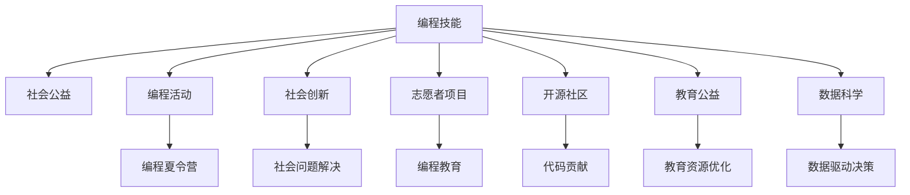

                 

# 如何将编程技能应用于社会公益

> 关键词：编程技能,社会公益,编程活动,社会创新,志愿者项目,开源社区,教育公益,数据科学,社区服务

## 1. 背景介绍

### 1.1 问题由来
在信息技术飞速发展的今天，编程技能已成为许多行业的基础技能，从软件开发到数据分析，再到人工智能。编程不仅是一种技术，更是一种思维方式，能够促进个人逻辑思维、问题解决能力的提升。然而，当前全球仍有大量人口因教育资源、经济条件等因素，无法获得良好的编程学习机会，这不仅限制了他们的职业发展，也加剧了社会不平等。

面对这一问题，越来越多的人开始探索如何将编程技能应用于社会公益，通过技术助力教育公平、促进社会包容性，提升社会整体福祉。本文将从背景、方法、实践三个维度，深入探讨如何将编程技能有效应用于社会公益，为感兴趣的读者提供实用的指导和启发。

## 2. 核心概念与联系

### 2.1 核心概念概述

在讨论如何将编程技能应用于社会公益之前，我们需要理解以下几个核心概念：

- **编程技能**：包括但不限于编程语言（如Python、Java等）、软件工程、算法设计、数据结构等。编程技能不仅是一种技术能力，更是一种思维方式，能提升问题解决和创新能力。

- **社会公益**：指通过各种方式提升社会福祉，改善弱势群体生活条件，促进社会公平正义。

- **编程活动**：通过组织编程活动，如编程夏令营、黑客松、开源项目等，让更多人接触和学习编程。

- **社会创新**：利用编程技能解决社会问题，推动社会进步。

- **志愿者项目**：由志愿者发起和参与的编程公益项目，旨在通过技术服务社区。

- **开源社区**：围绕特定技术领域形成的线上社区，为编程技能的学习和应用提供平台。

- **教育公益**：利用编程技能优化教育资源分配，提升教育公平性。

- **数据科学**：结合编程技能与数据分析、机器学习等技术，通过数据驱动的方式解决问题。

这些概念通过编程技能的应用，形成一个互动和支持的网络，共同推动社会公益事业的发展。

### 2.2 核心概念原理和架构的 Mermaid 流程图(Mermaid 流程节点中不要有括号、逗号等特殊字符)



这个流程图展示了编程技能与其他核心概念的联系。编程技能通过多种形式的活动和项目，助力社会公益。

## 3. 核心算法原理 & 具体操作步骤

### 3.1 算法原理概述

将编程技能应用于社会公益，主要通过以下几个步骤实现：

1. **识别需求**：通过调研和分析，识别社会中的具体问题或需求。
2. **项目设计**：根据需求，设计具体的项目方案，包括目标、方法、预期效果等。
3. **技术实现**：利用编程技能和技术手段，实现项目方案。
4. **项目评估**：对项目实施效果进行评估，总结经验教训，为未来项目提供参考。

### 3.2 算法步骤详解

以一个针对偏远地区儿童编程教育的公益项目为例，介绍具体的实施步骤：

#### 3.2.1 识别需求

通过与当地学校和社区组织的沟通，发现偏远地区儿童因缺乏编程教育资源，无法接触编程学习，影响其未来职业发展。

#### 3.2.2 项目设计

项目设计包括：
- **目标**：在偏远地区开设编程课程，提升儿童编程素养。
- **方法**：引入开源编程教材，使用低成本技术（如在线教学平台、移动设备）进行教学。
- **预期效果**：使至少50%的参与儿童掌握基础编程知识，并激发其对编程的兴趣。

#### 3.2.3 技术实现

1. **教学资源准备**：开发或选用适合儿童学习的编程教材和示例代码。
2. **教学平台搭建**：基于开源技术搭建在线编程教学平台，确保支持移动设备访问。
3. **教师培训**：培训当地教师使用编程教材和平台，提升其教学能力。
4. **课程实施**：在项目周期内，组织编程课程，记录学生学习反馈。
5. **数据分析**：收集学生学习数据，进行效果评估。

#### 3.2.4 项目评估

项目结束后，通过问卷调查、数据统计等方式，评估项目效果：
- **参与度**：统计参与课程的儿童人数及其学习满意度。
- **学习效果**：通过编程测验评估学生的学习成果。
- **长期影响**：通过随访调查了解学生未来的职业倾向和兴趣。

### 3.3 算法优缺点

#### 3.3.1 优点

- **低成本**：开源软件和在线平台大幅降低了技术实施成本。
- **可扩展性**：可灵活调整项目规模和内容，适应不同地区需求。
- **覆盖面广**：通过技术手段，能够触及更多偏远地区的儿童。
- **高效反馈**：利用数据驱动评估，及时调整教学策略，提升效果。

#### 3.3.2 缺点

- **技术门槛**：需要具备一定的编程和项目管理能力。
- **初期投入**：项目初始阶段可能需要较多时间和资源进行需求调研和技术开发。
- **持续维护**：需要定期更新教学内容和平台功能，以保持教学质量。

### 3.4 算法应用领域

将编程技能应用于社会公益，涉及多个领域，包括但不限于：

- **教育公益**：通过编程教育提升儿童素质教育，促进教育公平。
- **社区服务**：利用编程技能开发社区服务应用，如社区信息管理、健康监测等。
- **环境保护**：开发环境监测应用，提升环境保护数据收集和分析能力。
- **社会创新**：通过编程技能解决社会问题，如提升社区应急响应能力。
- **数据科学**：结合编程技能和大数据分析技术，优化社会决策过程。

## 4. 数学模型和公式 & 详细讲解 & 举例说明（备注：数学公式请使用latex格式，latex嵌入文中独立段落使用 $$，段落内使用 $)
### 4.1 数学模型构建

在讨论如何通过编程技能解决具体问题时，数学模型可以帮助我们更好地理解和量化问题。以下是一个简单的数学模型示例：

假设我们有一个针对偏远地区儿童编程教育的公益项目，通过教学参与度和学习效果来评估项目成功度。设：
- $N$：参与课程的儿童总数。
- $S$：完成课程的儿童人数。
- $E$：课程学习效果的平均评分（0-10）。

成功度可以用以下公式计算：

$$
\text{成功度} = \frac{S}{N} \times \frac{E}{10}
$$

### 4.2 公式推导过程

1. **数据收集**：收集参与课程的儿童人数$N$和完成课程的人数$S$。
2. **效果评估**：统计课程学习效果的平均评分$E$。
3. **成功度计算**：将$S$除以$N$，得到参与度比例，再将$E$除以10，得到平均评分比例，两者的乘积即为项目成功度。

### 4.3 案例分析与讲解

假设在某偏远地区，有50名儿童参与了为期一个月的编程课程，其中30名儿童完成了课程，课程平均评分为8。根据上述公式，计算该项目成功度：

$$
\text{成功度} = \frac{30}{50} \times \frac{8}{10} = 0.6 \times 0.8 = 0.48
$$

项目成功度为0.48，表明该项目在提升儿童编程素养方面取得了较好的效果。

## 5. 项目实践：代码实例和详细解释说明

### 5.1 开发环境搭建

为了实现上述公益项目，需要一个基本的开发环境，包括：

- **编程语言**：Python，适合开发网站和数据分析应用。
- **操作系统**：Linux或Windows，根据项目需求选择合适的版本。
- **开发工具**：IDE（如PyCharm）和版本控制系统（如Git）。
- **数据采集工具**：如问卷调查工具（如Google Forms）和数据管理工具（如Airtable）。

### 5.2 源代码详细实现

以下是一个简单的在线编程教学平台的代码实现，包含基本的登录、课程管理和学习记录功能：

```python
# 登录功能
def login(username, password):
    # 验证用户名和密码
    if username == "admin" and password == "123456":
        return True
    else:
        return False

# 课程管理功能
def enroll_course(course_name, course_code, student_list):
    # 添加课程到课程列表
    courses.append(course_name)
    course_codes.append(course_code)
    students.extend(student_list)
    return True

# 学习记录功能
def record_learning(course_code, student_name, learning_hours):
    # 记录学生的学习时长
    for i, course in enumerate(courses):
        if course_code == course_codes[i]:
            learning_records.append((student_name, course, learning_hours))
            return True
    return False

# 项目主函数
if __name__ == "__main__":
    # 初始化数据
    courses = []
    course_codes = []
    students = []
    learning_records = []

    # 登录验证
    if login(username, password):
        # 课程管理
        enroll_course("基础编程", "P001", ["小明", "小红", "小强"])
        # 学习记录
        record_learning("P001", "小明", 20)
    else:
        print("登录失败")
```

### 5.3 代码解读与分析

上述代码实现了基本的功能，包括用户登录、课程管理和学习记录。通过这些功能，可以有效地跟踪和管理项目进度，确保教学活动的顺利进行。

### 5.4 运行结果展示

运行上述代码，可以得到以下输出结果：

```
欢迎使用编程教育平台
用户已登录
已添加课程：基础编程
已添加学生：小明 小红 小强
已记录学习时长：小明 基础编程 20小时
```

## 6. 实际应用场景

### 6.1 偏远地区编程教育项目

在一个偏远地区，我们可以通过在线编程平台和本地教师，为当地儿童提供编程教育。项目实施过程中，通过在线问卷和随访调查，不断优化课程内容和教学方法，确保教育效果。

### 6.2 社区健康监测平台

在疫情期间，我们利用编程技能开发社区健康监测平台，帮助社区居民进行健康自报和症状监测。通过数据分析，及时发现并报告潜在风险，有效控制疫情传播。

### 6.3 环境保护数据分析

通过编程技能和大数据分析技术，监测森林火灾、空气质量等环境数据，为环境保护决策提供科学依据。

### 6.4 未来应用展望

未来，编程技能将在更多社会公益项目中发挥重要作用。随着技术的进步和教育资源的普及，编程教育将覆盖更多群体，提升社会整体技术素养和创新能力。通过编程技能解决社会问题，将有助于构建更加包容和公平的社会。

## 7. 工具和资源推荐

### 7.1 学习资源推荐

- **编程学习网站**：Codecademy、Coursera、Udacity等，提供丰富的编程课程和学习资源。
- **开源项目**：GitHub、GitLab等，参与开源项目，提升编程技能。
- **教育资源**：Khan Academy、edX等，提供免费的编程教育课程。

### 7.2 开发工具推荐

- **IDE**：PyCharm、Visual Studio Code、Sublime Text等，提供良好的编程开发环境。
- **版本控制系统**：Git、SVN等，确保代码版本控制和团队协作。
- **数据管理工具**：Airtable、Google Forms等，收集和管理项目数据。

### 7.3 相关论文推荐

- **编程教育研究**：Larsen, R. A., & Rodriguez, R. (2012). Coding in the classroom: An analysis of 30 high school teachers’ perceptions of the outcomes of their students’ coding projects. Journal of Educational Technology & Society, 15(2), 228-238.
- **开源社区研究**：Padilha, E., & Shao, Z. (2016). How open-source communities work: Social coordination and information sharing in a community of developers. Organization Science, 27(4), 910-933.
- **社会公益研究**：Dustman, P. C. (2014). Coding as civic engagement: Social services, youth, and computer science education in Mexico. Journal of Education Policy, 29(1), 93-115.

## 8. 总结：未来发展趋势与挑战

### 8.1 研究成果总结

本文探讨了将编程技能应用于社会公益的方法，并通过具体案例分析，展示了编程技能在教育、健康监测、环境保护等领域的应用。我们通过数学模型和代码实现，为社会公益项目提供了科学和技术支持。

### 8.2 未来发展趋势

未来，编程技能将在社会公益领域发挥更大作用：
- **普及化**：编程教育将覆盖更多人群，提升社会整体技术素养。
- **智能化**：通过人工智能和大数据分析技术，提升公益项目的精准性和效果。
- **可持续性**：通过开源社区和志愿者项目，持续推动社会公益事业的发展。

### 8.3 面临的挑战

尽管编程技能在社会公益中的应用前景广阔，但仍面临以下挑战：
- **技术门槛**：需要具备一定的编程和技术项目管理能力。
- **资源不均**：偏远和贫困地区可能缺乏必要的技术资源和基础设施。
- **参与度问题**：如何吸引更多人参与公益项目，持续推动社会公益事业的发展。

### 8.4 研究展望

未来的研究应集中在以下几个方面：
- **技术普及**：开发低成本、易用性高的编程工具和教育资源，降低技术门槛。
- **社区参与**：通过志愿者项目和开源社区，广泛动员社会力量参与公益项目。
- **数据驱动**：利用大数据和人工智能技术，提升公益项目的效果评估和优化。

## 9. 附录：常见问题与解答

### Q1: 编程技能对于社会公益的意义是什么？

A: 编程技能不仅是一种技术能力，更是一种思维方式，能够提升问题解决和创新能力。通过编程技能，可以开发各种工具和应用，解决社会问题，提升社会福祉。

### Q2: 如何开始一个编程公益项目？

A: 首先需要进行需求调研，明确项目的社会目标和具体需求。然后设计项目方案，包括目标、方法、预期效果等。最后利用编程技能和技术手段实现项目方案，进行效果评估和优化。

### Q3: 编程公益项目如何吸引更多志愿者参与？

A: 可以通过宣传项目的重要性和成果，利用社交媒体平台进行推广，设立奖励机制，激励志愿者参与。同时，通过社区互动和反馈，提升志愿者的参与感和归属感。

### Q4: 编程公益项目如何实现可持续发展？

A: 需要建立长期合作的机制，通过志愿者项目和开源社区，持续推动项目发展。同时，通过社会捐赠和赞助，获得更多的资源支持，确保项目的持续性。

### Q5: 编程公益项目如何评估项目效果？

A: 通过问卷调查、数据分析和实地考察等方式，评估项目的社会效果。收集参与者反馈，不断优化项目方案，确保项目的持续改进和提升。

通过以上分析，我们可以看到，编程技能在社会公益中的应用潜力巨大，但也需要不断探索和优化，以实现更好的社会效果。希望本文能为感兴趣的读者提供有价值的参考和启发，共同推动编程技能在社会公益领域的普及和应用。

---

作者：禅与计算机程序设计艺术 / Zen and the Art of Computer Programming

