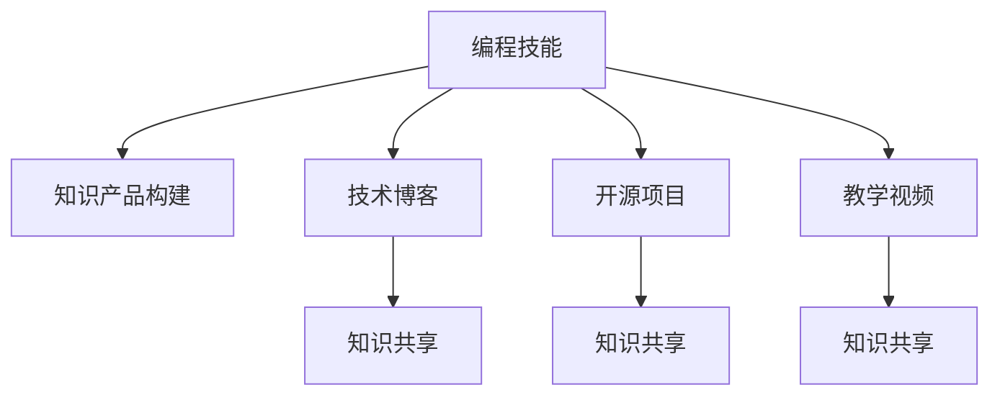

                 

## 1. 背景介绍

### 1.1 问题由来

在当今数字化时代，编程技能已经成为许多行业的基础。然而，仅仅掌握编程技能并不能满足职业发展的需求，更高效的提升方式是将编程技能转化为有价值的知识产品，如开源项目、技术博客、教学视频等，通过这种方式实现知识共享和技能传递。

### 1.2 问题核心关键点

将编程技能转化为知识产品需要跨越技术和认知的多个层次，从理论到实践都需要深入探讨。这包括：

- 编程技能的系统化整理和总结：将复杂的编程知识系统化，梳理成易于理解和传播的内容。
- 知识产品的构建和展示：选择合适的平台和工具，将知识产品以易读、易懂的方式呈现给读者。
- 知识产品的传播和反馈：通过社交媒体、在线社区、教育平台等渠道进行传播，并及时收集反馈进行优化。

### 1.3 问题研究意义

将编程技能转化为知识产品对个人职业发展和企业技术创新都具有重要意义：

- 提升个人品牌：通过构建和传播知识产品，个人可以提升在技术社区和行业内的知名度和影响力。
- 加速技术迭代：知识产品的传播和交流可以加速技术的创新和普及，促进技术的迭代和演进。
- 促进教育和培训：知识产品可以作为学习资源，为初学者和开发者提供有价值的指导，提升技术水平。
- 驱动企业发展：知识产品可以作为企业技术文化的载体，促进团队学习和知识共享，提升整体技术水平。

## 2. 核心概念与联系

### 2.1 核心概念概述

- **编程技能**：指在编程语言和工具的使用、算法和数据结构的应用、软件开发流程和最佳实践等方面的能力。
- **知识产品**：指通过编程技能创作出来的，具有教育、研究、应用价值的有形和无形产品，包括开源项目、技术博客、教学视频、课程等。
- **知识共享**：指通过互联网平台，将个人的知识和经验分享给其他开发者，实现知识的传播和交流。
- **技术博客**：指个人或团队定期撰写并发布的技术文章，涉及编程技巧、项目实践、技术心得等。
- **开源项目**：指通过开源许可证发布的技术软件、工具或代码库，供公众自由使用和修改。
- **教学视频**：指针对特定技术主题或项目，制作的视频教程，帮助观众学习编程技能和解决问题。

这些核心概念之间相互关联，共同构成了将编程技能转化为知识产品的整个流程。

### 2.2 核心概念原理和架构的 Mermaid 流程图



这个流程图展示了编程技能到知识产品的转化路径：

1. 编程技能通过构建技术博客、开源项目、教学视频等知识产品，实现知识共享。
2. 技术博客、开源项目、教学视频等知识产品通过知识共享平台，传播给更广泛的开发者群体。

## 3. 核心算法原理 & 具体操作步骤

### 3.1 算法原理概述

将编程技能转化为知识产品的过程可以抽象为一个基于信息论和传播学的复杂系统。其核心原理包括以下几个方面：

- **信息编码**：将复杂的编程知识转化为易于理解和传播的编码信息。
- **信息传递**：选择合适的渠道和平台，将编码信息传递给目标受众。
- **信息解码**：目标受众通过解码信息，理解并应用所学知识。
- **反馈循环**：获取受众的反馈，优化和改进知识产品的质量和传播效果。

### 3.2 算法步骤详解

#### 步骤1：知识收集与整理

- **文献调研**：查阅和收集相关领域的研究论文、书籍、白皮书等资料。
- **项目实践**：参与或亲自带领项目开发，积累实践经验。
- **专家访谈**：与领域专家进行交流，获取深度见解。

#### 步骤2：知识编码与呈现

- **内容规划**：制定内容大纲，确定文章标题、章节结构和重点。
- **编码实现**：使用Markdown、HTML、LaTeX等格式，将内容转化为可读性强的文本。
- **多媒体整合**：添加代码片段、图表、图片等多媒体元素，增强可读性和理解度。

#### 步骤3：知识发布与传播

- **选择合适的平台**：根据受众和内容特性，选择技术博客、GitHub、YouTube、Bilibili等发布渠道。
- **优化内容格式**：调整标题、摘要、标签等，提升内容的搜索和传播效果。
- **互动与反馈**：建立评论、讨论、问答等互动环节，收集受众反馈，进行持续改进。

#### 步骤4：知识迭代与优化

- **数据分析**：使用工具如Google Analytics、Kaggle等，分析受众的阅读行为和反馈数据。
- **内容优化**：根据数据分析结果，优化内容结构、形式和呈现方式。
- **持续更新**：定期更新内容，保持知识的时效性和相关性。

### 3.3 算法优缺点

#### 优点

- **提高个人品牌影响力**：通过知识产品的传播，可以提升个人在技术社区和行业内的知名度。
- **加速技术传播与创新**：知识产品的分享可以加速技术的普及和创新，推动行业进步。
- **促进教育和培训**：高质量的知识产品可以作为学习资源，帮助初学者和开发者提升技术水平。

#### 缺点

- **时间和精力投入高**：知识产品的构建和传播需要大量的时间和精力，短期内难以见效。
- **市场需求难以预测**：内容质量、受众兴趣等难以预知，存在失败的风险。
- **知识产品难以量化**：相比于传统的编程工作，知识产品的贡献和影响力难以精确衡量。

### 3.4 算法应用领域

将编程技能转化为知识产品的实践广泛应用在以下几个领域：

- **教育培训**：通过技术博客、教学视频等形式，为学生和初学者提供编程学习资源。
- **企业培训**：企业通过内部分享、技术内参等形式，提升团队的技术水平和知识共享。
- **技术交流**：开发者通过开源项目、技术博客等形式，分享编程技巧和项目经验。
- **行业资讯**：技术专家通过分析报告、博客等形式，分享行业动态和趋势。

## 4. 数学模型和公式 & 详细讲解 & 举例说明

### 4.1 数学模型构建

设 $K$ 为编程技能的知识集合，$C$ 为知识产品的内容集合，$T$ 为传播渠道的集合，$R$ 为受众的集合。知识产品转化为知识产品的过程可以表示为：

$$
f(K, C, T) = O(R)
$$

其中 $f$ 为知识产品转化函数，$O$ 为知识传播函数。

### 4.2 公式推导过程

设 $k_i$ 为知识 $K$ 中的第 $i$ 个知识点，$c_j$ 为知识产品 $C$ 中的第 $j$ 个内容，$t_k$ 为传播渠道 $T$ 中的第 $k$ 个渠道，$r_l$ 为受众 $R$ 中的第 $l$ 个受众。知识产品转化过程可以分解为以下步骤：

1. 知识编码：将 $k_i$ 编码为 $c_j$。
2. 信息传递：通过 $t_k$ 将 $c_j$ 传递给 $r_l$。
3. 知识解码：受众 $r_l$ 解码 $c_j$ 获得 $k_i$。

### 4.3 案例分析与讲解

假设我们要将“Python 高级编程技巧”转化为知识产品。首先，我们从书籍、论文中收集相关知识点 $K$，然后将其整理为技术博客 $C$。接着，通过GitHub、技术博客等渠道 $T$ 发布内容，受众 $R$ 通过阅读博客、下载代码等形式获取知识。最终，我们通过数据分析和受众反馈 $O(R)$，不断优化和改进内容 $C$，提升知识产品的传播效果。

## 5. 项目实践：代码实例和详细解释说明

### 5.1 开发环境搭建

#### 5.1.1 编程环境

- **开发语言**：Python
- **IDE**：PyCharm、VSCode等
- **版本控制**：Git
- **代码托管**：GitHub
- **编译工具**：pip、conda

#### 5.1.2 开发工具

- **文本编辑器**：Visual Studio Code
- **代码片段管理**：SnippetMate
- **笔记工具**：Evernote、Notion

#### 5.1.3 代码审查工具

- **静态分析**：pylint、flake8
- **测试框架**：pytest
- **代码审查**：git-collaborator

### 5.2 源代码详细实现

#### 5.2.1 技术博客

```python
from markdown import markdown
import os

def generate_blog_content():
    content = markdown(os.path.join("content", "blog.md"))
    return content

def publish_to_website():
    # 将Markdown格式的博客内容发布到网站
    pass

if __name__ == "__main__":
    content = generate_blog_content()
    publish_to_website()
```

#### 5.2.2 开源项目

```python
import requests
from requests.exceptions import HTTPError

def clone_project(url):
    try:
        response = requests.get(url)
        response.raise_for_status()
        with open("project.zip", "wb") as f:
            f.write(response.content)
    except HTTPError as e:
        print(f"Error cloning project: {e}")
    else:
        with zipfile.ZipFile("project.zip") as zf:
            zf.extractall()

if __name__ == "__main__":
    clone_project("https://github.com/username/project.git")
```

#### 5.2.3 教学视频

```python
import cv2
import numpy as np

def record_video():
    # 使用OpenCV录制视频
    cap = cv2.VideoCapture(0)
    while True:
        ret, frame = cap.read()
        if not ret:
            break
        cv2.imwrite("frame.png", frame)

if __name__ == "__main__":
    record_video()
```

### 5.3 代码解读与分析

**技术博客**：
- **内容生成**：使用Markdown格式生成博客内容，通过 `markdown` 模块读取并解析。
- **内容发布**：通过 `generate_blog_content` 函数生成博客内容，然后调用 `publish_to_website` 函数发布到网站。

**开源项目**：
- **项目克隆**：使用 `requests` 模块从GitHub克隆开源项目，保存为 `project.zip`。
- **解压项目**：使用 `zipfile` 模块解压 `project.zip`，获取源代码并放置在项目目录中。

**教学视频**：
- **视频录制**：使用OpenCV模块录制视频，通过摄像头捕获视频流，并以图片形式保存。

### 5.4 运行结果展示

- **技术博客**：生成博客内容并发布。
- **开源项目**：成功克隆并解压项目。
- **教学视频**：录制视频并保存图片。

## 6. 实际应用场景

### 6.1 企业培训

企业可以通过构建内部分享平台，将编程技能转化为知识产品，提升团队的技术水平和知识共享。例如，微软的内部GitHub和Slack平台，谷歌的内部技术博客和Kaggle竞赛，都是成功的案例。

### 6.2 教育培训

教育机构可以通过发布技术博客、开发在线课程、录制教学视频等形式，为学生提供高质量的编程学习资源。Coursera、Udemy等平台上的许多优秀课程，都是基于编程技能的知识产品。

### 6.3 技术交流

开发者可以通过开源项目、技术博客等形式，分享编程技巧和项目经验。GitHub、Stack Overflow等平台，已经成为开发者交流和分享的主要渠道。

### 6.4 行业资讯

技术专家可以通过分析报告、博客等形式，分享行业动态和趋势。例如，Towards Data Science、Medium等平台，汇集了众多技术专家和从业者的见解。

## 7. 工具和资源推荐

### 7.1 学习资源推荐

- **书籍推荐**：
  - 《深入理解计算机系统》
  - 《计算机程序设计艺术》
  - 《编程珠玑》

- **在线课程**：
  - Coursera
  - Udacity
  - edX

- **技术博客**：
  - Medium
  - Towards Data Science
  - InfoQ

- **视频教程**：
  - YouTube
  - Udemy
  - Coursera

### 7.2 开发工具推荐

- **IDE**：PyCharm、VSCode
- **版本控制**：Git、GitHub
- **文本编辑器**：Visual Studio Code
- **代码片段管理**：SnippetMate
- **笔记工具**：Evernote、Notion

### 7.3 相关论文推荐

- **信息编码与传播**：
  - "A Formal Framework for Describing the Consequences of Interactive Information Retrieval" by Balakrishnan et al.
  - "Semantic Analysis in Information Systems" by Balakrishnan et al.

- **知识共享与传播**：
  - "Social Media and Wikipedia as New Media: The Construction of Information in Online Communities" by Boyd et al.
  - "A Survey of Collaborative Filtering Recommendation Algorithms" by Koren et al.

- **技术博客与内容传播**：
  - "Blogging: Innovation and Organic Development" by Weinberger et al.
  - "The Power of Weblogs" by Weinberger et al.

## 8. 总结：未来发展趋势与挑战

### 8.1 总结

本文详细介绍了如何将编程技能转化为知识产品，包括知识收集与整理、知识编码与呈现、知识发布与传播、知识迭代与优化等步骤。通过案例分析和实际应用，展示了知识产品转化的过程和效果。

### 8.2 未来发展趋势

未来，编程技能转化为知识产品的趋势可能包括以下几个方向：

1. **自动化与智能化**：随着AI和大数据技术的发展，自动化生成代码、推荐内容、分析受众行为将成为可能。
2. **跨平台与多渠道**：知识产品将跨越传统媒体和社交媒体，通过多渠道、多平台进行传播。
3. **社区化与协作化**：知识产品将更注重社区化协作，通过开源项目、开源社区等方式进行知识共享。
4. **数据驱动与个性化**：利用大数据和机器学习技术，实现知识产品的个性化推荐和内容定制。
5. **虚拟与现实结合**：通过虚拟现实、增强现实等技术，提供沉浸式、互动式的学习体验。

### 8.3 面临的挑战

在将编程技能转化为知识产品的过程中，面临以下挑战：

1. **内容质量难以保证**：高质量的内容创作需要投入大量时间和精力，难以保证一致性和稳定性。
2. **受众需求多变**：受众的兴趣和需求不断变化，内容更新和优化需要持续跟进。
3. **市场竞争激烈**：大量的知识产品争夺注意力和流量，如何突出自身的独特性和优势，是关键问题。
4. **版权和知识产权**：知识产品的版权和知识产权问题，需要引起重视和保护。
5. **跨平台兼容性**：知识产品需要在不同的平台和设备上保持良好的兼容性和用户体验。

### 8.4 研究展望

未来的研究可以从以下几个方面进行：

1. **自动化内容生成**：利用自然语言生成（NLG）和自动编程技术，实现知识产品的自动化创作。
2. **知识图谱与语义网**：构建知识图谱和语义网，实现知识产品的语义化、结构化。
3. **交互式学习平台**：开发交互式学习平台，提供即时反馈和个性化学习路径。
4. **多模态知识融合**：结合文本、图像、音频等多种模态，提供多感官学习体验。
5. **隐私与安全保护**：在知识产品创作和传播过程中，注重用户隐私和数据安全保护。

## 9. 附录：常见问题与解答

**Q1: 编程技能转化为知识产品的主要步骤是什么？**

A: 编程技能转化为知识产品的主要步骤包括知识收集与整理、知识编码与呈现、知识发布与传播、知识迭代与优化。

**Q2: 如何将技术博客和开源项目结合起来？**

A: 可以通过构建内部知识管理系统，将技术博客中的代码示例、教程链接等整合到开源项目中，形成一个完整的知识生态系统。

**Q3: 如何提升技术博客的阅读量和受众互动率？**

A: 可以通过SEO优化、社交媒体推广、社区互动等方式，提升技术博客的可见性和受众参与度。

**Q4: 如何保护开源项目和知识产品的版权和知识产权？**

A: 可以通过开源协议、版权声明、数字水印等技术手段，保护开源项目和知识产品的版权和知识产权。

**Q5: 如何评估知识产品的传播效果和影响力？**

A: 可以通过分析浏览量、评论量、引用量等指标，评估知识产品的传播效果和影响力，并根据反馈进行优化。

