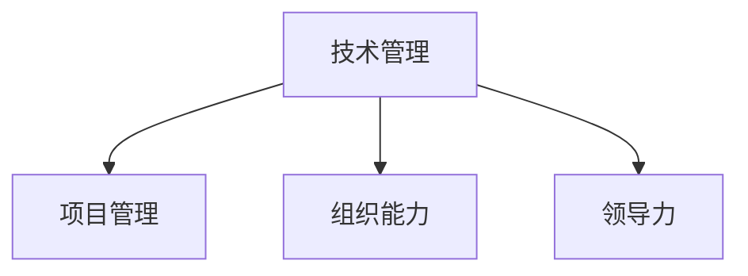

                 

# 如何将编程技能转化为管理能力

> 关键词：技术管理,编程技能,项目管理,组织能力,领导力

## 1. 背景介绍

### 1.1 问题由来
在科技快速发展的今天，技术人才不再只是埋头编程的“匠人”，而越来越多地被推向管理岗位。然而，许多技术人员在跨入管理角色的初始阶段，常常感到力不从心，难以平衡技术能力和管理职责。技术管理不仅涉及代码和团队，更涉及战略、流程和文化等多个维度的综合管理。本文将探讨如何通过系统的学习与实践，将编程技能有效地转化为管理能力，实现技术团队的高效运转和创新发展。

### 1.2 问题核心关键点
技术管理的关键在于理解技术、团队和业务的多重维度，并在实践中灵活运用这些知识。具体关键点包括：
- 技术理解：深入理解技术发展的趋势、项目的技术架构和实现细节。
- 团队管理：掌握团队沟通、协作、绩效管理等关键技能。
- 业务认知：了解公司战略、市场竞争和客户需求，以业务视角指导技术工作。

## 2. 核心概念与联系

### 2.1 核心概念概述

为更好地理解如何将编程技能转化为管理能力，本节将介绍几个密切相关的核心概念：

- 技术管理( Technical Management)：利用技术背景，通过领导和管理团队，实现项目的成功交付。
- 项目管理( Project Management)：规划、执行和监控项目以确保达成既定目标的学科。
- 组织能力( Organizational Skills)：包括领导力、沟通、团队建设等能力，使团队成员能够高效协同工作。
- 领导力( Leadership)：通过激励和影响团队成员，实现共同目标的领导能力。

这些核心概念之间的逻辑关系可以通过以下Mermaid流程图来展示：



这个流程图展示了许多核心概念之间的相互关系：

1. 技术管理是利用技术背景进行团队管理和项目交付的关键。
2. 项目管理是确保项目顺利进行的重要手段，也是技术管理的基础。
3. 组织能力是团队协作和管理的基础，影响着项目和团队的成功。
4. 领导力是团队凝聚力和成员动力的源泉，直接影响团队的工作状态和效率。

## 3. 核心算法原理 & 具体操作步骤

### 3.1 算法原理概述

将编程技能转化为管理能力的过程，本质上是将技术知识与组织管理技能相结合的过程。该过程遵循以下几个步骤：

1. **技术理解**：深入理解所负责项目的核心技术，包括架构设计、关键实现、性能瓶颈等。
2. **项目管理**：使用项目管理的工具和技术，如敏捷开发、Scrum等，确保项目按时高质量完成。
3. **组织能力**：通过沟通、协作、绩效管理等手段，提高团队的凝聚力和工作效率。
4. **领导力**：在团队中树立榜样，激发团队成员的积极性和创新能力，促进团队成长。

### 3.2 算法步骤详解

技术管理的过程可以大致分为以下几个关键步骤：

**Step 1: 理解项目和技术**
- 深入理解项目需求和目标，与业务团队沟通，明确技术边界。
- 分析项目的核心技术和关键技术点，识别潜在的风险和挑战。

**Step 2: 规划和执行项目管理**
- 选择合适的项目管理方法，如敏捷开发、Scrum、Kanban等。
- 制定项目计划，包括时间表、里程碑、资源分配等，确保项目可控。
- 跟踪项目进度，定期评估和调整，确保项目按时交付。

**Step 3: 强化组织能力**
- 建立高效的沟通渠道，促进团队内部和与业务团队的交流。
- 组织团队建设活动，提升团队凝聚力和协作能力。
- 实施绩效管理，评估和提升团队成员的工作表现。

**Step 4: 提升领导力**
- 以身作则，树立积极的领导形象，激励团队成员。
- 推动团队创新，鼓励尝试新技术和方法。
- 关注团队成员的职业发展，提供培训和晋升机会。

### 3.3 算法优缺点

将编程技能转化为管理能力具有以下优点：
- **知识迁移**：技术背景有助于更精准地理解技术需求和风险，避免盲目的项目管理。
- **高效沟通**：通过技术语言和案例，使团队和业务团队能更好地理解彼此。
- **问题解决**：技术背景有助于快速定位和解决项目中的技术难题。

同时，这一过程也存在一定的挑战：
- **知识跨界**：从技术到管理的思维模式和解决问题的方法需要调整。
- **时间投入**：管理角色需要更多的时间和精力，可能会影响个人技术提升。
- **团队管理**：处理复杂的人际关系和团队冲突，需要更多的软技能。

### 3.4 算法应用领域

基于以上算法，技术管理在以下领域中具有广泛应用：

- **软件开发生命周期**：从需求分析、设计、编码、测试到部署，每个环节都需要项目管理。
- **创新驱动型企业**：利用技术背景，推动技术创新和产品迭代。
- **数字化转型项目**：整合技术资源和业务需求，实现数字化转型。
- **跨部门协作**：与业务团队沟通合作，实现项目和业务目标的一致性。

## 4. 数学模型和公式 & 详细讲解 & 举例说明

### 4.1 数学模型构建

技术管理的数学模型可以从多个角度来构建，以下以敏捷开发为例，构建项目进度管理的数学模型。

假设项目分为 $n$ 个任务，每个任务的完成时间分别为 $t_i$，任务优先级分别为 $p_i$，当前已完成的任务数为 $c$。设总任务数为 $T$，则项目进度可以表示为：

$$
P = \frac{c}{T} \times 100\%
$$

任务完成时间 $t_i$ 和优先级 $p_i$ 的关系可以用PERT（计划评审与评估技术）模型表示：

$$
t_i = a_i + b_i E(t_i) + d_i
$$

其中 $a_i$ 为最乐观时间，$b_i$ 为最悲观时间，$d_i$ 为最可能时间，$E(t_i)$ 为期望完成时间。

### 4.2 公式推导过程

项目进度 $P$ 的计算公式为：

$$
P = \frac{c}{T} \times 100\%
$$

其中 $T = \sum_{i=1}^{n} t_i$，$c = \sum_{i=1}^{n} p_i \times t_i$。

通过对公式的求解，我们可以计算出当前项目的进度百分比，从而评估项目的整体健康状态。

### 4.3 案例分析与讲解

以软件开发项目为例，假设某软件开发项目有10个任务，每个任务的最乐观时间、最悲观时间和最可能时间如下：

| 任务编号 | 最乐观时间 | 最悲观时间 | 最可能时间 |
|----------|-----------|-----------|-----------|
| 1        | 2         | 3         | 3         |
| 2        | 3         | 4         | 4         |
| ...      | ...       | ...       | ...       |
| 10       | 7         | 10        | 9         |

根据上述数据，我们可以计算出每个任务的期望完成时间 $E(t_i)$：

$$
E(t_i) = \frac{a_i + d_i}{2} + b_i (1 - \frac{a_i + d_i}{2b_i + (a_i + d_i)})
$$

计算出的期望完成时间和任务优先级如上表所示。计算总任务时间 $T$ 和已完成任务数 $c$，即可得出当前项目的进度百分比：

$$
P = \frac{c}{T} \times 100\% = \frac{\sum_{i=1}^{n} p_i \times E(t_i)}{\sum_{i=1}^{n} E(t_i)}
$$

假设前5个任务已完成，则：

$$
P = \frac{5 \times 3}{(3+4+3+4+7+9+7+10)} \times 100\% = 39.47\%
$$

通过这种方式，我们可以对项目的进度进行科学评估，确保项目按时高质量完成。

## 5. 项目实践：代码实例和详细解释说明

### 5.1 开发环境搭建

在进行技术管理实践前，我们需要准备好开发环境。以下是使用Python进行Scrum管理的开发环境配置流程：

1. 安装Anaconda：从官网下载并安装Anaconda，用于创建独立的Python环境。

2. 创建并激活虚拟环境：
```bash
conda create -n scrum-env python=3.8 
conda activate scrum-env
```

3. 安装Scrum框架：
```bash
pip install scrum
```

4. 安装各类工具包：
```bash
pip install numpy pandas scikit-learn matplotlib tqdm jupyter notebook ipython
```

完成上述步骤后，即可在`scrum-env`环境中开始Scrum管理的实践。

### 5.2 源代码详细实现

以下是一个简单的Scrum管理代码实现，使用Scrum框架对软件开发项目进行管理。

首先，定义Scrum项目的初始参数：

```python
from scrum import Scrum

# 项目名称
project_name = 'MySoftwareProject'
# 开发团队
team_members = ['Alice', 'Bob', 'Charlie']
# 任务列表
tasks = [
    {'name': 'Task1', 'estimated_time': 10, 'priority': 1},
    {'name': 'Task2', 'estimated_time': 15, 'priority': 2},
    # 添加更多任务...
]
# 项目启动时间
start_date = '2023-10-01'
# 迭代周期长度，通常为1-4周
iteration_length = 2

# 创建Scrum项目
scrum_project = Scrum(project_name, team_members, tasks, start_date, iteration_length)
```

然后，定义Scrum项目的核心方法：

```python
# 开始迭代
scrum_project.start_iteration()

# 任务分配
scrum_project.assign_tasks()

# 任务执行
scrum_project.work_on_tasks()

# 任务提交
scrum_project.commit_tasks()

# 回顾会议
scrum_project.review_meeting()

# 迭代总结
scrum_project.finish_iteration()
```

最后，输出Scrum项目的进度和任务完成情况：

```python
# 输出项目进度
scrum_project.progress()

# 输出任务完成情况
scrum_project.completed_tasks()
```

以上就是使用Scrum框架对软件开发项目进行管理的完整代码实现。可以看到，借助Scrum框架，可以轻松实现项目管理的基本功能，如任务分配、进度跟踪、回顾会议等。

### 5.3 代码解读与分析

让我们再详细解读一下关键代码的实现细节：

**Scrum类定义**：
- `__init__`方法：初始化项目名称、开发团队、任务列表、启动时间和迭代长度等参数。
- `start_iteration`方法：启动迭代，进入Scrum循环。
- `assign_tasks`方法：将任务分配给团队成员。
- `work_on_tasks`方法：团队成员执行任务。
- `commit_tasks`方法：团队成员提交任务完成情况。
- `review_meeting`方法：进行回顾会议，收集反馈。
- `finish_iteration`方法：迭代总结，标记任务完成。

**进度和任务完成情况输出**：
- `progress`方法：输出当前项目的进度百分比。
- `completed_tasks`方法：输出已完成的任务列表。

**Scrum方法调用顺序**：
- 初始化Scrum项目后，首先调用 `start_iteration` 方法启动迭代。
- 在迭代中，先调用 `assign_tasks` 方法进行任务分配，然后调用 `work_on_tasks` 方法让团队成员执行任务。
- 每个迭代结束后，调用 `commit_tasks` 方法提交任务完成情况，接着调用 `review_meeting` 方法进行回顾会议。
- 每个迭代结束后，调用 `progress` 方法输出进度，调用 `completed_tasks` 方法输出已完成任务情况，最后调用 `finish_iteration` 方法总结迭代。

**迭代周期**：
- 迭代周期长度通常为1-4周，具体取决于项目需求和团队工作量。
- 每次迭代开始时，调用 `assign_tasks` 方法重新分配任务，保证每次迭代的任务均衡。
- 每次迭代结束时，调用 `commit_tasks` 方法提交任务完成情况，确保任务按时交付。

可以看到，借助Scrum框架，技术管理变得更加系统化和可控，有助于提升项目交付效率和团队协作能力。

## 6. 实际应用场景

### 6.1 软件开发团队

软件开发团队通过Scrum管理，可以有效提升项目的迭代效率和质量。具体应用场景包括：

- **敏捷开发**：使用Scrum框架进行敏捷开发，确保项目按时高质量交付。
- **任务分配**：通过Scrum，合理分配任务给团队成员，确保任务均衡。
- **进度跟踪**：实时跟踪项目进度，及时调整计划，确保项目按时交付。

### 6.2 产品迭代管理

产品迭代管理通过Scrum管理，可以更好地整合技术团队和业务团队，确保产品创新和市场需求的一致性。具体应用场景包括：

- **需求收集与优先级排序**：通过Scrum，定期收集业务需求，并根据优先级进行排序，确保高价值需求优先实施。
- **迭代发布**：通过Scrum，将需求分解为多个小任务，定期发布迭代，确保产品迭代快速上线。
- **用户反馈与迭代优化**：通过Scrum，定期进行回顾会议，收集用户反馈，持续优化产品功能。

### 6.3 项目管理培训

项目管理培训通过Scrum管理，可以提升项目管理专业知识和实战技能。具体应用场景包括：

- **项目管理培训**：通过Scrum管理工具，进行项目管理知识培训，帮助团队成员掌握Scrum的基本理念和方法。
- **项目管理实战**：通过Scrum管理实战，提升团队成员的项目管理技能，促进团队协作。
- **项目管理评估**：通过Scrum管理评估，评估团队成员的项目管理水平，发现和解决问题。

## 7. 工具和资源推荐

### 7.1 学习资源推荐

为了帮助技术人员系统掌握技术管理的方法和技巧，这里推荐一些优质的学习资源：

1. **《敏捷软件开发：原则、模式与实践》**：书籍详细介绍了敏捷开发的原则、模式和实践，是Scrum管理的学习指南。
2. **CSM - Certified Scrum Master®**：由Scrum Alliance推出的Scrum认证课程，通过系统学习Scrum知识，获得认证。
3. **《Scrum管理手册》**：由Scrum.org编写的官方手册，详细介绍了Scrum管理的各个方面，是Scrum管理的权威指南。
4. **Scrum.org**：提供Scrum认证、培训和社区资源，是Scrum管理的最佳实践平台。
5. **Scrum Foundation**：提供Scrum管理基础课程和认证，帮助技术人员掌握Scrum管理的基础知识和实战技巧。

通过对这些资源的学习实践，相信你一定能够快速掌握技术管理的精髓，并用于解决实际的NLP问题。

### 7.2 开发工具推荐

高效的开发离不开优秀的工具支持。以下是几款用于Scrum管理的常用工具：

1. **JIRA**：提供全面的项目管理功能，支持敏捷开发和Scrum管理。
2. **Confluence**：提供协作和文档管理功能，支持Scrum会议和回顾。
3. **Scrumwise**：提供Scrum管理仪表盘和分析功能，帮助团队实时跟踪项目进度和任务完成情况。
4. **Trello**：提供敏捷开发管理工具，支持任务分配和进度跟踪。
5. **Asana**：提供项目管理和协作工具，支持Scrum管理方法和敏捷开发。

合理利用这些工具，可以显著提升Scrum管理的效率，加快项目迭代的速度和质量。

### 7.3 相关论文推荐

Scrum管理在实践中得到了广泛应用，相关的研究也日益丰富。以下是几篇奠基性的相关论文，推荐阅读：

1. **《Scrum：一种简单但强大的框架》**：作者Jeff Sutherland和Ken Schwaber提出了Scrum管理框架，成为敏捷开发的重要基础。
2. **《敏捷项目管理：从Scrum到标准》**：本书详细介绍了Scrum管理方法，并提出了Scrum标准，是Scrum管理的权威指南。
3. **《敏捷管理：Scrum实战》**：作者Martin Fowler通过Scrum管理的实际案例，讲解了Scrum管理的详细实践。
4. **《敏捷项目管理：从Scrum到精益》**：本书通过Scrum管理，讲解了敏捷管理和精益管理的结合，是敏捷管理的深入实践。
5. **《Scrum：敏捷团队之最佳实践》**：本书详细介绍了Scrum管理的最佳实践，是Scrum管理的实战手册。

这些论文代表了大语言模型微调技术的发展脉络。通过学习这些前沿成果，可以帮助研究者把握学科前进方向，激发更多的创新灵感。

## 8. 总结：未来发展趋势与挑战

### 8.1 总结

本文对技术管理的核心概念和操作方法进行了全面系统的介绍。首先阐述了技术管理的重要性和具体关键点，明确了技术管理的多个维度和核心环节。其次，从原理到实践，详细讲解了Scrum管理的方法和步骤，给出了Scrum管理任务开发的完整代码实例。同时，本文还探讨了Scrum管理在软件开发、产品迭代、项目管理等多个场景中的应用，展示了Scrum管理的强大威力。最后，本文精选了Scrum管理的各类学习资源，力求为读者提供全方位的技术指引。

通过本文的系统梳理，可以看到，Scrum管理是技术管理的重要工具，能有效提升项目交付效率和团队协作能力。技术背景和管理技能的结合，是技术管理的核心。未来，伴随Scrum管理的不断演进和实践优化，必将在更多的应用领域大放异彩。

### 8.2 未来发展趋势

展望未来，Scrum管理技术将呈现以下几个发展趋势：

1. **技术集成**：将Scrum管理与更广泛的技术工具集集成，如CI/CD、DevOps等，实现自动化和智能化。
2. **数据驱动**：通过数据分析和可视化，帮助团队更好地理解项目进展和团队表现。
3. **持续改进**：通过持续反馈和迭代优化，提升Scrum管理的灵活性和适应性。
4. **混合敏捷**：结合不同的敏捷框架（如Scrum、Kanban、XP等），形成混合敏捷方法，满足不同项目的需求。
5. **多团队协作**：支持跨团队、跨部门的协作，提升项目管理的协作能力和效率。

这些趋势凸显了Scrum管理技术的广泛应用前景，将进一步提升项目管理的灵活性和响应性。

### 8.3 面临的挑战

尽管Scrum管理在实践中得到了广泛应用，但在迈向更加智能化、普适化应用的过程中，它仍面临着诸多挑战：

1. **团队转型**：从技术角色转型为管理角色，需要团队成员适应新的角色和职责。
2. **沟通复杂性**：Scrum管理需要团队成员之间的有效沟通，避免信息不对称和误解。
3. **领导力挑战**：Scrum管理要求团队领导具备良好的领导力和决策能力。
4. **资源配置**：Scrum管理需要合理的资源配置和任务分配，避免资源浪费和瓶颈。
5. **质量保证**：Scrum管理需要严格的流程和质量保证措施，避免低质量交付。

这些挑战需要团队成员和领导者共同努力，通过不断的学习和实践，逐步克服。

### 8.4 研究展望

面对Scrum管理所面临的挑战，未来的研究需要在以下几个方面寻求新的突破：

1. **敏捷与精益结合**：将敏捷管理与精益管理结合，形成混合敏捷方法，提升项目管理的灵活性和适应性。
2. **数据驱动管理**：通过数据分析和机器学习技术，优化Scrum管理过程，提高项目管理效率。
3. **智能项目管理**：结合AI和机器学习技术，实现自动化和智能化项目管理。
4. **跨团队协作**：开发支持跨团队协作的工具和平台，提升项目管理的协作能力和效率。
5. **项目管理培训**：开发更加系统化、实战化的项目管理培训课程，提升团队成员的管理能力。

这些研究方向的探索，必将引领Scrum管理技术迈向更高的台阶，为构建高效、灵活的项目管理团队铺平道路。面向未来，Scrum管理技术还需要与其他技术管理方法进行更深入的融合，共同推动技术管理的发展和优化。

## 9. 附录：常见问题与解答

**Q1：Scrum管理适用于所有项目吗？**

A: Scrum管理适用于敏捷开发和迭代管理项目，但不适用于需求稳定、任务明确的项目。对于需求变化频繁、复杂度高的项目，Scrum管理能够提升项目的交付效率和团队协作能力。

**Q2：如何选择合适的迭代周期长度？**

A: 迭代周期长度通常为1-4周，具体取决于项目需求和团队工作量。可以根据项目的特点和团队的工作能力，选择适合的迭代周期长度。

**Q3：Scrum管理需要哪些工具支持？**

A: Scrum管理需要集成多个工具，如JIRA、Confluence、Scrumwise等。这些工具可以提供任务分配、进度跟踪、回顾会议等功能，提升项目管理效率。

**Q4：Scrum管理有哪些核心步骤？**

A: Scrum管理的核心步骤包括：
- 启动项目：明确项目目标和范围。
- 制定计划：确定迭代周期、任务分配。
- 执行任务：团队成员执行任务。
- 回顾会议：收集反馈和改进建议。
- 迭代总结：总结迭代成果和改进点。

这些步骤确保项目按时高质量完成，同时不断优化项目管理方法。

**Q5：如何提高Scrum管理的效果？**

A: 提高Scrum管理的效果需要从多个方面入手：
- 持续学习和实践：通过持续学习和实践，提升项目管理能力。
- 定期回顾和改进：定期进行回顾会议，收集反馈和改进建议。
- 团队协作和沟通：建立高效的沟通渠道，促进团队协作。
- 领导力建设：提升团队领导的领导力和决策能力。

通过系统化的管理，确保项目按时高质量完成，提升团队协作和项目交付效率。

---

作者：禅与计算机程序设计艺术 / Zen and the Art of Computer Programming

