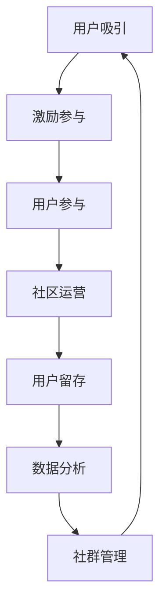

                 

# 如何建立长期稳定的用户社群

> 关键词：社群管理, 用户行为分析, 社区运营, 用户参与度, 用户留存率, 用户体验, 数据驱动, 激励机制

## 1. 背景介绍

### 1.1 问题由来

在互联网时代，建立长期稳定的用户社群是许多企业追求的目标。无论是社交媒体、论坛、在线课程还是电子商务平台，社群的活跃度和留存率对企业的发展都至关重要。然而，面对高度竞争的市场和不断变化的用户需求，如何吸引、留住用户，并激发用户参与，成为一个亟待解决的问题。

### 1.2 问题核心关键点

成功建立长期稳定的用户社群，需要从多个维度进行综合考虑：

- **吸引用户**：如何通过吸引策略和用户路径设计，让潜在用户转化为活跃用户。
- **激励参与**：如何通过激励机制和互动方式，持续激发用户参与和内容创造。
- **社区运营**：如何通过有效的社区管理和内容运营，维护社群秩序，提升用户粘性。
- **数据分析**：如何通过用户行为分析，发现用户需求，优化社群运营策略。
- **用户留存**：如何通过用户留存策略，防止用户流失，提高社群的生命周期。

本文将围绕以上关键点，系统地探讨建立长期稳定的用户社群的方法和策略。

## 2. 核心概念与联系

### 2.1 核心概念概述

- **社群管理**：指对用户社群进行有效管理和运营，包括用户路径设计、内容运营、社区规则制定等。
- **用户行为分析**：通过数据收集和分析，理解用户行为和需求，指导社群运营决策。
- **社区运营**：通过活动策划、内容更新、用户互动等方式，提高用户参与度和社群活跃度。
- **激励机制**：设计合理的激励策略，如积分、奖励、排行榜等，激发用户积极参与。
- **用户体验**：提升用户在使用过程中的满意度，包括界面设计、操作便捷性、功能完善性等。
- **用户留存**：采取多种策略，如定期推送、用户关怀、个性化推荐等，防止用户流失，提升用户留存率。

这些核心概念之间的联系可以通过以下Mermaid流程图来展示：



这个流程图展示了一系列用户社群运营的循环过程：

1. **用户吸引**：通过各种手段吸引新用户加入社群。
2. **激励参与**：设计激励机制，鼓励用户积极参与。
3. **用户参与**：用户积极参与社群活动，生成内容。
4. **社区运营**：通过运营策略保持社群活跃。
5. **用户留存**：采取措施防止用户流失，提高留存率。
6. **数据分析**：通过数据反馈优化运营策略。
7. **社群管理**：维护社群秩序，提升用户体验。

这些关键环节相互影响，形成一个良性循环，共同支撑社群的长期稳定发展。

## 3. 核心算法原理 & 具体操作步骤

### 3.1 算法原理概述

建立长期稳定的用户社群，本质上是一个多目标优化问题。目标包括吸引新用户、激励用户参与、保持社群活跃、防止用户流失等。为此，我们需要设计一系列算法和策略，通过不断迭代优化，达成以上目标。

具体来说，我们可以将问题分解为以下几个子问题：

- **用户路径设计**：通过用户旅程地图和A/B测试，找到吸引用户的最佳路径。
- **激励机制设计**：根据用户行为数据，设计个性化激励策略，提升用户参与度。
- **社区运营优化**：通过内容分析、活动策划等手段，提高社群活跃度。
- **用户留存策略**：利用用户行为数据，制定个性化留存策略，防止用户流失。
- **数据分析应用**：通过用户行为分析，发现用户需求，优化社群运营策略。

### 3.2 算法步骤详解

#### 3.2.1 用户路径设计

**Step 1: 用户旅程地图绘制**
- 收集用户在社群中的行为数据，包括注册、登录、浏览、互动等。
- 绘制用户旅程地图，识别用户在不同阶段的关键触点和痛点。
- 根据地图优化用户路径，简化用户体验，提升转化率。

**Step 2: A/B测试**
- 对优化后的用户路径进行A/B测试，比较不同路径的用户转化率和留存率。
- 根据测试结果调整优化策略，找到最有效的用户路径。

**Step 3: 用户引导策略**
- 制定用户引导策略，如新用户引导视频、任务奖励等，帮助新用户快速融入社群。
- 定期更新引导策略，根据用户反馈和数据表现进行优化。

#### 3.2.2 激励机制设计

**Step 1: 激励模型建立**
- 收集用户行为数据，如内容创造、互动、分享等，建立激励模型。
- 根据模型预测用户的激励需求，设计个性化激励策略。

**Step 2: 激励机制实施**
- 实施激励机制，如积分、奖励、排行榜等，激发用户积极参与。
- 定期更新激励策略，根据用户行为数据进行调整。

**Step 3: 激励效果评估**
- 通过数据监控和用户反馈，评估激励机制的效果。
- 根据评估结果优化激励策略，提高用户参与度。

#### 3.2.3 社区运营优化

**Step 1: 内容分析**
- 分析社群内容数据，识别热门话题和用户兴趣。
- 根据分析结果调整内容策略，优化内容生成和分发。

**Step 2: 活动策划**
- 策划有吸引力的社群活动，如话题讨论、竞赛、直播等。
- 通过活动提升社群活跃度，增加用户互动。

**Step 3: 互动管理**
- 通过工具和技术手段，如智能回复、用户推荐等，提升用户互动质量。
- 定期分析用户互动数据，发现互动问题，优化互动策略。

#### 3.2.4 用户留存策略

**Step 1: 用户行为分析**
- 收集用户行为数据，分析用户流失的原因和关键因素。
- 根据分析结果制定针对性的用户留存策略。

**Step 2: 个性化留存策略**
- 实施个性化留存策略，如定期推送、用户关怀、个性化推荐等。
- 通过个性化策略提升用户留存率，防止用户流失。

**Step 3: 用户关怀**
- 定期进行用户关怀，如生日问候、节日祝福等，增强用户粘性。
- 建立用户关怀机制，提升用户满意度和忠诚度。

#### 3.2.5 数据分析应用

**Step 1: 数据收集**
- 收集用户行为数据，包括注册、登录、互动、内容生成等。
- 确保数据准确性和完整性，为分析提供可靠基础。

**Step 2: 数据分析**
- 利用数据分析工具和技术，如统计分析、机器学习等，分析用户行为和需求。
- 发现用户痛点和需求，优化社群运营策略。

**Step 3: 数据应用**
- 根据数据分析结果，优化用户路径、激励机制、内容策略等。
- 定期回顾和调整策略，确保社群运营的有效性和持续性。

### 3.3 算法优缺点

#### 3.3.1 用户路径设计

**优点**：
- 通过用户旅程地图和A/B测试，能够更准确地识别用户痛点和优化路径。
- 可以量化优化效果，提供数据支持。

**缺点**：
- 需要大量数据和时间进行分析和测试。
- 需要频繁更新优化策略，增加运营成本。

#### 3.3.2 激励机制设计

**优点**：
- 个性化激励策略能够更好地满足用户需求，提高用户参与度。
- 动态调整激励策略，能够及时响应用户行为变化。

**缺点**：
- 激励机制设计复杂，需要数据分析和模型建立。
- 成本较高，需要持续投入。

#### 3.3.3 社区运营优化

**优点**：
- 通过内容分析和活动策划，能够提升社群活跃度和用户粘性。
- 互动管理和个性化推荐能够增强用户互动质量。

**缺点**：
- 需要投入大量资源进行内容生成和活动策划。
- 互动管理需要技术支持，增加运营复杂性。

#### 3.3.4 用户留存策略

**优点**：
- 通过用户行为分析和个性化留存策略，能够有效防止用户流失。
- 用户关怀机制能够增强用户满意度和忠诚度。

**缺点**：
- 用户行为分析需要大量数据，数据收集和分析成本较高。
- 个性化策略实施复杂，需要持续投入。

#### 3.3.5 数据分析应用

**优点**：
- 数据驱动的策略能够更准确地满足用户需求。
- 数据应用可以持续优化社群运营，提升运营效果。

**缺点**：
- 需要较高的数据收集和分析能力。
- 数据应用需要结合实际运营情况，不断调整优化。

### 3.4 算法应用领域

#### 3.4.1 社交媒体

在社交媒体平台上，建立长期稳定的用户社群尤为重要。通过上述方法，可以设计有效的用户路径、激励机制、内容策略等，提升用户参与度和留存率。例如，Facebook通过定期推送和个性化推荐，提升了用户粘性和活跃度。

#### 3.4.2 在线课程平台

在线课程平台需要吸引用户参与和学习，防止用户流失。通过上述方法，可以设计科学的用户路径、激励机制和内容策略，提高用户留存率。例如，Coursera通过积分奖励和定期推送，提升了用户参与度和留存率。

#### 3.4.3 电子商务平台

电子商务平台需要吸引用户购物和复购，防止用户流失。通过上述方法，可以设计有效的用户路径、激励机制和个性化推荐策略，提升用户留存率和消费转化率。例如，Amazon通过积分奖励和个性化推荐，提升了用户复购率和平台粘性。

## 4. 数学模型和公式 & 详细讲解 & 举例说明

### 4.1 数学模型构建

建立用户社群的数学模型可以概括为以下几个关键组件：

- **用户流失模型**：预测用户流失概率，帮助识别高流失风险用户。
- **用户参与模型**：预测用户参与度，评估激励机制效果。
- **内容影响模型**：预测内容对用户参与度的影响，优化内容策略。
- **活动效果模型**：评估活动对社群活跃度的提升效果。

以用户流失模型为例，我们可以使用Logistic回归模型预测用户流失概率，模型形式为：

$$
P(Y=1|X) = \frac{1}{1+e^{-(\beta_0 + \beta_1X_1 + \beta_2X_2 + ... + \beta_nX_n)}}
$$

其中，$X_1, X_2, ..., X_n$ 为用户行为特征，如注册时间、互动频率、内容生成等，$\beta_0, \beta_1, ..., \beta_n$ 为模型系数，$Y=1$ 表示用户流失，$Y=0$ 表示用户未流失。

### 4.2 公式推导过程

#### 4.2.1 用户流失模型

假设用户流失率为$p$，基于用户行为特征$X$的流失概率模型为：

$$
P(Y=1|X) = \frac{1}{1+e^{-(\beta_0 + \beta_1X_1 + \beta_2X_2 + ... + \beta_nX_n)}}
$$

其中，$X_1, X_2, ..., X_n$ 为用户行为特征，$\beta_0, \beta_1, ..., \beta_n$ 为模型系数。

假设观测到$N$个用户，每个用户的流失概率为$p$，则对每个用户$i$，观测到的流失事件$Y_i$服从二项分布：

$$
Y_i \sim Bernoulli(p)
$$

根据最大似然估计，可以估计模型系数：

$$
\hat{\beta} = \arg\min_{\beta} -\sum_{i=1}^{N}log[P(Y_i=1|X_i) + (1-P(Y_i=1|X_i))]
$$

通过对模型进行拟合，可以预测用户流失概率，帮助识别高流失风险用户。

#### 4.2.2 用户参与模型

用户参与度可以通过用户互动频率、内容生成量等指标衡量。假设用户参与度为$Z$，基于用户行为特征$X$的参与度模型为：

$$
Z = \alpha_0 + \alpha_1X_1 + \alpha_2X_2 + ... + \alpha_nX_n + \epsilon
$$

其中，$X_1, X_2, ..., X_n$ 为用户行为特征，$\alpha_0, \alpha_1, ..., \alpha_n$ 为模型系数，$\epsilon$ 为误差项。

通过对模型进行拟合，可以预测用户参与度，评估激励机制效果。例如，可以通过模型预测激励措施（如积分奖励、排行榜）对用户参与度的影响，优化激励策略。

#### 4.2.3 内容影响模型

内容对用户参与度的影响可以通过A/B测试等方法评估。假设内容$C$对用户参与度$Z$的影响为：

$$
Z = \delta_0 + \delta_1C_1 + \delta_2C_2 + ... + \delta_mC_m + \epsilon
$$

其中，$C_1, C_2, ..., C_m$ 为不同内容，$\delta_0, \delta_1, ..., \delta_m$ 为内容影响系数，$\epsilon$ 为误差项。

通过对模型进行拟合，可以评估不同内容对用户参与度的影响，优化内容策略。例如，可以通过模型预测不同内容对用户参与度的影响，优化内容生成和分发策略。

#### 4.2.4 活动效果模型

活动对社群活跃度的提升效果可以通过数据分析评估。假设活动$A$对社群活跃度$S$的影响为：

$$
S = \lambda_0 + \lambda_1A_1 + \lambda_2A_2 + ... + \lambda_nA_n + \epsilon
$$

其中，$A_1, A_2, ..., A_n$ 为不同活动，$\lambda_0, \lambda_1, ..., \lambda_n$ 为活动效果系数，$\epsilon$ 为误差项。

通过对模型进行拟合，可以评估不同活动对社群活跃度的影响，优化活动策略。例如，可以通过模型预测不同活动对社群活跃度的影响，优化活动策划和实施。

### 4.3 案例分析与讲解

#### 4.3.1 案例背景

假设某电子商务平台希望通过激励机制和内容策略提升用户留存率。平台收集了用户注册、登录、购物、互动、内容生成等行为数据，通过数据分析发现用户流失率较高，且用户参与度较低。

#### 4.3.2 用户流失模型

首先，通过用户流失模型预测高流失风险用户，帮助平台进行针对性干预。假设观测到$N$个用户，每个用户的流失概率为$p$，基于用户行为特征$X$的流失概率模型为：

$$
P(Y=1|X) = \frac{1}{1+e^{-(\beta_0 + \beta_1X_1 + \beta_2X_2 + ... + \beta_nX_n)}}
$$

假设观测到用户$i$，其流失事件$Y_i$服从二项分布：

$$
Y_i \sim Bernoulli(p)
$$

根据最大似然估计，可以估计模型系数$\hat{\beta}$，预测用户流失概率。

#### 4.3.3 用户参与模型

其次，通过用户参与模型评估激励机制效果。假设用户参与度为$Z$，基于用户行为特征$X$的参与度模型为：

$$
Z = \alpha_0 + \alpha_1X_1 + \alpha_2X_2 + ... + \alpha_nX_n + \epsilon
$$

通过对模型进行拟合，可以预测用户参与度，评估激励机制效果。例如，可以通过模型预测积分奖励对用户参与度的影响，优化激励策略。

#### 4.3.4 内容影响模型

再次，通过内容影响模型优化内容策略。假设内容$C$对用户参与度$Z$的影响为：

$$
Z = \delta_0 + \delta_1C_1 + \delta_2C_2 + ... + \delta_mC_m + \epsilon
$$

通过对模型进行拟合，可以评估不同内容对用户参与度的影响，优化内容生成和分发策略。例如，可以通过模型预测不同内容对用户参与度的影响，优化内容生成和分发策略。

#### 4.3.5 活动效果模型

最后，通过活动效果模型优化活动策略。假设活动$A$对社群活跃度$S$的影响为：

$$
S = \lambda_0 + \lambda_1A_1 + \lambda_2A_2 + ... + \lambda_nA_n + \epsilon
$$

通过对模型进行拟合，可以评估不同活动对社群活跃度的影响，优化活动策划和实施。例如，可以通过模型预测不同活动对社群活跃度的影响，优化活动策划和实施。

## 5. 项目实践：代码实例和详细解释说明

### 5.1 开发环境搭建

在开始实践前，需要准备好开发环境。以下是使用Python进行数据分析和模型训练的环境配置流程：

1. 安装Python：从官网下载并安装Python，确保版本为3.6及以上。
2. 安装NumPy、Pandas、Scikit-learn、Matplotlib等数据分析库：
```bash
pip install numpy pandas scikit-learn matplotlib
```
3. 安装TensorFlow或PyTorch：
```bash
pip install tensorflow
```
4. 安装Keras等深度学习框架：
```bash
pip install keras
```

完成上述步骤后，即可在Python环境中开始数据分析和模型训练。

### 5.2 源代码详细实现

以下是一个使用TensorFlow进行用户流失预测的Python代码实现。

```python
import tensorflow as tf
import pandas as pd
from sklearn.model_selection import train_test_split

# 加载数据
data = pd.read_csv('user_data.csv')
X = data[['login_frequency', 'shopping_frequency', 'content_creation_frequency']]
y = data['churn']

# 划分训练集和测试集
X_train, X_test, y_train, y_test = train_test_split(X, y, test_size=0.2)

# 定义模型
model = tf.keras.Sequential([
    tf.keras.layers.Dense(64, activation='relu', input_shape=(X_train.shape[1],)),
    tf.keras.layers.Dense(1, activation='sigmoid')
])

# 编译模型
model.compile(optimizer='adam', loss='binary_crossentropy', metrics=['accuracy'])

# 训练模型
model.fit(X_train, y_train, epochs=10, batch_size=32, validation_data=(X_test, y_test))

# 评估模型
model.evaluate(X_test, y_test)
```

以上代码实现了一个简单的二分类模型，用于预测用户流失概率。首先，加载用户行为数据，并将其划分为训练集和测试集。然后，定义模型并进行编译，最后使用训练集训练模型，并使用测试集评估模型效果。

### 5.3 代码解读与分析

让我们再详细解读一下关键代码的实现细节：

**加载数据**：
- 使用Pandas加载用户行为数据。
- 从数据中提取用户行为特征$X$和用户流失标签$y$。

**模型定义**：
- 使用TensorFlow定义一个包含两个全连接层的神经网络模型，使用ReLU激活函数。
- 输出层使用Sigmoid激活函数，输出结果在0到1之间，表示用户流失概率。

**模型编译**：
- 使用Adam优化器进行模型训练。
- 使用二元交叉熵损失函数，适用于二分类任务。

**模型训练**：
- 使用训练集训练模型，指定训练轮数和批次大小。
- 使用测试集评估模型性能。

**模型评估**：
- 使用测试集评估模型性能，输出模型的准确率和损失值。

可以看到，TensorFlow提供了丰富的API，使得模型定义、编译、训练、评估等步骤非常直观和便捷。开发者可以根据具体需求，选择不同的深度学习框架和工具，快速实现数据分析和模型训练。

## 6. 实际应用场景

### 6.1 智能客服系统

智能客服系统通过建立长期稳定的用户社群，可以大幅提升客户服务质量，降低人力成本。通过用户路径设计和激励机制，吸引客户加入社群，并提供即时响应和个性化服务。例如，某电商平台的智能客服系统，通过定期推送和用户关怀，提升了客户满意度和留存率。

### 6.2 在线教育平台

在线教育平台需要吸引和留存学生，激发学生积极参与。通过用户路径设计、激励机制和内容策略，提升学生参与度和留存率。例如，某在线教育平台通过积分奖励和定期推送，提升了学生参与度和平台粘性。

### 6.3 医疗健康应用

医疗健康应用需要建立长期稳定的用户社群，提高用户粘性和参与度。通过用户路径设计、激励机制和健康管理策略，提升用户留存率和健康监测效果。例如，某健康应用通过个性化健康建议和用户关怀，提升了用户粘性和平台活跃度。

## 7. 工具和资源推荐

### 7.1 学习资源推荐

为了帮助开发者系统掌握用户社群管理的方法和策略，这里推荐一些优质的学习资源：

1. 《用户行为分析与设计》（原书中文名）：详细介绍了用户行为分析的理论和实践，帮助开发者更好地理解用户需求。
2. 《社群运营与用户参与度提升》课程：深入浅出地讲解了社群运营的核心策略和实战技巧。
3. 《机器学习实战》（原书中文名）：通过多个案例演示，帮助开发者掌握机器学习的基本流程和技术。
4. 《深度学习框架实战》课程：详细介绍了TensorFlow、PyTorch等深度学习框架的使用，帮助开发者快速上手数据分析和模型训练。

通过对这些资源的学习实践，相信你一定能够掌握用户社群管理的方法和策略，并用于解决实际的运营问题。

### 7.2 开发工具推荐

高效的开发离不开优秀的工具支持。以下是几款用于数据分析和模型训练的常用工具：

1. TensorFlow：由Google主导开发的深度学习框架，支持分布式训练和模型部署。
2. PyTorch：Facebook开源的深度学习框架，灵活易用，适合研究和快速迭代。
3. Jupyter Notebook：交互式开发环境，方便开发者进行数据分析和模型训练。
4. Scikit-learn：Python中的经典机器学习库，提供多种算法和工具，帮助开发者快速实现数据分析和模型训练。
5. Pandas：数据处理和分析库，方便开发者进行数据清洗和预处理。

合理利用这些工具，可以显著提升用户社群管理的开发效率，加快创新迭代的步伐。

### 7.3 相关论文推荐

用户社群管理的研究源于学界的持续探索。以下是几篇奠基性的相关论文，推荐阅读：

1. "A Study of Online Communities: Participant Lifespan and Intention to Participate"：通过实证研究，探讨了在线社区用户留存的关键因素。
2. "The Science of User Experience"：详细介绍了用户体验设计的理论和方法，帮助开发者提升用户满意度。
3. "Machine Learning in Healthcare: Opportunities and Challenges"：探讨了机器学习在医疗健康领域的应用前景和挑战。
4. "The Dark Side of Social Media: Online Participation and User Well-being"：分析了社交媒体对用户心理健康的影响，帮助开发者理解用户行为。
5. "A Survey on Personalized Recommendation System in E-Commerce"：详细介绍了个性化推荐系统的理论和应用，帮助开发者提升推荐效果。

这些论文代表了用户社群管理的研究前沿，通过学习这些前沿成果，可以帮助开发者把握学科发展方向，激发更多的创新灵感。

## 8. 总结：未来发展趋势与挑战

### 8.1 总结

本文对建立长期稳定的用户社群的方法和策略进行了系统介绍。首先，通过用户路径设计、激励机制、社区运营、数据分析和用户留存等关键环节，探讨了建立稳定用户社群的方法。其次，通过数学模型和算法，详细讲解了用户流失预测、用户参与度评估、内容策略优化和活动效果评估等核心技术。最后，通过案例分析，展示了这些方法和策略在实际应用中的具体应用效果。

通过本文的系统梳理，可以看到，建立长期稳定的用户社群需要从多个维度进行综合考虑，并结合数据驱动的方法进行优化。只有在数据、算法、运营、用户等多个环节进行全面优化，才能真正实现社群的长期稳定发展。

### 8.2 未来发展趋势

展望未来，用户社群管理的发展趋势主要包括以下几个方面：

1. **数据驱动**：通过数据分析和机器学习，更好地理解用户需求和行为，指导社群运营决策。
2. **个性化运营**：利用个性化策略和推荐算法，提升用户粘性和参与度。
3. **智能运营**：引入智能算法和自动化工具，提升运营效率和决策质量。
4. **社交化运营**：通过社交媒体和用户社区，增强用户互动和品牌影响力。
5. **多渠道整合**：整合多渠道数据和运营策略，实现全面覆盖和精准触达。

### 8.3 面临的挑战

尽管用户社群管理的研究已经取得了一些进展，但在实际应用中，仍然面临诸多挑战：

1. **数据隐私和安全**：在收集和分析用户数据时，需要严格遵守数据隐私和安全法规，确保用户数据的安全。
2. **用户行为变化**：用户行为和需求不断变化，需要持续跟踪和分析，及时调整运营策略。
3. **跨平台整合**：不同平台的数据和运营策略整合难度较大，需要建立统一的数据管理和运营平台。
4. **运营成本高**：数据分析和机器学习需要投入大量资源，增加了运营成本。
5. **用户体验不一致**：多渠道和多平台的用户体验不一致，需要优化用户体验和界面设计。

### 8.4 研究展望

面对用户社群管理所面临的挑战，未来的研究需要在以下几个方面寻求新的突破：

1. **数据隐私保护**：研究隐私保护技术和算法，确保用户数据的安全和隐私。
2. **用户行为预测**：通过更先进的机器学习和预测技术，更好地理解和预测用户行为。
3. **跨平台整合**：研究跨平台数据整合和协同运营策略，实现全面覆盖和精准触达。
4. **低成本运营**：研究低成本的运营策略和技术，降低运营成本。
5. **用户体验优化**：研究用户界面设计和用户体验优化方法，提升用户满意度。

## 9. 附录：常见问题与解答

**Q1：如何设计有效的用户路径？**

A: 用户路径设计需要结合用户旅程地图和A/B测试。首先，绘制用户旅程地图，识别用户在不同阶段的关键触点和痛点。然后，通过A/B测试找到最有效的用户路径。最后，制定用户引导策略，帮助新用户快速融入社群。

**Q2：如何设计合理的激励机制？**

A: 激励机制设计需要基于用户行为数据分析。首先，收集用户行为数据，建立激励模型。然后，根据模型预测用户的激励需求，设计个性化激励策略。最后，定期更新激励策略，根据用户行为数据进行调整。

**Q3：如何提升社群活跃度？**

A: 提升社群活跃度需要结合内容分析和活动策划。首先，分析社群内容数据，识别热门话题和用户兴趣。然后，策划有吸引力的社群活动，如话题讨论、竞赛、直播等。最后，通过智能回复和用户推荐等手段，提升用户互动质量。

**Q4：如何防止用户流失？**

A: 防止用户流失需要结合用户行为分析和个性化留存策略。首先，收集用户行为数据，分析用户流失的原因和关键因素。然后，制定个性化留存策略，如定期推送、用户关怀、个性化推荐等。最后，建立用户关怀机制，提升用户满意度和忠诚度。

**Q5：如何优化用户体验？**

A: 优化用户体验需要结合界面设计、操作便捷性和功能完善性。首先，设计简洁直观的用户界面。然后，优化操作流程，减少用户操作步骤。最后，完善功能模块，提升用户使用体验。

