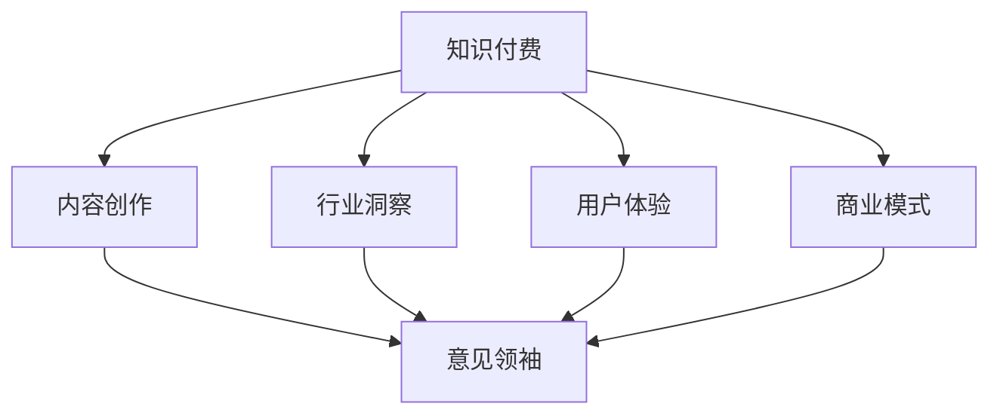

                 

# 如何成为知识付费行业的意见领袖

> 关键词：知识付费, 意见领袖, 内容创作, 专业技能, 行业洞察, 数据驱动, 用户体验, 商业模式

## 1. 背景介绍

### 1.1 问题由来

随着知识付费的兴起，越来越多的人通过订阅高质量内容来获取知识，从而促进个人或职业发展。知识付费行业的崛起不仅反映了社会对知识需求的增加，也展示了知识内容的经济价值。然而，在这个高度竞争的领域，如何成为行业内的意见领袖是一个重要的议题。

### 1.2 问题核心关键点

成为知识付费行业的意见领袖，不仅需要具备高质量的内容创作能力，更需要具备行业洞察力、数据驱动决策能力以及优秀的用户体验设计能力。以下是成为知识付费行业意见领袖的几个核心关键点：

- **高质量内容创作**：内容是知识付费的基石，高质量、有深度的内容能够吸引并留住用户。
- **行业洞察力**：对行业趋势和用户需求的敏锐洞察力，能帮助内容创作者精准定位并满足用户需求。
- **数据驱动决策**：通过数据分析进行内容优化和调整，提升内容的精准度和用户满意度。
- **用户体验设计**：设计良好的用户体验能够增强用户粘性，提高用户留存率和付费率。
- **商业模式**：合理、可持续的商业模式能够确保知识付费项目的长期发展。

## 2. 核心概念与联系

### 2.1 核心概念概述

为更好地理解如何成为知识付费行业的意见领袖，本节将介绍几个密切相关的核心概念：

- **知识付费**：指通过付费订阅获取专业知识和技能的在线内容平台，涵盖内容创作、平台运营、用户互动等多个环节。
- **意见领袖**：在特定领域内，具备高影响力的个人或团队，其观点和行为能影响他人。
- **内容创作**：涉及内容选题、撰写、编辑、设计等全流程，旨在提供有价值、有深度的知识内容。
- **行业洞察**：通过数据分析和市场研究，理解行业动态、用户需求和技术趋势。
- **用户体验**：聚焦于用户需求和心理，设计并优化内容呈现和交互体验。
- **商业模式**：基于用户需求和市场环境，设计可持续的盈利模式和增值服务。

这些核心概念之间的逻辑关系可以通过以下Mermaid流程图来展示：



这个流程图展示了知识付费行业内各个环节的相互关系，以及内容创作者如何通过高质量的内容创作、行业洞察、用户体验设计和商业模式创新，最终成为意见领袖。

## 3. 核心算法原理 & 具体操作步骤
### 3.1 算法原理概述

成为知识付费行业的意见领袖，虽然主要依赖于软技能和行业经验，但也可以借助一些算法和工具来优化内容创作和运营策略。以下是基于算法和数据驱动的具体操作步骤：

### 3.2 算法步骤详解

#### 3.2.1 数据收集与处理

1. **用户行为数据**：收集用户订阅行为、浏览历史、互动反馈等数据，以了解用户偏好和需求。
2. **内容质量数据**：通过用户评分、评论、订阅量等指标评估内容质量和受欢迎程度。
3. **市场趋势数据**：收集行业报告、新闻、用户反馈等数据，分析市场趋势和用户痛点。

#### 3.2.2 内容优化

1. **关键词分析**：使用自然语言处理(NLP)技术，分析热门内容中的关键词和话题，优化选题。
2. **用户画像构建**：通过用户行为数据和内容质量数据，构建详细的用户画像，指导内容创作。
3. **内容推荐系统**：利用推荐算法，根据用户画像和内容标签，精准推荐高质量内容，提升用户体验。

#### 3.2.3 用户体验设计

1. **界面设计**：采用UI/UX设计原则，优化内容呈现方式，提升用户视觉体验。
2. **交互设计**：设计简洁、直观的交互流程，减少用户操作步骤，提高用户满意度。
3. **反馈机制**：建立有效的用户反馈机制，及时收集用户意见和建议，持续优化内容和服务。

#### 3.2.4 商业模式设计

1. **定价策略**：基于内容价值和用户需求，制定合理的价格策略，平衡收益和用户支付能力。
2. **增值服务**：提供专家咨询、定制内容、社群互动等增值服务，丰富用户体验，增加收益来源。
3. **合作生态**：与行业内外的专家、机构合作，形成互利共赢的合作生态，共同提升内容质量和用户粘性。

### 3.3 算法优缺点

#### 3.3.1 优点

- **数据驱动**：通过数据驱动决策，提高内容创作和运营的精准度，提升用户满意度和留存率。
- **用户体验优化**：设计良好的用户体验，增强用户粘性，提高用户互动和付费率。
- **内容多样化**：借助算法推荐系统，提供个性化内容推荐，满足不同用户需求。

#### 3.3.2 缺点

- **数据隐私**：处理用户行为数据和内容质量数据时，需注意数据隐私保护，避免信息泄露。
- **技术门槛**：需要掌握一定的数据处理和算法优化技术，对技术人员要求较高。
- **模型复杂性**：复杂算法模型的构建和维护，需要较高的时间成本和资源投入。

## 4. 数学模型和公式 & 详细讲解  
### 4.1 数学模型构建

在知识付费行业中，数据驱动决策和内容优化是关键环节。以下是数学模型的构建过程：

#### 4.1.1 内容质量评估

设内容的质量为 $Q$，其由用户评分 $R$、内容互动量 $I$ 和内容时长 $T$ 组成：

$$ Q = \alpha R + \beta I + \gamma T $$

其中 $\alpha, \beta, \gamma$ 为权重系数，需根据实际情况调整。

#### 4.1.2 用户画像构建

设用户画像为 $P$，由兴趣标签 $L$、活跃度 $A$ 和支付意愿 $W$ 组成：

$$ P = \delta L + \epsilon A + \zeta W $$

其中 $\delta, \epsilon, \zeta$ 为权重系数，需根据实际情况调整。

#### 4.1.3 推荐系统

设推荐系统输出的内容序列为 $S$，用户偏好为 $U$，其由用户评分 $R$ 和内容互动量 $I$ 组成：

$$ S = \eta R + \theta I $$

其中 $\eta, \theta$ 为权重系数，需根据实际情况调整。

### 4.2 公式推导过程

#### 4.2.1 内容质量评估公式推导

$$ Q = \alpha R + \beta I + \gamma T $$

该公式体现了用户评分、内容互动量和内容时长对内容质量的影响。

#### 4.2.2 用户画像构建公式推导

$$ P = \delta L + \epsilon A + \zeta W $$

该公式体现了兴趣标签、活跃度和支付意愿对用户画像的影响。

#### 4.2.3 推荐系统公式推导

$$ S = \eta R + \theta I $$

该公式体现了用户评分和内容互动量对推荐内容序列的影响。

### 4.3 案例分析与讲解

#### 4.3.1 内容质量评估案例

设某内容平台有 10,000 篇文章，每篇文章的评分、互动量和时长数据如下：

| 文章ID | 用户评分 | 内容互动量 | 内容时长 |
| --- | --- | --- | --- |
| A1 | 4.5 | 100 | 10 |
| A2 | 4.2 | 90 | 8 |
| ... | ... | ... | ... |
| A10000 | 4.0 | 50 | 5 |

设 $\alpha = 0.5, \beta = 0.3, \gamma = 0.2$，则内容质量 $Q$ 的计算公式为：

$$ Q_i = 0.5 \times 4.5 + 0.3 \times 100 + 0.2 \times 10 = 54.5 $$

#### 4.3.2 用户画像构建案例

设某平台有 1,000 名用户，每用户的兴趣标签、活跃度和支付意愿数据如下：

| 用户ID | 兴趣标签 | 活跃度 | 支付意愿 |
| --- | --- | --- | --- |
| U1 | 计算机 | 高 | 高 |
| U2 | 金融 | 中 | 低 |
| ... | ... | ... | ... |
| U1000 | 教育 | 低 | 中 |

设 $\delta = 0.3, \epsilon = 0.4, \zeta = 0.3$，则用户画像 $P$ 的计算公式为：

$$ P_i = 0.3 \times \text{计算机} + 0.4 \times 高 + 0.3 \times \text{高} = 0.9 $$

## 5. 项目实践：代码实例和详细解释说明
### 5.1 开发环境搭建

在进行知识付费内容创作和运营的实践时，需要先准备好开发环境。以下是使用Python进行PyTorch开发的环境配置流程：

1. 安装Anaconda：从官网下载并安装Anaconda，用于创建独立的Python环境。

2. 创建并激活虚拟环境：
```bash
conda create -n knowledge-env python=3.8 
conda activate knowledge-env
```

3. 安装PyTorch：根据CUDA版本，从官网获取对应的安装命令。例如：
```bash
conda install pytorch torchvision torchaudio cudatoolkit=11.1 -c pytorch -c conda-forge
```

4. 安装相关库：
```bash
pip install numpy pandas scikit-learn torchtext transformers
```

5. 安装GitHub代码：
```bash
git clone https://github.com/user/repo.git
cd repo
```

完成上述步骤后，即可在`knowledge-env`环境中开始内容创作和运营实践。

### 5.2 源代码详细实现

下面我们以用户画像构建为例，给出使用PyTorch进行知识付费平台用户画像构建的Python代码实现。

首先，定义用户画像的模型：

```python
import torch
import torch.nn as nn
import torch.nn.functional as F

class UserProfileModel(nn.Module):
    def __init__(self, vocab_size, embedding_dim, hidden_dim, output_dim):
        super(UserProfileModel, self).__init__()
        self.embedding = nn.Embedding(vocab_size, embedding_dim)
        self.fc1 = nn.Linear(embedding_dim, hidden_dim)
        self.fc2 = nn.Linear(hidden_dim, output_dim)
        self.sigmoid = nn.Sigmoid()

    def forward(self, x):
        embedded = self.embedding(x)
        hidden = F.relu(self.fc1(embedded))
        return self.sigmoid(self.fc2(hidden))
```

然后，定义数据集和数据加载器：

```python
from torch.utils.data import Dataset, DataLoader

class UserProfileDataset(Dataset):
    def __init__(self, labels, values):
        self.labels = labels
        self.values = values
        self.vocab_size = len(labels)
        self.max_length = 10 # 最大长度限制

    def __len__(self):
        return len(self.labels)

    def __getitem__(self, idx):
        label = self.labels[idx]
        values = self.values[idx]
        values = [int(v) for v in values.split()[:self.max_length]] # 取前10个值
        return label, values

train_dataset = UserProfileDataset(train_labels, train_values)
test_dataset = UserProfileDataset(test_labels, test_values)
train_loader = DataLoader(train_dataset, batch_size=64, shuffle=True)
test_loader = DataLoader(test_dataset, batch_size=64, shuffle=False)
```

接下来，定义训练和评估函数：

```python
def train_model(model, train_loader, optimizer, num_epochs):
    model.train()
    for epoch in range(num_epochs):
        for batch_idx, (labels, values) in enumerate(train_loader):
            optimizer.zero_grad()
            outputs = model(values)
            loss = F.binary_cross_entropy(outputs, labels)
            loss.backward()
            optimizer.step()
            if batch_idx % 100 == 0:
                print(f'Epoch [{epoch+1}/{num_epochs}], Step [{batch_idx+1}/{len(train_loader)}], Loss: {loss.item():.4f}')

def evaluate_model(model, test_loader):
    model.eval()
    total_loss = 0
    with torch.no_grad():
        for batch_idx, (labels, values) in enumerate(test_loader):
            outputs = model(values)
            loss = F.binary_cross_entropy(outputs, labels)
            total_loss += loss.item()
    print(f'Test Loss: {total_loss/len(test_loader):.4f}')
```

最后，启动训练流程并在测试集上评估：

```python
from transformers import Adam

model = UserProfileModel(vocab_size, embedding_dim, hidden_dim, output_dim)
optimizer = Adam(model.parameters(), lr=learning_rate)

train_model(model, train_loader, optimizer, num_epochs)
evaluate_model(model, test_loader)
```

以上就是使用PyTorch对知识付费平台用户画像构建的完整代码实现。可以看到，借助PyTorch和相关库，可以轻松实现高质量的用户画像构建功能。

### 5.3 代码解读与分析

让我们再详细解读一下关键代码的实现细节：

**UserProfileDataset类**：
- `__init__`方法：初始化标签、值和词汇表大小，并设置最大长度限制。
- `__len__`方法：返回数据集的样本数量。
- `__getitem__`方法：对单个样本进行处理，将其标签和值转换为模型所需的格式，并进行定长padding，最终返回模型所需的输入。

**UserProfileModel类**：
- `__init__`方法：定义模型的结构，包括嵌入层、全连接层和激活函数。
- `forward`方法：定义前向传播过程，通过多层线性变换和激活函数计算输出。

**train_model函数**：
- 在训练循环中，对每个batch的数据进行前向传播和反向传播，更新模型参数。
- 每100个batch输出一次损失，用于监控训练进度。

**evaluate_model函数**：
- 在测试循环中，对每个batch的数据进行前向传播和损失计算，累计测试损失。
- 最后输出平均测试损失。

**训练流程**：
- 定义训练次数和批次大小，启动训练循环。
- 每个epoch内，对训练集数据进行迭代，在每个batch结束后更新模型参数。
- 每个epoch结束后，在测试集上评估模型性能。

可以看到，PyTorch使得代码实现变得简洁高效。开发者可以将更多精力放在数据处理、模型改进等高层逻辑上，而不必过多关注底层的实现细节。

## 6. 实际应用场景
### 6.1 内容创作

在知识付费平台上，内容创作是核心业务之一。创作者可以通过用户画像来精准定位目标用户，从而提高内容的点击率和订阅率。

例如，假设某平台收集了用户的兴趣标签、活跃度和支付意愿数据，并希望创作针对高价值用户的内容。可以首先进行用户画像构建，获取高价值用户的特征：

```python
# 构建用户画像
import pandas as pd

train_labels = pd.read_csv('train_labels.csv')
train_values = pd.read_csv('train_values.csv')
train_dataset = UserProfileDataset(train_labels, train_values)

# 训练模型
model = UserProfileModel(vocab_size, embedding_dim, hidden_dim, output_dim)
optimizer = Adam(model.parameters(), lr=learning_rate)
train_model(model, train_loader, optimizer, num_epochs)

# 预测新用户画像
new_user = {'interest': '计算机', 'activity': '高', 'willingness': '高'}
new_user_values = [int(v) for v in new_user.split()[:max_length]] # 取前10个值
new_user_profile = model(torch.tensor(new_user_values))
```

通过以上代码，可以对新用户进行画像构建，预测其高价值概率。

### 6.2 内容推荐

用户画像的另一个重要应用是内容推荐。通过构建用户画像，可以更加精准地推荐用户感兴趣的内容，提高用户满意度。

例如，假设某平台需要为某用户推荐3篇内容，可以首先获取该用户的高价值概率：

```python
# 推荐内容
import numpy as np

def recommend_content(model, user_profile, top_n=3):
    top_k = np.argsort(user_profile)[:top_n]
    return [id2content[i] for i in top_k]

user_profile = torch.tensor(new_user_values)
top_n = 3
top_k = recommend_content(model, user_profile, top_n)
```

通过以上代码，可以推荐用户最可能感兴趣的内容，提升用户体验和满意度。

### 6.3 用户增长

用户增长是知识付费平台的重要指标。通过用户画像，可以精准定位潜在用户，提高转化率。

例如，假设某平台希望吸引更多高价值用户，可以通过以下代码获取高价值用户的特征：

```python
# 获取高价值用户特征
import seaborn as sns

train_labels = pd.read_csv('train_labels.csv')
train_values = pd.read_csv('train_values.csv')
train_dataset = UserProfileDataset(train_labels, train_values)

# 训练模型
model = UserProfileModel(vocab_size, embedding_dim, hidden_dim, output_dim)
optimizer = Adam(model.parameters(), lr=learning_rate)
train_model(model, train_loader, optimizer, num_epochs)

# 预测新用户画像
new_user = {'interest': '计算机', 'activity': '高', 'willingness': '高'}
new_user_values = [int(v) for v in new_user.split()[:max_length]] # 取前10个值
new_user_profile = model(torch.tensor(new_user_values))

# 用户画像分析
sns.barplot(x='label', y='output', data=train_dataset.labels)
```

通过以上代码，可以分析用户画像的特征分布，识别高价值用户的特征，从而制定精准的营销策略。

### 6.4 未来应用展望

随着知识付费行业的不断发展，基于用户画像的内容创作、推荐和用户增长将变得更加普遍。未来的趋势包括：

- **个性化推荐**：通过深入分析用户画像，提供更精准的内容推荐，提升用户体验。
- **动态调整**：根据用户行为数据，动态调整内容创作和推荐策略，提高内容质量和用户满意度。
- **多模态融合**：结合文字、图像、视频等多模态数据，提升内容的多样性和丰富度。
- **实时更新**：实时更新用户画像和推荐系统，适应市场变化和用户需求。

总之，通过用户画像和数据驱动，知识付费平台将更加精准地满足用户需求，提高用户粘性和付费率。未来的知识付费行业将更加智能化、个性化和数据驱动。

## 7. 工具和资源推荐
### 7.1 学习资源推荐

为了帮助开发者系统掌握知识付费行业的技术基础和实践技巧，这里推荐一些优质的学习资源：

1. **知识付费平台运营指南**：多平台运营专家编写，涵盖内容创作、用户增长、广告投放等多个环节，提供全面的运营策略和实战案例。

2. **Python自然语言处理**：涵盖自然语言处理的基础概念和实践技巧，帮助开发者掌握NLP技术，为内容创作和推荐系统提供支持。

3. **深度学习理论与实践**：深入讲解深度学习的基本原理和应用场景，涵盖图像、语音、文本等多个领域，为知识付费平台的推荐系统提供技术支撑。

4. **数据科学与机器学习**：涵盖数据收集、处理、分析和机器学习等核心技术，帮助开发者掌握数据驱动的内容创作和推荐。

5. **数据可视化与探索性分析**：介绍数据可视化和探索性分析工具，帮助开发者深入分析用户行为数据和内容质量数据，优化推荐策略和内容创作。

通过对这些资源的学习实践，相信你一定能够快速掌握知识付费行业的核心技术和实践技巧。

### 7.2 开发工具推荐

高效的开发离不开优秀的工具支持。以下是几款用于知识付费平台开发的常用工具：

1. **PyTorch**：基于Python的开源深度学习框架，灵活动态的计算图，适合快速迭代研究。

2. **TensorFlow**：由Google主导开发的开源深度学习框架，生产部署方便，适合大规模工程应用。

3. **Transformers库**：HuggingFace开发的NLP工具库，集成了众多SOTA语言模型，支持PyTorch和TensorFlow，是进行内容创作和推荐系统开发的利器。

4. **GitHub**：全球最大的开源社区，提供丰富的开源项目和协作工具，助力知识付费平台的持续创新。

5. **Jupyter Notebook**：交互式的编程环境，支持Python、R等多种语言，适合进行数据分析和模型优化。

6. **AWS/Azure/GCP**：提供弹性计算和存储服务，支持知识付费平台的扩展和部署。

合理利用这些工具，可以显著提升知识付费平台的开发效率，加快创新迭代的步伐。

### 7.3 相关论文推荐

知识付费行业的兴起得益于数据驱动和机器学习技术的不断发展。以下是几篇奠基性的相关论文，推荐阅读：

1. **Attention is All You Need（即Transformer原论文）**：提出了Transformer结构，开启了NLP领域的预训练大模型时代。

2. **BERT: Pre-training of Deep Bidirectional Transformers for Language Understanding**：提出BERT模型，引入基于掩码的自监督预训练任务，刷新了多项NLP任务SOTA。

3. **Content-Based and Collaborative Recommendation Systems**：介绍基于内容和协同过滤的推荐系统，为知识付费平台的内容推荐提供理论基础。

4. **A Multi-view Model-Based Approach to Content Recommendation**：提出多视图模型，结合文本、图像等多模态数据，提升推荐系统的性能。

5. **User Representation Learning for Recommender Systems**：介绍用户画像的构建方法，为知识付费平台的用户画像提供技术支撑。

这些论文代表了大语言模型微调技术的发展脉络。通过学习这些前沿成果，可以帮助研究者把握学科前进方向，激发更多的创新灵感。

## 8. 总结：未来发展趋势与挑战

### 8.1 总结

本文对成为知识付费行业的意见领袖进行了全面系统的介绍。首先阐述了知识付费行业的基本概念和核心价值，明确了内容创作、行业洞察、数据驱动、用户体验设计和商业模式优化等关键点。其次，从算法和数据驱动的角度，详细讲解了内容创作、推荐系统和用户画像构建的具体实现，提供了完整的代码实例。同时，本文还探讨了知识付费平台在未来发展中的趋势和挑战，提出了可能的解决方案。

通过本文的系统梳理，可以看到，成为知识付费行业的意见领袖不仅需要具备软技能，还需要掌握一定的算法和数据驱动技术，具备实际运营经验和创新能力。未来的知识付费行业将更加智能化、个性化和数据驱动，需要从业者不断学习和探索。

### 8.2 未来发展趋势

展望未来，知识付费行业将呈现以下几个发展趋势：

1. **个性化推荐**：通过深入分析用户画像，提供更精准的内容推荐，提升用户体验。
2. **数据驱动决策**：利用数据驱动内容创作和运营策略，提升内容质量和用户满意度。
3. **多模态融合**：结合文字、图像、视频等多模态数据，提升内容的多样性和丰富度。
4. **实时更新**：实时更新用户画像和推荐系统，适应市场变化和用户需求。
5. **全球化发展**：结合本地市场特点，进行内容创作和运营，拓展全球用户市场。

以上趋势凸显了知识付费行业的广阔前景。这些方向的探索发展，必将进一步提升知识付费平台的性能和用户满意度。

### 8.3 面临的挑战

尽管知识付费行业发展迅速，但在迈向更加智能化、普适化应用的过程中，仍面临诸多挑战：

1. **数据隐私保护**：处理用户行为数据和内容质量数据时，需注意数据隐私保护，避免信息泄露。
2. **技术门槛高**：需要掌握一定的数据处理和算法优化技术，对技术人员要求较高。
3. **模型复杂性**：复杂算法模型的构建和维护，需要较高的时间成本和资源投入。
4. **用户转化率低**：内容创作和推荐系统的精准度不足，用户转化率低，难以实现商业变现。
5. **内容质量不稳定**：用户画像和推荐系统的准确度受数据质量影响，内容质量不稳定。

正视知识付费行业面临的这些挑战，积极应对并寻求突破，将是大语言模型微调走向成熟的必由之路。相信随着学界和产业界的共同努力，这些挑战终将一一被克服，知识付费行业必将在构建人机协同的智能时代中扮演越来越重要的角色。

### 8.4 研究展望

面向未来，知识付费行业的研究需要在以下几个方面寻求新的突破：

1. **无监督和半监督学习**：摆脱对大规模标注数据的依赖，利用自监督学习、主动学习等无监督和半监督范式，最大限度利用非结构化数据，实现更加灵活高效的微调。
2. **多模态融合**：结合文本、图像、视频等多模态数据，提升内容的多样性和丰富度。
3. **实时化推荐**：结合实时数据，动态调整推荐策略，提升用户体验和满意度。
4. **个性化内容创作**：结合用户画像和推荐系统，进行内容创作和优化，提升内容质量和用户粘性。
5. **跨平台协同**：结合不同平台的特性，进行内容创作和运营，提升用户覆盖面和平台竞争力。

这些研究方向的探索，必将引领知识付费行业迈向更高的台阶，为构建安全、可靠、可解释、可控的智能系统铺平道路。面向未来，知识付费行业的研究还需要与其他人工智能技术进行更深入的融合，如知识表示、因果推理、强化学习等，多路径协同发力，共同推动知识付费平台的进步。只有勇于创新、敢于突破，才能不断拓展知识付费行业的边界，让智能技术更好地造福人类社会。

## 9. 附录：常见问题与解答

**Q1：知识付费平台如何处理数据隐私问题？**

A: 知识付费平台处理数据隐私问题需遵循GDPR等法规，采取以下措施：

- **数据脱敏**：对用户行为数据和内容质量数据进行脱敏处理，保护用户隐私。
- **数据匿名化**：对用户画像和推荐系统进行匿名化处理，防止数据泄露。
- **安全传输**：使用SSL/TLS等安全协议，保护数据在传输过程中的安全性。
- **访问控制**：对数据访问进行严格的权限控制，防止未授权访问。

通过以上措施，可以最大限度保护用户数据隐私，确保平台运营的合规性。

**Q2：知识付费平台如何提高用户转化率？**

A: 提高用户转化率需要从多个方面入手：

- **内容质量优化**：通过用户画像和推荐系统，精准定位用户需求，提供高质量、有价值的内容。
- **用户体验设计**：优化内容呈现方式和交互流程，提高用户操作体验和满意度。
- **用户反馈机制**：建立有效的用户反馈机制，及时收集用户意见和建议，优化内容和服务。
- **精准广告投放**：利用用户画像和推荐系统，进行精准广告投放，提高用户曝光率和转化率。

通过以上措施，可以有效提升知识付费平台的用户转化率和平台收益。

**Q3：知识付费平台如何应对内容质量不稳定问题？**

A: 内容质量不稳定是知识付费平台面临的常见问题，可以通过以下方法解决：

- **数据质量控制**：对用户行为数据和内容质量数据进行严格筛选和清洗，保证数据质量。
- **内容审核机制**：建立内容审核机制，防止低质量内容的发布。
- **用户评分系统**：引入用户评分系统，对内容进行打分和评价，及时发现和处理低质量内容。
- **内容动态调整**：根据用户行为数据和评分数据，动态调整推荐策略和内容创作方向。

通过以上措施，可以有效提升知识付费平台的内容质量和用户满意度。

---

作者：禅与计算机程序设计艺术 / Zen and the Art of Computer Programming

