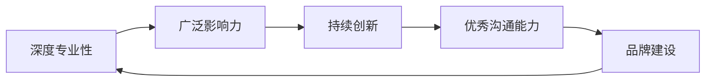

                 

# 如何成为程序员知识领域的KOL

在数字化转型的浪潮下，技术正以前所未有的速度发展，程序员作为推动这一变革的关键力量，其地位和影响力日益凸显。本文旨在探讨如何成为程序员知识领域的KOL（Key Opinion Leader），即在某一技术领域内具备高度权威和影响力的人物。KOL不仅能驱动技术交流、促进知识传播，还能为业界提供宝贵的见解和建议，引领行业发展。以下是成为KOL的策略和实践建议，希望能为有志于此的程序员提供有益的指导。

## 1. 背景介绍

### 1.1 问题由来
随着科技的不断进步，软件开发领域出现了前所未有的多样化趋势。新技术和新工具层出不穷，对开发者的技能要求也在不断提升。面对这一挑战，许多程序员开始寻求在特定技术领域中建立权威和影响力。如何成为KOL？成为KOL的路径是什么？这些是许多程序员思考和探索的问题。

### 1.2 问题核心关键点
成为KOL需要具备以下几个核心关键点：

1. **深度专业性**：在某一技术领域有深入研究和实践经验。
2. **广泛影响力**：在社区中有较高的知名度和影响力，能够吸引关注和互动。
3. **持续创新**：不断学习新知识，推动技术创新。
4. **优秀沟通能力**：能够清晰、准确地传达复杂的技术概念和实践经验。
5. **品牌建设**：通过博客、社交媒体等渠道建立个人品牌，吸引更多关注者。

## 2. 核心概念与联系

### 2.1 核心概念概述

KOL的核心概念包括深度专业性、广泛影响力、持续创新、优秀沟通能力和品牌建设。这些概念之间相互关联，共同构成了KOL的完整画像。

- **深度专业性**：指在某一技术领域有深入理解和实际应用能力，能够解决复杂问题。
- **广泛影响力**：通过技术博客、社交媒体、技术会议等渠道，影响更多开发者和用户。
- **持续创新**：不断学习和探索新技术，推动领域内的技术进步和应用。
- **优秀沟通能力**：能够清晰、准确地传达技术知识，使其易于理解。
- **品牌建设**：通过个人品牌吸引关注，形成稳定的受众群体。

这些概念之间的逻辑关系可以通过以下Mermaid流程图来展示：



这个流程图展示了KOL的概念及其相互关系：

1. 深度专业性是KOL的核心基础。
2. 广泛影响力建立在专业性的基础上，通过沟通和传播扩展影响力。
3. 持续创新是推动KOL持续发展的动力。
4. 优秀沟通能力是有效传播知识的关键。
5. 品牌建设是提升KOL影响力的手段。

## 3. 核心算法原理 & 具体操作步骤

### 3.1 算法原理概述

成为KOL并非一蹴而就，而是一个持续学习和实践的过程。核心算法原理在于不断积累专业知识、提升技术水平、扩大影响力。

**基本思路**：
1. **深度学习**：持续学习新知识，不断更新自己的技能。
2. **内容输出**：通过博客、视频、社交媒体等渠道分享知识和经验。
3. **互动交流**：积极参与社区讨论，解答他人问题，建立良好的社区关系。
4. **品牌塑造**：通过个人项目、技术讲座、开源项目等展示个人品牌。

### 3.2 算法步骤详解

成为KOL的步骤分为以下几个阶段：

**第1阶段：积累深度专业性**

1. **持续学习**：
   - **阅读书籍**：阅读经典和技术前沿的书籍，深入理解理论知识。
   - **参与培训**：参加线上线下培训和研讨会，学习新技术和最佳实践。
   - **实践项目**：通过实际项目积累经验，解决实际问题。

2. **技术积累**：
   - **技术博客**：开设技术博客，记录学习过程和心得。
   - **开源贡献**：在GitHub上贡献代码，参与开源项目，展示自己的技术实力。
   - **技术分享**：在技术社区如Stack Overflow、GitHub等分享自己的代码和项目。

**第2阶段：提升广泛影响力**

1. **社交媒体**：
   - **建立账号**：在各大社交平台如Twitter、LinkedIn、Medium等建立个人账号。
   - **活跃互动**：积极参与社区讨论，回复评论，分享有趣的技术内容和项目。

2. **内容输出**：
   - **技术文章**：撰写高质量的技术文章，分享专业知识和实践经验。
   - **视频教程**：录制视频教程，讲解复杂的技术问题和解决方案。
   - **技术讲座**：在技术会议和活动中发表演讲，分享自己的研究成果。

**第3阶段：持续创新**

1. **跟踪前沿**：
   - **订阅博客**：关注领域内的知名博客和网站，了解最新技术动态。
   - **参加会议**：参加技术会议和研讨会，与同行交流和分享。
   - **参与开源**：在GitHub上关注和参与前沿技术项目，学习最新实践。

2. **创新实践**：
   - **探索新领域**：尝试跨领域的技术融合，探索新的应用场景。
   - **实验项目**：通过实验项目验证和推广新技术和新方法。
   - **解决实际问题**：参与实际问题的解决，积累更多实践经验。

**第4阶段：优秀沟通能力**

1. **清晰表达**：
   - **简明扼要**：在分享内容时，使用清晰、简明、易懂的语言，避免复杂的术语和概念。
   - **图文并茂**：结合图表、代码示例、步骤说明等，帮助读者更好地理解。

2. **互动交流**：
   - **积极回复**：在社区中积极回复他人问题，提供有价值的见解和建议。
   - **线上讲座**：通过Zoom、Slack等平台进行线上讲座，与更多人互动。

**第5阶段：品牌建设**

1. **个人项目**：
   - **项目展示**：通过个人网站或GitHub展示个人项目和技术成果。
   - **博客集成**：在个人网站集成技术博客，分享学习和实践经验。

2. **社区贡献**：
   - **技术培训**：开设技术培训课程，传授知识和技能。
   - **开源领导**：在开源项目中担任重要角色，展示领导能力。

### 3.3 算法优缺点

**优点**：
1. **知识传播**：通过持续学习和分享，推动技术知识的传播和应用。
2. **社区贡献**：积极参与社区，提升社区氛围，建立良好的社区关系。
3. **品牌效应**：通过个人品牌吸引更多关注和支持。

**缺点**：
1. **时间成本**：持续学习和分享需要大量时间和精力。
2. **竞争激烈**：技术领域竞争激烈，需要不断创新和提升。
3. **技术更新**：需要不断跟进最新技术动态，避免知识过时。

### 3.4 算法应用领域

成为KOL的过程不仅限于某一特定技术领域，通过以上步骤，可以在多个技术领域内建立权威和影响力。例如：

- **云计算**：如AWS、Azure等云平台的技术专家。
- **大数据**：如Hadoop、Spark等大数据技术专家。
- **人工智能**：如TensorFlow、PyTorch等AI框架的贡献者。
- **前端开发**：如React、Vue等前端框架的开发者和专家。
- **后端开发**：如Node.js、Django等后端技术专家。

## 4. 数学模型和公式 & 详细讲解 & 举例说明

### 4.1 数学模型构建

成为KOL的过程可以用数学模型来表示。设KOL的属性集合为$A=\{a_1, a_2, \ldots, a_n\}$，每个属性$A_i$对KOL的影响权重为$w_i$，则KOL的综合影响力$I$可以表示为：

$$I = \sum_{i=1}^n w_i a_i$$

其中，$a_i$为KOL在第$i$个属性上的表现，$w_i$为属性$A_i$的权重。

### 4.2 公式推导过程

1. **深度专业性**：
   $$a_1 = \int_{t_0}^{t_1} (k_1 \cdot f_1(t)) dt$$

   其中，$k_1$为深度学习速率，$f_1(t)$为学习函数。

2. **广泛影响力**：
   $$a_2 = \int_{t_0}^{t_1} (k_2 \cdot g_2(t)) dt$$

   其中，$k_2$为社交媒体传播速率，$g_2(t)$为影响力函数。

3. **持续创新**：
   $$a_3 = \int_{t_0}^{t_1} (k_3 \cdot h_3(t)) dt$$

   其中，$k_3$为创新速率，$h_3(t)$为创新函数。

4. **优秀沟通能力**：
   $$a_4 = \int_{t_0}^{t_1} (k_4 \cdot i_4(t)) dt$$

   其中，$k_4$为沟通速率，$i_4(t)$为沟通函数。

5. **品牌建设**：
   $$a_5 = \int_{t_0}^{t_1} (k_5 \cdot j_5(t)) dt$$

   其中，$k_5$为品牌建设速率，$j_5(t)$为品牌建设函数。

### 4.3 案例分析与讲解

以云计算领域的KOL为例：

1. **深度专业性**：
   - 阅读亚马逊官方文档和技术博客。
   - 参加AWS认证培训和研讨会。
   - 参与AWS生态系统的开源项目。

2. **广泛影响力**：
   - 在Twitter上分享AWS最新动态和技术见解。
   - 在Medium上发布技术文章。
   - 在AWS社区论坛上积极参与讨论。

3. **持续创新**：
   - 关注AWS每年的技术会议和研讨会。
   - 参与AWS的新功能开发和测试。
   - 研究和应用AWS的最新技术。

4. **优秀沟通能力**：
   - 使用简明易懂的语言编写技术文章。
   - 录制视频讲解AWS的新功能。
   - 在社区中积极回答用户问题。

5. **品牌建设**：
   - 开设个人博客，分享AWS的实践经验。
   - 在GitHub上展示AWS的实验项目。
   - 举办AWS技术讲座和工作坊。

## 5. 项目实践：代码实例和详细解释说明

### 5.1 开发环境搭建

1. **安装编程工具**：
   - 安装Python 3.x版本，确保有必要的库支持。
   - 安装Visual Studio Code或其他IDE，用于开发环境搭建。
   - 安装Git和GitHub，用于版本控制和代码托管。

2. **配置开发环境**：
   - 安装必要的依赖库，如TensorFlow、PyTorch、Flask等。
   - 设置环境变量，确保工具的正常运行。
   - 配置本地服务器，用于运行开发项目。

### 5.2 源代码详细实现

以下是一个简单的Python Flask应用，用于展示如何在博客平台上发布技术文章：

```python
from flask import Flask, render_template, request
from datetime import datetime

app = Flask(__name__)

# 模拟数据库，存储文章列表
articles = [
    {'title': '人工智能基础', 'content': '这里是文章内容', 'created_at': datetime(2022, 1, 1)}
]

@app.route('/')
def index():
    return render_template('index.html', articles=articles)

@app.route('/submit', methods=['POST'])
def submit():
    title = request.form['title']
    content = request.form['content']
    created_at = datetime.now()
    article = {'title': title, 'content': content, 'created_at': created_at}
    articles.append(article)
    return '文章已发布！'

if __name__ == '__main__':
    app.run(debug=True)
```

**详细解释**：
- **Flask框架**：使用Flask框架搭建Web应用，实现文章发布功能。
- **模板引擎**：使用Jinja2模板引擎，渲染文章列表页面。
- **数据库模拟**：使用Python的内置`datetime`模块模拟文章数据。

### 5.3 代码解读与分析

**Flask框架**：
- Flask是一个轻量级的Web框架，适合快速开发小型应用。
- 通过装饰器定义路由，实现URL映射和请求处理。
- 模板引擎提供了动态渲染页面的功能。

**代码实现**：
- **路由定义**：定义`/`和`/submit`两个路由，分别用于展示文章列表和提交文章。
- **文章管理**：通过`articles`列表模拟数据库，存储和管理文章数据。
- **表单提交**：使用`POST`方法接收表单数据，并将新文章添加到`articles`列表中。

### 5.4 运行结果展示

启动Flask应用后，可以在浏览器中访问`http://localhost:5000`，查看文章列表页面。输入标题和内容后，提交表单即可发布新文章。

## 6. 实际应用场景

### 6.1 技术培训和教育

KOL可以作为技术培训师，开设技术培训课程，传授知识和技能。例如，在编程语言、框架和工具的使用上，KOL可以提供深入的讲解和实践指导。

**实际应用**：
- **在线课程**：在Udemy、Coursera等在线教育平台上开设编程课程。
- **技术讲座**：在本地或线上技术社区举办技术讲座和研讨会。
- **技术博客**：在个人博客上分享技术心得和实践经验。

### 6.2 技术咨询和支持

KOL可以成为技术咨询师，为企业和个人提供专业的技术支持。例如，在云计算、大数据、人工智能等领域，KOL可以帮助企业制定技术策略和解决方案。

**实际应用**：
- **技术顾问**：为中小企业提供技术咨询和支持。
- **技术支持**：在技术社区和论坛上解答用户问题。
- **技术培训**：为企业员工提供技术培训和指导。

### 6.3 开源项目贡献

KOL可以成为开源项目的贡献者，推动技术社区的发展。例如，在GitHub上参与开源项目，发布高质量的代码和文档。

**实际应用**：
- **开源贡献**：在GitHub上提交代码和文档，参与开源项目。
- **项目领导**：担任开源项目的维护者和领导者，推动项目进展。
- **社区活动**：在技术社区和会议上分享开源项目的进展和成果。

### 6.4 未来应用展望

未来，KOL的应用场景将会更加广泛，以下展望供参考：

1. **新兴技术领域**：随着新技术的出现，KOL可以在新领域内建立权威，推动技术发展。
2. **跨领域融合**：KOL可以通过跨领域的技术融合，探索新的应用场景。
3. **全球化影响力**：随着互联网的普及，KOL的影响力将跨越国界，影响全球技术社区。
4. **个性化内容**：KOL可以根据用户的需求和反馈，提供个性化的技术支持和解决方案。

## 7. 工具和资源推荐

### 7.1 学习资源推荐

为了帮助程序员成为KOL，以下是一些优质的学习资源推荐：

1. **在线课程**：
   - Coursera: 提供来自世界顶尖大学和机构的技术课程。
   - Udemy: 涵盖编程、数据科学、人工智能等多个领域的课程。
   - edX: 提供高质量的计算机科学和技术课程。

2. **技术博客和网站**：
   - Medium: 发布技术文章和教程的平台。
   - Hacker News: 技术社区，分享最新技术动态和项目。
   - Stack Overflow: 问答社区，解决技术问题。

3. **开发工具和框架**：
   - Visual Studio Code: 轻量级IDE，适合开发Web应用。
   - Git: 版本控制系统，适合代码管理和协作。
   - Flask: 轻量级Web框架，适合开发小型应用。

4. **开源项目和社区**：
   - GitHub: 全球最大的开源社区，提供丰富的项目和资源。
   - Stack Overflow: 开发者问答社区，提供技术交流的平台。
   - Reddit: 技术社区，涵盖多种技术话题。

### 7.2 开发工具推荐

以下是几款常用的开发工具，推荐给希望成为KOL的程序员：

1. **代码编辑器**：
   - Visual Studio Code: 轻量级且功能强大的代码编辑器。
   - Sublime Text: 高性能且易用性强的文本编辑器。
   - Atom: 可扩展性强的代码编辑器。

2. **版本控制工具**：
   - Git: 主流的版本控制系统，支持分布式版本控制。
   - SVN: 集中式版本控制系统，适合大型项目的版本管理。
   - Mercurial: 性能优异的版本控制系统，支持分布式版本控制。

3. **Web框架**：
   - Flask: 轻量级且易上手的Web框架，适合快速开发小型应用。
   - Django: 强大的Web框架，适合开发复杂应用。
   - Ruby on Rails: 高效的Web框架，适合快速开发Web应用。

4. **数据库管理工具**：
   - MySQL: 主流的开源关系型数据库。
   - MongoDB: 流行的NoSQL数据库，适合处理大规模数据。
   - Redis: 高性能的内存数据库，适合实时数据处理。

### 7.3 相关论文推荐

以下是几篇奠基性的相关论文，推荐阅读：

1. **深度学习**：
   - Yann LeCun, Yoshua Bengio, Geoffrey Hinton. "Deep Learning" (2015).
   - Ian Goodfellow, Yoshua Bengio, Aaron Courville. "Deep Learning" (2016).

2. **机器学习**：
   - Tom Mitchell. "Machine Learning" (1997).
   - Christopher M. Bishop. "Pattern Recognition and Machine Learning" (2006).

3. **自然语言处理**：
   - Christopher Manning, Prabhakar Raghavan, Hinrich Schütze. "Introduction to Information Retrieval" (2008).
   - Christopher Manning, Dan Klein. "Foundations of Statistical Natural Language Processing" (2003).

这些论文代表了各个技术领域的经典和前沿研究成果，对于程序员成为KOL具有重要的参考价值。

## 8. 总结：未来发展趋势与挑战

### 8.1 研究成果总结

成为KOL的过程需要持续学习和实践，通过不断积累专业知识和提升影响力，逐渐在技术领域建立权威和影响力。在实践中，KOL应不断更新知识，保持技术的前沿性，并通过各种渠道展示自己的专业能力。

### 8.2 未来发展趋势

未来，KOL将面临更多机会和挑战：

1. **技术进步**：随着技术的不断发展，KOL需要不断学习新知识，保持技术的前沿性。
2. **竞争激烈**：技术领域竞争激烈，KOL需要不断提升自身能力，保持竞争优势。
3. **全球化影响**：随着全球化进程加速，KOL的影响力将跨越国界，影响全球技术社区。
4. **跨领域融合**：KOL可以通过跨领域的技术融合，探索新的应用场景。

### 8.3 面临的挑战

KOL在发展过程中，也面临着诸多挑战：

1. **时间管理**：持续学习和分享需要大量时间和精力，需要合理规划时间。
2. **技术更新**：技术不断更新，需要不断跟进最新动态，避免知识过时。
3. **技术权威**：在竞争激烈的技术领域内建立权威，需要付出更多的努力。

### 8.4 研究展望

未来的研究需要在以下几个方面寻求新的突破：

1. **学习效率**：如何提高学习和知识传播的效率，让更多人受益。
2. **技术传播**：如何通过高效的方式，将新技术和新方法传播给更多人。
3. **社区互动**：如何增强社区互动，建立良好的社区关系。
4. **品牌建设**：如何建立和维护个人品牌，提升影响力。

## 9. 附录：常见问题与解答

**Q1: 如何平衡学习和工作？**

A: 时间管理是关键。可以设置明确的学习计划，利用碎片时间进行学习，保持持续学习习惯。同时，合理规划工作和学习时间，避免两者冲突。

**Q2: 如何选择技术方向？**

A: 可以从兴趣和需求出发，选择适合自己的技术方向。可以通过阅读书籍、参加培训、参与开源项目等方式，了解各个技术领域的前沿动态。

**Q3: 如何提升沟通能力？**

A: 可以参加公开演讲、写作练习等活动，提升表达能力和沟通技巧。同时，多与他人交流，积累实战经验。

**Q4: 如何保持技术前沿性？**

A: 需要持续关注技术动态，参加技术会议和研讨会，阅读最新技术论文，参与开源项目等。

**Q5: 如何建立个人品牌？**

A: 可以通过博客、社交媒体、技术讲座等方式展示自己的技术能力和经验。同时，积极参与社区活动，积累关注者和粉丝。

---

作者：禅与计算机程序设计艺术 / Zen and the Art of Computer Programming

