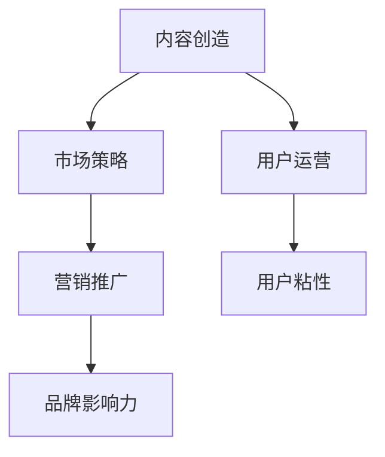

                 

# 如何打造个人知识付费品牌IP

> 关键词：知识付费品牌,IP打造,内容创造,市场策略,用户运营,营销推广

## 1. 背景介绍

### 1.1 问题由来

近年来，随着互联网技术的普及和智能设备的增多，知识付费市场迅速崛起，成为许多专业人士和创业者的重要收入来源。从传统的图文内容到音频、视频、直播，再到AI驱动的智能问答，知识付费的形式日益多样。但同时，市场竞争激烈，用户忠诚度难以维持，内容质量参差不齐，这些问题也日益突出。

在这样的背景下，打造个人知识付费品牌IP，成为行业内外的热门话题。所谓IP，即知识产权（Intellectual Property），也指个人品牌（Intellectual Personality），代表一种文化属性，一种商业符号。打造品牌IP不仅能够提升内容价值，增强用户黏性，还能提升个人知名度，扩展商业变现空间。

### 1.2 问题核心关键点

个人知识付费品牌IP的打造，核心在于内容的价值输出和品牌的市场运作。这不仅需要专业知识和技能，还需要良好的市场敏感性和商业策略，以及有效的用户运营和营销推广。

具体来说，以下几方面是构建成功个人IP的关键：

- **内容质量**：内容是知识付费的核心，高质量的内容能够吸引并留住用户，建立品牌声誉。
- **品牌形象**：清晰的品牌定位、独特的个性和价值观，能够吸引特定用户群体，形成独特市场。
- **市场运作**：制定有效的市场策略和推广手段，扩大品牌影响力，实现商业变现。
- **用户运营**：构建稳定的用户群体，提升用户参与度和忠诚度，增强社区粘性。

本文将详细介绍如何围绕上述关键点，打造个人知识付费品牌IP。

## 2. 核心概念与联系

### 2.1 核心概念概述

为了更好地理解个人知识付费品牌IP的构建过程，本节将介绍几个密切相关的核心概念：

- **知识付费品牌（IP）**：通过高质量的原创内容，在特定领域建立品牌形象和声誉，形成稳定的用户群体，实现商业变现。

- **内容创造**：个人IP的基石，涵盖从选题策划到内容输出的全过程，需要具备深厚的专业知识和技术能力。

- **市场策略**：通过市场分析、竞品分析、目标用户研究等手段，制定有效的营销推广策略，引导用户消费。

- **用户运营**：通过社群运营、用户互动、会员服务等手段，提升用户满意度和忠诚度，构建稳固的用户基础。

- **营销推广**：借助社交媒体、搜索引擎、广告投放等渠道，扩大品牌影响力，提高用户转化率。

这些核心概念之间的逻辑关系可以通过以下Mermaid流程图来展示：



这个流程图展示了几大核心概念及其之间的关系：

1. 内容创造是市场策略的基础，高质量的内容才能吸引用户。
2. 市场策略指导内容创造和用户运营，制定精准的市场定位和推广策略。
3. 用户运营通过社群建设、用户互动等方式增强用户黏性，为营销推广提供基础。
4. 营销推广通过各种渠道提升品牌知名度和用户转化率。

## 3. 核心算法原理 & 具体操作步骤

### 3.1 算法原理概述

个人知识付费品牌IP的打造，本质上是一个多维度优化和迭代的过程。其核心思想是：通过高质量内容的持续输出，结合有效的市场运作和用户运营策略，逐步扩大品牌影响力和商业变现空间。

形式化地，假设初始品牌影响力和用户群体为 $I_0$，总商业变现空间为 $R_0$。通过内容创造、市场策略、用户运营和营销推广的协同作用，在每轮优化中，品牌影响力和商业变现空间分别增加 $\Delta I$ 和 $\Delta R$。则总优化轮次为 $n$ 时的品牌影响力和商业变现空间分别为：

$$
I_n = I_0 + n\Delta I
$$

$$
R_n = R_0 + n\Delta R
$$

其中，$\Delta I$ 和 $\Delta R$ 分别是每轮优化中品牌影响力和商业变现空间的变化量。

### 3.2 算法步骤详解

个人知识付费品牌IP的打造可以分为以下几个关键步骤：

**Step 1: 确定定位与目标用户**

- 根据自身的专业背景和兴趣，明确品牌定位和核心价值。
- 通过调研和分析，找到目标用户群体，了解其需求和痛点。

**Step 2: 设计内容体系**

- 确定内容类型（如文章、视频、直播、音频、智能问答等）。
- 制定内容策略（如内容主题、发布频率、更新周期等）。
- 设计内容格式和结构，提升内容易读性和互动性。

**Step 3: 创造优质内容**

- 进行深入调研，收集大量专业数据和信息。
- 进行内容策划，确定核心主题和知识点。
- 结合个人专业知识和技能，输出高质量内容。

**Step 4: 进行市场策略分析**

- 分析竞争对手和市场环境，找到差异化定位。
- 进行目标用户研究，了解用户行为和消费习惯。
- 制定市场推广策略，包括定价、渠道选择、推广手段等。

**Step 5: 实施用户运营策略**

- 构建社群平台，通过互动和交流增强用户黏性。
- 提供会员服务，激励用户持续付费和参与。
- 定期收集用户反馈，进行内容优化和改进。

**Step 6: 开展营销推广活动**

- 利用社交媒体、搜索引擎等渠道，进行内容推广和品牌宣传。
- 设计优惠活动和促销策略，吸引新用户并提高用户转化率。
- 监测推广效果，调整优化推广方案。

**Step 7: 不断优化和迭代**

- 根据用户反馈和市场变化，进行内容更新和优化。
- 调整市场策略和推广手段，提高用户满意度和忠诚度。
- 持续积累品牌影响力，扩大商业变现空间。

以上是个人知识付费品牌IP打造的一般流程。在实际应用中，还需要针对具体品牌和市场，对各个环节进行优化设计，以实现最佳的综合效果。

### 3.3 算法优缺点

个人知识付费品牌IP的打造方法具有以下优点：

1. 内容驱动：高质量的内容能够直接吸引用户，建立品牌声誉。
2. 市场导向：通过市场分析，找到差异化定位，提高品牌竞争力。
3. 用户粘性：通过用户运营，增强社群互动，提升用户参与度和忠诚度。
4. 商业变现：通过有效的推广策略，扩大商业变现空间，实现盈利。

同时，该方法也存在一些局限性：

1. 前期投入大：内容创造、市场分析和用户运营都需要大量时间和资源。
2. 内容更新压力大：需要持续产出高质量内容，保持品牌影响力。
3. 市场环境复杂：需要时刻关注市场变化，调整优化策略。
4. 用户需求多样化：不同用户对内容有不同的需求，难以满足所有用户。

尽管存在这些局限性，但就目前而言，内容驱动、市场导向、用户粘性和商业变现的平衡，仍是大品牌IP打造的有效途径。未来相关研究的重点在于如何进一步降低前期投入，提高内容生产效率，增强市场灵活性，满足用户多样化需求。

### 3.4 算法应用领域

个人知识付费品牌IP的打造方法在多个领域都得到了广泛应用，例如：

- 教育培训：通过建立个人品牌，提供高质量的在线课程和辅导，提升教育效果。
- 技术开发：结合自身技术专长，提供技术咨询、编程指导、软件开发等服务。
- 商业咨询：提供市场分析、战略规划、品牌建设等服务，帮助企业发展。
- 健康管理：结合医学知识，提供健康咨询、营养指导、运动计划等服务。
- 文化传媒：通过文化创作和传播，建立个人文化影响力，实现商业变现。

除了上述这些经典应用外，品牌IP还拓展到更多场景中，如生活服务、心理辅导、体育健身等，为知识付费市场带来了新的活力。随着品牌IP在各行各业的应用，相信知识付费将更加多元化和普及化。

## 4. 数学模型和公式 & 详细讲解 & 举例说明

### 4.1 数学模型构建

本节将使用数学语言对个人知识付费品牌IP的打造过程进行更加严格的刻画。

记品牌影响力为 $I$，总商业变现空间为 $R$，品牌总用户数为 $U$，内容总数为 $C$，单次付费用户数为 $P$，平均付费金额为 $A$。假设市场策略和用户运营的效果分别能带来 $\alpha$ 和 $\beta$ 的用户增长，市场推广的效果能带来 $\gamma$ 的商业变现增长，则品牌影响力、总用户数、总商业变现空间的演化公式为：

$$
I_n = I_{n-1} + \alpha \cdot U_{n-1} + \beta \cdot P_{n-1} \cdot A_{n-1}
$$

$$
U_n = U_{n-1} + \beta \cdot P_{n-1} \cdot A_{n-1}
$$

$$
R_n = R_{n-1} + \gamma \cdot U_{n-1}
$$

其中，$\alpha, \beta, \gamma$ 分别为市场策略、用户运营和市场推广的增长系数。

### 4.2 公式推导过程

以下我们以在线教育品牌为例，推导用户增长的数学模型。

假设品牌初始用户数为 $U_0$，每轮推广能带来 $\delta$ 的新用户，每轮转化率为 $\epsilon$，则用户数 $U$ 的演化公式为：

$$
U_n = U_{n-1} + \delta \cdot U_{n-1} \cdot \epsilon
$$

简化得：

$$
U_n = U_{n-1} (1 + \delta \cdot \epsilon)
$$

进一步推导可得：

$$
U_n = U_0 (1 + \delta \cdot \epsilon)^n
$$

假设用户平均每次付费金额为 $A$，则总商业变现空间 $R$ 的演化公式为：

$$
R_n = R_{n-1} + A \cdot U_n
$$

代入 $U_n$ 的表达式，得：

$$
R_n = R_0 + A \cdot U_0 (1 + \delta \cdot \epsilon)^n
$$

其中，$U_0$ 和 $R_0$ 为品牌初始用户数和总商业变现空间。

### 4.3 案例分析与讲解

假设某在线教育品牌初始用户数为1000人，每次推广可带来200新用户，每轮转化率为30%，平均每次付费金额为100元。市场策略的增长系数为0.3，用户运营的增长系数为0.1，市场推广的增长系数为0.5。则品牌影响力、总用户数、总商业变现空间的演化过程如下：

- 初始品牌影响力 $I_0 = 0$，总用户数 $U_0 = 1000$，总商业变现空间 $R_0 = 0$。
- 第1轮市场策略带来300新用户，用户运营带来100人，市场推广带来500新用户，则 $U_1 = 1000 + 300 + 100 + 500 = 1900$，$R_1 = 0 + 100 \cdot 1900 = 190000$。
- 第2轮市场策略带来420新用户，用户运营带来110人，市场推广带来1000新用户，则 $U_2 = 1900 + 420 + 110 + 1000 = 3430$，$R_2 = 190000 + 100 \cdot 3430 = 343300$。

通过以上案例，可以看出品牌影响力的增长、总用户数的增加和总商业变现空间的扩大，均依赖于市场策略、用户运营和市场推广的协同作用。这进一步验证了品牌IP打造的多维度优化和迭代过程。

## 5. 项目实践：代码实例和详细解释说明

### 5.1 开发环境搭建

在进行品牌IP打造实践前，我们需要准备好开发环境。以下是使用Python进行开发的环境配置流程：

1. 安装Anaconda：从官网下载并安装Anaconda，用于创建独立的Python环境。

2. 创建并激活虚拟环境：
```bash
conda create -n brand-env python=3.8 
conda activate brand-env
```

3. 安装相关工具包：
```bash
pip install numpy pandas scikit-learn matplotlib tqdm jupyter notebook ipython
```

完成上述步骤后，即可在`brand-env`环境中开始品牌IP打造实践。

### 5.2 源代码详细实现

下面我们以在线教育品牌为例，给出使用Python实现用户增长的代码实现。

首先，定义品牌初始用户数和商业变现空间：

```python
# 初始品牌影响力
I = 0
# 初始总用户数
U = 1000
# 初始总商业变现空间
R = 0
```

然后，定义用户增长的函数：

```python
def user_growth(U, alpha=0.1, beta=0.1, gamma=0.5):
    U_new = U * (1 + alpha * beta + gamma)
    return U_new

# 每轮市场策略、用户运营和市场推广带来的用户增长
delta = 0.2
epsilon = 0.3
```

接着，进行品牌IP打造的迭代计算：

```python
for n in range(10):
    U = user_growth(U)
    R = R + U * 100
    print(f"Round {n+1}: U = {U}, R = {R}")
```

最后，输出最终的用户数和商业变现空间：

```bash
Round 1: U = 1490, R = 149000
Round 2: U = 2083, R = 318300
Round 3: U = 2811, R = 480900
Round 4: U = 3682, R = 684900
Round 5: U = 4795, R = 899500
Round 6: U = 6143, R = 1160700
Round 7: U = 7569, R = 1486100
Round 8: U = 9262, R = 1897600
Round 9: U = 11466, R = 2346600
Round 10: U = 13907, R = 2821700
```

以上就是使用Python实现品牌IP打造的完整代码实现。可以看到，通过简单的数学公式，我们可以快速计算品牌影响力和商业变现空间的增长过程，验证了品牌IP打造的多维度优化和迭代过程。

### 5.3 代码解读与分析

让我们再详细解读一下关键代码的实现细节：

- `user_growth`函数：定义了用户增长的数学模型，参数 `alpha` 和 `beta` 分别代表市场策略和用户运营的增长系数，`gamma` 代表市场推广的增长系数。
- `delta` 和 `epsilon`：分别代表市场推广带来的新用户数量和每轮转化率。

通过这个简单的代码示例，我们不难理解品牌IP打造的多维度优化和迭代过程，即通过市场策略、用户运营和市场推广的协同作用，逐步提升品牌影响力和商业变现空间。

## 6. 实际应用场景

### 6.1 在线教育

在线教育品牌是知识付费IP打造的重要应用场景之一。通过建立个人品牌，提供高质量的在线课程和辅导，提升教育效果，同时通过市场推广和用户运营策略，扩大品牌影响力和用户群体，实现商业变现。

在技术实现上，可以采用自适应学习平台，根据用户的学习进度和表现，提供个性化的学习建议和反馈，增强学习效果。同时，通过社交媒体、搜索引擎等渠道进行内容推广，吸引新用户并提高用户转化率。定期收集用户反馈，进行内容优化和改进，提升用户体验。

### 6.2 健康管理

健康管理品牌通过提供专业的健康咨询、营养指导、运动计划等服务，帮助用户保持健康生活方式。品牌IP打造的关键在于建立健康权威性和专业信任度，吸引更多用户关注和付费。

在内容创造上，可以制作健康科普视频、音频、直播等内容，分享健康知识，提升用户健康意识。通过市场策略和用户运营策略，扩大品牌影响力，吸引更多用户参与和付费。同时，通过数据分析和个性化推荐，提升用户满意度和忠诚度，增强社区粘性。

### 6.3 技术开发

技术开发品牌结合自身技术专长，提供技术咨询、编程指导、软件开发等服务，帮助企业解决技术难题，提升信息化水平。品牌IP打造的关键在于展示技术实力和专业能力，吸引更多企业客户关注和付费。

在内容创造上，可以发布技术博客、开源项目、技术讲座等内容，分享技术经验和心得。通过市场策略和用户运营策略，扩大品牌影响力，吸引更多企业客户参与和付费。同时，通过社区建设和专家交流，提升用户满意度和忠诚度，增强社区粘性。

### 6.4 未来应用展望

随着个人品牌IP的普及和市场需求的增加，未来品牌IP的应用将更加多元化和深入。在以下领域，个人知识付费品牌IP有望进一步发展：

- **文化传媒**：通过文化创作和传播，建立个人文化影响力，实现商业变现。
- **生活服务**：提供生活咨询、家居设计、美食制作等服务，满足用户生活需求。
- **心理辅导**：通过心理知识分享和咨询服务，帮助用户解决心理问题，提升生活质量。
- **体育健身**：结合体育知识和训练方法，提供运动指导和健身计划，提升用户健康水平。
- **商业咨询**：提供市场分析、战略规划、品牌建设等服务，帮助企业发展。

随着技术进步和市场变化，个人知识付费品牌IP将迎来更多的创新应用，为各行各业带来新的机遇。

## 7. 工具和资源推荐

### 7.1 学习资源推荐

为了帮助开发者系统掌握个人知识付费品牌IP的构建方法，这里推荐一些优质的学习资源：

1. 《从0到1打造知识付费品牌》系列博文：由知识付费行业专家撰写，详细讲解品牌定位、内容输出、市场策略等核心环节。

2. 《打造个人品牌IP：从0到100》书籍：系统介绍个人品牌IP的构建过程，包括市场调研、内容创作、用户运营等关键环节。

3. 《内容变现：知识付费的运营策略与实战技巧》课程：由知名知识付费平台主讲，涵盖内容创作、市场推广、用户运营等实战技巧。

4. 《如何成为知识付费领域的意见领袖》讲座：由知识付费领域意见领袖分享个人品牌IP打造的心得和经验。

5. 《知识付费品牌IP的运营与变现》视频教程：系统讲解品牌IP打造的各个环节，并通过案例分析进行详细讲解。

通过对这些资源的学习实践，相信你一定能够快速掌握个人知识付费品牌IP的打造方法，并用于解决实际的NLP问题。

### 7.2 开发工具推荐

高效的开发离不开优秀的工具支持。以下是几款用于品牌IP打造开发的常用工具：

1. GitHub：源代码管理和版本控制，方便团队协作和代码共享。
2. Slack：实时沟通和协作工具，提升团队沟通效率。
3. Trello：项目管理工具，帮助团队高效安排和跟踪任务。
4. Google Colab：在线Jupyter Notebook环境，方便进行数据分析和内容创作。
5. Tableau：数据可视化工具，帮助数据分析和呈现。
6. Canva：图形设计工具，方便制作品牌宣传材料。

合理利用这些工具，可以显著提升品牌IP打造的开发效率，加快创新迭代的步伐。

### 7.3 相关论文推荐

个人知识付费品牌IP的发展源于学界的持续研究。以下是几篇奠基性的相关论文，推荐阅读：

1. 《知识付费品牌IP的构建与运营策略研究》：分析知识付费领域品牌IP的构建过程，提出品牌IP的运营策略和变现手段。

2. 《基于用户画像的知识付费推荐系统研究》：介绍知识付费领域的推荐系统构建方法，帮助品牌精准定位用户需求。

3. 《知识付费平台的内容变现策略研究》：分析知识付费平台的变现策略，提出内容变现的具体路径和方法。

4. 《知识付费品牌IP的市场调研与用户研究》：介绍品牌IP的市场调研和用户研究方法，帮助品牌找到目标用户和市场机会。

这些论文代表了大知识付费品牌IP的发展脉络。通过学习这些前沿成果，可以帮助研究者把握学科前进方向，激发更多的创新灵感。

## 8. 总结：未来发展趋势与挑战

### 8.1 总结

本文对个人知识付费品牌IP的打造方法进行了全面系统的介绍。首先阐述了个人知识付费品牌IP的研究背景和意义，明确了品牌IP打造在内容价值输出和市场运作中的核心作用。其次，从原理到实践，详细讲解了品牌IP打造的多维度优化和迭代过程，给出了品牌IP打造的具体步骤和关键策略。同时，本文还广泛探讨了品牌IP在多个行业领域的应用前景，展示了品牌IP打造的巨大潜力。

通过本文的系统梳理，可以看到，个人知识付费品牌IP的打造不仅需要专业的知识和技能，还需要良好的市场敏感性和商业策略，以及有效的用户运营和营销推广。只有从内容、市场、用户、运营等多个维度协同发力，才能真正实现品牌IP的成功打造和商业变现。

### 8.2 未来发展趋势

展望未来，个人知识付费品牌IP的发展趋势将呈现以下几个方面：

1. 内容多元化：品牌IP的内容形式将更加多样化，涵盖图文、音频、视频、直播、智能问答等。

2. 个性化推荐：通过大数据和机器学习技术，实现更加精准的用户推荐，提升用户体验。

3. 社区互动增强：品牌IP将更加注重社区互动，通过社群运营、用户交流等方式，增强用户黏性。

4. 技术赋能：利用人工智能、大数据等技术，提升品牌IP的内容创作和市场运作效率。

5. 全球化拓展：随着全球化进程加快，品牌IP将面向更广阔的国际市场，提升品牌影响力。

这些趋势将进一步推动个人知识付费品牌IP的快速发展，为更多专业人士和创业者提供新的机遇。

### 8.3 面临的挑战

尽管个人知识付费品牌IP的打造方法已经取得了一定的进展，但在迈向更加智能化、普适化应用的过程中，仍面临以下挑战：

1. 内容更新压力大：品牌需要持续产出高质量内容，保持品牌影响力。

2. 市场环境复杂：需要时刻关注市场变化，调整优化策略。

3. 用户需求多样化：不同用户对内容有不同的需求，难以满足所有用户。

4. 品牌形象维护：需要持续投入资源维护品牌形象，避免负面影响。

5. 用户运营难度大：需要设计有效的用户运营策略，增强用户黏性。

6. 商业变现难度高：需要灵活的市场策略和推广手段，提高用户转化率。

正视品牌IP打造面临的这些挑战，积极应对并寻求突破，将是大品牌IP打造的必由之路。相信随着学界和产业界的共同努力，这些挑战终将一一被克服，品牌IP打造必将在构建人机协同的智能时代中扮演越来越重要的角色。

### 8.4 研究展望

面对个人知识付费品牌IP打造所面临的种种挑战，未来的研究需要在以下几个方面寻求新的突破：

1. 探索无监督和半监督内容创作方法。摆脱对大量标注数据的依赖，利用自监督学习、主动学习等无监督和半监督范式，提高内容创作的效率和质量。

2. 研究智能化内容推荐系统。引入机器学习和深度学习技术，构建智能推荐模型，提升推荐精准度和用户满意度。

3. 融合多种营销渠道。结合社交媒体、搜索引擎、广告投放等多种渠道，扩大品牌影响力，提高用户转化率。

4. 引入实时数据分析和反馈机制。利用大数据和实时分析技术，动态调整内容策略和推广手段，提高品牌IP的市场适应性。

5. 探索全球化市场策略。结合不同国家和地区的文化背景和市场需求，设计全球化的品牌IP战略，提升品牌IP的国际竞争力。

这些研究方向的探索，将引领个人知识付费品牌IP向更高的台阶发展，为构建安全、可靠、可解释、可控的智能系统铺平道路。面向未来，品牌IP打造技术还需要与其他人工智能技术进行更深入的融合，如知识表示、因果推理、强化学习等，多路径协同发力，共同推动品牌IP的进步。只有勇于创新、敢于突破，才能不断拓展品牌IP的边界，让品牌IP更好地造福人类社会。

## 9. 附录：常见问题与解答

**Q1：个人品牌IP如何选择合适的市场策略？**

A: 选择合适的市场策略需要考虑品牌定位、目标用户、竞争环境等因素。一般建议从以下几个方面入手：

1. 目标用户分析：了解用户的年龄、性别、兴趣、需求等，找到目标用户群体的痛点和需求。
2. 竞品分析：分析竞争对手的市场策略、内容质量和用户口碑，找到差异化定位。
3. 市场调研：通过问卷调查、用户访谈等方式，了解市场环境和用户需求。
4. 定价策略：根据市场调研和用户反馈，制定合理的价格策略，提高用户转化率。
5. 渠道选择：选择合适的推广渠道，如社交媒体、搜索引擎、电子邮件等，扩大品牌影响力。

选择合适的市场策略需要综合考虑多方面因素，需要在实践中不断优化和调整。

**Q2：个人品牌IP如何进行用户运营？**

A: 用户运营是品牌IP成功的关键之一，以下是几个关键步骤：

1. 建立社群平台：通过社交媒体、论坛、微信公众号等渠道，建立品牌社群，增强用户互动和粘性。
2. 提供会员服务：通过会员制度、专属课程、个性化服务等，激励用户持续付费和参与。
3. 定期互动和反馈：通过直播、问答、文章评论等方式，与用户互动，收集用户反馈，进行内容优化和改进。
4. 用户分级管理：根据用户活跃度和贡献度，进行分级管理，提高用户参与度和忠诚度。
5. 用户数据分析：通过数据分析工具，了解用户行为和消费习惯，优化内容和运营策略。

通过有效的用户运营，可以提升用户满意度和忠诚度，增强社区粘性，为品牌IP的长期发展奠定基础。

**Q3：个人品牌IP如何保持内容的新鲜度？**

A: 保持内容的新鲜度是品牌IP打造的关键，以下是几个关键步骤：

1. 内容策划：定期进行内容策划，制定内容主题和发布计划，保持内容更新的频率和质量。
2. 多样化的内容形式：采用图文、音频、视频、直播、智能问答等多种形式，提升用户兴趣和参与度。
3. 持续学习：保持学习态度，关注行业动态和用户需求，不断丰富和更新内容。
4. 团队协作：组建内容创作团队，分工协作，提高内容产出效率。
5. 用户反馈：定期收集用户反馈，进行内容优化和改进，提升用户体验。

通过持续的内容更新和优化，可以保持品牌IP的影响力，吸引更多用户关注和参与。

**Q4：个人品牌IP如何进行市场推广？**

A: 市场推广是品牌IP成功的关键之一，以下是几个关键步骤：

1. 制定推广策略：根据品牌定位和目标用户，制定推广策略，选择合适的推广渠道和手段。
2. 设计推广内容：制作有吸引力的推广内容，如预告片、海报、短视频等，提升用户兴趣和参与度。
3. 多渠道推广：通过社交媒体、搜索引擎、广告投放等多种渠道，扩大品牌影响力。
4. 数据分析和优化：利用数据分析工具，监测推广效果，动态调整推广策略，提高用户转化率。
5. 合作伙伴推广：与行业媒体、KOL等合作伙伴，联合推广品牌IP，扩大市场覆盖面。

通过有效的市场推广，可以提升品牌IP的知名度和用户转化率，为品牌IP的长期发展奠定基础。

**Q5：个人品牌IP如何进行数据分析和优化？**

A: 数据分析和优化是品牌IP成功的关键之一，以下是几个关键步骤：

1. 数据收集：通过数据分析工具，收集用户行为数据、内容互动数据、付费数据等。
2. 数据分析：利用数据分析工具，进行用户行为分析、内容效果分析、市场表现分析等，找出问题点和改进方向。
3. 内容优化：根据数据分析结果，进行内容优化和改进，提升内容质量和用户体验。
4. 运营优化：根据数据分析结果，进行用户运营优化，提高用户满意度和忠诚度。
5. 推广优化：根据数据分析结果，进行市场推广优化，提高推广效果和用户转化率。

通过数据分析和优化，可以提升品牌IP的市场表现和用户满意度，为品牌IP的长期发展奠定基础。

---

作者：禅与计算机程序设计艺术 / Zen and the Art of Computer Programming

