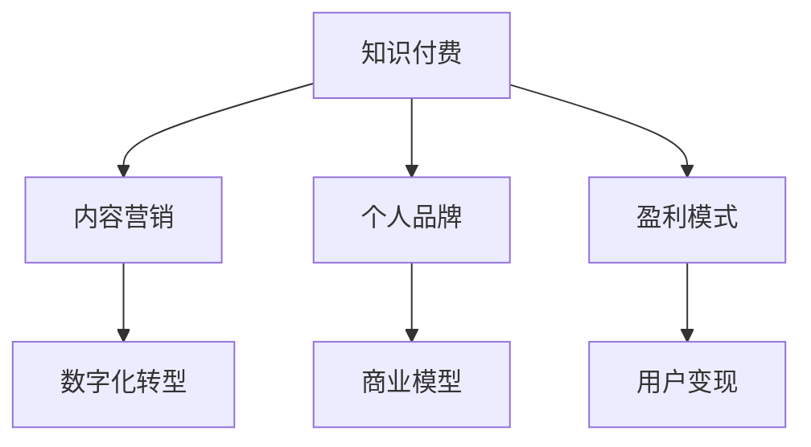

                 

# 如何打造个人知识付费商业帝国

> 关键词：知识付费、个人品牌、内容营销、数字化转型、商业模型

## 1. 背景介绍

### 1.1 问题由来
随着信息爆炸和知识门槛的不断提高，越来越多人愿意为有价值的信息付费。知识付费不仅是知识传播和获取的革命性方式，也是个人建立品牌和商业帝国的重要途径。特别是在当前数字化转型大潮中，知识付费作为一种高效、低成本的变现方式，备受各方关注。

然而，面对海量的内容创作者和不断变化的市场需求，如何在竞争激烈的领域中脱颖而出，打造个人知识付费商业帝国，成为了一个复杂且极具挑战性的课题。本文将从核心概念、算法原理、操作步骤、应用领域等多个角度深入探讨这一问题。

### 1.2 问题核心关键点
打造知识付费商业帝国的关键在于：

1. **内容质量**：内容必须具有高度的独特性和不可替代性，能够解决特定问题或提供独到见解。
2. **品牌建设**：建立强大的个人品牌，形成忠实的用户群体，增强用户粘性和信任感。
3. **市场定位**：明确目标受众和市场定位，制定有针对性的营销策略。
4. **商业模型**：构建合理的商业模式，平衡内容和变现之间的关系。
5. **数字化转型**：利用数字化工具和平台，提升内容的传播效率和覆盖范围。

只有在这几个关键点上下足功夫，才能在知识付费市场中占据一席之地，逐步建立起个人商业帝国。

## 2. 核心概念与联系

### 2.1 核心概念概述

- **知识付费**：用户为获取特定知识或信息，支付一定费用的行为。这种模式强调内容的专业性和独特性，帮助用户高效获取有价值的信息。
- **内容营销**：利用高质量的内容吸引、留住并转化潜在客户，最终实现商业目标的营销策略。在知识付费中，内容本身即是营销工具。
- **个人品牌**：通过持续发布有价值的内容，建立起个人的权威和影响力，形成独特的品牌形象和市场定位。
- **数字化转型**：将传统线下商业模式转移到线上，利用数字工具和技术提升运营效率和市场覆盖。
- **商业模型**：知识付费的商业模式包括订阅制、单次付费、按需服务等，合理的选择和组合有助于提升盈利能力和用户满意度。

这些概念之间的联系可以通过以下Mermaid流程图来展示：



该流程图展示出知识付费的各个核心概念及其相互关系：

1. 知识付费依赖高质量的内容，内容营销是其重要手段。
2. 个人品牌是内容营销和知识付费的核心支撑，直接影响用户粘性和市场影响力。
3. 数字化转型提升了内容传播效率和覆盖范围，是知识付费市场拓展的关键。
4. 商业模型是知识付费变现的直接体现，盈利模式则通过合理的商业模型实现用户变现。

## 3. 核心算法原理 & 具体操作步骤
### 3.1 算法原理概述

打造知识付费商业帝国的核心在于内容质量和市场定位。内容质量决定了用户价值，市场定位决定了目标受众和盈利模式。

### 3.2 算法步骤详解

**Step 1: 内容创作与优化**

- **内容质量评估**：通过用户反馈、订阅量、点击率等指标评估内容质量，持续改进。
- **内容创新**：在现有内容基础上，持续创作新的内容，保持原创性和时效性。
- **内容优化**：利用SEO、关键词优化、数据分析等技术手段，提升内容的搜索排名和曝光度。

**Step 2: 品牌建设与维护**

- **个人形象塑造**：通过社交媒体、博客、视频等渠道，塑造正面、专业的个人形象。
- **品牌传播**：利用多渠道传播策略，包括社交媒体、邮件营销、内容合作等，扩大品牌影响力。
- **用户互动**：积极回应用户评论和反馈，建立良好的用户关系。

**Step 3: 市场定位与用户细分**

- **市场调研**：通过问卷调查、数据分析等方式，了解目标受众需求和行为特征。
- **用户细分**：根据需求和特征，将用户细分成不同的群体，制定有针对性的内容策略。
- **价值主张**：明确不同用户群体的核心需求和痛点，制定相应的解决方案和价值主张。

**Step 4: 商业模型与变现策略**

- **商业模式选择**：根据内容特性和用户需求，选择适合的商业模式，如订阅制、单次付费、按需服务等。
- **定价策略**：合理设定内容价格，兼顾用户支付意愿和内容价值。
- **变现渠道**：利用各大知识付费平台、自建平台、社群营销等多种渠道实现内容变现。

**Step 5: 技术支持与数字化转型**

- **平台搭建**：选择适合的网站建设平台和内容管理系统，搭建个人知识付费平台。
- **技术优化**：利用数据驱动的个性化推荐、订阅管理、内容推送等技术提升用户体验。
- **用户管理**：建立用户管理系统，记录用户行为和偏好，提供个性化服务。

### 3.3 算法优缺点

知识付费商业帝国打造的优势在于：

- **高效变现**：内容本身具有高价值，能吸引大量付费用户。
- **品牌效应**：通过高质量内容和专业品牌，能建立起长期用户粘性。
- **市场潜力**：数字化转型和互联网的普及，为知识付费市场提供了广阔的成长空间。

然而，这一过程也面临一些挑战：

- **竞争激烈**：内容创作者众多，市场竞争激烈。
- **内容更新压力大**：需要持续更新内容以保持用户兴趣和平台活跃度。
- **技术门槛高**：搭建和维护一个高效的知识付费平台需要较高的技术能力和资源投入。

## 4. 数学模型和公式 & 详细讲解

### 4.1 数学模型构建

在知识付费商业帝国构建的过程中，可以利用数学模型和算法对内容质量、品牌影响、用户细分等进行量化分析。

假设内容集为 $X=\{x_1,x_2,\ldots,x_n\}$，用户集为 $Y=\{y_1,y_2,\ldots,y_m\}$，内容与用户之间的互动关系可以用向量 $A \in \mathbb{R}^{n \times m}$ 表示，其中 $A_{ij}$ 表示用户 $y_j$ 与内容 $x_i$ 之间的互动强度。

定义用户对内容的满意度为 $S_i = \sum_{j=1}^m A_{ij}f(y_j)$，其中 $f(y_j)$ 为用户的满意函数。内容的市场价值 $V_i$ 可以表示为：

$$
V_i = \frac{S_i}{\sum_{i=1}^n S_i}
$$

市场价值越高，内容越受欢迎，越有市场潜力。

### 4.2 公式推导过程

通过上述定义，可以推导出市场价值 $V_i$ 的计算公式：

$$
V_i = \frac{1}{n} \sum_{j=1}^m \frac{A_{ij}}{\sum_{k=1}^n A_{ik}}
$$

其中，分母 $\sum_{k=1}^n A_{ik}$ 表示内容 $x_i$ 的总互动强度，分子 $\sum_{j=1}^m A_{ij}f(y_j)$ 表示内容 $x_i$ 对用户 $y_j$ 的平均满意度。

通过计算每个内容的市场价值 $V_i$，可以发现哪些内容具有更大的市场潜力和变现价值，进而制定内容生产和传播策略。

### 4.3 案例分析与讲解

假设某知识付费平台上有多个视频课程内容，通过数据分析得到如下互动关系矩阵 $A$：

$$
A = \begin{bmatrix}
2 & 1 & 0 \\
3 & 0 & 2 \\
0 & 4 & 1
\end{bmatrix}
$$

其中，$A_{ij}$ 表示用户 $y_j$ 观看内容 $x_i$ 的视频时长（单位：分钟）。

设用户的满意函数 $f(y_j) = y_j$，即用户观看时长越长，满意度越高。则各内容的市场价值计算如下：

- 内容 $x_1$：

$$
V_1 = \frac{1}{3} \times \left(\frac{2 \times 1}{2} + \frac{3 \times 0}{3} + \frac{0 \times 4}{0}\right) = \frac{2}{6} = \frac{1}{3}
$$

- 内容 $x_2$：

$$
V_2 = \frac{1}{3} \times \left(\frac{2 \times 0}{2} + \frac{3 \times 2}{3} + \frac{0 \times 1}{0}\right) = \frac{6}{6} = 1
$$

- 内容 $x_3$：

$$
V_3 = \frac{1}{3} \times \left(\frac{2 \times 0}{2} + \frac{3 \times 4}{3} + \frac{0 \times 1}{0}\right) = \frac{12}{6} = 2
$$

根据计算结果，内容 $x_3$ 的市场价值最高，具有最大的变现潜力，平台应优先推广此内容。

## 5. 项目实践：代码实例和详细解释说明
### 5.1 开发环境搭建

在进行知识付费平台的开发前，我们需要准备好开发环境。以下是使用Python进行Flask框架开发的Web环境配置流程：

1. 安装Anaconda：从官网下载并安装Anaconda，用于创建独立的Python环境。

2. 创建并激活虚拟环境：
```bash
conda create -n flask-env python=3.8 
conda activate flask-env
```

3. 安装Flask：
```bash
pip install flask
```

4. 安装相关库：
```bash
pip install gunicorn Jinja2
```

完成上述步骤后，即可在`flask-env`环境中开始Web开发。

### 5.2 源代码详细实现

下面是使用Flask框架搭建知识付费平台的Python代码实现：

```python
from flask import Flask, render_template, request
from flask_sqlalchemy import SQLAlchemy

app = Flask(__name__)
app.config['SQLALCHEMY_DATABASE_URI'] = 'sqlite:///example.db'
db = SQLAlchemy(app)

class Content(db.Model):
    id = db.Column(db.Integer, primary_key=True)
    title = db.Column(db.String(80))
    author = db.Column(db.String(80))
    description = db.Column(db.Text)
    price = db.Column(db.Float)
    interactions = db.Column(db.Integer)
    views = db.Column(db.Integer)

@app.route('/')
def index():
    contents = Content.query.all()
    return render_template('index.html', contents=contents)

@app.route('/view/<id>')
def view(id):
    content = Content.query.get(id)
    return render_template('view.html', content=content)

@app.route('/purchase/<id>')
def purchase(id):
    content = Content.query.get(id)
    # 执行购买操作，更新用户和内容交互数据
    return render_template('purchase.html', content=content)

if __name__ == '__main__':
    app.run(debug=True)
```

在这个示例中，我们定义了一个Flask应用，并使用SQLite数据库来存储内容数据。应用包含两个路由，一个是首页，显示所有内容列表；另一个是内容详情页，显示指定内容的具体信息。购买路由用于模拟购买操作，更新内容与用户的互动关系。

### 5.3 代码解读与分析

让我们再详细解读一下关键代码的实现细节：

**Flask应用初始化**：

- `Flask(__name__)`：创建一个Flask应用实例。
- `app.config['SQLALCHEMY_DATABASE_URI']`：设置数据库连接信息。
- `db = SQLAlchemy(app)`：创建SQLAlchemy对象，用于数据库操作。

**Content模型定义**：

- `id`：内容ID，主键。
- `title`：内容标题。
- `author`：内容作者。
- `description`：内容描述。
- `price`：内容价格。
- `interactions`：用户与内容的互动关系，如观看时长、评论数等。
- `views`：内容浏览次数。

**路由处理函数**：

- `/`：首页，显示所有内容列表。
- `/view/<id>`：内容详情页，显示指定内容的具体信息。
- `/purchase/<id>`：购买路由，模拟购买操作，更新内容与用户的互动关系。

这些路由函数通过`render_template`将数据渲染到HTML模板中，提供给前端页面展示。此外，通过SQLAlchemy操作数据库，存储和检索内容数据，保证了应用的稳定性和可扩展性。

### 5.4 运行结果展示

在Flask应用运行后，可以访问`localhost:5000`查看内容列表和详情。示例页面如下：

- 首页：
```html
<h1>Content List</h1>
<ul>
    
        <li><a href="/view/{{ content.id }}"> {{ content.title }} - {{ content.author }}</a></li>
    
</ul>
```

- 内容详情：
```html
<h1>{{ content.title }} by {{ content.author }}</h1>
<p>{{ content.description }}</p>
<p>Price: {{ content.price }} USD</p>
<p>Interactions: {{ content.interactions }} times</p>
<p>Views: {{ content.views }} times</p>
```

以上代码展示了Flask应用的框架结构和基本功能。开发者可以根据具体需求，进一步扩展应用功能，如用户注册、支付、推荐系统等，构建更加完善的知识付费平台。

## 6. 实际应用场景
### 6.1 在线教育平台

知识付费在在线教育平台中的应用非常广泛。在线教育平台通过优质的视频课程、在线互动、社群讨论等多种形式，提供全面、系统的学习内容，满足了用户对知识获取的需求。

例如，Coursera、edX等在线教育平台通过微课视频、作业练习、社区互动等方式，吸引了全球数百万学生用户。平台上每位专家都可以通过知识付费模式分享自己的专业知识和经验，获取收益同时，也扩大了影响力。

### 6.2 职业培训平台

职业培训平台通过提供实用的职业技能培训课程，帮助用户提升专业能力，实现职业晋升。知识付费成为职业培训平台的主要盈利模式之一。

如Udemy、LinkedIn Learning等平台，通过筛选专家和课程，提供高质量的职业培训内容，满足企业对人才的需求。用户通过订阅平台会员或单次购买课程，获取相应的学习资源和指导。

### 6.3 行业专家咨询

知识付费在专家咨询领域同样有着广泛的应用。例如，某些领域的顶尖专家通过提供一对一咨询服务，解答用户的具体问题，帮助用户解决实际工作中的难题。

如在医疗、法律、金融等专业领域，专家通过知识付费平台，提供专业咨询意见，帮助用户做出正确决策。平台通过知识付费模式，实现了专家的价值变现，同时也为社会提供了高水平的咨询服务。

### 6.4 未来应用展望

随着知识付费市场的发展，未来将有更多的应用场景涌现，如：

- **技术培训平台**：利用知识付费模式，提供编程、数据分析、人工智能等技术培训课程，帮助用户快速掌握新技能。
- **个性化学习平台**：通过智能推荐系统，为用户推荐最适合的学习内容，实现个性化学习体验。
- **企业培训平台**：企业内部员工通过知识付费平台，获取专业培训课程，提升职业技能，促进企业内部知识传播和创新。
- **教育资源共享**：通过知识付费模式，将优质的教育资源共享给更多用户，推动教育公平和社会进步。

总之，知识付费将在各个领域深入应用，成为推动知识传播和人才培养的重要手段。

## 7. 工具和资源推荐
### 7.1 学习资源推荐

为了帮助开发者掌握知识付费的核心技术和商业模式，这里推荐一些优质的学习资源：

1. **《知识付费平台开发实战》系列博文**：系统介绍了知识付费平台的技术实现和商业模式，涵盖内容管理系统、订阅管理、推荐系统等多个方面。

2. **Coursera在线课程《知识付费平台开发》**：斯坦福大学开设的课程，通过理论结合实践的方式，教授知识付费平台开发的全流程。

3. **Udemy《知识付费商业模式实战》**：Udemy平台上的实战课程，结合案例分析，深入讲解知识付费商业模式的各个环节。

4. **《知识付费平台案例分析》书籍**：分析多家知名知识付费平台的成功经验，提供实用的商业策略和技术实现思路。

5. **LinkedIn Learning平台**：提供各类职业培训课程，通过知识付费模式，支持专家和用户互动交流。

通过对这些资源的学习，相信你能够系统掌握知识付费的核心技术和商业模式，为打造个人知识付费商业帝国奠定坚实基础。

### 7.2 开发工具推荐

高效的开发离不开优秀的工具支持。以下是几款用于知识付费平台开发的常用工具：

1. **Flask框架**：轻量级的Python Web框架，适合快速迭代和灵活开发。

2. **SQLAlchemy**：Python的ORM库，提供了强大的数据库操作功能，支持多种数据库系统。

3. **Jinja2模板引擎**：提供高效的模板渲染功能，支持变量嵌入和逻辑控制。

4. **Gunicorn服务器**：一个高性能的Wsgi HTTP服务器，支持异步处理和多线程处理。

5. **Jupyter Notebook**：交互式编程环境，支持实时代码调试和数据可视化。

6. **Git版本控制**：管理项目代码，支持协作开发和版本回溯。

合理利用这些工具，可以显著提升知识付费平台的开发效率，缩短迭代周期，提升开发质量。

### 7.3 相关论文推荐

知识付费技术的发展离不开学界的持续研究。以下是几篇奠基性的相关论文，推荐阅读：

1. **《知识付费平台设计与实现》**：探讨了知识付费平台的整体架构和核心技术，提供了实用的开发参考。

2. **《知识付费商业模式分析》**：分析了知识付费平台的各种盈利模式，提出构建合理商业模型的建议。

3. **《知识付费平台用户行为研究》**：通过数据分析，研究用户行为特征和需求，为内容优化和推荐系统设计提供依据。

4. **《知识付费平台技术演进》**：总结了知识付费平台的技术演进历程，提出了未来的发展方向和挑战。

这些论文代表了大知识付费平台发展的脉络，通过学习这些前沿成果，可以帮助研究者把握学科前进方向，激发更多的创新灵感。

## 8. 总结：未来发展趋势与挑战
### 8.1 研究成果总结

本文对知识付费的原理、操作步骤、应用场景等进行了全面系统的探讨。主要内容如下：

- 知识付费的原理在于内容质量和市场定位，内容是核心，市场定位决定盈利模式。
- 操作步骤包括内容创作、品牌建设、市场定位、商业模型和数字化转型等关键环节。
- 实际应用场景包括在线教育平台、职业培训平台、专家咨询等多个领域。

通过本文的详细讲解，相信读者对知识付费技术有了更深入的理解和认识，能够系统地构建个人知识付费商业帝国。

### 8.2 未来发展趋势

展望未来，知识付费技术将呈现以下几个发展趋势：

1. **内容多样化**：除了视频、文章外，音频、图像、互动式内容将逐渐成为主流，提供更加丰富的知识传播方式。
2. **技术智能化**：人工智能技术将深入应用，如智能推荐、自动化编辑、情感分析等，提升内容生产和用户体验。
3. **平台协同**：知识付费平台将实现更广泛的合作，共享用户资源和市场信息，共同推动市场发展。
4. **多渠道融合**：知识付费将拓展到更多渠道，如社交媒体、视频平台、社区平台等，实现多渠道分发和变现。
5. **内容生态**：构建完整的知识内容生态系统，涵盖教育、咨询、娱乐等多个领域，形成良性循环。

### 8.3 面临的挑战

知识付费技术在发展过程中，也面临一些挑战：

1. **内容质量提升**：如何在海量内容中筛选高质量内容，提升用户价值和满意度。
2. **市场竞争激烈**：面对众多竞争平台，如何差异化定位，突出自身优势。
3. **技术门槛高**：开发和运营知识付费平台需要较高的技术水平和资源投入。
4. **商业模式多样化**：不同的商业模式各有优劣，如何根据用户需求和市场环境选择合适的模式。
5. **用户黏性维护**：如何在用户获取和留存之间找到平衡，提升用户粘性和平台忠诚度。

### 8.4 研究展望

未来，知识付费技术需要在以下几个方面进行深入研究：

1. **内容质量提升**：利用机器学习和大数据技术，提升内容筛选和质量评估能力。
2. **推荐系统优化**：开发高效的推荐算法，实现个性化内容推荐，提升用户体验。
3. **技术栈创新**：探索新的技术栈和工具，如区块链、边缘计算等，提升平台性能和安全性。
4. **商业模式创新**：结合新兴技术和用户需求，探索新的盈利模式，如订阅+按需、知识众筹等。
5. **用户行为研究**：深入研究用户行为特征和需求，提升内容生产效率和用户满意度。

总之，知识付费技术的未来发展将充满无限可能，需要不断探索和创新，才能在竞争激烈的市场中占据一席之地，实现可持续发展。

## 9. 附录：常见问题与解答
**Q1：知识付费平台如何实现用户变现？**

A: 知识付费平台通过多种变现方式实现用户变现，主要包括：

- **订阅制**：用户购买订阅，定期获取内容更新，享受增值服务。
- **单次付费**：用户根据需求，购买单次课程或资源包。
- **按需服务**：用户根据具体问题，提出需求，平台提供定制化解决方案。
- **广告变现**：平台根据用户兴趣定向展示广告，获取广告收入。

**Q2：如何提高知识付费平台的用户黏性？**

A: 提高用户黏性需要从多个方面入手：

- **高质量内容**：提供有价值、高质量的内容，满足用户需求。
- **个性化推荐**：利用推荐系统，精准推送用户感兴趣的内容。
- **社区互动**：建立用户社区，促进用户交流和讨论，增强用户归属感。
- **活动激励**：定期举办活动，如竞赛、抽奖等，激励用户参与和分享。
- **会员特权**：提供会员特权和增值服务，提升用户体验。

**Q3：知识付费平台的商业模型有哪些？**

A: 知识付费平台的商业模型主要包括以下几种：

- **订阅制**：用户定期支付订阅费，享受平台提供的各种服务。
- **单次付费**：用户购买单次课程或资源包，获取特定内容。
- **按需服务**：用户提出需求，平台提供定制化解决方案，按需收费。
- **广告变现**：平台展示广告，根据用户兴趣定向投放，获取广告收入。
- **知识众筹**：用户众筹特定内容，平台帮助内容创作者实现价值变现。

**Q4：如何构建有效的知识付费平台推荐系统？**

A: 构建有效的知识付费平台推荐系统需要考虑以下几个关键点：

- **用户画像**：通过数据分析，构建用户画像，了解用户兴趣和行为特征。
- **内容标签**：对内容进行标签化，建立内容与用户之间的关联。
- **算法选择**：选择合适的推荐算法，如协同过滤、基于内容的推荐等。
- **实时更新**：根据用户行为和反馈，实时更新推荐结果，提升推荐精度。
- **用户体验**：优化推荐系统的交互界面，提升用户体验。

**Q5：知识付费平台如何提升内容创作效率？**

A: 提升内容创作效率需要从以下几个方面入手：

- **工具支持**：使用专业的内容创作工具，如Markdown编辑器、代码高亮器等。
- **内容管理**：建立内容管理系统，方便内容创作者上传、管理和发布。
- **协作机制**：鼓励内容创作者之间的合作，共同创作高质量内容。
- **社区激励**：建立社区奖励机制，鼓励用户参与内容创作和传播。
- **技术支持**：利用AI和机器学习技术，辅助内容创作和编辑。

通过这些措施，可以有效提升内容创作效率，满足平台对优质内容的需求。

---

作者：禅与计算机程序设计艺术 / Zen and the Art of Computer Programming

