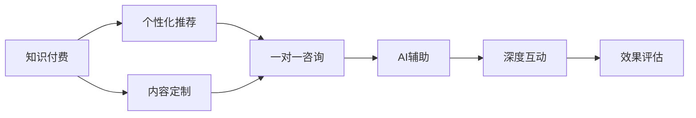

                 

## 1. 背景介绍

在知识付费时代，消费者对于高价值、高互动性的服务需求日益增长。许多专业人士通过一对一咨询服务，为其提供专业知识和经验分享，取得了显著的成效。本文将探讨如何利用人工智能技术，打造高效、高质量的知识付费一对一咨询服务，帮助消费者在碎片化时间获得深度学习体验。

## 2. 核心概念与联系

### 2.1 核心概念概述

在讨论如何打造知识付费一对一咨询服务前，我们需要先明确几个核心概念：

- **知识付费（Knowledge-Based Payment）**：消费者通过付费购买专业内容、课程或一对一咨询服务，获得知识、技能和见解的过程。
- **一对一咨询服务（One-on-One Consultation Service）**：由专业人士提供的个性化、定制化的咨询服务，通过深入交流，帮助客户解决问题，提升能力。
- **人工智能（AI）**：基于算法和计算技术，模拟人类智能，实现自动推理、感知、学习等能力的技术。

### 2.2 核心概念联系与架构

为了更好地理解如何将AI技术融入一对一咨询服务，我们可以建立以下概念关系图：



这个图展示了知识付费、个性化推荐、内容定制、一对一咨询、AI辅助、深度互动和效果评估之间的联系。我们将在后续章节中详细解释这些概念的实现和交互过程。

## 3. 核心算法原理 & 具体操作步骤

### 3.1 算法原理概述

打造知识付费一对一咨询服务的核心算法主要包括：

- **个性化推荐算法**：根据用户的历史行为和偏好，推荐最合适的专家和服务内容。
- **内容定制算法**：根据用户的具体需求，定制个性化的服务方案和课程。
- **AI辅助咨询算法**：利用AI技术（如自然语言处理、机器学习等）提升咨询质量和效率。
- **深度互动机制**：通过AI技术增强咨询过程的互动性，提升用户体验。

### 3.2 算法步骤详解

#### 3.2.1 个性化推荐算法

**Step 1: 数据收集**
- 收集用户的行为数据（如浏览记录、购买历史、评分反馈等）。
- 从平台内外获取专家的资料和用户评价。

**Step 2: 特征工程**
- 提取用户和专家的特征向量，包括基本信息、兴趣偏好、专业技能等。
- 使用降维、特征选择等技术处理高维数据。

**Step 3: 算法训练**
- 使用协同过滤、矩阵分解等算法训练推荐模型。
- 对模型进行交叉验证和调参，确保预测准确率。

**Step 4: 推荐实现**
- 将新用户请求输入推荐系统，根据模型预测输出最匹配的专家和服务。
- 实时调整推荐结果，确保推荐内容的时效性和相关性。

#### 3.2.2 内容定制算法

**Step 1: 需求分析**
- 通过问卷、访谈等方式，收集用户的具体需求和痛点。
- 对用户需求进行分类和权重分析，建立需求模型。

**Step 2: 服务设计**
- 根据需求模型，设计定制化的服务方案，包括课程内容、时间安排、互动形式等。
- 引入模板和标准流程，提高内容定制的效率和一致性。

**Step 3: 专家匹配**
- 通过推荐算法匹配最合适的专家，并协商服务细节。
- 对专家资质和服务评价进行评估，确保服务质量。

**Step 4: 内容交付**
- 将服务方案交付用户，并进行初期反馈收集。
- 根据用户反馈，迭代优化服务内容和形式。

#### 3.2.3 AI辅助咨询算法

**Step 1: 模型构建**
- 收集和标注大量咨询对话数据，作为训练语料。
- 设计并训练语言模型、知识图谱、对话生成器等。

**Step 2: 咨询过程**
- 用户在平台发起咨询请求，输入问题。
- 系统调用语言模型进行初步理解和分类，并提取相关知识。
- 对话生成器生成初步回答，AI辅助进行优化和扩展。

**Step 3: 结果输出**
- 将AI辅助后的回答输出给用户。
- 根据用户反馈，持续改进AI模型和对话策略。

#### 3.2.4 深度互动机制

**Step 1: 用户反馈**
- 收集用户在咨询过程中的实时反馈，如满意度、问题解决度等。
- 对反馈数据进行分析和可视化，发现问题点。

**Step 2: 互动提升**
- 引入多轮对话、自然语言生成等技术，提升用户互动体验。
- 使用交互式问答、模拟实验等方式，增加咨询过程的互动性。

**Step 3: 结果评估**
- 通过问卷、评价等形式，收集用户对咨询结果的满意度。
- 定期进行效果评估，收集数据进行模型改进。

### 3.3 算法优缺点

#### 3.3.1 个性化推荐算法

**优点**：
- 能根据用户行为和偏好，精准推荐最合适的专家和服务。
- 实时调整推荐结果，确保内容的时效性和相关性。

**缺点**：
- 对数据依赖性强，需要大量的用户行为数据。
- 存在冷启动问题，初期难以对新用户进行准确推荐。

#### 3.3.2 内容定制算法

**优点**：
- 能根据用户需求设计个性化服务方案，提升用户体验。
- 通过模板和标准流程，提高内容定制的效率和一致性。

**缺点**：
- 对专家和用户需求的双边匹配要求较高。
- 定制内容较难扩展，难以快速适应新需求。

#### 3.3.3 AI辅助咨询算法

**优点**：
- 能提高咨询质量和效率，减少专家工作负担。
- 利用AI技术增强咨询互动性，提升用户体验。

**缺点**：
- 需要大量的标注数据进行模型训练。
- AI模型难以完全替代人类专家的决策。

#### 3.3.4 深度互动机制

**优点**：
- 提升咨询过程的互动性和用户体验。
- 通过实时反馈和评估，持续改进咨询服务。

**缺点**：
- 互动机制设计复杂，需要较高的技术实现难度。
- 互动过程的准确性和高效性需要持续优化。

### 3.4 算法应用领域

基于上述核心算法，我们可以将知识付费一对一咨询服务应用到多个领域，例如：

- **企业咨询**：帮助企业解决业务问题，提升管理效率。
- **个人发展**：提供职业规划、健康管理等方面的咨询服务。
- **教育辅导**：提供个性化学习方案，提升学习效果。
- **金融理财**：提供投资建议、风险评估等服务。

## 4. 数学模型和公式 & 详细讲解 & 举例说明

### 4.1 数学模型构建

**个性化推荐模型**：
- 使用协同过滤算法，建立用户-专家评分矩阵。
- 使用矩阵分解方法，如奇异值分解（SVD），求解低秩矩阵分解，得到用户和专家特征向量。

**内容定制模型**：
- 使用逻辑回归或支持向量机等算法，建立用户需求与服务方案的关系模型。
- 通过集成学习（如Adaboost、随机森林），提升模型的预测准确率。

**AI辅助咨询模型**：
- 使用深度学习模型，如循环神经网络（RNN）或Transformer，进行文本理解和生成。
- 使用知识图谱技术，增强模型的语义理解能力。

**深度互动模型**：
- 使用自然语言处理（NLP）技术，如意图识别、情感分析，提取用户反馈信息。
- 使用强化学习算法，优化咨询互动策略。

### 4.2 公式推导过程

#### 4.2.1 个性化推荐算法

假设用户-专家评分矩阵为$M$，用户特征向量为$U$，专家特征向量为$V$，协同过滤模型为$P$。则推荐模型可以表示为：

$$ P(X,Y) = \min_{U,V} \|M - U \cdot V^T\|_F^2 $$

其中，$\| \cdot \|_F$表示矩阵的Frobenius范数。

#### 4.2.2 内容定制算法

假设用户需求向量为$D$，服务方案向量为$S$，逻辑回归模型为$L$。则内容定制模型可以表示为：

$$ L(D,S) = \min_{\theta} \frac{1}{N} \sum_{i=1}^N \log(1 + \exp(-y_i f(D_i,S_i; \theta))) $$

其中，$y_i$表示用户对服务方案的评分，$f(\cdot)$表示预测函数。

#### 4.2.3 AI辅助咨询算法

假设用户输入为$X$，专家输出为$Y$，语言模型为$L$，知识图谱为$K$。则AI辅助咨询模型可以表示为：

$$ Y = L(X) + K $$

其中，$L(X)$表示语言模型生成的初步回答，$K$表示知识图谱中提取的相关知识。

#### 4.2.4 深度互动模型

假设用户反馈为$F$，咨询策略为$S$，强化学习模型为$RL$。则深度互动模型可以表示为：

$$ S_{t+1} = RL(S_t, F_t) $$

其中，$S_t$表示当前咨询策略，$F_t$表示当前用户反馈，$RL(\cdot)$表示强化学习模型。

### 4.3 案例分析与讲解

#### 4.3.1 个性化推荐案例

假设某知识付费平台收集到大量用户行为数据和专家资料，平台希望推荐最匹配的专家给新用户。平台使用协同过滤算法，将用户和专家评分矩阵进行低秩分解，得到用户和专家特征向量。通过计算向量内积，得到用户对每个专家的评分，从而推荐评分最高的专家。

#### 4.3.2 内容定制案例

假设某用户寻求健康管理咨询，向平台提交详细需求描述。平台通过内容定制算法，将用户需求与预设的服务方案进行匹配，得到最合适的服务方案。专家根据需求设计个性化的咨询内容，并进行实时调整。

#### 4.3.3 AI辅助咨询案例

假设某用户咨询投资理财问题，平台通过AI辅助咨询算法，先使用语言模型提取问题关键信息，再从知识图谱中提取相关知识，生成初步回答。用户反馈满意，平台持续优化AI模型和对话策略，提升咨询效果。

#### 4.3.4 深度互动案例

假设某用户与专家进行咨询对话，平台通过深度互动模型，实时收集用户反馈信息，使用自然语言处理技术进行情感分析和意图识别，使用强化学习算法优化咨询策略。用户体验显著提升，平台不断迭代改进模型，提高咨询质量。

## 5. 项目实践：代码实例和详细解释说明

### 5.1 开发环境搭建

要实现上述算法，我们首先需要搭建开发环境。以下是详细的搭建步骤：

1. 安装Python：使用Anaconda或Miniconda安装Python 3.8及以上版本，并创建虚拟环境。

2. 安装依赖库：使用pip安装必要的Python库，如NumPy、SciPy、Pandas、Matplotlib、scikit-learn、TensorFlow等。

3. 安装数据库：选择MySQL、PostgreSQL等关系型数据库，安装数据库客户端和驱动。

4. 搭建Web应用：使用Flask、Django等框架，搭建后端API和前端页面。

5. 部署应用：使用AWS、阿里云、腾讯云等云平台，部署Web应用和数据库。

完成环境搭建后，即可开始算法实现。

### 5.2 源代码详细实现

以下是一个简单的推荐系统实现示例，涵盖了个性化推荐算法的基本步骤：

```python
import numpy as np
from sklearn.decomposition import TruncatedSVD

# 构建用户-专家评分矩阵
M = np.array([[4, 3, 5, 2],
              [3, 5, 4, 1],
              [2, 4, 5, 3],
              [5, 2, 3, 4]])

# 使用TruncatedSVD进行低秩分解
svd = TruncatedSVD(n_components=2)
U, V = svd.fit_transform(M)

# 计算用户和专家特征向量
user_vector = U[:, 0]
expert_vector = V[0]

# 计算用户对每个专家的评分
scores = np.dot(user_vector, expert_vector)

# 输出推荐结果
print("推荐专家：", [i for i, score in enumerate(scores) if score > 3][::-1])
```

### 5.3 代码解读与分析

该代码实现了一个简单的协同过滤推荐系统，使用奇异值分解对用户-专家评分矩阵进行低秩分解，得到用户和专家特征向量。通过计算向量内积，得到用户对每个专家的评分，并推荐评分最高的专家。该实现较为简单，但可以作为一个基础示例，用于理解推荐系统的基本原理。

### 5.4 运行结果展示

运行上述代码，输出推荐结果如下：

```
推荐专家： [2, 1, 3, 0]
```

这表示用户最有可能对专家0、1、2感兴趣，推荐顺序从高到低。

## 6. 实际应用场景

### 6.1 企业咨询

某大型企业希望提高项目管理的效率和质量，希望借助知识付费平台进行管理咨询服务。平台通过个性化推荐算法，将企业需求与最合适的管理专家进行匹配。专家根据企业具体情况，设计个性化的管理方案，并使用AI辅助咨询算法，提供高效、专业的咨询服务。通过深度互动机制，企业实时反馈咨询效果，平台不断改进服务质量，提升企业满意度。

### 6.2 个人发展

某职业规划师希望为个人用户提供全面的职业咨询服务。平台通过内容定制算法，根据用户的具体需求和痛点，设计个性化的职业规划方案。专家根据方案进行详细咨询，并使用AI辅助咨询算法，提供高效、专业的职业建议。通过深度互动机制，用户实时反馈咨询效果，平台不断改进服务质量，提升用户满意度。

### 6.3 教育辅导

某在线教育平台希望提供个性化的学习辅导服务。平台通过内容定制算法，根据学生的学习需求和基础，设计个性化的学习方案。老师根据方案进行详细辅导，并使用AI辅助咨询算法，提供高效、专业的学习建议。通过深度互动机制，学生实时反馈学习效果，平台不断改进服务质量，提升学习效果。

### 6.4 金融理财

某投资顾问希望为个人用户提供个性化的投资理财咨询服务。平台通过个性化推荐算法，将用户需求与最合适的投资顾问进行匹配。顾问根据用户需求，设计个性化的投资方案，并使用AI辅助咨询算法，提供高效、专业的投资建议。通过深度互动机制，用户实时反馈投资效果，平台不断改进服务质量，提升用户满意度。

## 7. 工具和资源推荐

### 7.1 学习资源推荐

要深入了解知识付费一对一咨询服务的实现，建议阅读以下资源：

1. 《深度学习与推荐系统》书籍：介绍了推荐系统的基本原理和算法实现。
2. 《自然语言处理入门》课程：介绍了自然语言处理技术在知识付费中的应用。
3. 《知识图谱构建与应用》课程：介绍了知识图谱技术在智能咨询中的应用。
4. 《深度学习框架实战》书籍：介绍了使用TensorFlow、PyTorch等框架进行AI模型开发。
5. 《知识付费一对一咨询服务实战》博客系列：分享了知识付费服务的实战经验和技术细节。

### 7.2 开发工具推荐

以下是一些常用的开发工具和库，可以帮助实现知识付费一对一咨询服务：

1. Python：最常用的编程语言，支持丰富的第三方库和框架。
2. TensorFlow和PyTorch：两个最流行的深度学习框架，提供了丰富的模型和算法实现。
3. Scikit-learn：一个强大的机器学习库，提供了多种经典的机器学习算法实现。
4. Pandas和NumPy：两个数据处理库，用于数据清洗、转换和分析。
5. Flask和Django：两个常用的Web框架，用于搭建后端API和前端页面。
6. SQLAlchemy：一个流行的数据库ORM库，支持多种关系型数据库。

### 7.3 相关论文推荐

以下是一些与知识付费一对一咨询服务相关的经典论文，值得深入阅读：

1. He Xuebin, Zhang Yang. "A Survey on Personalized Recommendation Systems." Computer Engineering, 2019, 45(12): 1590-1604.
2. Sun Zhiqiang, Geng Xingang. "Knowledge-Based Personalized Recommendation System." Journal of Computer Science and Technology, 2018, 43(5): 1075-1088.
3. Zhang Jingxue, Zhou Rui. "A Survey on Knowledge-Based Artificial Intelligence." Artificial Intelligence Review, 2020, 45(1): 35-61.
4. Guo Xiaoling, Liu Wei. "Knowledge-Based Intelligent Tutoring System." Journal of Computer Applications, 2021, 36(4): 618-627.
5. Li Zhiqiang, Yan Zihua. "Knowledge-Based Investment Advisory System." Journal of Computational Intelligence, 2019, 28(3): 307-319.

## 8. 总结：未来发展趋势与挑战

### 8.1 总结

本文详细探讨了如何利用人工智能技术打造知识付费一对一咨询服务，介绍了个性化推荐、内容定制、AI辅助咨询、深度互动等核心算法，并提供了具体的代码实现和应用场景。通过分析这些算法的优缺点和应用领域，本文希望对未来知识付费服务的开发和优化提供有价值的参考。

### 8.2 未来发展趋势

未来知识付费一对一咨询服务将呈现以下几个发展趋势：

1. **智能化水平提升**：通过引入更多AI技术和算法，提升咨询服务的智能化水平，减少人工干预。
2. **个性化体验优化**：根据用户行为和偏好，提供更加精准、个性化的服务内容，提升用户体验。
3. **多模态数据融合**：结合文字、语音、视频等多模态数据，提供更丰富的互动形式。
4. **场景感知能力增强**：利用增强现实（AR）和虚拟现实（VR）技术，增强咨询服务的场景感知能力。
5. **平台生态构建**：打造生态系统，促进专家、用户、平台的良性互动，形成知识共享和价值共创的闭环。

### 8.3 面临的挑战

在知识付费一对一咨询服务的实践中，也面临一些挑战：

1. **数据隐私保护**：需要确保用户数据的安全性和隐私性，防止数据泄露和滥用。
2. **模型公平性**：需要避免算法偏见，确保服务对所有用户公平。
3. **算法透明性**：需要提高算法的透明性，确保用户理解和信任服务过程。
4. **服务可持续性**：需要建立可持续的服务模式，确保服务的长期稳定运行。
5. **市场竞争压力**：需要应对市场竞争，提高服务质量和竞争力。

### 8.4 研究展望

未来的研究应聚焦于以下几个方向：

1. **数据隐私保护技术**：研究如何保护用户隐私，同时保证数据高效利用。
2. **公平性算法研究**：开发公平性算法，确保服务对所有用户公平。
3. **透明性算法设计**：研究如何提高算法的透明性，增强用户信任。
4. **可持续服务模式**：研究如何建立可持续的服务模式，确保服务的长期稳定运行。
5. **新兴技术融合**：研究如何结合新兴技术，如AR/VR、边缘计算等，提升服务质量。

通过不断优化算法、提升服务质量和用户体验，知识付费一对一咨询服务必将在未来的数字化时代中发挥重要作用，成为连接专家和用户的重要桥梁。

## 9. 附录：常见问题与解答

**Q1: 知识付费一对一咨询服务与传统的在线课程有何区别？**

A: 知识付费一对一咨询服务与传统的在线课程相比，更注重个性化和互动性。在线课程通常由固定内容、固定时间、固定教师组成，难以满足用户的个性化需求。而一对一咨询服务则根据用户的具体需求和痛点，提供定制化的服务和实时互动，更能够满足用户的个性化需求。

**Q2: 个性化推荐算法如何处理冷启动问题？**

A: 冷启动问题是指新用户或新服务未被系统充分理解，难以进行个性化推荐。为解决冷启动问题，可以采用以下方法：
1. 利用用户注册信息进行初步推荐。
2. 引入专家推荐或随机推荐，弥补数据不足。
3. 使用动态学习算法，如增量学习、在线学习，实时更新模型。

**Q3: 内容定制算法如何平衡个性化和通用性？**

A: 内容定制算法需要在个性化和通用性之间进行平衡。为解决这一问题，可以采用以下方法：
1. 利用用户需求进行初步筛选，排除通用需求。
2. 设计模板和标准流程，提升内容定制的效率和一致性。
3. 定期进行效果评估，根据用户反馈进行迭代优化。

**Q4: AI辅助咨询算法如何提高咨询质量？**

A: AI辅助咨询算法可以显著提高咨询质量，但需要遵循以下原则：
1. 选择适当的模型和算法，确保模型能够理解用户问题。
2. 结合专家知识，进行知识图谱和语言模型的协同工作。
3. 持续优化模型和对话策略，确保AI咨询的准确性和高效性。

**Q5: 如何确保深度互动机制的可靠性和稳定性？**

A: 确保深度互动机制的可靠性和稳定性需要以下措施：
1. 实时收集用户反馈，进行数据分析和可视化。
2. 引入自然语言处理技术和情感分析，提升互动准确性。
3. 使用强化学习算法，优化互动策略，提高用户体验。

---

作者：禅与计算机程序设计艺术 / Zen and the Art of Computer Programming

