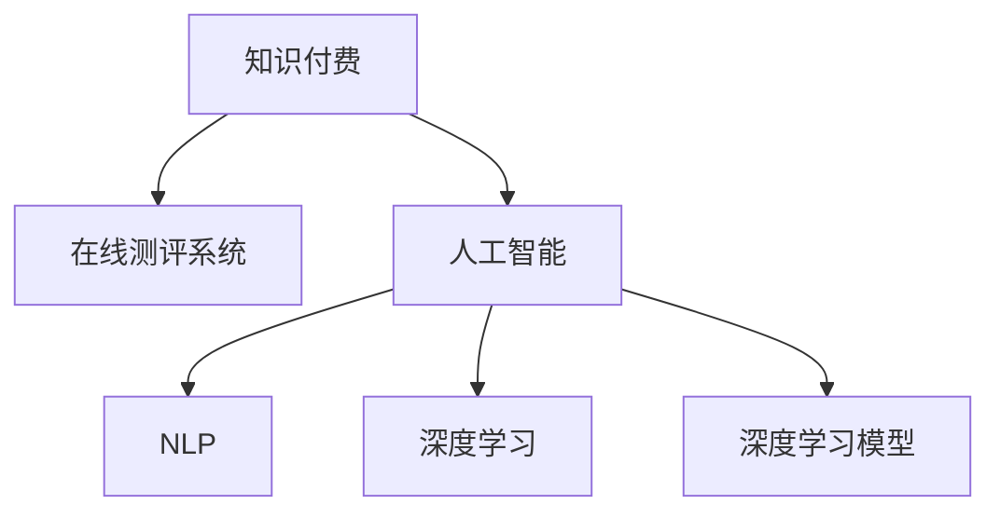

                 

# 如何打造知识付费的在线测评系统

> 关键词：知识付费,在线测评,人工智能,自然语言处理,深度学习,深度学习模型,在线教育,考试系统

## 1. 背景介绍

### 1.1 问题由来
随着在线教育的兴起，知识付费和在线测评系统成为了教育行业的重要组成部分。传统的教育模式逐渐向线上迁移，而在线测评系统作为知识付费的重要环节，需要能够高效、准确地评估学习者的学习效果，提供个性化的学习建议，进而增强学习的互动性和趣味性，促进教育资源的公平共享。然而，传统的测评系统多基于规则和统计模型，存在计算复杂度高、评估结果不够精准等问题。

### 1.2 问题核心关键点
如何构建一个高效、精准、个性化的知识付费在线测评系统？核心要点包括：
1. 评估学习者对知识点的掌握情况。
2. 根据评估结果，生成个性化的学习路径和建议。
3. 利用人工智能技术，提升系统智能化水平。

### 1.3 问题研究意义
构建知识付费的在线测评系统，对推动在线教育的发展具有重要意义：
1. 能够准确评估学习者的学习效果，为教师和内容提供商提供数据支持。
2. 根据评估结果，生成个性化学习路径和建议，提高学习效率。
3. 通过智能化的测评手段，降低教师和内容提供商的工作量，提升教育资源的利用效率。
4. 增强学习互动性和趣味性，提升学习者的参与度和满意度。

## 2. 核心概念与联系

### 2.1 核心概念概述

为更好地理解知识付费在线测评系统的构建，本节将介绍几个密切相关的核心概念：

- 知识付费(Knowledge-Paywall)：指用户通过付费获取教育资源或服务，如在线课程、电子书、培训等。相较于免费教育模式，知识付费能够提供更高质量的教育资源和服务，满足用户更个性化的学习需求。
- 在线测评系统(Online Assessment System)：基于网络平台，通过计算机技术对学习者进行在线测试，评估其知识掌握情况，生成个性化学习建议的系统。
- 人工智能(Artificial Intelligence)：通过模拟人类智能行为，实现自主学习、推理、决策等智能功能的计算系统。在线测评系统通常会借助人工智能技术，以提高测评的准确性和个性化水平。
- 自然语言处理(Natural Language Processing, NLP)：人工智能的一个分支，旨在实现计算机对自然语言的理解、生成和处理，在线测评系统常通过NLP技术处理用户输入和输出，进行语义分析和情感识别。
- 深度学习(Deep Learning)：一种基于神经网络的人工智能技术，通过多层次的特征提取，能够从数据中学习到高层次的语义特征，在线测评系统常使用深度学习模型对用户输入和输出进行分析和预测。
- 深度学习模型(Deep Learning Models)：如卷积神经网络(CNN)、循环神经网络(RNN)、Transformer等，在线测评系统常使用这些模型进行数据处理和预测。

这些核心概念之间的逻辑关系可以通过以下Mermaid流程图来展示：



这个流程图展示了几组核心概念之间的关系：

1. 知识付费提供高质量的教育资源，用户通过付费获取，在线测评系统帮助评估和优化学习效果。
2. 人工智能技术是构建在线测评系统的基础，NLP和深度学习模型在此基础上，实现高效、精准的测评。

## 3. 核心算法原理 & 具体操作步骤
### 3.1 算法原理概述

知识付费在线测评系统，本质上是一个结合人工智能和在线教育技术的复合系统。其核心算法原理如下：

- **用户输入理解**：利用NLP技术，解析用户输入的自然语言，提取关键词和语义信息。
- **数据处理**：通过深度学习模型，对用户输入和输出进行特征提取和处理。
- **评估和分析**：根据深度学习模型的预测结果，生成对学习者知识掌握情况和能力水平的评估报告。
- **个性化推荐**：根据评估结果，利用人工智能技术，生成个性化的学习路径和建议。

### 3.2 算法步骤详解

以下步骤详细介绍了知识付费在线测评系统的构建流程：

**Step 1: 准备预训练模型和数据集**
- 选择合适的深度学习模型，如BERT、Transformer等。
- 准备测评任务的数据集，划分为训练集、验证集和测试集，确保数据集分布与实际应用场景相似。

**Step 2: 模型训练和微调**
- 使用预训练模型对数据集进行微调，优化模型参数，使其能够更好地适应测评任务。
- 选择适当的优化算法，如AdamW、SGD等，设置合适的学习率、批大小和迭代轮数。
- 应用正则化技术，如L2正则、Dropout等，防止模型过拟合。

**Step 3: 用户输入理解**
- 利用NLP技术，将用户输入的自然语言转换为计算机可理解的形式，如Token ID序列。
- 使用深度学习模型，对用户输入进行语义分析和情感识别，提取关键词和语义信息。

**Step 4: 数据处理和特征提取**
- 将用户输入和输出输入深度学习模型，通过卷积层、循环层等提取特征。
- 通过池化层和注意力机制等，对特征进行融合和筛选，提取重要的语义信息。

**Step 5: 评估和分析**
- 根据深度学习模型的预测结果，评估学习者对知识点的掌握情况。
- 生成对学习者知识水平和能力水平的综合报告，包括分数、正确率、错误类型等。

**Step 6: 个性化推荐**
- 根据评估报告，生成个性化的学习路径和建议。
- 利用人工智能技术，动态调整推荐算法，提高推荐效果。

### 3.3 算法优缺点

知识付费在线测评系统基于人工智能和深度学习技术，具有以下优点：
1. 高准确性：深度学习模型能够从数据中学习到高层次的语义特征，准确评估学习者对知识点的掌握情况。
2. 高效率：在线测评系统能够快速处理大量用户的输入和输出，提供即时的评估结果和建议。
3. 个性化：根据评估结果，系统能够生成个性化的学习路径和建议，提升学习效率。
4. 扩展性强：系统能够灵活扩展到不同类型的测评任务，如编程、数学、语言学等。

同时，该系统也存在以下局限性：
1. 数据依赖：深度学习模型需要大量的标注数据进行训练，数据获取成本较高。
2. 模型复杂：深度学习模型的复杂度较高，需要高性能计算资源进行训练和推理。
3. 可解释性不足：模型内部的决策过程难以解释，用户和教师难以理解模型输出。
4. 敏感性：深度学习模型可能学习到有害信息，需要严格的数据过滤和监控。

尽管存在这些局限性，但就目前而言，基于深度学习的在线测评系统在知识付费领域的应用已经取得了显著的效果，成为在线教育的重要工具。

### 3.4 算法应用领域

知识付费在线测评系统已经在多个领域得到了应用，包括但不限于：

- 在线教育：如Coursera、Udacity等平台，使用在线测评系统评估学习者的学习效果，生成个性化学习建议。
- 企业培训：如Google、Facebook等公司，使用在线测评系统评估员工技能水平，制定个性化培训计划。
- 语言学习：如Duolingo等平台，使用在线测评系统评估学习者的语言水平，提供个性化的学习路径和建议。
- 编程训练：如LeetCode、HackerRank等平台，使用在线测评系统评估编程能力，进行个性化训练和推荐。

## 4. 数学模型和公式 & 详细讲解 & 举例说明

### 4.1 数学模型构建

在线测评系统的核心数学模型包括深度学习模型和个性化推荐算法。以下以基于BERT模型的情感分析任务为例，详细讲解模型构建和计算过程。

**模型结构**：
- 输入层：将用户输入的自然语言转换为Token ID序列。
- 嵌入层：将Token ID序列转换为向量表示。
- BERT编码层：通过BERT模型对输入进行编码，提取语义特征。
- 全连接层：将BERT模型的输出进行线性变换，得到预测结果。

**模型训练**：
- 损失函数：使用交叉熵损失函数，衡量预测结果与真实标签之间的差异。
- 优化器：使用AdamW优化器，更新模型参数。
- 正则化：使用L2正则，防止过拟合。

**模型推理**：
- 输入：将用户输入的自然语言转换为Token ID序列，输入模型。
- 前向传播：通过BERT模型进行编码，提取语义特征。
- 预测：将BERT模型的输出进行线性变换，得到预测结果。

### 4.2 公式推导过程

以情感分析任务为例，推导模型训练和推理过程中的关键公式。

**输入和嵌入**：
- $x_i = (x_i^1, x_i^2, ..., x_i^n)$，其中 $x_i^j$ 为输入中的第 $j$ 个Token的ID。
- $E(x_i) = [w_1, w_2, ..., w_n]$，其中 $w_j$ 为 $x_i^j$ 的嵌入向量。

**BERT编码**：
- $H = BERT(E(x_i))$，其中 $H = (h_1, h_2, ..., h_n)$，为BERT模型对输入的编码结果。
- $h_j$ 表示BERT模型对 $x_i^j$ 的编码结果。

**全连接层**：
- $L = FC(H)$，其中 $L$ 为全连接层输出，表示预测结果。
- $FC$ 为全连接层，将BERT编码结果进行线性变换。

**损失函数**：
- $L(\hat{y}, y) = -\frac{1}{N} \sum_{i=1}^N [y_i \log(\hat{y_i}) + (1-y_i) \log(1-\hat{y_i})]$，其中 $y$ 为真实标签，$\hat{y}$ 为模型预测结果。

**优化器**：
- $\theta \leftarrow \theta - \eta \nabla_{\theta}L(\hat{y}, y) - \eta\lambda\theta$，其中 $\eta$ 为学习率，$\lambda$ 为正则化系数。

**推理过程**：
- 将用户输入的自然语言转换为Token ID序列 $x$。
- 将 $x$ 输入BERT模型，得到编码结果 $H$。
- 将 $H$ 输入全连接层，得到预测结果 $L$。
- 根据 $L$ 的值，生成对用户输入情感的评估报告。

### 4.3 案例分析与讲解

以情感分析任务为例，详细讲解模型构建和应用过程。

假设有一批标注数据，其中每个样本包含一条用户评论和其情感标签（正面、负面、中性）。模型首先从预训练的BERT模型中加载权重，然后在标注数据上微调。

- **模型选择**：选择BERT-base模型，将评论作为输入，标签作为输出，构建情感分析模型。
- **数据预处理**：将评论转换为Token ID序列，并进行padding和truncation。
- **模型训练**：在标注数据上微调模型，使用AdamW优化器，设置学习率为1e-5，批大小为16，迭代轮数为10。
- **模型推理**：将用户评论输入模型，输出情感得分，根据得分判断情感倾向。

通过上述步骤，模型可以高效准确地评估用户评论的情感倾向，生成个性化推荐。

## 5. 项目实践：代码实例和详细解释说明

### 5.1 开发环境搭建

在进行知识付费在线测评系统的开发前，需要准备好开发环境。以下是使用Python进行PyTorch开发的环境配置流程：

1. 安装Anaconda：从官网下载并安装Anaconda，用于创建独立的Python环境。

2. 创建并激活虚拟环境：
```bash
conda create -n pytorch-env python=3.8 
conda activate pytorch-env
```

3. 安装PyTorch：根据CUDA版本，从官网获取对应的安装命令。例如：
```bash
conda install pytorch torchvision torchaudio cudatoolkit=11.1 -c pytorch -c conda-forge
```

4. 安装TensorFlow：可选，如果需要支持TensorFlow模型，则需安装。

5. 安装各类工具包：
```bash
pip install numpy pandas scikit-learn matplotlib tqdm jupyter notebook ipython
```

完成上述步骤后，即可在`pytorch-env`环境中开始开发。

### 5.2 源代码详细实现

下面以情感分析任务为例，给出使用PyTorch和HuggingFace Transformers库对BERT模型进行微调的代码实现。

首先，定义情感分析任务的数据处理函数：

```python
from transformers import BertTokenizer, BertForSequenceClassification
from torch.utils.data import Dataset
import torch

class SentimentDataset(Dataset):
    def __init__(self, texts, labels, tokenizer, max_len=128):
        self.texts = texts
        self.labels = labels
        self.tokenizer = tokenizer
        self.max_len = max_len
        
    def __len__(self):
        return len(self.texts)
    
    def __getitem__(self, item):
        text = self.texts[item]
        label = self.labels[item]
        
        encoding = self.tokenizer(text, return_tensors='pt', max_length=self.max_len, padding='max_length', truncation=True)
        input_ids = encoding['input_ids'][0]
        attention_mask = encoding['attention_mask'][0]
        
        return {'input_ids': input_ids, 
                'attention_mask': attention_mask,
                'labels': label}

# 加载预训练模型
model = BertForSequenceClassification.from_pretrained('bert-base-uncased', num_labels=3)
# 加载分词器
tokenizer = BertTokenizer.from_pretrained('bert-base-uncased')

# 创建dataset
train_dataset = SentimentDataset(train_texts, train_labels, tokenizer)
dev_dataset = SentimentDataset(dev_texts, dev_labels, tokenizer)
test_dataset = SentimentDataset(test_texts, test_labels, tokenizer)
```

然后，定义训练和评估函数：

```python
from torch.utils.data import DataLoader
from tqdm import tqdm
from sklearn.metrics import accuracy_score, precision_score, recall_score, f1_score

device = torch.device('cuda') if torch.cuda.is_available() else torch.device('cpu')
model.to(device)

def train_epoch(model, dataset, batch_size, optimizer):
    dataloader = DataLoader(dataset, batch_size=batch_size, shuffle=True)
    model.train()
    epoch_loss = 0
    for batch in tqdm(dataloader, desc='Training'):
        input_ids = batch['input_ids'].to(device)
        attention_mask = batch['attention_mask'].to(device)
        labels = batch['labels'].to(device)
        model.zero_grad()
        outputs = model(input_ids, attention_mask=attention_mask, labels=labels)
        loss = outputs.loss
        epoch_loss += loss.item()
        loss.backward()
        optimizer.step()
    return epoch_loss / len(dataloader)

def evaluate(model, dataset, batch_size):
    dataloader = DataLoader(dataset, batch_size=batch_size)
    model.eval()
    preds, labels = [], []
    with torch.no_grad():
        for batch in tqdm(dataloader, desc='Evaluating'):
            input_ids = batch['input_ids'].to(device)
            attention_mask = batch['attention_mask'].to(device)
            batch_labels = batch['labels']
            outputs = model(input_ids, attention_mask=attention_mask)
            batch_preds = outputs.logits.argmax(dim=1).to('cpu').tolist()
            batch_labels = batch_labels.to('cpu').tolist()
            for pred, label in zip(batch_preds, batch_labels):
                preds.append(pred)
                labels.append(label)
                
    print(f"Accuracy: {accuracy_score(labels, preds):.3f}")
    print(f"Precision: {precision_score(labels, preds, average='macro'): .3f}")
    print(f"Recall: {recall_score(labels, preds, average='macro'): .3f}")
    print(f"F1 Score: {f1_score(labels, preds, average='macro'): .3f}")
```

最后，启动训练流程并在测试集上评估：

```python
epochs = 5
batch_size = 16

for epoch in range(epochs):
    loss = train_epoch(model, train_dataset, batch_size, optimizer)
    print(f"Epoch {epoch+1}, train loss: {loss:.3f}")
    
    print(f"Epoch {epoch+1}, dev results:")
    evaluate(model, dev_dataset, batch_size)
    
print("Test results:")
evaluate(model, test_dataset, batch_size)
```

以上就是使用PyTorch对BERT进行情感分析任务微调的完整代码实现。可以看到，得益于Transformers库的强大封装，我们可以用相对简洁的代码完成BERT模型的加载和微调。

### 5.3 代码解读与分析

让我们再详细解读一下关键代码的实现细节：

**SentimentDataset类**：
- `__init__`方法：初始化文本、标签、分词器等关键组件。
- `__len__`方法：返回数据集的样本数量。
- `__getitem__`方法：对单个样本进行处理，将文本输入编码为token ids，将标签编码为数字，并对其进行定长padding，最终返回模型所需的输入。

**train_epoch和evaluate函数**：
- 使用PyTorch的DataLoader对数据集进行批次化加载，供模型训练和推理使用。
- 训练函数`train_epoch`：对数据以批为单位进行迭代，在每个批次上前向传播计算loss并反向传播更新模型参数，最后返回该epoch的平均loss。
- 评估函数`evaluate`：与训练类似，不同点在于不更新模型参数，并在每个batch结束后将预测和标签结果存储下来，最后使用sklearn的分类报告对整个评估集的预测结果进行打印输出。

**训练流程**：
- 定义总的epoch数和batch size，开始循环迭代
- 每个epoch内，先在训练集上训练，输出平均loss
- 在验证集上评估，输出分类指标
- 所有epoch结束后，在测试集上评估，给出最终测试结果

可以看到，PyTorch配合Transformers库使得BERT微调的代码实现变得简洁高效。开发者可以将更多精力放在数据处理、模型改进等高层逻辑上，而不必过多关注底层的实现细节。

当然，工业级的系统实现还需考虑更多因素，如模型的保存和部署、超参数的自动搜索、更灵活的任务适配层等。但核心的微调范式基本与此类似。

## 6. 实际应用场景
### 6.1 智能客服系统

基于知识付费在线测评系统的对话技术，可以广泛应用于智能客服系统的构建。传统客服往往需要配备大量人力，高峰期响应缓慢，且一致性和专业性难以保证。而使用测评系统构建的智能客服系统，可以7x24小时不间断服务，快速响应客户咨询，用自然流畅的语言解答各类常见问题。

在技术实现上，可以收集企业内部的历史客服对话记录，将问题和最佳答复构建成监督数据，在此基础上对预训练对话模型进行微调。微调后的对话模型能够自动理解用户意图，匹配最合适的答案模板进行回复。对于客户提出的新问题，还可以接入检索系统实时搜索相关内容，动态组织生成回答。如此构建的智能客服系统，能大幅提升客户咨询体验和问题解决效率。

### 6.2 金融舆情监测

金融机构需要实时监测市场舆论动向，以便及时应对负面信息传播，规避金融风险。传统的人工监测方式成本高、效率低，难以应对网络时代海量信息爆发的挑战。基于测评系统的文本分类和情感分析技术，为金融舆情监测提供了新的解决方案。

具体而言，可以收集金融领域相关的新闻、报道、评论等文本数据，并对其进行主题标注和情感标注。在此基础上对测评系统进行微调，使其能够自动判断文本属于何种主题，情感倾向是正面、中性还是负面。将测评系统应用到实时抓取的网络文本数据，就能够自动监测不同主题下的情感变化趋势，一旦发现负面信息激增等异常情况，系统便会自动预警，帮助金融机构快速应对潜在风险。

### 6.3 个性化推荐系统

当前的推荐系统往往只依赖用户的历史行为数据进行物品推荐，无法深入理解用户的真实兴趣偏好。基于测评系统的个性化推荐系统可以更好地挖掘用户行为背后的语义信息，从而提供更精准、多样的推荐内容。

在实践中，可以收集用户浏览、点击、评论、分享等行为数据，提取和用户交互的物品标题、描述、标签等文本内容。将文本内容作为模型输入，用户的后续行为（如是否点击、购买等）作为监督信号，在此基础上微调测评系统。测评系统能够从文本内容中准确把握用户的兴趣点。在生成推荐列表时，先用候选物品的文本描述作为输入，由测评系统预测用户的兴趣匹配度，再结合其他特征综合排序，便可以得到个性化程度更高的推荐结果。

### 6.4 未来应用展望

随着测评系统的不断发展，其在知识付费领域的应用前景将更加广阔。

在智慧医疗领域，基于测评系统的医疗问答、病历分析、药物研发等应用将提升医疗服务的智能化水平，辅助医生诊疗，加速新药开发进程。

在智能教育领域，测评系统可应用于作业批改、学情分析、知识推荐等方面，因材施教，促进教育公平，提高教学质量。

在智慧城市治理中，测评系统可应用于城市事件监测、舆情分析、应急指挥等环节，提高城市管理的自动化和智能化水平，构建更安全、高效的未来城市。

此外，在企业生产、社会治理、文娱传媒等众多领域，测评系统也将不断涌现，为传统行业数字化转型升级提供新的技术路径。相信随着技术的日益成熟，测评系统必将在构建人机协同的智能时代中扮演越来越重要的角色。

## 7. 工具和资源推荐
### 7.1 学习资源推荐

为了帮助开发者系统掌握测评系统的理论基础和实践技巧，这里推荐一些优质的学习资源：

1. 《深度学习框架PyTorch实战》系列博文：由PyTorch官方团队撰写，深入浅出地介绍了PyTorch的基本用法和高级特性，适合初学者和进阶者学习。

2. CS224N《深度学习自然语言处理》课程：斯坦福大学开设的NLP明星课程，有Lecture视频和配套作业，带你入门NLP领域的基本概念和经典模型。

3. 《Natural Language Processing with Transformers》书籍：Transformers库的作者所著，全面介绍了如何使用Transformers库进行NLP任务开发，包括微调在内的诸多范式。

4. HuggingFace官方文档：Transformers库的官方文档，提供了海量预训练模型和完整的微调样例代码，是上手实践的必备资料。

5. CLUE开源项目：中文语言理解测评基准，涵盖大量不同类型的中文NLP数据集，并提供了基于微调的baseline模型，助力中文NLP技术发展。

通过对这些资源的学习实践，相信你一定能够快速掌握测评系统的精髓，并用于解决实际的NLP问题。
###  7.2 开发工具推荐

高效的开发离不开优秀的工具支持。以下是几款用于测评系统开发的常用工具：

1. PyTorch：基于Python的开源深度学习框架，灵活动态的计算图，适合快速迭代研究。大部分预训练语言模型都有PyTorch版本的实现。

2. TensorFlow：由Google主导开发的开源深度学习框架，生产部署方便，适合大规模工程应用。同样有丰富的预训练语言模型资源。

3. Transformers库：HuggingFace开发的NLP工具库，集成了众多SOTA语言模型，支持PyTorch和TensorFlow，是进行测评系统开发的利器。

4. Weights & Biases：模型训练的实验跟踪工具，可以记录和可视化模型训练过程中的各项指标，方便对比和调优。与主流深度学习框架无缝集成。

5. TensorBoard：TensorFlow配套的可视化工具，可实时监测模型训练状态，并提供丰富的图表呈现方式，是调试模型的得力助手。

6. Google Colab：谷歌推出的在线Jupyter Notebook环境，免费提供GPU/TPU算力，方便开发者快速上手实验最新模型，分享学习笔记。

合理利用这些工具，可以显著提升测评系统的开发效率，加快创新迭代的步伐。

### 7.3 相关论文推荐

测评系统的发展源于学界的持续研究。以下是几篇奠基性的相关论文，推荐阅读：

1. Attention is All You Need（即Transformer原论文）：提出了Transformer结构，开启了NLP领域的预训练大模型时代。

2. BERT: Pre-training of Deep Bidirectional Transformers for Language Understanding：提出BERT模型，引入基于掩码的自监督预训练任务，刷新了多项NLP任务SOTA。

3. Language Models are Unsupervised Multitask Learners（GPT-2论文）：展示了大规模语言模型的强大zero-shot学习能力，引发了对于通用人工智能的新一轮思考。

4. Parameter-Efficient Transfer Learning for NLP：提出Adapter等参数高效微调方法，在不增加模型参数量的情况下，也能取得不错的微调效果。

5. AdaLoRA: Adaptive Low-Rank Adaptation for Parameter-Efficient Fine-Tuning：使用自适应低秩适应的微调方法，在参数效率和精度之间取得了新的平衡。

这些论文代表了大语言模型微调技术的发展脉络。通过学习这些前沿成果，可以帮助研究者把握学科前进方向，激发更多的创新灵感。

## 8. 总结：未来发展趋势与挑战

### 8.1 总结

本文对基于深度学习的知识付费在线测评系统进行了全面系统的介绍。首先阐述了测评系统的研究背景和意义，明确了系统构建的核心要点。其次，从原理到实践，详细讲解了测评系统的算法原理和操作步骤，给出了测评系统开发的完整代码实例。同时，本文还广泛探讨了测评系统在智能客服、金融舆情、个性化推荐等多个领域的应用前景，展示了测评系统的巨大潜力。此外，本文精选了测评系统的各类学习资源，力求为开发者提供全方位的技术指引。

通过本文的系统梳理，可以看到，基于深度学习的测评系统已经初步具备了大规模应用的条件，正在成为知识付费和在线教育的重要工具。未来，伴随深度学习模型的不断演进，测评系统必将在更多领域得到应用，为教育资源和服务的公平共享带来新的机遇。

### 8.2 未来发展趋势

展望未来，知识付费在线测评系统将呈现以下几个发展趋势：

1. 测评系统的应用领域将不断扩展。随着深度学习模型的性能提升，测评系统将能够应用于更广泛的领域，如金融、医疗、教育等。
2. 测评系统的智能化水平将进一步提升。未来测评系统将融合更多先验知识，如知识图谱、逻辑规则等，提升评估结果的准确性和可靠性。
3. 测评系统的个性化推荐能力将增强。通过深度学习和人工智能技术的结合，测评系统将能够提供更加个性化和多样化的学习建议。
4. 测评系统的可解释性将提高。未来测评系统将引入更多解释性算法，帮助用户和教师理解模型的输出和决策过程。
5. 测评系统的鲁棒性将增强。未来测评系统将能够应对不同领域、不同难度、不同风格的数据，保持稳健性。
6. 测评系统的跨领域迁移能力将提升。未来测评系统将能够在大规模数据上预训练，并在新领域快速微调，适应新的测评任务。

以上趋势凸显了测评系统的广阔前景。这些方向的探索发展，必将进一步提升测评系统的性能和应用范围，为教育资源和服务的公平共享带来新的机遇。

### 8.3 面临的挑战

尽管知识付费在线测评系统已经取得了显著效果，但在迈向更加智能化、普适化应用的过程中，它仍面临着诸多挑战：

1. 数据依赖。深度学习模型需要大量的标注数据进行训练，数据获取成本较高。如何通过无监督学习、半监督学习等方式降低对标注数据的依赖，将是一大难题。
2. 模型复杂。深度学习模型的复杂度较高，需要高性能计算资源进行训练和推理。如何在保证性能的同时，优化模型结构，提高推理效率，优化资源占用，将是重要的优化方向。
3. 可解释性不足。模型内部的决策过程难以解释，用户和教师难以理解模型输出。如何赋予测评系统更强的可解释性，将是亟待攻克的难题。
4. 安全性有待保障。测评系统可能学习到有害信息，需要严格的数据过滤和监控。如何从数据和算法层面消除模型偏见，避免恶意用途，确保输出的安全性，也将是重要的研究课题。
5. 知识整合能力不足。现有的测评模型往往局限于任务内数据，难以灵活吸收和运用更广泛的先验知识。如何让测评系统更好地与外部知识库、规则库等专家知识结合，形成更加全面、准确的信息整合能力，还有很大的想象空间。

正视测评系统面临的这些挑战，积极应对并寻求突破，将是大语言模型微调走向成熟的必由之路。相信随着学界和产业界的共同努力，这些挑战终将一一被克服，测评系统必将在构建人机协同的智能时代中扮演越来越重要的角色。

### 8.4 研究展望

面对测评系统所面临的种种挑战，未来的研究需要在以下几个方面寻求新的突破：

1. 探索无监督和半监督测评方法。摆脱对大规模标注数据的依赖，利用自监督学习、主动学习等无监督和半监督范式，最大限度利用非结构化数据，实现更加灵活高效的测评。
2. 研究参数高效和计算高效的测评范式。开发更加参数高效的测评方法，在固定大部分预训练参数的同时，只更新极少量的任务相关参数。同时优化测评模型的计算图，减少前向传播和反向传播的资源消耗，实现更加轻量级、实时性的部署。
3. 融合因果和对比学习范式。通过引入因果推断和对比学习思想，增强测评系统建立稳定因果关系的能力，学习更加普适、鲁棒的语言表征，从而提升模型泛化性和抗干扰能力。
4. 引入更多先验知识。将符号化的先验知识，如知识图谱、逻辑规则等，与神经网络模型进行巧妙融合，引导测评过程学习更准确、合理的语言模型。同时加强不同模态数据的整合，实现视觉、语音等多模态信息与文本信息的协同建模。
5. 结合因果分析和博弈论工具。将因果分析方法引入测评模型，识别出模型决策的关键特征，增强输出解释的因果性和逻辑性。借助博弈论工具刻画人机交互过程，主动探索并规避模型的脆弱点，提高系统稳定性。
6. 纳入伦理道德约束。在模型训练目标中引入伦理导向的评估指标，过滤和惩罚有害的输出倾向。同时加强人工干预和审核，建立模型行为的监管机制，确保输出符合人类价值观和伦理道德。

这些研究方向的探索，必将引领测评系统技术迈向更高的台阶，为构建安全、可靠、可解释、可控的智能系统铺平道路。面向未来，测评系统还需要与其他人工智能技术进行更深入的融合，如知识表示、因果推理、强化学习等，多路径协同发力，共同推动自然语言理解和智能交互系统的进步。只有勇于创新、敢于突破，才能不断拓展测评系统的边界，让智能技术更好地造福人类社会。

## 9. 附录：常见问题与解答

**Q1：知识付费在线测评系统是否适用于所有NLP任务？**

A: 知识付费在线测评系统在大多数NLP任务上都能取得不错的效果，特别是对于数据量较小的任务。但对于一些特定领域的任务，如医学、法律等，仅仅依靠通用语料预训练的模型可能难以很好地适应。此时需要在特定领域语料上进一步预训练，再进行微调，才能获得理想效果。此外，对于一些需要时效性、个性化很强的任务，如对话、推荐等，测评方法也需要针对性的改进优化。

**Q2：测评系统如何选择合适的学习率？**

A: 测评系统的学习率一般要比预训练时小1-2个数量级，如果使用过大的学习率，容易破坏预训练权重，导致过拟合。一般建议从1e-5开始调参，逐步减小学习率，直至收敛。也可以使用warmup策略，在开始阶段使用较小的学习率，再逐渐过渡到预设值。需要注意的是，不同的优化器(如AdamW、Adafactor等)以及不同的学习率调度策略，可能需要设置不同的学习率阈值。

**Q3：测评系统在落地部署时需要注意哪些问题？**

A: 将测评系统转化为实际应用，还需要考虑以下因素：
1. 模型裁剪：去除不必要的层和参数，减小模型尺寸，加快推理速度
2. 量化加速：将浮点模型转为定点模型，压缩存储空间，提高计算效率
3. 服务化封装：将模型封装为标准化服务接口，便于集成调用
4. 弹性伸缩：根据请求流量动态调整资源配置，平衡服务质量和成本
5. 监控告警：实时采集系统指标，设置异常告警阈值，确保服务稳定性
6. 安全防护：采用访问鉴权、数据脱敏等措施，保障数据和模型安全

测评系统为知识付费和在线教育提供了新的解决方案，但如何将强大的性能转化为稳定、高效、安全的业务价值，还需要工程实践的不断打磨。唯有从数据、算法、工程、业务等多个维度协同发力，才能真正实现测评系统在垂直行业的规模化落地。总之，测评系统需要开发者根据具体任务，不断迭代和优化模型、数据和算法，方能得到理想的效果。

---

作者：禅与计算机程序设计艺术 / Zen and the Art of Computer Programming

