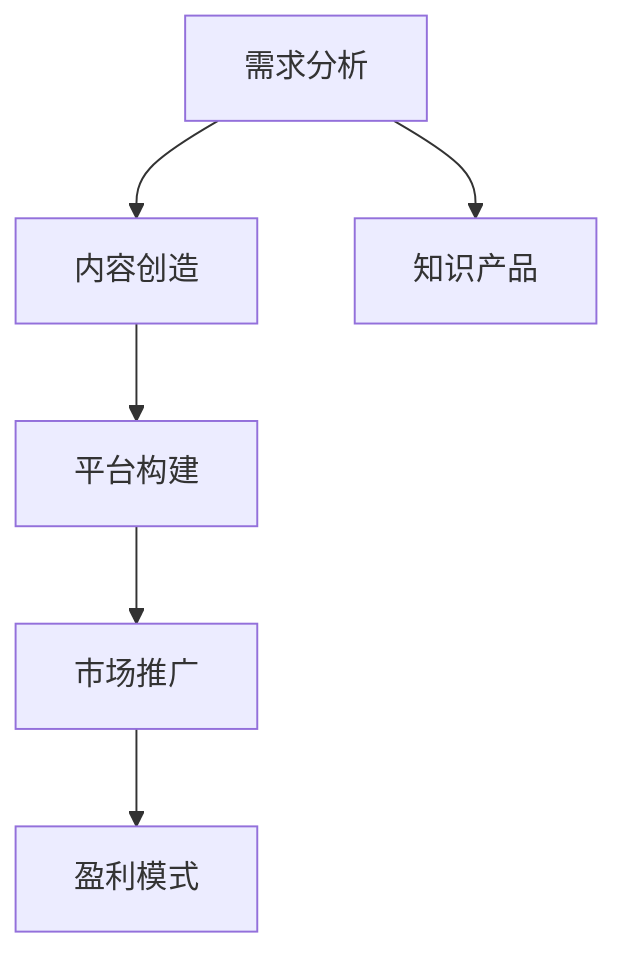

                 

## 1. 背景介绍

### 1.1 问题由来
在数字经济时代，程序员知识产品（如软件开源项目、技术博客、在线课程、编程书籍等）已成为IT行业的核心资源之一。优质的程序员知识产品不仅能帮助开发者提升技能，降低学习成本，还能显著提升生产效率，驱动企业创新发展。然而，如何打造高盈利性的程序员知识产品，仍是摆在很多开发者和公司面前的难题。

### 1.2 问题核心关键点
构建高盈利性程序员知识产品的关键在于：
- **需求导向**：深刻理解目标用户群体的需求，提供贴合实际应用场景的解决方案。
- **产品差异化**：通过产品设计和内容创新，使产品具有独特的卖点，与竞争对手区别开来。
- **用户体验**：以用户为中心，提供无缝、高效的交互体验，提升用户满意度和忠诚度。
- **市场定位**：明确产品在市场中的定位，针对性地进行营销推广，确保产品能够精准触达目标用户。
- **盈利模式**：设计合理的盈利模式，实现产品商业价值，确保长期可持续性发展。

### 1.3 问题研究意义
研发高盈利性程序员知识产品，对于IT行业的持续发展具有重要意义：
- **人才培养**：高质量的知识产品可以加速人才培养，提升整体技术水平。
- **行业创新**：推动行业新技术、新方法、新趋势的传播与实践。
- **企业竞争力**：增强企业在技术市场中的竞争力，提升品牌影响力。
- **生态构建**：通过知识产品的共享与交流，构建健康活跃的开发者社区。

## 2. 核心概念与联系

### 2.1 核心概念概述

在构建程序员知识产品的过程中，需要关注以下几个核心概念：

- **知识产品**：即包含专业知识和技能内容的IT产品，如软件开源项目、技术博客、在线课程、编程书籍等。
- **需求分析**：深入了解用户需求，包括技能需求、学习路径、使用场景等，为产品设计提供依据。
- **内容创造**：内容是知识产品的核心，需涵盖技术原理、实践技巧、案例分析、前沿趋势等。
- **平台构建**：构建合适的平台支持内容的呈现与交互，如网站、论坛、应用等。
- **市场推广**：通过线上线下多种渠道进行产品推广，扩大市场影响力。
- **盈利模式**：包括订阅制、广告、社区付费、企业合作等多种方式，确保产品可持续盈利。

### 2.2 核心概念原理和架构的 Mermaid 流程图



这个流程图展示了知识产品从需求分析到盈利模式的整体流程：

1. **需求分析**：基于用户反馈和市场调研，了解用户的需求。
2. **内容创造**：根据需求，策划并生产高质量内容。
3. **平台构建**：开发和部署支持内容呈现和互动的平台。
4. **市场推广**：通过多种渠道推广产品，吸引用户。
5. **盈利模式**：通过合理的商业模式，确保产品盈利。

## 3. 核心算法原理 & 具体操作步骤

### 3.1 算法原理概述

知识产品的构建涉及多方面知识和技能，包括但不限于需求分析、内容创造、平台构建和市场推广。其中，需求分析和内容创造是核心，平台构建和市场推广是辅助。下面将详细介绍这些关键环节的算法原理。

### 3.2 算法步骤详解

#### 3.2.1 需求分析

需求分析的核心在于：
- **数据收集**：通过问卷调查、用户反馈、竞品分析等方式收集用户需求信息。
- **数据分析**：利用数据分析工具（如Python、R、SQL等）处理和分析收集到的数据。
- **需求提取**：从数据分析结果中提取关键需求点，形成需求文档。

**具体步骤如下**：
1. 设计问卷调查，涵盖技术栈、学习需求、使用场景等关键问题。
2. 使用问卷工具（如SurveyMonkey、Google Forms等）发布问卷，收集用户反馈。
3. 利用数据分析工具对问卷结果进行统计分析，识别用户共性需求和个性化需求。
4. 整理分析结果，形成需求文档，指导后续内容创造。

#### 3.2.2 内容创造

内容创造是知识产品的核心部分，需注意：
- **内容规划**：制定详细的内容规划，包括章节、小节、案例等。
- **内容撰写**：按照规划进行内容撰写，确保内容质量。
- **内容审查**：邀请领域专家进行内容审查，保证内容准确性。

**具体步骤如下**：
1. 根据需求文档，制定详细的内容规划，包括技术栈、知识点、案例等。
2. 组织专业作者团队，按照规划撰写内容，确保内容全面、准确。
3. 邀请领域专家进行内容审查，修正错误，提高内容质量。
4. 定期更新内容，保证产品与时俱进。

#### 3.2.3 平台构建

平台构建的目的是：
- **用户交互**：提供友好、便捷的用户交互界面。
- **内容展示**：合理展示内容，提升用户体验。
- **功能拓展**：增加互动、讨论等功能，增强用户粘性。

**具体步骤如下**：
1. 选择合适的开发平台（如WordPress、React等），设计平台架构。
2. 开发平台功能，包括注册登录、内容展示、搜索过滤等。
3. 增加互动功能，如评论区、问答系统、直播授课等。
4. 进行平台测试，优化用户体验。

#### 3.2.4 市场推广

市场推广的目的是：
- **提升曝光**：通过多种渠道提升产品曝光率。
- **吸引用户**：吸引目标用户群体，提升用户注册和活跃度。
- **用户转化**：通过有效的营销手段，实现用户转化，增加收入。

**具体步骤如下**：
1. 选择合适的推广渠道，包括社交媒体、搜索引擎、邮件营销等。
2. 制定详细的推广计划，包括内容撰写、发布时间、推广预算等。
3. 进行推广活动，吸引目标用户，提高用户注册和活跃度。
4. 分析推广效果，调整推广策略，优化推广效果。

### 3.3 算法优缺点

构建知识产品的算法主要体现在需求分析和内容创造上，其优缺点如下：

**优点**：
1. **用户导向**：通过深入了解用户需求，能够提供更加贴合实际应用场景的解决方案。
2. **创新性强**：不断更新内容，确保产品具有前瞻性和创新性。
3. **灵活性高**：根据用户反馈及时调整产品策略，适应市场变化。

**缺点**：
1. **开发成本高**：需求分析和内容创造需要投入大量人力和时间。
2. **维护难度大**：产品内容需要不断更新，维护成本较高。
3. **市场竞争激烈**：面临来自其他知识产品的高强度竞争。

### 3.4 算法应用领域

知识产品的构建可以应用于多个领域，包括但不限于：

- **软件开发**：提供软件开发技术、框架、工具等内容。
- **数据科学**：提供数据处理、分析、可视化等知识。
- **云计算**：提供云计算技术、服务、部署等内容。
- **人工智能**：提供AI算法、模型、应用等内容。
- **游戏开发**：提供游戏开发技术、引擎、工具等内容。

## 4. 数学模型和公式 & 详细讲解 & 举例说明

### 4.1 数学模型构建

知识产品的构建涉及多个方面，包括用户需求分析、内容创造、平台构建和市场推广。我们可以使用数学模型来描述这些过程，并对其进行优化。

### 4.2 公式推导过程

#### 4.2.1 用户需求分析模型

用户需求分析模型可表示为：

$$
D = f(U, C, R)
$$

其中：
- $D$ 为用户需求，
- $U$ 为问卷调查结果，
- $C$ 为竞品分析结果，
- $R$ 为领域专家意见。

$$
D = \sum_{i=1}^n (U_i \times C_i) + R
$$

通过问卷调查和竞品分析，初步收集用户需求，再结合领域专家的意见进行整合，形成最终的用户需求。

#### 4.2.2 内容创造模型

内容创造模型可表示为：

$$
C = g(P, A, E)
$$

其中：
- $C$ 为内容，
- $P$ 为内容规划，
- $A$ 为内容撰写，
- $E$ 为内容审查。

$$
C = P \times A + E
$$

根据内容规划进行内容撰写，然后邀请领域专家进行内容审查，最终得到高质量的内容。

### 4.3 案例分析与讲解

**案例**：构建一个面向初学者的Python编程在线课程。

**需求分析**：
- 问卷调查结果显示，初学者最想学习Python基础语法、数据结构、面向对象编程等。
- 竞品分析发现，其他类似的课程集中在某个特定领域（如机器学习），缺乏综合性的课程。
- 领域专家提出，应注重Python在实际项目中的应用。

**内容规划**：
- 基础语法：包括Python基础、数据类型、变量、控制结构等。
- 数据结构：包括列表、字典、集合等。
- 面向对象编程：包括类、继承、多态等。
- 实际应用：包括Web开发、数据分析、机器学习等。

**内容撰写**：
- 邀请经验丰富的Python开发者撰写内容，确保内容准确、易懂。
- 使用Markdown格式编写内容，便于格式和内容的整理。
- 定期更新内容，补充新的知识点和技术趋势。

**内容审查**：
- 邀请领域专家进行内容审查，确保内容的正确性和权威性。
- 邀请社区成员参与审查，提升内容的可读性和互动性。

**平台构建**：
- 使用WordPress搭建课程平台，设计友好的用户界面。
- 增加互动功能，如评论区、直播授课、在线测验等。
- 优化平台性能，确保内容展示流畅、稳定。

**市场推广**：
- 通过社交媒体、搜索引擎、邮件营销等渠道推广课程。
- 制定详细的推广计划，包括内容撰写、发布时间、推广预算等。
- 分析推广效果，调整推广策略，优化推广效果。

## 5. 项目实践：代码实例和详细解释说明

### 5.1 开发环境搭建

在项目实践中，我们需要搭建相应的开发环境。以下是使用Python和Django框架搭建Python编程在线课程平台的流程：

1. 安装Python：从官网下载并安装Python，确保版本为3.8及以上。
2. 安装Django：通过命令行安装Django，命令为 `pip install django`。
3. 创建虚拟环境：使用`python -m venv env`创建虚拟环境，激活虚拟环境 `source env/bin/activate`。
4. 安装依赖库：通过`pip install -r requirements.txt`安装依赖库。

### 5.2 源代码详细实现

下面是一个简单的Python编程在线课程的Django应用代码示例：

```python
# settings.py
SECRET_KEY = 'your_secret_key'
DEBUG = True
ALLOWED_HOSTS = ['*']

# urls.py
from django.urls import path
from . import views

urlpatterns = [
    path('', views.index, name='index'),
    path('courses/<int:course_id>/', views.course, name='course'),
]

# views.py
from django.shortcuts import render
from .models import Course

def index(request):
    courses = Course.objects.all()
    return render(request, 'index.html', {'courses': courses})

def course(request, course_id):
    course = Course.objects.get(id=course_id)
    return render(request, 'course.html', {'course': course})
```

### 5.3 代码解读与分析

**index** 视图函数：
- 从数据库中获取所有课程，并渲染`index.html`页面。

**course** 视图函数：
- 根据课程ID从数据库中获取指定课程，并渲染`course.html`页面。

### 5.4 运行结果展示

运行以上代码，启动Django应用，在浏览器访问`http://localhost:8000`，即可展示所有课程。点击课程链接，即可访问课程详情页面。

## 6. 实际应用场景

### 6.1 软件开发

软件开发是知识产品的重要应用领域之一。高质量的软件开发教程可以帮助初学者快速上手，提升开发效率，加速技术创新。例如，“The Complete Web Developer's Course”系列课程，覆盖了HTML、CSS、JavaScript、React、Node.js等多个技术栈，已成为全球最受欢迎的在线课程之一。

### 6.2 数据科学

数据科学是另一个知识产品的重要应用领域。通过构建数据科学相关内容，帮助数据分析师和数据科学家掌握最新数据技术和方法。例如，“Python Data Science Handbook”一书，详细介绍了数据科学的基础知识和实践技能，深受开发者喜爱。

### 6.3 云计算

云计算技术不断迭代，构建云知识产品帮助IT运维人员掌握云技术。例如，“Mastering AWS Certified Solutions Architect”课程，涵盖AWS架构设计、云计算基础架构、云计算安全等多个主题，帮助开发者获得AWS认证，提升职业竞争力。

### 6.4 人工智能

AI技术发展迅速，AI知识产品帮助开发者掌握最新AI算法和技术。例如，“Deep Learning Specialization”系列课程，由Andrew Ng主讲，涵盖深度学习基础、神经网络、卷积神经网络、生成对抗网络等多个主题，已经成为AI领域最具影响力的课程之一。

## 7. 工具和资源推荐

### 7.1 学习资源推荐

为了帮助开发者系统掌握程序员知识产品的开发和推广技巧，以下是一些优质的学习资源：

1. **Django官方文档**：Django是Python Web应用开发的主流框架，官方文档详细介绍了Django的使用方法和最佳实践。
2. **Python编程实战**：由著名Python开发者写的书籍，涵盖Python基础、Web开发、数据科学、机器学习等多个主题。
3. **Google Cloud Platform**：谷歌提供的云服务开发文档，包括云计算、大数据、人工智能等多个领域。
4. **Coursera**：提供全球顶级大学的在线课程，涵盖计算机科学、数据科学、商业管理等多个领域。
5. **GitHub**：全球最大的开源代码托管平台，提供海量开源项目和学习资源。

### 7.2 开发工具推荐

高效的开发离不开优秀的工具支持。以下是几款用于程序员知识产品开发的常用工具：

1. **Django**：Python Web应用开发的主流框架，支持快速原型开发和项目部署。
2. **Jupyter Notebook**：支持数据科学和编程教育的互动式编程工具。
3. **Git**：版本控制系统，支持代码管理和协作开发。
4. **GitHub**：全球最大的代码托管平台，支持代码版本控制和项目管理。
5. **AWS**：亚马逊提供的云服务，支持多种开发和部署需求。

### 7.3 相关论文推荐

程序员知识产品的构建需要不断创新和优化，以下是几篇奠基性的相关论文，推荐阅读：

1. **"Deep Learning Specialization"**：Andrew Ng主讲，涵盖深度学习基础、神经网络、卷积神经网络、生成对抗网络等多个主题。
2. **"The Complete Web Developer's Course"**：包含HTML、CSS、JavaScript、React、Node.js等多个技术栈的全面课程。
3. **"Mastering AWS Certified Solutions Architect"**：涵盖AWS架构设计、云计算基础架构、云计算安全等多个主题的课程。
4. **"Python Data Science Handbook"**：详细介绍数据科学的基础知识和实践技能的书籍。

## 8. 总结：未来发展趋势与挑战

### 8.1 研究成果总结

构建程序员知识产品是一项系统性工程，涉及需求分析、内容创造、平台构建和市场推广等多个环节。通过深入研究，已得出以下结论：

1. **需求导向**：深刻理解用户需求，提供贴合实际应用场景的解决方案。
2. **内容创新**：不断更新内容，确保产品具有前瞻性和创新性。
3. **平台优化**：优化平台设计，提升用户体验。
4. **市场推广**：通过多种渠道提升产品曝光，吸引用户，实现用户转化。

### 8.2 未来发展趋势

程序员知识产品的未来发展趋势包括：

1. **技术融合**：知识产品将更加融合多种技术，如云计算、大数据、人工智能等。
2. **社区建设**：构建开放、活跃的开发者社区，促进知识共享和技术交流。
3. **个性化推荐**：通过推荐系统，推荐用户感兴趣的内容，提升用户粘性。
4. **元宇宙**：构建虚拟学习空间，实现沉浸式学习体验。
5. **教育结合**：知识产品将更加深入教育领域，实现教学相长。

### 8.3 面临的挑战

构建程序员知识产品面临诸多挑战，包括：

1. **内容质量**：如何保证内容质量，吸引和留住用户。
2. **市场竞争**：如何与其他知识产品竞争，提升市场影响力。
3. **平台维护**：如何维护平台稳定，提升用户体验。
4. **盈利模式**：如何设计合理的盈利模式，实现商业价值。
5. **法律法规**：如何遵循法律法规，保护用户隐私和知识产权。

### 8.4 研究展望

未来，程序员知识产品的研究将侧重于以下几个方向：

1. **人工智能**：引入AI技术，提高知识产品的个性化推荐和内容生成能力。
2. **区块链**：利用区块链技术，提升知识产品的可信度和安全性。
3. **交互设计**：设计更加友好的交互界面，提升用户交互体验。
4. **微服务架构**：采用微服务架构，提高知识产品的可扩展性和可维护性。
5. **多语言支持**：支持多种语言，拓展全球市场。

## 9. 附录：常见问题与解答

**Q1：如何确定知识产品的市场需求？**

A: 确定知识产品的市场需求需进行多渠道的数据收集和分析。具体步骤包括：
1. 设计问卷调查，涵盖用户需求、学习目标、使用场景等。
2. 通过问卷工具发布问卷，收集用户反馈。
3. 利用数据分析工具处理和分析问卷结果，识别用户共性需求和个性化需求。
4. 结合竞品分析，进一步明确市场需求。

**Q2：如何保证知识产品的质量？**

A: 保证知识产品质量需从内容、平台、运营等多方面进行优化。具体措施包括：
1. 内容规划：制定详细的内容规划，确保内容全面、准确。
2. 内容审查：邀请领域专家进行内容审查，修正错误，提升内容质量。
3. 平台优化：优化平台设计，提升用户体验。
4. 运营策略：通过有效的运营策略，提升用户粘性。

**Q3：知识产品的盈利模式有哪些？**

A: 知识产品的盈利模式包括：
1. 订阅制：用户支付固定费用，长期访问知识产品。
2. 广告：在知识产品中插入广告，赚取广告费。
3. 社区付费：社区成员支付费用，获得高级权益。
4. 企业合作：与企业合作，提供定制化解决方案。
5. 知识付费：通过知识付费平台，销售知识产品。

**Q4：如何设计知识产品的市场营销策略？**

A: 设计知识产品的市场营销策略需从多个渠道进行推广。具体措施包括：
1. 选择合适的推广渠道，如社交媒体、搜索引擎、邮件营销等。
2. 制定详细的推广计划，包括内容撰写、发布时间、推广预算等。
3. 进行推广活动，吸引目标用户，提高用户注册和活跃度。
4. 分析推广效果，调整推广策略，优化推广效果。

---

作者：禅与计算机程序设计艺术 / Zen and the Art of Computer Programming

