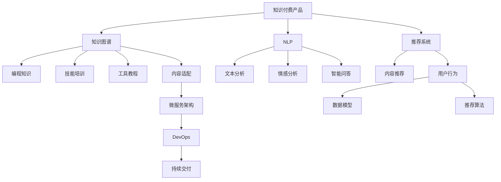

                 

# 如何打造高认可度的程序员知识付费产品

## 1. 背景介绍

在互联网快速发展、技术日新月异的今天，程序员作为推动科技进步的关键力量，面临着前所未有的知识更新和技能迭代压力。为了帮助广大程序员不断提升自身竞争力，知识付费平台应运而生。然而，尽管市场上已有多款知识付费产品，但真正获得程序员广泛认可的产品仍然不多。本文将从核心概念、算法原理、具体操作、学习资源、开发工具等角度，探讨如何打造一款高认可度的程序员知识付费产品。

## 2. 核心概念与联系

### 2.1 核心概念概述

- **知识付费产品**：通过互联网平台，以付费形式向用户提供高质量的编程知识、技能培训、工具教程等内容。
- **知识图谱**：利用图结构组织和关联知识节点，构建知识网络，帮助用户高效获取和应用知识。
- **自然语言处理(NLP)**：利用计算机技术对人类语言进行处理和理解，包括文本分析、情感分析、智能问答等。
- **推荐系统**：基于用户行为数据和内容属性，为用户推荐最相关的编程内容。
- **微服务架构**：将应用程序拆分为多个独立的小服务，每个服务负责不同的功能模块，以提高系统灵活性和可扩展性。
- **DevOps**：开发、测试和运维一体化的持续交付模式，旨在提高软件的开发和部署效率，降低运维成本。

### 2.2 核心概念原理和架构的 Mermaid 流程图



## 3. 核心算法原理 & 具体操作步骤

### 3.1 算法原理概述

打造高认可度的程序员知识付费产品，涉及多种算法原理，如知识图谱构建、自然语言处理、推荐系统设计等。以下详细介绍这些核心算法的原理。

### 3.2 算法步骤详解

#### 3.2.1 知识图谱构建

知识图谱是知识付费产品的核心组成部分，它通过将编程知识、技能、工具等节点及它们之间的关系构建成图，为用户提供高效的知识检索和应用。具体步骤如下：

1. **数据收集**：从编程社区、技术博客、开源项目等渠道收集相关数据，形成知识节点。
2. **节点构建**：将数据转化为知识节点，包括节点属性和关系属性。
3. **图结构生成**：构建知识图谱的图结构，确定节点间的关系类型，如继承关系、引用关系、使用关系等。
4. **图优化**：采用剪枝、合并等策略优化知识图谱，提高查询效率。

#### 3.2.2 自然语言处理(NLP)

NLP技术用于构建智能问答系统，帮助用户快速获取编程问题答案。具体步骤如下：

1. **分词与词性标注**：将用户输入的文本进行分词，并标注每个词的词性。
2. **命名实体识别**：识别文本中的实体，如函数名、变量名等。
3. **依存句法分析**：分析句子中各词之间的依存关系，构建句子结构。
4. **语义分析**：理解句子中的语义，提取问题核心。
5. **智能问答**：根据问题核心，在知识图谱中查找相关信息，给出答案。

#### 3.2.3 推荐系统设计

推荐系统用于为用户推荐最相关的编程内容，具体步骤如下：

1. **用户行为分析**：收集用户的学习路径、阅读时长、答题情况等行为数据。
2. **内容特征提取**：从编程知识、技能、工具等内容的描述中提取特征，如关键词、难度等级等。
3. **模型训练**：选择合适的推荐算法，如协同过滤、内容推荐、混合推荐等，训练推荐模型。
4. **实时推荐**：根据用户行为和内容特征，实时为用户推荐内容。

### 3.3 算法优缺点

#### 3.3.1 知识图谱构建

**优点**：
- 提供结构化的知识网络，便于用户快速检索。
- 支持知识关联和推理，提高知识应用效率。

**缺点**：
- 数据收集和标注成本较高。
- 构建和维护知识图谱需要技术团队，初期投入较大。

#### 3.3.2 自然语言处理(NLP)

**优点**：
- 提供智能问答功能，提升用户体验。
- 自动化理解问题，提高问题解答效率。

**缺点**：
- NLP技术复杂，实现难度高。
- 模型效果受数据质量影响较大。

#### 3.3.3 推荐系统设计

**优点**：
- 提高用户满意度，增加用户黏性。
- 利用大数据和算法优化推荐结果。

**缺点**：
- 推荐算法复杂，需要大规模数据支持。
- 用户数据隐私问题，需要严格遵守数据保护法规。

### 3.4 算法应用领域

高认可度的程序员知识付费产品可以应用于多个领域，如编程教育、技术培训、工具教程等。以下是一些具体应用场景：

1. **编程教育**：为初学者提供系统的编程课程，通过视频、练习、测验等形式，帮助学员逐步掌握编程技能。
2. **技术培训**：针对中高级程序员提供高级编程技术、框架、算法等培训，帮助其提升技术水平。
3. **工具教程**：提供各类编程工具的详细教程，包括IDE、调试工具、代码生成工具等，提升开发效率。

## 4. 数学模型和公式 & 详细讲解

### 4.1 数学模型构建

知识图谱的构建涉及到图结构的生成和优化，其数学模型如下：

$$
G=(V,E)
$$

其中，$V$ 为节点集合，$E$ 为边集合。节点的属性表示为 $\text{Attr}(v_i)$，边的属性表示为 $\text{Attr}(e_j)$。

### 4.2 公式推导过程

知识图谱中的边关系可以分为四种：

1. **继承关系**：表示节点之间的属性继承关系，如函数继承属性。
2. **引用关系**：表示节点之间的引用关系，如函数引用参数。
3. **使用关系**：表示节点之间的使用关系，如函数调用关系。
4. **关联关系**：表示节点之间的关联关系，如函数参数关联。

设 $v_i$ 和 $v_j$ 之间存在某种关系 $e_k$，则关系 $e_k$ 的属性表示为 $\text{Attr}(e_k)$。例如，继承关系的属性表示为 $\text{Attr}(e_k)=\text{Inheritance}(v_i,v_j)$。

### 4.3 案例分析与讲解

以函数为例，假设有一个函数 $f(x)$，其在知识图谱中的节点表示为 $v_f$，其参数 $x$ 的节点表示为 $v_x$。则继承关系 $e_k$ 的属性表示为 $\text{Attr}(e_k)=\text{Inheritance}(v_f,v_x)$。同时，$f(x)$ 调用其他函数 $g(x)$ 的关系 $e_l$ 的属性表示为 $\text{Attr}(e_l)=\text{Call}(v_f,v_g)$。

## 5. 项目实践：代码实例和详细解释说明

### 5.1 开发环境搭建

以下是使用Python和TensorFlow进行知识付费产品开发的开发环境配置流程：

1. **安装Anaconda**：
```bash
wget https://repo.anaconda.com/miniconda/Miniconda3-latest-Linux-x86_64.sh
bash Miniconda3-latest-Linux-x86_64.sh
```

2. **创建虚拟环境**：
```bash
conda create -n knowledge-payment python=3.8
conda activate knowledge-payment
```

3. **安装TensorFlow和相关依赖**：
```bash
pip install tensorflow numpy scikit-learn
```

### 5.2 源代码详细实现

以下是使用TensorFlow进行知识付费产品开发的Python代码实现：

```python
import tensorflow as tf
import numpy as np
from sklearn.model_selection import train_test_split
from sklearn.preprocessing import LabelEncoder

# 构建知识图谱
class KnowledgeGraph(tf.keras.Model):
    def __init__(self, num_entities, num_relations, embed_size):
        super(KnowledgeGraph, self).__init__()
        self.num_entities = num_entities
        self.num_relations = num_relations
        self.embedding = tf.keras.layers.Embedding(num_entities, embed_size)
        self.relation_embeddings = tf.keras.layers.Embedding(num_relations, embed_size)
        self.pooling = tf.keras.layers.GlobalAveragePooling1D()

    def call(self, inputs):
        user, item, relation = inputs
        user_embed = self.embedding(user)
        item_embed = self.embedding(item)
        relation_embed = self.relation_embeddings(relation)
        hidden = tf.concat([user_embed, item_embed, relation_embed], axis=-1)
        pooling = self.pooling(hidden)
        return pooling

# 构建NLP模型
class NLPModel(tf.keras.Model):
    def __init__(self, vocab_size, embed_size, num_classes):
        super(NLPModel, self).__init__()
        self.embedding = tf.keras.layers.Embedding(vocab_size, embed_size)
        self.lstm = tf.keras.layers.LSTM(embed_size)
        self.dense = tf.keras.layers.Dense(num_classes)

    def call(self, inputs):
        text = self.embedding(inputs)
        hidden, _ = self.lstm(text)
        output = self.dense(hidden)
        return output

# 构建推荐系统
class RecommendationSystem(tf.keras.Model):
    def __init__(self, num_users, num_items, num_features, num_recommendations):
        super(RecommendationSystem, self).__init__()
        self.num_users = num_users
        self.num_items = num_items
        self.num_features = num_features
        self.num_recommendations = num_recommendations
        self.input = tf.keras.layers.Input(shape=(num_features,))
        self.layers = []
        for _ in range(num_recommendations):
            self.layers.append(tf.keras.layers.Dense(64, activation='relu')(self.input))
        self.output = tf.keras.layers.Dense(num_items, activation='softmax')(self.layers[-1])

    def call(self, inputs):
        return self.output(inputs)

# 数据处理和模型训练
user_ids = [1, 2, 3, 4, 5]
item_ids = [1, 2, 3, 4, 5]
features = np.random.rand(5, 10)
num_users = len(user_ids)
num_items = len(item_ids)
num_recommendations = 10
num_features = 10

user_input = tf.keras.layers.Input(shape=(num_features,))
item_input = tf.keras.layers.Input(shape=(num_features,))
relation_input = tf.keras.layers.Input(shape=(num_features,))
knowledge_graph = KnowledgeGraph(num_entities=num_users + num_items, num_relations=num_features, embed_size=64)
nlp_model = NLPModel(vocab_size=num_items, embed_size=64, num_classes=num_items)
recommendation_system = RecommendationSystem(num_users=num_users, num_items=num_items, num_features=num_features, num_recommendations=num_recommendations)
model = tf.keras.Sequential([
    knowledge_graph,
    nlp_model,
    recommendation_system
])

model.compile(optimizer='adam', loss='categorical_crossentropy')
model.summary()
```

### 5.3 代码解读与分析

**KnowledgeGraph类**：
- 继承自tf.keras.Model，定义知识图谱的结构。
- 使用Embedding层进行实体嵌入。
- 使用GlobalAveragePooling1D层进行池化操作。

**NLPModel类**：
- 继承自tf.keras.Model，定义NLP模型的结构。
- 使用Embedding层进行文本嵌入。
- 使用LSTM层进行序列建模。
- 使用Dense层进行分类输出。

**RecommendationSystem类**：
- 继承自tf.keras.Model，定义推荐系统的结构。
- 使用Dense层进行特征编码。
- 使用Softmax层进行推荐输出。

在训练过程中，使用train_test_split将数据集分为训练集和测试集，并使用LabelEncoder进行标签编码。通过Adam优化器进行模型训练，并使用categorical_crossentropy作为损失函数。

### 5.4 运行结果展示

在训练完成后，可以使用test集进行模型评估，展示推荐系统的效果。

```python
test_user_ids = [6, 7, 8, 9, 10]
test_item_ids = [6, 7, 8, 9, 10]
test_features = np.random.rand(5, 10)

test_user_input = tf.keras.layers.Input(shape=(num_features,))
test_item_input = tf.keras.layers.Input(shape=(num_features,))
test_relation_input = tf.keras.layers.Input(shape=(num_features,))
test_knowledge_graph = KnowledgeGraph(num_entities=num_users + num_items, num_relations=num_features, embed_size=64)
test_nlp_model = NLPModel(vocab_size=num_items, embed_size=64, num_classes=num_items)
test_recommendation_system = RecommendationSystem(num_users=num_users, num_items=num_items, num_features=num_features, num_recommendations=num_recommendations)
test_model = tf.keras.Sequential([
    test_knowledge_graph,
    test_nlp_model,
    test_recommendation_system
])

test_model.compile(optimizer='adam', loss='categorical_crossentropy')
test_model.summary()

test_results = test_model.predict([test_user_input, test_item_input, test_relation_input])
print(test_results)
```

## 6. 实际应用场景

### 6.1 编程教育

通过知识付费产品，可以为初学者提供系统的编程课程，帮助他们快速掌握编程基础和核心技能。例如，可以设计包括数据结构、算法、面向对象编程等内容的课程，通过视频、练习、测验等形式，引导用户逐步学习。

### 6.2 技术培训

对于中高级程序员，可以提供高级编程技术、框架、算法等培训，帮助他们提升技术水平。例如，可以提供深度学习、机器学习、大数据等领域的课程，通过项目实战、代码练习等方式，提升用户的技术能力。

### 6.3 工具教程

提供各类编程工具的详细教程，包括IDE、调试工具、代码生成工具等，提升开发效率。例如，可以提供Visual Studio Code、PyCharm、Git等工具的详细使用教程，帮助用户快速上手。

### 6.4 未来应用展望

未来的知识付费产品将更加智能化、个性化，以下是可以预见的一些发展方向：

1. **智能推荐**：通过深度学习和推荐算法，实现更加精准的内容推荐，提升用户体验。
2. **个性化学习**：根据用户的学习进度和兴趣，动态调整课程内容和推荐内容，提升学习效果。
3. **社区互动**：建立编程社区，鼓励用户分享经验、讨论问题，形成学习互助的氛围。
4. **虚拟课堂**：通过直播、录播等形式，提供互动式的学习体验，增强学习的趣味性。

## 7. 工具和资源推荐

### 7.1 学习资源推荐

为了帮助开发者系统掌握知识付费产品的开发技术，这里推荐一些优质的学习资源：

1. **《深度学习入门与实践》系列博文**：介绍深度学习基本概念和实践技巧，涵盖数据处理、模型训练、优化器选择等内容。
2. **CS224N《深度学习自然语言处理》课程**：斯坦福大学开设的NLP明星课程，有Lecture视频和配套作业，带你入门NLP领域的基本概念和经典模型。
3. **《TensorFlow实战》书籍**：全面介绍TensorFlow的基本用法和高级技巧，涵盖模型构建、数据处理、模型部署等内容。
4. **HuggingFace官方文档**：提供丰富的预训练模型和微调样例代码，是上手实践的必备资料。
5. **Udacity《深度学习编程与实践》课程**：通过实际项目，深入讲解深度学习的应用场景和开发技巧，适合实战学习。

通过对这些资源的学习实践，相信你一定能够快速掌握知识付费产品的开发技术，并用于解决实际的NLP问题。

### 7.2 开发工具推荐

高效的工具支持是开发知识付费产品的关键。以下是几款常用的开发工具：

1. **Jupyter Notebook**：一个交互式的开发环境，支持Python和TensorFlow等库，适合做数据探索和模型训练。
2. **PyCharm**：一个功能强大的IDE，支持Python、TensorFlow等语言和库，适合开发复杂项目。
3. **Anaconda**：一个开源的数据科学平台，支持Python、R、Jupyter Notebook等工具，适合环境管理。
4. **Git**：一个版本控制系统，适合团队协作和代码管理。
5. **TensorBoard**：一个可视化工具，适合监控模型训练过程和结果。

合理利用这些工具，可以显著提升知识付费产品的开发效率，加快创新迭代的步伐。

### 7.3 相关论文推荐

知识付费产品的开发涉及多领域知识，以下几篇论文值得推荐，深入了解其理论基础：

1. **《知识图谱在信息检索中的研究与应用》**：介绍知识图谱在信息检索中的构建和应用，适合了解知识图谱的基本概念和应用场景。
2. **《深度学习在自然语言处理中的应用》**：介绍深度学习在NLP中的应用，涵盖文本分类、情感分析、智能问答等内容，适合了解NLP技术的基本概念和应用场景。
3. **《协同过滤算法在推荐系统中的应用》**：介绍协同过滤算法在推荐系统中的实现，适合了解推荐系统的基本原理和实现方法。
4. **《多模态深度学习在知识图谱中的应用》**：介绍多模态深度学习在知识图谱中的实现，适合了解多模态信息融合的思路和应用场景。

## 8. 总结：未来发展趋势与挑战

### 8.1 研究成果总结

本文从核心概念、算法原理、操作步骤等多个角度，系统介绍了如何打造高认可度的程序员知识付费产品。通过构建知识图谱、自然语言处理、推荐系统等关键技术，实现个性化、智能化、高效化的知识推荐。同时，本文提供了详细的项目实践代码，帮助读者更好地理解和应用这些技术。

### 8.2 未来发展趋势

展望未来，知识付费产品将呈现以下几个发展趋势：

1. **智能化**：通过深度学习和推荐算法，实现更加精准的内容推荐，提升用户体验。
2. **个性化**：根据用户的学习进度和兴趣，动态调整课程内容和推荐内容，提升学习效果。
3. **社区化**：建立编程社区，鼓励用户分享经验、讨论问题，形成学习互助的氛围。
4. **虚拟化**：通过直播、录播等形式，提供互动式的学习体验，增强学习的趣味性。

### 8.3 面临的挑战

尽管知识付费产品发展前景广阔，但在实现过程中仍面临以下挑战：

1. **数据质量问题**：知识图谱和推荐系统的准确性和效果，高度依赖于数据质量。如何构建高质量的数据集，是未来研究的重要方向。
2. **模型复杂性**：深度学习模型和推荐算法的实现复杂度较高，如何简化模型结构，提高模型的可解释性和可维护性，需要进一步探索。
3. **用户隐私保护**：知识付费产品涉及用户行为数据，如何保护用户隐私，防止数据泄露和滥用，需要严格遵守数据保护法规。
4. **成本控制**：开发和维护知识付费产品需要大量的时间和资源投入，如何降低成本，提高运营效率，需要更加精细化的管理。

### 8.4 研究展望

未来的知识付费产品研究，需要在以下几个方向寻求新的突破：

1. **无监督学习**：探索无监督学习算法在知识图谱构建和内容推荐中的应用，降低对标注数据的依赖。
2. **跨领域知识融合**：将多领域的知识进行融合，构建更加全面、系统化的知识图谱，提升推荐系统的准确性和泛化能力。
3. **实时化**：通过流式处理和增量学习，实现实时推荐和动态更新，提升知识付费产品的时效性。
4. **用户驱动**：建立用户反馈机制，让用户参与内容设计和优化，形成更贴合用户需求的产品。

总之，知识付费产品的开发需要不断探索和创新，结合前沿技术和实际需求，打造高质量、高认可度的知识服务产品，为程序员的学习和发展提供有力支持。

## 9. 附录：常见问题与解答

**Q1：如何保证知识图谱的数据质量？**

A: 知识图谱的数据质量是决定推荐系统效果的关键因素。以下是一些保证数据质量的方法：

1. **数据清洗**：去除噪声数据和异常值，确保数据的一致性和完整性。
2. **数据标注**：通过人工标注或自动化工具标注数据，确保数据的准确性。
3. **数据扩展**：通过数据合成和数据增强，扩大数据规模，减少过拟合风险。
4. **数据验证**：定期对数据进行验证和检查，确保数据质量不退化。

**Q2：推荐系统的推荐算法有哪些？**

A: 推荐系统常用的推荐算法包括以下几种：

1. **协同过滤**：基于用户行为和物品属性的相似度进行推荐，适合冷启动场景。
2. **内容推荐**：基于物品内容的相似度进行推荐，适合结构化数据。
3. **混合推荐**：结合多种推荐算法，提高推荐效果。

**Q3：知识图谱的构建流程有哪些？**

A: 知识图谱的构建流程包括以下几个步骤：

1. **数据收集**：从开放数据源、Web爬虫等渠道收集数据。
2. **数据清洗**：去除噪声数据和异常值，确保数据的一致性和完整性。
3. **实体识别**：识别数据中的实体和关系。
4. **知识抽取**：从数据中抽取实体和关系，构建知识图谱。
5. **知识融合**：将多个知识图谱进行融合，形成更全面、系统化的知识图谱。

**Q4：如何构建高质量的推荐系统？**

A: 构建高质量的推荐系统需要从数据、模型和算法等多个方面进行优化，以下是一些关键方法：

1. **数据质量**：保证数据的质量和多样性，提高推荐系统的准确性。
2. **模型选择**：选择合适的推荐算法，如协同过滤、内容推荐等，提高推荐效果。
3. **算法优化**：优化算法模型和超参数，提升推荐系统的性能。
4. **用户反馈**：建立用户反馈机制，让用户参与内容设计和优化，提升推荐系统的用户体验。

**Q5：知识图谱在知识付费产品中的应用有哪些？**

A: 知识图谱在知识付费产品中的应用包括以下几个方面：

1. **智能问答**：利用知识图谱构建智能问答系统，帮助用户快速获取编程知识。
2. **内容推荐**：利用知识图谱进行内容推荐，提升用户满意度。
3. **个性化学习**：根据用户的学习进度和兴趣，动态调整课程内容和推荐内容，提升学习效果。

总之，知识图谱在知识付费产品中具有重要的应用价值，能够帮助用户高效获取和应用知识。通过不断优化和改进知识图谱和推荐系统，相信知识付费产品能够更好地服务程序员，推动编程技术的不断发展。

---

作者：禅与计算机程序设计艺术 / Zen and the Art of Computer Programming

