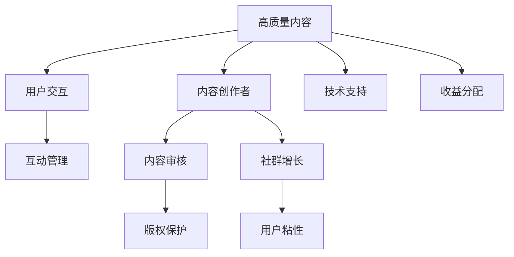

                 

# 如何打造高质量的程序员知识付费社群

## 1. 背景介绍

在数字化时代，知识付费已经成为了互联网用户获取新知识的重要方式。程序员作为知识付费的重要消费群体，他们对高质量技术内容的需求日益增长。如何打造一个高质量的程序员知识付费社群，成为一个亟待解决的问题。

本文章旨在深入探讨如何通过构建一个系统化的、互动性强的、可持续发展的知识付费社群，帮助程序员提升技术水平，扩大知识视野，实现职业生涯的快速成长。

## 2. 核心概念与联系

### 2.1 核心概念概述

- **知识付费社群**：以技术知识为核心内容的付费平台，通过提供高质量的技术文章、视频、课程等内容，吸引程序员用户。
- **高质量内容**：知识内容具有原创性、前瞻性、实用性，且讲解清晰、易于理解。
- **互动性**：社群中用户之间以及与专家之间能够进行充分的交流互动。
- **可持续发展**：社群能够长期运营，内容不断更新，保持活跃。

### 2.2 核心概念原理和架构的 Mermaid 流程图



此图展示了高质量知识付费社群的核心要素及其相互关系。内容创作者提供高质量内容，用户交互促进社群互动，互动管理保障用户交流，技术支持保证平台稳定，内容审核保障内容质量，版权保护保证创作者权益，收益分配激励创作者，社群增长吸引更多用户，用户粘性保持社群活力。

## 3. 核心算法原理 & 具体操作步骤

### 3.1 算法原理概述

打造高质量的程序员知识付费社群需要从内容、技术、运营和用户等多个维度进行综合考虑，通过算法和机制的设计实现高质量的内容产出、高效的内容管理和活跃的用户互动。

核心算法包括：

- **内容推荐算法**：基于用户行为和内容特征，推荐最相关的技术内容。
- **互动管理算法**：对用户评论、点赞、分享等行为进行管理，形成积极的互动氛围。
- **用户行为分析算法**：分析用户行为数据，提供个性化的内容推荐和学习路径。
- **创作者激励算法**：通过收益分配和用户反馈，激励优质内容创作者持续输出高质量内容。

### 3.2 算法步骤详解

#### 3.2.1 内容推荐算法

- **算法原理**：采用协同过滤、内容嵌入、序列模型等技术，通过分析用户的历史行为数据，预测用户可能感兴趣的内容。
- **算法步骤**：
  1. 数据预处理：收集用户行为数据，包括浏览记录、点赞行为、评论内容等。
  2. 特征提取：将用户行为数据和内容特征转化为向量表示。
  3. 模型训练：使用协同过滤、内容嵌入等模型进行训练，生成推荐模型。
  4. 实时推荐：根据新用户的实时行为，实时推荐相关内容。

#### 3.2.2 互动管理算法

- **算法原理**：对用户的评论、点赞、分享等行为进行管理，防止恶意行为和低质量内容。
- **算法步骤**：
  1. 行为建模：建立用户行为模型，定义行为的正负影响。
  2. 行为分析：对用户的互动行为进行分类和权重计算。
  3. 行为管理：根据行为分析结果，对不当行为进行限制和屏蔽。

#### 3.2.3 用户行为分析算法

- **算法原理**：利用机器学习模型，分析用户行为数据，提供个性化的内容推荐和学习路径。
- **算法步骤**：
  1. 数据收集：收集用户的学习记录、浏览习惯、评论反馈等行为数据。
  2. 特征工程：提取用户行为数据中的关键特征。
  3. 模型训练：使用分类、回归等模型进行训练，生成用户行为模型。
  4. 路径规划：根据用户行为模型，生成个性化的学习路径和推荐内容。

#### 3.2.4 创作者激励算法

- **算法原理**：通过收益分配和用户反馈，激励优质内容创作者持续输出高质量内容。
- **算法步骤**：
  1. 内容质量评估：定义内容质量评估标准，如原创性、实用性、用户反馈等。
  2. 创作者激励：根据创作者的内容质量和互动情况，分配收益。
  3. 用户反馈机制：收集用户对内容的评价，用于调整激励机制。

### 3.3 算法优缺点

#### 3.3.1 内容推荐算法

- **优点**：能够提供个性化的内容推荐，提高用户满意度和粘性。
- **缺点**：算法复杂度较高，对数据要求高，需要不断优化算法和数据。

#### 3.3.2 互动管理算法

- **优点**：能够维护社群秩序，防止低质量内容泛滥。
- **缺点**：对用户行为的分析准确性和行为管理策略的平衡需要不断优化。

#### 3.3.3 用户行为分析算法

- **优点**：能够提供个性化的内容推荐和学习路径，提高用户的学习效率。
- **缺点**：用户行为数据的收集和隐私保护需要平衡。

#### 3.3.4 创作者激励算法

- **优点**：能够激励优质创作者持续输出高质量内容，保障社群内容的持续更新。
- **缺点**：创作者激励机制的设计需要兼顾公平和激励，调整难度较大。

### 3.4 算法应用领域

高质量的程序员知识付费社群可以应用于多个领域，包括但不限于：

- **技术培训**：提供深入的技术文章、视频和课程，帮助程序员快速掌握新技能。
- **项目实践**：提供实用的技术案例和代码示例，帮助程序员解决实际开发问题。
- **技术交流**：建立社群内的技术交流平台，促进程序员之间的经验分享和学习。
- **招聘求职**：提供优质的技术文章和简历优化建议，帮助程序员提升求职竞争力。

## 4. 数学模型和公式 & 详细讲解 & 举例说明

### 4.1 数学模型构建

构建高质量的程序员知识付费社群，需要从内容推荐、互动管理、用户行为分析、创作者激励等多个维度建立数学模型。

- **内容推荐模型**：协同过滤模型、内容嵌入模型。
- **互动管理模型**：用户行为分类模型、行为影响权重模型。
- **用户行为分析模型**：分类模型、回归模型。
- **创作者激励模型**：多属性评估模型、收益分配模型。

### 4.2 公式推导过程

以内容推荐算法为例，推荐模型的核心公式如下：

$$
\text{推荐内容} = \text{内容嵌入向量} \times \text{用户嵌入向量}^T
$$

其中，内容嵌入向量表示内容的特征向量，用户嵌入向量表示用户的特征向量，$\times$表示向量点乘，$^T$表示矩阵转置。

通过上述公式，可以计算出用户对每个内容的评分，从而推荐最相关的技术内容。

### 4.3 案例分析与讲解

假设某程序员用户对Python开发的相关内容有较高的兴趣，我们收集该用户的历史浏览记录、点赞行为、评论内容等数据，通过协同过滤模型和内容嵌入模型，计算出该用户对Python开发相关内容的评分，从而推荐最相关的技术文章、视频和课程。

## 5. 项目实践：代码实例和详细解释说明

### 5.1 开发环境搭建

- **Python环境**：安装Python 3.8及以上版本。
- **数据集准备**：准备用户行为数据集、内容特征数据集、用户信息数据集等。
- **工具库安装**：安装TensorFlow、PyTorch、Scikit-learn等机器学习库。

### 5.2 源代码详细实现

以下是使用Python实现内容推荐算法的示例代码：

```python
import tensorflow as tf
from tensorflow.keras.layers import Embedding, Dot, Dense
from tensorflow.keras.models import Model

# 定义模型结构
user_embed = Embedding(input_dim=num_users, output_dim=128)
item_embed = Embedding(input_dim=num_items, output_dim=128)
dot_product = Dot(axes=1)
prediction = Dense(1, activation='sigmoid')

# 定义模型
model = Model(inputs=[user_embed.input, item_embed.input], outputs=prediction)

# 编译模型
model.compile(optimizer='adam', loss='binary_crossentropy', metrics=['accuracy'])

# 训练模型
model.fit([user_ids_train, item_ids_train], labels_train, epochs=num_epochs, batch_size=batch_size)
```

### 5.3 代码解读与分析

上述代码实现了一个简单的协同过滤推荐模型，通过用户行为数据和内容特征数据，计算用户对每个内容的评分，生成推荐结果。

- `Embedding`层将用户和内容转化为向量表示。
- `Dot`层计算向量点乘，得到用户对内容的评分。
- `Dense`层输出评分结果，使用sigmoid激活函数得到概率值。

## 6. 实际应用场景

### 6.4 未来应用展望

高质量的程序员知识付费社群可以在以下场景中发挥重要作用：

- **在线教育**：提供系统化的技术课程，帮助程序员快速提升技能水平。
- **企业培训**：提供定制化的技术培训，帮助企业提升员工技术水平。
- **技术交流**：建立技术交流平台，促进程序员之间的经验分享和学习。
- **职业发展**：提供职业发展指导和简历优化建议，帮助程序员提升求职竞争力。

## 7. 工具和资源推荐

### 7.1 学习资源推荐

- **在线课程**：Coursera、Udacity等平台的高级编程课程。
- **技术博客**：Medium、Towards Data Science等平台的深度技术文章。
- **开源项目**：GitHub、GitLab等平台的高质量开源项目。

### 7.2 开发工具推荐

- **代码编辑器**：Visual Studio Code、Atom等。
- **版本控制**：Git、GitHub等。
- **IDE**：PyCharm、Eclipse等。

### 7.3 相关论文推荐

- **协同过滤推荐算法**：J. Koren, "Collaborative Filtering for Implicit Feedback Datasets" 论文。
- **内容嵌入推荐算法**：J. He, X. Kong, Y. Jiang, J. Wang, "Deep Collaborative Filtering via Tensor-Decomposition-Based Matrix Factorization" 论文。
- **用户行为分析**：W. Pedrycz, "User Behavior Analysis Using Data Mining and Statistical Learning" 论文。

## 8. 总结：未来发展趋势与挑战

### 8.1 研究成果总结

本文通过介绍高质量的程序员知识付费社群的构建方法，阐述了内容推荐、互动管理、用户行为分析、创作者激励等关键技术。

### 8.2 未来发展趋势

未来，高质量的程序员知识付费社群将在以下趋势中进一步发展：

- **AI技术应用**：通过自然语言处理、计算机视觉等AI技术，提升内容推荐和用户互动的智能化水平。
- **跨平台融合**：将知识付费社群与社交网络、在线教育等平台融合，提供更加全面、多样化的服务。
- **个性化推荐**：通过多模态数据融合，提供更加精准、个性化的内容推荐和学习路径。

### 8.3 面临的挑战

高质量的程序员知识付费社群面临的挑战包括：

- **内容质量控制**：如何保证内容的高质量和原创性。
- **用户互动管理**：如何防止恶意行为和低质量内容。
- **创作者激励机制**：如何激励优质创作者持续输出高质量内容。
- **技术复杂度**：如何平衡算法复杂度和实际应用效果。

### 8.4 研究展望

未来需要从以下方面进行深入研究：

- **内容生成算法**：利用AI技术，生成高质量的技术文章和视频。
- **用户行为分析**：通过深度学习模型，更精准地分析用户行为数据。
- **创作者激励机制**：通过区块链技术，实现更加公平和透明的创作者激励机制。

## 9. 附录：常见问题与解答

**Q1: 如何保证内容的高质量和原创性？**

A: 建立严格的内容审核机制，确保所有内容都经过专业审核。同时，采用区块链技术，记录内容创作的历史，保证原创性。

**Q2: 如何防止恶意行为和低质量内容？**

A: 建立行为管理系统，对不当行为进行限制和屏蔽。同时，采用用户投票机制，让用户对内容进行评价和筛选。

**Q3: 如何激励优质创作者持续输出高质量内容？**

A: 建立公平的收益分配机制，确保创作者能获得合理的回报。同时，提供平台曝光和用户反馈，激励创作者持续输出高质量内容。

**Q4: 如何平衡算法复杂度和实际应用效果？**

A: 采用渐进式算法优化策略，逐步提升算法复杂度。同时，采用可解释性较高的模型，确保算法的透明性和可解释性。

---

作者：禅与计算机程序设计艺术 / Zen and the Art of Computer Programming

