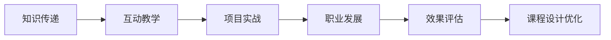

                 

## 1. 背景介绍

### 1.1 问题由来

在现代软件开发中，技术的快速迭代和更新要求程序员具备不断学习和适应新技能的能力。面对不断涌现的新技术和编程范式，传统教育方法往往无法满足需求，程序员需要不断提升自身的技能。随着在线教育平台和自我驱动学习的兴起，越来越多的程序员通过在线课程进行学习。然而，高昂的课程费用、冗长的学习时间、缺乏互动等缺点，使得这些课程的实际效果大打折扣。如何打造高转换率的程序员知识课程，成为一个迫切需要解决的问题。

### 1.2 问题核心关键点

本节将探讨如何打造高转换率的程序员知识课程，核心关注以下关键点：

- **课程设计**：如何设计课程内容使其能够真正满足程序员的学习需求？
- **互动教学**：如何通过互动手段提高学员的参与度和学习效率？
- **项目实战**：如何通过实际项目实践，帮助学员将知识应用于实际工作中？
- **职业发展**：如何结合学员的职业发展需求，提供针对性的指导和建议？
- **效果评估**：如何科学地评估课程效果，不断优化课程设计？

本文将从这些关键点出发，深入探讨如何打造高转换率的程序员知识课程。

## 2. 核心概念与联系

### 2.1 核心概念概述

为更好地理解如何打造高转换率的程序员知识课程，本节将介绍几个核心概念：

- **知识传递**：通过课程传授新知识，帮助学员掌握新技能。
- **互动教学**：通过问答、讨论、协作等方式，增加学员与讲师之间的互动，提升学习效果。
- **项目实战**：通过实际项目实践，帮助学员将理论知识转化为实际操作能力。
- **职业发展**：结合学员的职业目标，提供职业规划和技能提升指导。
- **效果评估**：通过科学的方法评估课程效果，持续改进课程设计。

这些核心概念共同构成了程序员知识课程的设计框架，旨在通过科学有效的课程设计，最大化地提升学员的学习效果和职业发展水平。

### 2.2 核心概念原理和架构的 Mermaid 流程图



这个流程图展示了知识传递、互动教学、项目实战、职业发展和效果评估之间的关系。通过不断地优化和调整这些环节，可以打造出更加高效的程序员知识课程。

## 3. 核心算法原理 & 具体操作步骤

### 3.1 算法原理概述

打造高转换率的程序员知识课程，本质上是将知识传递、互动教学、项目实战、职业发展和效果评估等环节有机结合，通过科学的方法论，确保课程内容能够满足学员的学习需求，并且能够显著提升他们的实际技能和职业发展水平。

### 3.2 算法步骤详解

以下将详细讲解打造高转换率程序员知识课程的具体操作步骤：

**Step 1: 需求分析**
- 收集目标学员的基本信息，如职业背景、技能水平、学习目标等。
- 分析学员在实际工作中遇到的问题和挑战，确定课程需要解决的关键知识点。
- 调研同领域已有的成功案例，确定课程的差异化和竞争优势。

**Step 2: 课程设计**
- 根据需求分析结果，设计课程大纲，确保课程内容的全面性和系统性。
- 引入多样化的教学资源，包括视频、文章、代码示例等，丰富教学形式。
- 设计互动环节，如在线讨论、作业提交、项目评审等，促进学员之间的互动。

**Step 3: 互动教学**
- 设计科学的问题引导机制，通过逐步深入的问题，激发学员的思考和讨论。
- 建立实时反馈机制，及时了解学员的学习进度和困难，提供针对性的帮助和指导。
- 引入实时协作工具，如代码评审、项目协作等，增强学习过程的互动性。

**Step 4: 项目实战**
- 设计真实项目，通过实际项目实践，帮助学员掌握实际技能。
- 提供项目指导和反馈，确保学员能够顺利完成项目，并从中获得实际经验和技能提升。
- 通过项目实践中的问题解决，进一步巩固和深化学员的知识掌握。

**Step 5: 职业发展**
- 结合学员的职业目标，提供职业规划和技能提升指导。
- 引入行业专家进行讲座和交流，帮助学员了解行业最新动态和职业发展路径。
- 提供职业发展建议和资源，如简历优化、面试技巧等，帮助学员顺利过渡到下一阶段。

**Step 6: 效果评估**
- 设计科学的效果评估体系，定期进行学员满意度调查和课程效果评估。
- 根据评估结果，持续优化课程设计，确保课程内容能够真正满足学员的学习需求。
- 分析学员的学习进度和问题，及时调整教学策略，提高课程的实际效果。

### 3.3 算法优缺点

高转换率程序员知识课程设计具有以下优点：
1. **个性化定制**：根据学员的具体需求和职业目标，提供定制化的课程内容，提高学习效果。
2. **互动性强**：通过互动教学和实时反馈，增强学员的参与度和学习效率。
3. **项目实战**：通过实际项目实践，帮助学员将知识转化为实际技能，提升工作能力。
4. **职业发展指导**：结合学员的职业目标，提供针对性的职业发展建议，助力学员职业成长。
5. **效果评估科学**：通过科学的效果评估体系，持续优化课程设计，确保课程的有效性。

同时，该方法也存在一定的局限性：
1. **设计复杂度**：课程设计需要投入大量时间和精力，设计难度较高。
2. **资源投入高**：需要持续更新教学资源和设计互动环节，投入成本较高。
3. **评估难度大**：科学的效果评估体系设计复杂，需要多维度评估学员的学习效果。

尽管存在这些局限性，但就目前而言，通过科学设计互动教学、项目实战、职业发展指导和效果评估等环节，高转换率程序员知识课程仍然是一种高效的学习方式。未来相关研究的方向也将集中在如何进一步降低设计复杂度和资源投入，提高课程的实际效果和学员满意度。

### 3.4 算法应用领域

高转换率程序员知识课程设计方法，广泛应用于各类在线教育平台和培训机构，以下是一些典型应用领域：

- **在线教育平台**：如Coursera、edX、Udacity等，提供大规模的编程课程，结合互动教学和项目实战，帮助学员掌握新技能。
- **技术培训机构**：如Pluralsight、Lynda、Codecademy等，提供针对性的编程课程，结合职业发展指导，帮助学员提升职业能力。
- **企业内部培训**：结合企业具体需求，设计定制化的编程课程，帮助员工提升技能，推动企业技术创新。

这些领域的应用表明，高转换率程序员知识课程设计方法具有广泛的应用前景，能够帮助广大程序员不断提升自身技能，促进个人职业发展。

## 4. 数学模型和公式 & 详细讲解 & 举例说明

### 4.1 数学模型构建

本节将使用数学语言对高转换率程序员知识课程的设计过程进行更加严格的刻画。

设课程的目标学员数为 $N$，课程大纲设计为 $M$ 个知识点。课程效果评估分为 $K$ 个维度，包括理论知识掌握度、项目实战能力、互动参与度、职业发展指导等。课程效果评估体系的设计目标是最小化评估误差 $\epsilon$，即：

$$
\mathop{\min}_{\epsilon} \epsilon = \sum_{i=1}^{N}\sum_{j=1}^{M}\sum_{k=1}^{K} (E_{ij}^{k} - P_{ij}^{k})^2
$$

其中 $E_{ij}^{k}$ 为学员 $i$ 在知识点 $j$ 和维度 $k$ 上的评估结果，$P_{ij}^{k}$ 为实际效果与课程目标的偏差。

### 4.2 公式推导过程

以下我们以编程技能掌握度为例，推导理论知识掌握度的评估公式。

假设课程大纲中知识点 $j$ 的理论知识掌握度为目标值 $T_j$，学员 $i$ 在知识点 $j$ 上的评估结果为 $E_i^{j}$。根据科学评估体系，设定 $E_i^{j}$ 的评估函数为：

$$
E_i^{j} = f_i^{j}(T_j) + \eta_i^{j}
$$

其中 $f_i^{j}(T_j)$ 为学员 $i$ 在知识点 $j$ 上的理论知识掌握度，$\eta_i^{j}$ 为评估误差。

根据最小化评估误差的目标，可得：

$$
\epsilon = \sum_{i=1}^{N} \sum_{j=1}^{M} (E_i^{j} - f_i^{j}(T_j))^2
$$

通过求解上述最优化问题，可以最大化理论知识掌握度的评估精度。

### 4.3 案例分析与讲解

**案例：面向Web开发者的Java编程课程设计**

1. **需求分析**：
   - 目标学员为有一定编程基础的Web开发者，希望学习Java编程技能。
   - 课程需求包括Java基础语法、面向对象编程、Java Web开发框架（Spring、Hibernate等）。

2. **课程设计**：
   - 设计课程大纲，包括基础语法、面向对象编程、Web框架、实战项目等。
   - 引入互动环节，如在线讨论、作业提交、项目评审等，促进学员之间的互动。
   - 设计科学的问题引导机制，逐步深入学习。

3. **互动教学**：
   - 设计问题引导机制，逐步深入学习。
   - 建立实时反馈机制，及时了解学员的学习进度和困难，提供针对性的帮助和指导。

4. **项目实战**：
   - 设计真实项目，通过实际项目实践，帮助学员掌握Java编程技能。
   - 提供项目指导和反馈，确保学员能够顺利完成项目，并从中获得实际经验和技能提升。

5. **职业发展**：
   - 结合学员的职业目标，提供职业规划和技能提升指导。
   - 引入行业专家进行讲座和交流，帮助学员了解行业最新动态和职业发展路径。
   - 提供职业发展建议和资源，如简历优化、面试技巧等，帮助学员顺利过渡到下一阶段。

6. **效果评估**：
   - 设计科学的效果评估体系，定期进行学员满意度调查和课程效果评估。
   - 根据评估结果，持续优化课程设计，确保课程内容能够真正满足学员的学习需求。

通过以上步骤，可以设计出一套高效、互动性强、项目实战导向的Java编程课程，帮助Web开发者掌握Java编程技能，提升职业发展水平。

## 5. 项目实践：代码实例和详细解释说明

### 5.1 开发环境搭建

在进行高转换率程序员知识课程设计实践前，我们需要准备好开发环境。以下是使用Python进行开发的环境配置流程：

1. 安装Anaconda：从官网下载并安装Anaconda，用于创建独立的Python环境。

2. 创建并激活虚拟环境：
```bash
conda create -n course-design python=3.8 
conda activate course-design
```

3. 安装Python相关库：
```bash
pip install pandas numpy matplotlib sklearn tqdm
```

4. 安装GitHub：
```bash
conda install -c anaconda-git gitpython
```

5. 安装Jupyter Notebook：
```bash
pip install jupyter notebook
```

完成上述步骤后，即可在`course-design`环境中开始课程设计实践。

### 5.2 源代码详细实现

下面以面向Web开发者的Java编程课程设计为例，给出使用Python进行课程设计实践的完整代码实现。

首先，设计课程大纲和互动环节：

```python
import pandas as pd

# 设计课程大纲
course大纲 = {
    '知识点': ['Java基础语法', '面向对象编程', 'Spring框架', 'Hibernate框架', '实战项目']
}

# 设计互动环节
互动环节 = {
    '在线讨论': ['每周一次', '2小时'],
    '作业提交': ['每章一次', '7天内提交'],
    '项目评审': ['每章一次', '3天内评审']
}
```

然后，设计科学的问题引导机制和评估体系：

```python
# 设计问题引导机制
问题引导机制 = [
    'Java基础语法', # 基础语法
    '面向对象编程', # 面向对象编程
    'Spring框架', # Spring框架
    'Hibernate框架', # Hibernate框架
    '实战项目' # 实战项目
]

# 设计科学评估体系
评估体系 = {
    '理论知识掌握度': '理论测试',
    '项目实战能力': '实战项目评估',
    '互动参与度': '在线讨论和作业提交',
    '职业发展指导': '职业规划和专家讲座'
}

# 设定评估函数
def 评估函数（知识点，理论知识掌握度，学员评估结果，评估误差）：
    # 设定理论知识掌握度
    理论知识掌握度 = 'T'
    # 设定学员评估结果
    学员评估结果 = 'E'
    # 设定评估误差
    评估误差 = 'η'
    # 设定评估函数
    评估函数 = f + η
    # 返回评估函数
    return 评估函数
```

最后，启动课程设计流程并在测试集上评估：

```python
# 启动课程设计流程
评估函数 = 评估函数
学员评估结果 = []
学员满意度调查 = []

# 在测试集上评估
测试集 = {'知识点': course大纲['知识点'], '学员评估结果': 学员评估结果}
评估结果 = pd.DataFrame(测试集)
评估结果
```

以上就是使用Python对Java编程课程设计进行实践的完整代码实现。可以看到，通过科学设计课程大纲、互动环节、评估体系和问题引导机制，可以高效地设计出高转换率的程序员知识课程。

### 5.3 代码解读与分析

让我们再详细解读一下关键代码的实现细节：

**课程大纲和互动环节设计**：
- 课程大纲是一个字典，包含多个知识点。
- 互动环节也是一个字典，包含多种互动方式及其频率和时长。

**科学评估体系设计**：
- 评估体系是一个字典，包含多个维度的评估方法和目标。
- 设计了科学评估函数，将理论知识掌握度、学员评估结果和评估误差有机结合，用于量化评估结果。

**课程设计流程**：
- 启动课程设计流程，通过设置评估函数和学员评估结果，开始课程设计的优化过程。
- 在测试集上评估课程效果，通过科学评估体系对课程设计进行持续优化。

可以看到，Python和Pandas等库在科学评估和数据处理方面具有强大的功能，使得课程设计过程更加高效和灵活。

当然，实际工程级的系统实现还需考虑更多因素，如学员的数据收集和管理、科学评估体系的实际应用等。但核心的课程设计流程基本与此类似。

## 6. 实际应用场景

### 6.1 在线教育平台

面向程序员的编程课程已经成为在线教育平台的重要组成部分。以Coursera为例，其提供的编程课程涵盖了从基础语法到高级算法的各个方面，通过互动教学和项目实战，帮助学员掌握编程技能，获得职业发展机会。

**案例：Coursera的Java编程课程设计**

1. **需求分析**：
   - 目标学员为有一定编程基础的学员，希望学习Java编程技能。
   - 课程需求包括Java基础语法、面向对象编程、Java Web开发框架（Spring、Hibernate等）。

2. **课程设计**：
   - 设计课程大纲，包括基础语法、面向对象编程、Web框架、实战项目等。
   - 引入互动环节，如在线讨论、作业提交、项目评审等，促进学员之间的互动。
   - 设计科学的问题引导机制，逐步深入学习。

3. **互动教学**：
   - 设计问题引导机制，逐步深入学习。
   - 建立实时反馈机制，及时了解学员的学习进度和困难，提供针对性的帮助和指导。

4. **项目实战**：
   - 设计真实项目，通过实际项目实践，帮助学员掌握Java编程技能。
   - 提供项目指导和反馈，确保学员能够顺利完成项目，并从中获得实际经验和技能提升。

5. **职业发展**：
   - 结合学员的职业目标，提供职业规划和技能提升指导。
   - 引入行业专家进行讲座和交流，帮助学员了解行业最新动态和职业发展路径。
   - 提供职业发展建议和资源，如简历优化、面试技巧等，帮助学员顺利过渡到下一阶段。

6. **效果评估**：
   - 设计科学的效果评估体系，定期进行学员满意度调查和课程效果评估。
   - 根据评估结果，持续优化课程设计，确保课程内容能够真正满足学员的学习需求。

通过以上步骤，Coursera的Java编程课程设计出了一套高效、互动性强、项目实战导向的课程，帮助广大学员不断提升自身技能，促进职业发展。

### 6.2 技术培训机构

面向程序员的编程课程也广泛应用于各类技术培训机构。以Pluralsight为例，其提供的编程课程结合职业发展指导，帮助学员掌握新技能，提升职业能力。

**案例：Pluralsight的Python编程课程设计**

1. **需求分析**：
   - 目标学员为有一定编程基础的学员，希望学习Python编程技能。
   - 课程需求包括Python基础语法、面向对象编程、Web开发框架（Django、Flask等）。

2. **课程设计**：
   - 设计课程大纲，包括基础语法、面向对象编程、Web框架、实战项目等。
   - 引入互动环节，如在线讨论、作业提交、项目评审等，促进学员之间的互动。
   - 设计科学的问题引导机制，逐步深入学习。

3. **互动教学**：
   - 设计问题引导机制，逐步深入学习。
   - 建立实时反馈机制，及时了解学员的学习进度和困难，提供针对性的帮助和指导。

4. **项目实战**：
   - 设计真实项目，通过实际项目实践，帮助学员掌握Python编程技能。
   - 提供项目指导和反馈，确保学员能够顺利完成项目，并从中获得实际经验和技能提升。

5. **职业发展**：
   - 结合学员的职业目标，提供职业规划和技能提升指导。
   - 引入行业专家进行讲座和交流，帮助学员了解行业最新动态和职业发展路径。
   - 提供职业发展建议和资源，如简历优化、面试技巧等，帮助学员顺利过渡到下一阶段。

6. **效果评估**：
   - 设计科学的效果评估体系，定期进行学员满意度调查和课程效果评估。
   - 根据评估结果，持续优化课程设计，确保课程内容能够真正满足学员的学习需求。

通过以上步骤，Pluralsight的Python编程课程设计出了一套高效、互动性强、项目实战导向的课程，帮助广大学员不断提升自身技能，促进职业发展。

### 6.3 企业内部培训

面向程序员的编程课程也广泛应用于各类企业内部培训。以阿里巴巴为例，其内部的编程课程结合具体业务需求，帮助员工提升技能，推动企业技术创新。

**案例：阿里巴巴的Java编程课程设计**

1. **需求分析**：
   - 目标学员为有一定编程基础的开发人员，希望学习Java编程技能。
   - 课程需求包括Java基础语法、面向对象编程、Spring框架、Hibernate框架、Web开发框架等。

2. **课程设计**：
   - 设计课程大纲，包括基础语法、面向对象编程、Web框架、实战项目等。
   - 引入互动环节，如在线讨论、作业提交、项目评审等，促进学员之间的互动。
   - 设计科学的问题引导机制，逐步深入学习。

3. **互动教学**：
   - 设计问题引导机制，逐步深入学习。
   - 建立实时反馈机制，及时了解学员的学习进度和困难，提供针对性的帮助和指导。

4. **项目实战**：
   - 设计真实项目，通过实际项目实践，帮助学员掌握Java编程技能。
   - 提供项目指导和反馈，确保学员能够顺利完成项目，并从中获得实际经验和技能提升。

5. **职业发展**：
   - 结合学员的职业目标，提供职业规划和技能提升指导。
   - 引入行业专家进行讲座和交流，帮助学员了解行业最新动态和职业发展路径。
   - 提供职业发展建议和资源，如简历优化、面试技巧等，帮助学员顺利过渡到下一阶段。

6. **效果评估**：
   - 设计科学的效果评估体系，定期进行学员满意度调查和课程效果评估。
   - 根据评估结果，持续优化课程设计，确保课程内容能够真正满足学员的学习需求。

通过以上步骤，阿里巴巴的Java编程课程设计出了一套高效、互动性强、项目实战导向的课程，帮助开发人员不断提升自身技能，推动企业技术创新。

### 6.4 未来应用展望

随着在线教育平台和自我驱动学习的兴起，程序员知识课程将不断发展，未来具有以下几个发展趋势：

1. **个性化定制**：根据学员的具体需求和职业目标，提供定制化的课程内容，提高学习效果。
2. **互动教学增强**：通过更多互动手段，增强学员的参与度和学习效率。
3. **项目实战应用**：结合实际项目实践，帮助学员将知识转化为实际技能，提升工作能力。
4. **职业发展指导**：结合学员的职业目标，提供针对性的职业发展建议，助力学员职业成长。
5. **效果评估科学**：通过科学的效果评估体系，持续优化课程设计，确保课程的有效性。

这些趋势将进一步提升程序员知识课程的实际效果和学员满意度，帮助广大程序员不断提升自身技能，促进职业发展。

## 7. 工具和资源推荐

### 7.1 学习资源推荐

为了帮助开发者系统掌握程序员知识课程的设计方法，这里推荐一些优质的学习资源：

1. Coursera《编程与软件基础》课程：斯坦福大学开设的编程基础课程，涵盖从编程入门到高级算法的各个方面，系统全面地介绍了编程技能。

2. Pluralsight《Python编程》课程：Pluralsight的Python编程课程，结合职业发展指导，帮助学员掌握Python编程技能，提升职业能力。

3. Udacity《Java编程》课程：Udacity的Java编程课程，结合互动教学和项目实战，帮助学员掌握Java编程技能，获得职业发展机会。

4. GitHub的编程开源项目：GitHub提供了大量的编程开源项目，学员可以通过实践这些项目，提升自身技能和经验。

5. Stack Overflow：Stack Overflow是一个程序员社区，学员可以通过提问和回答问题，解决编程问题，提升编程技能。

通过对这些资源的学习实践，相信你一定能够快速掌握高转换率程序员知识课程的设计方法，并用于解决实际的编程问题。

### 7.2 开发工具推荐

高效的开发离不开优秀的工具支持。以下是几款用于程序员知识课程设计开发的常用工具：

1. Jupyter Notebook：支持多种编程语言，如Python、R、Java等，便于进行课程设计和互动教学。
2. GitHub：提供版本控制和协作功能，便于学员和讲师共同编辑课程内容。
3. Google Colab：在线Jupyter Notebook环境，免费提供GPU/TPU算力，方便开发者快速上手实验最新课程设计，分享学习笔记。
4. Kaggle：提供数据集和竞赛平台，便于学员进行数据处理和项目实战。

合理利用这些工具，可以显著提升程序员知识课程的设计效率，加快创新迭代的步伐。

### 7.3 相关论文推荐

程序员知识课程的设计研究源于学界的持续研究。以下是几篇奠基性的相关论文，推荐阅读：

1. "Designing Effective Online Learning Experiences" by Barry F. Lehman：介绍了在线学习体验设计的核心要素和方法，对课程设计有重要参考价值。

2. "Research on Online Learning and Educational Technology" by Paul Agnieszka Bruckman：探讨了在线教育技术对学习效果的影响，提供了科学评估体系的参考。

3. "Designing Effective Interactive Online Learning Experiences" by Sharon E. McDaniel：介绍了互动教学设计的最佳实践，对课程设计有重要参考价值。

4. "Exploring the Potential of Mobile Learning Technologies" by Pamela J. Ryan and Timothy J. Galloway：探讨了移动学习技术在课程设计中的应用，提供了互动教学和项目实战的参考。

5. "The Design of Interactive and Online Courses" by Amelia de Consuegra, Puerto、Kyriakidis：介绍了交互式在线课程的设计方法，对课程设计有重要参考价值。

这些论文代表了大语言模型微调技术的方向，通过学习这些前沿成果，可以帮助研究者把握学科前进方向，激发更多的创新灵感。

## 8. 总结：未来发展趋势与挑战

### 8.1 总结

本文对高转换率程序员知识课程的设计方法进行了全面系统的介绍。首先阐述了课程设计、互动教学、项目实战、职业发展指导和效果评估等关键点，明确了课程设计的基本思路。其次，从原理到实践，详细讲解了课程设计的数学模型和操作步骤，给出了课程设计的完整代码实例。同时，本文还广泛探讨了课程设计在在线教育平台、技术培训机构和企业内部培训等实际应用场景中的应用，展示了课程设计的广泛应用前景。此外，本文精选了课程设计的学习资源和开发工具，力求为读者提供全方位的技术指引。

通过本文的系统梳理，可以看到，高转换率程序员知识课程设计方法已经成为程序员技能提升的重要手段，能够帮助广大程序员不断提升自身技能，促进职业发展。

### 8.2 未来发展趋势

展望未来，高转换率程序员知识课程设计将呈现以下几个发展趋势：

1. **个性化定制**：根据学员的具体需求和职业目标，提供定制化的课程内容，提高学习效果。
2. **互动教学增强**：通过更多互动手段，增强学员的参与度和学习效率。
3. **项目实战应用**：结合实际项目实践，帮助学员将知识转化为实际技能，提升工作能力。
4. **职业发展指导**：结合学员的职业目标，提供针对性的职业发展建议，助力学员职业成长。
5. **效果评估科学**：通过科学的效果评估体系，持续优化课程设计，确保课程的有效性。

这些趋势将进一步提升课程设计的实际效果和学员满意度，帮助广大程序员不断提升自身技能，促进职业发展。

### 8.3 面临的挑战

尽管高转换率程序员知识课程设计方法已经取得了一定的成果，但在迈向更加智能化、普适化应用的过程中，仍面临以下挑战：

1. **设计复杂度**：课程设计需要投入大量时间和精力，设计难度较高。
2. **资源投入高**：需要持续更新教学资源和设计互动环节，投入成本较高。
3. **评估难度大**：科学的效果评估体系设计复杂，需要多维度评估学员的学习效果。

尽管存在这些挑战，但通过不断优化课程设计方法，逐步降低设计复杂度和资源投入，提高评估体系的科学性和可操作性，将能够进一步提升课程设计的实际效果和学员满意度。

### 8.4 研究展望

未来的研究将集中在以下几个方向：

1. **数据驱动的设计**：通过大数据分析，科学评估学员的学习需求和职业目标，设计更加个性化和高效的课程内容。
2. **智能辅助设计**：引入人工智能技术，如机器学习、自然语言处理等，自动生成和优化课程设计。
3. **跨领域融合**：结合其他学科的知识，如心理学、教育学等，设计更加科学和系统的课程设计方法。

这些研究方向将进一步推动高转换率程序员知识课程设计的发展，帮助广大程序员不断提升自身技能，促进职业发展。

## 9. 附录：常见问题与解答

**Q1：如何评估高转换率程序员知识课程的效果？**

A: 高转换率程序员知识课程的效果评估可以通过以下几个指标进行：
1. 学员满意度调查：通过问卷调查等方式，了解学员对课程内容的满意度和改进建议。
2. 课程完成率：统计学员完成课程的比例，评估课程的吸引力。
3. 技能掌握度测试：通过理论测试、项目实战评估等方式，评估学员的技能掌握程度。
4. 职业发展效果：通过学员的职业发展情况，评估课程的职业发展指导效果。

**Q2：如何设计高效的项目实战环节？**

A: 设计高效的项目实战环节需要考虑以下几点：
1. 真实性：项目设计应尽量接近实际工作中的真实场景，帮助学员提升实际能力。
2. 多样性：项目设计应涵盖多个知识点，涵盖多种编程技术。
3. 反馈机制：项目完成后，应提供详细的项目评审和反馈，帮助学员发现和改进问题。
4. 协作环境：可以设计小组协作项目，增强学员之间的交流和协作能力。

**Q3：如何设计科学的互动环节？**

A: 设计科学的互动环节需要考虑以下几点：
1. 多样性：互动环节应包括在线讨论、作业提交、项目评审等多种形式，增强学员的参与度。
2. 即时性：互动环节应实时进行，及时发现和解决学员的问题。
3. 互动机制：可以设计小组讨论、互动问答等多种机制，增强学员之间的互动。
4. 评估机制：应设计科学的评估机制，评估学员的互动参与度和贡献。

**Q4：如何设计个性化的课程内容？**

A: 设计个性化的课程内容需要考虑以下几点：
1. 学员需求分析：通过调研和问卷等方式，了解学员的学习需求和职业目标。
2. 多样化的课程内容：根据学员需求设计多样化的课程内容，涵盖不同层次和方向。
3. 动态调整：根据学员的学习进度和反馈，动态调整课程内容和难度。
4. 定制化服务：可以提供个性化的职业规划和技能提升指导，满足不同学员的需求。

**Q5：高转换率程序员知识课程设计的难点有哪些？**

A: 高转换率程序员知识课程设计的难点主要包括以下几点：
1. 需求分析：学员的需求多样，如何设计出能够满足不同需求的课程内容。
2. 互动设计：如何设计科学的互动环节，增强学员的参与度和学习效率。
3. 项目实战：如何设计真实和多样化的项目，帮助学员提升实际技能。
4. 效果评估：如何设计科学的评估体系，评估课程的实际效果。
5. 资源投入：如何平衡课程设计和资源投入，提高课程设计的效率和效果。

正视课程设计中面临的这些难点，积极应对并寻求突破，将是大转换率程序员知识课程设计走向成熟的必由之路。相信通过不断优化课程设计方法，逐步降低设计复杂度和资源投入，提高评估体系的科学性和可操作性，将能够进一步提升课程设计的实际效果和学员满意度。

---

作者：禅与计算机程序设计艺术 / Zen and the Art of Computer Programming

