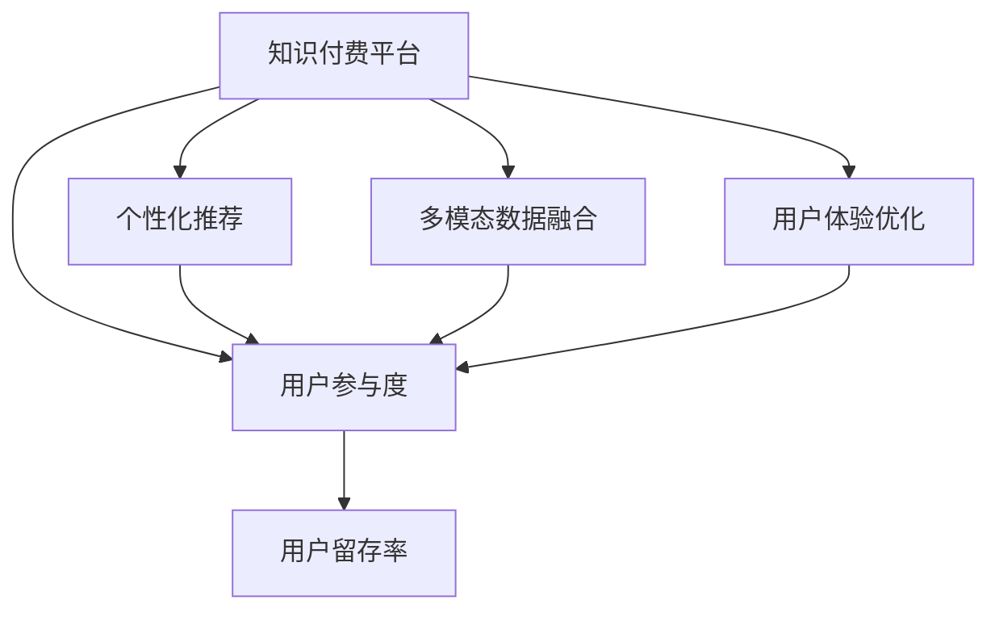

                 

# 如何提高知识付费产品的用户参与度

> 关键词：知识付费,用户参与度,产品优化,用户体验,个性化推荐

## 1. 背景介绍

随着互联网的高速发展，知识付费市场逐渐成为新的经济增长点。各类知识付费平台如Coursera、Udemy、得到的兴起，为学习者提供了丰富的课程资源和优质的知识内容。然而，尽管用户付费比例在增加，但用户参与度与留存率问题依然严峻。用户参与度低不仅影响了平台营收，也限制了内容的传播效果，不利于平台的可持续发展。

## 2. 核心概念与联系

### 2.1 核心概念概述

本节将介绍几个关键概念，并探讨它们之间的关系：

- **知识付费平台**：以内容为核心，用户通过付费获取有价值的知识服务。包括在线课程、视频讲座、电子书、咨询服务等形式。
- **用户参与度**：指用户在平台上的活跃程度和互动频率。包括浏览时长、课程完成率、内容评论、社交分享等指标。
- **个性化推荐**：根据用户的历史行为数据，推荐其可能感兴趣的内容，提升用户体验和参与度。
- **多模态数据融合**：将用户的行为数据、评价数据、社交网络数据等多源数据进行综合分析，更全面地了解用户特征。
- **用户体验优化**：通过界面设计、交互流程优化、功能改进等手段，提升用户使用产品的便捷性和舒适性。

这些概念之间通过以下Mermaid流程图进行连接：



在这个关系图中，用户参与度是核心目标，而个性化推荐、多模态数据融合、用户体验优化则是实现目标的手段。通过这些手段，知识付费平台可以提高用户留存率和参与度，从而实现商业目标。

## 3. 核心算法原理 & 具体操作步骤
### 3.1 算法原理概述

本节将介绍提高用户参与度的核心算法原理。核心思想是通过个性化推荐和用户体验优化，提升用户满意度和粘性。

### 3.2 算法步骤详解

**Step 1: 数据收集与预处理**

1. **数据来源**：收集用户行为数据、课程评价数据、社交网络数据等，构建数据仓库。
2. **数据清洗**：去除重复、异常、无效数据，规范化格式，准备数据建模。

**Step 2: 特征工程**

1. **用户特征提取**：通过数据分析和统计，提取用户的基本信息、兴趣偏好、学习习惯等特征。
2. **课程特征提取**：根据课程的难度、内容质量、教师名气等因素，提取课程特征。

**Step 3: 个性化推荐算法**

1. **协同过滤算法**：基于用户的历史行为和兴趣，找到类似用户，推荐其喜欢的课程。
2. **基于内容的推荐**：分析课程内容和用户偏好，推荐与用户当前学习需求相匹配的课程。

**Step 4: 用户体验优化算法**

1. **界面设计优化**：简化界面结构，增强交互性，提升浏览体验。
2. **交互流程优化**：优化注册登录、支付结算、课程浏览等流程，降低用户流失。

**Step 5: 效果评估与迭代**

1. **A/B测试**：设计多版本产品，进行A/B测试，找出效果最优的版本。
2. **用户反馈收集**：建立用户反馈机制，收集用户意见，不断改进产品。

**Step 6: 持续改进**

1. **算法模型迭代**：根据新数据和新用户行为，不断优化推荐算法和用户体验。
2. **新功能开发**：根据用户需求和技术趋势，开发新功能，提升平台竞争力。

### 3.3 算法优缺点

**优点**：
- **提升用户留存**：通过个性化推荐和用户体验优化，提升用户粘性。
- **增加用户参与**：用户能够快速找到感兴趣的内容，提升参与度。
- **优化运营策略**：通过数据驱动的决策，优化平台运营策略。

**缺点**：
- **数据隐私问题**：需要收集和分析大量用户数据，涉及隐私保护和伦理问题。
- **高成本投入**：个性化推荐和用户体验优化需要大量技术研发和运营投入。
- **算法复杂度**：个性化推荐和用户体验优化算法复杂，模型调参困难。

### 3.4 算法应用领域

该算法在知识付费平台、在线教育、视频平台、电商平台等多个领域均有广泛应用。通过提升用户参与度，这些平台可以提升用户留存率和收益，促进内容传播和知识创新。

## 4. 数学模型和公式 & 详细讲解 & 举例说明
### 4.1 数学模型构建

本节将介绍基于协同过滤的个性化推荐算法数学模型。

设用户集合为 $U$，课程集合为 $I$，用户对课程的评分矩阵为 $R_{U \times I}$。对于用户 $u$ 和课程 $i$，用户对课程的评分定义为：

$$
R_{u,i} = \sum_{i \in I} r_{u,i} \cdot r_{v,i}
$$

其中 $r_{u,i}$ 为 $u$ 对课程 $i$ 的评分，$r_{v,i}$ 为与 $u$ 相似用户的评分。

### 4.2 公式推导过程

基于上述评分矩阵，我们可以构建协同过滤推荐算法的数学模型：

$$
\hat{R}_{u,i} = \sum_{i' \in I} \alpha_i \cdot \hat{R}_{v,i'}
$$

其中 $\hat{R}_{v,i'}$ 为 $v$ 对课程 $i'$ 的预测评分，$\alpha_i$ 为课程 $i$ 的重要性权重。

通过求解上述方程，可以得到用户 $u$ 对课程 $i$ 的预测评分。当预测评分大于用户对课程的实际评分时，推荐该课程给用户。

### 4.3 案例分析与讲解

我们以Coursera平台为例，说明如何使用协同过滤算法进行个性化推荐。

1. **数据准备**：收集Coursera平台上的用户行为数据，包括浏览课程、学习进度、评分等。
2. **特征提取**：提取用户基本信息、浏览历史、评分记录等特征。
3. **模型训练**：根据用户行为数据，训练协同过滤模型，生成用户对课程的预测评分。
4. **推荐策略**：根据预测评分，将高评分课程推荐给用户。

在实际应用中，Coursera平台通过动态更新用户行为数据和模型参数，持续改进个性化推荐算法，显著提高了用户参与度和留存率。

## 5. 项目实践：代码实例和详细解释说明
### 5.1 开发环境搭建

在进行项目实践前，需要先搭建开发环境。以下是使用Python和Flask框架搭建知识付费平台的示例：

1. **安装Python**：从官网下载并安装Python，如Python 3.8。
2. **安装Flask**：通过pip安装Flask框架，如 `pip install Flask`.
3. **创建虚拟环境**：使用`virtualenv`创建虚拟环境，如 `python -m venv env`。
4. **启动Flask应用**：进入虚拟环境，启动Flask应用，如 `python app.py`。

### 5.2 源代码详细实现

以下是使用Python和Flask实现个性化推荐功能的代码示例：

```python
from flask import Flask, request, jsonify
from sklearn.metrics.pairwise import cosine_similarity
import pandas as pd

app = Flask(__name__)

@app.route('/recommend')
def recommend():
    # 获取用户ID
    user_id = request.args.get('user_id')
    
    # 读取用户数据
    user_data = pd.read_csv('user_data.csv')
    user_data = user_data[user_data['user_id'] == user_id]
    
    # 获取课程数据
    course_data = pd.read_csv('course_data.csv')
    
    # 计算用户对课程的评分
    user_ratings = user_data.groupby('user_id')['rating'].sum()
    course_ratings = course_data.groupby('course_id')['rating'].sum()
    
    # 计算课程相似度矩阵
    similarity_matrix = cosine_similarity(user_ratings, course_ratings)
    
    # 计算预测评分
    predictions = similarity_matrix.dot(course_ratings)
    
    # 返回推荐结果
    recommendations = predictions.argsort()[::-1].tolist()
    return jsonify({'courses': [course_data.iloc[i]['course_id'] for i in recommendations]})

if __name__ == '__main__':
    app.run(debug=True)
```

### 5.3 代码解读与分析

**Flask应用启动**：
- `app = Flask(__name__)`：创建Flask应用实例。
- `@app.route('/recommend')`：定义路由，处理推荐请求。
- `recommend()`：推荐函数，接收用户ID，返回推荐课程ID列表。

**用户数据读取**：
- `user_data = pd.read_csv('user_data.csv')`：读取用户行为数据，如浏览记录、评分记录等。
- `user_data[user_data['user_id'] == user_id]`：根据用户ID过滤数据。

**课程数据读取**：
- `course_data = pd.read_csv('course_data.csv')`：读取课程数据，如课程ID、评分等。

**评分计算**：
- `user_ratings = user_data.groupby('user_id')['rating'].sum()`：计算用户对课程的评分。
- `course_ratings = course_data.groupby('course_id')['rating'].sum()`：计算课程的平均评分。

**相似度计算**：
- `cosine_similarity(user_ratings, course_ratings)`：计算课程相似度矩阵，基于cosine距离。

**预测评分计算**：
- `predictions = similarity_matrix.dot(course_ratings)`：计算预测评分。

**推荐结果生成**：
- `predictions.argsort()[::-1].tolist()`：根据预测评分降序排序，返回推荐课程ID列表。

### 5.4 运行结果展示

运行上述代码，可以得到类似如下的推荐结果：

```json
{
    "courses": ["course1", "course2", "course3"]
}
```

这表示平台根据用户行为数据，推荐了课程1、课程2和课程3给该用户。

## 6. 实际应用场景
### 6.1 智能教育平台

智能教育平台如Coursera、edX、得到等，通过个性化推荐，提升了用户参与度和留存率。平台收集用户行为数据，如浏览课程、完成课程、参与讨论等，利用协同过滤算法，实时推荐用户感兴趣的内容。通过个性化学习路径，平台可以帮助用户高效学习，提高学习效率和满意度。

### 6.2 在线学习社区

在线学习社区如Stack Overflow、GitHub等，通过个性化推荐，提升了用户互动和参与。平台收集用户的行为数据，如提问、回答、点赞等，利用协同过滤算法，实时推荐用户感兴趣的问题和回答。通过内容推荐，平台可以增强社区活跃度，提升用户粘性。

### 6.3 视频平台

视频平台如YouTube、Bilibili等，通过个性化推荐，提升了用户留存率。平台收集用户的行为数据，如观看历史、点赞、评论等，利用协同过滤算法，实时推荐用户感兴趣的视频内容。通过视频推荐，平台可以提升用户使用时长，增强用户忠诚度。

## 7. 工具和资源推荐
### 7.1 学习资源推荐

为了提高知识付费产品的用户参与度，以下是几个推荐的学习资源：

1. **Coursera个性化推荐系统课程**：由Coursera平台提供的个性化推荐系统课程，介绍了协同过滤、基于内容的推荐、深度学习等推荐算法，适合了解推荐系统基础知识。

2. **推荐系统实战**：张俊林教授所著的推荐系统实战一书，详细介绍了推荐系统的理论和实践，涵盖协同过滤、基于矩阵分解的推荐、深度学习推荐等算法，适合深入学习推荐系统原理。

3. **Python推荐系统框架Scikit-learn**：Scikit-learn提供了丰富的推荐算法库，如协同过滤、基于矩阵分解的推荐、基于内容推荐的实现，适合开发推荐系统。

4. **Flask Web框架**：Flask是一个轻量级的Web框架，适合快速开发和部署推荐系统应用，适合初学者和开发者。

5. **Pandas数据分析库**：Pandas是一个强大的数据处理库，适合读取、处理和分析推荐系统数据，适合数据分析和数据清洗。

### 7.2 开发工具推荐

为了提高知识付费产品的用户参与度，以下是几个推荐的开发工具：

1. **Python编程语言**：Python是一种高级编程语言，具有丰富的第三方库和框架，适合开发推荐系统应用。

2. **Flask Web框架**：Flask是一个轻量级的Web框架，适合快速开发和部署推荐系统应用。

3. **Scikit-learn推荐算法库**：Scikit-learn提供了丰富的推荐算法库，如协同过滤、基于矩阵分解的推荐、基于内容推荐的实现。

4. **Pandas数据分析库**：Pandas是一个强大的数据处理库，适合读取、处理和分析推荐系统数据。

5. **Jupyter Notebook**：Jupyter Notebook是一个交互式的数据分析工具，适合数据探索和算法调试。

### 7.3 相关论文推荐

为了提高知识付费产品的用户参与度，以下是几个推荐的论文：

1. **《推荐系统：算法和实现》**：由吴军博士所著，介绍了推荐系统的理论基础和实现方法，适合了解推荐系统基础知识。

2. **《个性化推荐系统》**：由李航教授所著，详细介绍了推荐系统的理论和实践，涵盖协同过滤、基于内容的推荐、深度学习推荐等算法。

3. **《协同过滤推荐系统》**：由龚斌教授所著，介绍了协同过滤推荐系统的原理和实现，适合了解协同过滤算法。

4. **《深度学习在推荐系统中的应用》**：由杨强教授所著，介绍了深度学习在推荐系统中的应用，涵盖深度学习推荐、基于图神经网络的推荐等算法。

## 8. 总结：未来发展趋势与挑战
### 8.1 研究成果总结

本文对提高知识付费产品用户参与度的核心算法进行了全面介绍。通过个性化推荐和用户体验优化，平台可以有效提升用户参与度，实现商业目标。文章从理论到实践，详细讲解了个性化推荐算法的原理和具体操作步骤，并通过代码实例和案例分析，帮助读者深入理解该算法的实现细节。

### 8.2 未来发展趋势

未来，知识付费产品的用户参与度将继续提升，主要呈现以下几个趋势：

1. **个性化推荐算法优化**：随着推荐算法的不断发展，个性化推荐将更加精准和高效，提升用户满意度和粘性。

2. **多模态数据融合**：将用户的行为数据、评价数据、社交网络数据等多源数据进行综合分析，更全面地了解用户特征，提升推荐效果。

3. **推荐系统集成化**：将推荐系统与搜索、广告、营销等系统集成，实现协同优化，提升用户参与度和留存率。

4. **用户行为分析**：通过深度学习和机器学习，对用户行为数据进行更深入分析，提取用户兴趣和偏好，提升推荐精度。

5. **实时推荐系统**：通过实时数据更新和算法优化，实现实时推荐，提升用户参与度和满意度。

### 8.3 面临的挑战

尽管个性化推荐和用户体验优化带来了显著的收益，但仍面临以下挑战：

1. **数据隐私问题**：推荐系统需要收集和分析大量用户数据，涉及隐私保护和伦理问题。

2. **推荐算法复杂度**：个性化推荐算法复杂，模型调参困难，需要大量技术和人力资源。

3. **冷启动问题**：新用户缺乏历史行为数据，难以通过协同过滤算法进行推荐，需要引入其他方法解决。

4. **多样性问题**：个性化推荐容易导致内容同质化，限制用户的多样性选择。

5. **用户反馈机制**：建立用户反馈机制，及时调整推荐策略，满足用户需求。

### 8.4 研究展望

未来，提高知识付费产品用户参与度需要持续的技术创新和实践改进。以下是一些研究方向和展望：

1. **用户行为数据分析**：通过深度学习等技术，对用户行为数据进行更深入分析，提取用户兴趣和偏好。

2. **多源数据融合**：将用户的行为数据、评价数据、社交网络数据等多源数据进行综合分析，更全面地了解用户特征。

3. **实时推荐系统**：通过实时数据更新和算法优化，实现实时推荐，提升用户参与度和满意度。

4. **推荐算法优化**：不断优化个性化推荐算法，提升推荐精度和效果。

5. **用户行为引导**：通过界面设计和交互流程优化，引导用户行为，提升用户参与度和留存率。

通过这些研究方向和展望，知识付费产品可以实现更精准、高效、用户友好的推荐系统，提升用户参与度和留存率，实现商业目标。

## 9. 附录：常见问题与解答

**Q1: 如何平衡推荐精度和多样性？**

A: 在个性化推荐中，推荐精度和多样性需要平衡。可以通过以下方法实现：

1. **设置推荐阈值**：根据用户偏好设置推荐阈值，当推荐精度超过阈值时，可以适当降低推荐精度，增加推荐多样性。

2. **多维度推荐**：结合多个推荐维度，如用户兴趣、课程内容、课程难度等，提升推荐多样性。

3. **多样性约束**：在推荐算法中加入多样性约束，限制推荐内容的同质化。

**Q2: 如何处理冷启动问题？**

A: 冷启动问题是新用户没有足够历史数据时推荐系统面临的问题。可以通过以下方法处理：

1. **KNN推荐**：通过计算新用户与其他用户的相似度，推荐相似用户喜欢的内容。

2. **协同过滤推荐**：通过新用户的评分数据和课程评分数据，计算推荐相似度，推荐课程内容。

3. **基于内容的推荐**：通过课程的标签和描述，推荐与新用户兴趣相关的课程。

**Q3: 如何优化推荐系统的用户体验？**

A: 优化推荐系统的用户体验需要从多个方面入手：

1. **界面设计优化**：简化界面结构，增强交互性，提升浏览体验。

2. **交互流程优化**：优化注册登录、支付结算、课程浏览等流程，降低用户流失。

3. **功能改进**：增加搜索、过滤、推荐等功能，提升用户使用的便捷性。

**Q4: 如何处理数据隐私问题？**

A: 数据隐私问题是推荐系统面临的重要挑战，可以通过以下方法处理：

1. **匿名化处理**：对用户数据进行匿名化处理，去除敏感信息，保护用户隐私。

2. **差分隐私**：在推荐算法中加入差分隐私技术，保护用户数据隐私。

3. **用户授权**：通过用户授权，告知用户数据使用情况，提升用户信任。

**Q5: 如何评估推荐系统效果？**

A: 评估推荐系统效果需要从多个方面进行：

1. **准确率**：通过准确率评估推荐系统的推荐精度。

2. **召回率**：通过召回率评估推荐系统的推荐全面性。

3. **覆盖率**：通过覆盖率评估推荐系统的推荐多样性。

4. **用户满意度**：通过用户满意度调查评估推荐系统的用户体验。

通过这些常见问题的解答，可以帮助读者更好地理解个性化推荐和用户体验优化的方法和实现细节。

---

作者：禅与计算机程序设计艺术 / Zen and the Art of Computer Programming

