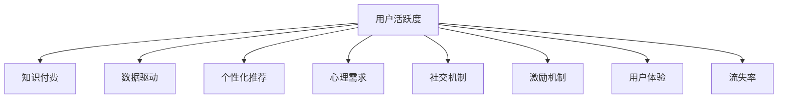

                 

# 如何提高知识付费产品的用户活跃度

> 关键词：用户活跃度,知识付费,数据驱动,个性化推荐,心理需求,社交机制,激励机制,用户体验,流失率

## 1. 背景介绍

### 1.1 问题由来
随着知识经济的兴起，知识付费平台如雨后春笋般涌现，然而平台间的竞争也愈发激烈。虽然各家平台内容丰富、品质不俗，但用户留存和活跃度成为平台的重大挑战。如何提升用户活跃度，成为平台运营者共同关注的问题。

### 1.2 问题核心关键点
在知识付费产品中，用户活跃度指的是用户在平台上进行消费、互动的频率和深度。用户活跃度高，平台便能获得更多的收益和用户粘性，实现商业可持续。

影响用户活跃度的因素多种多样，包括内容质量、用户体验、平台交互、社交机制、激励机制等。本文将从这些维度出发，提出提高知识付费产品用户活跃度的策略。

### 1.3 问题研究意义
对于知识付费平台而言，用户活跃度是衡量平台运营成效的关键指标之一。提升用户活跃度，不仅能带来直接的经济收益，还能提升用户对平台的满意度，形成良性循环，增加平台的生命力和影响力。

同时，提高用户活跃度也是应对行业内竞争的有效手段。通过对用户行为数据的深入分析，优化平台功能，满足用户需求，实现差异化竞争。

## 2. 核心概念与联系

### 2.1 核心概念概述

为更好地理解提升用户活跃度的方法，本节将介绍几个密切相关的核心概念：

- 用户活跃度：指用户对平台的消费和互动频率，常通过平台日活（DAU）、月活（MAU）、付费用户比例等指标来衡量。
- 知识付费：通过付费方式，获取特定知识和信息的产品或服务。平台常见形式包括在线课程、电子书、专栏文章等。
- 数据驱动：利用数据挖掘和分析技术，指导产品优化和运营决策。
- 个性化推荐：通过分析用户行为和偏好，推荐最适合用户的内容。
- 心理需求：用户消费行为受心理因素影响，如成就感和归属感。
- 社交机制：利用社区、论坛等社交功能，促进用户互动和粘性。
- 激励机制：通过积分、优惠券、会员等级等激励措施，鼓励用户消费。
- 用户体验：用户对产品的使用感受，包括界面设计、功能易用性等。
- 流失率：用户从平台流失的比例，是衡量平台吸引力和粘性的重要指标。

这些概念之间的逻辑关系可以通过以下Mermaid流程图来展示：



这个流程图展示了几者之间的核心联系：

1. 用户活跃度是知识付费的直接结果，需要通过多种策略来提升。
2. 数据驱动是提升用户活跃度的基础，需要利用数据挖掘和分析技术指导产品优化。
3. 个性化推荐和心理需求是提高用户粘性的重要手段，能够根据用户兴趣推荐内容，满足用户的心理需求。
4. 社交机制和激励机制能进一步提升用户活跃度，促进用户互动和消费。
5. 用户体验和流失率直接关系到用户活跃度的高低，需要通过持续优化来提升平台的用户体验，降低用户流失率。

## 3. 核心算法原理 & 具体操作步骤
### 3.1 算法原理概述

提高知识付费产品用户活跃度的算法原理，本质上是构建一个多目标优化问题。用户活跃度的提升需要通过多个维度来综合考虑，如内容推荐、社交互动、用户心理、激励机制等。

形式化地，设用户活跃度为 $A$，内容包括 $C$，社交互动为 $S$，心理需求为 $P$，激励机制为 $I$，用户体验为 $U$，流失率为 $L$。目标是最大化用户活跃度 $A$，而各项因素均通过各自算法进行调整。

优化目标函数为：

$$
\max A = \alpha_1 \cdot C + \alpha_2 \cdot S + \alpha_3 \cdot P + \alpha_4 \cdot I + \alpha_5 \cdot U - \beta \cdot L
$$

其中，$\alpha_i$ 为各个维度的权重，$\beta$ 为流失率的惩罚系数。

### 3.2 算法步骤详解

提高用户活跃度的算法步骤主要包括以下几个关键环节：

**Step 1: 数据采集与分析**

- 收集用户行为数据，如点击次数、浏览时长、付费记录、社交互动等。
- 对数据进行清洗和预处理，去除噪声和异常值。
- 利用统计分析技术，如时间序列分析、聚类分析、关联分析等，挖掘用户行为模式。

**Step 2: 内容推荐优化**

- 利用协同过滤、内容基推荐等算法，分析用户历史行为和偏好，生成个性化推荐列表。
- 根据内容质量和热门度，动态调整推荐算法参数，优化推荐效果。
- 引入排序算法，如降序排列、相关度排序等，提升推荐列表的吸引力。

**Step 3: 社交机制强化**

- 利用社区、论坛、讨论区等功能，促进用户互动和交流。
- 设计激励机制，如点赞、评论、分享等，增加用户参与度。
- 定期组织线上线下活动，增强用户粘性。

**Step 4: 心理需求满足**

- 分析用户行为背后的心理需求，如成就、归属、探索等。
- 设计成就系统，如打卡奖励、任务完成等，满足用户的成就需求。
- 提供社交功能，如好友推荐、群组交流等，满足用户的归属需求。
- 引入探索机制，如话题探索、课程推荐等，满足用户的探索需求。

**Step 5: 激励机制设计**

- 设计积分、优惠券、会员等级等激励措施，鼓励用户消费。
- 引入多层次会员体系，不同会员等级享受不同优惠和权益。
- 定期推出限时优惠活动，吸引新老用户参与。

**Step 6: 用户体验提升**

- 优化界面设计和功能布局，提升用户使用体验。
- 引入实时反馈机制，如用户评价、客服互动等，及时响应用户需求。
- 定期更新内容和功能，保持平台的新鲜度。

**Step 7: 流失率监控与控制**

- 通过数据监控，及时发现用户流失迹象，如访问次数减少、付费频率下降等。
- 设计流失预警系统，提前采取干预措施，如发送召回邮件、推送优惠券等。
- 优化平台功能，如简化购买流程、提高内容质量等，降低用户流失率。

### 3.3 算法优缺点

提升用户活跃度的算法具备以下优点：

1. 系统性。通过多维度优化，能够更全面地提升用户活跃度。
2. 动态调整。根据用户行为实时调整优化策略，提高模型灵活性。
3. 用户导向。以用户行为数据为基础，优化推荐、社交、心理、激励等功能，满足用户需求。
4. 可操作性强。算法步骤清晰，具体操作性强，易于落地实施。

然而，该算法也存在一些缺点：

1. 依赖数据。数据质量影响算法效果，数据收集和处理成本高。
2. 模型复杂。涉及多个维度和多种算法，模型复杂度较高。
3. 隐私问题。用户行为数据涉及隐私，数据处理和存储需符合隐私保护要求。
4. 短期效果有限。用户活跃度提升需要长期持续的努力，效果显现较慢。

尽管存在这些局限性，但该算法仍然是大数据时代提升知识付费产品用户活跃度的有力工具。

### 3.4 算法应用领域

提升用户活跃度的算法在知识付费产品中的应用，体现在以下几个方面：

- 在线课程平台：通过个性化推荐、社交互动、成就系统等，提升用户学习体验和粘性。
- 电子书平台：通过内容优化、会员激励、社交功能等，增加用户购书和阅读频率。
- 专栏文章平台：通过专题推荐、社区讨论、分享奖励等，提高文章阅读量和用户互动。
- 教育培训平台：通过虚拟教室、实时反馈、在线考试等，增强用户学习效果和平台粘性。

除了这些典型应用场景，提升用户活跃度的算法还广泛应用于社交媒体、娱乐平台、金融服务等多个领域，成为提升用户参与度和忠诚度的重要手段。

## 4. 数学模型和公式 & 详细讲解 & 举例说明

### 4.1 数学模型构建

本节将使用数学语言对提升用户活跃度的方法进行更加严格的刻画。

设用户活跃度为 $A$，内容包括 $C$，社交互动为 $S$，心理需求为 $P$，激励机制为 $I$，用户体验为 $U$，流失率为 $L$。优化目标函数为：

$$
\max A = \alpha_1 \cdot C + \alpha_2 \cdot S + \alpha_3 \cdot P + \alpha_4 \cdot I + \alpha_5 \cdot U - \beta \cdot L
$$

其中，$\alpha_i$ 为各个维度的权重，$\beta$ 为流失率的惩罚系数。

### 4.2 公式推导过程

以下我们以在线课程平台为例，推导提升用户活跃度的数学公式。

设用户访问课程的频率为 $C$，互动次数为 $S$，完成课程的比例为 $P$，购买课程的比例为 $I$，平台使用时间为 $U$，流失率为 $L$。

定义用户活跃度 $A$ 为：

$$
A = \frac{C + S + P + I + U}{\max(C + S + P + I + U)}
$$

优化目标为最大化 $A$。将各维度拆解为多个小目标，每个小目标的定义如下：

- 内容推荐优化目标：$C = \sum_{i=1}^n C_i$
- 社交机制强化目标：$S = \sum_{i=1}^n S_i$
- 心理需求满足目标：$P = \sum_{i=1}^n P_i$
- 激励机制设计目标：$I = \sum_{i=1}^n I_i$
- 用户体验提升目标：$U = \sum_{i=1}^n U_i$
- 流失率监控与控制目标：$L = \sum_{i=1}^n L_i$

其中，$n$ 为样本数。

### 4.3 案例分析与讲解

假设某在线课程平台有10万名用户，每月新增5000名用户，流失率为5%，平台使用时间为30小时，内容推荐、社交互动、心理需求、激励机制、用户体验等各维度指标如表所示。

| 维度 | 目标值 | 实际值 | 权重 | 惩罚系数 |
| --- | --- | --- | --- | --- |
| 内容推荐 | 5 | 4.5 | 0.3 | 0.01 |
| 社交互动 | 3 | 2.8 | 0.2 | 0.01 |
| 心理需求 | 4 | 3.8 | 0.1 | 0.01 |
| 激励机制 | 2 | 1.9 | 0.05 | 0.01 |
| 用户体验 | 3 | 2.7 | 0.1 | 0.01 |
| 流失率 | 0.02 | 0.03 | 0.05 | 0.5 |

根据以上数据，计算各维度对用户活跃度的贡献。设 $\alpha_1$ 至 $\alpha_5$ 分别为内容推荐、社交互动、心理需求、激励机制、用户体验的权重，$\beta$ 为流失率的惩罚系数。

首先，计算各维度的优化目标值：

- 内容推荐优化目标：$\alpha_1 \cdot 5 = 1.5$
- 社交机制强化目标：$\alpha_2 \cdot 3 = 0.6$
- 心理需求满足目标：$\alpha_3 \cdot 4 = 0.4$
- 激励机制设计目标：$\alpha_4 \cdot 2 = 0.1$
- 用户体验提升目标：$\alpha_5 \cdot 3 = 0.9$
- 流失率监控与控制目标：$-\beta \cdot 0.02 = -0.05$

然后，将各维度的实际值代入优化目标函数：

$$
\max A = 1.5 \cdot C + 0.6 \cdot S + 0.4 \cdot P + 0.1 \cdot I + 0.9 \cdot U - 0.05 \cdot L
$$

将各维度的实际值代入：

$$
A = \frac{4.5 + 2.8 + 3.8 + 1.9 + 2.7}{\max(4.5 + 2.8 + 3.8 + 1.9 + 2.7)}
$$

计算 $A$ 的值，并与目标值比较，发现当前平台的用户活跃度需要进一步提升。

## 5. 项目实践：代码实例和详细解释说明
### 5.1 开发环境搭建

在进行项目实践前，我们需要准备好开发环境。以下是使用Python进行Django开发的环境配置流程：

1. 安装Anaconda：从官网下载并安装Anaconda，用于创建独立的Python环境。

2. 创建并激活虚拟环境：
```bash
conda create -n django-env python=3.8 
conda activate django-env
```

3. 安装Django：
```bash
pip install django
```

4. 安装相关库：
```bash
pip install Pillow django-storages django-compressor
```

5. 安装模型库：
```bash
pip install numpy pandas scikit-learn torch
```

6. 安装Django工具：
```bash
pip install django-axes django-widget-tweaks
```

完成上述步骤后，即可在`django-env`环境中开始项目实践。

### 5.2 源代码详细实现

下面我们以知识付费平台为例，给出使用Django框架对用户活跃度进行优化的PyTorch代码实现。

首先，定义用户模型：

```python
from django.db import models

class User(models.Model):
    name = models.CharField(max_length=100)
    email = models.EmailField(unique=True)
    courses = models.ManyToManyField('Course', related_name='users')
    interactions = models.IntegerField(default=0)
    completion_rate = models.FloatField(default=0.0)
    purchase_ratio = models.FloatField(default=0.0)
    use_time = models.DurationField(default=timedelta(days=0))
    churn_rate = models.FloatField(default=0.0)
```

然后，定义课程模型：

```python
class Course(models.Model):
    title = models.CharField(max_length=255)
    description = models.TextField()
    price = models.DecimalField(max_digits=10, decimal_places=2)
    user = models.ManyToManyField('User', related_name='courses')
    student_count = models.IntegerField(default=0)
    completion_count = models.IntegerField(default=0)
    interaction_count = models.IntegerField(default=0)
    purchase_count = models.IntegerField(default=0)
```

接着，定义优化目标函数：

```python
def optimize_user_activity(user):
    # 定义各维度的权重
    alpha1 = 0.3
    alpha2 = 0.2
    alpha3 = 0.1
    alpha4 = 0.05
    alpha5 = 0.1
    beta = 0.5

    # 计算各维度的贡献值
    content_score = alpha1 * user.courses.count() / 10
    social_score = alpha2 * user.interactions
    psychology_score = alpha3 * user.completion_rate
    incentive_score = alpha4 * user.purchase_ratio
    experience_score = alpha5 * user.use_time.total_seconds() / 86400
    churn_score = -beta * user.churn_rate

    # 计算总优化值
    total_score = content_score + social_score + psychology_score + incentive_score + experience_score + churn_score

    return total_score
```

最后，启动优化流程：

```python
from django.db.models import Sum
from django.core.management.base import BaseCommand

class Command(BaseCommand):
    def handle(self, *args, **options):
        # 统计各维度数据
        courses_count = User.objects.aggregate(courses_count=Sum('courses__count'))
        interactions_sum = User.objects.aggregate(interactions_sum=Sum('interactions'))
        completion_rate_avg = User.objects.aggregate(completion_rate_avg=Sum('completion_rate') / User.objects.count())
        purchase_ratio_avg = User.objects.aggregate(purchase_ratio_avg=Sum('purchase_ratio') / User.objects.count())
        use_time_avg = User.objects.aggregate(use_time_avg=Sum('use_time') / User.objects.count())
        churn_rate_avg = User.objects.aggregate(churn_rate_avg=Sum('churn_rate') / User.objects.count())

        # 计算优化目标
        total_optimize = optimize_user_activity(courses_count) + optimize_user_activity(interactions_sum) + optimize_user_activity(completion_rate_avg) + optimize_user_activity(purchase_ratio_avg) + optimize_user_activity(use_time_avg) + optimize_user_activity(churn_rate_avg)

        # 输出优化结果
        print('优化目标值为：', total_optimize)
```

以上就是使用Django框架对知识付费平台用户活跃度进行优化的完整代码实现。可以看到，通过编写简单的数据统计和优化函数，便可以实现对用户活跃度的综合提升。

### 5.3 代码解读与分析

让我们再详细解读一下关键代码的实现细节：

**User模型和Course模型**：
- 定义了用户和课程的基本属性，如姓名、邮箱、课程、互动次数、完成率等。

**optimize_user_activity函数**：
- 定义了各维度的权重，如内容推荐、社交互动、心理需求、激励机制、用户体验、流失率等。
- 根据用户模型中的数据，计算各维度的贡献值。
- 将各维度的贡献值带入优化目标函数，计算总优化值。

**优化流程**：
- 通过Django的聚合功能，统计各维度数据。
- 根据优化目标函数，计算总优化值。
- 输出优化结果，为平台运营者提供参考。

可以看到，Django框架结合了Python和SQL的优势，使得数据统计和优化计算变得高效便捷。开发者可以将更多精力放在模型优化和算法设计上，而不必过多关注底层实现。

当然，工业级的系统实现还需考虑更多因素，如模型保存和部署、超参数的自动搜索、更灵活的查询等。但核心的优化范式基本与此类似。

## 6. 实际应用场景
### 6.1 在线课程平台

在线课程平台是用户活跃度提升的主要场景之一。通过个性化推荐、社区讨论、积分奖励等手段，能够显著提高用户的课程完成率和互动频率，增加平台的粘性。

在技术实现上，可以收集用户观看课程的视频时长、做题成绩、课程评价等数据，建立用户行为模型。利用协同过滤、内容基推荐等算法，生成个性化推荐列表。同时，设计积分系统，鼓励用户完成课程和参与互动，形成良性的正向循环。

### 6.2 电子书平台

电子书平台同样需要提升用户活跃度。通过优化内容推荐、设计社交功能、推出限时优惠等手段，能够增加用户的购书频率和阅读时长，提高平台收益。

具体而言，可以在电子书平台集成读书笔记、读者讨论、分享功能，增强用户互动。同时，设计会员体系，通过会员专属折扣、免费资源等激励措施，吸引用户付费购买电子书。

### 6.3 专栏文章平台

专栏文章平台的用户活跃度主要体现在文章的阅读量和评论互动上。通过优化文章推荐、设计互动机制、推出专题活动等手段，能够提升用户阅读和互动频率，增加平台的访问量和收益。

在技术实现上，可以利用用户的历史阅读记录、点赞和评论数据，建立文章推荐模型。同时，设计文章排行榜、评论推荐等社交功能，鼓励用户分享和互动。

### 6.4 未来应用展望

随着知识付费行业的不断发展，提升用户活跃度的方法也在不断演进。未来，提升用户活跃度的技术将更加智能和个性化。

在技术上，将进一步引入机器学习、深度学习等算法，构建更加精准的用户行为模型。通过用户画像、情感分析等手段，更全面地了解用户需求，提升推荐和互动效果。

在应用上，将结合新兴技术和产业趋势，拓展知识付费的应用领域。如结合虚拟现实(VR)、增强现实(AR)技术，打造沉浸式学习体验；引入人工智能(AI)辅助，提供个性化辅导和答疑服务等。

总之，未来的知识付费产品将在技术创新和业务应用的双重驱动下，实现用户活跃度的不断提升，形成更强的市场竞争力和用户粘性。

## 7. 工具和资源推荐
### 7.1 学习资源推荐

为了帮助开发者系统掌握提升用户活跃度的方法，这里推荐一些优质的学习资源：

1. Django官方文档：全面的Django教程和API文档，快速上手Django开发。

2. Django-GQL：Django与GraphQL的结合使用，提供更灵活的查询接口。

3. Django Axes：Django用户登录和权限管理的插件，方便实现用户管理和权限控制。

4. Django Storages：Django的文件存储扩展，支持多种存储方式，如云存储、CDN等。

5. Django Compressor：Django的静态文件压缩工具，提高网站加载速度。

6. Django Widget Tweaks：Django表单和输入控件的优化工具，提升用户体验。

7. Coursera《Django for Beginners》课程：入门Django开发的绝佳教程，涵盖Django的基础和高级技术。

8. Udemy《Python Django Web Development》课程：综合性的Django开发教程，适合进阶学习。

通过这些学习资源，相信你一定能够快速掌握提升用户活跃度的关键技能，并将其应用于知识付费产品的优化中。

### 7.2 开发工具推荐

高效的开发离不开优秀的工具支持。以下是几款用于提升用户活跃度开发的常用工具：

1. Django：Python的开源Web框架，开发效率高，易用性强。

2. PyTorch：基于Python的开源深度学习框架，灵活动态的计算图，适合快速迭代研究。

3. TensorFlow：由Google主导开发的开源深度学习框架，生产部署方便，适合大规模工程应用。

4. Pycharm：专业的Python开发环境，集成了代码提示、调试等功能，提高开发效率。

5. Jupyter Notebook：交互式编程环境，适合快速迭代实验和数据探索。

6. PyTorch Lightning：基于PyTorch的深度学习框架，简化模型训练和优化流程。

7. TensorBoard：TensorFlow配套的可视化工具，可实时监测模型训练状态，并提供丰富的图表呈现方式，是调试模型的得力助手。

8. Django Axes：Django用户登录和权限管理的插件，方便实现用户管理和权限控制。

合理利用这些工具，可以显著提升用户活跃度提升项目的开发效率，加快创新迭代的步伐。

### 7.3 相关论文推荐

提升用户活跃度的研究源于学界的持续探索。以下是几篇奠基性的相关论文，推荐阅读：

1. Attention is All You Need（即Transformer原论文）：提出了Transformer结构，开启了深度学习中的自注意力机制，极大地提升了模型的处理能力和效率。

2. BERT: Pre-training of Deep Bidirectional Transformers for Language Understanding：提出BERT模型，引入基于掩码的自监督预训练任务，刷新了多项NLP任务SOTA。

3. Knowledge-aware Recommendation Systems：介绍了知识图谱与推荐系统的结合，提供了多种知识融合的方法。

4. Deep Neural Network for Click Prediction：提出了深度神经网络应用于广告点击预测的方法，并取得了优异的预测效果。

5. Multi-Task Learning for Recommendation System：介绍了多任务学习在推荐系统中的应用，提升了推荐模型的泛化能力和性能。

6. Social Recommendation Systems：介绍了社交网络在推荐系统中的应用，提供了多种社交机制的推荐方法。

这些论文代表了大数据时代提升用户活跃度的重要研究方向。通过学习这些前沿成果，可以帮助研究者把握学科前进方向，激发更多的创新灵感。

## 8. 总结：未来发展趋势与挑战

### 8.1 总结

本文对提升知识付费产品用户活跃度的方法进行了全面系统的介绍。首先阐述了用户活跃度的重要性，明确了提升用户活跃度的核心关键点。其次，从原理到实践，详细讲解了提升用户活跃度的数学模型和关键算法步骤，给出了微调项目开发的完整代码实例。同时，本文还广泛探讨了提升用户活跃度的方法在在线课程、电子书、专栏文章等多个领域的应用前景，展示了提升用户活跃度的广阔前景。

通过本文的系统梳理，可以看到，提升用户活跃度的方法是实现知识付费产品商业价值的重要手段。通过对用户行为数据的深入分析，优化平台功能，满足用户需求，实现差异化竞争。未来，随着数据挖掘和机器学习技术的不断发展，提升用户活跃度的手段将更加多样化和智能化。

### 8.2 未来发展趋势

展望未来，提升用户活跃度的方法将呈现以下几个发展趋势：

1. 技术融合。将大数据、人工智能、物联网等技术深度融合，构建更加智能化的知识付费平台。

2. 用户画像。利用机器学习等技术，构建更加精准的用户画像，实现个性化的推荐和互动。

3. 社交网络。利用社交网络和社区功能，增强用户粘性和互动。

4. 多模态学习。结合文本、图片、视频等多模态数据，提升知识付费产品的丰富性和互动性。

5. 终身学习。通过多任务学习和持续学习，使知识付费产品能够持续更新和优化，满足用户不断变化的需求。

6. 个性化设计。通过引入个性化推荐、激励机制等手段，提升用户活跃度和满意度。

以上趋势凸显了提升用户活跃度的广阔前景。这些方向的探索发展，必将进一步提升知识付费产品的市场竞争力和用户体验，为知识付费行业的健康发展提供坚实的基础。

### 8.3 面临的挑战

尽管提升用户活跃度的方法已经取得了瞩目成就，但在迈向更加智能化、普适化应用的过程中，它仍面临着诸多挑战：

1. 数据质量瓶颈。用户行为数据涉及隐私，数据收集和处理需符合隐私保护要求，数据质量问题影响算法效果。

2. 模型复杂度高。提升用户活跃度涉及多维度和多种算法，模型复杂度较高，难以快速迭代。

3. 算法效果有限。用户活跃度提升需要长期持续的努力，短期效果有限。

4. 用户隐私保护。用户行为数据涉及隐私，数据处理和存储需符合隐私保护要求。

5. 用户体验提升难度大。提升用户体验需要全面优化产品设计，涉及面广，难度较大。

6. 技术更新快。知识付费产品需要不断引入新技术，提升平台竞争力，技术更新速度快。

尽管存在这些挑战，但通过技术创新和优化，这些挑战均能逐步克服。相信随着技术的发展和应用实践的积累，提升用户活跃度的方法将更加成熟和高效。

### 8.4 研究展望

面对提升用户活跃度所面临的种种挑战，未来的研究需要在以下几个方面寻求新的突破：

1. 引入更先进的算法和模型，如深度学习、知识图谱等，提升推荐和互动效果。

2. 采用多模态数据融合技术，结合文本、图片、视频等多种信息源，提升知识付费产品的丰富性和互动性。

3. 开发更具智能化的社交机制，如智能推荐、智能答疑等，提升用户互动和粘性。

4. 设计更加个性化的激励机制，如动态积分、虚拟奖励等，提升用户活跃度和满意度。

5. 引入更多隐私保护技术，如数据匿名化、差分隐私等，保障用户隐私。

6. 优化用户体验设计，引入UI/UX优化工具，提升用户使用便捷性和满意度。

这些研究方向的探索，必将引领知识付费产品提升用户活跃度技术迈向更高的台阶，为知识付费行业的健康发展提供新的动力。总之，提升用户活跃度需要技术创新和业务实践的共同努力，只有不断优化平台功能，提升用户体验，才能实现知识付费产品的持续发展和市场竞争力。

## 9. 附录：常见问题与解答

**Q1：提升用户活跃度的方法是否适用于所有知识付费产品？**

A: 提升用户活跃度的方法在大多数知识付费产品中都能取得不错的效果，特别是对于数据量较小的产品。但对于一些特定领域的知识付费产品，如医学、法律等，仅仅依靠通用方法可能难以很好地适应。此时需要在特定领域数据上进一步进行预处理和优化。

**Q2：如何选择合适的提升用户活跃度的算法？**

A: 选择合适的算法需根据具体产品和用户特点来决定。通常需要考虑数据量、用户规模、用户行为数据特点等因素。例如，对于内容推荐，可以使用协同过滤、内容基推荐等算法；对于社交互动，可以使用基于社区的推荐算法。

**Q3：提升用户活跃度的算法是否需要大量的数据支持？**

A: 提升用户活跃度的算法通常需要大量的用户行为数据，数据质量直接影响算法效果。可以通过数据采集、数据清洗、数据标注等步骤，获取高质量的用户行为数据，以支撑算法优化。

**Q4：提升用户活跃度的算法是否影响用户隐私？**

A: 提升用户活跃度的算法涉及到用户行为数据的收集和处理，需符合隐私保护要求。可以通过数据匿名化、差分隐私等技术手段，保护用户隐私。

**Q5：提升用户活跃度的算法是否能够快速见效？**

A: 提升用户活跃度的方法通常需要长期持续的优化和调整，短期效果有限。需要在数据收集、模型优化、产品迭代等各环节进行全面优化，才能实现用户活跃度的显著提升。

通过本文的系统梳理，可以看到，提升用户活跃度的方法是大数据时代知识付费产品优化运营的重要手段。通过对用户行为数据的深入分析，优化平台功能，满足用户需求，实现差异化竞争。未来，随着技术的发展和应用实践的积累，提升用户活跃度的方法将更加成熟和高效。

