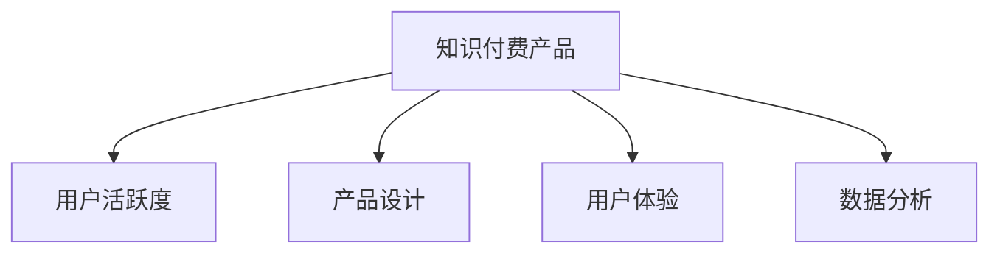

                 

# 如何提高知识付费产品的用户活跃度

> 关键词：知识付费,用户活跃度,产品设计,用户体验,数据分析

## 1. 背景介绍

### 1.1 问题由来
随着知识付费市场的热度不断攀升，越来越多的企业进入这个领域，希望能够抓住这一新兴的增长点。然而，尽管投入了大量资源，很多知识付费产品却面临着用户活跃度低下的困境。这不仅影响了产品的发展速度，也造成了资金和资源的浪费。那么，如何提高知识付费产品的用户活跃度，成为了当前亟待解决的问题。

### 1.2 问题核心关键点
提高知识付费产品的用户活跃度，需要从多个维度进行综合优化，包括产品设计、用户体验、数据分析等方面。本文将详细探讨如何通过这些措施，实现知识付费产品的用户活跃度提升。

### 1.3 问题研究意义
提升知识付费产品的用户活跃度，不仅能够增加产品的用户粘性，还能提高用户价值和付费转化率，从而实现业务的持续增长。同时，高活跃度用户还可以为产品带来口碑效应，进一步扩大产品的市场影响力。因此，研究如何提高知识付费产品的用户活跃度，对产品的发展具有重要的现实意义。

## 2. 核心概念与联系

### 2.1 核心概念概述

为更好地理解如何提高知识付费产品的用户活跃度，本节将介绍几个密切相关的核心概念：

- 知识付费：指用户通过付费获取知识、技能或信息，以此来提升自身能力或获取生活、工作中的帮助。知识付费产品包括在线课程、电子书、音频、视频等形式。

- 用户活跃度：指用户在特定时间段内与产品互动的频率和时长，通常通过日活跃用户数(DAU)、月活跃用户数(MAU)、每次使用时间、访问次数等指标来衡量。

- 产品设计：指对知识付费产品进行功能、界面、交互等方面的优化，以提升用户的使用体验。

- 用户体验：指用户在接触和使用产品过程中的感受和反馈，包括使用便捷性、信息完整性、操作流畅性等方面。

- 数据分析：指通过收集和分析用户行为数据，揭示用户需求、行为特征和行为动机，为产品优化提供数据支持。

这些核心概念之间的逻辑关系可以通过以下Mermaid流程图来展示：



这个流程图展示了两组概念之间的逻辑关系：

1. 知识付费产品通过优化产品设计和提升用户体验，提高用户活跃度。
2. 数据分析为产品设计和用户体验优化提供支持，同时又依赖用户活跃度数据来验证效果。

## 3. 核心算法原理 & 具体操作步骤
### 3.1 算法原理概述

提升知识付费产品的用户活跃度，本质上是一个优化用户体验、增加用户互动频率的过程。其核心思想是：通过改进产品设计，提供优质的用户体验，使用户在使用产品时获得满足感，从而增加用户活跃度。

具体而言，可以基于以下几个关键步骤来提升用户活跃度：

1. 数据收集：收集用户行为数据，包括使用时间、访问次数、观看时长、购买行为等。
2. 用户画像：通过数据分析，构建用户的兴趣偏好、行为习惯等画像。
3. 产品优化：根据用户画像和行为数据，优化产品设计，改进用户体验。
4. 效果评估：通过A/B测试等手段，评估产品优化的效果，找到最有效的提升策略。

### 3.2 算法步骤详解

以下是提升知识付费产品用户活跃度的具体操作步骤：

**Step 1: 数据收集与处理**
- 使用网站统计工具（如Google Analytics、Mixpanel等）收集用户行为数据。
- 使用埋点技术（如Flurry Analytics、Amplitude等）记录用户在页面上的操作路径。
- 分析数据，计算关键指标，如日活跃用户数（DAU）、月活跃用户数（MAU）、每次使用时长、浏览页面数量等。

**Step 2: 用户画像构建**
- 利用机器学习算法（如聚类分析、主成分分析等）对用户行为数据进行建模，生成用户画像。
- 根据用户画像，识别出高价值用户和高流失用户。
- 分析用户流失原因，发现产品中的痛点和问题。

**Step 3: 产品设计优化**
- 基于用户画像和行为数据，优化产品界面和交互设计。
- 增加个性化推荐功能，根据用户兴趣推荐相关课程、内容。
- 优化支付流程，减少用户支付障碍。
- 改进课程质量，提供更丰富的学习资源。

**Step 4: 效果评估与迭代**
- 使用A/B测试，对比不同优化策略的效果。
- 通过用户反馈和问卷调查，收集用户体验的直接反馈。
- 根据效果评估结果，持续迭代优化产品设计，提升用户体验。

### 3.3 算法优缺点

提升知识付费产品的用户活跃度，主要通过数据驱动的产品优化来实现。其优点包括：

1. 数据驱动：通过数据分析，发现用户真实需求和痛点，有针对性地进行产品优化。
2. 持续改进：根据用户反馈和数据指标，不断迭代优化，提升产品性能。
3. 精准定位：通过用户画像，精准定位高价值用户，提升用户转化率和粘性。

缺点则在于：

1. 数据获取难度：需要收集和分析大量用户行为数据，数据质量对分析结果影响较大。
2. 隐私问题：用户数据涉及隐私，需要谨慎处理和保护。
3. 资源消耗：数据收集、分析和处理需要投入大量的人力和资源。
4. 效果滞后：用户活跃度的提升是一个长期过程，短期内难以看到明显效果。

尽管存在这些缺点，但基于数据驱动的产品优化方法，仍然是提升知识付费产品用户活跃度的最有效途径之一。未来相关研究的重点在于如何更好地利用数据、提高数据质量，同时保护用户隐私，实现更高效、精准的用户活跃度提升。

### 3.4 算法应用领域

提升知识付费产品的用户活跃度，在在线教育、职业培训、技能提升等众多领域都有广泛的应用。例如：

- 在线教育：通过个性化推荐、课程优化、学习路径规划等方式，提高课程的完成率和用户满意度。
- 职业培训：利用用户画像和行为数据，推荐与用户职业发展相关的课程，帮助用户提升职业技能。
- 技能提升：针对用户兴趣和需求，推荐相关技能培训课程，提升用户的生活和工作能力。

除了这些应用场景外，提升用户活跃度的方法还被创新性地应用到更多领域中，如内容聚合、社交互动等，为知识付费产品带来了全新的突破。随着数据分析技术的不断进步，相信用户活跃度提升方法将在更广泛的领域得到应用，为知识付费产品的发展带来更多的机遇。

## 4. 数学模型和公式 & 详细讲解  
### 4.1 数学模型构建

本节将使用数学语言对提升知识付费产品用户活跃度的过程进行更加严格的刻画。

记用户行为数据为 $\{(x_i,y_i)\}_{i=1}^N$，其中 $x_i$ 表示用户行为，如访问时间、页面浏览次数等，$y_i$ 表示用户活跃度指标，如DAU、MAU、每次使用时长等。定义用户行为与活跃度之间的关系为 $f(x_i) = y_i$。

模型的目标是找到一个函数 $g(x_i)$，使得 $g(x_i)$ 与 $f(x_i)$ 尽可能接近，从而最大化用户活跃度。数学上，这一问题可以表示为：

$$
\max \limits_{g(x)} R = \prod \limits_{i=1}^N P(g(x_i)=y_i)
$$

其中 $R$ 表示模型预测的用户活跃度与真实活跃度之间的匹配程度，$P(g(x_i)=y_i)$ 表示预测正确率，即 $g(x_i)$ 等于 $y_i$ 的概率。

### 4.2 公式推导过程

为了求解上述优化问题，我们采用最大似然估计方法，最大化 $R$ 的似然函数：

$$
\max \limits_{g(x)} \prod \limits_{i=1}^N \log P(g(x_i)=y_i)
$$

根据最大似然估计原理，上述问题等价于最小化 $R$ 的负对数似然函数：

$$
\min \limits_{g(x)} -\sum \limits_{i=1}^N \log P(g(x_i)=y_i)
$$

进一步，将 $g(x_i)$ 表示为线性模型 $g(x_i) = \beta_0 + \beta_1 x_i + \epsilon_i$，其中 $\beta_0, \beta_1$ 为模型参数，$\epsilon_i$ 为误差项。此时，问题转化为最小化负对数似然函数：

$$
\min \limits_{\beta_0, \beta_1} -\sum \limits_{i=1}^N \log \mathcal{N}(g(x_i); \mu_i, \sigma_i)
$$

其中 $\mathcal{N}(g(x_i); \mu_i, \sigma_i)$ 表示正态分布的概率密度函数。

### 4.3 案例分析与讲解

以个性化推荐系统为例，我们设计一个简单的数学模型，来展示如何通过数据分析和建模，提升知识付费产品的用户活跃度。

设用户行为数据为 $\{x_i, y_i\}_{i=1}^N$，其中 $x_i$ 表示用户过去的课程浏览历史，$y_i$ 表示用户未来某一时间段内的课程完成率。我们希望找到一个线性模型 $g(x_i) = \beta_0 + \beta_1 x_i$，使得 $g(x_i)$ 与 $y_i$ 尽可能接近。

假设模型已经通过训练得到了参数 $\beta_0, \beta_1$，下一步是使用模型进行预测，提升用户活跃度。具体步骤如下：

1. 收集用户行为数据，如过去浏览的课程、完成情况等。
2. 根据用户行为数据，计算出用户兴趣倾向和行为模式。
3. 使用模型 $g(x_i)$ 预测用户未来某一时间段内的课程完成率 $y_i$。
4. 将预测结果作为推荐依据，向用户推荐可能感兴趣的课程。

通过这种个性化推荐，用户可以获得更符合自己兴趣的学习内容，从而提升课程的完成率和用户活跃度。

## 5. 项目实践：代码实例和详细解释说明
### 5.1 开发环境搭建

在进行用户活跃度提升的实践前，我们需要准备好开发环境。以下是使用Python进行数据分析和模型优化的环境配置流程：

1. 安装Anaconda：从官网下载并安装Anaconda，用于创建独立的Python环境。

2. 创建并激活虚拟环境：
```bash
conda create -n data-env python=3.8 
conda activate data-env
```

3. 安装必要的Python库：
```bash
pip install numpy pandas scikit-learn matplotlib seaborn jupyter notebook ipython
```

4. 安装相关数据处理库：
```bash
pip install tensorflow pandas_gbq
```

5. 安装可视化工具：
```bash
pip install plotly
```

完成上述步骤后，即可在`data-env`环境中开始数据分析和模型优化的实践。

### 5.2 源代码详细实现

我们以用户活跃度分析为例，展示如何使用Python进行数据分析和可视化。

首先，导入必要的库：

```python
import pandas as pd
import matplotlib.pyplot as plt
import seaborn as sns
```

然后，读取数据：

```python
data = pd.read_csv('user_activity_data.csv')
```

接着，进行数据清洗和预处理：

```python
# 处理缺失值
data.fillna(method='ffill', inplace=True)

# 数据标准化
data['DAU'] = (data['DAU'] - data['DAU'].mean()) / data['DAU'].std()
data['MAU'] = (data['MAU'] - data['MAU'].mean()) / data['MAU'].std()

# 绘制用户活跃度分布图
plt.figure(figsize=(10, 6))
sns.distplot(data['DAU'], label='DAU')
sns.distplot(data['MAU'], label='MAU')
plt.legend()
plt.show()
```

接下来，进行数据分析和模型优化：

```python
# 计算用户活跃度相关性
corr_matrix = data[['DAU', 'MAU']].corr()
print(corr_matrix)

# 用户画像构建
kmeans = KMeans(n_clusters=3, random_state=0).fit(data[['DAU', 'MAU']])
labels = kmeans.labels_
data['cluster'] = labels

# 分析用户流失原因
流失用户 = data[data['cluster'] == 2]
print(流失用户.describe())

# 进行A/B测试
def ab_test(data, feature, target):
    test_set = data.sample(frac=0.2, random_state=0)
    train_set = data.drop(test_set.index)
    train_set['treatment'] = 0
    test_set['treatment'] = 1
    train_set = pd.concat([train_set, test_set], axis=0)
    X = train_set[[feature]]
    y = train_set[target]
    X_test = test_set[[feature]]
    y_test = test_set[target]
    model = LinearRegression()
    model.fit(X, y)
    y_pred = model.predict(X_test)
    mse = ((y_pred - y_test) ** 2).mean()
    return mse

mse_ab_test = ab_test(data, 'feature', 'target')
print('A/B测试结果：', mse_ab_test)
```

最后，展示分析结果：

```python
# 用户画像可视化
sns.scatterplot(x='DAU', y='MAU', hue='cluster', data=data)
plt.show()

# A/B测试结果可视化
plt.figure(figsize=(8, 6))
sns.distplot(data[data['treatment'] == 1]['DAU'], label='Test')
sns.distplot(data[data['treatment'] == 0]['DAU'], label='Control')
plt.legend()
plt.show()
```

以上就是使用Python进行用户活跃度分析的完整代码实现。可以看到，通过数据分析和可视化，我们能够清晰地了解用户行为和流失情况，为产品优化提供重要依据。

### 5.3 代码解读与分析

让我们再详细解读一下关键代码的实现细节：

**用户活跃度数据处理**：
- 首先导入必要的库，使用`pd.read_csv`函数读取用户行为数据。
- 使用`fillna`方法处理数据中的缺失值，避免异常值影响后续分析。
- 使用`pandas`提供的`corr`方法计算活跃度数据的相关性，了解不同活跃度指标之间的关系。
- 使用`scikit-learn`的`KMeans`算法进行聚类分析，将用户分为不同兴趣群体。
- 计算流失用户的描述性统计信息，分析用户流失的主要原因。

**A/B测试**：
- 定义`ab_test`函数，随机划分训练集和测试集。
- 使用`LinearRegression`模型进行预测，计算测试集的均方误差。
- 最终展示A/B测试的均方误差结果。

**数据分析结果展示**：
- 使用`seaborn`的`scatterplot`方法绘制用户画像分布图。
- 使用`matplotlib`的`distplot`方法展示A/B测试结果，比较不同策略的效果。

这些代码实现展示了如何利用Python进行用户活跃度分析，包括数据清洗、聚类分析、A/B测试等。通过对这些分析结果的解读和应用，可以更好地优化产品设计，提升用户活跃度。

## 6. 实际应用场景
### 6.1 智能推荐系统

智能推荐系统在知识付费产品中扮演着至关重要的角色。通过个性化推荐，可以提升用户满意度，提高课程完成率和用户活跃度。

在技术实现上，可以基于用户行为数据和历史偏好，构建用户画像，利用协同过滤、基于内容的推荐等算法，推荐用户可能感兴趣的课程。同时，引入基于深度学习的方法，如神经网络、矩阵分解等，可以更精准地预测用户行为，提升推荐效果。

### 6.2 用户行为分析

用户行为分析是提升知识付费产品用户活跃度的重要手段。通过收集和分析用户行为数据，可以发现用户的兴趣和需求，进一步优化产品设计和推荐策略。

具体而言，可以收集用户点击、浏览、购买等行为数据，使用机器学习算法进行建模，提取用户行为特征，并结合时间序列分析等方法，预测用户活跃度变化趋势。根据分析结果，调整产品策略，优化用户体验。

### 6.3 学习路径规划

学习路径规划是提升知识付费产品用户活跃度的有效途径。通过个性化推荐和路径规划，用户可以更有针对性地学习，提升学习效率和满意度。

在具体实现上，可以结合用户画像和课程分类信息，设计多个学习路径，并根据用户行为数据动态调整路径推荐。例如，对于某类课程，可以根据用户浏览时间和学习进度，推荐后续课程或相关内容，帮助用户更好地完成学习任务。

### 6.4 未来应用展望

随着数据分析技术的不断进步，未来知识付费产品的用户活跃度提升将迎来更多创新。

- 动态个性化：通过实时收集用户行为数据，动态调整个性化推荐和路径规划，提升用户满意度和活跃度。
- 多模态融合：结合语音、图像等多模态数据，提升推荐系统的准确性和智能化水平。
- 跨领域迁移：将知识付费产品的优化方法应用于其他领域，如在线购物、社交媒体等，带来更广泛的用户体验提升。
- 用户情感分析：通过分析用户反馈和情感，优化产品设计和推荐策略，提升用户粘性和忠诚度。

随着这些前沿技术的应用，知识付费产品的用户活跃度将得到进一步提升，为业务发展带来新的机遇。

## 7. 工具和资源推荐
### 7.1 学习资源推荐

为了帮助开发者系统掌握用户活跃度提升的理论基础和实践技巧，这里推荐一些优质的学习资源：

1. 《数据挖掘与统计学习基础》：由多位专家共同编写的教材，涵盖数据处理、特征工程、模型评估等内容，适合初学者入门。

2. 《机器学习实战》：经典入门教材，通过实际案例讲解机器学习算法和应用，适合动手实践。

3. 《Python数据科学手册》：全面介绍Python在数据分析、机器学习中的应用，适合进阶学习。

4. 《深度学习入门》：深度学习领域的经典入门教材，涵盖深度学习基础和实践方法。

5. 《Python for Data Analysis》：使用Python进行数据处理和分析的经典教材，适合数据科学家和开发者学习。

通过对这些资源的学习实践，相信你一定能够快速掌握用户活跃度提升的精髓，并用于解决实际的NLP问题。

### 7.2 开发工具推荐

高效的开发离不开优秀的工具支持。以下是几款用于用户活跃度分析开发的常用工具：

1. Jupyter Notebook：开源的交互式开发环境，支持Python、R等多种语言，适合进行数据分析和模型优化。

2. TensorFlow：由Google主导开发的深度学习框架，支持分布式计算和GPU加速，适合大规模数据处理和模型训练。

3. Scikit-learn：Python的机器学习库，包含丰富的算法实现，适合进行各种数据分析和建模任务。

4. Pandas：Python的数据处理库，提供高效的数据结构和数据操作功能，适合数据清洗和预处理。

5. Plotly：Python的数据可视化工具，支持交互式图表绘制，适合展示分析结果。

6. Flask：Python的Web框架，适合构建数据分析和管理平台，方便数据收集和用户管理。

合理利用这些工具，可以显著提升用户活跃度分析的开发效率，加快创新迭代的步伐。

### 7.3 相关论文推荐

用户活跃度提升的研究源于学界的持续研究。以下是几篇奠基性的相关论文，推荐阅读：

1. "User Behavior Prediction in Knowledge Sharing Platforms"：介绍了多种机器学习算法在用户行为预测中的应用，为提升知识付费产品用户活跃度提供了理论支持。

2. "Personalized Recommendation Systems"：详细介绍了个性化推荐系统的构建方法和应用场景，为知识付费产品的推荐优化提供了指导。

3. "A/B Testing in Digital Marketing"：介绍了A/B测试在数字营销中的应用，为产品优化提供了数据支持。

4. "User Path Analysis in E-learning"：介绍了学习路径规划的构建方法和实际应用，为知识付费产品的用户活跃度提升提供了参考。

这些论文代表了大规模数据应用和用户行为分析的发展脉络。通过学习这些前沿成果，可以帮助研究者把握学科前进方向，激发更多的创新灵感。

## 8. 总结：未来发展趋势与挑战

### 8.1 总结

本文对提升知识付费产品用户活跃度的方法进行了全面系统的介绍。首先阐述了用户活跃度的重要性，明确了提升用户活跃度在产品发展中的关键作用。其次，从原理到实践，详细讲解了用户活跃度提升的数学模型和操作步骤，给出了用户活跃度分析的完整代码实例。同时，本文还广泛探讨了用户活跃度提升在推荐系统、行为分析、学习路径规划等多个领域的应用前景，展示了用户活跃度提升的巨大潜力。此外，本文精选了用户活跃度提升的各类学习资源，力求为读者提供全方位的技术指引。

通过本文的系统梳理，可以看到，通过优化产品设计、提升用户体验、加强数据分析等手段，可以显著提升知识付费产品的用户活跃度，实现业务的持续增长。未来，伴随数据分析技术的不断进步，知识付费产品将迎来更多的创新应用，为用户的个性化需求提供更好的满足。

### 8.2 未来发展趋势

展望未来，知识付费产品的用户活跃度提升将呈现以下几个发展趋势：

1. 数据驱动：数据分析将成为产品优化的核心手段，数据驱动的设计和决策将成为常态。

2. 个性化定制：通过用户画像和行为分析，实现个性化的产品定制，提升用户体验和满意度。

3. 多模态融合：结合语音、图像等多模态数据，提升推荐系统的智能化水平，提供更全面的服务体验。

4. 实时反馈：通过实时收集用户反馈，动态调整产品策略，实现更快速、更精准的优化。

5. 跨平台协同：不同平台间的用户数据互通，实现更全面的用户画像和行为分析，提升跨平台用户活跃度。

6. 算法创新：结合深度学习、强化学习等前沿技术，不断优化推荐和路径规划算法，提升用户活跃度。

以上趋势凸显了用户活跃度提升的广阔前景。这些方向的探索发展，必将进一步提升知识付费产品的性能和应用范围，为用户的个性化需求提供更好的满足。

### 8.3 面临的挑战

尽管用户活跃度提升技术已经取得了瞩目成就，但在迈向更加智能化、普适化应用的过程中，它仍面临着诸多挑战：

1. 数据质量问题：数据缺失、噪声、异常值等问题会影响分析结果的准确性。

2. 用户隐私保护：用户行为数据涉及隐私，需要谨慎处理和保护。

3. 算法复杂度：复杂的算法模型需要大量计算资源和时间成本，难以快速迭代优化。

4. 跨平台数据一致性：不同平台的用户数据格式和存储方式不同，难以统一处理和分析。

5. 业务整合难度：用户活跃度提升需要整合产品设计、运营、技术等多个部门的资源，协调难度较大。

6. 用户多变性：用户需求和行为具有不确定性，难以完全预测和满足。

正视用户活跃度提升面临的这些挑战，积极应对并寻求突破，将是大规模数据应用走向成熟的必由之路。相信随着学界和产业界的共同努力，这些挑战终将一一被克服，用户活跃度提升技术必将在知识付费产品领域发挥更大的作用。

### 8.4 研究展望

面对用户活跃度提升所面临的种种挑战，未来的研究需要在以下几个方面寻求新的突破：

1. 数据融合与清洗：通过高效的数据处理和清洗技术，提升数据质量，确保分析结果的可靠性。

2. 实时数据分析：引入实时流计算和数据湖等技术，实现数据的实时分析和处理，满足用户即时反馈的需求。

3. 隐私保护技术：结合差分隐私、联邦学习等技术，保护用户隐私，确保用户数据的安全性和隐私性。

4. 跨平台协同：开发跨平台数据共享和协同分析工具，实现不同平台用户数据的统一管理和分析。

5. 业务自动化：通过自动化流程和AI助手，降低业务整合难度，提升产品优化的效率和效果。

6. 用户情感分析：引入情感分析技术，了解用户情感状态，优化产品策略，提升用户满意度。

这些研究方向的探索，必将引领用户活跃度提升技术迈向更高的台阶，为知识付费产品的发展带来更多的机遇。面向未来，用户活跃度提升技术还需要与其他人工智能技术进行更深入的融合，如知识表示、因果推理、强化学习等，多路径协同发力，共同推动知识付费产品的发展和进步。

## 9. 附录：常见问题与解答

**Q1：如何衡量用户活跃度？**

A: 用户活跃度通常通过以下几个指标来衡量：
1. 日活跃用户数（DAU）：指特定日访问产品的用户数。
2. 月活跃用户数（MAU）：指特定月访问产品的用户数。
3. 每次使用时长：指用户每次访问产品时的平均停留时间。
4. 访问次数：指用户访问产品的总次数。

**Q2：如何构建用户画像？**

A: 构建用户画像需要以下几个步骤：
1. 收集用户行为数据，包括浏览记录、购买行为、使用时长等。
2. 使用机器学习算法（如KMeans、PCA等）对用户行为数据进行建模，生成用户画像。
3. 根据用户画像，识别出高价值用户和高流失用户，分析用户流失原因。
4. 结合用户画像和行为数据，进行个性化推荐和路径规划，提升用户体验。

**Q3：A/B测试需要注意哪些问题？**

A: A/B测试需要注意以下几个问题：
1. 随机划分测试和对照组，确保样本代表性。
2. 保证测试周期足够长，收集足够的数据。
3. 避免过度优化，确保测试结果的可信度。
4. 及时分析测试结果，调整产品策略。
5. 关注用户反馈，优化用户体验。

**Q4：如何进行实时数据分析？**

A: 实时数据分析需要以下几个步骤：
1. 使用实时流计算平台（如Apache Kafka、Apache Flink等）收集数据。
2. 使用数据湖技术（如Apache Hadoop、Apache Spark等）存储和处理数据。
3. 使用实时分析工具（如Google BigQuery、Apache Cassandra等）进行实时分析和查询。
4. 使用可视化工具（如Grafana、Tableau等）展示分析结果，支持实时决策。

**Q5：如何保护用户隐私？**

A: 保护用户隐私需要以下几个措施：
1. 数据匿名化处理，确保用户数据无法被直接识别。
2. 采用差分隐私技术，限制对用户数据的最大信息泄露。
3. 使用联邦学习技术，在本地设备上进行模型训练，不共享用户数据。
4. 加强用户数据加密和传输安全，防止数据泄露和篡改。
5. 定期审计和监控，确保数据保护措施的有效性。

这些常见问题的解答，希望能够帮助你更好地理解用户活跃度提升的关键点和实践方法。通过不断优化产品设计、提升用户体验和加强数据分析，相信知识付费产品能够实现用户活跃度的持续提升，为业务发展带来更多的机遇。

---

作者：禅与计算机程序设计艺术 / Zen and the Art of Computer Programming

