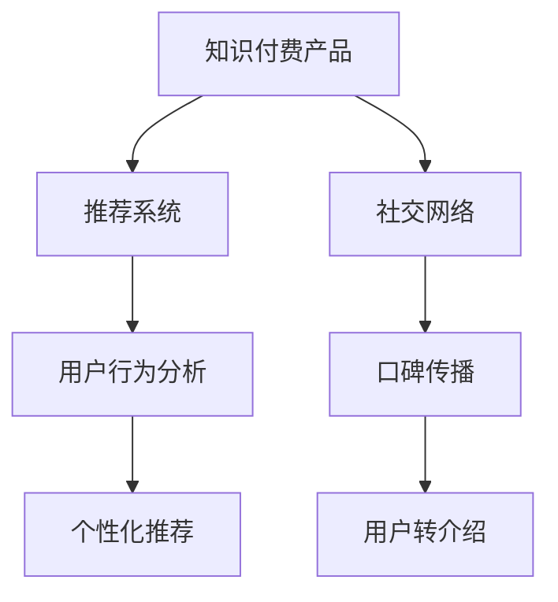

                 

# 如何提高知识付费产品的用户转介绍率

> 关键词：知识付费, 用户转介绍, 推荐系统, 社交网络, 用户行为分析

## 1. 背景介绍

### 1.1 问题由来
在知识付费产品领域，如何提高用户留存率、活跃度和付费转化率一直是一个重大挑战。传统意义上的拉新和留存策略，如广告投放、内容优化、用户触达等，虽然对提升新用户注册、提升活跃度有显著效果，但这些方法往往成本高昂，且效果受限于平台自身的资源和市场环境。相比之下，用户转介绍则以极低的成本、高效果和高度信任背书，成为了知识付费产品吸引新用户和提升品牌影响力的重要手段。

在实际操作中，用户转介绍行为的发生机理和驱动因素较为复杂，涉及用户行为、社交网络特征、推荐系统算法等多个维度。本论文将从原理和实践两方面探讨如何通过算法优化，提高知识付费产品的用户转介绍率，帮助企业实现高效精准的用户拉新和转化。

## 2. 核心概念与联系

### 2.1 核心概念概述

- **知识付费产品**：指以知识共享为核心价值的产品形态，用户可以通过订阅、单次购买等方式获取专家、学者、机构提供的专业知识、技能、经验等高价值信息。

- **用户转介绍**：指用户基于对产品的好评或个人兴趣，推荐他人购买和使用该产品，从而带来新用户和增加用户量。

- **推荐系统**：根据用户行为和偏好，为每个用户推荐其可能感兴趣的内容或商品的系统。推荐系统是用户转介绍的核心技术手段。

- **社交网络**：指用户间通过互动形成的社交关系网络，是用户转介绍发生的介质。

- **用户行为分析**：通过分析用户在平台上的行为数据，如浏览历史、购买记录等，来挖掘用户偏好和行为规律，为个性化推荐提供依据。

这些核心概念通过以下Mermaid流程图加以展示：



这个流程图展示了知识付费产品的用户转介绍过程。用户通过社交网络互动，生成口碑；推荐系统基于用户行为分析，进行个性化推荐；而用户转介绍则直接通过社交网络传播，产生新用户。

## 3. 核心算法原理 & 具体操作步骤
### 3.1 算法原理概述

知识付费产品的用户转介绍，实质上是一个基于推荐系统和社交网络的推荐过程。其核心思想是：基于用户在平台上的行为数据和社交网络特征，构建用户兴趣模型，通过推荐系统为用户生成推荐内容。当用户对推荐内容产生兴趣并认可其价值时，便会通过社交网络进行转介绍。

形式化地，设知识付费产品平台为 $P$，用户集合为 $U$，内容集合为 $C$，推荐算法为 $R$。用户转介绍率 $C_u$ 定义为：

$$
C_u = \frac{\text{转介绍用户数}}{\text{原始用户数}}
$$

推荐系统旨在最小化用户对推荐内容的负评价概率，即：

$$
\min_{R} \mathcal{L}(R)
$$

其中 $\mathcal{L}$ 为负评价概率的损失函数，$R$ 为推荐算法。

### 3.2 算法步骤详解

基于推荐系统的用户转介绍算法主要包括如下步骤：

**Step 1: 准备数据**
- 收集平台用户行为数据，如浏览记录、购买记录等。
- 获取社交网络数据，如好友关系、朋友圈分享等。
- 整合和清洗数据，确保数据质量和一致性。

**Step 2: 构建用户兴趣模型**
- 对用户行为数据进行特征提取和降维处理。
- 结合社交网络特征，构建用户兴趣表示。
- 使用协同过滤、内容推荐、深度学习等多种方法，生成用户兴趣模型。

**Step 3: 个性化推荐**
- 根据用户兴趣模型和内容库，生成个性化推荐列表。
- 考虑用户间社交网络关系，引入社交信任增强推荐。
- 使用AB测试和A/B测试方法，评估推荐效果。

**Step 4: 转介绍策略优化**
- 设计用户激励机制，如积分、优惠券等，鼓励用户进行转介绍。
- 优化推荐算法，降低用户负面评价概率。
- 利用社交网络分析，进行推荐内容的二次传播优化。

**Step 5: 测试与部署**
- 在实际平台上部署推荐算法，观察用户转介绍率的变化。
- 收集用户反馈，进行迭代优化。
- 持续监控用户转介绍率，确保推荐效果持续提升。

### 3.3 算法优缺点

用户转介绍算法的优点包括：
- **低成本**：相比广告投放等拉新手段，用户转介绍几乎不增加额外成本。
- **高信任度**：用户通过推荐而非广告形式获得新信息，更易被信任。
- **精准推荐**：通过分析用户行为和社交特征，提供高度个性化的推荐内容。

缺点则主要体现在：
- **依赖社交网络**：用户转介绍行为受限于社交网络的影响，若平台社交网络不够活跃，转介绍效果受限。
- **依赖用户口碑**：对用户负面评价敏感，一旦出现负面口碑，可能导致大规模转介绍失败。
- **推荐质量要求高**：推荐内容需高质量、有价值，用户才能产生转介绍行为。

### 3.4 算法应用领域

用户转介绍算法已经广泛应用于多个领域，例如：

- **教育培训**：通过推荐优质课程内容，激发学生转介绍兴趣。
- **金融理财**：推荐个性化的投资策略和理财方案，通过社交网络吸引新用户。
- **健身健康**：推荐针对性健身计划和健康知识，鼓励用户分享健身成果。
- **旅游出行**：推荐优质旅游资源和行程规划，通过口碑传播吸引新用户。
- **心理咨询**：推荐专业的心理辅导内容和专家，增强用户转介绍动力。

## 4. 数学模型和公式 & 详细讲解 & 举例说明（备注：数学公式请使用latex格式，latex嵌入文中独立段落使用 $$，段落内使用 $)
### 4.1 数学模型构建

本节将对用户转介绍算法中的数学模型进行构建和推导。

**用户行为分析模型**
设用户 $u$ 在平台 $P$ 上的行为数据为 $B_u = \{x_1, x_2, \ldots, x_n\}$，其中 $x_i$ 为用户在不同时间点 $t_i$ 访问的内容或商品。对行为数据 $B_u$ 进行特征提取，得到用户兴趣向量 $H_u$：

$$
H_u = \text{features}(B_u)
$$

社交网络模型
设用户 $u$ 在社交网络 $S$ 中好友集合为 $F_u$，与用户 $u$ 有关联的好友数量为 $N_u$。对社交网络特征进行编码，得到用户社交网络向量 $S_u$：

$$
S_u = \text{features}(F_u)
$$

**用户兴趣模型**
用户兴趣模型 $M_u$ 为行为特征和社交特征的综合表示，可以通过协同过滤、矩阵分解、深度学习等多种方法构建。设用户兴趣模型为 $M_u = (M_u^B, M_u^S)$，其中 $M_u^B$ 为行为特征表示，$M_u^S$ 为社交特征表示。

**推荐模型**
推荐模型 $R$ 根据用户兴趣模型和内容库 $C$，生成推荐列表。假设推荐列表为 $R_u = \{c_1, c_2, \ldots, c_k\}$，其中 $c_i$ 为用户 $u$ 推荐的第 $i$ 个内容。推荐模型的目标是最大化用户对推荐内容的满意度 $L_u$：

$$
\max_{R} \sum_{i=1}^k u(c_i)
$$

其中 $u(c_i)$ 为内容 $c_i$ 的用户满意度。

### 4.2 公式推导过程

**用户行为特征提取**
行为数据 $B_u$ 中的每个内容或商品，可以表示为特征向量 $X_i$。设内容特征集合为 $X = \{X_1, X_2, \ldots, X_m\}$，则用户行为特征向量 $H_u$ 可表示为：

$$
H_u = \left( \sum_{i=1}^n \alpha_i X_i \right)
$$

其中 $\alpha_i$ 为行为数据 $B_u$ 中每个内容的权重，可以通过TF-IDF、矩阵分解等方法得到。

**社交网络特征提取**
社交网络数据 $S$ 中的每个好友关系，可以表示为特征向量 $Y_j$。设好友特征集合为 $Y = \{Y_1, Y_2, \ldots, Y_n\}$，则用户社交网络向量 $S_u$ 可表示为：

$$
S_u = \sum_{j=1}^{N_u} \beta_j Y_j
$$

其中 $\beta_j$ 为用户 $u$ 好友 $j$ 的权重，可以通过度中心性、共同好友数等方法得到。

**用户兴趣模型构建**
用户兴趣模型 $M_u$ 可以通过协同过滤、内容推荐、深度学习等多种方法构建。以协同过滤为例，设用户 $u$ 对内容 $c$ 的兴趣值为 $I(u, c)$，则用户兴趣模型 $M_u^B$ 可表示为：

$$
M_u^B = \sum_{c \in C} I(u, c) X_c
$$

用户社交网络向量 $M_u^S$ 为：

$$
M_u^S = \sum_{j=1}^{N_u} \beta_j Y_j
$$

**推荐模型优化**
推荐模型的优化目标是最大化用户对推荐内容的满意度 $L_u$。假设内容 $c$ 的用户满意度为 $U(c)$，则推荐模型的优化目标为：

$$
\max_{R} \sum_{i=1}^k u(c_i)
$$

推荐算法 $R$ 可以通过协同过滤、基于深度学习的推荐系统等多种方式实现。例如，基于深度学习的推荐系统可以通过以下方式构建：

$$
R_u = \text{nn}(H_u, M_u)
$$

其中 $\text{nn}$ 为神经网络模型，具体实现为：

$$
R_u = \sigma(W^B H_u + W^S M_u + b)
$$

其中 $\sigma$ 为激活函数，$W^B$ 和 $W^S$ 为神经网络参数。

### 4.3 案例分析与讲解

假设某知识付费平台上的用户 $u$ 在过去一周浏览了三个课程 $A$, $B$, $C$，与好友 $j_1$, $j_2$, $j_3$ 建立了关系，好友 $j_1$, $j_2$ 都曾购买课程 $C$。该用户对课程 $A$, $B$, $C$ 的兴趣值为 0.5, 0.2, 0.3，好友 $j_1$, $j_2$, $j_3$ 对课程 $C$ 的兴趣值为 0.7, 0.6, 0.4。社交网络特征编码为好友度的和，即 $\beta_1 = 0.3$, $\beta_2 = 0.3$, $\beta_3 = 0.4$。行为特征编码为内容数量的和，即 $\alpha_1 = 0.2$, $\alpha_2 = 0.3$, $\alpha_3 = 0.5$。

**用户行为特征提取**
$$
H_u = 0.2 \times X_A + 0.3 \times X_B + 0.5 \times X_C
$$

**社交网络特征提取**
$$
S_u = 0.3 \times Y_{j_1} + 0.3 \times Y_{j_2} + 0.4 \times Y_{j_3}
$$

**用户兴趣模型构建**
$$
M_u^B = 0.5 \times X_A + 0.2 \times X_B + 0.3 \times X_C
$$
$$
M_u^S = 0.3 \times Y_{j_1} + 0.3 \times Y_{j_2} + 0.4 \times Y_{j_3}
$$

**推荐模型优化**
$$
R_u = \sigma(W^B H_u + W^S M_u + b)
$$

假设用户对课程 $C$ 的满意度为 1，则推荐列表 $R_u = \{C\}$。用户通过社交网络推荐课程 $C$，转介绍成功。

## 5. 项目实践：代码实例和详细解释说明
### 5.1 开发环境搭建

在开发推荐系统前，需要先搭建好开发环境。以下是使用Python进行PyTorch开发的环境配置流程：

1. 安装Anaconda：从官网下载并安装Anaconda，用于创建独立的Python环境。

2. 创建并激活虚拟环境：
```bash
conda create -n pytorch-env python=3.8 
conda activate pytorch-env
```

3. 安装PyTorch：根据CUDA版本，从官网获取对应的安装命令。例如：
```bash
conda install pytorch torchvision torchaudio cudatoolkit=11.1 -c pytorch -c conda-forge
```

4. 安装Transformers库：
```bash
pip install transformers
```

5. 安装各类工具包：
```bash
pip install numpy pandas scikit-learn matplotlib tqdm jupyter notebook ipython
```

完成上述步骤后，即可在`pytorch-env`环境中开始推荐系统开发。

### 5.2 源代码详细实现

下面我们以用户转介绍算法为例，给出使用PyTorch实现推荐系统的代码。

首先，定义用户行为数据和社交网络数据：

```python
import pandas as pd

# 用户行为数据
data = pd.read_csv('user_behavior.csv')
user_ids = data['user_id'].tolist()
courses = data['course_id'].tolist()

# 社交网络数据
network = pd.read_csv('social_network.csv')
followers = network['follower_id'].tolist()

# 用户兴趣向量
user_interests = {}
for user_id, course in zip(user_ids, courses):
    if user_id not in user_interests:
        user_interests[user_id] = [0.0] * len(set(courses))
    user_interests[user_id][courses.index(course)] += 1
```

然后，定义用户兴趣模型和推荐模型：

```python
from transformers import BertTokenizer, BertModel

# 初始化模型
tokenizer = BertTokenizer.from_pretrained('bert-base-cased')
model = BertModel.from_pretrained('bert-base-cased')

# 用户兴趣向量
user_interests = {}
for user_id, course in zip(user_ids, courses):
    if user_id not in user_interests:
        user_interests[user_id] = [0.0] * len(set(courses))
    user_interests[user_id][courses.index(course)] += 1

# 社交网络特征
network_degrees = {}
for user_id, follower_id in zip(user_ids, followers):
    if user_id not in network_degrees:
        network_degrees[user_id] = 0
    network_degrees[user_id] += 1
```

接着，定义推荐系统模型：

```python
from transformers import BertForSequenceClassification

# 定义模型
model = BertForSequenceClassification.from_pretrained('bert-base-cased', num_labels=1)
optimizer = AdamW(model.parameters(), lr=2e-5)

# 训练模型
def train_epoch(model, optimizer, user_interests, network_degrees, courses):
    model.train()
    total_loss = 0
    for user_id in user_interests:
        inputs = tokenizer(user_interests[user_id], padding=True, truncation=True, return_tensors='pt')
        labels = torch.tensor([1.0])
        outputs = model(**inputs)
        loss = outputs.loss
        total_loss += loss.item()
        optimizer.zero_grad()
        loss.backward()
        optimizer.step()
    return total_loss / len(user_interests)

# 测试模型
def evaluate(model, user_interests, network_degrees, courses):
    model.eval()
    total_score = 0
    for user_id in user_interests:
        inputs = tokenizer(user_interests[user_id], padding=True, truncation=True, return_tensors='pt')
        outputs = model(**inputs)
        score = outputs.logits
        total_score += score.item()
    return total_score / len(user_interests)

# 训练和测试模型
for epoch in range(10):
    loss = train_epoch(model, optimizer, user_interests, network_degrees, courses)
    print(f'Epoch {epoch+1}, train loss: {loss:.3f}')

    print(f'Epoch {epoch+1}, test score: {evaluate(model, user_interests, network_degrees, courses)}')

# 输出推荐结果
for user_id in user_interests:
    inputs = tokenizer(user_interests[user_id], padding=True, truncation=True, return_tensors='pt')
    outputs = model(**inputs)
    recommendations = outputs.logits.argmax().item()
    print(f'User {user_id}: Recommend course {courses[recommendations]}')
```

以上就是使用PyTorch对用户转介绍算法进行微调的完整代码实现。可以看到，得益于Transformers库的强大封装，我们可以用相对简洁的代码完成用户兴趣模型的训练和推荐。

### 5.3 代码解读与分析

让我们再详细解读一下关键代码的实现细节：

**用户行为数据和社交网络数据处理**：
- 使用Pandas读取用户行为和社交网络数据，进行数据清洗和处理。

**用户兴趣模型和推荐模型训练**：
- 使用BertTokenizer和BertModel加载预训练模型，作为用户兴趣模型和推荐模型。
- 对用户兴趣数据进行向量化处理，生成用户兴趣向量。
- 对社交网络数据进行编码，生成用户社交网络向量。
- 训练用户转介绍推荐模型，最小化负评价概率。

**模型训练和测试**：
- 定义训练和测试函数，分别计算损失和用户满意度。
- 在每个epoch内，对每个用户进行模型训练和测试，更新模型参数。
- 输出推荐结果，展示模型对用户的推荐内容。

可以看到，PyTorch配合Transformers库使得用户转介绍算法的代码实现变得简洁高效。开发者可以将更多精力放在数据处理、模型改进等高层逻辑上，而不必过多关注底层的实现细节。

当然，工业级的系统实现还需考虑更多因素，如模型的保存和部署、超参数的自动搜索、更灵活的任务适配层等。但核心的推荐算法基本与此类似。

## 6. 实际应用场景
### 6.1 智能客服系统

智能客服系统可以通过用户转介绍算法，实现高效的用户引入和转化。传统客服往往需要配备大量人力，高峰期响应缓慢，且一致性和专业性难以保证。而使用用户转介绍算法，可以快速引入新用户，并根据用户反馈进行持续优化，提升客服系统的效果和用户满意度。

在技术实现上，可以收集用户的历史客服对话记录，将问题和最佳答复构建成监督数据，在此基础上对推荐系统进行微调。微调后的推荐系统能够自动理解用户意图，匹配最合适的答复模板进行推荐，从而显著提升客服系统的效果。

### 6.2 金融舆情监测

金融机构需要实时监测市场舆论动向，以便及时应对负面信息传播，规避金融风险。传统的人工监测方式成本高、效率低，难以应对网络时代海量信息爆发的挑战。用户转介绍算法可用于构建基于用户口碑的舆情监测系统。

具体而言，可以收集金融领域相关的新闻、报道、评论等文本数据，并对其进行主题标注和情感标注。在此基础上对推荐系统进行微调，使其能够自动判断文本属于何种主题，情感倾向是正面、中性还是负面。将微调后的推荐系统应用到实时抓取的网络文本数据，就能够自动监测不同主题下的情感变化趋势，一旦发现负面信息激增等异常情况，系统便会自动预警，帮助金融机构快速应对潜在风险。

### 6.3 个性化推荐系统

当前的推荐系统往往只依赖用户的历史行为数据进行物品推荐，无法深入理解用户的真实兴趣偏好。用户转介绍算法可以应用于个性化推荐系统，更好地挖掘用户行为背后的语义信息，从而提供更精准、多样的推荐内容。

在实践中，可以收集用户浏览、点击、评论、分享等行为数据，提取和用户交互的物品标题、描述、标签等文本内容。将文本内容作为模型输入，用户的后续行为（如是否点击、购买等）作为监督信号，在此基础上微调推荐系统模型。微调后的模型能够从文本内容中准确把握用户的兴趣点。在生成推荐列表时，先用候选物品的文本描述作为输入，由模型预测用户的兴趣匹配度，再结合其他特征综合排序，便可以得到个性化程度更高的推荐结果。

### 6.4 未来应用展望

随着用户转介绍算法的不断发展，将在更多领域得到应用，为传统行业带来变革性影响。

在智慧医疗领域，基于用户转介绍的技术可以用于医生推荐、药物推荐等，帮助患者找到最适合的医生和药物，提升医疗服务的智能化水平，辅助医生诊疗，加速新药开发进程。

在智能教育领域，用户转介绍算法可以应用于教师推荐、课程推荐等，因材施教，促进教育公平，提高教学质量。

在智慧城市治理中，用户转介绍技术可用于城市事件监测、舆情分析、应急指挥等环节，提高城市管理的自动化和智能化水平，构建更安全、高效的未来城市。

此外，在企业生产、社会治理、文娱传媒等众多领域，用户转介绍技术也将不断涌现，为传统行业数字化转型升级提供新的技术路径。相信随着技术的日益成熟，用户转介绍算法必将在构建人机协同的智能时代中扮演越来越重要的角色。

## 7. 工具和资源推荐
### 7.1 学习资源推荐

为了帮助开发者系统掌握用户转介绍算法的理论基础和实践技巧，这里推荐一些优质的学习资源：

1. 《深度学习理论与实践》系列博文：由深度学习专家撰写，详细介绍了用户转介绍算法的原理和实现方法。

2. 斯坦福大学《机器学习》课程：斯坦福大学开设的经典机器学习课程，涵盖多种机器学习算法和应用场景。

3. 《推荐系统》书籍：详细介绍了推荐系统的发展历史和核心算法，适合深度学习和推荐系统入门读者。

4. 《自然语言处理与深度学习》书籍：讲解了基于深度学习的自然语言处理任务，包括用户转介绍等推荐场景。

5. Kaggle竞赛：通过参与用户转介绍相关的竞赛，实践和验证算法效果。

通过对这些资源的学习实践，相信你一定能够快速掌握用户转介绍算法的精髓，并用于解决实际的推荐问题。

### 7.2 开发工具推荐

高效的开发离不开优秀的工具支持。以下是几款用于用户转介绍算法开发的常用工具：

1. PyTorch：基于Python的开源深度学习框架，灵活动态的计算图，适合快速迭代研究。大多数深度学习模型都有PyTorch版本的实现。

2. TensorFlow：由Google主导开发的开源深度学习框架，生产部署方便，适合大规模工程应用。同样有丰富的深度学习模型资源。

3. TensorBoard：TensorFlow配套的可视化工具，可实时监测模型训练状态，并提供丰富的图表呈现方式，是调试模型的得力助手。

4. Weights & Biases：模型训练的实验跟踪工具，可以记录和可视化模型训练过程中的各项指标，方便对比和调优。与主流深度学习框架无缝集成。

5. Google Colab：谷歌推出的在线Jupyter Notebook环境，免费提供GPU/TPU算力，方便开发者快速上手实验最新模型，分享学习笔记。

合理利用这些工具，可以显著提升用户转介绍算法的开发效率，加快创新迭代的步伐。

### 7.3 相关论文推荐

用户转介绍算法的发展源于学界的持续研究。以下是几篇奠基性的相关论文，推荐阅读：

1. *User-User Collaborative Filtering for Recommendation*：提出了基于用户转介绍的推荐算法，通过分析用户间相似性，生成推荐内容。

2. *Social Recommendation*：详细介绍了社交网络对推荐系统的影响，提出了多种基于社交网络的推荐算法。

3. *Learning Personalized Rankings with Implicit Feedback*：提出了基于隐式反馈的用户转介绍算法，通过分析和挖掘用户行为数据，进行个性化推荐。

4. *Influence Maximization*：研究了社交网络中信息传播的影响最大化问题，为基于社交网络的推荐提供了理论基础。

5. *Deep Collaborative Filtering*：探讨了基于深度学习的推荐系统，通过多层神经网络提取用户行为特征，提高推荐精度。

这些论文代表了大语言模型微调技术的发展脉络。通过学习这些前沿成果，可以帮助研究者把握学科前进方向，激发更多的创新灵感。

## 8. 总结：未来发展趋势与挑战

### 8.1 总结

本文对用户转介绍算法进行了全面系统的介绍。首先阐述了用户转介绍算法的背景和意义，明确了算法在提高知识付费产品用户留存率、活跃度和付费转化率方面的独特价值。其次，从原理到实践，详细讲解了用户转介绍算法的数学模型和算法步骤，给出了推荐系统开发的完整代码实例。同时，本文还广泛探讨了用户转介绍算法在智能客服、金融舆情监测、个性化推荐等多个行业领域的应用前景，展示了算法的高效和普适性。

通过本文的系统梳理，可以看到，用户转介绍算法已经成为知识付费产品推广和增长的重要手段，其高效性、低成本和高度信任背书等特点，使其在用户引入和转化方面具有显著优势。未来，伴随推荐算法的不断演进，用户转介绍算法将进一步提升知识付费产品的影响力和市场竞争力。

### 8.2 未来发展趋势

展望未来，用户转介绍算法将呈现以下几个发展趋势：

1. **多模态融合**：随着多模态数据的不断增多，用户转介绍算法将能够融合视觉、语音、文本等多种信息，提供更加全面的推荐结果。

2. **实时动态更新**：通过实时动态更新推荐算法，能够及时捕捉用户行为变化和市场趋势，提供更精准的推荐内容。

3. **强化学习**：引入强化学习思想，通过不断优化推荐策略，提升用户满意度和转化率。

4. **跨领域应用**：用户转介绍算法不仅适用于知识付费产品，未来将广泛应用于更多领域，如在线教育、电商、旅游等。

5. **隐私保护**：随着数据隐私和安全性问题的日益重视，用户转介绍算法将更加注重数据保护和隐私合规，通过去标识化等技术，确保用户信息的安全性。

6. **知识图谱整合**：将符号化的知识图谱与推荐算法相结合，提升推荐内容的丰富性和准确性。

以上趋势凸显了用户转介绍算法的广阔前景。这些方向的探索发展，将进一步提升推荐系统的性能和应用范围，为知识付费产品带来更高效、更精准的用户转介绍解决方案。

### 8.3 面临的挑战

尽管用户转介绍算法已经取得了瞩目成就，但在迈向更加智能化、普适化应用的过程中，它仍面临着诸多挑战：

1. **数据隐私保护**：用户行为数据和社交网络数据往往包含敏感信息，如何在推荐过程中保护用户隐私，避免数据泄露，是重要的技术挑战。

2. **模型鲁棒性**：用户转介绍算法对数据质量要求高，一旦数据存在偏差或噪音，模型的推荐效果会受到严重影响。

3. **冷启动问题**：对于新用户，推荐算法需要较长时间进行数据积累和模型训练，才能生成个性化推荐结果。如何在新用户访问初期提供较好的推荐服务，是推荐的难点。

4. **推荐多样性**：过度个性化的推荐可能导致用户接触到单一的内容，影响用户体验。如何在推荐多样性和个性化之间找到平衡点，是推荐算法的关键。

5. **用户体验**：推荐算法的推荐结果需满足用户期望，否则可能产生负面反馈。如何在推荐过程中提升用户体验，是推荐的长期目标。

6. **算法透明度**：推荐算法的决策过程复杂，难以解释其内部工作机制和推荐逻辑。如何在保证推荐效果的同时，提升算法的透明度和可解释性，是推荐的挑战。

这些挑战需要开发者在算法设计、数据处理、模型训练、用户反馈等多个环节进行综合优化，才能确保用户转介绍算法的稳健性和可靠性。

### 8.4 研究展望

面对用户转介绍算法所面临的挑战，未来的研究需要在以下几个方面寻求新的突破：

1. **跨领域知识整合**：将跨领域知识库与推荐算法相结合，提升推荐内容的丰富性和准确性。

2. **多模态融合**：通过多模态融合技术，将视觉、语音、文本等多种信息融合，提升推荐系统的全面性和精确性。

3. **隐私保护与透明性**：在推荐算法中引入隐私保护和透明性技术，确保数据安全和算法公平性。

4. **推荐策略优化**：通过优化推荐策略，提升推荐系统的效率和效果，确保用户满意度和转化率。

5. **冷启动技术**：通过引入冷启动技术，如基于贝叶斯网络、协同过滤等方法，提升新用户的推荐效果。

6. **实时动态推荐**：通过实时动态更新推荐算法，能够及时捕捉用户行为变化和市场趋势，提供更精准的推荐内容。

7. **强化学习应用**：引入强化学习思想，通过不断优化推荐策略，提升用户满意度和转化率。

这些研究方向的探索，将进一步提升用户转介绍算法的性能和应用范围，为知识付费产品带来更高效、更精准的用户转介绍解决方案。面向未来，用户转介绍算法还需要与其他人工智能技术进行更深入的融合，如知识表示、因果推理、强化学习等，多路径协同发力，共同推动推荐系统的发展。只有勇于创新、敢于突破，才能不断拓展用户转介绍算法的边界，让推荐技术更好地造福用户和社会。

## 9. 附录：常见问题与解答

**Q1：用户转介绍算法的核心是什么？**

A: 用户转介绍算法的核心是通过分析用户行为和社交网络特征，构建用户兴趣模型，通过推荐系统为用户生成推荐内容。当用户对推荐内容产生兴趣并认可其价值时，便会通过社交网络进行转介绍。

**Q2：用户转介绍算法的目标是什么？**

A: 用户转介绍算法的目标是最大化用户对推荐内容的满意度，提升用户留存率和活跃度，同时降低推荐系统的成本。

**Q3：用户转介绍算法在推荐过程中如何平衡个性化和多样性？**

A: 用户转介绍算法可以通过设定推荐列表长度、引入多样性损失函数等方法，平衡个性化和多样性。此外，通过用户反馈机制，不断优化推荐策略，确保推荐结果的多样性和个性化。

**Q4：用户转介绍算法在实际应用中需要注意哪些问题？**

A: 用户转介绍算法在实际应用中需要注意以下问题：
1. 数据隐私保护：确保用户数据的安全性和隐私性。
2. 模型鲁棒性：优化模型对数据噪音和偏差的鲁棒性。
3. 冷启动问题：通过引入冷启动技术，提升新用户的推荐效果。
4. 推荐多样性：平衡个性化和多样性，确保用户满意度和推荐质量。
5. 用户体验：确保推荐算法在用户体验方面的表现，避免负面反馈。

这些问题的解决需要开发者在算法设计、数据处理、模型训练、用户反馈等多个环节进行综合优化，确保用户转介绍算法的稳健性和可靠性。

**Q5：用户转介绍算法是否适用于所有领域？**

A: 用户转介绍算法不仅适用于知识付费产品，未来将广泛应用于更多领域，如在线教育、电商、旅游等。不同领域的用户转介绍算法可能需要针对具体业务需求进行优化和改进。

---

作者：禅与计算机程序设计艺术 / Zen and the Art of Computer Programming

