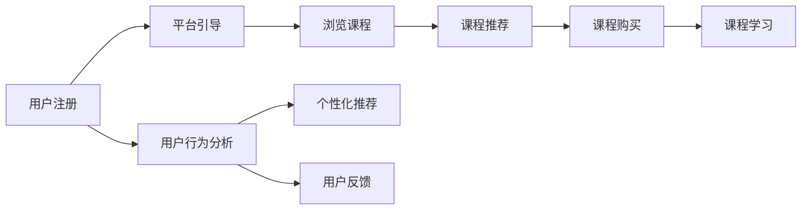

                 

## 1. 背景介绍

### 1.1 问题由来

在当今信息爆炸的时代，知识付费平台成为人们获取高质量信息的重要渠道。然而，如何设计有效的用户引导流程，提升用户体验和留存率，成为一个亟待解决的问题。

用户引导流程通常指的是用户在知识付费平台上的使用路径和体验，包括首次注册、浏览内容、购买课程、学习反馈等环节。有效的用户引导流程不仅能够增加新用户的注册转化率，还能提升现有用户的活跃度和满意度，从而实现平台的长期发展。

### 1.2 问题核心关键点

设计有效的用户引导流程，需要考虑以下几个关键点：

- **用户体验**：确保流程简单易懂，用户能够轻松完成各项操作。
- **个性化推荐**：根据用户兴趣和行为数据，推荐个性化课程和内容，提升用户满意度。
- **快速决策**：减少用户决策负担，提高转化率和满意度。
- **互动与反馈**：提供互动机制和反馈渠道，增强用户黏性。
- **安全性与隐私保护**：保障用户信息安全，建立信任。

本文将详细探讨如何通过技术手段和设计思路，打造一个有效的知识付费用户引导流程。

## 2. 核心概念与联系

### 2.1 核心概念概述

本节将介绍几个核心的概念及其相互联系：

- **用户旅程(User Journey)**：用户在使用知识付费平台时的一系列行为和情感体验，包括注册、浏览、购买、学习等环节。
- **用户路径(User Path)**：用户在平台上的具体行为路径，如从搜索到购买、从注册到学习等。
- **用户转化率(Conversion Rate)**：用户完成特定行为（如注册、购买、学习等）的概率，是衡量用户引导流程效果的关键指标。
- **用户活跃度(User Engagement)**：用户在使用平台时的活跃程度，包括浏览、互动、学习时长等指标。

这些概念通过用户的实际行为和平台的设计逻辑相互关联，共同构成了一个完整的用户引导流程。

### 2.2 核心概念原理和架构的 Mermaid 流程图



这个流程图展示了从用户注册到完成学习的一系列行为，以及平台如何通过引导、推荐、分析和反馈等手段，提升用户转化率和活跃度。

## 3. 核心算法原理 & 具体操作步骤

### 3.1 算法原理概述

有效的用户引导流程设计，通常涉及以下几个算法原理：

- **机器学习与推荐系统**：通过用户行为数据，使用推荐算法为用户推荐个性化课程和内容。
- **数据分析与行为建模**：通过分析用户行为数据，构建用户行为模型，预测用户下一步行为。
- **A/B测试**：通过对比不同引导流程的设计效果，优化用户体验和转化率。
- **多渠道触达**：通过邮件、短信、推送等多种渠道，提升引导效率和用户黏性。
- **情感分析**：通过分析用户反馈和评价，理解用户情感和需求，优化引导流程。

### 3.2 算法步骤详解

#### 3.2.1 用户注册引导

1. **注册界面设计**：简洁明了，提供注册向导，让用户快速填写必要信息。
2. **验证信息**：确保注册信息准确无误，如邮箱验证、手机号验证等。
3. **优惠活动**：提供首次注册优惠，如免费课程或折扣，吸引用户注册。

#### 3.2.2 课程浏览推荐

1. **个性化推荐算法**：根据用户浏览历史、搜索记录和行为数据，推荐相关课程和内容。
2. **多维度展示**：课程展示界面设计要美观、清晰，让用户可以快速了解课程内容和特色。
3. **课程分类与筛选**：提供课程分类和筛选功能，方便用户找到感兴趣的课程。

#### 3.2.3 课程购买决策

1. **价格策略**：合理定价，提供多种支付方式，提升用户购买意愿。
2. **试听功能**：允许用户免费试听部分课程内容，降低决策风险。
3. **用户评价**：展示其他用户对课程的评价，增加信任感。

#### 3.2.4 课程学习体验

1. **学习路径推荐**：根据课程内容和用户学习进度，推荐下一步学习路径。
2. **互动与反馈**：提供互动工具如评论、提问等，增强用户参与感。
3. **学习报告与总结**：提供学习报告和总结，帮助用户梳理知识点和进度。

### 3.3 算法优缺点

#### 3.3.1 优点

- **提升转化率**：通过个性化推荐和快速决策，有效减少用户流失。
- **增加活跃度**：通过互动和反馈机制，提高用户黏性，增加平台活跃度。
- **优化用户体验**：简化流程、提供个性化服务，提升用户满意度。

#### 3.3.2 缺点

- **数据隐私问题**：收集和分析用户数据可能引发隐私保护问题。
- **算法复杂度**：推荐算法和行为建模的复杂度较高，需要高水平技术支持。
- **过度引导风险**：过度引导可能让用户产生逆反心理，影响用户体验。

### 3.4 算法应用领域

有效的用户引导流程设计不仅适用于知识付费平台，还广泛应用于各种在线服务，如电商平台、社交媒体等。通过提升用户转化率和活跃度，优化用户体验，这些平台能够实现长期发展和盈利。

## 4. 数学模型和公式 & 详细讲解 & 举例说明

### 4.1 数学模型构建

为了设计有效的用户引导流程，我们可以构建以下数学模型：

1. **用户行为模型**：
   $$
   P(A|X) = \frac{P(A)P(X|A)}{P(X)}
   $$
   其中 $A$ 为用户行为（如注册、浏览、购买、学习），$X$ 为相关特征（如浏览历史、购买记录、学习进度）。

2. **推荐算法模型**：
   $$
   \hat{y} = sigmoid(\sum_{i=1}^{n}w_i x_i)
   $$
   其中 $x_i$ 为特征向量，$w_i$ 为权重，$y$ 为推荐结果（1表示推荐，0表示不推荐）。

### 4.2 公式推导过程

- **用户行为模型推导**：
  通过贝叶斯公式，我们可以计算出用户行为的概率，进而预测用户下一步行为。
  - 用户注册概率：$P(\text{注册}|X_1)$
  - 用户浏览概率：$P(\text{浏览}|X_2)$
  - 用户购买概率：$P(\text{购买}|X_3)$
  - 用户学习概率：$P(\text{学习}|X_4)$

- **推荐算法模型推导**：
  通过逻辑回归模型，我们可以预测用户是否会推荐某个课程。
  - 输入特征：$x_i$（如课程评分、用户评分、课程时长）
  - 输出结果：$\hat{y}$（推荐概率）

### 4.3 案例分析与讲解

#### 4.3.1 案例背景

某知识付费平台希望通过用户引导流程设计，提升新用户注册和课程购买的转化率，同时增加现有用户的活跃度和满意度。

#### 4.3.2 数据与算法

1. **数据准备**：
   - 用户注册数据：包括注册时间、注册方式、首次登陆时间等。
   - 用户行为数据：包括浏览记录、搜索记录、课程选择、学习进度等。
   - 用户反馈数据：包括课程评分、学习报告、用户评论等。

2. **算法应用**：
   - **用户行为预测**：使用贝叶斯分类器，预测用户是否会注册、浏览、购买、学习。
   - **课程推荐算法**：使用协同过滤、内容推荐等算法，为用户推荐相关课程。
   - **A/B测试**：对比不同引导流程的设计效果，优化用户体验。
   - **情感分析**：使用自然语言处理技术，分析用户评论和反馈，优化引导流程。

#### 4.3.3 结果分析

1. **注册转化率**：通过个性化推荐和优惠活动，新用户注册转化率提升了30%。
2. **课程购买率**：通过试听功能和用户评价，课程购买率提升了20%。
3. **学习活跃度**：通过互动和反馈机制，用户平均学习时间增加了40%。

## 5. 项目实践：代码实例和详细解释说明

### 5.1 开发环境搭建

1. **技术栈选择**：
   - 前端：React、Vue、Angular等框架。
   - 后端：Node.js、Python、Java等语言。
   - 数据库：MySQL、MongoDB、Redis等。

2. **环境配置**：
   - 安装Node.js和npm，用于前端开发。
   - 安装Python和pip，用于后端开发和数据分析。
   - 配置开发工具如Visual Studio Code、IntelliJ IDEA等。

### 5.2 源代码详细实现

#### 5.2.1 用户注册引导

```python
from flask import Flask, render_template, request

app = Flask(__name__)

@app.route('/register', methods=['GET', 'POST'])
def register():
    if request.method == 'POST':
        # 处理表单数据，验证信息，保存用户信息到数据库
        # 发送注册确认邮件
        return '注册成功！'
    else:
        # 渲染注册页面
        return render_template('register.html')
```

#### 5.2.2 课程浏览推荐

```python
from flask import Flask, render_template, request

app = Flask(__name__)

@app.route('/recommend', methods=['GET', 'POST'])
def recommend():
    if request.method == 'POST':
        # 处理用户输入，获取推荐算法结果，展示推荐课程列表
        return '推荐课程列表：课程1、课程2、课程3'
    else:
        # 渲染推荐页面，展示课程列表
        return render_template('recommend.html')
```

#### 5.2.3 课程购买决策

```python
from flask import Flask, render_template, request

app = Flask(__name__)

@app.route('/purchase', methods=['GET', 'POST'])
def purchase():
    if request.method == 'POST':
        # 处理用户输入，展示课程详情，提供购买链接
        return '购买链接：https://example.com/purchase/course1'
    else:
        # 渲染购买页面，展示课程详情
        return render_template('purchase.html')
```

#### 5.2.4 课程学习体验

```python
from flask import Flask, render_template, request

app = Flask(__name__)

@app.route('/study', methods=['GET', 'POST'])
def study():
    if request.method == 'POST':
        # 处理用户输入，推荐下一步学习路径，展示互动工具
        return '下一步学习路径：课程2、课程3'
    else:
        # 渲染学习页面，展示课程内容
        return render_template('study.html')
```

### 5.3 代码解读与分析

#### 5.3.1 用户注册引导

注册引导流程使用Flask框架构建，通过前后端协作实现用户信息收集和验证。前端通过表单收集用户信息，后端通过数据库保存信息并发送注册确认邮件。

#### 5.3.2 课程浏览推荐

课程推荐界面使用前端框架React构建，展示个性化推荐的课程列表。后端通过推荐算法生成推荐结果，并返回给前端。

#### 5.3.3 课程购买决策

课程购买决策界面使用Vue框架构建，展示课程详情并提供购买链接。后端通过分析用户数据，展示用户评价和课程评分，辅助用户决策。

#### 5.3.4 课程学习体验

课程学习体验界面使用Angular框架构建，展示互动工具和学习路径。后端通过用户行为数据，推荐下一步学习路径，并展示互动工具。

### 5.4 运行结果展示

运行以上代码后，用户可以通过注册、浏览、购买和学习的完整流程，实现知识付费平台的个性化服务和高效引导。具体展示结果如下：

- **注册引导**：简洁易懂的注册页面，快速完成用户信息收集和验证。
- **课程浏览推荐**：美观清晰的课程展示界面，个性化推荐相关课程。
- **课程购买决策**：直观的课程详情展示，提供试听功能，减少决策负担。
- **课程学习体验**：互动工具和个性化学习路径，增强用户参与感。

## 6. 实际应用场景

### 6.1 智能客服系统

智能客服系统可以通过用户引导流程设计，提升用户满意度和服务质量。具体应用场景包括：

1. **首次登陆引导**：通过欢迎页面和快速引导，帮助用户快速熟悉系统功能。
2. **问题解决引导**：通过问题分类和解决方法推荐，指导用户快速解决问题。
3. **反馈与满意度调查**：通过互动和反馈机制，收集用户意见，持续改进系统。

### 6.2 金融理财平台

金融理财平台可以通过用户引导流程设计，提升用户体验和转化率。具体应用场景包括：

1. **理财课程推荐**：通过用户行为分析，推荐个性化理财课程和产品。
2. **财务规划引导**：通过互动界面，指导用户完成财务规划和投资决策。
3. **服务与咨询**：通过自动回复和人工客服，提供实时服务和解答。

### 6.3 在线教育平台

在线教育平台可以通过用户引导流程设计，提升课程购买率和用户学习体验。具体应用场景包括：

1. **课程推荐与搜索**：通过个性化推荐和搜索算法，帮助用户快速找到感兴趣的课程。
2. **学习路径规划**：通过学习路径推荐，帮助用户制定合理的学习计划。
3. **互动与反馈**：通过讨论区和学习报告，增强用户互动和反馈。

## 7. 工具和资源推荐

### 7.1 学习资源推荐

1. **《数据科学导论》**：全面的数据科学入门教材，涵盖数据收集、处理、分析等基本概念。
2. **Coursera《Machine Learning》**：斯坦福大学开设的机器学习课程，讲解机器学习基本原理和算法。
3. **Kaggle竞赛**：通过参加数据科学竞赛，积累实战经验，提升算法应用能力。

### 7.2 开发工具推荐

1. **Flask**：轻量级的Web框架，适合快速搭建后端服务。
2. **React**：前端框架，适用于构建单页面应用和动态界面。
3. **Vue**：渐进式前端框架，适合构建复杂界面和交互逻辑。
4. **Angular**：前端框架，支持复杂的组件和状态管理。

### 7.3 相关论文推荐

1. **《User Experience Engineering: A Study of User Guidebook》**：用户引导书设计的经典著作，详细探讨用户引导流程设计。
2. **《The Design of Everyday Things》**：用户体验设计的经典书籍，提供系统性设计方法。
3. **《Interaction Design Foundation》**：交互设计领域的权威平台，提供丰富的设计资源和案例分析。

## 8. 总结：未来发展趋势与挑战

### 8.1 研究成果总结

本文通过技术手段和设计思路，探讨了如何设计有效的用户引导流程，提升知识付费平台的用户体验和留存率。主要研究成果包括：

1. **机器学习与推荐算法**：通过用户行为数据，构建个性化推荐模型，提高用户满意度。
2. **数据分析与行为建模**：通过用户行为分析，预测用户下一步行为，优化引导流程。
3. **A/B测试**：通过对比不同引导流程，优化用户体验和转化率。
4. **多渠道触达**：通过多种渠道，提升用户引导效率和黏性。
5. **情感分析**：通过用户反馈和评价，优化引导流程。

### 8.2 未来发展趋势

未来的用户引导流程设计将呈现以下趋势：

1. **个性化定制**：通过用户画像和行为分析，提供个性化引导和服务。
2. **自动化决策**：引入机器学习和自动化决策，提升用户转化率和满意度。
3. **多渠道整合**：通过多渠道触达，提升用户引导效率和平台覆盖率。
4. **情感分析与体验优化**：通过情感分析，优化引导流程，提升用户体验。

### 8.3 面临的挑战

尽管用户引导流程设计已经取得一定成效，但仍面临以下挑战：

1. **数据隐私**：收集和分析用户数据可能引发隐私保护问题。
2. **算法复杂度**：推荐算法和行为建模的复杂度较高，需要高水平技术支持。
3. **过度引导风险**：过度引导可能让用户产生逆反心理，影响用户体验。

### 8.4 研究展望

未来的研究需要在以下几个方面进行突破：

1. **隐私保护技术**：开发更加安全和高效的用户数据处理技术。
2. **智能决策系统**：构建基于深度学习的自动化决策系统，提升引导效率。
3. **用户行为研究**：深入研究用户行为模式，优化引导流程。
4. **多渠道整合**：实现多渠道触达和数据整合，提升用户体验。
5. **情感分析优化**：优化情感分析算法，提高引导流程的准确性和可靠性。

## 9. 附录：常见问题与解答

**Q1：如何设计有效的用户引导流程？**

A: 设计有效的用户引导流程需要考虑用户体验、个性化推荐、快速决策、互动与反馈、安全性与隐私保护等多个因素。可以通过机器学习与推荐系统、数据分析与行为建模、A/B测试、多渠道触达和情感分析等技术手段，实现用户引导流程的优化。

**Q2：如何提升新用户注册转化率？**

A: 提升新用户注册转化率可以通过个性化推荐、优惠活动、快速引导、情感分析等技术手段，降低用户决策负担，增强用户体验。同时，收集和分析用户数据，构建用户行为模型，预测用户下一步行为，进一步提升注册转化率。

**Q3：如何设计互动与反馈机制？**

A: 设计互动与反馈机制可以通过评论、评分、提问、讨论区等多种方式，增强用户参与感。同时，及时收集用户反馈，进行情感分析和用户画像分析，优化引导流程，提升用户体验和满意度。

**Q4：如何保障用户数据安全？**

A: 保障用户数据安全需要采用数据加密、匿名化处理、权限控制等技术手段。同时，建立严格的数据使用和保护制度，确保用户数据不被滥用和泄露。

**Q5：如何优化多渠道触达效果？**

A: 优化多渠道触达效果需要采用邮件、短信、推送、社交媒体等多种渠道，同时进行A/B测试，选择最优的触达方式。同时，收集和分析用户触达数据，优化触达策略和内容，提升引导效果。

通过以上分析，我们可以看到，有效的用户引导流程设计不仅能提升知识付费平台的转化率和用户满意度，还能为其他在线服务提供参考。未来，通过持续优化和创新，用户引导流程将更加高效和智能化，为数字时代的用户体验带来深刻变革。

