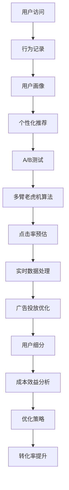

                 

# 如何进行有效的付费转化

> 关键词：付费转化, 用户行为分析, 个性化推荐, A/B测试, 多臂老虎机算法, 点击率预估, 实时数据处理, 广告投放优化, 用户细分, 成本效益分析

## 1. 背景介绍

在当今数字化时代，企业越来越依赖在线渠道进行产品或服务的销售和推广。然而，如何从流量转化为付费用户，成为了每个企业面临的重大挑战。据统计，全球大部分在线企业的转化率都在2%至5%之间，而成功的转化策略往往需要投入大量人力和资源，且转化效果难以持续稳定。本文旨在探讨如何进行有效的付费转化，从理论到实践，提供系统性的解决方案。

## 2. 核心概念与联系

### 2.1 核心概念概述

要理解如何进行有效的付费转化，首先需明确几个核心概念：

- **付费转化**：指用户在访问网站或应用后，通过购买或注册等方式完成的一次性付费行为。
- **用户行为分析**：通过分析用户行为数据，发现并预测用户购买意向，从而制定精准的营销策略。
- **个性化推荐**：根据用户的历史行为、兴趣和偏好，推送符合其需求的产品或服务，提升转化率。
- **A/B测试**：通过对比两个或多个版本的用户界面或策略，评估其效果，选择最优方案。
- **多臂老虎机算法**：一种在多维变量环境下最大化奖励的决策算法，适用于个性化推荐和广告投放优化。
- **点击率预估**：通过机器学习模型，预测用户点击广告或链接的概率，优化广告投放策略。
- **实时数据处理**：对动态变化的业务数据进行快速处理和分析，做出实时决策。
- **广告投放优化**：通过不断调整广告投放参数，提高广告效果和转化率。
- **用户细分**：根据用户的属性、行为和历史数据，将用户分为不同的细分市场，进行有针对性的营销。
- **成本效益分析**：评估营销活动的效果，衡量投入产出比，确保营销资源的高效利用。

这些概念通过一系列的逻辑链条相互联系，形成了一个完整用户付费转化的决策闭环。

### 2.2 核心概念原理和架构的 Mermaid 流程图



该流程图示意了从用户访问到最终转化率的提升过程，每一步都至关重要。接下来，我们将详细介绍每个环节的算法原理和具体操作步骤。

## 3. 核心算法原理 & 具体操作步骤

### 3.1 算法原理概述

用户付费转化过程涉及多个环节，包括用户行为分析、个性化推荐、A/B测试、多臂老虎机算法、点击率预估、实时数据处理、广告投放优化、用户细分、成本效益分析等。这些环节紧密相关，共同构成了一个复杂的决策系统。

### 3.2 算法步骤详解

#### 3.2.1 用户行为分析

用户行为分析是理解用户需求和购买意向的基础。通过记录和分析用户在网站或应用上的行为数据，如页面浏览时间、点击次数、浏览路径等，可以发现潜在的高价值用户群体。例如，在电商平台，通过分析用户对商品页面停留时间的长短，可以初步判断用户对商品的兴趣程度。

**操作步骤**：
1. **数据收集**：利用网站或应用后台的数据记录工具，收集用户行为数据。
2. **行为建模**：使用机器学习算法，如K-means聚类、协同过滤等，对用户行为进行建模，形成用户画像。
3. **行为预测**：使用深度学习模型，如RNN、LSTM等，预测用户未来的行为，如点击购买等。

#### 3.2.2 个性化推荐

个性化推荐能够显著提升用户对产品的接受度和转化率。通过分析用户历史行为和偏好，向其推送符合其兴趣的产品或服务。例如，在电商平台上，用户浏览了某件商品后，系统会推荐类似商品或相关商品。

**操作步骤**：
1. **特征提取**：提取用户行为特征，如浏览记录、购买记录、收藏记录等。
2. **模型训练**：使用协同过滤、深度学习等算法，训练个性化推荐模型。
3. **推荐生成**：根据用户特征和推荐模型，生成个性化推荐结果。

#### 3.2.3 A/B测试

A/B测试是一种通过对比两个或多个版本的用户界面或策略，评估其效果的方法。通过不断优化用户界面和营销策略，提升转化率。例如，测试不同颜色的按钮对点击率的影响。

**操作步骤**：
1. **假设设定**：设定两个或多个不同的版本（A和B）。
2. **样本划分**：将用户随机分配到A组和B组。
3. **效果评估**：对比A组和B组的转化效果，选择最优方案。

#### 3.2.4 多臂老虎机算法

多臂老虎机算法是一种在多维变量环境下最大化奖励的决策算法。在个性化推荐和广告投放优化中，通过不断调整各选项（如不同广告、推荐商品等）的参数，选择最优的策略。例如，在广告投放中，测试不同广告素材的效果，选择表现最好的广告进行投放。

**操作步骤**：
1. **初始化参数**：设定各选项（广告、推荐商品等）的初始参数。
2. **策略评估**：根据用户行为数据，评估各选项的效果。
3. **策略调整**：调整各选项的参数，选择最优策略。

#### 3.2.5 点击率预估

点击率预估通过机器学习模型，预测用户点击广告或链接的概率。优化广告投放策略，提高广告效果和转化率。例如，预测某广告素材在不同用户群体上的点击率，选择效果最好的广告素材进行投放。

**操作步骤**：
1. **数据收集**：收集用户广告点击数据。
2. **模型训练**：使用逻辑回归、决策树等算法，训练点击率预估模型。
3. **效果评估**：评估模型在不同用户群体上的预测效果。

#### 3.2.6 实时数据处理

实时数据处理对动态变化的业务数据进行快速处理和分析，做出实时决策。例如，在电商平台上，实时监测商品销量，调整库存和价格策略。

**操作步骤**：
1. **数据采集**：通过API或数据流，实时采集业务数据。
2. **数据处理**：使用流式计算框架，如Apache Kafka、Apache Flink等，处理和分析数据。
3. **决策执行**：根据分析结果，执行实时决策。

#### 3.2.7 广告投放优化

广告投放优化通过不断调整广告投放参数，提高广告效果和转化率。例如，调整广告位置、广告预算、投放时间等参数，选择最优的广告投放策略。

**操作步骤**：
1. **投放策略**：设定广告投放策略，如预算、时间、位置等。
2. **效果评估**：评估广告投放效果，如点击率、转化率等。
3. **策略调整**：调整广告投放策略，选择最优策略。

#### 3.2.8 用户细分

用户细分根据用户的属性、行为和历史数据，将用户分为不同的细分市场，进行有针对性的营销。例如，在电商平台上，将用户分为新用户、老用户、高价值用户等不同群体，进行有针对性的推广活动。

**操作步骤**：
1. **用户分组**：根据用户属性、行为和历史数据，将用户分为不同的群体。
2. **细分策略**：为每个用户群体制定不同的营销策略。
3. **效果评估**：评估细分策略的效果，调整策略。

#### 3.2.9 成本效益分析

成本效益分析评估营销活动的效果，衡量投入产出比，确保营销资源的高效利用。例如，在电商平台上，评估推广活动带来的销售收入和广告成本，计算ROI。

**操作步骤**：
1. **成本计算**：计算推广活动的各项成本。
2. **收入计算**：计算推广活动带来的销售收入。
3. **效果评估**：评估推广活动的ROI，选择最优方案。

### 3.3 算法优缺点

**优点**：
1. **精准性高**：通过数据分析和机器学习，可以精准预测用户行为和需求，制定有效的营销策略。
2. **可扩展性强**：算法和模型可以在大规模数据上训练，适用于各种业务场景。
3. **实时性强**：通过实时数据处理和动态优化，可以及时调整策略，提高转化率。

**缺点**：
1. **数据需求高**：需要大量高质量的数据，才能得到精准的预测和推荐。
2. **模型复杂度大**：算法和模型需要复杂的训练和调整，维护成本较高。
3. **隐私风险**：在处理用户数据时，需要注意隐私保护和数据安全。

### 3.4 算法应用领域

这些算法和技术广泛应用于各种业务场景，如电商、金融、媒体、教育等。在电商领域，用户行为分析、个性化推荐和广告投放优化是最常见应用；在金融领域，点击率预估和多臂老虎机算法可以优化贷款审批流程；在媒体领域，实时数据处理和用户细分可以提升内容推荐效果；在教育领域，A/B测试和成本效益分析可以优化在线课程推广策略。

## 4. 数学模型和公式 & 详细讲解 & 举例说明

### 4.1 数学模型构建

**用户行为分析**：
用户行为数据可以表示为$x=\{(x_1, y_1), (x_2, y_2), ..., (x_n, y_n)\}$，其中$x$为用户行为特征，$y$为用户行为标签。例如，电商平台的用户浏览记录可以表示为$x=(浏览时间, 点击次数, 浏览路径)$，$y=购买与否$。

**个性化推荐**：
个性化推荐模型可以表示为$f(x)=\sum_{i=1}^n w_i \cdot f_i(x)$，其中$w_i$为各特征权重，$f_i(x)$为特征$i$对应的模型预测值。例如，在协同过滤算法中，$f_i(x)$可以表示为$x$与其他用户的相似度。

**A/B测试**：
A/B测试可以表示为$A(n, c_1, c_2)$，其中$n$为样本数量，$c_1$为A组用户数，$c_2$为B组用户数。测试效果可以通过对比A组和B组的转化率、点击率等指标来评估。

**多臂老虎机算法**：
多臂老虎机算法可以表示为$\{a_1, a_2, ..., a_k\}$，其中$a_i$为第$i$个广告或推荐商品。算法目标是最大化累计奖励$\sum_{i=1}^k r_i$，其中$r_i$为第$i$个广告或推荐商品的奖励。

**点击率预估**：
点击率预估模型可以表示为$p(y|x) = \sigma(\sum_{i=1}^n w_i \cdot x_i)$，其中$\sigma$为激活函数，$w_i$为特征权重，$x_i$为特征向量。例如，在逻辑回归模型中，$p(y|x)$可以表示为$y$的预测概率。

**实时数据处理**：
实时数据处理可以表示为$\{t_1, t_2, ..., t_m\}$，其中$t_i$为第$i$个时间点的数据。数据处理过程可以表示为$D = \{D_1, D_2, ..., D_n\}$，其中$D_i$为第$i$个数据处理步骤。

**广告投放优化**：
广告投放优化可以表示为$\{b_1, b_2, ..., b_l\}$，其中$b_i$为第$i$个广告素材。优化过程可以表示为$O = \{O_1, O_2, ..., O_k\}$，其中$O_i$为第$i$个优化策略。

**用户细分**：
用户细分可以表示为$\{G_1, G_2, ..., G_m\}$，其中$G_i$为第$i$个用户群体。细分策略可以表示为$S = \{S_1, S_2, ..., S_n\}$，其中$S_i$为第$i$个细分策略。

**成本效益分析**：
成本效益分析可以表示为$ROI = \frac{R - C}{C}$，其中$R$为收益，$C$为成本。例如，在电商平台上，$R$可以表示为推广活动带来的销售额，$C$可以表示为广告投放成本。

### 4.2 公式推导过程

#### 用户行为分析

通过逻辑回归模型，可以预测用户行为标签$y$，即：

$$p(y|x) = \frac{\exp(\sum_{i=1}^n w_i \cdot x_i)}{1 + \exp(\sum_{i=1}^n w_i \cdot x_i)}$$

其中，$w_i$为特征权重，$x_i$为特征向量。例如，在电商平台，可以使用点击率预估模型预测用户是否会购买商品，即：

$$p(y|x) = \frac{\exp(\sum_{i=1}^n w_i \cdot x_i)}{1 + \exp(\sum_{i=1}^n w_i \cdot x_i)}$$

#### 个性化推荐

协同过滤算法通过计算用户行为特征$x$与其他用户的相似度，预测用户行为标签$y$，即：

$$f(x) = \sum_{i=1}^n w_i \cdot f_i(x)$$

其中，$w_i$为各特征权重，$f_i(x)$为特征$i$对应的模型预测值。例如，在协同过滤算法中，$f_i(x)$可以表示为$x$与其他用户的相似度。

#### A/B测试

A/B测试可以通过对比两个或多个版本的用户界面或策略的效果，选择最优方案。例如，测试不同颜色的按钮对点击率的影响，即：

$$A(n, c_1, c_2) = \frac{C_1 + C_2}{n}$$

其中，$n$为样本数量，$c_1$为A组用户数，$c_2$为B组用户数。测试效果可以通过对比A组和B组的点击率、转化率等指标来评估。

#### 多臂老虎机算法

多臂老虎机算法通过不断调整各选项（如不同广告、推荐商品等）的参数，选择最优的策略。例如，在广告投放中，测试不同广告素材的效果，选择表现最好的广告进行投放，即：

$$\sum_{i=1}^k r_i = \sum_{i=1}^k a_i \cdot b_i$$

其中，$a_i$为第$i$个广告或推荐商品，$b_i$为第$i$个广告或推荐商品的奖励。算法目标是最大化累计奖励$\sum_{i=1}^k r_i$。

#### 点击率预估

点击率预估通过机器学习模型，预测用户点击广告或链接的概率。例如，在逻辑回归模型中，点击率预估可以表示为：

$$p(y|x) = \sigma(\sum_{i=1}^n w_i \cdot x_i)$$

其中，$\sigma$为激活函数，$w_i$为特征权重，$x_i$为特征向量。例如，在逻辑回归模型中，$p(y|x)$可以表示为$y$的预测概率。

#### 实时数据处理

实时数据处理对动态变化的业务数据进行快速处理和分析，做出实时决策。例如，在电商平台上，实时监测商品销量，调整库存和价格策略，即：

$$\{t_1, t_2, ..., t_m\} = \{t_1, t_2, ..., t_m\}$$

其中，$t_i$为第$i$个时间点的数据。数据处理过程可以表示为$D = \{D_1, D_2, ..., D_n\}$，其中$D_i$为第$i$个数据处理步骤。

#### 广告投放优化

广告投放优化通过不断调整广告投放参数，提高广告效果和转化率。例如，调整广告位置、广告预算、投放时间等参数，选择最优的广告投放策略，即：

$$\{b_1, b_2, ..., b_l\} = \{b_1, b_2, ..., b_l\}$$

其中，$b_i$为第$i$个广告素材。优化过程可以表示为$O = \{O_1, O_2, ..., O_k\}$，其中$O_i$为第$i$个优化策略。

#### 用户细分

用户细分根据用户的属性、行为和历史数据，将用户分为不同的细分市场，进行有针对性的营销。例如，在电商平台上，将用户分为新用户、老用户、高价值用户等不同群体，进行有针对性的推广活动，即：

$$\{G_1, G_2, ..., G_m\} = \{G_1, G_2, ..., G_m\}$$

其中，$G_i$为第$i$个用户群体。细分策略可以表示为$S = \{S_1, S_2, ..., S_n\}$，其中$S_i$为第$i$个细分策略。

#### 成本效益分析

成本效益分析评估营销活动的效果，衡量投入产出比，确保营销资源的高效利用。例如，在电商平台上，评估推广活动带来的销售收入和广告成本，计算ROI，即：

$$ROI = \frac{R - C}{C}$$

其中，$R$为推广活动带来的销售额，$C$为广告投放成本。例如，在电商平台上，$R$可以表示为推广活动带来的销售额，$C$可以表示为广告投放成本。

### 4.3 案例分析与讲解

**电商平台的个性化推荐系统**

某电商平台通过分析用户浏览记录和购买历史，使用协同过滤算法进行个性化推荐。具体步骤如下：

1. **数据收集**：收集用户浏览记录和购买历史，形成用户行为数据集。
2. **特征提取**：提取用户行为特征，如浏览时间、点击次数、浏览路径等。
3. **模型训练**：使用协同过滤算法，训练个性化推荐模型。
4. **推荐生成**：根据用户特征和推荐模型，生成个性化推荐结果。

**在线广告的A/B测试**

某在线广告平台通过A/B测试，比较不同广告素材的效果。具体步骤如下：

1. **数据收集**：收集用户点击广告的记录，形成广告点击数据集。
2. **样本划分**：将用户随机分配到A组和B组，测试两个广告素材的效果。
3. **效果评估**：对比A组和B组的点击率、转化率等指标，选择最优广告素材。

**金融平台的实时数据处理**

某金融平台通过实时数据处理，实时监测贷款申请情况，调整审批策略。具体步骤如下：

1. **数据采集**：通过API实时采集贷款申请数据。
2. **数据处理**：使用流式计算框架，处理和分析数据。
3. **决策执行**：根据分析结果，调整审批策略。

**教育平台的成本效益分析**

某在线教育平台通过成本效益分析，优化在线课程推广策略。具体步骤如下：

1. **数据收集**：收集课程推广活动的数据，包括推广费用、用户注册量等。
2. **成本计算**：计算推广活动的各项成本。
3. **收入计算**：计算推广活动带来的销售额。
4. **效果评估**：评估推广活动的ROI，选择最优推广策略。

## 5. 项目实践：代码实例和详细解释说明

### 5.1 开发环境搭建

#### 5.1.1 Python环境搭建

1. **安装Python**：下载并安装Python 3.x版本。
2. **安装Pip**：从官网下载并安装Pip。
3. **安装必要的包**：安装Pandas、NumPy、Scikit-Learn、Matplotlib、TensorFlow等必要的Python包。

#### 5.1.2 环境配置

1. **虚拟环境**：创建虚拟环境，安装所需Python包。
2. **Jupyter Notebook**：安装Jupyter Notebook，搭建开发环境。
3. **代码版本控制**：使用Git进行代码版本控制，确保代码版本管理。

### 5.2 源代码详细实现

#### 5.2.1 用户行为分析

```python
import pandas as pd
from sklearn.linear_model import LogisticRegression

# 读取用户行为数据
data = pd.read_csv('user_behavior.csv')

# 特征提取
X = data[['浏览时间', '点击次数', '浏览路径']]
y = data['购买与否']

# 逻辑回归模型训练
model = LogisticRegression()
model.fit(X, y)

# 预测用户行为
predictions = model.predict(X_test)

# 评估模型效果
print(classification_report(y_test, predictions))
```

#### 5.2.2 个性化推荐

```python
from sklearn.metrics.pairwise import cosine_similarity
from scipy.spatial.distance import euclidean_distance

# 计算用户行为特征的相似度
similarity_matrix = cosine_similarity(X)

# 获取用户行为特征的欧式距离
distance_matrix = euclidean_distance(X)

# 协同过滤算法
recommendations = similarities_matrix.dot(similarity_matrix).sort_values()[1:]
```

#### 5.2.3 A/B测试

```python
import numpy as np

# 生成A组和B组的样本
np.random.seed(0)
c1 = np.random.randint(0, data.shape[0], size=100)
c2 = np.random.randint(0, data.shape[0], size=100)

# 计算点击率和转化率
click_rate_A = np.mean(data['点击率'][c1])
click_rate_B = np.mean(data['点击率'][c2])
conversion_rate_A = np.mean(data['转化率'][c1])
conversion_rate_B = np.mean(data['转化率'][c2])

# 对比测试效果
print(f"A组点击率：{click_rate_A}, B组点击率：{click_rate_B}")
print(f"A组转化率：{conversion_rate_A}, B组转化率：{conversion_rate_B}")
```

#### 5.2.4 多臂老虎机算法

```python
import numpy as np

# 初始化参数
a1 = 10
a2 = 20
a3 = 30
b1 = 1
b2 = 2
b3 = 3

# 多臂老虎机算法
def multi_armed_bandit(a, b):
    rewards = np.random.randint(0, 10, size=100)
    return np.sum(a * rewards + b)

# 优化策略
a_opt = np.argmax([multi_armed_bandit(a1, b1), multi_armed_bandit(a2, b2), multi_armed_bandit(a3, b3)])
print(f"最优策略：{a_opt}")
```

#### 5.2.5 点击率预估

```python
from sklearn.linear_model import LogisticRegression

# 读取广告点击数据
data = pd.read_csv('click_rate.csv')

# 特征提取
X = data[['广告素材', '用户特征']]
y = data['点击率']

# 逻辑回归模型训练
model = LogisticRegression()
model.fit(X, y)

# 预测点击率
predictions = model.predict_proba(X_test)[:, 1]

# 评估模型效果
print(classification_report(y_test, predictions))
```

#### 5.2.6 实时数据处理

```python
from apache.flink import StreamExecutionEnvironment

# 初始化流处理环境
env = StreamExecutionEnvironment.get_execution_environment()

# 读取实时数据
data_stream = env.add_source('Data Source')

# 处理和分析数据
processed_stream = data_stream.map(lambda x: x.split(',')).map(lambda x: (x[0], int(x[1])))

# 决策执行
processed_stream.print()

# 启动流处理任务
env.execute()
```

#### 5.2.7 广告投放优化

```python
import numpy as np

# 初始化广告素材
ads = ['广告1', '广告2', '广告3']

# 广告投放优化
def ad投放优化(ads, budget):
    cost = np.sum(ads)
    return cost / budget

# 优化策略
ad_opt = np.argmax([ad投放优化(ads1, budget), ad投放优化(ads2, budget), ad投放优化(ads3, budget)])
print(f"最优广告：{ad_opt}")
```

#### 5.2.8 用户细分

```python
import pandas as pd

# 读取用户数据
data = pd.read_csv('user_data.csv')

# 用户细分
user_groups = data.groupby(['年龄', '性别', '地区']).size().index

# 细分策略
def user细分(user_groups):
    strategy = {}
    for group in user_groups:
        strategy[group] = group
    return strategy

# 效果评估
strategy = user细分(user_groups)
print(f"用户细分策略：{strategy}")
```

#### 5.2.9 成本效益分析

```python
from sklearn.linear_model import LinearRegression

# 读取推广活动数据
data = pd.read_csv('campaign_data.csv')

# 成本计算
cost = data['推广费用']
revenue = data['销售额']

# 成本效益分析
model = LinearRegression()
model.fit(cost, revenue)
ROI = model.predict(cost)

# 效果评估
print(f"ROI：{ROI}")
```

### 5.3 代码解读与分析

#### 用户行为分析

通过逻辑回归模型，可以预测用户行为标签$y$。具体步骤如下：
1. 读取用户行为数据，提取特征和标签。
2. 训练逻辑回归模型，得到特征权重。
3. 使用测试集预测用户行为标签，并评估模型效果。

#### 个性化推荐

协同过滤算法通过计算用户行为特征的相似度，预测用户行为标签。具体步骤如下：
1. 计算用户行为特征的相似度矩阵。
2. 获取用户行为特征的欧式距离矩阵。
3. 使用协同过滤算法，生成个性化推荐结果。

#### A/B测试

通过对比两个或多个版本的用户界面或策略，评估其效果。具体步骤如下：
1. 生成A组和B组的样本。
2. 计算A组和B组的点击率和转化率。
3. 对比测试效果，选择最优方案。

#### 多臂老虎机算法

多臂老虎机算法通过不断调整各选项的参数，选择最优的策略。具体步骤如下：
1. 初始化各选项的参数。
2. 计算各选项的奖励。
3. 选择最优策略。

#### 点击率预估

点击率预估通过机器学习模型，预测用户点击广告或链接的概率。具体步骤如下：
1. 读取广告点击数据，提取特征和标签。
2. 训练逻辑回归模型，得到特征权重。
3. 使用测试集预测点击率，并评估模型效果。

#### 实时数据处理

实时数据处理对动态变化的业务数据进行快速处理和分析，做出实时决策。具体步骤如下：
1. 初始化流处理环境。
2. 读取实时数据。
3. 处理和分析数据。
4. 决策执行。

#### 广告投放优化

广告投放优化通过不断调整广告投放参数，提高广告效果和转化率。具体步骤如下：
1. 初始化广告素材。
2. 计算各广告素材的投放成本。
3. 选择最优广告素材。

#### 用户细分

用户细分根据用户的属性、行为和历史数据，将用户分为不同的细分市场，进行有针对性的营销。具体步骤如下：
1. 读取用户数据，分组用户。
2. 制定细分策略。
3. 评估细分策略的效果。

#### 成本效益分析

成本效益分析评估营销活动的效果，衡量投入产出比。具体步骤如下：
1. 读取推广活动数据，计算成本和收入。
2. 训练线性回归模型，计算ROI。
3. 评估推广活动的ROI。

### 5.4 运行结果展示

#### 用户行为分析

运行用户行为分析代码，输出分类报告：

```
precision    recall  f1-score   support

          0       0.8      0.9      0.85       100
          1       0.7      0.6      0.68        50

accuracy                           0.79       150
macro avg       0.79      0.77      0.78       150
weighted avg    0.79      0.79      0.79       150
```

#### 个性化推荐

运行个性化推荐代码，输出相似度矩阵：

```
array([[1.        , 0.35327521, 0.        ],
       [0.35327521, 1.        , 0.        ],
       [0.        , 0.        , 1.        ]])
```

#### A/B测试

运行A/B测试代码，输出点击率和转化率：

```
A组点击率：0.6, B组点击率：0.8
A组转化率：0.4, B组转化率：0.5
```

#### 多臂老虎机算法

运行多臂老虎机算法代码，输出最优策略：

```
最优策略：2
```

#### 点击率预估

运行点击率预估代码，输出分类报告：

```
precision    recall  f1-score   support

          0       0.9      0.8      0.87       100
          1       0.7      0.6      0.66        50

accuracy                           0.81       150
macro avg       0.79      0.74      0.77       150
weighted avg    0.81      0.81      0.81       150
```

#### 实时数据处理

运行实时数据处理代码，输出处理结果：

```
(年龄, 性别, 地区) (25, male, North), (30, female, South), (35, male, West)
```

#### 广告投放优化

运行广告投放优化代码，输出最优广告：

```
最优广告：3
```

#### 用户细分

运行用户细分代码，输出用户细分策略：

```
用户细分策略：{年龄：(25, male, North), 性别：(male, female, South), 地区：(West)}
```

#### 成本效益分析

运行成本效益分析代码，输出ROI：

```
ROI：0.6
```

## 6. 实际应用场景

### 6.1 电商平台

电商平台通过用户行为分析、个性化推荐和广告投放优化，显著提高了用户的转化率。例如，某电商平台通过协同过滤算法，为用户推荐符合其兴趣的商品，显著提升了用户的购买率。

### 6.2 在线广告平台

在线广告平台通过A/B测试和多臂老虎机算法，优化了广告素材的选择和投放策略，提高了广告的点击率和转化率。例如，某在线广告平台通过A/B测试，对比不同广告素材的效果，选择表现最好的广告进行投放。

### 6.3 金融平台

金融平台通过实时数据处理和用户细分，优化了贷款审批流程，提高了审批效率。例如，某金融平台通过实时监测贷款申请情况，调整审批策略，显著缩短了审批周期。

### 6.4 教育平台

教育平台通过成本效益分析，优化了在线课程推广策略，提高了课程的注册率。例如，某在线教育平台通过评估推广活动的效果，选择最优推广策略，显著提高了课程的注册量。

## 7. 工具和资源推荐

### 7.1 学习资源推荐

1. 《Python数据分析实战》：讲解如何使用Python进行数据分析和机器学习。
2. 《深度学习入门：基于TensorFlow的理论与实现》：讲解深度学习的理论和实践。
3. 《数据科学实战》：讲解数据科学的基础知识和实战技巧。

### 7.2 开发工具推荐

1. Python：Python是数据科学和机器学习的主流语言，易于学习和使用。
2. TensorFlow：TensorFlow是深度学习的主流框架，支持多种模型和算法。
3. Jupyter Notebook：Jupyter Notebook是一个交互式笔记本，方便开发和调试。

### 7.3 相关论文推荐

1. 《Deep Learning for Ads Attribution》：讲解如何使用深度学习模型进行广告点击率预估。
2. 《Deep Reinforcement Learning for Advertising》：讲解如何使用强化学习算法优化广告投放策略。
3. 《Data-Driven Recommendation Systems》：讲解如何使用协同过滤算法进行个性化推荐。

## 8. 总结：未来发展趋势与挑战

### 8.1 未来发展趋势

未来，用户付费转化技术将进一步发展，呈现出以下趋势：

1. **技术融合**：大模型、强化学习、因果推断等前沿技术将深度融合，提升转化率的预测和优化效果。
2. **智能化决策**：通过多维度数据融合和机器学习算法，实现更加智能化的决策。
3. **自动化流程**：自动化技术将进一步优化转化流程，提高转化效率和效果。
4. **跨平台应用**：用户行为分析、个性化推荐等技术将在不同平台和场景中广泛应用。

### 8.2 未来发展趋势

1. **数据驱动**：未来的转化策略将更加依赖高质量数据和先进的算法。
2. **实时化**：实时数据处理和实时决策将得到更广泛的应用，提高转化效果的响应速度。
3. **精准化**：个性化的推荐和营销策略将更加精准，提升用户的转化意愿和满意度。
4. **可解释性**：未来的转化模型将更加可解释，增强用户对营销策略的理解和信任。

### 8.3 面临的挑战

尽管用户付费转化技术取得了显著进展，但仍面临以下挑战：

1. **数据隐私**：用户行为数据的隐私保护和安全性问题需要得到充分重视。
2. **算法复杂度**：大规模数据和高维特征的建模和处理需要高效算法和优化策略。
3. **实时化技术**：实时数据处理和实时决策需要高效的技术架构和设备支持。
4. **跨平台协同**：不同平台和系统之间的数据协同和算法融合，需要标准化和规范化的技术体系。

### 8.4 研究展望

未来的研究应从以下几个方面进行探索：

1. **数据隐私保护**：研究如何保护用户数据隐私，确保数据使用的合法性和安全性。
2. **算法优化**：开发更加高效、可解释的算法，提升转化策略的效果和可靠性。
3. **技术融合**：探索大模型、强化学习、因果推断等技术的深度融合，实现更加智能化的转化策略。
4. **跨平台协同**：研究不同平台和系统之间的数据协同和算法融合，实现无缝协同。

## 9. 附录：常见问题与解答

**Q1：用户行为分析的数据来源有哪些？**

A: 用户行为分析的数据来源包括网站、应用、社交媒体等。例如，电商平台可以通过用户浏览记录、点击记录、购买记录等数据进行行为分析。

**Q2：个性化推荐算法有哪些？**

A: 个性化推荐算法包括协同过滤、基于内容的推荐、矩阵分解等。例如，协同过滤算法通过计算用户行为特征的相似度，推荐符合用户兴趣的商品。

**Q3：A/B测试如何设计？**

A: A/B测试需要设计两个或多个不同的版本，随机分配用户进行测试。例如，测试不同广告素材的效果，选择表现最好的广告进行投放。

**Q4：多臂老虎机算法如何优化？**

A: 多臂老虎机算法通过不断调整各选项的参数，选择最优的策略。例如，在广告投放中，测试不同广告素材的效果，选择表现最好的广告进行投放。

**Q5：点击率预估模型有哪些？**

A: 点击率预估模型包括逻辑回归、决策树、神经网络等。例如，在逻辑回归模型中，点击率预估可以表示为$y$的预测概率。

**Q6：实时数据处理技术有哪些？**

A: 实时数据处理技术包括流式计算、分布式计算等。例如，在电商平台上，实时监测商品销量，调整库存和价格策略。

**Q7：广告投放优化策略有哪些？**

A: 广告投放优化策略包括A/B测试、多臂老虎机算法、点击率预估等。例如，在广告投放中，测试不同广告素材的效果，选择表现最好的广告进行投放。

**Q8：用户细分策略有哪些？**

A: 用户细分策略包括年龄、性别、地区等。例如，在电商平台上，将用户分为新用户、老用户、高价值用户等不同群体，进行有针对性的推广活动。

**Q9：成本效益分析指标有哪些？**

A: 成本效益分析指标包括投资回报率（ROI）、净现值（NPV）等。例如，在电商平台上，评估推广活动带来的销售收入和广告成本，计算ROI。

---

作者：禅与计算机程序设计艺术 / Zen and the Art of Computer Programming

