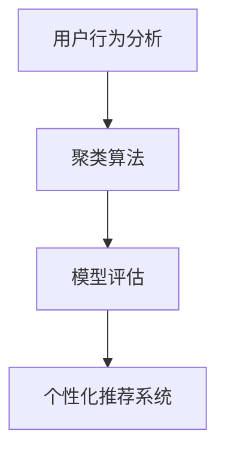

                 

# 如何进行有效的用户分层

在用户数据中，不同用户的行为、兴趣、需求存在显著差异。为了实现更加精准、个性化的服务，需对用户进行有效的分层，将用户分为具有相似特征和需求的群体，从而提供有针对性的服务。本文将系统介绍用户分层的原理、方法和应用，帮助读者掌握如何高效、准确地对用户进行分层。

## 1. 背景介绍

### 1.1 问题由来

随着互联网技术的迅猛发展和社交媒体的普及，大量用户数据被收集、分析和应用。然而，如何从海量数据中提取出有价值的信息，并对用户进行有效的分组，成为了一个核心挑战。用户分层的目标是为不同用户群体提供个性化的服务，提升用户体验，增加用户粘性，同时也为营销、运营、产品设计等提供数据支撑。

### 1.2 问题核心关键点

用户分层的过程主要涉及以下几个关键点：
- **用户行为建模**：分析用户在不同场景下的行为数据，提取有意义的特征。
- **聚类算法选择**：选择合适的聚类算法对用户进行分组。
- **模型评估与优化**：评估聚类效果，并不断优化模型和算法。
- **应用与迭代**：根据分层结果优化产品和服务，并持续迭代。

这些关键点紧密相连，相互影响。只有从数据采集、模型构建、评估优化到应用迭代这一系列过程共同推进，才能实现有效的用户分层。

## 2. 核心概念与联系

### 2.1 核心概念概述

为更好地理解用户分层的过程，本节将介绍几个核心概念：

- **用户行为分析**：通过对用户的行为数据进行统计、分析和建模，挖掘用户的兴趣、需求和行为特征。
- **聚类算法**：一种无监督学习方法，用于将具有相似特征的样本分为同一类，从而实现用户分层。
- **模型评估指标**：用于衡量用户分层的准确性、稳定性和可用性的指标。
- **个性化推荐系统**：根据用户分层结果，为不同用户群体提供定制化推荐服务，提升用户满意度。

这些核心概念之间的逻辑关系可以通过以下Mermaid流程图来展示：



这个流程图展示了几大核心概念之间的联系：

1. 用户行为分析提供数据基础。
2. 聚类算法实现用户分层。
3. 模型评估验证分层效果。
4. 个性化推荐系统应用分层结果。

这些概念共同构成了用户分层的核心框架，有助于理解和解决用户分层的关键问题。

## 3. 核心算法原理 & 具体操作步骤

### 3.1 算法原理概述

用户分层的核心算法原理是聚类算法。聚类算法的目标是在无监督学习的前提下，将数据集中的样本分成多个子集，每个子集内部具有较高的相似性，而不同子集之间的相似性较低。用户分层的具体实现中，通常采用K-means、层次聚类、DBSCAN等经典聚类算法，或更复杂的深度学习聚类方法，如GNN、图神经网络等。

### 3.2 算法步骤详解

用户分层的步骤主要包括数据准备、模型训练、结果评估和应用迭代，具体流程如下：

**Step 1: 数据准备**
- 收集用户数据，包括行为数据（如浏览记录、点击行为、购买记录等）、属性数据（如性别、年龄、地域等）。
- 数据预处理，包括数据清洗、特征提取、归一化等。

**Step 2: 模型训练**
- 选择合适的聚类算法，对处理后的数据进行模型训练。
- 调整模型参数，如聚类数、迭代次数等。
- 使用交叉验证或留出法验证模型效果。

**Step 3: 结果评估**
- 使用评价指标（如轮廓系数、Calinski-Harabasz指数、Davies-Bouldin指数等）评估模型聚类效果。
- 可视化聚类结果，分析聚类簇分布情况。

**Step 4: 应用迭代**
- 根据分层结果，对不同用户群体提供个性化服务。
- 持续收集反馈，不断优化聚类模型和算法。
- 更新数据，重新进行聚类和分层。

### 3.3 算法优缺点

用户分层的聚类算法具有以下优点：
- 无需标注数据，适用于大规模无标签数据的处理。
- 能够发现数据集中的隐藏模式和结构，实现数据挖掘。
- 对数据分布的假设较少，适用范围广。

同时，该算法也存在以下局限性：
- 结果具有主观性，聚类数的选择和模型参数的调整可能影响聚类效果。
- 聚类算法对数据质量和特征选择敏感，特征不相关或噪声数据会影响聚类效果。
- 难以解释聚类结果，聚类过程的透明度较低。

尽管存在这些局限性，但聚类算法仍是用户分层的核心手段，通过不断优化模型和参数，可以提升聚类效果，实现更有效的用户分层。

### 3.4 算法应用领域

用户分层的聚类算法广泛应用于多个领域，包括：

- **电商推荐系统**：对用户购买行为进行聚类，提供个性化商品推荐。
- **社交网络分析**：对用户互动数据进行聚类，发现用户社区和兴趣群体。
- **营销分析**：对用户行为数据进行聚类，制定精准营销策略。
- **内容推荐**：对用户兴趣进行聚类，提供定制化内容推荐。

这些领域中的用户分层，有助于提升用户体验，优化资源配置，增加用户忠诚度和满意度。

## 4. 数学模型和公式 & 详细讲解 & 举例说明

### 4.1 数学模型构建

本节将使用数学语言对用户分层的聚类算法进行更加严格的刻画。

记用户数据集为 $\mathcal{D}=\{x_1,x_2,\cdots,x_n\}$，每个样本 $x_i$ 包含多个特征 $f_1,f_2,\cdots,f_m$。假设聚类数为 $K$，则聚类模型为：

$$
\mathcal{C}=\{\mathcal{C}_1,\mathcal{C}_2,\cdots,\mathcal{C}_K\}
$$

其中 $\mathcal{C}_k$ 表示聚类簇 $k$，每个用户 $x_i$ 归属于簇 $\mathcal{C}_k$。

聚类算法的目标是找到最优的聚类簇划分 $\mathcal{C}$，使得每个样本 $x_i$ 到其所属簇的平均距离最小。常见的距离度量包括欧式距离、曼哈顿距离、余弦相似度等。

### 4.2 公式推导过程

以K-means算法为例，其基本思想是将数据集划分为 $K$ 个簇，每个簇的质心为样本的平均值。具体步骤如下：

1. 初始化聚类中心：随机选取 $K$ 个样本作为初始聚类中心。
2. 分配样本：计算每个样本到聚类中心的距离，分配到距离最近的簇中。
3. 更新聚类中心：重新计算每个簇的质心，即簇内所有样本的平均值。
4. 迭代更新：重复2、3步骤，直至聚类中心不再变化或达到预设迭代次数。

公式化表达如下：

设 $\mu_k$ 为簇 $k$ 的质心，则：

$$
\mu_k = \frac{1}{N_k} \sum_{x_i \in \mathcal{C}_k} x_i
$$

其中 $N_k$ 为簇 $k$ 内样本数量。

聚类算法通过不断迭代优化聚类中心和簇分配，直至达到稳定状态。

### 4.3 案例分析与讲解

以电商推荐系统为例，假设用户数据集为 $\mathcal{D}=\{u_1,u_2,\cdots,u_n\}$，每个用户 $u_i$ 包含特征 $f_1,f_2,\cdots,f_m$，如浏览记录、点击行为、购买记录等。采用K-means算法对用户进行聚类，具体步骤如下：

1. 随机选取 $K$ 个用户作为初始聚类中心。
2. 计算每个用户到聚类中心的距离，分配到距离最近的簇中。
3. 更新每个簇的质心，重新计算聚类中心。
4. 重复迭代，直至聚类中心不再变化或达到预设迭代次数。

最终的聚类结果将用户分为 $K$ 个聚类簇，每个簇内的用户具有相似的购买行为和兴趣偏好，可以针对性地进行推荐。

## 5. 项目实践：代码实例和详细解释说明

### 5.1 开发环境搭建

在进行用户分层项目实践前，我们需要准备好开发环境。以下是使用Python进行K-means分层的开发环境配置流程：

1. 安装Anaconda：从官网下载并安装Anaconda，用于创建独立的Python环境。

2. 创建并激活虚拟环境：
```bash
conda create -n py32 python=3.8
conda activate py32
```

3. 安装必要的Python包：
```bash
pip install numpy pandas sklearn
```

4. 安装K-means库：
```bash
pip install scikit-learn
```

完成上述步骤后，即可在`py32`环境中开始用户分层实践。

### 5.2 源代码详细实现

这里我们以电商推荐系统为例，给出使用scikit-learn库对用户进行K-means分层的PyTorch代码实现。

首先，定义数据处理函数：

```python
from sklearn.preprocessing import MinMaxScaler
from sklearn.metrics import silhouette_score

def preprocess_data(data):
    # 数据归一化
    scaler = MinMaxScaler()
    data_scaled = scaler.fit_transform(data)
    return data_scaled

def cluster_user(data, k, max_iter=300):
    # 对用户进行K-means聚类
    kmeans = KMeans(n_clusters=k, max_iter=max_iter)
    kmeans.fit(data)
    return kmeans.labels_
```

然后，加载和处理用户数据：

```python
import pandas as pd

# 加载用户数据
user_data = pd.read_csv('user_data.csv')

# 数据预处理
user_data = preprocess_data(user_data.values)

# 用户聚类
kmeans_labels = cluster_user(user_data, k=5)
```

最后，输出聚类结果并进行模型评估：

```python
from sklearn.metrics import silhouette_score

# 计算轮廓系数
silhouette_avg = silhouette_score(user_data, kmeans_labels)

# 输出聚类结果
print(f"K-means聚类结果：{kmeans_labels}")
print(f"轮廓系数：{silhouette_avg}")
```

以上就是使用scikit-learn对用户进行K-means分层的完整代码实现。可以看到，scikit-learn提供了简单易用的K-means算法接口，方便用户进行聚类操作。

### 5.3 代码解读与分析

让我们再详细解读一下关键代码的实现细节：

**preprocess_data函数**：
- 定义了数据归一化过程，使用MinMaxScaler对数据进行归一化处理。

**cluster_user函数**：
- 对用户数据进行K-means聚类，返回每个用户所属的聚类簇标签。

**用户数据加载和处理**：
- 使用pandas库加载用户数据，并对数据进行预处理。
- 调用preprocess_data函数对数据进行归一化处理，确保数据在同一量纲。
- 调用cluster_user函数对用户进行聚类，获取每个用户所属的聚类簇标签。

**模型评估**：
- 计算聚类结果的轮廓系数，评估聚类效果。
- 输出聚类结果和轮廓系数，方便后续分析和应用。

可以看到，scikit-learn库提供了简单易用的聚类算法接口，使得用户分层的代码实现变得简洁高效。开发者可以将更多精力放在数据处理、模型优化等高层逻辑上，而不必过多关注底层的实现细节。

## 6. 实际应用场景

### 6.1 智能推荐系统

用户分层技术在智能推荐系统中有着广泛应用。通过对用户行为数据进行聚类，可以发现具有相似兴趣和需求的用户群体，实现更加精准的推荐服务。

在具体实践中，可以将用户行为数据（如浏览记录、点击行为、购买记录等）作为特征，使用聚类算法对用户进行分组，每个簇内的用户具有相似的兴趣偏好。根据聚类结果，针对性地进行商品推荐，提升用户满意度和转化率。

### 6.2 社交网络分析

用户分层技术在社交网络分析中也有着重要应用。通过分析用户互动数据，可以发现用户社区和兴趣群体，实现更加精准的内容分发和个性化服务。

在具体实践中，可以将用户互动数据（如点赞、评论、分享等）作为特征，使用聚类算法对用户进行分组，每个簇内的用户具有相似的互动行为和兴趣偏好。根据聚类结果，对不同用户群体推送定制化内容，提高用户参与度和粘性。

### 6.3 个性化广告投放

用户分层技术在个性化广告投放中也有着重要应用。通过对用户行为数据进行聚类，可以发现具有相似兴趣和需求的用户群体，实现更加精准的广告投放。

在具体实践中，可以将用户行为数据（如浏览记录、点击行为、购买记录等）作为特征，使用聚类算法对用户进行分组，每个簇内的用户具有相似的兴趣偏好。根据聚类结果，对不同用户群体进行个性化广告投放，提高广告点击率和转化率。

### 6.4 未来应用展望

随着用户分层技术的不断发展，其在更多领域将得到应用，为传统行业带来变革性影响。

在智慧医疗领域，用户分层技术可以用于分析患者健康数据，提供个性化诊疗建议，提升医疗服务的智能化水平。

在智能教育领域，用户分层技术可以用于分析学生学习数据，提供个性化学习路径，促进教育公平，提高教学质量。

在智慧城市治理中，用户分层技术可以用于分析居民行为数据，优化城市管理策略，提高城市管理的自动化和智能化水平，构建更安全、高效的未来城市。

## 7. 工具和资源推荐

### 7.1 学习资源推荐

为了帮助开发者系统掌握用户分层的理论基础和实践技巧，这里推荐一些优质的学习资源：

1. 《K-means算法入门与实践》系列博文：由数据科学专家撰写，深入浅出地介绍了K-means算法的基本原理、优缺点及应用场景。

2. 《Python聚类分析》书籍：详细介绍了Python中常用的聚类算法和实现方法，结合实际案例进行讲解。

3. 《聚类分析》课程：统计学专业的经典课程，系统讲解了聚类算法的数学基础和实际应用。

4. 《用户行为分析与数据挖掘》书籍：深入探讨了用户行为数据的建模、分析和应用，结合实际案例进行讲解。

5. 《用户行为分析实战》视频教程：通过实际案例，详细讲解了用户行为分析的方法和应用。

通过对这些资源的学习实践，相信你一定能够快速掌握用户分层的精髓，并用于解决实际的业务问题。

### 7.2 开发工具推荐

高效的开发离不开优秀的工具支持。以下是几款用于用户分层开发的常用工具：

1. Python：开源且灵活的编程语言，拥有丰富的数据处理和机器学习库。

2. scikit-learn：基于Python的数据挖掘和机器学习库，提供了简单易用的聚类算法接口。

3. PyTorch：基于Python的深度学习框架，灵活高效，适用于大规模聚类任务的实现。

4. TensorBoard：TensorFlow配套的可视化工具，可实时监测聚类模型的训练状态，提供丰富的图表呈现方式。

5. Weights & Biases：模型训练的实验跟踪工具，可以记录和可视化模型训练过程中的各项指标，方便对比和调优。

6. Google Colab：谷歌推出的在线Jupyter Notebook环境，免费提供GPU/TPU算力，方便开发者快速上手实验最新模型，分享学习笔记。

合理利用这些工具，可以显著提升用户分层的开发效率，加快创新迭代的步伐。

### 7.3 相关论文推荐

用户分层技术的发展源于学界的持续研究。以下是几篇奠基性的相关论文，推荐阅读：

1. K-means: A Method for Clustering in Spaces of Limited Dimensionality：K-means算法原始论文，介绍了K-means算法的基本原理和应用。

2. Hierarchical Clustering：层次聚类算法原始论文，介绍了层次聚类算法的基本原理和实现方法。

3. Density-Based Clustering using Hierarchical Clustering Methods：DBSCAN算法原始论文，介绍了DBSCAN算法的基本原理和实现方法。

4. Factorization Machines with Feature Interactions for Personalized Recommendation: A Unified Approach：介绍了因子分解机（FM）在个性化推荐中的应用，结合用户分层进行推荐。

5. Deep Clustering: A Survey：介绍了深度学习在聚类中的最新进展和应用，包括GNN、图神经网络等深度聚类方法。

这些论文代表了大用户分层的技术发展脉络。通过学习这些前沿成果，可以帮助研究者把握学科前进方向，激发更多的创新灵感。

## 8. 总结：未来发展趋势与挑战

### 8.1 总结

本文对用户分层的原理、方法和应用进行了全面系统的介绍。首先阐述了用户分层的背景和意义，明确了用户分层在提升用户体验和运营效率方面的重要作用。其次，从原理到实践，详细讲解了用户分层的数学原理和关键步骤，给出了用户分层任务开发的完整代码实例。同时，本文还广泛探讨了用户分层技术在多个行业领域的应用前景，展示了用户分层范式的巨大潜力。此外，本文精选了用户分层技术的各类学习资源，力求为读者提供全方位的技术指引。

通过本文的系统梳理，可以看到，用户分层技术在现代互联网应用中具有重要地位，极大地提升了用户体验和运营效率。未来，伴随数据科学、机器学习等技术的不断进步，用户分层技术将进一步优化和提升，为互联网行业带来更多的创新和突破。

### 8.2 未来发展趋势

展望未来，用户分层技术将呈现以下几个发展趋势：

1. 自动化与智能化：自动化聚类算法将更加普及，通过机器学习和深度学习技术，实现用户分层的自动化和智能化，减少人工干预。

2. 多模态融合：用户行为数据不再局限于单一模态，多模态数据（如文本、图像、视频等）的融合，将提供更全面、更深入的用户行为分析。

3. 数据隐私保护：用户数据隐私保护成为重要课题，用户分层技术需要采用匿名化、差分隐私等技术，确保数据安全。

4. 实时化与动态化：用户行为数据实时采集和动态分析将成为常态，用户分层需要实现实时化和动态化，支持即时反馈和调整。

5. 跨领域应用：用户分层技术将广泛应用于更多领域，如医疗、金融、教育等，为行业提供数据驱动的决策支持。

以上趋势凸显了用户分层技术的广阔前景。这些方向的探索发展，必将进一步提升用户体验，优化资源配置，推动用户分层的广泛应用。

### 8.3 面临的挑战

尽管用户分层技术已经取得了显著成就，但在迈向更加智能化、普适化应用的过程中，它仍面临着诸多挑战：

1. 数据质量和标注成本：用户数据质量参差不齐，标注成本高昂，如何保证数据质量，降低标注成本，是一大难题。

2. 聚类算法复杂度：传统的聚类算法难以处理高维、复杂数据，如何设计更高效、更鲁棒的聚类算法，是技术难题。

3. 模型可解释性：聚类算法的结果难以解释，用户分层过程的透明性较低，如何提高聚类过程的可解释性，增强用户信任。

4. 实时性和动态性：用户行为数据实时性要求高，如何实现高效、低延迟的聚类和分层，是技术挑战。

5. 隐私和安全：用户数据隐私和安全问题凸显，如何在聚类过程中保护用户隐私，确保数据安全，是重要课题。

6. 多模态数据融合：用户行为数据多种多样，如何实现多模态数据的融合，提升聚类效果，是一大难题。

正视用户分层面临的这些挑战，积极应对并寻求突破，将是大规模用户分层的必由之路。相信随着学界和产业界的共同努力，这些挑战终将一一被克服，用户分层技术必将在构建人机协同的智能时代中扮演越来越重要的角色。

### 8.4 未来突破

面对用户分层所面临的种种挑战，未来的研究需要在以下几个方面寻求新的突破：

1. 探索自动化聚类算法：引入深度学习、强化学习等先进技术，实现聚类算法的自动化，减少人工干预，提高效率。

2. 研究高效聚类算法：设计高效、鲁棒的聚类算法，能够处理高维、复杂数据，提升聚类效果。

3. 引入可解释性技术：使用可解释性方法，如LIME、SHAP等，提升聚类过程的可解释性，增强用户信任。

4. 优化实时聚类算法：引入流式计算、增量学习等技术，实现实时、动态的用户分层，支持即时反馈和调整。

5. 保护用户隐私安全：引入差分隐私、联邦学习等技术，保护用户数据隐私和安全。

6. 多模态数据融合技术：研究多模态数据的融合方法，提升用户行为分析的全面性和准确性。

这些研究方向的探索，必将引领用户分层技术迈向更高的台阶，为构建安全、可靠、可解释、可控的智能系统铺平道路。面向未来，用户分层技术还需要与其他人工智能技术进行更深入的融合，如知识表示、因果推理、强化学习等，多路径协同发力，共同推动自然语言理解和智能交互系统的进步。只有勇于创新、敢于突破，才能不断拓展用户分层的边界，让智能技术更好地造福人类社会。

## 9. 附录：常见问题与解答

**Q1: 用户分层与聚类有什么区别？**

A: 用户分层与聚类都是无监督学习方法，但它们的应用场景和目标有所不同。聚类的目标是发现数据中的自然分组，适用于发现数据的内在结构和规律。而用户分层则是在特定应用场景下，对用户数据进行分组，以便更好地提供个性化服务。

**Q2: 用户分层对标注数据的需求有多高？**

A: 用户分层通常采用无监督学习的方法，因此对标注数据的需求较低。但为了更好地理解和解释聚类结果，通常会对聚类结果进行人工标注，以验证聚类的准确性。

**Q3: 用户分层的效果如何评估？**

A: 用户分层的效果通常通过聚类效果的评价指标（如轮廓系数、Calinski-Harabasz指数、Davies-Bouldin指数等）进行评估。通过可视化聚类结果，可以直观地观察聚类簇的分布情况，进一步分析聚类效果。

**Q4: 用户分层的实际应用有哪些？**

A: 用户分层技术广泛应用于智能推荐系统、社交网络分析、个性化广告投放等多个领域。通过聚类算法对用户进行分组，可以实现更加精准的服务和推荐，提升用户体验和运营效率。

通过本文的系统梳理，可以看到，用户分层技术在现代互联网应用中具有重要地位，极大地提升了用户体验和运营效率。未来，伴随数据科学、机器学习等技术的不断进步，用户分层技术将进一步优化和提升，为互联网行业带来更多的创新和突破。

